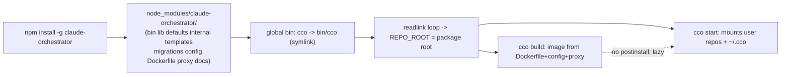

# Handover C (POST-MERGE / develop · release-gating) — npm packaging & distribution

> **Created**: 2026-06-29 · **Updated**: 2026-06-30 (analysis session — decisions taken + audit findings,
> see [§7](#7-analysis-session-2026-06-30--decisions--audit-findings); **then a design session** that
> formalized everything into **[ADR-0037](decisions/0037-npm-packaging-distribution.md)** + the living
> **[release-engineering design doc](design/packaging-distribution.md)** — those are now the source of
> truth; the OPEN questions in §4.1/§7.1 are resolved there and annotated below). · **Track**: release engineering.
> Runs on `develop` **after** the v1 merge; **gates the public release on `main`** (you cannot distribute
> v1 without a package).
> **Priority**: high (maintainer flagged it explicitly).
> **Siblings**: Handover A (docs/CLI cutover sweep — ✅ done, merged into `develop`) ·
> Handover B (`../configuration/decentralized-config/config-editor-access-design-handoff.md`,
> develop) · **the opinionated-extraction + `cco update` refactor**
> ([`opinionated-extraction-and-update-refactor-handoff.md`](opinionated-extraction-and-update-refactor-handoff.md)) —
> a **separate, sequenced-after-C** workstream. B and C are parallel develop-track workstreams;
> **C is release-gating, B is additive.** The opinionated extraction is **explicitly decoupled from C**
> (packaging does not require it) and runs **after** C.

Coordination artifact — the design decisions belong in a new ADR (next free for C = **0037**, since B
takes 0036) and a release-engineering design doc under `docs/maintainers/engineering/`. The opinionated
extraction gets its **own** ADR (next free = **0040**) in its own workstream.

---

## 1. Goal

Ship `claude-orchestrator` (the `cco` CLI) as an installable **npm package** so users get
`npm install -g …` (or `npx`) instead of clone-and-symlink. Define package shape, what is bundled, how
the Docker image + Go proxy are obtained at runtime, and the version coupling.

## 2. Current state (code-grounded)

- **No packaging artifacts**: no `package.json`, `install.sh`, Homebrew `Formula/`, or `.npmignore`.
  Today's "install" = clone the repo and put `bin/cco` on `PATH`.
- **`bin/cco` is a bash CLI** (bash 3.2+, macOS default `/bin/bash`), not a node program. It resolves
  its own location with a **macOS-safe readlink loop** (`bin/cco:13-21`) → `REPO_ROOT`, then sources
  `lib/*.sh` from `$REPO_ROOT/lib`. There is already a `CCO_FRAMEWORK_ROOT` seam
  (`FRAMEWORK_ROOT="${CCO_FRAMEWORK_ROOT:-$REPO_ROOT}"`, `bin/cco:28`).
- **The package must carry the whole framework tree**, not just `bin/`: `lib/`, `defaults/` (managed +
  global), `internal/` (tutorial, config-editor), `templates/`, `migrations/`, `config/` (Dockerfile
  context: entrypoint, tmux, hooks), `Dockerfile`, `.dockerignore`, `proxy/` (Go source), `changelog.yml`,
  and `docs/` (the built-ins mount it read-only).
- **Docker image** is built on the host by `cco build` from the repo as build context; **`proxy/`** is a
  Go binary (`proxy/Makefile`) baked into the image.

## 3. What npm packaging entails (design surface)

1. **`package.json`**:
   - `"bin": { "cco": "bin/cco" }` → npm creates the `cco` shim in the global bin dir as a symlink into
     `…/node_modules/claude-orchestrator/bin/cco`. The readlink loop already resolves through symlinks, so
     `REPO_ROOT` lands on the installed package root — **verify** on macOS + Linux (npm bin symlink depth).
   - `"files"`: explicit allowlist of the framework tree above (don't ship tests, `.git`, reviews).
   - `"engines"`, `"os"` (darwin + linux), `"version"` (the cco release version).
   - **No heavy `postinstall`** — do NOT build the Docker image on `npm install` (slow, needs Docker, may
     run in CI). The image is built lazily by `cco build` / first `cco start` (unchanged).
2. **Package name / scope**: check registry availability — `claude-orchestrator` vs a scoped
   `@<org>/cco` / `@<org>/claude-orchestrator`. Decide the public `cco` command name collision story.
3. **Docker build context when installed via npm**: `cco build` must find the `Dockerfile` + `config/` +
   `proxy/` relative to `FRAMEWORK_ROOT`. Confirm every build/runtime path derives from `FRAMEWORK_ROOT`/
   `REPO_ROOT` (not cwd) so an npm-installed, read-only `node_modules` location works. Image tag should
   encode the cco version.
4. **Go proxy distribution**: build from source in `cco build` (needs Go toolchain in the image build, as
   today) **or** ship a prebuilt binary in the package. Prefer building inside the Docker image build (no
   host Go dependency, multi-arch handled by the image) — confirm that still holds when the context is an
   npm dir.
5. **Version coupling**: package version ↔ Docker image tag ↔ pinned Claude Code version
   (`cco build --claude-version`). Define the source of truth (likely `package.json` `version` →
   image tag) and how `cco update` / changelog interact with an npm-distributed install (migrations still
   run; the framework tree is now under `node_modules`, read-only — verify the update engine writes only
   to `~/.cco` / STATE / the user's repos, never into the package).
6. **Read-only install location**: an npm global install dir may be root-owned/read-only. Audit that cco
   never writes inside `FRAMEWORK_ROOT` (the `CCO_FRAMEWORK_ROOT` seam was added precisely to keep tracked-
   tree writes out of the suite; re-use that audit). All mutable state already lives in `~/.cco` +
   XDG STATE/CACHE/DATA + the user's repos — confirm exhaustively for the npm layout.
7. **Release pipeline**: `npm publish` (and/or `npx` support), tag on `main`, optionally a GitHub release.
   Decide CI vs manual publish; `.npmignore`/`files` hygiene (no secrets, no `reviews/`, no `tests/`).



## 4. Open questions for the maintainer

> **Status after the 2026-06-30 analysis session.** Several are now decided — see
> [§7](#7-analysis-session-2026-06-30--decisions--audit-findings) for the full rationale.

1. **Package name** — unscoped `claude-orchestrator` or scoped `@<org>/…`? Keep the command `cco`?
   → **DECIDED (ADR-0037 D2): `@claude-orchestrator/cco`.** Registry checked 2026-06-30 — unscoped
   `claude-orchestrator` **and** `cco` are both **taken** (an unrelated 2025 `1.0.x`; "color transfer"),
   so a scope is forced; `@claude-orchestrator/cco` is **free**. Command stays the prefix-free `cco`.
   Dedicated **npm org + GitHub org `claude-orchestrator`** (both free for public) own the scope/Pages/repo
   home; discoverability via `keywords`. Org creation is a maintainer action (ADR-0037 O2).
2. **Proxy** — build-in-image (host Go-free) vs prebuilt-binary-in-package (multi-arch matrix)?
   → **DECIDED: build-in-image** (no host Go dependency; the binary only runs in the Linux container, so a
   prebuilt darwin binary would be dead weight).
3. **Publish** — manual `npm publish` from Mac, or CI on a `main` tag?
   → **DECIDED & IMPLEMENTED: `release.sh` + CI-on-tag via npm Trusted Publishing (OIDC), no token.**
   `release.sh` (run by the maintainer) bumps `package.json` version + annotated tag + push; the tag triggers
   a CI workflow that runs the suite + the **read-only `FRAMEWORK_ROOT` gate** + hygiene + `npm publish`.
   Auth refined from "token in CI" → **Trusted Publishing/OIDC** (npm deprecated long-lived CI tokens);
   first publish bootstrapped manually. See ADR-0037 D6.
4. **Homebrew** — offer later, or npm-only for v1? → **npm-only for v1** (Homebrew deferred post-v1).
5. **`cco update` vs `npm update -g`** — does framework discovery change when the tree lives in
   `node_modules`? → **DIRECTION SET, full work deferred.** v1: `cco update` becomes **provenance-aware**
   (it knows whether cco was installed via clone / npm / brew) and at minimum **prints the right engine-update
   command**; the engine-update orchestration + the split of update responsibilities (cco-core/migrations
   vs external shared-source/3-way-merge) is a **dedicated workstream** — see the opinionated-extraction +
   update-refactor handoff. See §7.5.

## 5. Definition of done
- `package.json` (+ `files`/`.npmignore`) builds a clean tarball (`npm pack`) carrying the full framework
  tree and nothing private; `npm i -g ./<tgz>` yields a working `cco` on macOS **and** Linux.
- `cco build` + `cco start` + `cco update` all work from the installed (read-only) package location; no
  write ever lands inside `FRAMEWORK_ROOT`.
- **`USER_CONFIG_DIR` no longer defaults inside the framework** (the one real read-only violation found in
  audit — see §7.3) and **`cco start tutorial` / `cco start config-editor` work from an npm install**.
- **A read-only `FRAMEWORK_ROOT` test exists** (suite run with `CCO_FRAMEWORK_ROOT` → a `chmod 0555` tree)
  and is green — this is the publish gate.
- Version coupling documented (package ↔ image tag ↔ Claude Code pin).
- ADR-0037 records the packaging decisions; an `engineering/` design doc captures the release pipeline.
- **Release**: `develop → main`, tag, `npm publish` — the v1 public release.

## 6. Risk
The biggest correctness risk is a **hidden write into `FRAMEWORK_ROOT`** that works from a clone but fails
on a read-only npm install. Mitigation: re-use the `CCO_FRAMEWORK_ROOT` test seam to run the whole suite
with the framework tree marked read-only before publishing. **Audit done (2026-06-30): exactly one
violation found** (`USER_CONFIG_DIR` → tutorial/config-editor runtime setup) — see §7.3.

## 7. Analysis session 2026-06-30 — decisions & audit findings

This section records the analysis run with the maintainer on 2026-06-30: three targeted audits (referenced-
resource / distribution gap; `FRAMEWORK_ROOT` write-risk; axis-2 sharing-model completeness) plus the
decisions taken. It supersedes the unqualified open questions in §4 where marked DECIDED; the formal
record will land in **ADR-0037**.

### 7.1 Distribution: what the package must carry (gap audit)

`docs/` **is consumed at runtime** and must ship — but only the user-facing subtree:

- The built-in **config-editor** mounts `$REPO_ROOT/docs` → `/workspace/cco-docs` read-only
  (`lib/cmd-start.sh:77`); the **tutorial** and config-editor reference specific paths under `docs/users/…`
  (`internal/tutorial/.claude/CLAUDE.md:62-84`).
- `docs/maintainers/` and `docs/archive/` are **not** referenced by the runtime (human-only).

**Correction to a sub-audit mistake:** `config/`, `proxy/`, and `Dockerfile` are **NOT** "build-time only /
excludable". `cco build` runs `docker build "$REPO_ROOT"` **on the user's host from the installed package**,
so the whole build context — `Dockerfile` + `config/` (entrypoint, hooks, tmux) + `proxy/` (Go source) +
`defaults/managed/` — **must be in the package**.

**`files` allowlist (no runtime gap):**
```
INCLUDE:  bin/ lib/ config/ defaults/ templates/ internal/ migrations/
          proxy/ docs/users/ Dockerfile .dockerignore changelog.yml
          package.json README.md LICENSE
EXCLUDE:  tests/ scripts/ user-config/ docs/maintainers/ docs/archive/
          .github/ .git/ .cco/ .claude/ CONTRIBUTING.md SECURITY.md
```

**Decision — `docs/users/` only** (maintainers clone the repo for the full tree). Requires a small change:
point the config-editor mount + tutorial references at `docs/users` (they already use `users/…` paths).

**Docs accessibility & home (decision 1a/1b) — DECIDED (ADR-0037 D9):**
- **(a)** User guides are sufficient for the agents → **`docs/users` only** mounted (unchanged). Maintainer
  docs/source are **not** mounted into tutorial/config-editor.
- **(b)** **Single source = `docs/users/`, three consumers**: agent mounts · a local **`cco docs`** (offline,
  version-matched) · a **GitHub Pages renderer** of the same tree (free for public repos). One source, many
  renderers → no drift. **Pages v1 = `docs/users/` only**; `docs/maintainers/` stay browsable on the public
  repo (not rendered as a polished site); a selective "Architecture/Contributing" Pages section is reserved
  post-v1. See the [design doc §6–§7](design/packaging-distribution.md).

### 7.2 Install mechanism & the `cco` command (decision 2 — OPEN, leaning global)

Today `cco` is on `PATH` (symlink to `bin/cco`), runnable from any cwd in any session. npm changes the
options:
- **Global `npm i -g` (recommended)** — one install, the plain `cco` command works from any cwd (most
  natural for an orchestrator that operates on arbitrary repos). No `npx`/`npm` prefix for daily use.
- **Per-repo `npm i`** — version can diverge per repo; wrong model for a host-level orchestrator.
- **`npx` — documented one-time only**, with an **explicit warning** that it is a "try-once", not a usage
  model (re-downloading the framework per invocation of a Docker orchestrator is pointless/slow).

→ Keep `cco` as a **prefix-free global command**; pick the package name (§4.1) to keep the `cco` bin shim
clean. Final name/scope still OPEN pending registry check.

### 7.3 Read-only `FRAMEWORK_ROOT` audit — exactly one violation

All mutable writes already target `~/.cco` / XDG STATE/CACHE/DATA **except one**:

- `USER_CONFIG_DIR="${CCO_USER_CONFIG_DIR:-$REPO_ROOT/user-config}"` (`bin/cco:42`) points **inside the
  framework**. The tutorial/config-editor runtime setup writes under it
  (`lib/cmd-start.sh:15,21,24-33,53,57,60-63`) → works from a clone, **fails read-only on npm**.
- **Fix:** relocate the default out of the framework, e.g.
  `USER_CONFIG_DIR="${CCO_USER_CONFIG_DIR:-$(_cco_state_dir)/internal}"` (machine-local STATE, writable).
  Aligns with the maintainer's directive (decision C): **nothing should write into the legacy `user-config/`
  anymore** — the decentralized-config model uses the XDG buckets + CONFIG per classified resource type;
  `user-config/` and the `claude-orchestrator` repo itself are **no longer used by end users**, so
  `user-config/` is **excluded from the package** (legacy vault, migration-only).
- **Everything else is clean**: `cco build` (build context only), generated compose/`packs.md`/`workspace.yml`
  → CACHE, `defaults/global` copy reads-framework/writes-`~/.cco`, `changelog.yml` is read-only at runtime.

### 7.4 Release pipeline (decision 3 — DECIDED)

`release.sh` (local, maintainer-run) → bump `package.json` version + annotated git tag + push. **CI-on-tag**
workflow → run suite + **read-only `FRAMEWORK_ROOT` gate** + hygiene + `npm publish`. **Auth = npm Trusted
Publishing (OIDC), no stored token** (refined 2026-06-30 — npm deprecated long-lived CI tokens / removed
classic automation tokens; the workflow sets `id-token: write` and the first publish is bootstrapped
manually so the package exists before its trusted publisher is configured). Preferred over pure-manual
publish because the read-only gate runs automatically on every release. See ADR-0037 D6.

### 7.5 `cco update` vs `npm update` — preventive evaluation (full work deferred)

- **Confusion is real:** `npm update -g claude-orchestrator` updates the **engine**; `cco update` does
  **migrations + user-config discovery**. A user running `cco update` expecting a new framework gets nothing.
- **Seam to preserve now:** make `cco update` **provenance-aware** (clone / npm / brew). v1 minimum: it
  **prints the right command** ("installed via npm → run `npm update -g claude-orchestrator`, then
  `cco update --migrate`").
- **Future direction:** `cco update` becomes an **orchestrator** — detects the install method and runs the
  engine update itself + migrations, one command. This belongs to the **update-refactor workstream** (see
  the opinionated-extraction handoff), which also splits the two responsibility axes (cco-core/migrations
  vs external shared-source/3-way-merge — today mixed in one command).
- **Newly-noticed v0.4.0 migration UX gaps** (carried to that workstream + the backlog):
  1. After `cco init --migrate`, the user is **not reminded that a fresh `cco build` (`--no-cache`?) is
     required before `cco start`** — a new release needs a new image build, currently surfaced nowhere.
  2. Clarify whether `cco update` **as the first command** also performs the **preventive vault backup**
     that other commands do (it should, symmetrically — backing up the old centralized vault), or skips it.
  3. Evaluate whether the decentralized-config migration should **trigger the re-build** itself, or stay
     separate **with an explicit hint** to the user.

### 7.6 `settings.json` decomposition (decision 4 — OPEN, for design)

The global `defaults/global/.claude/settings.json` is **mixed** (permissions allow-list, `teammateMode:tmux`,
cleanup/thinking/attribution). Design must split it into: what is **opinionated and user-editable** vs what
is **functional and must be cco-managed/immutable** to preserve correct cco operation. This straddles the
packaging workstream (what ships as a neutral default) and the opinionated-extraction workstream (what
moves out). Carried to both.
