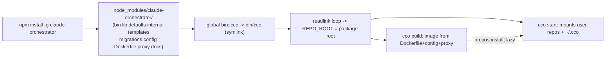

# Handover C (POST-MERGE / develop · release-gating) — npm packaging & distribution

> **Created**: 2026-06-29 · **Track**: release engineering. Runs on `develop` **after** the v1 merge;
> **gates the public release on `main`** (you cannot distribute v1 without a package).
> **Priority**: high (maintainer flagged it explicitly).
> **Siblings**: Handover A (`../configuration/decentralized-config/pre-merge-docs-cutover-handoff.md`,
> pre-merge) · Handover B (`../configuration/decentralized-config/config-editor-access-design-handoff.md`,
> develop). B and C are parallel develop-track workstreams; **C is release-gating, B is additive.**

Coordination artifact — the design decisions belong in a new ADR (next free = **0037**, since B takes
0036) and a release-engineering design doc under `docs/maintainers/engineering/`.

---

## 1. Goal

Ship `claude-orchestrator` (the `cco` CLI) as an installable **npm package** so users get
`npm install -g …` (or `npx`) instead of clone-and-symlink. Define package shape, what is bundled, how
the Docker image + Go proxy are obtained at runtime, and the version coupling.

## 2. Current state (code-grounded)

- **No packaging artifacts**: no `package.json`, `install.sh`, Homebrew `Formula/`, or `.npmignore`.
  Today's "install" = clone the repo and put `bin/cco` on `PATH`.
- **`bin/cco` is a bash CLI** (bash 3.2+, macOS default `/bin/bash`), not a node program. It resolves
  its own location with a **macOS-safe readlink loop** (`bin/cco:13-21`) → `REPO_ROOT`, then sources
  `lib/*.sh` from `$REPO_ROOT/lib`. There is already a `CCO_FRAMEWORK_ROOT` seam
  (`FRAMEWORK_ROOT="${CCO_FRAMEWORK_ROOT:-$REPO_ROOT}"`, `bin/cco:28`).
- **The package must carry the whole framework tree**, not just `bin/`: `lib/`, `defaults/` (managed +
  global), `internal/` (tutorial, config-editor), `templates/`, `migrations/`, `config/` (Dockerfile
  context: entrypoint, tmux, hooks), `Dockerfile`, `.dockerignore`, `proxy/` (Go source), `changelog.yml`,
  and `docs/` (the built-ins mount it read-only).
- **Docker image** is built on the host by `cco build` from the repo as build context; **`proxy/`** is a
  Go binary (`proxy/Makefile`) baked into the image.

## 3. What npm packaging entails (design surface)

1. **`package.json`**:
   - `"bin": { "cco": "bin/cco" }` → npm creates the `cco` shim in the global bin dir as a symlink into
     `…/node_modules/claude-orchestrator/bin/cco`. The readlink loop already resolves through symlinks, so
     `REPO_ROOT` lands on the installed package root — **verify** on macOS + Linux (npm bin symlink depth).
   - `"files"`: explicit allowlist of the framework tree above (don't ship tests, `.git`, reviews).
   - `"engines"`, `"os"` (darwin + linux), `"version"` (the cco release version).
   - **No heavy `postinstall`** — do NOT build the Docker image on `npm install` (slow, needs Docker, may
     run in CI). The image is built lazily by `cco build` / first `cco start` (unchanged).
2. **Package name / scope**: check registry availability — `claude-orchestrator` vs a scoped
   `@<org>/cco` / `@<org>/claude-orchestrator`. Decide the public `cco` command name collision story.
3. **Docker build context when installed via npm**: `cco build` must find the `Dockerfile` + `config/` +
   `proxy/` relative to `FRAMEWORK_ROOT`. Confirm every build/runtime path derives from `FRAMEWORK_ROOT`/
   `REPO_ROOT` (not cwd) so an npm-installed, read-only `node_modules` location works. Image tag should
   encode the cco version.
4. **Go proxy distribution**: build from source in `cco build` (needs Go toolchain in the image build, as
   today) **or** ship a prebuilt binary in the package. Prefer building inside the Docker image build (no
   host Go dependency, multi-arch handled by the image) — confirm that still holds when the context is an
   npm dir.
5. **Version coupling**: package version ↔ Docker image tag ↔ pinned Claude Code version
   (`cco build --claude-version`). Define the source of truth (likely `package.json` `version` →
   image tag) and how `cco update` / changelog interact with an npm-distributed install (migrations still
   run; the framework tree is now under `node_modules`, read-only — verify the update engine writes only
   to `~/.cco` / STATE / the user's repos, never into the package).
6. **Read-only install location**: an npm global install dir may be root-owned/read-only. Audit that cco
   never writes inside `FRAMEWORK_ROOT` (the `CCO_FRAMEWORK_ROOT` seam was added precisely to keep tracked-
   tree writes out of the suite; re-use that audit). All mutable state already lives in `~/.cco` +
   XDG STATE/CACHE/DATA + the user's repos — confirm exhaustively for the npm layout.
7. **Release pipeline**: `npm publish` (and/or `npx` support), tag on `main`, optionally a GitHub release.
   Decide CI vs manual publish; `.npmignore`/`files` hygiene (no secrets, no `reviews/`, no `tests/`).

## 4. Open questions for the maintainer
1. Package name: unscoped `claude-orchestrator` or scoped `@<org>/…`? Keep the command `cco`?
2. Proxy: build-in-image (host Go-free) vs prebuilt-binary-in-package (multi-arch matrix)?
3. Publish: manual `npm publish` from Mac, or CI on a `main` tag?
4. Also offer Homebrew later, or npm-only for v1?
5. Does `cco update`'s framework-discovery model change when the framework lives in `node_modules`
   (update via `npm update -g` for the tree, `cco update` only for migrations + user config)? Define the
   split clearly so the two update paths don't fight.

## 5. Definition of done
- `package.json` (+ `files`/`.npmignore`) builds a clean tarball (`npm pack`) carrying the full framework
  tree and nothing private; `npm i -g ./<tgz>` yields a working `cco` on macOS **and** Linux.
- `cco build` + `cco start` + `cco update` all work from the installed (read-only) package location; no
  write ever lands inside `FRAMEWORK_ROOT`.
- Version coupling documented (package ↔ image tag ↔ Claude Code pin).
- ADR-0037 records the packaging decisions; an `engineering/` design doc captures the release pipeline.
- **Release**: `develop → main`, tag, `npm publish` — the v1 public release.

## 6. Risk
The biggest correctness risk is a **hidden write into `FRAMEWORK_ROOT`** that works from a clone but fails
on a read-only npm install. Mitigation: re-use the `CCO_FRAMEWORK_ROOT` test seam to run the whole suite
with the framework tree marked read-only before publishing.
