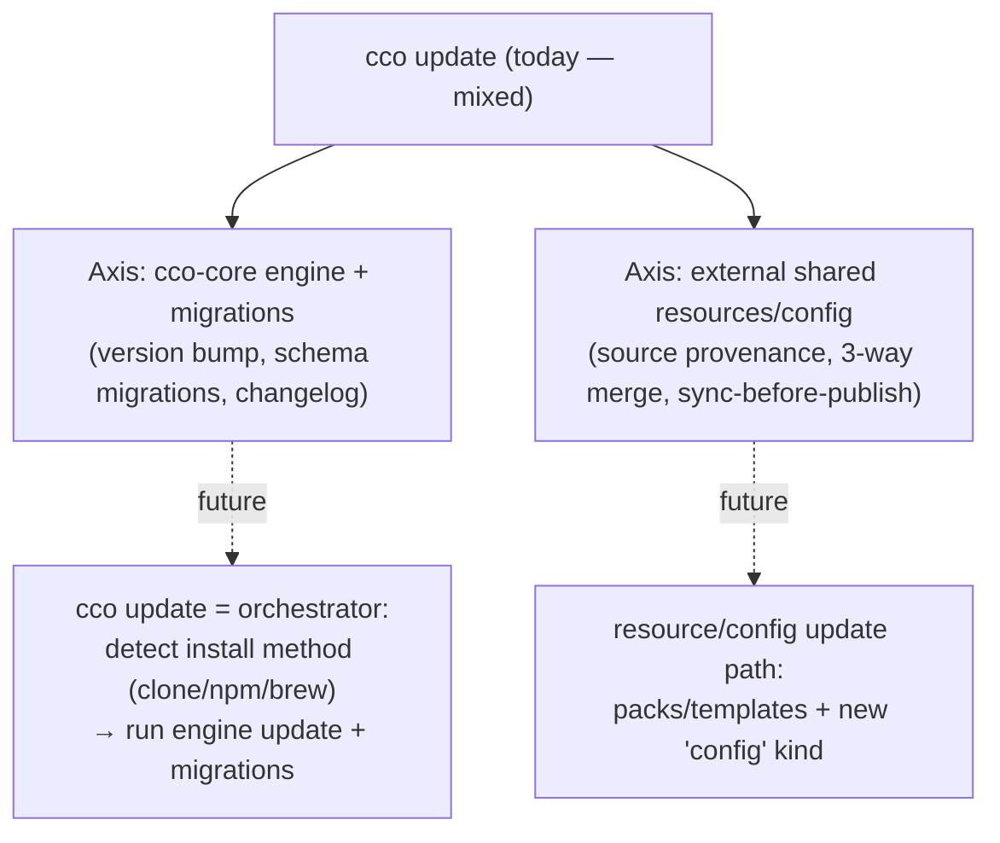

# Handover — opinionated-config extraction + `cco update` responsibility refactor

> **Created**: 2026-06-30 (analysis session). · **Track**: architecture / sharing model. · **Sequencing**:
> runs **after** Handover C (npm packaging — released, handoff removed). Packaging does **not**
> depend on this; this is the structural "core-agnostic" workstream.
> **Design anchor**: realizes **F-opin** (`../configuration/decentralized-config/design.md` §12 Futures),
> previously deferred post-v1. · **Next free ADR = 0040.**

This handover captures the analysis and open questions for two coupled goals the maintainer raised while
scoping npm packaging:

1. **Make the cco core agnostic of opinionated configuration** — keep only the *functional* (`managed/`)
   config baked in; move the *opinionated* defaults (workflow/git/documentation rules, agents, skills,
   global `CLAUDE.md`, parts of `settings.json`) out of the core, into a **separate official axis-2 sharing
   repo** (working name `cco-config-defaults`) that users install like any other shared resource.
2. **Refactor `cco update`** to separate the two responsibilities it currently mixes: **cco-core engine
   update + migrations** vs **update of externally-sourced shared resources/config (3-way merge)**.

It is a **reference for when we resume** — the packaging workstream (Handover C) is tackled first.

---

## 1. Why this is a real piece of work (not just "move some files")

The opinionated defaults today live in `~/.cco/.claude/` (global, applied to every session), seeded
**once** by `cco init` from `defaults/global/`. The axis-2 sharing mechanism (packs/templates) **cannot
populate `~/.cco/.claude/` and cannot track/update it from an external repo.** So "remove the defaults
from the core" has a **prerequisite capability that does not exist yet**. You cannot extract the defaults
until there is a supported way to get them back. That capability is the heart of this workstream.

---

## 2. Managed vs opinionated inventory (code-grounded)

**MANAGED — stays baked into the core** (functional; guarantees cco + Claude Code operation):

- `defaults/managed/` → `/etc/claude-code/`: `CLAUDE.md` (framework hierarchy/Docker/teams),
  `managed-settings.json` (hook infra + deny rules), rules `documentation-first` / `memory-policy` /
  `use-official-docs`, skill `init-workspace`.
- `config/` (entrypoint, hooks, tmux), `templates/*/base` (structural empty scaffolds).

**OPINIONATED — candidate for extraction** (`defaults/global/.claude/`):

- rules: `workflow.md`, `git-practices.md`, `documentation.md`.
- global `CLAUDE.md` ("How to Work", "Communication Style").
- agents: `analyst.md`, `reviewer.md`.
- skills: `analyze`, `commit`, `design`, `review`.
- `setup.sh` / `setup-build.sh` (user-extensibility scaffolds, near-empty).

**NUANCED — do not move blindly (decided in the packaging analysis):**

- **`language.md` stays a core knob.** Content is opinionated but the *mechanism* is a core feature:
  generated by `cco init --lang`, regenerated by the update system (`lib/update.sh:25`,
  `lib/update-merge.sh:264`). Moving it breaks `--lang`. Keep the knob in core with a neutral default.
- **`settings.json` (global) is mixed** → **decomposition now DONE in
  [ADR-0037 D10](decisions/0037-npm-packaging-distribution.md)** (3 classes). The
  functional layer is already immutable in `managed-settings.json`; **this
  workstream owns the Class-O extraction** from `defaults/global/.claude/settings.json`:
  - `permissions.allow[…]` — **inert under cco's `--dangerously-skip-permissions`**
    (vestigial; prime removal target — the neutral default should drop or minimize it).
  - `attribution.commit/pr` · `cleanupPeriodDays` · `alwaysThinkingEnabled` — opt-in
    opinions in the extracted layer.
  - **Leave in global (Class D, NOT extracted):** `teammateMode: tmux` and
    `enableAllProjectMcpServers: true` (functional defaults cco needs a sane value for).

---

## 3. Axis-2 sharing model — what exists vs what's missing

**Implemented & complete for packs/templates:** `publish`/`install`/`update`/`export`/`import`/`internalize`,
structure-based discovery, coordinate model (`name`+`url`+`ref`+`resource`), source provenance in DATA,
update meta in STATE, 3-way merge + sync-before-publish (ADR-0018/0019/0020/0022).

**Gap analysis (what extraction needs and the mechanism lacks):**

| # | Gap | Status |
|---|---|---|
| G1 | No install target for **global config** `~/.cco/.claude/` — it is only `cco init` seed, never an install target | **Missing** |
| G2 | No "global pack" applied to **all** projects without per-project reference (packs are per-project, referenced in `project.yml`) | **Missing by design** |
| G3 | No sharing of a **single `.claude/*` resource** (one rule/agent/skill) — minimum granularity is a whole pack/template | **Missing** |
| G4 | No **install scope** selector (`--global` ~/.cco vs `--project` <repo>/.cco vs repo) — scope is dictated by resource nature | **Missing** |
| G5 | No **source/meta tracking** for global resources (no `_cco_global_claude_source()`/`…_meta()`) → no update lifecycle for them | **Missing** |
| G6 | No concrete design for opinionated-defaults distribution — F-opin is named but deferred, and does **not** specify global-config install or apply-to-all | **Deferred (this workstream)** |
| G7 | No reserved hook for a future global-config coordinate in the index | Acceptable (machine-local, scan-rebuildable) |

---

## 4. Design options for the missing capability

**Design 1 — new `config` resource kind (RECOMMENDED for the structural goal).**
`cco config install/update/publish/export/import <url> [--scope global|project] [--pick …]`. A *config
bundle* = a directory of `.claude` resources (rules/agents/skills/settings/CLAUDE.md). Install = **merge**
into `~/.cco/.claude` (global) or `<repo>/.cco/.claude` (project). Source in DATA, meta in STATE, 3-way
merge on update (reuse pack machinery), sync-before-publish. The official `cco-config-defaults` repo **is**
a config bundle. **Granularity via `--pick`** (a bundle with one rule = single-resource sharing) — no
surface explosion into `cco rule/agent/skill install`.
- **Pro:** clean concept separation (pack = per-project library overlay · template = scaffold · **config =
  the actual config trees**); serves opinionated-defaults **and** team config sharing (high adoption value);
  reuses lifecycle machinery; covers both scopes; `--pick` gives the granularity the maintainer wants.
- **Con:** net-new command surface + a third sharing-repo resource type; merging into **user-edited** config
  needs careful conflict UX; highest design+impl cost.

**Design 2 — extend packs (`pack install --as-global-config`).** *Rejected* — violates the pack concept
(library, not global config), overloads packs with a second semantics, and "apply to all projects" stays a
special-case hack.

**Design 3 — defer (keep defaults bundled, opt-in seed at init).** v1 posture only: opinionated defaults
still ship, `cco init` makes them **opt-in** via a first-run prompt (neutral seed vs opinionated seed). Not
structurally agnostic — it only defers. Useful as the **interim** while Design 1 is built.

**Recommended sequencing:** packaging (Handover C) ships first and is independent. The structural extraction
then designs **Design 1** as the enabler. The **first-run opt-in prompt** (decision below) is the UX that
ties them together and can land with either horizon.

---

## 5. Resource taxonomy — the analysis to do first (maintainer directive)

Before committing to Design 1's shape, do a **taxonomy + validation analysis** of cco's resources: *which
resources must be sharable, which composable, and the nature of each type.* This clarifies the axis-2
integration/refactor. Anchors from the maintainer:

- **The base unit is always `*/.claude/*`** (native Claude resources). cco mounts `.claude` at four scopes:
  - **managed** — `/etc/claude-code/` (cco core; **not** user/team-sharable).
  - **global** — `~/.cco/.claude/` (applies to all the user's projects).
  - **project** — `<repo>/.cco/.claude/` (decentralized; axis-1 + axis-2 unified on the project's host repo).
  - **repo** — `<repo>/.claude/` (the repo's own native Claude config + cco).
- **Global config** can also define **packs** (reusable bundles of knowledge + llms + related `.claude`
  resources, cross-project) and **project templates**.
- **Projects** have decentralized config distributed by the project's host repo. **Open question:** can a
  project define **knowledge** directly, or is "knowledge" only a pack concept? Possibly extend knowledge to
  projects.
- **Granular sharing to evaluate:** install/share **single units inside `*/.claude/*`** — e.g. a single rule
  or knowledge file (`documentation-guidelines.md`, `gitlab-flow.md`), or specific agents/skills
  (`analyst.md`, `reviewer.md`, `ui-design-skill`). The user could install them **globally** (`~/.cco`),
  **per-project/repo**, or **reuse them to compose** packs/templates.
- **Evaluate: "packs-only sharing" vs "extend sharing to single `.claude` resources with per-scope install".**
  Weigh the cost; the **value of correct, granular team sharing is high** for adoption. (Design 1's `--pick`
  is the current candidate for delivering granularity without a per-resource command surface — validate it
  against the taxonomy.)

---

## 6. `cco update` responsibility split

Extraction expands the `cco update` redesign (already flagged for a future task): today one command mixes
two distinct domains.

- **Axis 1 — cco-core**: engine update (provenance-aware: clone→git pull, npm→`npm update -g`, brew→upgrade)
  + migrations + changelog. See Handover C §7.5.
- **Axis 2 — external shared sources**: packs/templates today, the new `config` kind tomorrow; 3-way merge
  from tracked sources.
- These should be **clearly separated responsibilities** (distinct subcommands or clearly distinct phases),
  not one tangled `cco update`.

**Newly-noticed v0.4.0 migration UX gaps to fix in this workstream (also in `roadmap-backlog.md`):**
1. After `cco init --migrate`, the user is **not told a fresh `cco build` (`--no-cache`?) is needed before
   `cco start`** (a new release needs a new image). Surface this hint — possibly auto-trigger the rebuild.
2. Clarify whether `cco update` **as the first command** performs the **preventive vault backup** other
   commands do (it should, symmetrically) or skips it.
3. Decide whether the decentralized-config migration **triggers the rebuild** itself or stays separate with
   an explicit hint.

---

## 7. UX decisions taken

- **First-run prompt (decision P2.3):** after the user installs the bare cco core, prompt whether to
  **install the opinionated cco defaults** (from the official repo / interim bundled seed). The neutral
  core stays agnostic; the opinions are opt-in.
- **Vehicle (decision, Part 3):** a **separate git sharing repo** that reuses the axis-2 mechanism (git
  transport) — **not** an npm subpackage. Keeps the npm core agnostic; the two releases run in parallel with
  no intersection (engine vs opinions).
- **Official repo name:** **`cco-config-defaults`** is a **working name** — validate/evaluate alternatives
  (`cco-config-templates`, etc.) during this workstream's analysis. Owner/org TBD.

---

## 8. Open doubts to resolve in this workstream

1. **Design direction:** confirm **Design 1** (`config` resource kind) vs a narrower alternative, after the
   §5 taxonomy analysis.
2. **Granularity:** `--pick` on a bundle vs first-class single-resource verbs — decide post-taxonomy.
3. **`settings.json` decomposition** — ✅ **resolved (ADR-0037 D10)**; this workstream
   only executes the Class-O extraction (see §2 NUANCED). No open design question.
4. **Project-level knowledge:** extend "knowledge" to projects, or keep it pack-only?
5. **Conflict UX** for merging an external config bundle into user-edited `~/.cco/.claude` / `<repo>/.cco`.
6. **`cco update` split shape:** distinct subcommands vs phases; how provenance-awareness is stored.
7. **Official repo:** final name, org, initial contents (which packs/templates/config bundles).

---

## 9. Reading order when resuming

1. This handover (scope + gaps + options).
2. `../configuration/decentralized-config/design.md` §12 (F-opin) and §2.4 (coordinate/scope model).
3. ADR-0018 / 0019 / 0020 / 0022 (sharing model, coordinate model, lifecycle).
4. Handover C §7 (the packaging decisions that this workstream sequences after).
5. `roadmap.md` "Path to release" + the post-release section.
