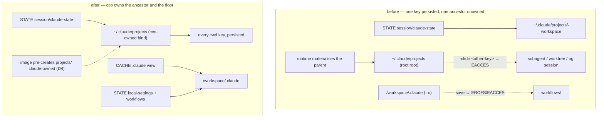

# ADR 0055 — Claude Code runtime state is outside `claude_access`; INV-MP covers container-side ancestry

**Status**: Accepted (design) — 2026-07-28, approved by the maintainer at S1's design gate.
Implementation in the same session. Cycle-1.2, session **S1**.
Closes **R-D** and **R-F** of the [e2e v3.1 consolidated review](../../configuration/agent-cco-access/e2e-review/results/consolidated-review-v3.1.md) §7.1.
Generalizes **ADR-0054** (INV-MP) from the host side to the container side.
Refines **ADR-0049 §5** by replacing the derivation of its *functional-write floor*.

**Related ADRs**: [0049](../../configuration/agent-cco-access/decisions/0049-claude-access-concordant-model.md)
§2 (`Cp=ro` by default) and §5 (functional-write floor) ·
[0054](../../configuration/decentralized-config/decisions/0054-framework-owned-mountpoints.md)
(framework-owned mountpoints, INV-MP, D2/D4) · [0039](0039-native-claude-install.md) (native install
under `~/.local`) · 0004 (CONFIG / STATE / CACHE separation) ·
[0052](../../configuration/decentralized-config/decisions/0052-index-integrity-version-gate-and-reconcile.md)
(alt-B: lazy self-heal at the write boundary instead of a migration lane) · 0036 D4 (operator buckets).

---

## Context

Two independent failures were reported by the maintainer as `EACCES` — **subagent / agent-team
transcripts** and **workflow persistence** — and reproduced during the v3.1 consolidation. They share
one cause at the level of design: **cco never classified which parts of `~/.claude` and
`/workspace/.claude` are Claude Code's own runtime state**, so both the mount-ancestry rule and the
access policy were applied to whatever path a bug report happened to name.

### R-D — `~/.claude/projects` is materialised `root:root 0755`

cco binds `~/.claude/projects/-workspace` (transcripts) and `.../memory`
(`lib/cmd-start.sh:1793-1796`). The **parent** `projects/` does not exist in the image, so the
container runtime creates it to hold the bind — root-owned. Reproduced on `develop@8fd479c`, macOS,
and again in the session that wrote this ADR:

```
drwxr-xr-x 3 root root 4096 /home/claude/.claude/projects
touch: cannot touch '/home/claude/.claude/projects/.wprobe': Permission denied
```

Claude Code keys per-project state by cwd (`~/.claude/projects/<key>/`). `-workspace` is bound and
works; **every other key** — a subagent or teammate started from `/workspace/<repo>`, a worktree
session, a background session — needs a `mkdir` inside a root-owned directory and gets `EACCES`.

This is **not** the Linux/DAC issue: the directory is container-local, DAC applies normally,
`fakeowner` is irrelevant — which is why it reproduces on macOS.

The decisive detail is that **`Dockerfile:119-124` already states the rule it violates**: a missing
base dir is auto-created *"as a root-owned mount point — blocking any sibling … from being created by
claude"*. On that reasoning it pre-creates `.local/bin`, `.local/share`, `.local/state`, `.cache` and
`.claude`. `.claude/projects` — where cco nests a bind — was not added. **The reasoning was written
down and applied to one path instead of to the class.** Third recurrence of the same mechanism (v3's
STATE bucket, then FI-31/ADR-0054, now this).

### R-F — the functional-write floor was derived from one bug report

`/workspace/.claude` is `:ro` whenever `Cp≠rw` (ADR-0049 §2 reverses P17), and ADR-0049 §5 keeps
exactly one path writable through it — `settings.local.json`. The concept is right; the derivation
was not. Claude Code's official docs place project-scope workflow saves in *"the closest existing
`.claude/workflows/` between the working directory and the repository root"*
(`llms-full.txt:39393`), which from the default WORKDIR `/workspace` is `/workspace/.claude/workflows/`
— inside the `:ro` tree. That is the reported workflow-persistence failure.

> ⚠ It is invisible in the maintainer's own sessions: the uncommitted `access: {claude: all}` block in
> `.cco/project.yml` (the FI-25 workaround) makes every `.claude` tree `rw`. Any probe of this lane
> with that block in place proves nothing.

### The classification that was missing

Consulting the official *application data* table (`claude-directory`, `llms-full.txt:9537`) against
what cco actually mounts yields three classes, not two:

| Class | Paths | Governed by | State before this ADR |
|---|---|---|---|
| **Authoring** — files a human writes and commits | `CLAUDE.md`, `rules/`, `agents/`, `skills/`, `settings.json` (global `~/.cco/.claude/`, project `<repo>/.cco/claude/`) | `claude_access` — correctly | correct |
| **Runtime state, home scope** | `projects/`, `history.jsonl`, `file-history/`, `plans/`, `debug/`, `tasks/`, `teams/`, `session-env/`, `shell-snapshots/`, `paste-cache/`, `image-cache/`, `backups/`, `plugins/`, `stats-cache.json`, `remote-settings.json` | nothing | `projects/` **refused** (R-D); the rest writable but container-ephemeral |
| **Runtime state, project scope** | `settings.local.json`, `workflows/` | `claude_access` — **incorrectly** | `settings.local.json` exempted ad hoc; `workflows/` **refused** (R-F) |

`.claude/worktrees/` is *not* in the third class: the docs place it at the **repository** root
(`llms-full.txt:12354`), i.e. `/workspace/<repo>/.claude/worktrees/`, which is inside the repo's own
`rw` mount. It needs nothing.

The precedent for the axis this ADR ratifies already exists in the code, unnamed:
`lib/cmd-start.sh:1738` binds `settings.json` rw unconditionally with the comment *"always rw (runtime
prefs)"*.

---

## Decision

### D1 — the axis: `claude_access` governs authoring, never runtime state

> **`claude_access` governs the `.claude` *authoring* trees — `CLAUDE.md`, `rules/`, `agents/`,
> `skills/`. It does not govern Claude Code's own runtime state, which is writable at every access
> level.**

A session that may not *author* project config must still be able to *run*. Denying a runtime write
does not protect the repo — the repo is protected by the authoring policy and by the `<repo>/.cco`
overlay (Axis A) — it only breaks the tool.

### D2 — the floor is a contract; the list is derived, with provenance

The floor is stated as a rule, not an enumeration:

> **INV-FLOOR** — no path Claude Code writes as runtime state is ever *refused* to the session.
> Home scope satisfies this structurally (D4: `~/.claude` and every ancestor cco nests under are
> claude-owned, so anything not explicitly bound is writable). Project scope, where the parent is
> `:ro` by policy, satisfies it through an explicit list, **derived from the official *application
> data* table** and carrying a provenance comment that names the doc it came from.

The derived project-scope list is today `{settings.local.json, workflows/}`. Re-deriving it is a
maintenance task tied to Claude Code releases, and the provenance comment is what makes that possible
for a future maintainer — a bare list cannot say why a new path does or does not belong.

**Refusal and persistence are separate axes.** INV-FLOOR is about refusal only. Everything in the
home-scope runtime class is writable after D4; most of it (`paste-cache/`, `shell-snapshots/`,
`debug/`, `session-env/`) is per-session by nature and correctly ephemeral. Two entries have durable
value and are **deliberately left ephemeral by this ADR**, recorded as backlog rather than fixed
here: `history.jsonl` (up-arrow prompt recall) and global `~/.claude/workflows/`. Naming them is the
point — they are a decision, not an oversight.

### D3 — project-scope runtime state persists in per-project STATE

When `/workspace/.claude` is `:ro`, each floor entry is a **rw child overlay sourced from per-project
STATE** — the shape `settings.local.json` already has (ADR-0049 §5). Consequences, both intended:

- A workflow saved by a `read-project` session **survives the session and the container**, and does
  not appear as an uncommitted change in the repo.
- Under `claude_access: all` (`Cp=rw`) the overlay does not exist and the natural path applies: the
  workflow lands in `<repo>/.cco/claude/workflows/` and is committed and shared, exactly as the
  upstream docs describe. **Whether a workflow becomes shared config is the user's decision, taken by
  choosing an access level — not a decision the framework takes for them.**

### D4 — INV-MP generalised to the container side

> **INV-MP (generalised)** — for every bind cco generates, every ancestor of the target that the
> runtime would otherwise have to materialise is **pre-created by cco, with the owner the writer
> needs**: host-side in cco's own tree (ADR-0054), container-side in the image. No mountpoint ancestor
> is left to the container runtime.

An ancestor that is *itself* a mount target is exempt — the bind lands on top of it and its underlying
ownership is unobservable. R-D is precisely the non-exempt case: `projects/` is a pass-through
ancestor that nothing is mounted on, so the runtime's root-owned directory *is* what the session sees.

Applied: the image pre-creates `/home/claude/.claude/projects` claude-owned, beside the existing XDG
pre-creation, and the comment there is rewritten to state the generalised rule rather than the
instance. This also covers `cco new` (`lib/cmd-new.sh:132`), which binds the same shape into a
throwaway session and would otherwise reproduce R-D on its own.

> **A second instance, found by the lint the moment it existed — and it is the DEFAULT lane.**
> At project read scope the CONFIG mount is narrowed to the referenced packs, bound one by one at
> `~/.cco/packs/<name>` (`cmd-start.sh:1972`), which leaves **both** `~/.cco` and `~/.cco/packs`
> pass-through. Confirmed live in the session that wrote this ADR: `drwxr-xr-x root root`, writes
> refused. At broader scope `~/.cco` is itself the mount and the question does not arise — the
> *narrow* shape is the default, which is exactly why it went unseen. Pre-created likewise.
>
> The read-only outcome happened to agree with the access policy, so nothing looked broken. That
> agreement was an accident of mount ordering, not enforcement: it is the policy's job to decide
> who may write, and a root-owned pass-through ancestor cannot be the mechanism. Writes into the
> container's own `~/.cco` were, and remain, session-local — they never reach the host store,
> which is protected by the `:ro` flags on the binds and by ADR-0047 for the internal store.
>
> Two findings from one lint, on its first run, is the argument for D4 in miniature: the rule had
> been written down twice and applied to one path each time.

### D5 — the whole `projects/` tree is cco-owned and persisted

`cco start` binds **`~/.claude/projects`** from per-project STATE, replacing the bind of
`projects/-workspace`. Transcripts for *every* cwd key — subagents and teammates started inside a
repo, worktree sessions, background sessions — persist in the same per-project STATE bucket as the
main session, and `/resume` sees them across container restarts.

This is a deliberate scope increase over the minimum needed to close R-D, taken because the minimum
leaves a silent failure in its place: the subagent works, and its transcript is gone at exit. cco
already states persistence as a design promise (*"enables /resume across rebuilds"*); persisting only
the `-workspace` key is a residue of when that was the only key, not a decision.

No cross-project leak: keys are derived from cwd, every cwd in a session is under `/workspace`, and
the STATE bucket is per cco project.

### D6 — the STATE layout change self-heals at the write boundary

The bind source becomes the *parent*, so today's content (transcripts directly under
`session/claude-state/`) belongs one level deeper, under `session/claude-state/-workspace/`. Per
**ADR-0052 alt-B** — the precedent this project set for STATE-shape changes — this is an **idempotent
self-heal at the write boundary**, not a `migrations/` lane: `cco start` already creates these
directories (`lib/cmd-start.sh:1307-1308`) and moves the stray entries there before generating the
compose file. The `memory` child bind's mountpoint moves with it, to
`session/claude-state/-workspace/memory`, created host-side by cco per D4.

### D7 — the framework view is built whenever a framework child is needed

ADR-0054 D2 builds the CACHE `.claude` view **only** when the session injects pack/llms children. The
floor entries of D3 are framework-owned children of the same parent, so the trigger generalises to
*"any framework-owned child of `/workspace/.claude`"*. In practice the view is built for every
`Cp=ro` session, since `settings.local.json` is always in the floor.

ADR-0054 D4's caveat (a *new* file created directly in the composed namespace is session-local) is
unaffected in substance: it is surfaced only when `Cp=rw`, and a `Cp=rw` session does not compose for
floor reasons.

---

## Alternatives considered

**A1 — project-scope workflows written into the committed repo tree** (a rw child bind onto
`<repo>/.cco/claude/workflows/`). Matches the upstream intent that project workflows are shared via
git, but lets a `read-project` session write the committed tree without approval, inverting ADR-0049
§2. **Rejected**: D3 reaches the same end state through the access level the user already controls.

**A2 — project-scope workflows session-local in the CACHE view.** Closes the `EACCES` and nothing
else: the workflow saves without error and is gone at exit. ADR-0054 D4 already identifies this as the
behaviour hardest to explain. **Rejected** — it is the failure mode this cycle exists to remove.

**A3 — the floor as a fixed enumeration of the whole application-data table.** No principle recorded;
must be re-derived from scratch at every Claude Code release, and cannot tell a future maintainer why
a newly-appeared path belongs. **Rejected** in favour of D2's contract, which makes home scope
structural and leaves only the short project-scope list to maintain.

**A4 — R-D fixed by the Dockerfile alone, persistence deferred.** Minimal blast radius and satisfies
INV-MP literally. **Rejected as the whole answer**: it converts a loud failure into a silent one
(transcripts written, then discarded). Retained as *part* of the answer — D4 is still implemented,
because `cco new` and any future session without the parent bind need it.

**A5 — a `migrations/` lane for the STATE layout.** Rejected per ADR-0052 alt-B and the FI-27
precedent: STATE shape is repaired lazily at the write boundary, and adding a migration scope for it
was already considered and declined once.

---

## Consequences

- A default (`read-project`) session gains: working subagent/teammate transcripts from any cwd,
  persisted; and working, persisted project-scope workflow saves.
- `claude_access` becomes honest — it is an *authoring* policy, and the FI-25 workaround
  (`access: {claude: all}` purely to make the tool function) loses one of its reasons to exist.
- The mount shape of `~/.claude/projects` changes. **This lane is invisible to the hermetic suite by
  construction** — it is RC-17's fourth recurrence — so acceptance requires a probe in a real
  container after `cco build`, recorded in the cycle-1.2 acceptance log.
- A compose-ancestry lint (parsing a **really generated** `docker-compose.yml`, not a fixture) makes
  INV-MP enforceable rather than remembered. Without it this ADR is the fourth written statement of a
  rule that keeps being applied one path at a time. **Its reach has a stated limit**: once D5 makes
  `projects/` a mount target, the lint no longer flags R-D's own path — an ancestor that is itself a
  target is legitimately exempt. What it guards is the *shape* (a bind nested under a pass-through
  ancestor), verified by reverting D5 and watching it name `/home/claude/.claude/projects` as the
  ancestor of `.../projects/-workspace`. D4's Dockerfile entry is therefore not redundant with D5:
  it is what `cco new` and any future un-bound path rely on.
- Home-scope runtime state other than `projects/` stays ephemeral. Two entries with durable value
  (`history.jsonl`, global `~/.claude/workflows/`) go to the backlog, named.



## Verification

Per cycle-1.2 Rule 1, suite-green is **not** acceptance for this lane. After `cco build`, in a
**default** (`read-project`) session, with the `access: {claude: all}` block stashed:

1. `ls -ld /home/claude/.claude/projects` → owned by `claude`, and a `touch` inside it succeeds.
2. `grep '/workspace/.claude/workflows' /proc/self/mountinfo` → a `rw` entry.
3. A subagent or agent-team teammate started from inside a repo directory writes its transcript —
   the reported symptom, and the only thing that closes R-D.
4. After a container restart, the transcripts from (3) are still present and `/resume` lists them.

## Forward annotations

- **ADR-0049 §5** — the floor's *derivation* is replaced by D2; its mechanism (rw child overlay from
  STATE) is retained and generalised.
- **ADR-0054** — INV-MP gains the container-side half (D4); D2's view trigger is widened by D7.
- **ADR-0052** — alt-B's lazy self-heal is applied to a second STATE shape (D6).
