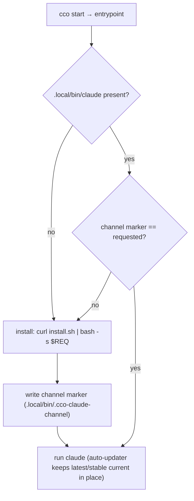
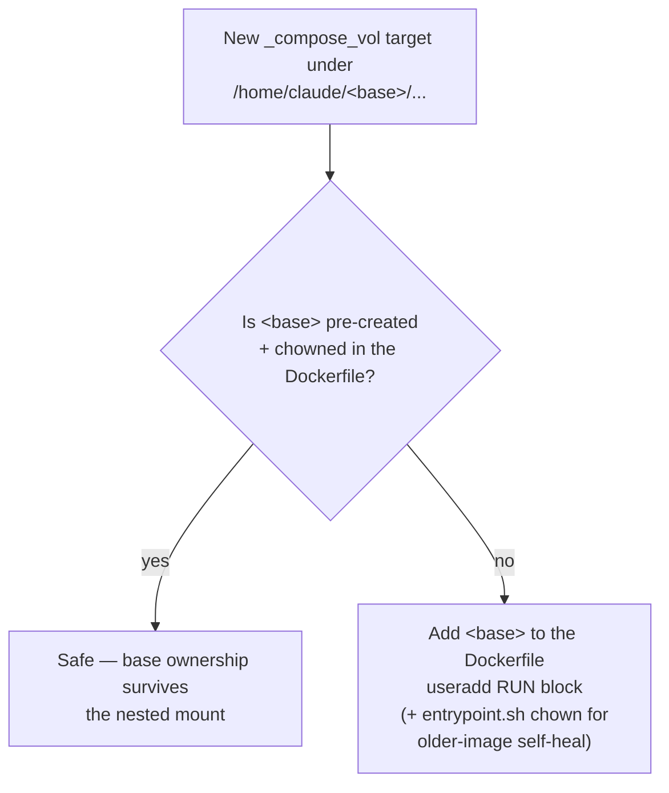
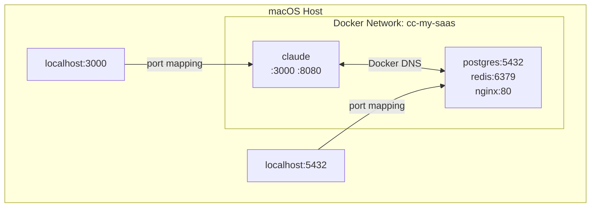

# Docker Specification

> Version: 1.0.0
> Status: v1.0 — Current
> Related: [architecture.md](../../foundation/design/architecture.md) | [spec.md](../../foundation/analysis/spec.md)

---

## 1. Docker Image

### 1.1 Dockerfile

> **Abridged excerpt — `Dockerfile` is the source of truth.** The real file is a **three-stage**
> build whose stages are elided here: *stage 1* compiles the Go socket proxy (`proxy/` →
> `cco-docker-proxy`, §HIGH-2 of the security model), *stage 1b* compiles the setuid boundary helper
> (`config/cco-svc-helper.c` → `cco-svc-helper`, §1.2.3), and the main stage additionally creates the
> `cco-svc` uid + the mode-0700 `/var/lib/cco-internal` root (§1.2.3), bakes the `cco` CLI tree into
> `/opt/cco` for the wrapped in-container `cco` (ADR-0036 D4), and copies `defaults/managed/` to
> `/etc/claude-code/`. Below is the part this section explains.

```dockerfile
FROM node:22-bookworm

# ── System dependencies ──────────────────────────────────────────────
RUN apt-get update && apt-get install -y \
    git tmux jq ripgrep fzf curl wget \
    python3 python3-pip openssh-client socat less vim \
    && rm -rf /var/lib/apt/lists/*

# ── Locale (UTF-8 support) ──────────────────────────────────────────
RUN apt-get update && apt-get install -y locales \
    && sed -i 's/^# *\(en_US.UTF-8\)/\1/' /etc/locale.gen \
    && locale-gen \
    && rm -rf /var/lib/apt/lists/*
ENV LANG=en_US.UTF-8
ENV LC_ALL=en_US.UTF-8

# ── Docker CLI (for Docker-from-Docker) ──────────────────────────────
RUN install -m 0755 -d /etc/apt/keyrings \
    && curl -fsSL https://download.docker.com/linux/debian/gpg -o /etc/apt/keyrings/docker.asc \
    && chmod a+r /etc/apt/keyrings/docker.asc \
    && echo "deb [arch=$(dpkg --print-architecture) signed-by=/etc/apt/keyrings/docker.asc] \
       https://download.docker.com/linux/debian $(. /etc/os-release && echo "$VERSION_CODENAME") stable" \
       > /etc/apt/sources.list.d/docker.list \
    && apt-get update \
    && apt-get install -y docker-ce-cli docker-compose-plugin \
    && rm -rf /var/lib/apt/lists/*

# ── GitHub CLI ─────────────────────────────────────────────────────
RUN curl -fsSL https://cli.github.com/packages/githubcli-archive-keyring.gpg \
        -o /usr/share/keyrings/githubcli-archive-keyring.gpg \
    && echo "deb [arch=$(dpkg --print-architecture) \
       signed-by=/usr/share/keyrings/githubcli-archive-keyring.gpg] \
       https://cli.github.com/packages stable main" \
       > /etc/apt/sources.list.d/github-cli.list \
    && apt-get update && apt-get install -y gh \
    && rm -rf /var/lib/apt/lists/*

# ── gosu (drop-in su replacement for Docker entrypoints) ─────────────
# gosu does a direct exec without creating a new session/pty, so TTY
# passthrough works correctly — unlike su/sudo which break stdin forwarding.
RUN arch="$(dpkg --print-architecture)" \
    && curl -fsSL "https://github.com/tianon/gosu/releases/download/1.17/gosu-${arch}" \
       -o /usr/local/bin/gosu \
    && chmod +x /usr/local/bin/gosu \
    && gosu nobody true

# ── Claude Code (native installer — ADR-0039) ────────────────────────
# The binary is NOT baked into the image. The entrypoint installs it at first
# start (curl install.sh) into the persistent bind-mounted ~/.local, so it
# auto-updates in place — no root-owned npm global dir, no DISABLE_AUTOUPDATER.
# CLAUDE_CODE_VERSION is the baked channel/version default the entrypoint
# forwards to install.sh; the persistent preference is the ~/.cco/claude-version
# config knob (default latest), and `cco build --claude-version` is a one-off.
ARG CLAUDE_CODE_VERSION=latest
ENV CLAUDE_CODE_VERSION=${CLAUDE_CODE_VERSION}
ENV PATH="/home/claude/.local/bin:${PATH}"

# ── MCP Server packages (optional pre-installation) ──────────────────
ARG MCP_PACKAGES=""
RUN if [ -n "$MCP_PACKAGES" ]; then npm install -g $MCP_PACKAGES; fi

# ── User setup script (global, build time) ─────────────────────────
# Heavy system-level setup (apt packages, compilers), run once as root at `cco build`.
# Lightweight runtime config belongs in ~/.cco/setup.sh (run at start, as claude).
ARG SETUP_BUILD_SCRIPT_CONTENT=""
RUN if [ -n "$SETUP_BUILD_SCRIPT_CONTENT" ]; then \
        printf '%s' "$SETUP_BUILD_SCRIPT_CONTENT" > /tmp/setup-build.sh \
        && bash /tmp/setup-build.sh \
        && rm -f /tmp/setup-build.sh; \
    fi

# ── User setup ───────────────────────────────────────────────────────
# Pre-create docker group with placeholder GID (adjusted at runtime by entrypoint),
# and every mountpoint ancestor cco binds under — INV-MP, container side (§1.2.2).
RUN groupadd -g 999 docker \
    && useradd -m -s /bin/bash claude \
    && mkdir -p /home/claude/.claude /home/claude/.claude/projects \
       /home/claude/.cco/packs \
       /home/claude/.local/bin /home/claude/.local/share \
       /home/claude/.local/state /home/claude/.cache /workspace \
    && chown -R claude:claude /home/claude /workspace

# ── Config files ─────────────────────────────────────────────────────
COPY config/tmux.conf /home/claude/.tmux.conf
COPY config/entrypoint.sh /usr/local/bin/entrypoint.sh
COPY config/hooks/ /usr/local/bin/cco-hooks/
RUN chown claude:claude /home/claude/.tmux.conf \
    && chmod +x /usr/local/bin/entrypoint.sh \
    && chmod +x /usr/local/bin/cco-hooks/*.sh

WORKDIR /workspace

ENTRYPOINT ["/usr/local/bin/entrypoint.sh"]
```

### 1.2 Entrypoint Script

The entrypoint handles Docker socket permissions, the socket-proxy startup, the ADR-0047
internal-store boundary, GitHub/git authentication, MCP server injection, the global and project
setup scripts, per-project MCP packages, the native Claude Code install, and launches Claude Code
via `gosu` with optional tmux wrapping.

> **Abridged excerpt — `config/entrypoint.sh` is the source of truth.** Two blocks are elided
> below: the **Docker socket proxy** startup (`cco-docker-proxy` in front of the real socket, with
> `DOCKER_HOST` re-pointed at it) and the **internal-store privilege boundary** (re-assert
> `/var/lib/cco-internal` 0700 `cco-svc`, its per-bucket parents, and the `$HOME` XDG symlink
> façade — §1.2.3, and §1.2.2.1 for why the per-bucket parents are re-asserted every start).

```bash
#!/bin/bash
set -e

# ── Docker socket permissions ────────────────────────────────────────
# Match container's docker group GID to host's socket GID.
# The docker group is pre-created in the Dockerfile (GID 999 placeholder).
# Here we adjust its GID to match the host socket.
if [ -S /var/run/docker.sock ]; then
    SOCKET_GID=$(stat -c '%g' /var/run/docker.sock)
    if [ "$SOCKET_GID" != "0" ]; then
        if getent group docker > /dev/null 2>&1; then
            CURRENT_GID=$(getent group docker | cut -d: -f3)
            if [ "$CURRENT_GID" != "$SOCKET_GID" ]; then
                groupmod -g "$SOCKET_GID" docker
            fi
        else
            groupadd -g "$SOCKET_GID" docker
        fi
        usermod -aG docker claude
    else
        # Socket owned by root — add claude to root group (common on macOS)
        usermod -aG root claude
    fi
fi

# ── Ensure ~/.claude.json exists and is writable ─────────────────────
# Mounted from global/claude-state/claude.json (shared across all projects).
# Initialized on host by cmd_start before container starts.
# On macOS, OAuth tokens are stored in Keychain — not in ~/.claude.json —
# so seeding from host is not applicable. Login once from inside the container;
# Claude writes tokens here and they persist across all sessions.
CLAUDE_JSON="/home/claude/.claude.json"
MCP_GLOBAL="/home/claude/.claude/mcp-global.json"
MCP_PROJECT="/workspace/.mcp.json"

if [ ! -f "$CLAUDE_JSON" ]; then
    echo '{}' > "$CLAUDE_JSON"
fi
chown claude:claude "$CLAUDE_JSON"

# ── MCP server injection into ~/.claude.json ─────────────────────────
# Claude Code reads user-scope MCP from ~/.claude.json mcpServers key.
# This is the most reliable mechanism (vs .mcp.json which needs approval).
# We merge both global MCP (mounted as mcp-global.json) and project MCP
# (mounted as /workspace/.mcp.json) into ~/.claude.json.

# Merge global MCP servers (from ~/.cco/.claude/mcp.json)
if [ -f "$MCP_GLOBAL" ]; then
    server_count=$(jq '.mcpServers | length' "$MCP_GLOBAL" 2>/dev/null || echo "0")
    if [ "$server_count" -gt 0 ]; then
        merged=$(jq -s '.[0] * {mcpServers: ((.[0].mcpServers // {}) + (.[1].mcpServers // {}))}' \
            "$CLAUDE_JSON" "$MCP_GLOBAL" 2>/dev/null) && echo "$merged" > "$CLAUDE_JSON"
        echo "[entrypoint] Merged $server_count global MCP server(s) into ~/.claude.json" >&2
    fi
fi

# Merge project MCP servers (from <repo>/.cco/mcp.json mounted at /workspace/.mcp.json)
# This provides a reliable fallback: servers are in both .mcp.json (project scope)
# AND ~/.claude.json (user scope), so at least one mechanism will work.
if [ -f "$MCP_PROJECT" ]; then
    # .mcp.json uses {mcpServers: {...}} format
    server_count=$(jq '.mcpServers | length' "$MCP_PROJECT" 2>/dev/null || echo "0")
    if [ "$server_count" -gt 0 ]; then
        merged=$(jq -s '.[0] * {mcpServers: ((.[0].mcpServers // {}) + (.[1].mcpServers // {}))}' \
            "$CLAUDE_JSON" "$MCP_PROJECT" 2>/dev/null) && echo "$merged" > "$CLAUDE_JSON"
        echo "[entrypoint] Merged $server_count project MCP server(s) into ~/.claude.json" >&2
    fi
fi

# ── GitHub / Git authentication ───────────────────────────────────
# Authenticate gh CLI and configure git credential helper if GITHUB_TOKEN is set.
# This enables: git push (HTTPS), gh pr create, and MCP GitHub server.
if [ -n "${GITHUB_TOKEN:-}" ]; then
    echo "$GITHUB_TOKEN" | gosu claude gh auth login --with-token 2>&1 >&2 \
        && echo "[entrypoint] GitHub: authenticated gh CLI via GITHUB_TOKEN" >&2
    gosu claude gh auth setup-git 2>&1 >&2 \
        && echo "[entrypoint] GitHub: configured git credential helper" >&2
fi

# ── Global + project setup scripts (runtime) ─────────────────────
# Both run as `claude` (gosu), NOT as root — the entrypoint is root only for the
# socket/boundary work above (security model HIGH-4).
GLOBAL_SETUP="/home/claude/global-setup.sh"      # from ~/.cco/setup.sh
if [ -f "$GLOBAL_SETUP" ]; then
    gosu claude bash "$GLOBAL_SETUP" 2>&1 >&2
fi

PROJECT_SETUP="/workspace/setup.sh"
if [ -f "$PROJECT_SETUP" ]; then
    echo "[entrypoint] Running project setup script..." >&2
    gosu claude bash "$PROJECT_SETUP" 2>&1 >&2
    echo "[entrypoint] Project setup complete" >&2
fi

# ── Per-project MCP packages (runtime) ───────────────────────────
PROJECT_MCP_PACKAGES="/workspace/mcp-packages.txt"
if [ -f "$PROJECT_MCP_PACKAGES" ]; then
    pkg_count=$(grep -cv '^\s*$\|^\s*#' "$PROJECT_MCP_PACKAGES" 2>/dev/null || true)
    pkg_count=${pkg_count:-0}
    if [ "$pkg_count" -gt 0 ]; then
        echo "[entrypoint] Installing $pkg_count project MCP package(s)..." >&2
        grep -v '^\s*$\|^\s*#' "$PROJECT_MCP_PACKAGES" | \
            xargs gosu claude npm install -g 2>&1 >&2
        echo "[entrypoint] Project MCP packages installed" >&2
    fi
fi

# ── Claude Code native install / re-pin (ADR-0039) ───────────────────
# Install (or re-pin) the binary as the claude user into the persistent
# bind-mounted ~/.local. Reinstall when the binary is absent OR the requested
# channel/version (CLAUDE_CODE_VERSION) differs from the marker recorded at the
# last install — so the config knob / --claude-version actually switch versions
# without reinstalling on every start (a bare channel like `latest` isn't
# comparable to `claude --version`, hence the marker compare). Fails loud (exit 1).
CLAUDE_REQ="${CLAUDE_CODE_VERSION:-latest}"
# .local/state and .cache are chowned too: when cco_access != none, the
# operator-bucket mounts (ADR-0036 D4) nest under them (.local/state/cco/index,
# .cache/cco/llms), which makes the runtime auto-create the parent as a
# root-owned mount point — blocking this installer's mkdir of the sibling
# .local/state/claude / .cache/claude dirs otherwise. The Dockerfile now
# pre-creates these XDG bases claude-owned too; this stays as a self-heal
# against images built before that (see "Container ownership invariant" below).
mkdir -p /home/claude/.local/bin /home/claude/.local/share/claude \
    /home/claude/.local/state /home/claude/.cache
chown claude:claude /home/claude/.local /home/claude/.local/bin \
    /home/claude/.local/share/claude /home/claude/.local/state \
    /home/claude/.cache 2>/dev/null || true
if [ ! -x /home/claude/.local/bin/claude ] || \
   [ "$(cat /home/claude/.local/bin/.cco-claude-channel 2>/dev/null)" != "$CLAUDE_REQ" ]; then
    gosu claude env CLAUDE_REQ="$CLAUDE_REQ" bash -c \
        'curl -fsSL https://claude.ai/install.sh | bash -s "$CLAUDE_REQ"' \
        || { echo "[entrypoint] FATAL: Claude Code install failed" >&2; exit 1; }
    echo "$CLAUDE_REQ" | gosu claude tee /home/claude/.local/bin/.cco-claude-channel >/dev/null
fi

# ── Debug: log env vars and auth state ────────────────────────────────
echo "[entrypoint] TEAMMATE_MODE=${TEAMMATE_MODE:-unset}" >&2
echo "[entrypoint] ANTHROPIC_API_KEY=${ANTHROPIC_API_KEY:+SET}" >&2

# ── Switch to claude user and launch ─────────────────────────────────
# gosu does exec directly without creating a new session, preserving
# TTY/stdin so Claude Code's interactive UI works correctly.
if [ "${TEAMMATE_MODE}" = "tmux" ] && [ -z "$TMUX" ]; then
    set +e
    # printf %q builds a shell-safe argument string — tmux passes it to sh -c
    # (security model MEDIUM-4).
    tmux_args=$(printf '%q ' "$@")
    gosu claude tmux new-session -s claude "claude --dangerously-skip-permissions ${tmux_args% }"
    exit_code=$?
    set -e
    [ $exit_code -ne 0 ] && echo "[entrypoint] claude exited with code ${exit_code}" >&2
    exit $exit_code
else
    exec gosu claude claude --dangerously-skip-permissions "$@"
fi
```

**Key implementation choices**:
- **gosu** instead of `su` — `su` creates a new session/PTY that breaks stdin forwarding. `gosu` does a direct `exec`, preserving TTY passthrough.
- **MCP injection** — global and project MCP servers are merged into `~/.claude.json` via `jq -s`. This is the most reliable mechanism (vs `.mcp.json` which may need approval).
- **GitHub auth** — `GITHUB_TOKEN` env var drives `gh auth login --with-token` + `gh auth setup-git`, enabling HTTPS push and `gh` CLI commands.
- **Project setup** — optional `setup.sh` and `mcp-packages.txt` run at container startup for per-project customization, **as the `claude` user** (`gosu`), never as root.
- **Error handling** — tmux path captures exit code explicitly (tmux doesn't propagate it via `exec`).
- **Native Claude Code install** — the binary is installed at first start and bind-mounted from a persistent host CACHE dir, so it auto-updates in place (see §1.2.1).

### 1.2.1 Claude Code native install (ADR-0039)

`cco` does not bake the Claude Code binary into the image. The image only sets a
channel/version default (`CLAUDE_CODE_VERSION`) and puts `~/.local/bin` on `PATH`.
The **entrypoint installs the binary at first start** via the official installer
(`curl -fsSL https://claude.ai/install.sh | bash -s <channel|version>`) into
`/home/claude/.local/{bin,share/claude}`, which is **bind-mounted from a persistent
host CACHE dir** (`$(_cco_cache_dir)/claude-install/{bin,share}`). The binary and
its state therefore survive container restarts and **auto-update in place** — no
`cco build` needed for upgrades, and no root-owned npm global dir, so the
auto-updater stays enabled (no `DISABLE_AUTOUPDATER`).



**Channel/version selection** (decision 1):

- Default channel is `latest`. The persistent preference is the CONFIG knob
  `~/.cco/claude-version` (a single value: `latest` | `stable` | `x.y.z`), read by
  `_cco_claude_version_pref` and forwarded by `cco start` as `CLAUDE_CODE_VERSION`
  **only when the knob is set**. When the knob is absent the container falls back
  to the image's baked default, so `cco build --claude-version X` re-pins a
  knob-less install while an explicit knob outranks the build default.
- **Re-pin** (decision 2): the entrypoint persists a marker
  (`.local/bin/.cco-claude-channel`) of the last-installed request and reinstalls
  when the binary is absent **or** the marker differs from `CLAUDE_CODE_VERSION`.
  A bare channel string (`latest`) is not comparable to `claude --version`, so the
  marker compare avoids reinstalling on every start.

**Cache lifecycle**:

- `cco build --no-cache` wipes `$(_cco_claude_install_dir)` so the next start does
  a clean install (decision 4).
- `cco clean` (incl. `--all`) **never** touches the install cache — it only removes
  `.bak`/`.tmp`/generated artifacts and does not scan the CACHE bucket (decision 3).

### 1.2.2 Container ownership invariant — INV-MP, container side (ADR-0055 D4)

> **INV-MP (generalised).** For every bind cco generates, every ancestor of the target that the
> runtime would otherwise have to materialise is **pre-created by cco, with the owner the writer
> needs** — host-side in cco's own tree (ADR-0054), container-side in the image. No mountpoint
> ancestor is left to the container runtime.

The container's `claude` user is non-root. When a bind-mount target doesn't already exist inside
the image, the container runtime auto-creates the missing parent directories as **root:root, mode
0755**, before the entrypoint runs. An ancestor that is *itself* a mount target is harmless (the
bind lands on top of it), but a **pass-through** ancestor stays `root:root` and any `claude`
process that needs to create a *sibling* entry there gets `EACCES` — at runtime, so it surfaces as
a broken feature rather than a broken boot.

Three instances, all closed:

- **The original (ADR-0039 / ADR-0036 D4)**: the native Claude Code installer creating
  `.local/state/claude` and `.cache/claude`, blocked by the then STATE-index / CACHE-llms operator
  mounts under the same bases. *This particular collision no longer exists*: since ADR-0047 (§1.2.3)
  the internal buckets mount under `/var/lib/cco-internal`, **not** under `~/.local/state` /
  `~/.cache`. The pre-creation stays because the bases still host other binds.
- **`~/.claude/projects` (R-D)**: a pass-through ancestor when only the `-workspace` key was bound;
  since ADR-0055 D5 the whole tree is the mount target, and the image entry stays as the guard
  against a future lane binding a single key again.
- **`~/.cco/packs` (the default lane)**: at project read scope the CONFIG mount is narrowed to the
  referenced packs, bound one by one at `~/.cco/packs/<name>` — leaving both `~/.cco` and
  `~/.cco/packs` pass-through. At broader scope `~/.cco` is itself the mount and the question does
  not arise, which is why the narrow shape (the default) went unseen.

**Fix — two layers**:
1. **Root cause (Dockerfile)**: every pass-through ancestor is pre-created and
   `chown claude:claude`'d at image build time (`useradd` RUN block) — today
   `.claude`, `.claude/projects`, `.cco/packs`, `.local/bin`, `.local/share`,
   `.local/state`, `.cache`. Because they already exist, the runtime's
   auto-create-missing-parents behavior never touches them.
   **Linted, not just documented**: `test_invariant_mount_ancestry_owned`
   (`tests/test_invariants.sh`) parses this Dockerfile list and checks it against a
   **really-generated** compose file, so a forgotten ancestor fails the suite instead of
   shipping. Both the `~/.claude/projects` and the `~/.cco/packs` instances above were
   found by that lint on its first run.
2. **Runtime self-heal (entrypoint.sh)**: `chown claude:claude` is re-applied
   at every start to `.local`, `.local/bin`, `.local/share/claude`,
   `.local/state`, `.cache` — a no-op once (1) holds, but keeps startup
   correct against an image built before this fix, and reclaims the host-uid
   on the genuinely bind-mounted dirs (`.local/bin`, `.local/share/claude` —
   content sourced from the host CACHE, whose uid can differ from the
   container's `claude`; macOS Docker Desktop makes `chown` a no-op there,
   hence `|| true`).

**Ownership-only exclusion, not an access exclusion**: `cco_access` still fully governs what is
*visible* and writable inside these bases (e.g. `.cco/packs/<name>` narrowing at `read-project`; the
internal buckets gated by the ADR-0047 boundary rather than by mount flags). Only the *ancestor
directory entry itself* is unconditionally `claude`-owned, so the container's own non-cco-managed
files (native installer, npm, future subsystems) always have a writable home regardless of the
chosen access level. Note the corollary the lint made explicit: a root-owned pass-through ancestor
is **never** an acceptable enforcement mechanism, even when its read-only outcome happens to agree
with the policy — enforcement is the mount flags' and ADR-0047's job.



**Convention for new mounts**: any new `_compose_vol` target (in `lib/cmd-start.sh` **or**
`lib/cmd-new.sh`) whose pass-through ancestors are not yet pre-created must add them to the
Dockerfile list (and, for older-image self-heal, the entrypoint.sh chown block) — otherwise it
silently reintroduces this bug for whatever sibling already lives there. Pre-created as of this
writing: `.claude`, `.claude/projects`, `.cco/packs`, `.local/bin`, `.local/share`,
`.local/state`, `.cache`.

#### 1.2.2.1 The same hazard one layer deeper — bucket parents inside the boundary (v3 R1)

> Added 2026-07-21 (e2e v3 cycle-1.1 / S1). The paragraphs above are about the XDG
> **base** dirs and the `claude` user. This is the identical mechanism at the next
> path component down, inside the ADR-0047 privileged root (§1.2.3), where the
> process that gets `EACCES` is **`cco-svc`** — and it is the first time the hazard
> actually shipped.

Under `/var/lib/cco-internal/` the operator buckets are `state/cco`, `share/cco`,
`cache/cco`. Two properties of §1.2.2 carry over unchanged: the runtime creates any
missing mountpoint **ancestor** as `root:root 0755`, and it does so **before the
entrypoint runs**. What differs is that pre-creating in the Dockerfile is not enough
here, because *which* leaves get bound varies per session with `cco_access`.

The v3 defect was the combination of that with a second choice: STATE crossed as
individual **file** binds (`index`, `running`) while DATA and CACHE crossed as
**directories**. A directory bind is its own mountpoint, so its parent is created by
the runtime and then *replaced* by the mount; a file bind leaves the parent as a real,
runtime-created, `root:root` directory in the container. `cco-svc` could traverse and
read it but not create in it — and every index writer replaces its file atomically via
a sibling `mktemp "$f.XXXXXX"` + `mv`, so the sibling landed in that parent and failed
`EACCES`. Three v3 blocking findings were that one gap (rename half-applying at exit 0,
the store ops dead at `edit-all`, an empty `path list` at exit 0).

**Two rules, and they are separate.** Fixing either alone leaves a live failure mode:

1. **A confined bucket crosses as a DIRECTORY, never as a file.** Beyond the parent
   problem, a file bind cannot survive the atomic replace pattern at all — `mv` onto a
   bound file is `EBUSY` — and a host-side `rename()` strands the container's bind on a
   `//deleted` inode, which reads as an empty-but-valid file (that is V2-F01: `path list`
   returning zero rows at exit 0). A permissions-only fix would not have reached either.
   Pinned by **INV-STATE** in `tests/test_invariants.sh`.
2. **The per-bucket parents are owned by `cco-svc` at every start**, in the same
   `entrypoint.sh` block that asserts the 0700 root — `install -d -o cco-svc` +
   `chown` + `chmod 0700` over `state/cco`, `share/cco`, `cache/cco`. Idempotent, and
   deliberately **non-recursive**: the children are bind mounts whose ownership belongs
   to the host. This is the §1.2.2 "runtime self-heal" layer, one level down, and it
   holds regardless of which leaves this session happens to bind.

**Convention for new confined buckets**: add the bucket parent to that entrypoint loop,
and bind a directory. If a bucket needs to expose only *part* of its content, do not
bind the members individually — publish them into a sub-bucket and bind that (the
`state/cco/shared/` shape), which keeps the crossing an **allow-list**: whatever is not
moved in stays off the container by construction. See ADR-0047's 2026-07-21 forward
annotation for why the allow-list property is the load-bearing one.

### 1.2.3 Internal-store privilege boundary (ADR-0047)

> **Shipped ([ADR-0047](../../configuration/agent-cco-access/decisions/0047-config-access-enforcement.md));
> hardened through e2e v2 cycle-1 (requires `cco build`).** Closes the confidentiality bypass
> S1/S1b — a `read-project` agent `cat`-ing the whole mounted STATE index / DATA registry and
> enumerating every other project's name, host path, membership, tags, and remote URLs. The write
> path onto this boundary is `lib/store.sh` + the `store-op` crossing (RC-3); the two crossing
> modes are documented at the end of this section.

The agent and the wrapped `cco` run as the **same UID `claude`** with no filesystem confinement
(`--dangerously-skip-permissions`), so any file `cco` can read, the agent can `cat`. The target
invariant is **`[human/agent] → cco → internal store`, direct access forbidden**: `cco` is the
sole path to the **internal XDG store** (STATE index, DATA tags/remotes/`source`, CACHE
internals). Config-content trees (`~/.cco` packs/templates/`.claude`, `<repo>/.cco`) are
**unaffected** — Claude Code reads them natively; they stay mounted and keep the `:ro`/`:rw` +
secret-masking model.

**Why not `chown`/`chmod` the mounted registries.** Empirically, macOS Docker Desktop mounts host
binds as `fakeowner` (VirtioFS), which **fakes ownership to the caller** — DAC on the mount
*content* is not enforced (a mode-0700, uid-9999 file is read by a different uid). This is the same
reason the entrypoint treats `chown` on binds as a no-op (§1.2.2). **But** the kernel checks path
**traversal** on each component's **real** inode, so a parent on the container's **real overlay
FS** confines even a `fakeowner` child.

**Mechanism** (mirrors the `cco-docker-proxy` privilege model — lock first, cross via a
privileged component):

1. **Dedicated privileged root on the real FS**: `/var/lib/cco-internal/`, owned by a new
   **`cco-svc`** uid, **mode 0700** — the `claude` user cannot traverse it (`EACCES`). Created +
   owned by the entrypoint (root), **outside** `claude`'s `$HOME` (so the agent cannot rename the
   parent chain).
2. **XDG symlinks**: `$HOME/.local/{state,share,cache}/cco` → the privileged root; `claude`
   follows the symlink but hits the mode-0700 dir → denied.
3. **Setuid `cco-svc` helper** baked into the image: `cco`'s internal-store primitives re-exec
   through it; the `(G,Pc,Po)` gate (ADR-0046 §7) lives **inside** the helper. One `cco`
   implementation, no daemon, no protocol.
4. **Trusted scope source**: the resolved `(G,Pc,Po)` is written host-side by `cco start` (into
   `<cache>/cco/projects/<id>/session-access`) and bind-mounted **`:ro`** at
   `/etc/cco/session-access` — the `:ro` flag is what makes it unforgeable from inside, not its
   ownership (bind-mount content ownership is not DAC-enforced on macOS Docker Desktop). The helper
   reads only its whitelisted keys from that file, never `argv`/env (agent-forgeable), and rebuilds
   the child environment from scratch. **Fail-closed** if the descriptor is absent or unreadable.
   The whitelist is a linted invariant (**INV-DESC**): a key the writer emits that the helper's
   `ALLOWED_KEYS[]` omits is dropped in silence — that is how `CCO_STORE_TOTALS` once shipped inert.

**Interaction with §1.2.2.** Relocating the internal registries out of the shared `.local/state`
/ `.cache` bases into `/var/lib/cco-internal` **removes** the sibling-`EACCES` collision §1.2.2
works around (those bases no longer hold cco mounts). The §1.2.2 "claude-owned base" convention
still governs `claude`'s own subsystems (installer, npm); this boundary is its deliberate inverse
for the internal store only. The registries may then mount **whole + rw** (only `cco-svc`
traverses; the helper gates every op), which **simplifies** the `cmd-start.sh` internal-bucket
mount block — the `read-project` registry narrowing and output-scoping demote to defense-in-depth.

**Running registry (ADR-0045).** The session running-registry directory
(`STATE/running/<project>`) rides this same boundary: it is mounted **`:ro`** in-container
**under the privileged root**, because its marker **filenames are project names** (S1-confidential).
It is therefore read only inside the elevated `__store list/show` path, gated by `_env_in_scope`
— never off the docker channel. `cco start` owns the marker lifecycle and runs the host-side
liveness reconciliation sweep (the primary reaper; `cco stop` is ~never invoked for a `run --rm`
container — B-DF3).

**Two boundary-crossing modes (e2e v2 cycle-1 — RC-3 / D-M4).** A verb crosses the privilege
boundary in one of two shapes, chosen by what it does behind it:

- **Whole-verb crossing (reads + pure store re-keys).** The verb is listed in
  `_cco_verb_touches_store`, so the shim re-execs it elevated (`cco __store <verb> …` as
  `cco-svc`) with the trusted `(G,Pc,Po)` injected from the `:ro` descriptor. The **entire** verb
  runs behind the boundary — used for read verbs (`list`, `path list`, `project show`) and for
  pure STATE-index re-keys. The elevated re-run is the authoritative gate; the outer claude-side
  gate keys off forgeable env and is only an early UX check.
- **Per-op plan+apply crossing (destructive/re-key cascades).** A command body never touches a
  confined bucket directly; it calls a named `lib/store.sh` cascade op, which crosses via
  `store-op` in a **plan → apply** pair (05 §3.7): the elevated arm validates (INV-S1/S2) and
  probes/applies, and its status is the process exit. This is what makes a store write **fail with
  exit 1** on a real fault instead of a swallowed `EACCES`.

The **mixed-write** case is D-M4: `repo`/`extra-mount rename` re-keys the STATE index elevated
(whole-verb) **but** de-elevates its `<repo>/.cco/project.yml` rewrite back to `ruid=claude` (a
plain `bash`), because that config tree is claude-owned — so `cco-svc` never writes a claude-owned
tree and the rename is POSIX-correct on native Linux (no `fakeowner` dependency).

**Nested-config governance is role-keyed (RC-1 / D-M5).** A `.claude`/`.cco` tree *nested under* a
mount takes its readonly flag from the mount's **role**, not a blanket default: a **store** mount
(`~/.cco`) → `.claude` follows `Cg`, content follows `G`; a **project-config** mount
(`<repo>/.cco`) → `.claude` follows `Cp`, content follows `Pc`. The **mount root itself** is
governed by its own `readonly:` (never re-clamped by the nested rule — RC-1's `-mindepth 1`
guarantees the discovery helper never returns its own root). The config-editor target root's flag
follows `Pc` from the same single source the store mount uses for `G` (D-M11).

### 1.3 tmux Configuration

```tmux
# config/tmux.conf

# ── Terminal ─────────────────────────────────────────────────────────
set -g default-terminal "tmux-256color"
set -ga terminal-overrides ",xterm-256color:Tc"

# ── Clipboard ────────────────────────────────────────────────────────
set -g set-clipboard on         # OSC 52: apps and tmux copy-mode → host clipboard
set -g allow-passthrough on     # DCS passthrough for iTerm2 inline images, etc.
set -as terminal-features ",xterm-256color:clipboard"

# ── Mouse ────────────────────────────────────────────────────────────
set -g mouse on

# ── Copy mode ────────────────────────────────────────────────────────
setw -g mode-keys vi
bind-key -T copy-mode-vi v send-keys -X begin-selection
bind-key -T copy-mode-vi C-v send-keys -X rectangle-toggle
bind-key -T copy-mode-vi y send-keys -X copy-selection-and-cancel
bind-key -T copy-mode-vi MouseDragEnd1Pane send-keys -X copy-pipe-and-cancel

# ── Status bar ───────────────────────────────────────────────────────
set -g status-style "bg=#1a1b26,fg=#a9b1d6"
set -g status-left "#[fg=#7aa2f7,bold] #{session_name} "
set -g status-left-length 30
set -g status-right "#[fg=#565f89] %H:%M "

# ── Pane borders ─────────────────────────────────────────────────────
set -g pane-border-style "fg=#3b4261"
set -g pane-active-border-style "fg=#7aa2f7"
set -g pane-border-indicators colour

# ── Navigation ───────────────────────────────────────────────────────
bind -n M-Left select-pane -L
bind -n M-Right select-pane -R
bind -n M-Up select-pane -U
bind -n M-Down select-pane -D

# ── History ──────────────────────────────────────────────────────────
set -g history-limit 50000

# ── Quality of life ──────────────────────────────────────────────────
set -g escape-time 0
set -g focus-events on
set -g base-index 1
setw -g pane-base-index 1
```

Key settings for clipboard:
- `set-clipboard on` — enables OSC 52 passthrough from applications and tmux copy-mode to the host terminal's clipboard
- `allow-passthrough on` — enables DCS passthrough for iTerm2 inline images and similar sequences
- `terminal-features clipboard` — explicit clipboard capability (works even when outer TERM is not `xterm*`)
- `MouseDragEnd1Pane copy-pipe-and-cancel` — auto-copies selection on mouse release (no manual `y` press needed)

See [agent-teams guide](../../../users/integration/guides/agent-teams.md) §2.4 for copy-paste usage and host terminal compatibility.

---

## 2. Docker Compose

### 2.1 Base Template

Each project gets a `docker-compose.yml` generated from the invoking repo's `<repo>/.cco/project.yml`, written to machine-local STATE (never committed). Here is the annotated structure:

```yaml
# <state>/cco/projects/<id>/docker-compose.yml
# AUTO-GENERATED from project.yml — edits will be overwritten on next `cco start`

services:
  claude:
    image: claude-orchestrator:latest
    build:
      context: ../../                          # repo root (for Dockerfile)
      dockerfile: Dockerfile
    container_name: cc-${PROJECT_NAME}
    stdin_open: true                           # -i (interactive)
    tty: true                                  # -t (terminal)

    # ── Environment ──────────────────────────────────────────────────
    environment:
      - PROJECT_NAME=${PROJECT_NAME}
      - TEAMMATE_MODE=${TEAMMATE_MODE:-tmux}
      # Agent teams
      - CLAUDE_CODE_EXPERIMENTAL_AGENT_TEAMS=1
      # Session-info surface (ADR-0041/0042): base64, computed by lib/session-context.sh
      # and emitted by the SessionStart / SubagentStart hooks. There is NO workspace.yml
      # file — this env var replaced it.
      - CCO_SESSION_CONTEXT=<base64>
      - CCO_SUBAGENT_CONTEXT=<base64>
      # Access declaration (wrapped cco, ADR-0036/0043/0046) — operator mode only
      - CCO_CONTAINER_OPERATOR=1
      - CCO_ACCESS_TRIPLE=${G},${Pc},${Po}
      - CCO_CCO_ACCESS=${CCO_ACCESS}
      - CCO_CLAUDE_ACCESS=${CLAUDE_ACCESS}
      - CCO_SHOW_HOST_PATHS=${SHOW_HOST_PATHS}
      # Internal-store homes behind the ADR-0047 boundary (§1.2.3)
      - CCO_STATE_HOME=/var/lib/cco-internal/state/cco
      - CCO_DATA_HOME=/var/lib/cco-internal/share/cco
      - CCO_CACHE_HOME=/var/lib/cco-internal/cache/cco
      # Auth via API key (if not using OAuth)
      # - ANTHROPIC_API_KEY=${ANTHROPIC_API_KEY}

    # ── Volumes ──────────────────────────────────────────────────────
    # All host sources are ABSOLUTE, resolved by cco start:
    #   GLOBAL = ~/.cco   STATE = ~/.local/state/cco   CACHE = ~/.cache/cco
    #   REPO   = invoking repo's path (from the STATE index)   ID = project.yml name
    volumes:
      # --- Auth & credentials (seeded into STATE) ---
      - ${STATE}/cco/claude.json:/home/claude/.claude.json
      - ${STATE}/cco/.credentials.json:/home/claude/.claude/.credentials.json

      # --- Global config → user-level (~/.claude/) ---
      - ${GLOBAL}/.claude/settings.json:/home/claude/.claude/settings.json:ro
      - ${GLOBAL}/.claude/CLAUDE.md:/home/claude/.claude/CLAUDE.md:ro
      - ${GLOBAL}/.claude/rules:/home/claude/.claude/rules:ro
      - ${GLOBAL}/.claude/agents:/home/claude/.claude/agents:ro
      - ${GLOBAL}/.claude/skills:/home/claude/.claude/skills:ro
      - ${GLOBAL}/.claude/mcp.json:/home/claude/.claude/mcp-global.json:ro

      # --- Project config (invoking repo's .cco/) ---
      # /workspace/.claude is the framework-owned mountpoint VIEW when the session
      # injects pack/llms children (ADR-0054, §2.2); the committed tree is bound back
      # in entry by entry. With no injected child it is the single whole-tree bind below.
      - ${REPO}/.cco/claude:/workspace/.claude
      - ${REPO}/.cco/project.yml:/workspace/project.yml:ro
      # Trusted session descriptor (ADR-0047 §1.2.3): the resolved (G,Pc,Po) the setuid
      # cco-svc helper reads. :ro is what makes it unforgeable from inside.
      - ${CACHE}/cco/projects/${ID}/session-access:/etc/cco/session-access:ro
      # Docker-proxy policy generated from project.yml (conditional, with the socket)
      - ${CACHE}/cco/projects/${ID}/managed/policy.json:/etc/cco/policy.json:ro

      # --- Claude state: session transcripts + auto memory (STATE) ---
      # The whole projects/ TREE (ADR-0055 D5): Claude Code keys per-project state by
      # cwd, so subagent/teammate, worktree and background sessions write under keys
      # other than -workspace and must persist too.
      - ${STATE}/cco/projects/${ID}/session/claude-state:/home/claude/.claude/projects
      - ${STATE}/cco/projects/${ID}/session/memory:/home/claude/.claude/projects/-workspace/memory

      # --- Repositories ---
      # (generated from project.yml repos list, resolved via the STATE index)
      # - /Users/user/projects/backend-api:/workspace/backend-api
      # - /Users/user/projects/frontend-app:/workspace/frontend-app

      # --- Git config ---
      - ${HOME}/.gitconfig:/home/claude/.gitconfig:ro

      # --- Conditional mounts (added by cco start when files exist) ---
      # - ${REPO}/.cco/setup.sh:/workspace/setup.sh:ro
      # - ${REPO}/.cco/mcp-packages.txt:/workspace/mcp-packages.txt:ro

      # --- (conditional) Docker socket (Docker-from-Docker) ---
      # Omitted when docker.mount_socket: false in project.yml
      - /var/run/docker.sock:/var/run/docker.sock

    # ── Ports ────────────────────────────────────────────────────────
    # Common dev server ports. Customize in project.yml.
    ports:
      - "3000:3000"     # Frontend dev server
      - "3001:3001"     # Backend dev server
      - "4000:4000"     # GraphQL
      - "5173:5173"     # Vite
      - "8000:8000"     # Python/Django
      - "8080:8080"     # Generic

    # ── Network ──────────────────────────────────────────────────────
    networks:
      - cc-${PROJECT_NAME}

    working_dir: /workspace

# ── Networks ─────────────────────────────────────────────────────────
# Named network for this project. Sibling containers (postgres, redis, etc.)
# launched by Claude via docker compose will join this network.
networks:
  cc-${PROJECT_NAME}:
    name: cc-${PROJECT_NAME}
    driver: bridge
```

> **Note — template vs. runtime compose:** The `build:` block above documents the
> Dockerfile build context for reference. The runtime `docker-compose.yml` that
> `cco start` actually generates references a **pre-built `image:`** (no inline
> `build:` section): the image is built once via `cco build` (or
> `docker build -t claude-orchestrator:latest .`) and reused across sessions.

### 2.2 Volume Mount Strategy

All host SOURCES are **host-absolute** (resolved by `cco start`). `<repo>` is the invoking
repo's path (from the STATE index); `<state>`/`<cache>` are the XDG buckets
(`~/.local/state/cco`, `~/.cache/cco`); `<id>` is the project identity (`project.yml` `name`).
Container (target) paths are the fixed entrypoint contract and are **unchanged**.

```
HOST (host-absolute source)                          CONTAINER (fixed)                 PURPOSE
─────────────────────────────────────────────────────────────────────────────────────────────────
<state>/cco/claude.json                  → ~/.claude.json                   Auth state (rw)
<state>/cco/.credentials.json            → ~/.claude/.credentials.json      OAuth credentials (rw)
~/.cco/.claude/settings.json      → ~/.claude/settings.json          Global settings (ro)
~/.cco/.claude/CLAUDE.md          → ~/.claude/CLAUDE.md              Global instructions (ro)
~/.cco/.claude/rules/             → ~/.claude/rules/                 Global rules (ro)
~/.cco/.claude/agents/            → ~/.claude/agents/                Global subagents (ro)
~/.cco/.claude/skills/            → ~/.claude/skills/                Global skills (ro)
~/.cco/.claude/mcp.json           → ~/.claude/mcp-global.json        Global MCP config (ro)
<repo>/.cco/claude/                       → /workspace/.claude/              Project context (Cp; ro by default)
<cache>/cco/projects/<id>/session-access  → /etc/cco/session-access          Trusted (G,Pc,Po) descriptor (ro — ADR-0047)
<cache>/cco/projects/<id>/managed/policy.json → /etc/cco/policy.json         Docker-proxy policy (ro, conditional)
<repo>/.cco/project.yml                   → /workspace/project.yml           Project config (ro; the in-container project resolver reads it)
<state>/cco/projects/<id>/session/claude-state/ → ~/.claude/projects/         Session transcripts, every cwd key (rw — ADR-0055 D5)
<state>/cco/projects/<id>/workflows/       → /workspace/.claude/workflows/    Project-scope workflow saves when B2 is :ro (rw — ADR-0055 D3)
<state>/cco/projects/<id>/session/memory/ → ~/.claude/projects/-workspace/memory/  Auto memory (rw)
~/projects/repo-x/                        → /workspace/repo-x/               Repository (rw)
~/.gitconfig                              → ~/.gitconfig                     Git config (ro)
<repo>/.cco/setup.sh                      → /workspace/setup.sh              Project setup (conditional, ro)
<repo>/.cco/mcp-packages.txt              → /workspace/mcp-packages.txt      MCP packages (conditional, ro)
/var/run/docker.sock                      → /var/run/docker.sock             Docker socket (conditional)
```

Pack and llms resources are mounted `:ro` from `~/.cco/packs/<name>/` (or the optional
project-local `<repo>/.cco/packs/<name>/`) and from CACHE (`<cache>/cco/llms/<name>/`) as
individual file/dir overlays into `/workspace/.claude/` — see §6.3 and ADR-0005.

**Who owns the `/workspace/.claude` parent (ADR-0054).** Those overlays are *child* binds, and
a child bind needs its mountpoint to already exist inside the parent — runc creates it through
the parent mount, which fails with `EROFS` when the parent is `:ro` (the default since ADR-0049
made `Cp=ro`). So the parent is **not** the committed tree whenever the session injects children:
cco builds a mountpoints-only view at `<cache>/cco/projects/<name>/claude-view/` (empty dirs and
files, rebuilt every start), mounts **it** at `/workspace/.claude` **at the policy's mode**, and
binds the committed tree back in entry by entry — per file inside a namespace that received an
injection (`rules/`, `agents/`, `skills/`), whole-directory otherwise. A session with no packs or
llms keeps the single whole-tree bind shown in the table above. Consequence to know: in a `Cp=rw`
session that *is* composing, editing an existing file still reaches the repo through its own
bind, but a **newly created** file directly under a composed namespace is session-local (`cco
start` says so once).

**Read-only vs Read-write**:
- `ro`: Config that should not be modified by the agent (global settings, git config, generated overlays)
- `rw`: Repos (Claude writes code), memory + transcripts in STATE (Claude writes). The invoking
  repo's `.cco/claude/` follows the `claude` `Cp` axis and is **`ro` by default** since ADR-0049
  reversed P17 — a normal session no longer authors `.claude`
- **`~/.claude.json`**: Seeded read-write from STATE (`<state>/cco/claude.json`). Shared across all projects. On macOS, OAuth tokens live in Keychain — this file holds other Claude state.

---

## 3. Networking

### 3.1 macOS Docker Desktop Networking Model

Docker Desktop for Mac runs Docker inside a Linux VM. This has implications:

| Feature | Behavior on macOS |
|---------|-------------------|
| `network_mode: host` | Refers to the Linux VM, NOT macOS. **Don't use.** |
| Port mapping (`-p 3000:3000`) | Routes macOS localhost → container. **Use this.** |
| `host.docker.internal` | Resolves to macOS host IP from inside any container. |
| Container-to-container | Use shared Docker network with service discovery. |

### 3.2 Networking Strategy



**Key rules**:
1. Claude container and sibling containers join the same named network (`cc-<project>`)
2. Container-to-container communication uses Docker DNS (service names)
3. macOS access uses port mappings defined in docker-compose
4. Claude reaches macOS host services via `host.docker.internal`

### 3.3 Sibling Container Management

When Claude runs `docker compose up` for infrastructure:

1. The docker-compose file SHOULD specify the project's network as external:
   ```yaml
   networks:
     default:
       external: true
       name: cc-my-saas
   ```

2. This ensures sibling containers join the same network as the Claude container

3. The CLAUDE.md project instructions should include guidance on using the project network:
   ```markdown
   When running docker compose for infrastructure, use the network `cc-<project-name>`.
   Set it as external in the docker-compose file.
   ```

### 3.4 Port Allocation

Default port ranges in docker-compose, customizable per project:

| Range | Purpose |
|-------|---------|
| 3000-3099 | Frontend dev servers |
| 4000-4099 | API servers |
| 5173 | Vite |
| 5432 | PostgreSQL |
| 6379 | Redis |
| 8000-8099 | Python/Go servers |
| 8080-8099 | Generic HTTP |
| 27017 | MongoDB |

Projects specify needed ports in `project.yml` under `docker.ports`.

---

## 4. Image Build

### 4.1 Build Command

```bash
# From repo root
docker build -t claude-orchestrator:latest .

# Or via CLI
cco build
```

### 4.2 Build Caching

The Dockerfile is ordered for optimal layer caching:
1. Builder stages — the Go socket proxy and the `cco-svc` boundary helper (change rarely)
2. System packages, Docker CLI, GitHub CLI, gosu (change rarely)
3. `cco-svc` uid + privileged root + the baked `cco` CLI tree (`/opt/cco`)
4. User setup and config (changes when config changes)

Claude Code itself is **not** an image layer — it is installed by the entrypoint at first start
(§1.2.1), so a Claude Code release never invalidates the build cache.

### 4.3 Updating Claude Code

To update Claude Code in the image:
```bash
cco build --no-cache
```

To pin a specific version for reproducible builds:
```bash
cco build --claude-version 1.0.5
```

The Dockerfile uses `ARG CLAUDE_CODE_VERSION=latest` as the baked channel/version default the
entrypoint forwards to the native installer. The auto-updater stays **enabled** — the binary lives in
a bind-mounted CACHE dir owned by `claude`, so it updates in place (§1.2.1); there is no
`DISABLE_AUTOUPDATER`. `cco build --claude-version` only re-pins the baked default; the persistent
preference is the `~/.cco/claude-version` knob.

---

## 5. Container Lifecycle

### 5.1 Start

```bash
# Via CLI
cco start my-project

# Equivalent docker command (compose is generated into STATE, never committed)
docker compose -f ~/.local/state/cco/projects/my-project/docker-compose.yml \
  run --rm --service-ports claude
```

The `--rm` flag ensures the container is removed after exit.
The `--service-ports` flag ensures port mappings are active.

### 5.2 During Session

- Container runs Claude Code interactively
- User interacts via terminal (stdin/stdout attached)
- Claude creates files, runs commands, manages git — all inside mounted volumes
- Changes are immediately visible on host (volume mounts)

### 5.3 Stop

- User exits Claude Code (Ctrl+C, `/exit`, or closing terminal)
- Container is removed (`--rm`)
- All file changes persist via volume mounts
- Auto memory persists in STATE (`<state>/cco/projects/<id>/session/memory/`)
- Session transcripts persist in STATE (`<state>/cco/projects/<id>/session/claude-state/`), for
  **every** cwd key — subagents, teammates, worktree and background sessions (ADR-0055 D5)
- Git commits persist in the repos

### 5.4 Cleanup

```bash
# Stop all running sessions
cco stop

# Remove project network
docker network rm cc-my-project

# Remove sibling containers (if Claude left them running)
docker compose -f /path/to/infra/docker-compose.yml down
```

---

## 6. Directory Structure & File Inventory

### 6.1 Complete File Tree

```
claude-orchestrator/
│
├── docs/                                   # ── Documentation ──────────────
│   ├── README.md                           # Documentation index
│   ├── users/                              # Shipped user docs (also baked → /opt/cco/docs/users)
│   │   └── <domain>/{guides,reference}/    #   foundation · configuration · environment ·
│   │                                       #   integration · security · packs · internal-projects
│   ├── maintainers/                        # NOT shipped — maintainer-facing
│   │   ├── roadmap.md · roadmap-backlog.md · roadmap-history.md · handoff.md
│   │   └── <domain>/{analysis,design,decisions,reviews}/
│   │                                       #   foundation · environment (this file) · cli ·
│   │                                       #   configuration · security · naming · update-system …
│   └── archive/                            # Superseded design trees (documentation-lifecycle rule)
│
├── Dockerfile                              # Docker image definition (3 stages — §1.1)
├── .dockerignore                           # Exclude docs (except docs/users), .git from build context
├── .gitignore                              # Ignore user config, secrets
├── README.md                               # Project overview
├── CLAUDE.md                               # Claude Code guidance for this repo
│
├── config/                                 # ── Docker Config ──────────────
│   ├── entrypoint.sh                       # Container entrypoint script
│   ├── tmux.conf                           # tmux config for agent teams
│   ├── cco-svc-helper.c                    # setuid cco-svc boundary helper (ADR-0047, §1.2.3)
│   └── hooks/
│       ├── session-context.sh             # SessionStart hook: decodes CCO_SESSION_CONTEXT
│       ├── subagent-context.sh            # SubagentStart hook: condensed context for subagents
│       ├── precompact.sh                  # PreCompact hook: guides context compaction
│       ├── prompt-submit.sh               # UserPromptSubmit hook: per-prompt reminders
│       └── statusline.sh                  # StatusLine hook: shows model/context/cost
│
├── bin/                                    # ── CLI ────────────────────────
│   └── cco                                 # Main CLI script (bash)
│
├── defaults/                               # ── TOOL DEFAULTS (tracked) ────
│   ├── managed/                            # Framework infrastructure (baked in Docker image → /etc/claude-code/)
│   │   ├── managed-settings.json           # Hooks, env vars, deny rules, statusLine (non-overridable)
│   │   ├── CLAUDE.md                       # Framework instructions (Docker env, workspace, agent teams)
│   │   └── .claude/skills/
│   │       └── init-workspace/SKILL.md     # /init-workspace skill (managed, non-overridable)
│   ├── global/                             # User defaults (copied once by cco init → ~/.claude/)
│   │   └── .claude/
│   │       ├── CLAUDE.md                   # Global workflow instructions
│   │       ├── settings.json               # User preferences (allow rules, attribution, teammateMode)
│   │       ├── mcp.json                    # Empty MCP server list (user populates)
│   │       ├── rules/
│   │       │   ├── workflow.md             # Development workflow phases
│   │       │   ├── git-practices.md        # Git conventions
│   │       │   ├── documentation.md         # Documentation conventions (diagrams, structure, tracking)
│   │       │   └── language.md             # Language preferences (with {{LANG}} vars)
│   │       ├── agents/
│   │       │   ├── analyst.md              # Analysis specialist (haiku, read-only)
│   │       │   └── reviewer.md             # Code review specialist (sonnet, read-only)
│   │       └── skills/
│   │           ├── analyze/SKILL.md        # /analyze skill
│   │           ├── commit/SKILL.md         # /commit skill
│   │           ├── design/SKILL.md         # /design skill
│   │           └── review/SKILL.md         # /review skill
│
├── templates/                              # ── NATIVE TEMPLATES (tracked) ──
│   ├── project/
│   │   └── base/                           # Default project template (scaffolds a repo's .cco/)
│   │       ├── project.yml                 # Project metadata & config (logical names + coordinates)
│   │       └── claude/
│   │           ├── CLAUDE.md               # Project instructions template ({{PLACEHOLDERS}})
│   │           ├── settings.json           # Project settings template (empty, overrides go here)
│   │           ├── rules/
│   │           │   └── language.md         # Language override (commented out by default)
│   │           ├── agents/.gitkeep         # Project-specific agents
│   │           └── skills/.gitkeep         # Project-specific skills
│   └── pack/
│       └── base/                           # Default pack template (used by cco pack create)
│
├── internal/                               # ── FRAMEWORK-INTERNAL (tracked) ──
│   ├── tutorial/                           # Interactive tutorial (cco start tutorial)
│   └── config-editor/                      # Built-in config editor (cco start config-editor)
│
│   ════════════════════════════════════════════════════════════════════════
│   The blocks below are NOT in the tool repo — they live in the user's
│   environment (host home + each repo + hidden XDG buckets):
│   ════════════════════════════════════════════════════════════════════════
│
├── <each repo>/                            # ── PER-PROJECT CONFIG (committed in-repo) ──
│   ├── .claude/                            # Repo-native Claude config (cross-cutting)
│   └── .cco/                               # Hosts ONE project's config (machine-agnostic only)
│       ├── .gitignore                      # ignores secrets.env (+ secret patterns); !secrets.env.example
│       ├── project.yml                     # Source of truth: logical names + url/ref coordinates (no paths)
│       ├── secrets.env.example             # Committed skeleton
│       ├── secrets.env                     # GITIGNORED — real values (only in-repo exception)
│       ├── mcp.json                        # Optional project-level MCP servers
│       ├── setup.sh / mcp-packages.txt     # Optional project runtime setup
│       ├── claude/                         # COMMITTED + (copy-)synced → /workspace/.claude
│       │   ├── CLAUDE.md, settings.json
│       │   ├── rules/ · agents/ · skills/
│       └── packs/<name>/                   # OPTIONAL project-local pack (authored OR cache of a referenced pack)
│
├── ~/.cco/                                 # ── PERSONAL STORE (git-versioned, ~/.cco/.git) ──
│   ├── .claude/                            # Global Claude config (copied once on cco init from defaults/global/)
│   │   ├── settings.json · CLAUDE.md · mcp.json
│   │   └── rules/ · agents/ · skills/
│   ├── packs/<name>/                       # Authored knowledge packs (pack.yml + .md; embeds llms coordinates)
│   ├── templates/<name>/                   # Authored project/pack templates
│   ├── secrets.env                         # GITIGNORED global secrets · secrets.env.example committed
│   ├── languages                           # Language preference datum (regenerates language.md)
│   └── setup.sh / setup-build.sh / mcp-packages.txt   # Global setup scripts
│                                           # NO manifest.yml (removed, ADR-0012)
│
└── (hidden XDG buckets — per machine, never committed, never hand-edited)
    ├── STATE  ~/.local/state/cco           # index, seeded auth, remotes-token (0600),
    │   ├── shared/index                    #   changelog markers. The index is v2 (nested
    │   │                                   #   project_paths: per-project name→abs path;
    │   │                                   #   identity is the path — ADR-0051) and lives in
    │   │                                   #   the `shared/` sub-bucket so the container binds
    │   │                                   #   a DIRECTORY, not a file (ADR-0052 / §1.2.2.1)
    │   ├── running/<project>                #   session running-registry markers (ADR-0045); host
    │   │                                    #   writes + reconciles vs docker ps; :ro in-container,
    │   │                                    #   read only in elevated __store (filenames=project names)
    │   ├── projects/<id>/                   #   keyed by project identity <id> = project.yml name
    │   │   ├── session/claude-state/        #   session transcripts — the whole ~/.claude/projects
    │   │   │                                #   tree, every cwd key (ADR-0055 D5)
    │   │   ├── session/memory/              #   auto memory (machine-local, no sync v1 — ADR-0009)
    │   │   ├── update/{meta,base/}          #   3-way merge ancestor + hashes/schema_version
    │   │   └── docker-compose.yml           #   generated by cco start (not committed)
    │   └── global/update/{meta,base/}       #   global-scope update artifacts
    ├── CACHE  ~/.cache/cco                  # regenerable: generated overlays + downloads
    │   ├── llms/<name>/                     #   llms content downloads (re-fetchable)
    │   ├── installed/                       #   sharing-repo clones for install/update
    │   ├── claude-install/{bin,share}       #   native Claude Code install (ADR-0039)
    │   └── projects/<id>/                    #   generated per-session artifacts
    │       ├── claude-view/                  #   framework-owned /workspace/.claude mountpoint
    │       │                                 #   view (ADR-0054) — empty dirs/files only
    │       ├── session-access                #   trusted (G,Pc,Po) descriptor → /etc/cco (:ro)
    │       └── managed/{browser,github,policy}.json
    └── DATA   ~/.local/share/cco            # internal-but-synced (required, never team)
        ├── tags.yml                         #   per-user tag registry (packs/projects/templates → tags)
        ├── remotes                          #   de-tokenized sharing-repo endpoint registry (name→url)
        └── {projects,packs,templates}/<id>/source   # upstream coordinate (url/ref) only
```

### 6.2 File Descriptions

#### Root Files

| File | Purpose | Notes |
|------|---------|-------|
| `Dockerfile` | Docker image definition | See §1.1 |
| `.dockerignore` | Exclude files from Docker build context | Excludes: `docs/`, `.git/` |
| `.gitignore` | Git ignore patterns | Ignores `.env`; per-repo `<repo>/.cco/.gitignore` ignores `secrets.env`. User config (`~/.cco`, STATE/CACHE/DATA) lives outside the tool repo |
| `README.md` | Project overview and documentation index | What it is, how it works, requirements |
| `docs/users/foundation/guides/installation.md` | Setup and usage guide | Clone, init, create project, start session |
| `CLAUDE.md` | Guidance for Claude Code when working on this repo | Commands, architecture, conventions |

#### config/

| File | Purpose | Notes |
|------|---------|-------|
| `entrypoint.sh` | Container entrypoint | Docker socket perms, MCP injection, gosu, tmux launch. See §1.2 |
| `tmux.conf` | tmux configuration | Colors, navigation, history, mouse. See §1.3 |
| `cco-svc-helper.c` | Internal-store boundary helper | setuid-`cco-svc`; the sole crossing into `/var/lib/cco-internal`. See §1.2.3 |
| `hooks/session-context.sh` | SessionStart hook | Decodes the `CCO_SESSION_CONTEXT` env var (base64) and appends it — no `workspace.yml` file (ADR-0041/0042) |
| `hooks/subagent-context.sh` | SubagentStart hook | Same, from `CCO_SUBAGENT_CONTEXT` |
| `hooks/precompact.sh` | PreCompact hook | Guides context compaction (what to preserve) |
| `hooks/prompt-submit.sh` | UserPromptSubmit hook | Per-prompt reminder to check rules, git status, existing docs |
| `hooks/statusline.sh` | StatusLine hook | Reads session JSON, displays `[project] model \| ctx XX% \| $cost` |

#### bin/

| File | Purpose | Notes |
|------|---------|-------|
| `cco` | CLI entrypoint | Dispatcher (~100 lines) that sources `lib/*.sh` modules. See [cli.md](../../../users/reference/cli.md) |

#### defaults/managed/

Framework infrastructure files, baked into the Docker image at `/etc/claude-code/`. Non-overridable by users — this is Claude Code's Managed level. Updated only via `cco build`.

| File | Purpose | Notes |
|------|---------|-------|
| `managed-settings.json` | Framework settings | Hooks (SessionStart, SubagentStart, PreCompact), env vars, statusLine, deny rules |
| `CLAUDE.md` | Framework instructions | Docker environment, workspace layout, agent team behavior |
| `.claude/skills/init-workspace/SKILL.md` | `/init-workspace` skill | Initialize/refresh project CLAUDE.md. Managed: non-overridable, updated via `cco build` |

#### defaults/global/.claude/

User defaults, copied to `~/.cco/.claude/` once by `cco init`. User owns these files after the initial copy. Not overwritten unless `cco init --force` is used. This includes agents, skills, rules, and settings that users can freely customize.

| File | Purpose | Notes |
|------|---------|-------|
| `CLAUDE.md` | User-level instructions | Workflow, git practices, communication style |
| `settings.json` | User preferences | Allow rules, attribution, teammateMode, cleanup, MCP settings |
| `mcp.json` | Global MCP server list | Empty by default; user populates. See [context-hierarchy.md](../../../users/foundation/reference/context-hierarchy.md) §8 |
| `rules/workflow.md` | Workflow phase rules | Analysis, Design, Implementation, Documentation phases |
| `rules/git-practices.md` | Git conventions | Branch naming, conventional commits |
| `rules/documentation.md` | Documentation conventions | Mermaid diagrams, docs structure, project tracking |
| `rules/language.md` | Language preferences | Has `{{COMM_LANG}}`, `{{DOCS_LANG}}`, `{{CODE_LANG}}` placeholders, substituted by `cco init --lang` |
| `agents/analyst.md` | Analyst subagent | Haiku, read-only tools, user memory. See [subagents.md](../../../users/integration/guides/subagents.md) §2.1 |
| `agents/reviewer.md` | Reviewer subagent | Sonnet, read-only tools, user memory. See [subagents.md](../../../users/integration/guides/subagents.md) §2.2 |
| `skills/analyze/SKILL.md` | `/analyze` skill | Structured codebase exploration mode |
| `skills/commit/SKILL.md` | `/commit` skill | Conventional commit creation with confirmation |
| `skills/design/SKILL.md` | `/design` skill | Implementation planning mode |
| `skills/review/SKILL.md` | `/review` skill | Structured code review with checklist |

#### templates/project/base/

Default project template, used by `cco init` / `cco join` to scaffold a repo's `.cco/` config. User templates in `~/.cco/templates/` take priority over native templates with the same name.

Scaffolds into the target repo's `<repo>/.cco/`. The template's `claude/` tree becomes the project scope (`<repo>/.cco/claude/` → `/workspace/.claude/`). Session state (transcripts, memory) is not scaffolded here — it lives machine-local in STATE.

| File | Purpose | Notes |
|------|---------|-------|
| `project.yml` | Project config template | Logical names + url/ref coordinates, ports, auth, packs. See [cli.md](../../../users/reference/cli.md) §4 |
| `claude/CLAUDE.md` | Project instructions template | `{{PROJECT_NAME}}` and `{{DESCRIPTION}}` placeholders |
| `claude/settings.json` | Project settings template | Empty; project-specific overrides go here |
| `claude/rules/language.md` | Language override template | Commented out by default; uncomment to override global |
| `claude/agents/.gitkeep` | Placeholder | Project-specific agents |
| `claude/skills/.gitkeep` | Placeholder | Project-specific skills |
| `secrets.env.example` | Secrets skeleton | Committed; real `secrets.env` is gitignored (only in-repo exception) |

### 6.3 Generated Files (Not in Git)

These files are generated by the CLI or Claude Code and must not be committed:

All generated files live in the hidden machine-local buckets (STATE/CACHE), never in the committed `<repo>/.cco/` tree — so they never pollute the truthful `git diff` or the sync.

| File | Generated By | Purpose |
|------|-------------|---------|
| `<state>/cco/projects/<id>/docker-compose.yml` | `cco start` | Docker Compose config for the project session (STATE) |
| ~~`.pack-manifest`~~ | ~~`cco start`~~ | Eliminated by ADR-14 — pack resources are now delivered via read-only Docker volume mounts, not copied |
| ~~`<cache>/cco/projects/<id>/.claude/workspace.yml`~~ | ~~`cco start`~~ | **Retired by ADR-0041/0042** — the session-info surface is the `CCO_SESSION_CONTEXT` env var (base64, computed by `lib/session-context.sh`, emitted by the SessionStart/SubagentStart hooks). No file is written; `cco start` deletes any stale copy a pre-ADR-0042 session left |
| `<cache>/cco/projects/<id>/session-access` | `cco start` | Trusted `(G,Pc,Po)` session descriptor, mounted `:ro` at `/etc/cco/session-access` (ADR-0047) |
| `<cache>/cco/projects/<id>/claude-view/` | `cco start` | Framework-owned mountpoint view for `/workspace/.claude` (ADR-0054); rebuilt every start |
| `<cache>/cco/projects/<id>/managed/*.json` | `cco start` | Framework-generated integration config (browser/github/policy), `:ro` overlay (CACHE) |
| `<state>/cco/projects/<id>/session/memory/*.md` | Claude Code | Auto memory files (project insights, patterns; machine-local, no sync v1) (STATE) |
| `<state>/cco/projects/<id>/session/claude-state/<cwd-key>/*.jsonl` | Claude Code | Session transcripts, one key per cwd (enables `/resume` across rebuilds) (STATE) |
| `.env` | User / secrets.env | Runtime secrets (not committed) |

### 6.4 Implementation Order

Recommended order for building the repo from scratch:

| Phase | Files | Depends On |
|-------|-------|------------|
| 1. Docker | `Dockerfile`, `config/entrypoint.sh`, `config/tmux.conf`, `config/hooks/*`, `.dockerignore` | Nothing |
| 2. Global Config | `defaults/managed/*`, `defaults/global/.claude/*` | Nothing |
| 3. Project Template | `templates/project/base/*` (all files) | Nothing |
| 4. CLI | `bin/cco` | Phases 1–3 (needs files to reference) |
| 5. Root Files | `README.md`, `CLAUDE.md`, `.gitignore` | Phases 1–4 |
| 6. Testing | Manual: `cco init` in a repo, start session, verify | Phases 1–5 |

### 6.5 Validation Checklist

After implementation (or after significant changes), verify:

- [ ] `cco build` creates the Docker image successfully
- [ ] `cco init` copies user defaults (agents, skills, rules, settings) to `~/.cco/` and initializes the personal store
- [ ] `cco init` (in a repo) scaffolds `<repo>/.cco/` and registers it in the STATE index
- [ ] `cco start` (from the repo) launches an interactive Claude Code session
- [ ] Claude sees global CLAUDE.md (ask: "What are your global instructions?")
- [ ] Claude sees project CLAUDE.md (ask: "What project are you working on?")
- [ ] Claude sees repo `.claude/` when reading repo files (if repo has one)
- [ ] Git operations work inside container (`git commit`, `git push`)
- [ ] Docker commands work inside container (`docker ps`, `docker compose up`)
- [ ] Port mapping works (run `npx serve` on port 3000, access from host browser)
- [ ] Agent teams create panes (visible in tmux or iTerm2)
- [ ] Auto memory persists across sessions (check `<state>/cco/projects/<id>/session/memory/`)
- [ ] The ADR-0047 boundary holds: in-session `cat ~/.local/state/cco/index` → `Permission denied`, while `cco list` still works
- [ ] `/resume` works after `cco build --no-cache` (session transcripts in `<state>/cco/projects/<id>/session/claude-state/`)
- [ ] Knowledge packs: `CCO_SESSION_CONTEXT` carries the correct `knowledge` instructional list
- [ ] Knowledge packs: the SessionStart hook output contains the pack file list (check Claude's initial context)
- [ ] No `workspace.yml`/`packs.md` file is written into the session `.claude` overlay (ADR-0042 INV-2)
- [ ] SessionStart hook fires and injects context (visible in Claude's initial context)
- [ ] StatusLine shows project/model/context info
- [ ] `cco new --repo <path>` works for temporary sessions
- [ ] `cco stop` stops running sessions cleanly
- [ ] `cco list` lists available projects with status
