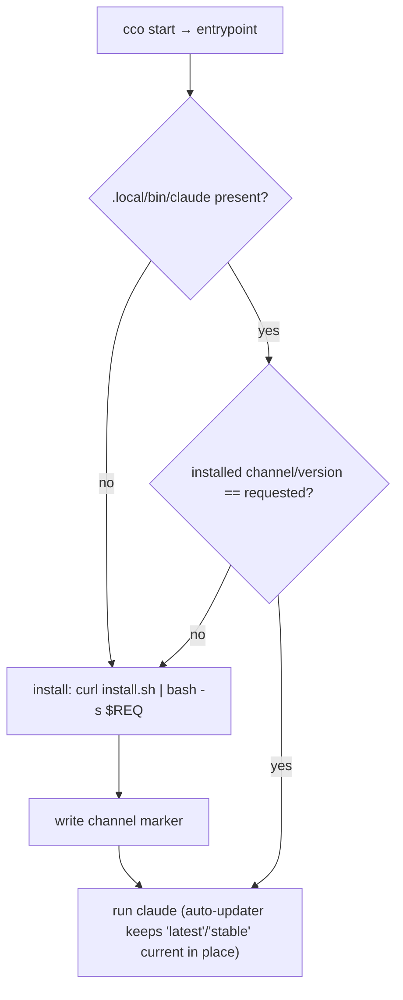

# Handoff E — migrate Claude Code to the native installer (integrate `#B2` onto develop)

> **✅ RESOLVED (2026-06-29)** — implemented on `feat/docker/native-claude-install`
> (commits `ebe0e1b` impl+tests, `5f6b975` docs). Decisions locked: **no migration**
> (purely additive), config knob **`~/.cco/claude-version`** (default `latest`).
> Authoritative design now lives in **ADR-0039** (`decisions/0039-native-claude-install.md`)
> and **`design/design-docker.md` §1.2.1**; changelog **#24**. Suite **1022/0**.
> **Pending host e2e**: entrypoint/Dockerfile changes are inert in a running
> session (self-development) — validate with `cco build && cco start` on the host
> (first start ~30s install; verify auto-update, re-pin, and `cco clean --all`
> leaves the cache). The text below is kept as the original coordination record.

> **Created**: 2026-06-29 · **Branch to create**: `feat/docker/native-claude-install` off `develop`.
> **When**: **do this FIRST — before B and C.** Small, self-contained Docker/runtime change.
> **Gating**: not release-gating, but removes an active deprecation + fixes the `/doctor` warning.
> **Origin**: re-implementation of Rares' `origin/feature/roadmap-item-#B2` (single commit `c3624f4`,
> written on the **legacy** base `d30b82f`/v0.3.0). Keep attribution to Rares in the commit trailer.
> **ADR**: assign next free at authoring (0036–0038 are reserved for B/C/D → use **0039**).

Coordination artifact. Authoritative design lives in
[`environment/design/design-docker.md`](design/design-docker.md) and the new ADR.

---

## 0. Why (validated)

`cco` bakes Claude Code into the image via `npm install -g @anthropic-ai/claude-code` +
`DISABLE_AUTOUPDATER=1`. That method is **officially deprecated** and breaks in-place auto-update:

- Official Claude Code docs (llms): *"deprecation notification for npm installations — run
  `claude install`"*; the native installer is `curl -fsSL https://claude.ai/install.sh | bash`, and it
  *"accepts either a specific version number or a release channel (`latest` or `stable`)"* via
  `bash -s <value>`. With the native installer the OS auth-grant persists across updates (npm does not).
- The npm layout (root-owned global dir, `DISABLE_AUTOUPDATER=1`) is why upgrading needs
  `cco build --no-cache`, and why Claude Code 2.x `/doctor` warns about `~/.local/bin/claude`.

Rares' approach is **correct and aligned with the official method**. It cannot be merged/cherry-picked
as-is: it was written ~360 commits back on the legacy (pre-decentralized-config) tree. This handoff
re-implements it on current `develop`.

## 1. The mechanism (target behavior)

- The image no longer contains the Claude Code binary. The **entrypoint installs it at first start**
  into `/home/claude/.local/` (`bin/claude` + `share/claude`).
- `/home/claude/.local/{bin,share/claude}` are **bind-mounted from a persistent host dir**, so the
  binary + its state survive container restarts and **auto-update in place** (no rebuild needed).
- Version/channel is driven by `CLAUDE_CODE_VERSION` (ENV), forwarded to the installer.

## 2. Decisions locked in (maintainer, 2026-06-29)

1. **Default channel = `latest`** (maintainer wants new models immediately). Add a **config knob** so a
   user can opt into `stable` or pin a specific version — default stays `latest`.
2. **Re-pin must work.** Installing only "when the binary is absent" (Rares' v1) cannot switch an already
   installed version. The entrypoint must reinstall when the **requested** channel/version differs from
   the **installed** one.
3. **`cco clean` must never touch the Claude install cache** — confirmed it already doesn't (it only
   removes `.bak`/`.new`/`.tmp/`/generated compose; it never scans the CACHE bucket). Keep it that way
   when choosing the host location (see §3).
4. **`cco build --no-cache` = reset cache + reinstall latest.** Today `--no-cache` only rebuilds image
   layers (which no longer hold the binary). Wire it to also wipe the Claude install cache so the next
   start does a clean install.
5. **Auto-update without rebuild = yes** — confirmed: writable persistent mount + auto-updater enabled
   (drop `DISABLE_AUTOUPDATER`) means Claude Code updates itself across restarts, no `cco build` needed.

## 3. Integration plan — re-home onto develop's architecture

Develop replaced `$GLOBAL_DIR` with the XDG 4-bucket model (`_cco_config_dir`, `_cco_data_dir`,
`_cco_state_dir`, `_cco_cache_dir` in `lib/paths.sh`). Map the feature accordingly.

| Area | Rares (legacy) | Target on develop |
|---|---|---|
| **Host install dir** | `$GLOBAL_DIR/claude-install/{bin,share}` | **CACHE**: `$(_cco_cache_dir)/claude-install/{bin,share}` (re-fetchable; untouched by `cco clean`). Add a `_cco_claude_install_dir` helper in `lib/paths.sh`. |
| **Dockerfile** | native-install block | Remove `RUN npm install -g @anthropic-ai/claude-code` **and** `ENV DISABLE_AUTOUPDATER=1`; keep `ARG CLAUDE_CODE_VERSION` → `ENV CLAUDE_CODE_VERSION`; add `ENV PATH="/home/claude/.local/bin:${PATH}"`. |
| **entrypoint.sh** | first-run install | Port the install block; **extend** with channel/version-marker compare (decision 2). Runs as `claude` via gosu. `mkdir -p`+`chown` the `.local` dirs first. |
| **cmd-start.sh** | `mkdir` + 2 bind mounts under `$GLOBAL_DIR` | Re-place into develop's compose generator + state-prep using `_cco_claude_install_dir`; mount `bin`→`/home/claude/.local/bin`, `share`→`/home/claude/.local/share/claude`. |
| **cmd-build.sh** | — | On `--no-cache`: `rm -rf "$(_cco_claude_install_dir)"` so next start reinstalls fresh (decision 4). |
| **Config knob** | — | Channel/version preference in the `~/.cco` global config (default `latest`), read at `cco start`/`build`, forwarded as `CLAUDE_CODE_VERSION`. `cco build --claude-version` remains the one-off override. (decision 1) |
| **Migration** | `015_claude_install_dirs.sh` | **015/016 are taken** → renumber to **`017_claude_install_dirs.sh`**. Re-evaluate necessity: the XDG buckets are created by the first-run bootstrap (J0); the entrypoint + `cmd-start` create the dir defensively. Keep the migration only if it adds value for existing installs; otherwise drop it. |
| **changelog.yml** | legacy entry | Fresh **additive id 24**. |
| **Docs** | `docs/maintainer/integration/docker/design.md` (pre-reorg) | `docs/maintainers/environment/design/design-docker.md` (living) + the new ADR-0039. |
| **Tests** | `tests/test_start_dry_run.sh` (+49) | Port, adapting to the new mount paths; add a re-pin / channel-marker test. |

### Re-pin detail (decision 2)
Persist a marker of the last-installed request next to the binary (e.g.
`$(_cco_claude_install_dir)/.cco-claude-channel` holding `latest`/`stable`/`<x.y.z>`). On start:
reinstall when `bin/claude` is absent **or** the marker ≠ current `CLAUDE_CODE_VERSION`. This makes
`cco build --claude-version X` (or the config) actually switch versions, **and** avoids reinstalling on
every start for channel values (a bare channel string isn't a version number, so a naive
`claude --version` compare would loop).

## 4. Definition of done
- Image builds without the Claude Code binary; container installs it at first start; subsequent starts
  reuse the cached binary and **auto-update in place** (verify: no `DISABLE_AUTOUPDATER` anywhere).
- `cco build --claude-version <x.y.z>` (and the config knob) **re-pin** an already-installed container.
- Config knob selects `latest` (default) / `stable` / specific version.
- `cco build --no-cache` resets the install cache → fresh latest on next start.
- `cco clean --all` leaves `claude-install/` untouched (regression test).
- Suite green; new tests for mount wiring + re-pin marker.
- `design-docker.md` updated; ADR-0039 written; changelog #24 added.
- Commit credits Rares (`Co-Authored-By` / "re-implements #B2").

## 5. Risks & notes
- First start on a fresh machine adds ~30s for the install (acceptable; one-time per cache).
- Network at first start is required (installer fetch) — fail loud (Rares already `exit 1`s on failure).
- macOS Docker Desktop: the host CACHE dir is bind-mounted; ensure perms (`chown claude:claude`) as in
  Rares' entrypoint.
- Keep `latest` as the shipped default per maintainer preference; `stable` is opt-in only.
