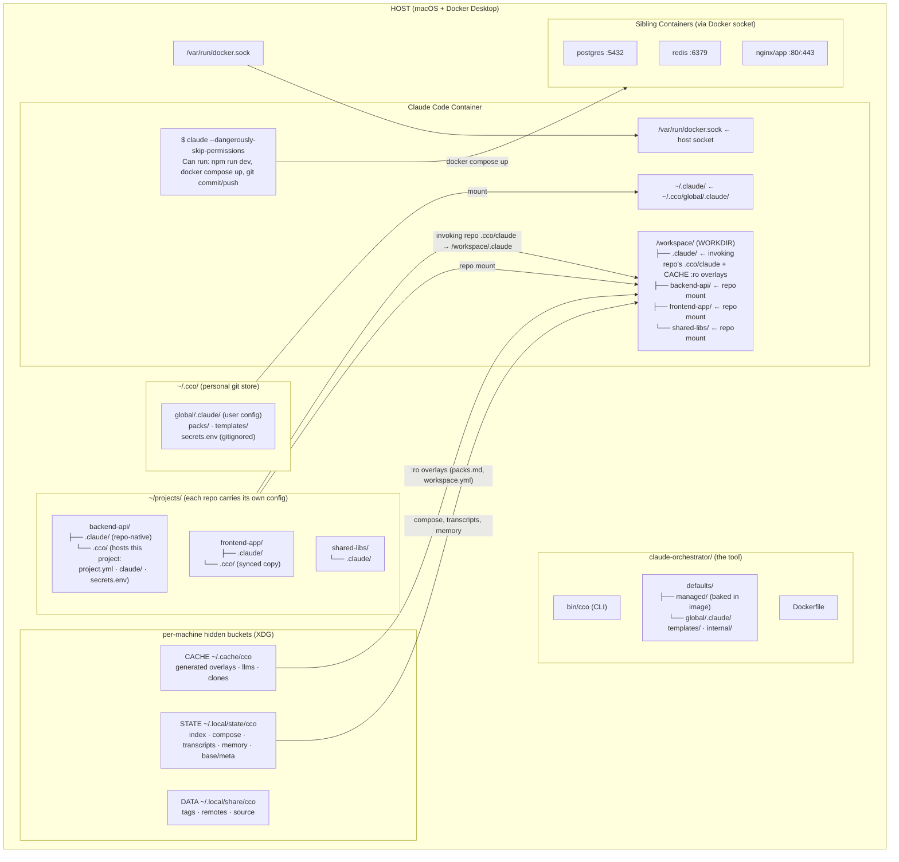
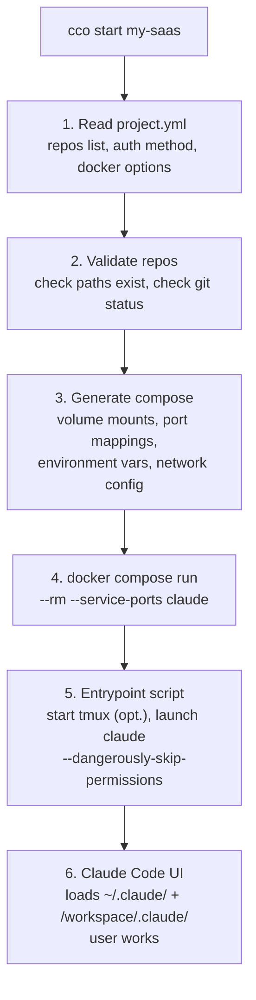
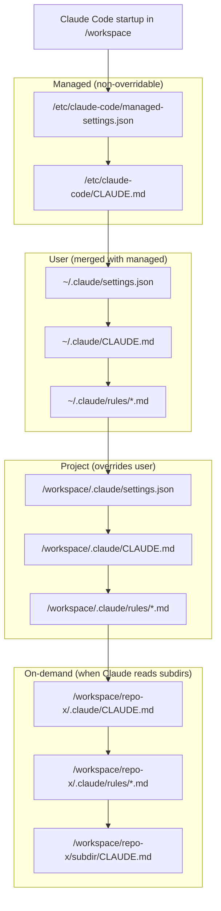
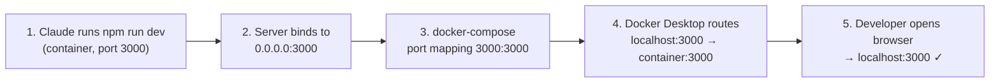
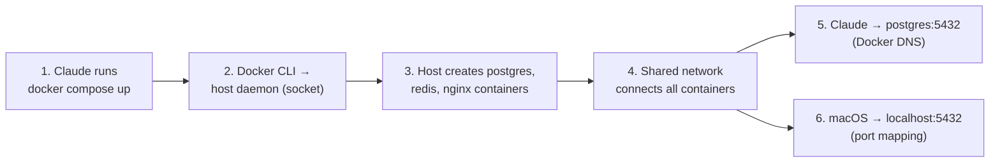

# Architecture & Design

> Version: 1.0.0
> Status: v1.0 — Current
> Related: [spec.md](../analysis/spec.md) | [docker.md](../../environment/design/design-docker.md) | [context.md](../../../users/foundation/reference/context-hierarchy.md)

---

## 1. System Overview



---

## 2. Key Architecture Decisions

The rationale behind every architectural decision now lives in the append-only
[`../adr/`](../adr/) stream. The blocks below are short summaries; follow each link
for the full context, rationale, alternatives, and consequences.

### Architecture decisions index

| ADR | Title |
|---|---|
| [ADR-0001](../adr/adr-0001-docker-as-the-only-sandbox.md) | Docker as the Only Sandbox |
| [ADR-0002](../adr/adr-0002-workspace-layout-flat-subdirectories.md) | Workspace Layout — Flat Subdirectories |
| [ADR-0003](../adr/adr-0003-four-tier-context-hierarchy.md) | Four-Tier Context Hierarchy |
| [ADR-0004](../adr/adr-0004-docker-from-docker-via-socket-mount.md) | Docker-from-Docker via Socket Mount |
| [ADR-0005](../adr/adr-0005-authentication-strategy.md) | Authentication Strategy |
| [ADR-0006](../adr/adr-0006-claude-state-isolation-and-persistence.md) | Claude State Isolation and Persistence |
| [ADR-0007](../adr/adr-0007-display-mode-for-agent-teams.md) | Display Mode for Agent Teams |
| [ADR-0008](../adr/adr-0008-tool-vs-user-config-separation.md) | Tool vs User Config Separation |
| [ADR-0009](../adr/adr-0009-knowledge-packs-copy-vs-mount-for-resources.md) | Knowledge Packs — Copy vs Mount (superseded by ADR-0014) |
| [ADR-0010](../adr/adr-0010-git-worktree-isolation.md) | Git Worktree Isolation |
| [ADR-0011](../adr/adr-0011-external-service-authentication-via-tokens.md) | External Service Authentication via Tokens |
| [ADR-0012](../adr/adr-0012-environment-extensibility.md) | Environment Extensibility |
| [ADR-0013](../adr/adr-0013-secure-by-default-config-parsing.md) | Secure-by-Default Config Parsing |
| [ADR-0014](../adr/adr-0014-zero-duplication-pack-resource-delivery.md) | Zero-Duplication Pack Resource Delivery |
| [ADR-0015](../adr/adr-0015-managed-integrations-convention.md) | Managed Integrations — `.cco/managed/` Convention |

The foundational decisions (ADR-0001 … ADR-0007) are summarized below; the later
decisions are summarized in [§6](#6-additional-architecture-decisions).

### ADR-0001: Docker as the Only Sandbox

Docker is the sole isolation mechanism; native Claude Code sandboxing is disabled.
`--dangerously-skip-permissions` is safe inside the container (blast radius = the
container), and the Docker socket mount is the only intentional privilege
escalation. → [ADR-0001](../adr/adr-0001-docker-as-the-only-sandbox.md)

### ADR-0002: Workspace Layout — Flat Subdirectories

WORKDIR is `/workspace`; each repo is mounted as a direct subdirectory so Claude
Code's recursive CLAUDE.md discovery works with no `--add-dir`. The project
CLAUDE.md at `/workspace/.claude/CLAUDE.md` is primary; repo files activate
on-demand. → [ADR-0002](../adr/adr-0002-workspace-layout-flat-subdirectories.md)

### ADR-0003: Four-Tier Context Hierarchy

Orchestrator config maps onto Claude Code's native managed → user → project →
nested resolution: `defaults/managed/` (baked, non-overridable) →
`~/.cco/global/.claude/` (user) → invoking repo's `<repo>/.cco/claude/` (project) →
each repo's own `<repo>/.claude/` (nested, on-demand).
→ [ADR-0003](../adr/adr-0003-four-tier-context-hierarchy.md)

### ADR-0004: Docker-from-Docker via Socket Mount

The host Docker socket is mounted so Claude can run `docker compose up` to create
**sibling** (not nested) containers on the host daemon — Docker-from-Docker, not
Docker-in-Docker; no `--privileged` flag needed. Port mappings are reachable from
macOS via `localhost:<port>`.
→ [ADR-0004](../adr/adr-0004-docker-from-docker-via-socket-mount.md)

### ADR-0005: Authentication Strategy

Layered, per-project auth: OAuth (default, seeded from macOS Keychain to STATE),
`ANTHROPIC_API_KEY`, GitHub via `GITHUB_TOKEN` + `gh`, and per-project
`secrets.env` loaded as runtime `-e` flags (never written to docker-compose.yml).
→ [ADR-0005](../adr/adr-0005-authentication-strategy.md)

### ADR-0006: Claude State Isolation and Persistence

Auto memory and session transcripts are machine-local STATE keyed by project
`<id>`, mounted into the container — isolated per project, persisted across
container restarts and image rebuilds, and not synced cross-PC in v1.
→ [ADR-0006](../adr/adr-0006-claude-state-isolation-and-persistence.md)

### ADR-0007: Display Mode for Agent Teams

Agent-team panes support both tmux (recommended default, works in any terminal) and
iTerm2 (opt-in, native panes, more setup), selectable via global settings
(`teammateMode`) or the `--teammate-mode` CLI flag.
→ [ADR-0007](../adr/adr-0007-display-mode-for-agent-teams.md)

---

## 3. Component Design

### 3.1 Docker Image

See [DOCKER.md](../../environment/design/design-docker.md) for full specification.

**Key aspects**:
- Base: `node:22-bookworm`
- Installs: Claude Code, git, tmux, docker CLI, docker-compose, dev tools
- Non-root user: `claude` (with docker group for socket access)
- Entrypoint: wrapper script that starts tmux (if configured) then launches Claude

### 3.2 CLI (`bin/cco`)

See [CLI.md](../../../users/reference/cli.md) for full specification.

**Key aspects**:
- Single bash script, no external dependencies
- Reads the invoking repo's `<repo>/.cco/project.yml`, generates docker-compose in STATE, runs container
- Supports: `start`, `new`, `init` / `join` / `init --migrate` (project entry points), `list`, `sync`, `resolve` / `path`, `config save/push/pull`, `tag` / `list --tag`, `build`, `stop`

### 3.3 Context & Settings

See [CONTEXT.md](../../../users/foundation/reference/context-hierarchy.md) for full specification.

**Key aspects**:
- Three-tier hierarchy matching Claude Code native scopes
- Modular rules in `.claude/rules/` at each level
- Auto memory isolated per project

### 3.4 Subagents

See [SUBAGENTS.md](../../../users/integration/guides/subagents.md) for full specification.

**Key aspects**:
- Two default subagents: analyst (haiku, read-only) and reviewer (sonnet, read-only)
- Defined in `~/.cco/global/.claude/agents/`
- Projects can add their own in `<repo>/.cco/claude/agents/`
- Documentation for creating new subagents

---

## 4. Data Flow

### 4.1 Session Startup Flow



### 4.2 Context Resolution at Launch



### 4.3 Network Flow: Dev Server



### 4.4 Network Flow: Docker-from-Docker



---

## 5. Security Considerations

| Risk | Mitigation |
|------|------------|
| Docker socket = root on host Docker | Single-developer workstation; developer reviews all changes |
| `--dangerously-skip-permissions` | Container isolation limits blast radius |
| GitHub auth via `GITHUB_TOKEN` | Fine-grained PAT scoped per project; SSH keys not mounted by default |
| OAuth token in container | Read-only mount; container is ephemeral |
| Claude modifies repos | Feature branches; git provides full history and rollback |
| Sibling containers access | Shared Docker network is scoped per project |

---

## 6. Additional Architecture Decisions

These decisions build on the foundational set in [§2](#2-key-architecture-decisions).
As above, the full rationale lives in the [`../adr/`](../adr/) stream.

### ADR-0008: Tool vs User Config Separation

Three-tier defaults — `defaults/managed/` (baked into the image), `defaults/global/`
(copied once to `~/.cco/global/` by `cco init`), and `templates/project/base/` — so
`git pull` never conflicts with user customizations while framework infrastructure
stays active via Claude Code's managed level. The old `_sync_system_files()`
overwrite mechanism is removed.
→ [ADR-0008](../adr/adr-0008-tool-vs-user-config-separation.md)

### ADR-0009: Knowledge Packs — Copy vs Mount for Resources

**Superseded by ADR-0014.** Originally split pack delivery: knowledge mounted
read-only, while skills/agents/rules were copied into the project's `.claude/` at
`cco start`. ADR-0014 replaces this with mounts for all resource types (zero copy).
→ [ADR-0009](../adr/adr-0009-knowledge-packs-copy-vs-mount-for-resources.md)

### ADR-0010: Git Worktree Isolation

Opt-in `--worktree` mounts repos at `/git-repos/` (hidden from Claude) and creates
container-side worktrees at `/workspace/` on branch `cco/<project>`, so host and
container can work concurrently. Commits persist on the host; default behavior is
unchanged. → [ADR-0010](../adr/adr-0010-git-worktree-isolation.md)

### ADR-0011: External Service Authentication via Tokens

A fine-grained GitHub PAT (`GITHUB_TOKEN`) plus the `gh` CLI credential helper is
the primary external-service auth (git push, `gh`, MCP GitHub). The SSH key mount is
removed from the default compose (opt-in via `docker.mount_ssh_keys`); per-project
`secrets.env` overrides global values.
→ [ADR-0011](../adr/adr-0011-external-service-authentication-via-tokens.md)

### ADR-0012: Environment Extensibility

Five opt-in extension points: `~/.cco/setup-build.sh` (build-time, root),
`~/.cco/setup.sh` and `<repo>/.cco/setup.sh` (runtime), `<repo>/.cco/mcp-packages.txt`
(per-project MCP npm packages), and `docker.image` for a fully custom per-project
image. → [ADR-0012](../adr/adr-0012-environment-extensibility.md)

### ADR-0013: Secure-by-Default Config Parsing

Config parsing is secure-by-default: restrictive defaults for security-relevant
fields, robust boolean normalization, fail-safe fallback on parse error, and
validation before compose generation. **Breaking**: `extra_mounts[].readonly` now
defaults to `true` (read-only). → [ADR-0013](../adr/adr-0013-secure-by-default-config-parsing.md)

### ADR-0014: Zero-Duplication Pack Resource Delivery

All pack resources (knowledge, rules, agents, skills) are delivered via read-only
Docker volume mounts in the generated compose — never copied into project
directories — so the pack store is the single source of truth and `.pack-manifest`
is eliminated. Supersedes ADR-0009.
→ [ADR-0014](../adr/adr-0014-zero-duplication-pack-resource-delivery.md)

### ADR-0015: Managed Integrations — `.cco/managed/` Convention

Framework-generated integration files (e.g. Browser MCP) are written to
machine-local CACHE (`<cache>/cco/projects/<id>/managed/`) and mounted read-only at
`/workspace/.managed/`, then merged into `~/.claude.json` by a generic entrypoint
loop — keeping managed config separate from the user-owned `<repo>/.cco/`. (This was
formerly the inline "ADR section 6".)
→ [ADR-0015](../adr/adr-0015-managed-integrations-convention.md) ·
[managed-integrations protocol & guide](../../integration/guides/managed-integrations.md)

---

## 7. Error Handling

### 7.1 Two-tier error model

The CLI distinguishes **expected errors** (validation failures, precondition
checks) from **unexpected crashes** (set -e/set -u violations, syntax errors):

| Type | Example | Handler | User sees |
|------|---------|---------|-----------|
| Expected | "You have uncommitted changes" | `die()` or `return 1` from command | Error message only |
| Unexpected | Unbound variable, broken pipe | EXIT trap | "cco exited unexpectedly (exit N)" |

### 7.2 Mechanism

```
bin/cco
  set -euo pipefail
  trap '...' EXIT              ← fires only when _cco_completed != true
  ...
  _cco_rc=0
  cmd_sync "$@" || _cco_rc=$?   ← captures expected errors
  _cco_completed=true           ← suppresses EXIT trap
  exit $_cco_rc                 ← propagates original exit code
```

The `|| _cco_rc=$?` pattern prevents `set -e` from killing the script when
a command returns non-zero. The dispatcher captures the return code, marks
completion, and exits cleanly.

### 7.3 Conventions for command functions

- **`die "message"`**: Print error + exit 1. Sets `_cco_completed=true` internally.
  Use for fatal validation errors.
- **`return 1`**: Return error to caller. The dispatcher captures it. Use when
  the function has already printed its error (e.g., `_check_no_active_sessions`).
- **`error "message"; return 1`**: Print error + return. Same as above, explicit.
- Never use `exit 1` directly from library functions — only `die()` or `return`.

### 7.4 Output helpers (`lib/colors.sh`)

| Function | Prefix | Use |
|----------|--------|-----|
| `info()` | `ℹ` | Status updates, progress |
| `ok()` | `✓` | Success confirmations |
| `warn()` | `⚠` | Non-fatal warnings |
| `error()` | `✗` | Error messages (caller continues) |
| `die()` | `✗` | Fatal error + exit 1 |

---

## 7.6 Coding Conventions

See [coding-conventions.md](../../engineering/guides/coding-conventions.md) for the canonical
list of shared services (categorizers, path resolvers, secret scanners)
and the DRY / SRP / atomicity rules that new code must follow. The
document codifies the lessons from the `#B10` / `#B13` / `#D1` class
of bugs so the same drift does not recur.

---

## 8. Limitations and Trade-offs

| Limitation | Impact | Workaround |
|------------|--------|------------|
| Docker Desktop Mac networking | No true `host` networking; port mapping required | Explicit port ranges in project config |
| Auto memory path derivation | Depends on Claude Code internal logic | May need testing; mount path may need adjustment |
| tmux inside Docker | No native clipboard integration with macOS | Use iTerm2 mode or manual copy |
| Container ephemeral by default | Session transcripts lost on container removal | STATE `<state>/cco/projects/<id>/claude-state/` mount persists transcripts; `/resume` works across rebuilds |
| Single Docker daemon | All projects share the daemon | Use distinct network names per project |
