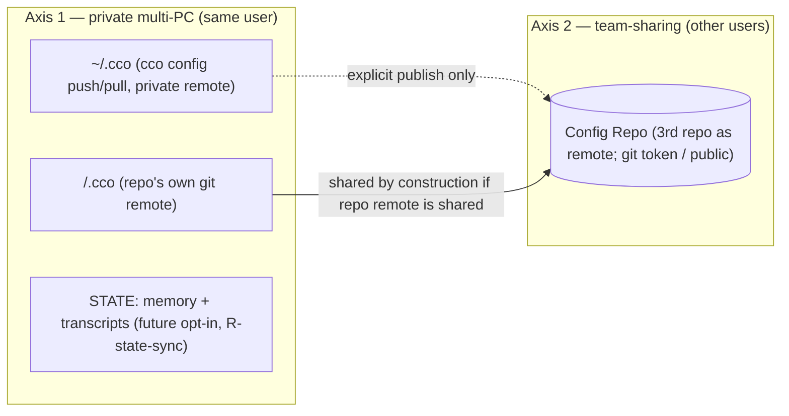

# Decentralized cco Config — Guiding Principles (Foundation)

**Status**: **Source of truth — foundational.** Fixed 2026-06-16. These principles govern the
whole "decentralized in-repo config" refactor. **Every domain analysis must validate its
decisions against this document**; a decision that clashes with a principle is a defect to
correct (in the decision or, deliberately, in the principle).
**Grounded in**: ADRs 0001–0010 (P1–P12 distil their *cross-cutting* rules) and **0018–0020 (P13–P17,
S cycle)**; this document does not restate each ADR. See also
[requirements.md](../../configuration/decentralized-config/requirements.md),
[design.md](../../configuration/decentralized-config/design.md),
[resource-coherence-inventory.md](../../configuration/decentralized-config/resource-coherence-inventory.md),
[analysis-roadmap.md](../../configuration/decentralized-config/analysis-roadmap.md).

> **Location note**: this document now lives in `foundation/` as project-wide
> **governing law** (P1–P18), not only the decentralized-config refactor.

> **Why this exists**: the resource→location mapping and the sharing/sync model were scattered
> across several ADRs and design sections, and destination was being conflated with sync. This
> document fixes the two **orthogonal** classification axes so each remaining domain analysis
> (run in its own clean session) starts from the same foundation.

---

## P1 — Config vs internal: the **edit criterion**

The primary classifier is **who edits the file and how**:

- **Config / resources** — the **user authors and edits** them, **reachable and editable from an
  IDE**. They are versioned and meaningful to the user. `secrets.env` is config too (it is
  user-edited) — merely **gitignored** because it holds secret values; it stays IDE-reachable.
- **Internal** — **cco manages** them, updated **only via the CLI**, **never hand-edited**. They
  must be **hidden** from the IDE and from accidental manual edit/delete, and **never live in a
  config repo** (neither `<repo>/.cco/` nor `~/.cco`). State, cache, indexes, registries, and any
  cco system file the user should never explicitly consult belong here.

Rule of thumb: *if the user is expected to open it in an editor → config; if only `cco …` touches
it → internal.*

## P2 — Destination taxonomy (where a resource physically lives)

| Bucket | Holds | Visibility |
|---|---|---|
| **`<repo>/.cco/`** | project config, machine-agnostic, authored (`project.yml`, `claude/`, `secrets.env` gitignored) | user-facing, in the code repo |
| **`~/.cco/`** | global resources the user **curates/authors** (`packs/`, `templates/`, `.claude/`, `tags.yml`) | user-facing personal store |
| **DATA** (`$XDG_DATA_HOME/cco` → `~/.local/share/cco`) | **internal-but-synced, never-team** — cco-managed (CLI-updated, hidden, **not** IDE-edited), worth **private multi-PC** sync (Axis-1), **never** team: `tags.yml` (ADR-0011), de-tokenized remotes registry, install-provenance `source` (ADR-0013/0015) | **hidden** (internal) — *the 4th bucket, **RESOLVED** by the Cat-4 synthesis (ADR-0015)* |
| **STATE** (`$XDG_STATE_HOME/cco` → `~/.local/state/cco`) | machine-local persistent **state**, **non-portable** (index, generated compose, transcripts, memory, meta, base, hashes, tokens, seeds, sync-meta) | **hidden** (internal) |
| **CACHE** (`$XDG_CACHE_HOME/cco` → `~/.cache/cco`) | regenerable / re-fetchable / transient (generated overlays, Config-Repo clones, llms content, `.bak`) | **hidden** (internal) |

The two config buckets (`<repo>/.cco`, `~/.cco`) hold **only** P1-config. **DATA** holds P1-internal
that is **synced cross-PC but never team** (Axis-1 only); **STATE/CACHE** hold P1-internal that is
**not** synced. The "internal yet privately synced" home — once open — is **RESOLVED**: the **Cat-4
synthesis (ADR-0015)** confirmed the 4th category **exists** and is the XDG **DATA** tier (completing
ADR-0007's CONFIG/DATA/STATE/CACHE mapping, which had left DATA unassigned). Selection rule (applied):
co-locate a lone such resource in `~/.cco` only if it is the *sole* member; with **≥2 members** (tags,
registry, source) a **dedicated bucket** was chosen for cleanliness. *(Transport ∩ STATE-sync (P8):
one git engine may serve DATA + STATE-`/session` + `~/.cco`, with a **per-store sync-class allowlist**
and separate directories — owned by T; ADR-0015 D6.)*

> **`tags.yml` nature + placement RESOLVED (ADR-0011 nature, ADR-0015 placement).** R1 fixed the
> **nature**: the tag interface is **CLI-canonical** (`cco tag add/rm` + `cco list --tag`), so by P1
> tags are **internal** (cco-managed, not hand-edited) — correcting ADR-0010's provisional "config"
> framing. Semantics unchanged (per-user, never team-shared, synced cross-PC). The **physical
> placement** is now resolved by the **Cat-4 synthesis (ADR-0015)**: with ≥2 cat-4 members the
> selection rule chose a **dedicated bucket** → `tags.yml` lives at `<DATA>/cco/tags.yml`
> (`~/.local/share/cco`), **not** in `~/.cco`. ADR-0010 owns *semantics*; ADR-0011 *nature & method*;
> ADR-0015 *placement*.

## P3 — Two **orthogonal** sync axes (never conflate them)

- **Axis 1 — Private multi-PC (same user)**: move a user's own data across **their** machines.
  Transports: `~/.cco` via `cco config push/pull` (private remote); `<repo>/.cco` via the repo's
  own git remote; STATE (memory/transcripts) via a **future** opt-in (P8); a possible
  internal-but-synced bucket (P2).
- **Axis 2 — Team-sharing (different users)**: share with **other people**. Transport: **always a
  third repo acting as a remote** — a **Config Repo** (`publish`/`install`/`update`/`export`),
  access delegated to git (token for private, or public repo). Never by syncing `~/.cco` itself.

A resource's **destination (P2)** and its **sync profile** `{none | private-multi-PC | team | both}`
are independent dimensions. Classifying a resource means answering **both**.

> **Axis-1 remote access (RESOLVED — ADR-0017 D4).** `~/.cco` is **always** a `git init`'d, versioned
> working tree; only the **remote** is opt-in. The remote is **private by default**, reached via the
> user's own git auth (token or local `.ssh`); a **public remote is allowed by explicit user choice,
> with a warning** (cco does not enforce privacy — fragile and excessive). The guides document/recommend
> that team-sharing happens via dedicated **Config Repos** (Axis-2), *outside* `~/.cco`. The warning
> *mechanism* is owned by **S**.

## P4 — A resource is `(destination, sync-profile)`
Every cco-managed resource is classified on **both** axes. The consolidated mapping (domain A)
produces, for each resource: its P2 bucket **and** its P3 sync profile. Neither alone is enough.

## P5 — Sharing asymmetry (and a noted fallback)
- **`<repo>/.cco/` is team-shared *by construction*** when the repo has a shared remote — the same
  git sync serves **both** axes at once (the user's PCs *and* teammates).
- **`~/.cco` is private-only** (Axis 1). Its packs/templates reach a team **only via explicit
  publish** (Axis 2, Config Repo) — never by syncing `~/.cco`.

> **A4 fallback — solo cco adopter in a team (note for awareness; post-v1, not prioritized).**
> Use case: *a user works in a shared team repo but adopts cco alone; the team does not want
> `.cco/` committed in the repo; the user still wants their cco project config versioned and synced
> across their own PCs.* Two options to weigh in a dedicated analysis:
> - **(A)** gitignore the repo's `.cco/` — simplest, but the user loses versioning + private
>   multi-PC sync of that project config.
> - **(B)** opt-in mode where the **project's `.cco/` lives under `~/.cco` (Axis-1 synced), outside
>   the repo** — a simplified fallback reminiscent of the old central vault **but without profiles
>   or custom diff**. Enables the use case while keeping the team repo clean.
> Recorded to do justice to this user profile; decision deferred (likely domain C / a dedicated note).

## P6 — Hide internal files
Internal data (STATE, CACHE, indexes, registries, system files; P1) is **hidden** from the user,
**never in a config repo**, and only mutated through `cco …`. This protects it from accidental
edit/delete and keeps `git diff` on the config buckets truthful (G8).

## P7 — Sync mechanics
- **Sync transports already-made commits; it never fabricates them** (ADR-0008). No per-command
  network sync; `cco config push/pull` is explicit; pull non-fast-forward → abort + notify
  (resolve in the IDE).
- **Team-sharing always goes through a Config Repo** (a third repo as remote); access is delegated
  to git (token / public). `~/.cco`'s own remote is **private**.
- Within one machine, project multi-repo convergence is **sync-as-copy** (AD7), not a merge engine.

## P8 — STATE sync is a distinct, future category
`memory/` and chat transcripts are **STATE**, not config (ADR-0009). Their cross-machine /
cross-team sync is a **separate future opt-in feature (R-state-sync)** — a different *category* of
sync from the config buckets, and explicitly **not** part of the config vaults. v1 = machine-local,
no sync.

## P9 — Packaging-aware; opinionated defaults are shippable separately
No tool code lives in any data bucket (AD11); hooks invoke `cco` by PATH. cco's **opinionated
default resources** may become an **official public Config Repo**, shipped separately (relates to
R-pkg / R-update-native). The framework stays agnostic; opinionated content travels via the same
Domain-B sharing path any user would use.

## P10 — Classify by role & problem, not by surface (method)
A resource is placed (P2 destination + P3 sync profile) **only after** establishing its **role, the
problem it solves, and how it is mutated** — never from its current path or name. Surface placement
(e.g. "it lives under `~/.cco` today") is not evidence; the *role* is. A resource whose role does not
clearly map to a principle is **not** force-fit — it gets a dedicated analysis. This is why each
borderline resource/concept gets its **own clean session** (see `analysis-roadmap.md`): correct
classification needs undivided context on that resource's purpose. Every analysis must: (1) state the
resource's role + problem solved; (2) classify on both axes via P1–P9; (3) flag/resolve any conflict
with the current `design.md`/ADRs; (4) record an ADR + propagate to the living docs.

**Method lessons (ADR-0011).** (a) **Validate, don't assume** — never discard or accept a candidate
*a priori*; classify only from the validated, code-grounded role. A first pass that classified tags
from the *absence* of a CLI (instead of a deliberate CLI-vs-IDE design choice) was the error this
corrects. (b) **Maintainer confirmation** is required on choices that affect how the toolkit is used
(UX, interface, sync strategy) — these are not derivable from code alone. (c) **Cross-cutting
verdicts are synthesised, not per-resource** — e.g. the 4th-category existence is decided by a
dedicated synthesis over *all* candidates (R1–R4), not inside any single resource analysis.

**Method lessons (ADR-0014) — the analysis lens (reusable model).** The winning lens that produced
R4, to re-adopt in future designs: **(1)** ground in code first (current state, role, *how mutated*)
before classifying; **(2) decompose the resource into its constituent data** — a file/resource rarely
has one profile (an llms entry = content + coordinate + cache-state; a repo reference = name + url +
local-path); **(3)** classify each datum on the orthogonal pair **resource-type × sharing/sync-profile**
(P1/P3/P4); **(4) apply the defined principles as discriminators** — notably **P6** (team-shared ⇒ not
internal) and **DRY** (a canonical value is stored once, referenced by-name, never duplicated);
**(5)** heterogeneous profiles within one file = **split signal** → co-locate by profile;
**(6)** separate the **canonical datum** from its **references** and its **local materializations**,
and **resolve at the boundary** instead of duplicating eagerly (normalization over denormalization);
**(7)** fix **nature/classification now**, hand **mechanism** to the owning analysis (S/M), leave
**cross-cutting verdicts** (cat-4) to their synthesis. In short:
*(resource-type × sharing-type) + DRY + principle-coherence + decompose/split + resolve-at-boundary.*

## P11 — Classify every cco datum on three questions (the R3 method, generalized)

For **every** piece of cco-managed information — a **new file**, or **each datum inside one** —
answer three questions **before** placing it. This generalizes the per-datum method R3 applied
(ADR-0013) and must guide the design of any new cco file and every future analysis.

- **(a) Scope / ownership** — is it needed **even without team-sharing** (local + Axis-1 private →
  owned by the config/update analyses, e.g. R3) or is it **exclusive to team-sharing / opinionated
  defaults distribution** (Axis-2 + Class C, P9 → owned by the sharing analysis **S**)?
- **(b) Sync class** — **`never`** (syncing **breaks cco** or violates a security invariant —
  version-tied state, hashes, tokens) · **`opt-in`** (desirable but user-gated, e.g. `memory/` /
  transcripts, P8) · **`required`** (multi-PC by design, Axis-1, **never team** — cat-4 members)?
- **(c) Shared surface** — what does it **touch or share** with the unified diff/update/merge
  mechanism (so a later analysis consumes the boundary instead of re-deriving it)?

A file whose data give **heterogeneous** answers across (a)/(b)/(c) is a **split signal** (cf.
P3/P4; the `.cco/meta` grab-bag was split exactly this way). Co-locate by **answer profile**, not
merely by functional domain.

## P12 — Referenced-resource coordinates: config, decentralized per-unit in the versioned manifest

A resource **referenced by name** from `project.yml`/`pack.yml` (a repo mount, an llms doc) is **not a
monolith** — it decomposes into data with **different sync-profiles**, co-located accordingly (P3/P4):

- **name (id)** — the reference handle in the consuming manifest; travels **with that manifest** (both
  axes).
- **coordinate** `name → url` (+ `variant` for llms / `ref` for repos) — the canonical, **user-known
  locator**. It is **config** (it must be team-shared so a recipient can resolve the resource, and by
  P6 anything team-shared **cannot** be internal). It is **embedded per-unit in the versioned manifest**
  (one uniform `project.yml`/`pack.yml` schema; the `package.json` model — ADR-0016 D2), **not** a
  central registry. The **source of truth is the unit's manifest**; for a **repo** the clone's own git
  remote is ultimately authoritative and the manifest `url` is a **self-healing bootstrap pointer**.
  It travels **with the manifest**: project coordinates ride the **repo remote** (Axis-1 **+ Axis-2 by
  construction**, P5 — there is **no publish boundary** to inject at); pack coordinates ride
  `cco config push/pull` (Axis-1) **and** are resolved-at-publish for the team (the Config-Repo path
  *does* have a discrete boundary). It enables **auto-resolve** (clone/fetch).
- **local materialization** — machine-specific, **internal, local-only, never synced/shared**: the
  repo **local-path** (the **STATE index**, `cco … resolve`, explicit per PC — *not* a per-repo file)
  and the llms **content** (CACHE, re-fetched from the coordinate, deduped per machine by name).

**DRY is scoped to the unit** (the publishable/shareable unit), not globally. Within a unit a
coordinate is stored once; **cross-unit replication of the same upstream is intentional independence,
not an update anomaly** — mirroring the deliberate `project.yml` symmetry across a project's repos
(ADR-0002). Cross-unit consistency is enforced by **CLI tooling** (`cco repo/llms add`, `cco config
coords --diff/--sync`), **not by storage** (ADR-0016 D3) — so no global source of truth is
re-introduced. This unifies repo-mount and llms references under one coordinate model; only the
*resolution backend* differs (repo → clone into the index local-path; llms → fetch into CACHE).
Distinguish this **config coordinate** from internal, CLI-managed, **never-team** data (tags →
ADR-0011; install-provenance `source` → ADR-0013/0015 — DATA): the **team-share requirement is the
discriminator** (team-shared ⇒ config, not internal). *(Established by ADR-0014; **placement
finalized + the central-registry hint corrected by ADR-0016/M** — the by-construction-shared repo
has no publish boundary, so the coordinate must travel in the versioned config.)*

---

> **P13–P17 added by the S cycle (sharing model unification, 2026-06-18).** These distil the
> *cross-cutting* rules of ADRs 0018/0019/0020 (as P1–P12 did for 0001–0017). They are recorded as
> **principles and emergent facts** — including the maintainer's in-session corrections, captured as
> the *principle that emerged* (not as error→fix history) so future analyses avoid the same biases.

## P13 — Sharing path follows the resource's **role**; the project↔pack asymmetry is inherent

A **project** is a *unit-of-work*: config, code, and repos belong together and share **by construction**
via the code-repo remote (Axis 1+2, P5) — there is **no publish boundary**. A **pack/template** is a
*reusable library*: it has no intrinsic code remote and shares via a **dedicated sharing repo** (Axis-2,
a discrete `publish`/`install` boundary). The difference in *sharing mechanism* follows the difference
in *resource role*; it is **structural, intentional, and to be kept** — not a UX wart to erase. Reframe
the mental model (*referenced resources are coordinates; the sharing path follows the role*); do **not**
unify the *mechanism* (a `cco share` facade is lipstick; packs-as-repos buys illusory uniformity).
**Nomenclature (ADR-0018 D1):** "config repo" is retired → **config bucket** (`~/.cco` + `<repo>/.cco`)
and **sharing repo** (the publish/install remote for packs/templates). *Firm constraint:* no rollback to
a central vault — per-project-in-its-repo is a decided win (ADR-0001). *(Established by ADR-0018.)*

## P14 — Referenced-resource reachability is **unified and boundary-less**

repos, llms, and packs are **one category**: resources a unit references **by name + coordinate**. A
**team-shared** unit must carry a **reachable coordinate** for each. Because a project has **no publish
boundary** (P5/P13), reachability is enforced by a **distributed, best-effort, layered** model — **never
a hard block**: *embed-at-add* (the CLI embeds the coordinate) · *heal-at-resolve/start* (backfill a
missing coordinate when the clone is in hand — catches hand-edited, IDE-editable config) · *warn-at-
`cco config validate`* (a deliberate, hook-independent share-readiness check) · *opt-in pre-commit hook*
· *passive ⚠ at start/list*. This **subsumes the repo-URL question and the "never-published pack" gap
into one mechanism** (P-URL ≡ pack-reachability). The validity contract: every referenced id has its
coordinate; ids unique per section; config machine-agnostic (truthful `git diff`, G8). *(ADR-0019 D2.)*

## P15 — A shared resource's **local copy is never its source** (DRY by nature)

Packs (and any DRY referenced resource) are **authored once and reused across N units**; the maintainer's
update **propagates to all consumers — already locally, before any team-sharing**. Therefore a local
**materialization** of a referenced resource is a **reference or cache**, *governed by the live source*
— **never** the source-of-truth. *Discriminator:* the **presence of a coordinate** marks a copy as a
cache of an upstream (live-source-first); its **absence** marks an authored-here, scope-local source.
**Internalizing a copy must never become the source** — that severs exactly the propagation the resource
exists for; internalization is only an explicit **last-layer cache** (or the deliberate `internalize`
verb that cuts the cord). **Bias to avoid (the in-session correction):** treating a "self-contained /
vendored copy" as free — it silently breaks DRY/update propagation. *(ADR-0019 D3.)*

## P16 — Source-of-truth follows **publish**; two **parallel axes** (mount vs update)

On `publish`, the **sharing repo becomes the source-of-truth for everyone** (maintainers included); the
local copy is a **working copy** synced via publish (push) / update (pull) — the git clone↔remote model.
**`publish` must sync-before-push** (pull + 3-way merge), **never** fast-forward-clobber a co-maintainer.
Keep two axes **separate**: **resolution/mount** (what runs: local working-copy → fetch-from-url → cache;
*local has precedence* — you run what you have/edited) is distinct from **update/source-of-truth** (where
updates come from: the remote, post-publish). Do not conflate "what I run" with "where updates come
from." *(ADR-0019 D4/D5.)*

## P17 — **Delegate enforcement to git**; cco assists, never gatekeeps

Permission enforcement (who may **write** vs **read**) is the **git host's** job — exactly as **auth** is
delegated to git (P7). cco is **not in the push path** (sync is plain git + remote, ADR-0008); building a
cco-native enforcer would require a server-side hook and **contradict** the plain-git model. So:
**sharing repo** → host read/write split (read-only token can't push); granular *read*-hiding by
**splitting into multiple repos** per audience; granular *write* via host path-rules (advanced/optional).
**Project repo** → `<repo>/.cco/` is **co-writable** with the code by design (P5; like Claude Code's own
`.claude/`); project config is **intentionally unified** (1 project = 1+ teams). The **only** added
distinction (who may edit `.cco/`) is delegated to **CODEOWNERS + host rulesets**. cco's value-add is
**setup assistance** (optional `cco config protect` scaffolds CODEOWNERS + emits host instructions),
**never enforcement**. **Bias to avoid:** "team needs granular permissions → cco should implement them"
— the intersection with plain-git sync makes a cco-native enforcer self-defeating. *(ADR-0020.)*

## P18 — One repo, one config home; referenced by many

A repo hosts **at most one** project's config (`<repo>/.cco/`, identified by `project.yml` `name`) =
**one development scope**; it may be **referenced** by N projects via the index + embedded coordinate
(Case A). The symmetric "identical `.cco/` across a project's repos" (ADR-0002) is scoped to that
project's **config-bearing** members; cco **never** replicates one project's `.cco/` into a repo that
hosts a *different* project — the `cco sync` guard **skips + warns**, with **no override** (re-home =
de-init or re-init `--sync`). Multi-**host** in one repo is unsupported (bad practice); multi-**reference**
is first-class — the legitimate case is two projects each in *its own* host repo mounting the other. Config
is **distributed per host-repo**, so the audience/sharing boundary coincides with each host repo's remote
(Axis-1+2 by construction, P5); the Axis-1-only / solo-adopter centralization (`~/.cco/projects/`) stays a
post-v1 opt-in, compatible by construction. The whole committed `<repo>/.cco/` is the unit of sync (minus
`secrets.env`); the four `.claude` scopes have distinct reach (repo-native cross-cutting · per-hosted-project
cross-repo · global · managed) — choose placement by intended reach. *(ADR-0024.)*

---

## How to use this document
Each remaining analysis (see `analysis-roadmap.md`) runs in its **own clean session** but **opens
by reading this file**. The analysis must: (1) classify every in-scope resource on both axes (P4);
(2) check each decision against P1–P9; (3) flag and resolve any conflict with the current
`design.md`/ADRs; (4) record results in an ADR + update `design.md` and the
`resource-coherence-inventory.md`.
