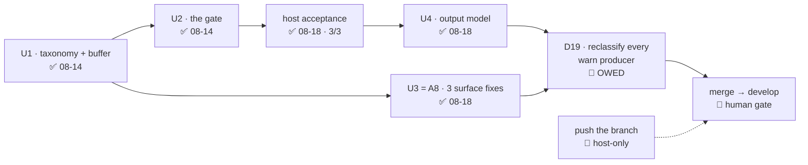

# Handoff — 2026-08-18 (evening)

> **Ephemeral.** At most one of these exists per line of work; the previous was deleted before this
> was written. It links **out** to the roadmap, ADRs and designs — nothing links back to it.

## Methodology / where we are

**Phase: Implementation — and the A5 + A8 cycle has no implementation left.** All four units are on
`feat/cli/start-warning-gate`: **U1** (taxonomy + capture buffer + two lints) and **U2** (the gate),
2026-08-14; **U4** (the output model) and **U3** (= all of [A8](roadmap.md)), 2026-08-18.

Suite **1695 passed / 7 failed of 1702** — the 7 are the [known host-only set](roadmap.md)
(6 `test_as_*` + `test_paths_symlink_safe_tool_root`), verified name for name. Working tree clean,
**27 commits ahead of `develop`**.

**The next work is not code.** It is [D19](roadmap.md), a reclassification session, and it is the only
thing between this branch and its merge.



### Gates still open

| Gate | What unblocks it |
|---|---|
| **[D19] Reclassify every `warn` producer** | one dedicated session — the maintainer asked for it explicitly **before this cycle merges**. Scope, method and definition of done are in the [roadmap](roadmap.md), under A5 |
| **Push `feat/cli/start-warning-gate`** (27 commits, never pushed) | host-only — the command is under *How to resume* |
| **Merge `feat/cli/start-warning-gate` → `develop`** | D19 done, plus a human sign-off. ⚠ The branch is **not merged**: the whole cycle is reachable from this ref and nothing else |
| **macOS host suite (bash 3.2)** | owed before `0.7.0`; nothing has run the full suite on 3.2 since `v0.6.0` (`1626 / 0` on that tree) |
| **One undecided UX residue** | see *Open questions* — not blocking, and the current behaviour is defensible |

## How to resume

**1. Start D19.** It is an analysis-shaped session, not an implementation one, and it has one rule
that carries the whole item:

> ⚠ **Enumerate the producers by RUNNING `cco start` and `cco new`, never by reading a list.**
> Reading a list is exactly how the gap being repaired was created — the §3.3 audit named 12 of the
> ~36 files that call `warn`, and `lib/reminders.sh` (3 sites) and `lib/llms.sh` (1 site, in a loop)
> were reachable and absent from it. *A named list is a lower bound*, sixth occurrence in this repo.

Read, in this order: the D19 block in the [roadmap](roadmap.md) (scope · method · the two questions
it must answer · what it produces · when it is done), then
[ADR-0059 D19](cli/decisions/0059-message-classification-and-the-start-warning-gate.md#d19--the-full-reclassification-is-scheduled-not-assumed)
and §3.2's decision tree in the [design](cli/design/design-warning-gate-and-onboarding-prompts.md).

📝 **`cco start` and `cco new` are host-only inside a session** (ADR-0036 D4), so the enumeration run
itself is a host step. In-container you can source the lib modules and drive `warn`, the renderer and
the lints directly — that is enough to classify and to test, not to enumerate.

**2. Push, from the host** — the one owed action no session can perform:

```
cd /Users/alessandro/Projects/CaveResistance/Software/claude-orchestrator
git push -u origin feat/cli/start-warning-gate
```

**3. Do not re-derive the TTY contract.** `_cco_have_tty` (`lib/utils.sh`) is the single interactivity
spelling, enforced by `test_invariant_tty_gate_single_spelling`. A raw `/dev/tty` probe hangs the
suite silently.

## Tasks

The [roadmap](roadmap.md) is the single source of truth for status; this list points at it.

- [ ] **[D19](roadmap.md) — reclassify every `warn` producer.** Enumerate by running the command; run
      §3.2's decision tree over each; answer the two named questions (do ADR-0008's *non-blocking
      reminders* gate? does `lib/llms.sh` belong at `warn`?); complete the design's §3.3 table; apply
      any reclassification in code **with its test**; forward-annotate whatever document its own words
      now contradict
- [ ] **Push `feat/cli/start-warning-gate`** — host-only (command above)
- [ ] **Merge to `develop`** once D19 is done — the human review point
- [ ] **macOS host suite (bash 3.2)** — owed before the `0.7.0` release
- [ ] **[A1](roadmap.md)** — `cco save`, project-config versioning helper (needs a short design)
- [ ] **[A2](roadmap.md)** — per-project custom Docker image ([FI-49](improvements.md); short design)
- [ ] **[A3](roadmap.md)** — cross-scope collision warning ([FI-32](improvements.md)) + three open decisions
- [ ] **[A6](roadmap.md)** — `.claude/worktrees` in the functional-write floor ([FI-56](improvements.md))
- [ ] **[A7](roadmap.md)** — the A4 review residue ([FI-62](improvements.md) … [FI-66](improvements.md))
- [ ] **FI-58 leftovers** — ADR-0058's **D3**, **D7** and **D8-as-amended** are unbuilt. ⚠ D8 touches a
      **baked** file (`config/hooks/subagent-context.sh`), so whichever unit takes it also takes a
      `cco build` in its acceptance lane

## Context

### Decided this session

Nothing new was decided: U3 built what
[ADR-0059 D12/D13/D14](cli/decisions/0059-message-classification-and-the-start-warning-gate.md) had
already settled on 2026-08-13. Read the ADR, not this line.

What the build **added to a living doc** is [design §6.4](cli/design/design-warning-gate-and-onboarding-prompts.md),
and one claim in §6.2 was narrowed by measurement rather than by argument — see below.

### Open questions needing a human

- 📝 **An unrecognised answer at the gate starts the session** (only `a`/`A` aborts). D10 decided bare
  Enter and `[S/a]`; it did not decide what a stray `n` does. Starting is D10's own reasoning applied
  consistently — *confiscating a session the user asked for is the worse error* — but a re-prompt loop
  is a one-line change and a UX call. **Not blocking.**
- 📝 **[Open decision #7](roadmap.md)** — should `cco clean` sweep `$TMPDIR/cco-warn.*`? The design
  claimed `cco clean --tmp` already did; it does not, and the claim is corrected in
  [design §4.2](cli/design/design-warning-gate-and-onboarding-prompts.md). Adding the sweep is a
  user-visible change to that verb, so it was not folded in silently.
- The five older ones are in the roadmap's [Open decisions](roadmap.md).

### 🔑 Non-obvious things the next session would otherwise rediscover

- 🔑 **The prompts' `read` half is no longer untested, and §6.2's first row was narrowed to say so.**
  `tests/test_resolve.sh`'s `_p8_*` driver `awk`s the shipped function body out of
  `lib/local-paths.sh` **at run time** and `sed`s **only** `read -r reply < /dev/tty` into a queue
  pop; the rendering, the `case` and `_resolve_to_abs` are the shipped code, not a copy. What stays
  unreachable is that one line. `_cco_warn_gate` (`lib/utils.sh:112`) uses the identical spelling, so
  the gate's own prompt is reachable the same way — **noted, not done**, and out of U3's scope.
- ⚠ **That driver must refuse a body it could not patch, and it does.** If the read line is ever
  reworded, `sed` misses it and an unpatched body would **block on `/dev/tty` forever** rather than
  fail an assertion — the capture-hang class, one layer up.
  `test_p8_harness_refuses_a_body_it_could_not_patch` proves the refusal fires on a spelling one space
  away from the real one (`</dev/tty` vs `< /dev/tty`).
- ⚠ **Three silent traps were paid for this session**, all of the shape this repo keeps a list for:
  a queue popped inside `$( )` advances **in a subshell**, so every read replays the first answer
  (measured: the destination read consumed the choice `c` and cloned into `./c`); `out=$(…) 2>file`
  installs the redirect **after** the substitution has already expanded, so the capture is empty while
  the real output scrolls past; and a probe for `--writable` in a refusal message **passes against a
  tree that has no `--writable`**, because `Unknown option: --writable` contains the flag name too.
- 🔑 **FI-68's report has its premise INVERTED, and the correction is load-bearing.** It claims the
  default is `rw`; the code defaults `readonly` to **`true`** (`lib/local-paths.sh:312`). U3 changed
  only the *surface*. `test_add_mount_no_flag_writes_no_readonly_key` now guards the default and
  passes both before and after the fix **deliberately** — it is a P4 guard, not a test of the flag.
- 🔑 **Deferral is conditional on the append succeeding, and that is the invariant.** `warn` reads
  `_cco_warn_capture_append`'s status: buffer unwritable → it prints immediately, exactly as before.
  Do not "simplify" it into an unconditional defer.
- 🔑 **The area is DERIVED from `${BASH_SOURCE[1]}`**, read inside `warn`'s own frame. The file→area
  table in `lib/colors.sh` is a maintained list and is admissible **only because** a missing file
  costs a *label* (falls to `other`), never the warning. A *gating* list would cost the guarantee.
- 🔑 **The gate's placement is asserted STATICALLY, and that is the honest choice** — under
  `CCO_NONINTERACTIVE=1` a misplaced gate and a correct one are indistinguishable, because neither
  prompts. All three placement oracles were measured against the wrong implementation they name.
  ⚠ The line-locator **skips comment lines**: `_start_launch`'s own comment names `docker compose
  run` several lines before the call, and without that a correct order read as a violation.
- 🔑 **A pty makes a prompt drivable by hand**: `printf 'a\n' | script -qec <driver-script> /dev/null`.
  Deliberately **not** in the suite — BSD `script` takes different arguments.
- 🔑 **The in-container bash-3.2 lane loses STDOUT** (the docker socket proxy): only the **exit code**
  comes back, and the container name must start with `cc-claude-orchestrator-`. Encode each verdict in
  a distinct exit code **and** plant a hostile file in the same run, or it is a green check that
  measured nothing.
- ⚠ **When a message changes, grep the suite for the old wording.** A negative control was rescued
  from a silent false pass during U4 for exactly that reason.
- 📝 **No unit in this cycle touches a baked file**, so **no `cco build`** is in the acceptance lane.
- 📝 **The FI-25 mask (`access: {claude: all}` in `.cco/project.yml`) is ON**, deliberately. Masked
  in-container figures are the `…/7` ones. Pin `--claude-access` explicitly for any A4-style
  measurement in this project.

## Reference documents

- [roadmap.md](roadmap.md) — the living SSOT for status and priorities; A5 carries the U1…U4 table and
  the **D19 block this session made runnable from cold**
- [improvements.md](improvements.md) — the `FI-*` tracker; **FI-68, FI-69, FI-70 closed** this session,
  and FI-55's status corrected (it still read *"Not implemented"* four days after A5 shipped)
- [ADR-0059](cli/decisions/0059-message-classification-and-the-start-warning-gate.md) — message
  classification and the start warning gate: D1…D15 + Amendment A1 (D16…D19). **D12/D13/D14 are what
  U3 built; D19 is what is owed**
- [design-warning-gate-and-onboarding-prompts.md](cli/design/design-warning-gate-and-onboarding-prompts.md)
  — mechanism, classification table, test plan. **§5** the three A8 fixes, **§6.2** what the suite
  cannot reach (narrowed this session), **§6.4** U3's driver *(produced this session)*
- [ADR-0058](integration/agent-teams/decisions/0058-teammate-coordination-tools.md) — its D3/D7/D8
  leftovers are in *Tasks*
- [ADR-0027](configuration/decentralized-config/decisions/0027-config-editor-builtin-and-edit-protection.md)
  — its **D2** is the precedent `--writable` restored symmetry with
