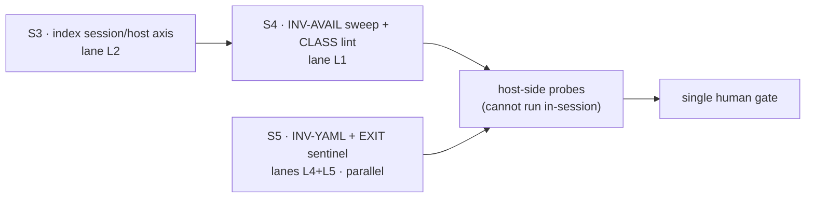

# Handoff — S2 accepted; S3 → S4 → S5 are approved to run as one implementation block

> **Ephemeral.** Delete this file before writing the next handoff. It links out only.
> Written 2026-07-29, after cycle-1.2 **S2** was accepted.

## Methodology / where we are

Branch **`fix/release/cycle-1.2`** off `develop` (which is level with `origin/develop`).
**20 commits, nothing pushed.** Tip `b1f20ef`.

**Design is closed for this cycle.** S1 (lane L3) and S2 (lanes L1+L2) are both accepted:

- **S1** — [ADR-0055](environment/decisions/0055-claude-runtime-state-and-mountpoint-ancestry.md),
  accepted 2026-07-28, both container probes green.
- **S2** — [ADR-0056](configuration/agent-cco-access/decisions/0056-availability-model-and-index-session-axis.md),
  accepted 2026-07-29, design-only. D1–D9 plus six recorded alternatives.

The phase is now **Implementation**. The next session runs **S3 → S4 → S5** as one block.

### The HITL dial for the next session — read this before asking for a gate

The maintainer **explicitly relaxed** the per-phase gates for the implementation block on
2026-07-29. Per `.claude/rules/workflow.md`, delegation is a per-session dial, so this is a
legitimate setting, and it is recorded here rather than inferred:

- **One human gate only**, at the **end** of the whole block (after S3, S4 and S5 are implemented
  and verified). Do **not** stop for a gate between S3 and S4, or between S4 and S5.
- What is **not** relaxed, because it is not a gate: *"anything touching future extensibility,
  system capabilities, UI/UX, or user-visible flows stops and asks, even mid-implementation."*
  ADR-0056 settles the user-visible wording, so this should not fire — but if the implementation
  discovers a decision the ADR does not cover, **stop and raise it**. A decision never made is not
  covered by a relaxed gate.

## How to resume

1. Confirm the ground: `git log --oneline -1` → `b1f20ef` on `fix/release/cycle-1.2`.
2. Read **[ADR-0056](configuration/agent-cco-access/decisions/0056-availability-model-and-index-session-axis.md)**
   in full. It is the reference for **both** the implementation and the verification of S3 and S4 —
   D6/D7 for S3, D1–D5/D9 for S4. It is **not** the reference for S5 (see below).
3. Establish the suite baseline before touching anything, and **state whether
   `access: {claude: all}` was on** when you record the number (see *Context*).
4. Launch S3. Then S4. S5 may start at any time, in parallel, in its own worktree.

### Orchestration approved for the next session

Each `S*` runs **in its own session with dedicated context** — a subagent per unit, or a workflow.
This was requested explicitly, so the general "do not use subagents unless asked" preference does
**not** apply to this block.

| Unit | Order | Isolation | Why |
|---|---|---|---|
| **S3** | first | main branch | Shares `lib/cmd-project-query.sh` with S4 |
| **S4** | after S3 | main branch | Same file: S4 rewrites `:249-253`, S3 rewrites `:301` + the index guard. **Parallelising these two would collide** |
| **S5** | any time | **separate worktree** | Touches `cmd-project-add.sh`, `cmd-init.sh`, `cmd-join.sh`, `bin/cco` — no overlap with S3/S4. Per `git-practices.md`, parallel work goes in a worktree |

Each unit is **verified, and corrected if needed, before the next begins**. In-session that means:
the suite, the unit's own regression test, and the unit's lint self-test — **not** a probe (below).

## Tasks

Status lives in the [roadmap](roadmap.md) §B2-next (lanes L1–L5) and in §2 of the runbook; this list
points at them, it does not fork them.

- [ ] **S3** — index-health session/host axis (**R-C** 🔴) → lane **L2**. Reference: ADR-0056 **D6 +
      D7**. Owes a regression test reproducing §10.9d. **Owes a host-side container probe it cannot
      run itself.**
- [ ] **S4** — INV-AVAIL sweep + CLASS lint (**R-A**, **R-B** 🔴) → lane **L1**. Reference: ADR-0056
      **D1–D5** for the model, **D9** for the lint.
- [ ] **S5** — INV-YAML + EXIT-trap sentinel → lanes **L4 + L5**. Reference is **not** ADR-0056 —
      see *Context*.
- [ ] **S6** — close-out: §10.9e/E6B-04 (never executed in any round), host cleanup of the stale
      remotes/projects, README platform contradiction (`:59` vs `:220`).
- [ ] **D7 residual from S1** — *"composes with no packs at all"*. Needs a project referencing **no**
      pack, so it is **host-side**. Only
      `test_claude_view_composed_for_the_write_floor_without_packs` covers it today.
- [ ] **Host-side, the maintainer's** (FI-20 — merges touching `.cco` are host-only): `git push` this
      branch, then the merge into `develop`.
- [ ] **[FI-37](roadmap-backlog.md)**, **[FI-38](roadmap-backlog.md)** — filed, not scheduled.
- [ ] **[FI-39](roadmap-backlog.md)** — Claude Code memory state cco does not persist. **One ADR,
      after this cycle** — scheduled by the maintainer, not open for re-litigation.

## Context

### What this session decided

**S2's ADR — [ADR-0056](configuration/agent-cco-access/decisions/0056-availability-model-and-index-session-axis.md)**,
accepted design-only. Do not restate it; read it. Two decisions inside it were taken by the
maintainer during the design and are **not open for re-litigation**:

1. **R-B's hidden-set count is computed host-side at `cco start`** and carried as a session signal.
   An elevated read op (`store-op count`) in the setuid helper was **rejected**: ADR-0047's boundary
   is not widened for a cosmetic datum. Accepted cost — the count is a session-start snapshot.
2. **`absent`-in-session gets two causes and two sentences**, split by probing the parent's
   traversability: a severed bind versus an unreachable store (the native-Linux default).

Forward notes were written **into** ADR-0043 and ADR-0047, not merely listed in ADR-0056 — that was
S1's review lesson (*annotate the ADR that owns the thing you changed*), applied.

### Three qualifications on "the design is the reference" — the next session must not assume otherwise

The maintainer asked whether design and ADR are settled and serve as the reference for
implementation and verification. **For S3 and S4: yes.** Three qualifications, each load-bearing:

1. **S5 is not covered by ADR-0056.** Its reference is the runbook
   [§6](configuration/agent-cco-access/e2e-review/fix-design-v3.1/00-plan.md) plus
   [`invariant-gap-audit.md`](engineering/analysis/invariant-gap-audit.md) §4, which state INV-YAML,
   its rule, its four-verb surface and its test shape. That is design-level and sufficient — S5
   needs **no ADR**, and the runbook's "Produces" column does not ask for one.
2. **ADR-0056 defines the model, not the site list.** D9 and the runbook both say it: **S4 must
   enumerate its sites by grepping the reserved strings.** The named list
   (`cmd-project-query.sh:249-253`, `access-scope.sh:688`/`:785`, the `project coords` lane,
   `cmd-pack.sh`'s validate remedy) is a **lower bound** — cycle-1.1's S9 established that a named
   file list always is.
3. **Verification cannot be completed in-session, and no agent can fix that.** Cycle-1.2 **Rule 1**:
   suite-green is not acceptance for S1, S3 **and S5**. S3's acceptance needs a probe in a real
   container after `cco build`, and `cco start` is refused in-session. So the block's in-session
   verification (suite + regression tests + lint self-tests) is real but **not sufficient** for S3.
   The probes belong to the single final gate, run from the maintainer's host.

### Open question to settle at S5's start — do not guess it

Rule 1 lists **S5** among the units that suite-green cannot accept, and the roadmap lists lane
**L4** in the same warning — yet §6.1's own *Test* line specifies a **golden-file round trip**,
which is a suite test. Either the golden-file test is sufficient for L4 and Rule 1's list is too
broad, or INV-YAML additionally owes a real invocation of `cco project add|init|join` against a
project.yml with full comment furniture. **Ask the maintainer which**, at S5's start. Note that
those verbs are write verbs: a `read-project` session is refused, so a real-invocation check is
host-side too.

### Non-obvious things worth not rediscovering

- **`lib/index.sh` has no elevated read path.** Only writes cross the setuid helper
  (`store.sh:246,314`). That asymmetry is *why* ADR-0056 D5 had to move the count host-side — it was
  not a preference.
- **`_index_read_state` must stay mechanical.** Its optional file argument lets the reconcile probe
  classify *arbitrary* index files with the same classifier, so the session axis lives in
  `_index_assert_readable` (D6). Putting it in the classifier would break a second, unrelated
  consumer.
- **Any suite figure from a self-dev session must state whether `access: {claude: all}` was on.**
  The block is still uncommitted in `.cco/project.yml` and is currently **on**. With it on,
  `test_update_new_file_added` and `test_update_dry_run` pass; with it off they fail, because they
  write into `defaults/global/.claude/rules/`, tracked *and* `:ro` when `Cr=ro`. The unmasked figure
  is **1551 passed / 9 failed of 1560**; seven of the nine are the long-standing host-only set.
  **This mask has now cost three wrong numbers in this cycle.**
- **`cco start` runs host-side.** Edits to `lib/` change behaviour on the next start with no rebuild;
  Dockerfile edits need `cco build`. Record provenance (`cco whoami` → `image built from:`) with any
  probe.
- ⚠ **S3's probe path is `~/.local/state/cco/`*`shared/`*`index`.** The pre-S1 `state/cco/index` no
  longer exists; a copy-paste of the older command moves nothing and produces a **false pass**.
- **The W4 report's diagnosis of R-B is wrong**, and ADR-0056 D5 records the correction: packs *are*
  wired into the scope layer (`cmd-pack.sh:116` calls `_env_note_hidden`, `:134` flushes). The real
  cause is that at `G=none` the store is not mounted, so the loop never iterates.
- The working tree carries three untracked paths that are **not** this cycle's (`tmp`,
  `to-verify-guides-docs.md`, `.claude/worktrees/`) and an uncommitted `.cco/project.yml` that also
  contains a port change (`8081` → `8082`) beside the access block. **Leave them alone unless asked.**

## Reference documents

- [Roadmap](roadmap.md) — §B2-next, lanes L1–L5 (SSOT for status) · [backlog](roadmap-backlog.md)
- [Cycle-1.2 runbook](configuration/agent-cco-access/e2e-review/fix-design-v3.1/00-plan.md) — §1 the
  two governing rules · §2 session map · §5 S3/S4 · **§6 S5** · §7 acceptance log · §8 host-only gates
- [ADR-0056](configuration/agent-cco-access/decisions/0056-availability-model-and-index-session-axis.md)
  — **the reference for S3 and S4**
- [ADR-0055](environment/decisions/0055-claude-runtime-state-and-mountpoint-ancestry.md) — what S1
  decided
- [ADR-0043](cli/decisions/0043-unified-cli-environment-access-scope.md) and
  [ADR-0047](configuration/agent-cco-access/decisions/0047-config-access-enforcement.md) — both
  carry forward notes from ADR-0056
- [`engineering/analysis/invariant-gap-audit.md`](engineering/analysis/invariant-gap-audit.md) — §2
  Gap A (S4), §4 Gap C (**S5's reference**)
