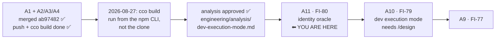

# Handoff — 2026-08-27

> **Ephemeral.** The previous handoff was deleted before this was written. It links **out** to the
> roadmap, ADRs, analyses and improvements — nothing links back to it.
>
> Written for a session that remembers **nothing** of the one that produced it. Everything below is
> either measured and cited, or named as unmeasured.

## Where we are

**Phase: Plan → Implementation.** A1's cycle is fully closed and owes nothing. A new pair of units
was opened today and their analysis is **approved**: **A11** (the identity oracle) then **A10** (the
developer execution mode). A11 needs no design phase — its shape is ruled — so the next step is
implementation, not another gate.

Order inside Block A, ratified 2026-08-27: **A1 → A11 → A10 → A9**, then A2 · A3 · A6 · A7.
⚠ **The numbers are identifiers, not the order.**

### State, measured

| Claim | Measured |
|---|---|
| Branch | `feat/devmode/dev-execution-mode`, **7 commits ahead of `develop`**, tree clean, **not merged, not pushed** |
| Image | `cco build` run **from the clone**; `/opt/cco/BUILD` = `feat/devmode/dev-execution-mode@cc6ba5b`, in the build log **and** in the session that checked it |
| Build equivalence | `git diff --name-only develop..HEAD` lists only `docs/maintainers/**` — **nothing baked**, so building from this branch equals building from `develop` |
| `develop` vs remote | **level** at `ed69492` |
| Merged branches | `git branch --merged develop` → only `develop`, `main`. No worktree to clean (`git worktree list` = one entry) |
| This session's work | documentation only — **no code, no tests changed** |

## Gates still open

| Gate | What unblocks it |
|---|---|
| ▶ **Implement [A11](roadmap.md)** ([FI-80](improvements.md)) | the next unit. Shape is ruled, no design owed — see *How to resume* |
| **Merge this branch** | a human gate. Nothing is merged yet; the 7 commits are documentation |
| **Push this branch** | never pushed. The session could not reach the remote before; verify from the host |
| **[A10](roadmap.md) design** ([FI-79](improvements.md)) | after A11. **Five** questions open in [analysis §11.1](engineering/analysis/dev-execution-mode.md) |
| **[FI-78](improvements.md)** | the 2 macOS test-portability failures (warn-gate cycle, not A1). ⚠ **Host-only measurable** — bash 3.2 is reachable over the Docker socket, BSD `awk`/`mktemp` are not. **Owed before `0.7.0`** |
| **[FI-81](improvements.md)** | fixing the `/analyze` skill needs approval — skills/agents are user-owned config **and** `defaults/global/` is shipped content |
| **[FI-82](improvements.md)** | the `docker run` stdout swallow is **measured, not diagnosed**; and whether the rule belongs in `CLAUDE.md` is a human call |
| **[FI-73](improvements.md)** | the SIGPIPE sentinel — a maintainer's call, unchanged |
| 📝 **the `_secret_scan_staged` pipefail contract** | raised by A2's review as `minor`, **still never ruled**. Under `pipefail` a failing `git diff --cached` (rc 128) makes the function return 128 and the caller prints its refusal with an **empty path**. Fail-closed and unreachable, but it is a silent contract change to a function **both** save gates share |
| **A1's roadmap entry → [roadmap-history.md](roadmap-history.md)** | ~450 lines of a ~1260-line roadmap, closed — but its branch was deleted 2026-08-26, so `rules/documentation.md`'s trigger (*the branch appears among the merged*) **can never fire again**. A maintainer's call now, not an automatic step |
| **[FI-74](improvements.md)** · **[FI-76](improvements.md)** | A1's review residue, none blocking |
| **[A2](roadmap.md)** · **[A3](roadmap.md)** · **[A6](roadmap.md)** · **[A7](roadmap.md)** | the rest of Block A |
| **FI-58 leftovers** | ADR-0058's **D3**, **D7** and **D8-as-amended** are unbuilt. ⚠ D8 touches a **baked** file |
| **[FI-72](improvements.md)** | nothing detects the *next* unclassified `warn` producer |

⚠ **`feat/claude-view-file-overlays` is rares' branch and stays untouched.**

## How to resume

**First command**: `git branch --show-current` — host and container share one working tree, so the
host can move this session's branch under it.

Then **`/implement` A11** ([FI-80](improvements.md); roadmap entry *A11*). Its shape is ruled and has
**two halves, both in scope**:

1. **CLI half** — extend `cco whoami`'s **host** branch (`lib/cmd-whoami.sh:50-70`) with `REPO_ROOT`,
   `_cco_install_provenance` (`lib/paths.sh:541-550`) and the version.
2. **Image half** — a **`LABEL`** on the image carrying the build ref. There is none today
   (measured: `docker image inspect claude-orchestrator:latest --format '{{json .Config.Labels}}'`
   → `null`), and `/opt/cco/BUILD` (`Dockerfile:221-222`) has exactly **one** reader,
   `lib/cmd-whoami.sh:102`, in-container only.

Together they close **all** of the FI-16 residue at `improvements.md:471`, not half of it.

⚠ **Both halves are baked** (`Dockerfile`, `lib/`) ⇒ the acceptance lane takes a **`cco build`**, and
the label cannot be verified before one. Run the build **from the clone**: `./bin/cco build` — see
*Context*.

## Tasks

The [roadmap](roadmap.md) is the single source of truth for status; this list points at it.

- [ ] ▶ **Implement [A11](roadmap.md)** — both halves above; then `./bin/cco build` and verify the
      label with `docker image inspect`, **not** `docker run` (see *Context*)
- [ ] **`/design` [A10](roadmap.md)** — the five questions in
      [analysis §11.1](engineering/analysis/dev-execution-mode.md)
- [ ] **Merge and push** this branch — both open
- [ ] **[FI-78](improvements.md)** — the two macOS failures, host-verified only, owed before `0.7.0`
- [ ] **[FI-81](improvements.md)** — propose the `/analyze` skill + `analyst` agent fix in
      `defaults/global/`, and decide whether it should ship a duplicate of a pack-owned skill at all
- [ ] **[FI-82](improvements.md)** — diagnose *why* `docker run` stdout is swallowed (proxy? daemon
      connection? no TTY?) before deciding where the rule lives
- [ ] **Decide**: move A1's ~450-line closed entry into [roadmap-history.md](roadmap-history.md)
- [ ] **[FI-73](improvements.md)** — the SIGPIPE sentinel
- [ ] **Rule the `_secret_scan_staged` pipefail contract** — open since A2's review
- [ ] **[FI-74](improvements.md)** · **[FI-76](improvements.md)** — A1's review residue
- [ ] **[A2](roadmap.md)** · **[A3](roadmap.md)** · **[A6](roadmap.md)** · **[A7](roadmap.md)** —
      the rest of Block A. ⭐ A2: start from sub-problem 3, the `setup.sh` docs contradict themselves
- [ ] **FI-58 leftovers** — D3, D7, D8-as-amended
- [ ] **[FI-72](improvements.md)** — detect the next unclassified `warn` producer

## Context

### What was decided, and by whom

Four rulings by the maintainer, all on 2026-08-27. They are recorded in the roadmap and in the
analysis (§11.0); this only says that they happened and what follows from them.

1. **The analysis direction is approved** ⇒ the draft was promoted in place to the approved artifact.
2. **Both CLIs coexist** — the npm binary stays installed. The cheap collapse (a `CONTRIBUTING.md`
   change plus a PATH-shadowing check) is **explicitly rejected**, not passed over.
   ⚠ **Consequence**: the dispatcher option **cannot be used until an npm release carrying it
   ships** — the installed `0.6.0` cannot dispatch.
3. **A11 ships before A10**, as its own unit, because it is A10's measuring instrument.
4. **A11 also carries the image `LABEL`** ⇒ it closes all of FI-16's residue.

No ADR was written: these are scope and sequencing calls inside an approved analysis, not
architectural decisions. A10's design **will** need one.

### The measurements a design must not argue away

- 🔴 **The ADR-0052 §1 version gate is DORMANT, not bypassed.** npm `latest` and the clone are both
  `0.6.0`, both `CCO_INDEX_VERSION=2`, both max migration `017`, across **148 commits** and +3246
  lines under `lib/`+`bin/`+`templates/`. ⇒ **`cco --version` is a NON-DISCRIMINATING oracle** and any
  acceptance test built on it is a false pass by construction. Do not let a design say *"the gate
  protects us"*.
- 🔴 **The clone has no name on PATH.** `which -a cco` printed the **same path twice** — one binary
  through a duplicated PATH entry, **not two installs**. So the coexistence just ruled is a state
  **to create**, not one to disambiguate; the ergonomic problem is *the clone has no name*, not
  *which one wins*; and a design that "detects the other install and warns" has, today, **nothing to
  detect**.
- ⭐ **The image tag IS the code identity of the in-session cco.** `Dockerfile:201-211` bakes `bin/`
  and `lib/` into `/opt/cco` and a normal session mounts **no host `lib/`**. `IMAGE_NAME` is
  hardcoded at `bin/cco:37` with no override — 8 consumers plus 7 documentation surfaces, including
  `FROM claude-orchestrator:latest` in the custom-image guide, so the tag is a **published user
  contract**.

### Traps this session paid for

- 🔴 **Inside a session, `docker run` returns rc 0 with EMPTY stdout; only the exit code crosses.**
  Measured on the cco image **and** `bash:3.2`, with `cat`, `echo` and an explicit `-a stdout`.
  `--entrypoint false` → 1, `true` → 0, so the rc channel is intact.
  ⇒ **any in-session check that captures `docker run` output is a false pass**, in the most
  convincing shape there is: rc 0 and nothing to look at. It is why this repo's bash-3.2 idiom is
  **rc-based**. **`docker image inspect` DOES work** in-session (rc 0, real output) — that is the
  channel to use, and the reason A11 carries a `LABEL`. ([FI-82](improvements.md))
- 🔴 **`docker run <image> <cmd>` does NOT replace an ENTRYPOINT.** `Dockerfile:233` sets one, so the
  trailing words become **argv of the entrypoint**, which ends at
  `exec … claude --dangerously-skip-permissions "$@"`. The wrong form **installs Claude Code and
  prints "Please run /login"** — long, plausible output that reads like a working probe. Use
  `--entrypoint cat` before the image, path after.
- 🔴 **`/analyze` forks to a read-only agent and cannot write its own artifact** — two `/analyze`
  skills register at once and `defaults/global/`'s (`agent: Explore`, no `Write`) wins over the
  pack's. **Until it is fixed, the lead must write the analysis file.** The oracle for which one won
  is the **description** shown in the session's skill listing; the `name:` fields are identical.
  `/handoff` runs in the lead (no fork) and does not have this problem. ([FI-81](improvements.md))
- 📝 **The docker proxy refuses past 10 containers with rc 125** — docker's code, not the command's.
  Reached while probing, which is why the **bash 3.2 lint's negative control could not be run**:
  that lint is *unverified* in that session, not verified-ok.
- ⚠ **git in this container needs `safe.directory`**, and `~/.gitconfig` is a read-only bind mount:
  `GIT_CONFIG_COUNT=1 GIT_CONFIG_KEY_0=safe.directory GIT_CONFIG_VALUE_0=/workspace/claude-orchestrator git …`
- ⚠ **The host can change this session's branch under it** — one working tree, two writers.

### Facts that will shape A10's design

- ⚠ `package.json` `files` lists **`"bin/cco"`, not `"bin/"`**, while `Dockerfile:201` does
  `COPY bin/`. A new `bin/cco-dev` would be **baked into the image but never published**, and
  `scripts/check-pack-hygiene.sh` is a **denylist** that would not catch it.
- ⚠ `_cco_config_dir()` (`lib/paths.sh:455-460`) is a literal `$HOME/.cco` with **no override seam**
  ⇒ isolating CONFIG means a new resolver seam or a `$HOME` redirect. Prior art in-repo:
  `scripts/cco-sandbox-e2e.sh`, whose own header names the invisible-state trap.
- ⚠ Reopening the WS-6 *"CONFIG stays shared"* call changes a **pinned** test,
  `tests/test_dev_sandbox.sh:75-86`.
- 🔴 `_run_migrations` runs **target-shared / marker-sandboxed** — `lib/update.sh:138` (target
  `~/.cco/.claude`) and `:432` (target **the user's repo**, so the mutation gets committed). Worst
  reachable writer: `cco init --force` → `rm -rf` of the real `~/.cco/.claude` (`lib/cmd-init.sh:198`)
  re-seeded from the **dev** tree.
- ⚠ `cco --dev-sandbox <verb>` **inside a session is silently consumed and ignored.**
- ⚠ **There is no `cco doctor` verb at all**, and nothing ever reaps a created sandbox.
- ⚠ **Naming-namespace collision**: A10's tag axis, Block **B1** (`cco build` inside `cco update`) and
  **B2** (`cco attach` container naming) all touch one namespace. Sequence it, do not discover it late.

### Open questions needing a human

- The five design questions in [analysis §11.1](engineering/analysis/dev-execution-mode.md).
- Whether to fix `defaults/global/`'s `/analyze` + `analyst` at all, or stop shipping a duplicate of a
  pack-owned skill ([FI-81](improvements.md)).
- Whether A1's closed entry moves to [roadmap-history.md](roadmap-history.md).
- The `_secret_scan_staged` pipefail contract, open since A2's review.

### Still unmeasured — say so, do not assume

- **The `unknown` half of the `/opt/cco/BUILD` oracle is ASSERTED, not measured.** Only `branch@sha`
  has been executed; no npm-provenance build has ever been made. An A11 acceptance test must be
  checked against a binary of **each** provenance or it passes on both.
- **The bash 3.2 lint was not verified** in the session that wrote this (proxy container limit).
- **Why `docker run` stdout is swallowed** was measured, never diagnosed.

## Reference documents

- [roadmap.md](roadmap.md) — the living SSOT; Block A carries A11, A10 and the ratified order
- [improvements.md](improvements.md) — the `FI-*` tracker; FI-79 · FI-80 · FI-81 · FI-82 are new
- [engineering/analysis/dev-execution-mode.md](engineering/analysis/dev-execution-mode.md) — the
  approved analysis; **§11.0** the rulings, **§11.1** what is still open, **§12.1** the host probes
- [ADR-0052 §7](configuration/decentralized-config/decisions/0052-index-integrity-version-gate-and-reconcile.md)
  — `--dev-sandbox` and the WS-6 annotation A10 must either uphold or reopen
- [engineering/design/packaging-distribution.md](engineering/design/packaging-distribution.md) — §4
  parks the image tag, §9 defers the `cco update` split
- [roadmap-history.md](roadmap-history.md) — where a closed unit's entry goes
