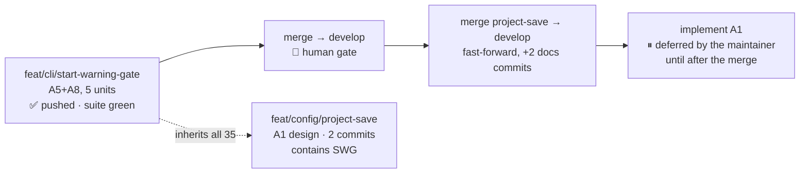

# Handoff — 2026-08-20

> **Ephemeral.** At most one of these exists per line of work; the previous was deleted before this
> was written. It links **out** to the roadmap, ADRs and designs — nothing links back to it.

## Methodology / where we are

**Phase: Design — and A1's design is done and approved.** Two things happened this session, in this
order: the A5+A8 cycle was **re-measured and confirmed green**, and **[A1](roadmap.md) went through
its design gate** and came out three verbs wide instead of one.

The A5+A8 cycle owes nothing. Suite re-run here: **`Results: 1710 passed, 7 failed, 1717 total`**, the
7 verified name for name as the [known host-only set](roadmap.md) (6 `test_as_*` +
`test_paths_symlink_safe_tool_root`). Working tree clean.

🔴 **The push gate closed mid-session.** `feat/cli/start-warning-gate` **has been pushed** — measured,
not assumed: `git reflog show origin/feat/cli/start-warning-gate` reads **`update by push`**, and the
branch is now **0/0** with its upstream at `2eaf45e`. Three previous handoffs carried a wrong push
status for this branch; this one carries a measured one, and the command that measures it is below.



### Gates still open

| Gate | What unblocks it |
|---|---|
| **Merge `feat/cli/start-warning-gate` → `develop`** | a human sign-off. ⚠ Still **not merged**: the whole cycle is reachable from this ref and nothing else. Its diff touches **no** `.cco/` file, so it is *not* host-only under [FI-20](improvements.md) |
| **Merge `feat/config/project-save` → `develop`** | the merge above, first. This branch **contains** start-warning-gate plus 2 docs-only commits, so after that merge it is a **fast-forward of +2**. Its diff also touches no `.cco/` |
| **Implement A1** | ⏸ **deliberately deferred by the maintainer at the design gate**: the design is approved, the implementation waits for the merge so it can start from a clean `develop` branch instead of inheriting 35 commits |
| **A live look at the new pause** | ⭐ still worth one host `cco start` before the merge — the acceptance run measured the form Amendment A2 replaced. Nothing depends on it; the three forms and the abort are covered in the suite |
| **macOS host suite (bash 3.2)** | owed before `0.7.0`; nothing has run the full suite on 3.2 since `v0.6.0` (`1626 / 0` on that tree) |
| **One undecided UX residue** | see *Open questions* — not blocking, current behaviour is defensible |

## How to resume

**1. Merge, from the host.** Both branches, in order. Measure first — never trust a number in a
document, this one included:

```
git branch -vv
git rev-list --count develop..feat/cli/start-warning-gate      # was 35 when this was written
git rev-list --count develop..feat/config/project-save         # was 37 (= 35 + 2)
git merge-base --is-ancestor feat/cli/start-warning-gate feat/config/project-save && echo contains
```

📝 `git ls-remote` **fails in-container** (`Host key verification failed`), so `origin/…` is only what
the local clone last saw. That it saw a push is itself the evidence: the reflog records `update by
push`, and host and container share **one** working tree, which is how a host-side push became visible
here without a fetch.

**2. Then implement A1** — the design is approved and complete; start from
[ADR-0038](configuration/decentralized-config/decisions/0038-project-config-versioning.md) and
[its design](configuration/decentralized-config/design/design-project-config-versioning.md), which
carries the full test plan (T1…T22 across three files) and §6.4 on what the suite cannot reach.

**3. Do not re-derive the TTY contract.** `_cco_have_tty` (`lib/utils.sh`) is the single interactivity
spelling, enforced by `test_invariant_tty_gate_single_spelling`. A raw `/dev/tty` probe hangs the
suite silently.

## Tasks

The [roadmap](roadmap.md) is the single source of truth for status; this list points at it.

- [ ] **Merge `feat/cli/start-warning-gate` → `develop`** — the human review point; the cycle owes
      nothing else, and it is now pushed
- [ ] **Merge `feat/config/project-save` → `develop`** — after the above; a +2 fast-forward
- [ ] **Look at the new pause once on a real terminal** — the earlier acceptance run measured the form
      A2 replaced. Not a blocker
- [ ] **[A1](roadmap.md) implementation** — design approved, deferred until after the merge. Three
      verbs; ⚠ one `cco build` in the acceptance lane, owed by exactly one file (the baked managed rule)
- [ ] **macOS host suite (bash 3.2)** — owed before the `0.7.0` release
- [ ] **[A2](roadmap.md)** — per-project custom Docker image ([FI-49](improvements.md); short design).
      ⭐ Sub-problem 3 first: the `setup.sh` docs contradict themselves, and the answer is a
      **measurement** that changes what the guide should recommend for the other two
- [ ] **[A3](roadmap.md)** — cross-scope collision warning ([FI-32](improvements.md)) + three open decisions
- [ ] **[A6](roadmap.md)** — `.claude/worktrees` in the functional-write floor ([FI-56](improvements.md))
- [ ] **[A7](roadmap.md)** — the A4 review residue ([FI-62](improvements.md) … [FI-66](improvements.md))
- [ ] **FI-58 leftovers** — ADR-0058's **D3**, **D7** and **D8-as-amended** are unbuilt. ⚠ D8 touches a
      **baked** file (`config/hooks/subagent-context.sh`), so whichever unit takes it also takes a
      `cco build` in its acceptance lane
- [ ] **[FI-72](improvements.md)** — nothing detects the *next* unclassified `warn` producer

## Context

### Decided this session

**[ADR-0038](configuration/decentralized-config/decisions/0038-project-config-versioning.md) — project
config versioning and its history surface.** D1…D8, all ruled by the maintainer at the design gate.
Read the ADR and the design, not this line. The two things a summary must not lose:

- **The unit is three verbs**, because D2 ruled that reading a config's history is a **cco** verb on
  *both* stores: `cco project save`, `cco project history`, `cco config history`. The user never needs
  git or a pathspec — and the personal store is the side where they could least construct the git
  command themselves.
- **The ADR number this roadmap reserved and never wrote is now written.** 0038 exists; 0040 still
  does not.

### Open questions needing a human

- 📝 **An unrecognised answer at the pause starts the session** (only `a`/`A` aborts). D10 decided bare
  Enter and `[S/a]`; it did not decide what a stray `n` does. **Not blocking.**
- 📝 **[Open decision #7](roadmap.md)** — should `cco clean` sweep `$TMPDIR/cco-warn.*`?
- 📝 **Two of A1's choices are left to implementation**, both cheap: the default commit message when
  `-m` is absent (the twin uses `config update`), and `history`'s default `-n` limit.
- The five older ones are in the roadmap's [Open decisions](roadmap.md).

### 🔑 Non-obvious things the next session would otherwise rediscover

- ⭐ **Committing a read-only `.cco/` SUCCEEDS.** Measured with a separate `GIT_INDEX_FILE`:
  `git add -- .cco/` returns **0** on a `.cco` bound `ro`, because git reads the worktree and writes to
  `.git/`, which is `rw` — the `.cco` bind is a read-only *child* mount inside a read-write repo. The
  twin's ro-mount guard (`lib/cmd-config.sh:93`) exists because `~/.cco` **contains its own `.git`**,
  and that reason does not transfer. **So ADR-0038 D8's `edit-project+` gate is policy, not mechanism**,
  and `project save` deliberately gets **no** ro-mount guard. Anyone who reasons from the filesystem
  will conclude the opposite and "fix" it.
- 🔑 **At `read-project`, `~/.cco` is not mounted as a store at all** — only the referenced pack is
  bind-mounted under `~/.cco/packs/`. There is no `.git`, which is *why* `cco config history` is gated
  `_op_read_scope global` rather than left free. Exact precedent already in the shim: `template
  show|validate`.
- 🔑 **A `Cco-Save:` trailer would have found 0 of the 5 real config commits in this repo.** All five
  were made by hand, before any verb existed. That measurement, not a preference, is what settled the
  history on a path filter (D3).
- ⚠ **`_sync_synced_files` is the wrong list for `save`.** It looks right and is the *copy* set for
  `cco sync`, enumerated positively so a copy is deterministic. A positive enumeration in a versioning
  verb silently drops a file the user added. Stated in the design §2.3 with the reason attached.
- 🔑 **`lib/reminders.sh` reminder (b) is a caller already waiting for the verb** — it says
  *"→ commit with your normal git flow"* while its sibling (a) says *"→ cco config save"*. That
  asymmetry is what A1 closes, and it is emitted at every `cco start` and every `cco sync`.
- ⚠ **A suite log's `[PASS]`/`[FAIL]` lines carry ANSI colour codes.** Grepping `'^\[PASS\]'` counts
  only the uncoloured minority and under-reports badly (519/6 against a true 1710/7). **The `Results:`
  line is the only authoritative count** — and its *absence* is itself a signal (a bash-3.2 abort
  leaves a log that reads green with no summary).
- ⚠ **A push can land from the host mid-session and no fetch is involved.** Host and container share
  one working tree, so `origin/…` advanced under us. `git reflog show origin/<branch>` distinguishes
  `update by push` from a fetch — use it before writing any push status into a document.
- ⚠ **git in this container needs `safe.directory`** and `~/.gitconfig` is a read-only bind mount, so
  it cannot be set globally. Use
  `GIT_CONFIG_COUNT=1 GIT_CONFIG_KEY_0=safe.directory GIT_CONFIG_VALUE_0=/workspace/claude-orchestrator git …`.
- 📝 **`note()` and the whole warn-capture layer exist only on `feat/cli/start-warning-gate`**, not on
  `develop` (measured: 0 occurrences there, 11 here). That is why the A1 design branch was cut from it
  rather than from `develop`, and why A1's implementation should wait for the merge.
- 📝 **The FI-25 mask (`access: {claude: all}` in `.cco/project.yml`) is ON**, deliberately. Masked
  in-container figures are the `…/7` ones. Pin `--claude-access` explicitly for any A4-style measurement.

## Reference documents

- [roadmap.md](roadmap.md) — the living SSOT; the A1 entry is rewritten and the ADR-numbering note corrected
- [improvements.md](improvements.md) — the `FI-*` tracker
- [ADR-0038](configuration/decentralized-config/decisions/0038-project-config-versioning.md) — **new**:
  project config versioning + the history surface, D1…D8
- [design-project-config-versioning.md](configuration/decentralized-config/design/design-project-config-versioning.md)
  — **new**: mechanism, the three surfaces, the T1…T22 test plan, and §6.4 on what the suite cannot reach
- [ADR-0059](cli/decisions/0059-message-classification-and-the-start-warning-gate.md) — message
  classification and the start-time pause: D1…D15 + A1 (D16…D19) + A2 (D20…D25)
- [design-warning-gate-and-onboarding-prompts.md](cli/design/design-warning-gate-and-onboarding-prompts.md)
- [ADR-0008](configuration/decentralized-config/decisions/0008-personal-store-management.md) — the twin
  `cco config save` lives here, and its *non-blocking* principle bounds what A1 may become
- [ADR-0042](configuration/agent-cco-access/decisions/0042-agent-cco-interaction-model.md) — names
  `cco project save` in its Level-C guidance; A1 D1 chose that spelling so the text needs a deletion, not a rewrite
