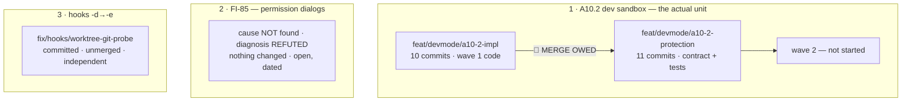

# Handoff — 2026-09-03 · A10.2 **wave 1** built and tested, **not merged**. Three lines of work, deliberately separate.

> **Ephemeral.** The previous handoff was deleted before this was written. It links **out** to the
> roadmap, ADRs, design and analysis — nothing links back to it.
>
> Written for a session that remembers **nothing** of the one that produced it. Everything below is
> either measured and cited, or named as unmeasured.

## Where we are

**Phase: Implementation + Test of [A10.2](roadmap.md) — wave 1 COMPLETE and COMMITTED, NOT MERGED.
Wave 2 not started.**

🔴 **Three lines of work were open in this session and they are NOT the same work.** The session
mixed them once and the maintainer stopped it; do not re-merge them mentally:



⚠ **Line 3 belongs to neither of the other two.** It was found while *reading* a hook during line 2's
investigation, but the defect is a git **worktree** misclassified as a non-repo — ADR-0060 Amendment
A5's class. It has nothing to do with permissions and nothing to do with dev mode's contract.

### State, measured

| Claim | Measured |
|---|---|
| Working trees | **both clean.** `/workspace/claude-orchestrator` on `feat/devmode/a10-2-protection`; the worktree `/workspace/a102-impl` on `feat/devmode/a10-2-impl`. ⚠ Host and container share one tree — measure the branch again before writing |
| 🔴 **impl → unit merge** | **NOT DONE.** `feat/devmode/a10-2-impl` is **10 commits ahead** of the unit branch, and the unit branch carries **3 commits the impl branch has never seen** (`9a0a1d4`, `a904bf8`, `6c4a524`). Measure: `git log --oneline feat/devmode/a10-2-protection..feat/devmode/a10-2-impl` |
| 🔴 **three tests have never met the implementation** | The impl branch merged the tests at `92c7fdb`, **before** the tester wrote the last three. So the A6 init-placement test, the D5 exit-2 assertion and INV-CCOSPEC have **never run against the code**. ⭐ This is the single most valuable thing the next session can do, and it is cheap: merge, then run the suite |
| Suite, unit branch | not run on the merged result — **it does not exist yet** |
| Suite, impl branch | ⚠ **No full-suite figure exists for the final tree** — the run had not reached its `Results:` line when the session closed, and the implementer correctly declined to report one without it. What **is** measured, each with its `Results:` line: `1812 / 7 / 1819` on the pre-rulings tree (identical to baseline, so wave 1 introduced no regression) and, targeted on the final tree, `65 passed / 0 failed / 65` (`test_dev_protection` 23/23 + `test_invariants` 42/42). ▶ **Expect ≈1884 tests** after the merge |
| The 7, and *why* the odd one out fails | the six `test_as_*` plus `test_paths_symlink_safe_tool_root`, which fails in-container with `mkdir: cannot stat '/home/claude/.cache/cco': Permission denied` — the ADR-0047 privilege boundary, not a defect |
| 🔴 **bash 3.2 cover is PARTIAL** | `bash -n` on real bash 3.2 passed on **9 of 14** changed files, including both new ones and `bin/cco`. The other 5 were **not checked**: the docker proxy's 10-container limit stopped the run — and it refuses at **rc 125**, which is *docker's* code, so a naive check reads it as a pass. Those 5 took only flat insertions (no heredoc, no command substitution) and `test_invariant_no_heredoc_inside_command_substitution` passes tree-wide, but **that is an argument, not a measurement** |
| Suite, hooks-fix branch | ✅ **1813 passed / 7 failed / 1820**, `Results:` line **present**, and the 7 are the documented host-only set **name for name** (6 `test_as_*` + `test_paths_symlink_safe_tool_root`). Baseline + the one new invariant. ⚠ **A trap paid on the way there**: an anchored `grep -E '^\[FAIL\]'` returned **6**, because one line carried an ANSI colour prefix. The count said 7 and the names said 6 — **the disagreement between the two is what caught it**, and it was a fact about the instrument, not about the suite. Read both, and treat a mismatch as a question about the grep first |
| Push | `develop` was **level** with `origin/develop` at session start (0 ahead). None of the three branches is pushed |
| A10.1's acceptance gate | ✅ **CLOSED on the host 2026-09-03** and it **discriminated** — see [roadmap](roadmap.md). The real tag's `LastTagTime` stayed at 2026-08-27 while the dev tag was written that day |
| git in this container | `git worktree` **always** needs `GIT_CONFIG_COUNT=1 GIT_CONFIG_KEY_0=safe.directory GIT_CONFIG_VALUE_0='*'`; `~/.gitconfig` is a **read-only host mount**, so `git config --global` is not a route (it fails *"Device or resource busy"*) |

## Gates still open

| Gate | What unblocks it |
|---|---|
| 🔴 **merge `a10-2-impl` → `a10-2-protection`** | nothing blocks it — it is the next command. **Then re-run the suite**: three tests have never met the code |
| **A10.2 wave 2** | `cco dev seed\|reset\|list\|config\|project` (the seams exist), `clean` environment-scoping + `--images`, the [§6.2](engineering/design/dev-execution-mode.md) `cco start` build-ref warn, fixtures, `project.dev.yml` |
| **merge A10.2 → `develop`** | the maintainer's gate, after wave 2 |
| **merge `fix/hooks/worktree-git-probe` → `develop`** | the maintainer's gate. **Independent of A10.2** — mergeable on its own today |
| 🔴 **acceptance of the hooks fix** | **host-only**: `config/hooks/` is **baked**, so the fix is inert until a `cco build`. Verify by spawning a subagent in a session that has a worktree under `/workspace/` and checking the worktree appears in its repo list |
| 📝 **[FI-85](improvements.md)** — the permission dialogs | ▶ **the maintainer's experiment, not runnable from a session**: rebuild + restart, then work normally. ⚠ **The confounder is stated in the entry** — this session was unusually agent-heavy, so a quiet session afterwards proves nothing unless it also runs agents composing multi-stage commands |
| **2 decisions the lead declined to rule** | the fan-out guard **superset**, and the **two rename guard placements** — both below in *Context* |
| **[FI-83](improvements.md)** · **[FI-84](improvements.md)** · **[FI-78](improvements.md)** · **[FI-81](improvements.md)** · **[FI-82](improvements.md)** · **[FI-73](improvements.md)** · **[FI-74](improvements.md)** · **[FI-76](improvements.md)** | unchanged from the previous cycle |
| 📝 **the `_secret_scan_staged` pipefail contract** | raised by A2's review, **still never ruled** |
| **A1's roadmap entry → [roadmap-history.md](roadmap-history.md)** | ~450 lines of a closed unit. Its branch was deleted 2026-08-26, so the automatic trigger can never fire again — a maintainer's call |
| **[A2](roadmap.md)** · **[A3](roadmap.md)** · **[A6](roadmap.md)** · **[A7](roadmap.md)** · **[A12](roadmap.md)** · **FI-58 leftovers** (D3, D7, D8-as-amended) · **[FI-72](improvements.md)** | the rest of Block A |

## How to resume

🔴 **Step 0 — hygiene, before anything else.** This session left **two worktrees** under
`/workspace/` root: `/workspace/a102-impl` (branch `feat/devmode/a10-2-impl`) and
`/workspace/hooks-fix` (branch `fix/hooks/worktree-git-probe`). ⚠ **`/workspace/` root is
container-only and is lost when the container exits**, while the worktree *registrations* live in the
mounted repo's `.git/worktrees/` and persist. After a rebuild git will therefore believe both branches
are checked out in directories that no longer exist, and refuse to check them out. **Nothing is lost**
— both branch refs and all their objects live in the mounted repo's own store (verified before this
was written). The fix is one harmless command:

```
git -C /workspace/claude-orchestrator worktree prune
```

They were not removed at closing time because an agent was still running in one, and yanking a
working tree out from under a live process is worse than leaving a prunable registration.

**First command after that**: `git branch --show-current` — host and container share one working tree.

**Then, in this order:**

1. **Merge and verify** — the one thing that must happen before anything else:
   ```
   git -C /workspace/claude-orchestrator merge feat/devmode/a10-2-impl
   bash /workspace/claude-orchestrator/bin/test
   ```
   ⚠ **A missing `Results:` line is the signal** — an aborted suite reads green and prints no summary.
   Expect the baseline 7 host-only failures and nothing else; anything more is one of the three tests
   meeting the code for the first time, which is exactly what it is for.
2. **Read [ADR-0060](engineering/decisions/0060-developer-execution-mode.md)** — the contract, now with
   **six** amendments. **A6 is new this session** and governs the `cco init` refusal.
3. **Read [`engineering/design/dev-execution-mode.md`](engineering/design/dev-execution-mode.md)** —
   §5 and §5.1 gained three ruled orderings and a measured correction this session; §8.1 is new. For
   wave 2 you need §5.0 (the dev-root layout), §6.2, §7 and §8.

⚠ **Do NOT read the decision clinic to find out what to build.**
[`engineering/analysis/dev-execution-mode-decisions.md`](engineering/analysis/dev-execution-mode-decisions.md)
is **historical** — read it only to see *why* an alternative was rejected.

## Tasks

The [roadmap](roadmap.md) is the single source of truth for status; this list points at it.

- [ ] 🔴 **Merge `a10-2-impl` into `a10-2-protection`, then run the full suite** — [A10.2](roadmap.md)
- [ ] 🔴 **Rule the two decisions the lead declined** (fan-out superset · rename guard placement) — see *Context*
- [ ] ▶ **Build [A10.2](roadmap.md) wave 2** — `cco dev seed|reset|list|config|project` · `clean` scoping + `--images` · the §6.2 build-ref warn · fixtures · `project.dev.yml`
- [ ] **Tests for wave 2** by an independent role, derived from the design. Each new guard shown to **fail when neutralised** before its pass is believed
- [ ] **Living docs for A10.2** — `docs/users/reference/cli.md` §3.34 (`cco dev`, `clean --images`), `changelog.yml`, **rewrite `CONTRIBUTING.md`'s dev section** (its *"today's shape, not the target one"* caveat expires with A10.2) and **a "dev vs distributed" explanation**. ⭐ The widened docs scope is a **maintainer ruling of 2026-09-03**, recorded in the roadmap — not optional polish
- [ ] **Fix the test-file env leak** — `tests/test_dev_mode.sh` and `tests/test_dev_sandbox.sh` unset `CCO_DEV_SANDBOX_ROOT` but **not** `CCO_DEV_ROOT`, now the preferred spelling. Harmless today, a leak the day it is set
- [ ] **Finish the bash 3.2 cover** — 5 of 14 changed files were never parsed on the real interpreter (proxy container limit). ⚠ `docker run … bash:3.2 bash -n <file>`, one file per invocation: `bash -n` reads only the **first** file argument
- [ ] **Update `docs/users/reference/cli.md`** — it does not document `cco dev` at all, and that is now shipped behaviour on the branch (the `changelog.yml` entry, id 70, is done)
- [ ] **Tighten INV-CCOSPEC's Rule B** — it keys on the token `git ` and so fires on the *prose* of a message containing `$_PROJECT_SPEC`. Keying on an invocation *form* would be precise
- [ ] **Merge and accept `fix/hooks/worktree-git-probe`** — independent; acceptance needs a `cco build`
- [ ] 📝 **[FI-85](improvements.md)** — after the rebuild, record whether the dialogs recur, with the date
- [ ] **Decide**: move A1's ~450-line closed entry into [roadmap-history.md](roadmap-history.md)
- [ ] **Rule the `_secret_scan_staged` pipefail contract**
- [ ] the rest of Block A — [A2](roadmap.md) · [A3](roadmap.md) · [A6](roadmap.md) · [A7](roadmap.md) · [A12](roadmap.md), then FI-58 leftovers and [FI-72](improvements.md)

## Context

### What wave 1 shipped

The protection half of the developer execution mode: the pre-run **snapshot store** (§5), **`cco dev
restore`** (§5.1), the **`<repo>/.cco` restorability guard** (§5.2 / D4.8) wired at every classified
writer, and the **D5 migration routing** plus the `CCO_CONFIG_HOME` seam. New files: `lib/dev.sh`,
`lib/cmd-dev.sh`. The rulings are in the ADR and are **not restated here**.

### Decisions taken this session — do not re-open them

1. **[ADR-0060 Amendment A6](engineering/decisions/0060-developer-execution-mode.md#amendments)** —
   D5's refusal covers `cco init` at **both** flows, naming two ways out, and **dev mode cannot
   bootstrap a machine**. ⭐ The intuitive reading (a fresh install has nothing to corrupt, so exempt
   it) was **measured wrong**: the schema marker lives in **STATE** (sandboxed) while the config it
   describes lives in **CONFIG** (shared), so a fresh dev init leaves the published binary seeing
   schema 0 against an already-current config. The fresh case is the *worst* instance of D5's
   divergence, not an exception to it.
2. **`cco dev seed` on a populated dev root says so and does nothing** — exit 0 naming `cco dev
   reset`, no silent `return 0`, **no `--force`**. Design §8.1.
3. **The documentation scope of A10.2 is widened** — see the Tasks entry. Recorded in the roadmap.
4. **Four implementer judgements ratified**: `cco clean` exempt · `cco init --migrate` exempt · the
   store's **local git identity** · refusals naming wave-2 verbs with the dispatcher answering *"not
   implemented yet"* rather than *"unknown command"*.

### 🔴 Two decisions the lead deliberately did NOT rule — they are the maintainer's

- **The fan-out guard is a superset.** `_cco_dev_project_guard_fanout` guards the unit dir **and** the
  members, which over-covers `cco llms rename` (it touches only the primary `project.yml`). The
  implementer's argument — *a guard that under-covers a fan-out is the failure that actually loses
  work* — is sound, but the declared cost is a **refusal a user can hit** on a member repo the rename
  would never have touched. That is a user-facing call.
- **The two rename guards sit in different places** — `pack rename` in Phase 0 (before the confirm),
  `repo rename` after it, each with its own file's preconditions. The lead's view is uniformity
  (*never ask someone to confirm an action you are then going to refuse*), it is one line per file,
  and it is user-perceivable — so it belongs to wave 2 with the maintainer's eye on it.

### ⭐ The enumeration lesson, third order this time

Design §5.2 names 6 writers and **says it is a lower bound**. The mandated re-grep returned **113
hits**, all classified by the implementer (13 guarded → 9 writers / 11 sites; 1 commit-only exempt; 4
create-only; 2 artifact reapers; 3 write-probes; 52 read-only; 38 not `<repo>/.cco` at all).

🔴 **And two writers were found that the mandated command cannot see**: `cco llms rename`
(`lib/cmd-llms.sh:591`) and `cco llms add --project` (`:850+`) reach `<repo>/.cco` through a
**resolver**, not through a literal `"$var/.cco"`. ⇒ **The design's own prescribed enumeration
command is itself a lower bound.** Any future writer sweep must ask *what reaches the path*, not
*what spells it*.

### Two measurement traps paid for this session

- 🔴 **A file-count oracle does not discriminate the A6 guard.** The `--force` branch re-seeds the
  same 24 files, so counting them passes on the destroying implementation. The implementer used a
  **sentinel file** under `~/.cco/.claude`: guard in place → `SURVIVED`, guard neutralised →
  `DESTROYED`. ⭐ When the remedy re-creates what it destroyed, count the *identity*, never the number.
- 🔴 **A restore that leaves index and HEAD diverged bricks the NEXT run**: the following snapshot
  commit comes out empty, `git commit` returns non-zero, and D4.4 turns that into a `die`. Found in a
  throwaway reference implementation before any real code existed. `tests/test_dev_protection.sh` #11
  exists for it.

### On the tester's method, worth repeating

The tests were written **from the design, before the implementation existed**, and proven by a
throwaway reference implementation on a scratchpad copy — **37 mutations, 36 caught**. That process
found **three defects in the tests themselves** and one real defect class. The single survivor (M22)
was correctly analysed as **structural, not behavioural**, and became `INV-CCOSPEC` — a lint, because
a behavioural test structurally cannot catch it.

### Open questions for a human

- The two unruled decisions above.
- **[FI-85](improvements.md)** — whether the permission dialogs survive a rebuild. ⚠ The entry
  records that the **first diagnosis was refuted**: the probe carrying the exact shape that had been
  blamed did not prompt. Do not act on the surviving hypothesis as if it were established.

## Reference documents

- [roadmap.md](roadmap.md) — the SSOT. **A10.2** is the open entry; A10.1 and A11 are one line each
- [engineering/decisions/0060-developer-execution-mode.md](engineering/decisions/0060-developer-execution-mode.md)
  — **the contract**, six amendments, **A6 new this session**
- [engineering/design/dev-execution-mode.md](engineering/design/dev-execution-mode.md) — the *how*;
  §5/§5.1 ruled orderings, §5.2's structural note, §8.1 new
- [engineering/analysis/dev-execution-mode.md](engineering/analysis/dev-execution-mode.md) — the approved analysis
- [engineering/analysis/dev-execution-mode-decisions.md](engineering/analysis/dev-execution-mode-decisions.md) — the clinic, **historical**
- [improvements.md](improvements.md) — **FI-85 new this session**; FI-73 · FI-74 · FI-76 · FI-78 · FI-81 · FI-82 · FI-83 · FI-84
- `scratchpad/finding-permission-prompts-under-bypass.md` — FI-85's working notes, **gitignored and the maintainer's**; the committed record is the FI
