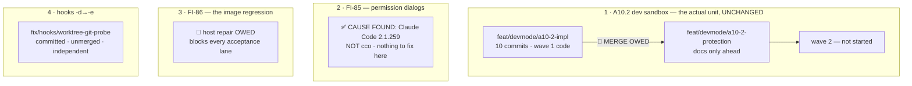

# Handoff — 2026-09-03 (second session) · ⚠ PARTIALLY SUPERSEDED — read the status update first

> 🔴 **STATUS UPDATE, 2026-09-04.** Three things this document says are **no longer true**. It is
> patched rather than rewritten because a full consolidation is owed at the end of the current
> session; where the two disagree, **this block wins**.
>
> - ✅ **The host repair is DONE.** `claude-orchestrator:latest` = `078fe704`, label
>   `feat/devmode/a10-2-protection@74b6164`. The *"Do this on the HOST first"* block below is closed.
>   Ignore it.
> - ✅ **`a10-2-impl` is MERGED into `a10-2-protection`** (`d49d689`, no conflict — the predicted
>   `test_invariants.sh` conflict belongs to the *hooks-fix* merge, not this one). Wave 1's code is on
>   the unit branch; `rev-list a10-2-protection..a10-2-impl` = **0**. ✅ **Suite re-run on the merged
>   tree: 1836 passed / 7 failed / 1843 total**, `Results:` line present, the 7 verified **name for
>   name** as the documented host-only set. Both oracles (count and names) agree.
> - ⚠ **[FI-85](improvements.md) has moved twice.** Its "cause identified" was **retracted**; then E1
>   removed the symptom and **exonerated this project's configuration by measurement**. Cause
>   located, not isolated. **[FI-87](improvements.md)** and **[FI-88](improvements.md)** are new.
>
> ▶ **Still open and unchanged**: the two merges into `develop` (wave 1, and the hooks fix), the two
> wave-1 decisions, and wave 2 — which the maintainer's divergence/concurrency analysis now precedes.

> **Ephemeral.** The previous handoff was deleted before this was written. It links **out** to the
> roadmap, ADRs, design and analysis — nothing links back to it.
>
> Written for a session that remembers **nothing** of the one that produced it. Everything below is
> either measured and cited, or named as unmeasured.

## Where we are

**Phase: Implementation + Test of [A10.2](roadmap.md) — wave 1 COMPLETE and COMMITTED, NOT MERGED.
Wave 2 not started.** The unit did not move this session: it was spent on two defects that surfaced
at session start, and **both are now closed as diagnoses**. This session changed **documentation
only** — no code, no config, no branch position.



---

## 🔴 Do this on the HOST first — nothing acceptance-shaped works until it is done

`claude-orchestrator:latest` was rebuilt **from the published 0.6.0 package**, not from the checkout,
and the tag moved **backwards**. Full record: [FI-86](improvements.md). The session that found it was
running an orchestrator three feature units behind its own working tree.

⚠ **Host and container share ONE working tree**, so the checkout below moves the branch under any
running session. Do it with no session mid-edit, and check the branch back out afterwards.

```
cd /Users/alessandro/Projects/CaveResistance/Software/claude-orchestrator
git status --short                      # must be clean
git checkout develop
./bin/cco build                         # ./bin/cco — NOT the npm-global cco
docker image inspect claude-orchestrator:latest --format '{{index .Config.Labels "cco.build-ref"}}'
git checkout feat/devmode/a10-2-protection
./bin/cco start claude-orchestrator
```

🔑 **The oracle is the label**: it must come back **non-empty** and name the ref you built
(`develop@<sha>`). **Empty means you rebuilt 0.6.0 again** — that is the exact failure being repaired,
and it is silent otherwise.

⚠ **`cco --version` does NOT discriminate** — measured: `package.json` is `0.6.0` in the checkout, on
`develop`, and in the image's `/opt/cco`. `lib/cmd-whoami.sh:56-63` documents this in a comment that
predates the incident. The fields that discriminate are `provenance` + `REPO_ROOT`, printed by A11's
host `whoami` block — which a pre-A11 install does not have.

📝 **Durable fix for this machine, not yet done**: installing cco from the clone (`npm link`, or PATH
precedence for `<repo>/bin`) makes `REPO_ROOT` the checkout **by construction**;
`_cco_install_provenance` already recognises a `clone` provenance. Otherwise every plain `cco build`
on this host keeps rebuilding 0.6.0.

⚠ Building from `develop` deliberately leaves **two** things out of the image: A10.2 wave 1 (unmerged,
unreviewed — it should not be in the image every session uses) and the hooks `-e` fix (unmerged).

---

## State, measured

| Claim | Measured |
|---|---|
| Working tree | **clean**, on `feat/devmode/a10-2-protection`. ⚠ Host and container share it — run `git branch --show-current` before any write, not only at session start |
| ✅ **Worktrees pruned** | The two stale registrations (`/workspace/a102-impl`, `/workspace/hooks-fix`) were **pruned this session**. `git worktree list` now shows the main tree only. Both branch refs and all objects survive — nothing was lost |
| 🔴 **git needs an env prefix here** | `git` in this container throws `dubious ownership` **intermittently** — reads succeeded, then failed on the same path at matching uid. `~/.gitconfig` is a read-only host mount, so `git config --global` is not a route. Use `GIT_CONFIG_COUNT=1 GIT_CONFIG_KEY_0=safe.directory GIT_CONFIG_VALUE_0='*'` |
| **impl → unit merge** | **STILL NOT DONE**, and still routine. `feat/devmode/a10-2-impl` is **10 commits ahead**; the unit branch is ahead **only by documentation**. Measure: `git log --oneline feat/devmode/a10-2-protection --not feat/devmode/a10-2-impl` |
| Suite, impl branch | **1836 passed / 7 failed / 1843 total**, `Results:` line **present**, delta closing exactly (+24 / +24, failed unchanged at 7). Measured last session; **not re-run this session** |
| The 7 | the six `test_as_*` plus `test_paths_symlink_safe_tool_root` — the ADR-0047 privilege boundary, not a defect |
| 🔴 **bash 3.2 cover is PARTIAL** | 9 of 14 changed files parsed on real bash 3.2; the other 5 were **not checked** (the docker proxy's container limit refuses at **rc 125**, which is *docker's* code and reads as a pass) |
| Image, before the repair | `claude-orchestrator:latest` = `d54c1a49a3b9`, `Labels = null`, `Created` **2026-08-26**, baked cco **0.6.0** (0 hits for `build-ref`, 0 for `_cco_dev_image`, no `lib/dev.sh`) |
| ✅ **The dev image is the healthy one** | `claude-orchestrator-dev:latest` = `90d5dae`, label `cco.build-ref: develop@1766f5b`, built 2026-09-03 07:14. **The dev axis took no damage** — A10.1's isolation held exactly as designed |
| `develop` | **level** with `origin/develop` (0/0). None of the three feature branches is pushed |
| Docs changed this session | `improvements.md` (FI-85 rewritten, **FI-86 new**), `roadmap.md` (header + an A10.2 sequencing note), this handoff. **No code, no config** |

## ✅ FI-85 is closed as a diagnosis — and the answer is not cco

The dialogs are a **Claude Code auto-update**, measured: `~/.local/share/claude/versions/` holds
2.1.257 (Sep 1), 2.1.258 (Sep 2 08:55), **2.1.259 (Sep 2 22:58 — the version running)**, on a host
mount shared by every session. Both observations are dated the first day after 2.1.259 landed, and a
session already running keeps its own binary — which is why other projects' long-lived sessions were
unaffected. ⭐ *"Other projects don't do this"* was a **version** difference, not a project one.

**The trigger is a conjunction of four conditions** — `cd` **+** relative path **+** pipeline **+**
`grep`. Remove any one and no dialog appears (PROBE A/B/C, plus eight natural observations; full
table in [FI-85](improvements.md)).

🔑 **Operational rule for any agent working here**: *in a command containing a pipeline, give `grep`
an **absolute** path — or drop the `cd`.* It is **not** "keep commands simple": four-statement
commands and `sed` pipelines were both measured clean.

⚠ **Do not "fix" this in cco.** The deny rules were identical on both images and the symptom survived
a complete image change across two different permission emitters. A cco hook or rule was considered
and **rejected on measurement** — this session's dialogs came from the **lead alone, with zero
subagents running**.

📝 **Unpinned**: which release introduced it. 2.1.258 was never observed. The experiment is
`cco build --claude-version 2.1.257`, then PROBE B — recorded in the FI.

## Gates still open

| Gate | What unblocks it |
|---|---|
| 🔴 **the host image repair** | the block at the top. **Everything acceptance-shaped waits on it** |
| **merge `a10-2-impl` → `a10-2-protection`** | nothing blocks it — it is the next command in-session, and independent of the image |
| ⚠ **a textual conflict is PREDICTED, and its resolution is known** | `tests/test_invariants.sh` gains a lint at its **tail on both** lines of work — `INV-CCOSPEC` on the unit branch, `INV-WT` on `fix/hooks/worktree-git-probe`. **Different** lints, both self-contained ⇒ **resolve by keeping both**, then re-run the invariants file |
| 🔴 **2 decisions the lead declined to rule** | the fan-out guard **superset**, and the **two rename guard placements** — both in *Context*, both user-perceivable |
| 📝 **[FI-86](improvements.md)'s remedy** | proposal 1 (announce the build source) is one line; proposal 2 (warn on a mismatched checkout) is user-facing. **Neither is decided** |
| 📝 **§6.2 first in wave 2?** | a proposal recorded in the roadmap this session, not a ruling |
| **A10.2 wave 2** | `cco dev seed\|reset\|list\|config\|project` · `clean` scoping + `--images` · the [§6.2](engineering/design/dev-execution-mode.md) build-ref warn · fixtures · `project.dev.yml` |
| **merge A10.2 → `develop`** | the maintainer's gate, after wave 2 |
| **merge + accept `fix/hooks/worktree-git-probe`** | independent of A10.2 and mergeable today. Acceptance is **host-only** (`config/hooks/` is baked) and needs the repaired build |
| 📝 **the `_secret_scan_staged` pipefail contract** | raised by A2's review, **still never ruled** |
| **A1's roadmap entry → [roadmap-history.md](roadmap-history.md)** | ~450 lines of a closed unit; its branch is gone, so the automatic trigger can never fire again |
| **[A2](roadmap.md) · [A3](roadmap.md) · [A6](roadmap.md) · [A7](roadmap.md) · [A12](roadmap.md)** · FI-58 leftovers (D3, D7, D8-as-amended) · [FI-72](improvements.md) · FI-73 · FI-74 · FI-76 · FI-78 · FI-81 · FI-82 · FI-83 · FI-84 | the rest of Block A |

## How to resume

**Step 0 — the host repair block at the top.** Then, in the session:

1. `git branch --show-current` — host and container share one working tree.
2. **Confirm the repair from inside**: `cco whoami` should now print an
   `image built from: develop@<sha>` line. **A missing line means the old image is still in use** —
   that line does not exist in 0.6.0's `whoami` at all.
3. **Merge, then re-run the suite as a confirmation** (not as a first meeting):
   ```
   git -C /workspace/claude-orchestrator merge feat/devmode/a10-2-impl
   bash /workspace/claude-orchestrator/bin/test
   ```
   Expect **1836 / 7 / 1843**. ⚠ **A missing `Results:` line is the signal** — an aborted suite reads
   green and prints no summary. Anything but the documented 7 is a regression from the merge itself,
   which is the only thing this run can still discover.
4. **Read [ADR-0060](engineering/decisions/0060-developer-execution-mode.md)** — the contract, six
   amendments; **A6** governs the `cco init` refusal and rules that dev mode **cannot bootstrap a
   machine**.
5. **Read [`engineering/design/dev-execution-mode.md`](engineering/design/dev-execution-mode.md)** —
   §5.0 (dev-root layout), §6.2, §7, §8.1 for wave 2.

⚠ **Do NOT read the decision clinic to find out what to build.**
[`engineering/analysis/dev-execution-mode-decisions.md`](engineering/analysis/dev-execution-mode-decisions.md)
is **historical** — read it only to see *why* an alternative was rejected.

## Tasks

The [roadmap](roadmap.md) is the single source of truth for status; this list points at it.

- [ ] 🔴 **Host: repair `claude-orchestrator:latest`** and verify by label — [FI-86](improvements.md)
- [ ] 🔴 **Merge `a10-2-impl` into `a10-2-protection`, then run the full suite** — [A10.2](roadmap.md)
- [ ] 🔴 **Rule the two decisions the lead declined** (fan-out superset · rename guard placement) — *Context*
- [ ] 📝 **Rule [FI-86](improvements.md)'s remedy**, and whether **§6.2 leads wave 2**
- [ ] ▶ **Build [A10.2](roadmap.md) wave 2** — `cco dev seed|reset|list|config|project` · `clean` scoping + `--images` · the §6.2 build-ref warn · fixtures · `project.dev.yml`
- [ ] **Tests for wave 2** by an independent role, derived from the design. Each new guard shown to **fail when neutralised** before its pass is believed
- [ ] **Living docs for A10.2** — `docs/users/reference/cli.md` §3.34 (`cco dev`, `clean --images`), `changelog.yml`, **rewrite `CONTRIBUTING.md`'s dev section** and **a "dev vs distributed" explanation**. ⭐ The widened docs scope is a **maintainer ruling of 2026-09-03**, not optional polish
- [ ] **Fix the test-file env leak** — `tests/test_dev_mode.sh` and `tests/test_dev_sandbox.sh` unset `CCO_DEV_SANDBOX_ROOT` but **not** `CCO_DEV_ROOT`, now the preferred spelling
- [ ] **Cover the two untested guarded writers** — `cco project import` and `cco repo rename`, named in design §5.2's table and driven by **no test**
- [ ] **Finish the bash 3.2 cover** — 5 of 14 changed files never parsed on the real interpreter. ⚠ `docker run … bash:3.2 bash -n <file>`, **one file per invocation**: `bash -n` reads only the first file argument
- [ ] **Tighten INV-CCOSPEC's Rule B** — it keys on the token `git ` and fires on the *prose* of a message containing `$_PROJECT_SPEC`
- [ ] **Merge and accept `fix/hooks/worktree-git-probe`** — needs the repaired build
- [ ] 📝 **[FI-85](improvements.md)** — optionally pin the version boundary with `--claude-version 2.1.257`
- [ ] **Decide**: move A1's ~450-line closed entry into [roadmap-history.md](roadmap-history.md)
- [ ] **Rule the `_secret_scan_staged` pipefail contract**
- [ ] the rest of Block A

## Context

### What wave 1 shipped

The protection half of the developer execution mode: the pre-run **snapshot store** (§5), **`cco dev
restore`** (§5.1), the **`<repo>/.cco` restorability guard** (§5.2 / D4.8) wired at every classified
writer, and the **D5 migration routing** plus the `CCO_CONFIG_HOME` seam. New files: `lib/dev.sh`,
`lib/cmd-dev.sh`. The rulings are in the ADR and are **not restated here**.

### 🔴 Two decisions the lead deliberately did NOT rule — they are the maintainer's

- **The fan-out guard is a superset.** `_cco_dev_project_guard_fanout` guards the unit dir **and** the
  members, over-covering `cco llms rename` (which touches only the primary `project.yml`). The
  implementer's argument — *a guard that under-covers a fan-out is the failure that actually loses
  work* — is sound, but the declared cost is a **refusal a user can hit** on a member repo the rename
  would never have touched.
- **The two rename guards sit in different places** — `pack rename` in Phase 0 (before the confirm),
  `repo rename` after it. The lead's view is uniformity (*never ask someone to confirm an action you
  are then going to refuse*); it is one line per file and user-perceivable.

### Decisions taken previously — do not re-open them

1. **[ADR-0060 Amendment A6](engineering/decisions/0060-developer-execution-mode.md#amendments)** —
   D5's refusal covers `cco init` at **both** flows; **dev mode cannot bootstrap a machine**. ⭐ The
   intuitive reading (a fresh install has nothing to corrupt) was **measured wrong**: the schema
   marker lives in **STATE** (sandboxed) while the config it describes lives in **CONFIG** (shared).
2. **`cco dev seed` on a populated dev root says so and does nothing** — exit 0 naming `cco dev
   reset`, no silent `return 0`, **no `--force`**. Design §8.1.
3. **The documentation scope of A10.2 is widened** — see Tasks.
4. **Four implementer judgements ratified**: `cco clean` exempt · `cco init --migrate` exempt · the
   store's **local git identity** · refusals naming wave-2 verbs with the dispatcher answering *"not
   implemented yet"*.

### ⭐ The enumeration lesson, third order

Design §5.2 names 6 writers and **says it is a lower bound**. The mandated re-grep returned **113
hits**. 🔴 **And two writers are invisible to that command entirely** — `cco llms rename`
(`lib/cmd-llms.sh:591`) and `cco llms add --project` (`:850+`) reach `<repo>/.cco` through a
**resolver**, not a literal `"$var/.cco"`. ⇒ **The design's own prescribed enumeration command is
itself a lower bound.** Any future writer sweep must ask *what reaches the path*, not *what spells it*.

### Measurement traps paid so far

- 🔴 **A file-count oracle does not discriminate the A6 guard** — the `--force` branch re-seeds the
  same 24 files. Use a **sentinel file**: guard in place → `SURVIVED`, neutralised → `DESTROYED`.
  ⭐ When the remedy re-creates what it destroyed, count the *identity*, never the number.
- 🔴 **An rc-and-wording oracle does not discriminate it either.** With the guard misplaced, the
  refusal was entirely correct — exit 2, right message, both ways out named — while the config had
  already been deleted. ⭐ **Only survival caught it.** ⚠ Corollary: `assert_refused … "cco"` asserts
  **nothing**, because every message that command prints contains *"cco"*.
- ⚠ **Process substitution renders EMPTY inside the runner's capture** — a failure message built as
  `diff <(…) <(…)` names a difference it cannot show. Write manifests to files and compare files.
- 🔴 **A restore that leaves index and HEAD diverged bricks the NEXT run** — the following snapshot
  commit comes out empty and D4.4 turns that into a `die`. `tests/test_dev_protection.sh` #11.
- 🔴 **NEW: an image's `Created` timestamp is not a build time.** A fully cached `docker build`
  re-tags an identical image and leaves `Created` at the original build's date — which is why the
  regression looked like "nothing happened today". The **label** is the oracle, never the timestamp.
- 🔴 **NEW: `cco --version` is blind across install provenances** — same string from an npm install
  and from a clone. `provenance` + `REPO_ROOT` discriminate; `which cco` answers PATH order.
- 🔴 **NEW: a diagnostic message describes the analyzer's limit, not the command's.** FI-85's dialog
  claimed a directory *"cannot be determined"* when it was a literal absolute path. Two hypotheses
  were built on that wording and both were refuted.

### On the tester's method, worth repeating

Wave 1's tests were written **from the design, before the implementation existed**, and proven by a
throwaway reference implementation — **40 mutations, 40 caught** (39 behaviourally, 1 by a lint). That
process found **three defects in the tests themselves** and one real defect class. The single
behavioural survivor was correctly analysed as **structural**, and became `INV-CCOSPEC`.

## Reference documents

- [roadmap.md](roadmap.md) — the SSOT. **A10.2** is the open entry
- [improvements.md](improvements.md) — **FI-86 new**; **FI-85 rewritten with its cause**
- [engineering/decisions/0060-developer-execution-mode.md](engineering/decisions/0060-developer-execution-mode.md)
  — **the contract**, six amendments
- [engineering/design/dev-execution-mode.md](engineering/design/dev-execution-mode.md) — the *how*;
  §5/§5.1 ruled orderings, §5.2's structural note, §6.2, §8.1
- [engineering/analysis/dev-execution-mode.md](engineering/analysis/dev-execution-mode.md) — the approved analysis
- [engineering/analysis/dev-execution-mode-decisions.md](engineering/analysis/dev-execution-mode-decisions.md) — the clinic, **historical**
