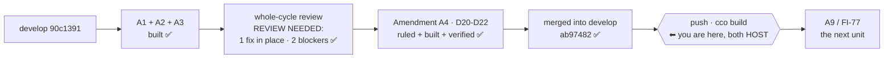

# Handoff — 2026-08-26 (late)

> **Ephemeral.** The previous handoff was deleted before this was written. It links **out** to the
> roadmap, ADRs and designs — nothing links back to it.

## Where we are

**A1's cycle is CLOSED — reviewed, fixed, verified and MERGED.** What is left is not a gate on the
work but two operations `develop` owes: a **push** (host-only) and a **`cco build`**.

The review the maintainer scoped — **one pass over the finished cycle**, six verbs, both stores —
ended the pattern that had grown the unit by one amendment per review three times. It returned
**REVIEW NEEDED**: one defect fixed in place, **two blockers** escalated. All three were ruled the
same day and are built as **[ADR-0038 Amendment A4](configuration/decentralized-config/decisions/0038-project-config-versioning.md)**
(D20…D22), with seven realignments that needed no decision.

Everything below was **measured on this branch**, not carried over:

| Claim | Measured |
|---|---|
| Suite (container) | **`Results: 1778 passed, 7 failed, 1785 total`**, the `Results:` line present **once**. The 7 are the [known host-only set](roadmap.md), verified name for name: 6 `test_as_*` + `test_paths_symlink_safe_tool_root` |
| Test count | **+8 over the branch's 1777** — one per fix, each pinned by a mutation that fails exactly its own test |
| Merge | **`ab97482`** (`--no-ff`, 39 commits), branch deleted with `-d`. ⭐ `git diff feat/config/save-and-history develop` was **empty** — the merged tree IS the tree the suite measured, so nothing was accepted on an unmeasured tree |
| `develop` vs `origin/develop` | **40 ahead** — the push is a **host** step; `git ls-remote` is not reachable from a session |
| bash 3.2 | every changed file parses under real `bash:3.2` (Docker socket), with a negative control returning rc 2 |
| Baked files | 🔴 **TOUCHED — this cycle DOES owe a `cco build`.** See below |
| macOS host suite | `1775 passed, 2 failed, 1777 total`, `Results:` present once ⇒ **no 3.2 parse abort**. The 2 are **[FI-78](improvements.md)**, not A1 |

## 🔴 Two records that were WRONG, and are now corrected

Both were carried forward through several handoffs. Do not restore either.

1. **"No baked file touched ⇒ no `cco build`."** False for the cycle. `Dockerfile:201-225` bakes
   `bin/`, `lib/`, `templates/`, `docs/users`, `changelog.yml` and `defaults/managed/`, and this
   branch changes **all but one**, including the managed rule `cco-config-interaction.md`. It was
   true only of the **A2+A3 delta**. ⚠ It matters: an in-session agent's `cco project save` runs the
   **image-baked** copy, so A4's fixes do not reach a running session until a rebuild. The host CLI is
   unaffected — which is why the changelog's *"no rebuild needed for the commands themselves"* is
   right and this is not a contradiction.
2. **The host suite's expected result was `1770/7`.** That is the **container's** expectation. Those 7
   fail *in the container*; on the host they pass. The host's real result is `1775/2`.

## Amendment A4 — what was ruled

| # | Ruling | What it closes |
|---|---|---|
| **D20** | anchor the project verbs on the **git top-level**, not the unit dir | `.cco/` may sit **below** the repo root. Pathspecs are cwd-relative; every git *output* path is top-level-relative. Measured: a secret under a nested `.cco/` was committed under `✓ saved`, and `status --full` printed nothing at all |
| **D21** | a **deletion is not a leak** | the save that *removes* a secret was refused, and the refusal's own `git reset` undid the `git rm --cached` it prescribed. Both stores |
| **D22** | `cco config save --help` | the only verb of the six without the arm, so its access gate could only be asked negatively |

⭐ **Why three reviews missed D20.** At the top level the prefix is empty and every message is
byte-identical, so **a test written only at the top level cannot see it**. The 54 flat tests passed on
the broken code. The new pair is flat **and** nested (design §6.2e).

## Gates still open

| Gate | What unblocks it |
|---|---|
| ▶ **Push `develop`** | a **host** step. `cd <repo> && git push origin develop` |
| ▶ **`cco build`** | not optional for this cycle (above). Nothing **in-session** reflects A4 until it runs — the host CLI already does |
| **[FI-78](improvements.md)** | the two macOS test-portability failures. **Not A1's** — they are in the already-merged A5+A8 warn-gate cycle. ⚠ Not measurable from the container: bash 3.2 is reachable over the Docker socket, BSD `awk`/`mktemp` are not. Still owed before `0.7.0` |
| **[A9](roadmap.md)** ([FI-77](improvements.md)) | ▶ **the next unit once A1 closes.** Needs a short design first, and a `cco build` |
| **[FI-73](improvements.md)** | the SIGPIPE sentinel — a maintainer's call, unchanged |
| 📝 **the `_secret_scan_staged` pipefail contract** | raised by A2's review as `minor`, **never ruled**, and still not. Under `pipefail` a failing `git diff --cached` (rc 128) makes the function return 128, and the caller prints its refusal with an **empty path**. Fail-closed and unreachable behind `rev-parse --is-inside-work-tree`, but it is a silent contract change to the function **both** save gates share |

⚠ **`feat/claude-view-file-overlays` is rares' branch and stays untouched** — local and remote
identical at `43c2c33`.

## Tasks

The [roadmap](roadmap.md) is the single source of truth for status; this list points at it.

- [ ] ▶ **Push `develop`** and run **`cco build`** — both host steps; the merge and the branch
      cleanup are done
- [ ] ▶ **[A9](roadmap.md)** ([FI-77](improvements.md)) — the next unit. Short design first; three
      questions are open in the roadmap entry. Both targets are **baked**
- [ ] **[FI-78](improvements.md)** — the two macOS test-portability failures, host-verified only
- [ ] **[FI-73](improvements.md)** — decide the SIGPIPE sentinel
- [ ] **[FI-74](improvements.md)** · **[FI-76](improvements.md)** — A1's review residue, none blocking
      (**FI-75 is closed** by A4)
- [ ] **[A2](roadmap.md)** — per-project custom Docker image ([FI-49](improvements.md)). ⭐ Sub-problem 3
      first: the `setup.sh` docs contradict themselves
- [ ] **[A3](roadmap.md)** — cross-scope collision warning ([FI-32](improvements.md)) + three open decisions
- [ ] **[A6](roadmap.md)** — `.claude/worktrees` in the functional-write floor ([FI-56](improvements.md))
- [ ] **[A7](roadmap.md)** — the A4-ask-plane review residue ([FI-62](improvements.md) … [FI-66](improvements.md))
- [ ] **FI-58 leftovers** — ADR-0058's **D3**, **D7** and **D8-as-amended** are unbuilt. ⚠ D8 touches a
      **baked** file
- [ ] **[FI-72](improvements.md)** — nothing detects the *next* unclassified `warn` producer

## 🔑 Non-obvious things the next session would otherwise rediscover

- 🔴 **INSIDE `lib/cmd-project-save.sh`, `root` MEANS THE GIT TOP-LEVEL** and the config dir is
  `$spec`, never a literal `.cco`. A new call site reaching for `basename "$root"` or a bare `.cco`
  reintroduces D20 **silently**, and at the top level every existing test still passes. The shared
  renderers in `config-read.sh` were always right — it was the callers that passed the wrong root.
- ⭐ **A MUTATION THAT PASSES MEANS THE BEHAVIOUR IS UNTESTED.** Every A4 fix was pinned by reverting
  it and checking that *exactly* its own test fails. Two of them failed nothing at first.
- ⭐ **THE DISCRIMINATING ASSERTION IS SOMETIMES THE NEGATIVE ONE.** The broken ignore-rule path
  (`app//home/you/.gitignore_global:1`) *contains* the correct one as a substring, so
  `assert_output_contains` alone passes on the defect.
- ⭐ **`assert_output_not_contains "⚠"` IS NOT AN ORACLE FOR "NO WARN".** `_project_secret_remedy`
  prints an **indented** `⚠` — a house idiom. `warn()` writes the glyph at the **start of a line**.
  Use `_ps_no_warn_emitted`.
- ⚠ **`git checkout -- <file>` ON AN UNCOMMITTED FILE DISCARDS THE WHOLE WORK**, not just the
  mutation you were reverting. Copy the file aside instead.
- ⚠ **In a test, build the ESC for an ANSI strip with `printf '\033'`** — BSD sed does not read `\x1b`.
- ⚠ **A manual smoke of these verbs needs the ambient operator env cleared** — `env -u
  CCO_CONTAINER_OPERATOR -u CCO_ACCESS_TRIPLE -u PROJECT_NAME -u CCO_SESSION_CONTEXT` — and the
  ADR-0007 guard line filtered out. Do **not** set `CCO_ALLOW_HOST_RESOLVE=1` to silence it.
- ⚠ **git in this container needs `safe.directory`**, and `~/.gitconfig` is a read-only bind mount:
  `GIT_CONFIG_COUNT=1 GIT_CONFIG_KEY_0=safe.directory GIT_CONFIG_VALUE_0=/workspace/claude-orchestrator git …`
- ⚠ **THE HOST CAN CHANGE THIS SESSION'S BRANCH UNDER IT** — one working tree, two writers. Run
  `git branch --show-current` before any write.
- ⚠ **A suite log's `[PASS]`/`[FAIL]` lines carry ANSI codes.** The **`Results:` line is the only
  authoritative count, and its absence is itself the failure signal.**
- ⚠ **The container's `/tmp` filled during a full-suite run and the filesystem went read-only**
  (2026-08-26). The precursor was test durations exploding ~30x. If that recurs: `cco stop`, prune,
  `cco start`. The repo is a bind mount, so nothing is lost.

## Reference documents

- [roadmap.md](roadmap.md) — the living SSOT; A1's entry carries all four amendments and their measures
- [improvements.md](improvements.md) — the `FI-*` tracker
- [ADR-0038](configuration/decentralized-config/decisions/0038-project-config-versioning.md) — the contract, D1…D22
- [design-project-config-versioning.md](configuration/decentralized-config/design/design-project-config-versioning.md)
  — the mechanism (§2.1 carries D20) and the test plans (§6.2e carries A4)
- [the whole-cycle review](configuration/decentralized-config/reviews/26-08-2026-save-status-history-cycle-review.md)
  — the evidence the three rulings were measured against
