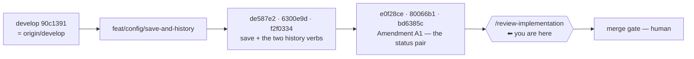

# Handoff — 2026-08-21

> **Ephemeral.** At most one of these exists per line of work; the previous was deleted before this
> was written. It links **out** to the roadmap, ADRs and designs — nothing links back to it.

## Methodology / where we are

**Phase: Implementation COMPLETE for [A1](roadmap.md). The next step is `/review-implementation`
over the whole branch, then the merge gate. Nothing is owed inside the unit.**

`feat/config/save-and-history` carries the finished unit, **unmerged**, on top of a `develop` that is
level with its remote. (Deliberately no commit count: the commit that states one invalidates it —
`git rev-list --count develop..HEAD` is the answer.) The unit grew from three verbs to **five** mid-flight: the maintainer raised, against the
finished three, that the write half had no preview — recorded as **ADR-0038 Amendment A1** (D9…D12)
and built in the same branch, deliberately, so one review covers everything.



Everything below was **measured on this branch**, not carried over:

| Claim | Measured |
|---|---|
| Suite | **`Results: 1749 passed, 7 failed, 1756 total`** — the 7 are the [known host-only set](roadmap.md), verified name for name (6 `test_as_*` + `test_paths_symlink_safe_tool_root`) |
| Baseline it grew from | 1710/7 of 1717 → **+39 tests, all green** |
| `cco build` | **done** — `/etc/claude-code/.claude/rules/cco-config-interaction.md` in THIS session names the real verb; no *"forthcoming"* |
| `develop` vs `origin/develop` | **0** — the push happened host-side; that gate is closed |
| `origin/feat/cli/start-warning-gate` | **gone** — deleted host-side; that gate is closed too |

## The five verbs, and the shape of the matrix

| | personal `~/.cco` | project `<repo>/.cco` |
|---|---|---|
| **write** | `cco config save` *(was already shipped)* | **`cco project save`** |
| **read — not saved yet** | **`cco config status`** | **`cco project status`** |
| **read — was saved** | **`cco config history`** | **`cco project history`** |

## Gates still open

| Gate | What unblocks it |
|---|---|
| **`/review-implementation`** | the next session's work — this is the intended entry point |
| **Merge into `develop`** | the human review point, after the review. ⚠ The diff touches `.cco/`? **No** — it does not, so [FI-20](improvements.md)'s host-only merge rule does not apply here. Measure before assuming |
| **macOS host suite (bash 3.2)** | still owed before `0.7.0`. Nothing has run the full suite on 3.2 since `v0.6.0` |
| **[FI-73](improvements.md)** | new, and NOT a defect of this unit — a maintainer's call, see below |

⚠ **`feat/claude-view-file-overlays` is rares' branch and is deliberately untouched** — verified
identical local and remote at `43c2c33`. Not merged, not deleted, not part of any cleanup.

## How to resume

Run `/review-implementation` against `develop..HEAD`. The contract to review against is
[ADR-0038](configuration/decentralized-config/decisions/0038-project-config-versioning.md) **D1…D8
plus Amendment A1 (D9…D12)** and
[its design](configuration/decentralized-config/design/design-project-config-versioning.md) — §5b is
the status half, §6 the test plan (T1…T22 + S1…S9). Do not re-derive the decisions; all twelve are
ruled.

**Measure before repeating any position stated here**, including these:

```
bash bin/test 2>&1 | tail -5          # the Results: line is the ONLY authoritative count
git rev-list --count develop..HEAD
git branch -vv
```

## Tasks

The [roadmap](roadmap.md) is the single source of truth for status; this list points at it.

- [ ] **`/review-implementation`** over `develop..HEAD` — [A1](roadmap.md), five verbs
- [ ] **Merge to `develop`** after the review (human gate), then delete the branch per
      `rules/git-practices.md`
- [ ] **[FI-73](improvements.md)** — decide the SIGPIPE sentinel fix (one line, on a statically
      enforced invariant). Not this unit's defect; recorded with the measurement that proves it
- [ ] **macOS host suite (bash 3.2)** — owed before the `0.7.0` release
- [ ] **[A2](roadmap.md)** — per-project custom Docker image ([FI-49](improvements.md); short design).
      ⭐ Sub-problem 3 first: the `setup.sh` docs contradict themselves and the answer is a
      **measurement** that changes what the guide should recommend for the other two
- [ ] **[A3](roadmap.md)** — cross-scope collision warning ([FI-32](improvements.md)) + three open decisions
- [ ] **[A6](roadmap.md)** — `.claude/worktrees` in the functional-write floor ([FI-56](improvements.md))
- [ ] **[A7](roadmap.md)** — the A4 review residue ([FI-62](improvements.md) … [FI-66](improvements.md))
- [ ] **FI-58 leftovers** — ADR-0058's **D3**, **D7** and **D8-as-amended** are unbuilt. ⚠ D8 touches a
      **baked** file (`config/hooks/subagent-context.sh`), so whichever unit takes it also takes a
      `cco build` in its acceptance lane
- [ ] **[FI-72](improvements.md)** — nothing detects the *next* unclassified `warn` producer

## Context

### Decided, and not to be reopened

**[ADR-0038](configuration/decentralized-config/decisions/0038-project-config-versioning.md)** D1…D8
+ **Amendment A1** D9…D12, all ruled by the maintainer. Read the ADR, not this line. The four a
reviewer is most likely to challenge, each with the reason it is not a slip:

- **D7 — cco does not author `.cco/.gitignore`.** A missing or insufficient one refuses and names the
  fix. It is a versioned file in the user's own repo; writing it would put an unrequested change
  inside the very commit they asked for. "Make it consistent with the twin" is the wrong instinct —
  the twin owns its tree.
- **D8 — the `edit-project+` gate on `save` is POLICY, not mechanism.** See the measurement below.
- **A1 D10 — `status` reports the D7 barrier and never enforces it**, at rc 0. A preview that dies is
  one nobody can use to find out why their save would die.
- **A1 D11 — each `status` mirrors ITS OWN save's rule**, never a bare `git status`.

### Open questions needing a human

- 📝 **[FI-73](improvements.md)** — the SIGPIPE sentinel. The fix is one line
  (`trap '_cco_completed=true' PIPE`) but it edits behaviour guarded by
  `test_invariant_exit_sentinel_discipline`, so it is a decision, not a cleanup. ⚠ Whoever takes it
  must verify the sentinel STILL fires on a real `set -u` violation — silencing it wholesale trades
  the bug for the crash-reporting it exists to provide.
- 📝 **An unrecognised answer at the `cco start` pause starts the session** (only `a`/`A` aborts).
  D10 of ADR-0059 decided bare Enter and `[S/a]`; it did not decide what a stray `n` does. Not blocking.
- 📝 **[Open decision #7](roadmap.md)** — should `cco clean` sweep `$TMPDIR/cco-warn.*`?
- The five older ones are in the roadmap's [Open decisions](roadmap.md).

### 🔑 Non-obvious things the next session would otherwise rediscover

- 🔴 **COMMITTING A READ-ONLY `.cco/` SUCCEEDS.** `git add -- .cco/` returns **0** on a `.cco` bound
  `ro`: git reads the **worktree** and writes to **`.git/`**, which is `rw` — the `.cco` bind is a
  read-only *child* mount inside a read-write repo. The twin's ro-mount guard exists only because
  `~/.cco` contains its own `.git`. **So D8's gate is policy**, `project save` ships **no** ro-mount
  guard, and `test_operator_project_save_needs_edit_project` is the ONLY thing guarding it — nothing
  in the filesystem would catch its removal. A reviewer reasoning from the mount table concludes the
  opposite.
- ⭐ **THE PATHSPEC IS ON THE COMMIT, NOT ONLY THE STAGING.** `git add -- .cco` is not enough: a file
  the user had **already staged** is in the index and a bare `git commit` sweeps it into the config
  commit. `git commit -m … -- .cco` builds the commit from `.cco/` alone. Measured, unborn HEAD
  included. Same reason the refusal's reset is `git reset -q -- .cco` and never the twin's bare
  `git reset`, which would discard the user's own staging.
- 🔑 **THE `.gitignore` FLOOR IS THE SCAFFOLD'S CLASSES, NOT `_SECRET_FILENAME_PATTERNS`.** The design
  says the latter; **taken literally the verb is dead on arrival** — the full list carries `.netrc`
  and `.cco/remotes`, which `_cco_write_project_gitignore` has never written, so every project cco
  scaffolded would be refused. Floor = `_SECRET_PROJECT_GITIGNORE_CLASSES`; **INV-GIF** fails on the
  drift. The 2-pass scan still runs against the full list, so nothing is unguarded.
- ⚠ **`config status`'s allowlist pathspec looks redundant and is not.** After the first
  `config save`, the whitelist `.gitignore` filters a stray file by itself — so a test on a saved
  store cannot see the pathspec at all (measured: the mutation passed). Before the first save that
  barrier does not exist. `test_config_status_on_a_never_saved_store` is the one that discriminates.
- ⚠ **`git add -- .cco` exits 1 when everything under `.cco/` is ignored**, with an advice block. Not
  an error — it is the "nothing to save" case; the call is `|| true` and emptiness is decided by
  `git diff --cached --quiet -- .cco`.
- ⚠ **J0 git-inits `~/.cco` on EVERY host command** (`_cco_first_run`, `lib/migrate.sh`), so
  `_config_status`'s `[[ ! -d "$cfg/.git" ]]` branch is unreachable from the host suite. It is kept
  for the container (the store is a mount and may arrive without `.git`) and the code says so.
- ⚠ **Deleting `.cco/project.yml` makes the repo unresolvable** — it is the cwd-first anchor
  (`_resolve_find_unit_dir`). A test that deletes it to exercise a `D` entry is testing a different
  verb's contract; use another file.
- ⚠ **The docker proxy in a session caps containers at 10 and does NOT return container stdout.** A
  bash-3.2 probe can therefore assert an **exit code** but never read output — so write the probe as
  an assertion (`[ "$n" -eq 3 ]`), which discriminates by construction. `read -r -d ''` with NUL
  separators is **verified working on real bash 3.2** this way.
- ⚠ **A suite log's `[PASS]`/`[FAIL]` lines carry ANSI colour codes.** Grepping `'^\[FAIL\]'` raw
  under-reports (it found 6 of 7 here). Strip ANSI first; the **`Results:` line is the only
  authoritative count**, and its *absence* is itself a signal.
- ⚠ **`git add a b c` with ONE bad pathspec stages NOTHING** — and if something was already staged,
  the following `git commit` still succeeds, producing a commit that is not what you wrote the
  message for. It happened here: a rename-only commit left `bin/cco` sourcing a file that no longer
  existed. **Read `git diff --cached --name-status` before committing**, not after.
- ⚠ **THE HOST CAN CHANGE THIS SESSION'S BRANCH UNDER IT** — host and container share one working
  tree. Run `git branch --show-current` before any write, not only at session start.
- ⚠ **git in this container needs `safe.directory`** and `~/.gitconfig` is a read-only bind mount, so
  it cannot be set globally. Use
  `GIT_CONFIG_COUNT=1 GIT_CONFIG_KEY_0=safe.directory GIT_CONFIG_VALUE_0=/workspace/claude-orchestrator git …`.
- 📝 **The FI-25 mask (`access: {claude: all}` in `.cco/project.yml`) is ON**, deliberately. Pin
  `--claude-access` explicitly for any A4-style measurement.

## Reference documents

- [roadmap.md](roadmap.md) — the living SSOT; A1's entry carries the scope and the measurements
- [improvements.md](improvements.md) — the `FI-*` tracker; **FI-73 is new**
- [ADR-0038](configuration/decentralized-config/decisions/0038-project-config-versioning.md) — D1…D8
  **+ Amendment A1 (D9…D12)** — the contract the review measures against
- [design-project-config-versioning.md](configuration/decentralized-config/design/design-project-config-versioning.md)
  — mechanism, **§5b the status half**, §6 the test plan, §6.4 what the suite cannot reach
- [ADR-0008](configuration/decentralized-config/decisions/0008-personal-store-management.md) — the twin
  `cco config save`; its *non-blocking* principle bounds what A1 may become
- [ADR-0059](cli/decisions/0059-message-classification-and-the-start-warning-gate.md) — the message
  taxonomy every new message is classified by
