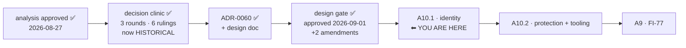

# Handoff — 2026-09-01 (A10 designed and approved; A10.1 is the next build)

> **Ephemeral.** The previous handoff was deleted before this was written. It links **out** to the
> roadmap, ADRs, design and analysis — nothing links back to it.
>
> Written for a session that remembers **nothing** of the one that produced it. Everything below is
> either measured and cited, or named as unmeasured.

## Where we are

**Phase: Design → CLOSED AND APPROVED. Next is Implementation of A10.1.** The approval gate
(`rules/workflow.md` (b)) was passed on 2026-09-01 with **two amendments**, both already applied to
the artifacts — see *Context*. No decision is left open for the maintainer before implementation
starts.

Order inside Block A: **A1 → A11 → A10.1 → A10.2 → A9**, then A2 · A3 · A6 · A7, with **A12**
(`cco doctor`, split out of A10 at its design gate) schedulable independently.
⚠ **The numbers are identifiers, not the order.**

### State, measured

| Claim | Measured |
|---|---|
| Branch | `feat/devmode/dev-execution-mode`, tree clean, **not merged, not pushed**. ⚠ **No commit count is stated here on purpose** — the commit that states one invalidates it. Measure: `git rev-list --count develop..HEAD` |
| Merged branches | `git branch --merged develop` → only `develop`, `main`. No worktree to clean (`git worktree list` = one entry) |
| ⭐ The merge is **not** host-only | `git diff --name-only develop..HEAD` touches **no `.cco/`** — the rule that makes a merge host-only keys on the *diff*, not the branch. It stays a **human gate** by decision, not by mechanics |
| Push from here | **No.** `origin` is SSH, `credential.helper` unset, `gh auth status` → not logged in. Push is a **host step** |
| Suite | Unchanged since A11: **1787 passed / 7 failed / 1794**, the 7 the documented host-only set **name for name**. ⚠ Verify the `Results:` line exists — an aborted run reads green *and prints no summary*. This session wrote **only documents**; no code changed |
| git in this container | needs `safe.directory`: `GIT_CONFIG_COUNT=1 GIT_CONFIG_KEY_0=safe.directory GIT_CONFIG_VALUE_0=/workspace/claude-orchestrator git …` |

⚠ **`feat/claude-view-file-overlays` is rares' branch and stays untouched.**

## Gates still open

| Gate | What unblocks it |
|---|---|
| **Merge this branch** | the human gate. Everything on it is complete; nothing is half-done |
| **Push** | never pushed, and **not possible from a session** (measured above). Host step |
| **[FI-83](improvements.md)** direction | trigger measured; the cheap candidate touches no security surface. Needs one more observation and a call — see *Context* |
| **[FI-84](improvements.md)** | free to relieve locally (move `user-config/`); the design half must be decided **with [FI-16](improvements.md)** |
| **[FI-78](improvements.md)** | the 2 macOS test-portability failures. ⚠ **Host-only measurable**. **Owed before `0.7.0`** |
| **[FI-81](improvements.md)** | now **two** measured instances (`/analyze` **and** `/design`). Fixing it needs approval — skills/agents are user-owned config **and** `defaults/global/` is shipped content. ⚠ The fix must be a **sweep with a stated enumeration command**, not the two known cases |
| **[FI-82](improvements.md)** | the `docker run` stdout swallow is **measured, not diagnosed** |
| **[FI-73](improvements.md)** | the SIGPIPE sentinel — a maintainer's call, unchanged |
| 📝 **the `_secret_scan_staged` pipefail contract** | raised by A2's review as `minor`, **still never ruled** |
| **A1's roadmap entry → [roadmap-history.md](roadmap-history.md)** | ~450 lines of a closed unit. ⚠ Its branch was deleted 2026-08-26, so the automatic trigger (*the branch appears among the merged*) **can never fire again**. A maintainer's call now |
| **[FI-74](improvements.md)** · **[FI-76](improvements.md)** | A1's review residue, none blocking |
| **[A2](roadmap.md)** · **[A3](roadmap.md)** · **[A6](roadmap.md)** · **[A7](roadmap.md)** · **[A12](roadmap.md)** | the rest of Block A. ⭐ A2: start from sub-problem 3 |
| **FI-58 leftovers** | ADR-0058's **D3**, **D7** and **D8-as-amended** are unbuilt. ⚠ D8 touches a **baked** file |
| **[FI-72](improvements.md)** | nothing detects the *next* unclassified `warn` producer |

## How to resume

**First command**: `git branch --show-current` — host and container share one working tree, so the
host can move this session's branch under it.

Then read, in this order, and do **not** re-derive any of it:

1. **[ADR-0060](engineering/decisions/0060-developer-execution-mode.md)** — the six rulings, what
   each rejected, and the consequences. This is the contract.
2. **[`engineering/design/dev-execution-mode.md`](engineering/design/dev-execution-mode.md)** — the
   *how*: seams, algorithms, application points, staging, and §11's acceptance lane.
3. §*The traps that bind this build* below.

⚠ **Do NOT read the decision clinic to find out what to build.**
[`engineering/analysis/dev-execution-mode-decisions.md`](engineering/analysis/dev-execution-mode-decisions.md)
is **historical**: it records the option space and three rounds in which the recommendation on `D1`
**changed twice**. Rounds 1 and 2 are superseded and marked as such. Read it only to see *why* an
alternative was rejected.

Then implement **A10.1** to the design's §10. It is the identity half — after it, a dev run cannot
overwrite the image a real session uses, and that is verifiable with no new verb.

⚠ **`/design` and `/analyze` both fork to a read-only agent and cannot write their own artifacts**
([FI-81](improvements.md), two measured instances). `/implement` was **not** checked this session —
**check its frontmatter before relying on it**: if it forks to an agent without `Write`/`Edit`, the
lead does the work, exactly as this session did.

## Tasks

The [roadmap](roadmap.md) is the single source of truth for status; this list points at it.

- [ ] ▶ **Implement [A10.1](roadmap.md)** — design §3 (`--dev`, dispatcher, resolution order, the
      `--` terminator fix, the legacy aliases), §4 (`_cco_dev_image` and its two application points,
      `check_image` dies), §6.1 (in-container refusal). Tests from the **design**, by an independent
      role (`rules/testing.md`)
- [ ] **Acceptance for A10.1** — a host `cco build` in dev mode, then `docker image inspect` on
      **both** tags. ⚠ Never `docker run` (FI-82); never `cco --version` (non-discriminating)
- [ ] **Update the living docs A10.1 changes** — `docs/users/reference/cli.md` §3.34 (the flag
      becomes an alias), `CONTRIBUTING.md` §*Local development* (the two substitutive setups are
      replaced by `cco --dev`), `changelog.yml`
- [ ] **[A10.2](roadmap.md)** — snapshot store, the **`<repo>/.cco` restorability guard** (ADR-0060
      D4.8), `cco dev restore|list|reset|seed`, migration routing, fixtures, `project.dev.yml`,
      `clean` scoping + `--images`
- [ ] **Merge** this branch, then **push** from the host (both open; push impossible from a session)
- [ ] **Decide [FI-83](improvements.md)'s direction** — capture the one missing observation first
- [ ] **Move `user-config/` out of the checkout** — [FI-84](improvements.md), free, host-side
- [ ] **[FI-78](improvements.md)** — the two macOS failures, host-verified only, owed before `0.7.0`
- [ ] **[FI-81](improvements.md)** — propose the sweep (both instances + the enumeration command)
- [ ] **[FI-82](improvements.md)** — diagnose *why* `docker run` stdout is swallowed
- [ ] **Decide**: move A1's ~450-line closed entry into [roadmap-history.md](roadmap-history.md)
- [ ] **Rule the `_secret_scan_staged` pipefail contract** — open since A2's review
- [ ] **[FI-73](improvements.md)** · **[FI-74](improvements.md)** · **[FI-76](improvements.md)**
- [ ] **[A2](roadmap.md)** · **[A3](roadmap.md)** · **[A6](roadmap.md)** · **[A7](roadmap.md)** ·
      **[A12](roadmap.md)**, then **FI-58 leftovers** (D3, D7, D8-as-amended) and
      **[FI-72](improvements.md)**

## Context

### What this session produced

Nothing but documents. The A10 design, via a **three-round decision clinic** — the artifact the
previous handoff commissioned — then [ADR-0060](engineering/decisions/0060-developer-execution-mode.md)
and [the design](engineering/design/dev-execution-mode.md). The rulings are in the ADR and are **not
restated here**.

⭐ **The one thing worth carrying in a sentence**, because it reversed two earlier recommendations:
*configuration is the test's **input**, not its target.* Rounds 1 and 2 both weighed **how cheap is
it to isolate `~/.cco`** (measured: 3 code sites) without asking **whether isolating it serves the
mode's purpose**. It does not — a dev run against a different configuration is not testing the user's
setup. So `~/.cco` **and** `<repo>/.cco` stay shared, and what dev mode protects is the survival of a
**bad write**. This upholds ADR-0052 §7's WS-6 call **for a stronger reason than WS-6 gave**, and it
is why `tests/test_dev_sandbox.sh:75-86` stays green **as written**.

### The three amendments at the approval gate (2026-09-01)

All are already in the ADR and the design; they are recorded here only so nobody re-opens them.

1. 🔴 **A failed snapshot is FATAL, not a warning.** The step is **unconditional** — every `--dev`
   engage, before the verb — and if the restore point cannot be taken the run **dies**: the mode's
   safety property was never established. Deliberately unlike `_cco_dev_sandbox_seed`'s `warn` — a
   partial seed is a convenience, a missing restore point **is** the protection. An absent `~/.cco`
   is a **no-op**, not a failure.
2. **The `<dev-root>` is not a new XDG bucket, and never was.** Dev mode adds no bucket: it
   **re-points three of the existing four** at children of `~/.cco-devsandbox`. The snapshot store
   and the fixtures are **siblings** of those three — design §5.0. ⚠ **Measured reason, not tidiness**:
   `_cco_dev_sandbox_seed` (`lib/paths.sh:606-628`) does `cp -a "$real_state" "$root/state"` behind a
   one-shot `[[ -d "$root/state" ]] && return 0` guard, so anything placed under `state/` is either
   overwritten by a re-seed or blocks the seed entirely. The default **path does not move** —
   renaming it would strand every existing sandbox, the orphan class this unit exists not to create.
3. 🔴 **`<repo>/.cco` is GUARDED, not snapshotted** — ADR-0060 **D4.8**, added when the maintainer
   asked what protects project config. **The answer as the design stood was: nothing.** The snapshot's
   work-tree is `~/.cco` alone; two sentences claiming project writes were *"doubly recoverable"* /
   *"recoverable without any mechanism"* were **overstated** and are corrected in place (the clinic
   carries a dated correction). Project config is protected by **the user's own repo git**, which is
   complete only for a committed, clean tree in a git repo — and **a non-git repo is a supported
   case** (`lib/cmd-project-save.sh:452`). ⇒ Under `--dev` a writer that can **destroy uncommitted
   content** refuses when the tree is not restorable. ⭐ **The criterion is the ruling, not the list**:
   a writer whose only effect is a *commit* is exempt — which is why **`cco project save` must be**,
   since it only acts on a dirty `.cco` and a dirty-check would make it permanently untestable.

### Measurements a session must not argue away

- 🔴 **The version gate is DORMANT, not bypassed.** npm `latest` and the clone are both `0.6.0`, both
  `CCO_INDEX_VERSION=2`, both max migration `017`, across 148 commits ⇒ **`cco --version` is a
  NON-DISCRIMINATING oracle** and any acceptance test built on it is a false pass by construction.
  The oracles that do discriminate: `cco whoami` (`REPO_ROOT` + provenance, shipped by A11) and
  `docker image inspect … cco.build-ref`.
- 🔴 **The image tag IS the code identity of the in-session cco** — `Dockerfile:201-211` bakes
  `bin/`+`lib/` into `/opt/cco` and a normal session mounts **no host `lib/`**.
- 🔴 **The clone has no name on PATH.** Coexistence is a state **to create**; a design that "detects
  the other install and warns" has, today, nothing to detect.
- 🟢 **Nothing does `rm -rf` of the whole `~/.cco`** anywhere in `lib/` — `cco init --force` removes
  `~/.cco/.claude`. This is what makes a snapshot store beside it survive every measured destructive
  writer, and it is the measurement the whole protection design rests on.
- 🔴 **`cco config` has no `restore`** (`save · status · history · push · pull · validate`) — the
  restore verb is new work, not a wiring job.
- 🔴 **`cco config save` promises *"cco never auto-commits"***, and `_config_push` operates on
  `$cfg/.git` — which is why the snapshot store is a **separate `GIT_DIR`** and is structurally
  unpushable.
- 🔴 **`_CONFIG_ALLOWLIST` omits `access.yml` and `claude-version`** ⇒ the snapshot uses `git add -A`,
  never the allowlist.
- ⚠ `grep -n '"--")' lib/*.sh bin/cco` → **zero** hits: no verb handles a `--` terminator. Today's
  flag strip is harmless **by luck**; `--dev` carries the fix.
- ⚠ **The project-writer list is a lower bound, demonstrated within one session**: the clinic's round 3
  named four, a re-grep found a fifth (`cco project add`, `lib/cmd-project-add.sh:206,261`) and a
  probable sixth (`cco repo rename`). Design §5.2 records the **enumeration command** — re-run it and
  classify every hit, do not inherit the table.
- ⚠ `<repo>/.cco` is composed **inline ~64 times across 16 files** (20 in `cmd-start.sh`), the
  resolver `_resolve_project_cco_dir` has **2 callers**, and it **rides the repo mount** — which is
  why relocating it was priced and rejected.

### Two findings still open, and where each stands

- **[FI-83](improvements.md) — an interactive trust prompt stalls a delegated run.** 🔴 Trigger
  **measured**: a teammate is a separate `claude` process whose `cwd` is the repo while the lead's is
  `/workspace`, and workspace trust is **directory-scoped**. `--dangerously-skip-permissions` does
  **not** cover it (measured). Cheapest candidate: start teammate panes in the lead's cwd — **no
  security surface**. ⚠ Still not observed: **which directory the dialog named**.
- **[FI-84](improvements.md) — the fresh-HOME legacy-vault toll.** `_cco_first_run` archives the
  legacy vault for every verb except `help`; with the git-versioned 454MB `user-config/`, every test
  with a fresh `$HOME` pays ~13s. **Idempotent per STATE root ⇒ not a shipped defect.**

### The traps that bind this build

- 🔴 **In a session, `docker run` returns rc 0 with EMPTY stdout; only the exit code crosses.**
  `docker image inspect` **does** work — that is the channel, and the reason A11 carries a label.
- 🔴 **`docker run <image> <cmd>` does NOT replace an ENTRYPOINT** (`Dockerfile:233`). The wrong form
  installs Claude Code and prints plausible output. Use `--entrypoint`.
- 🔴 **A missing `Results:` line is the signal.** An aborted suite reads green and prints no summary.
- 🔴 **A mutation that PASSES = untested behaviour**, and **an unreachable guard is an unmeasured
  guard**. Prove each new guard fails when neutralised before believing its pass.
- 🔴 **A named list is a lower bound.** It is why the snapshot trigger is unconditional rather than a
  list of config-writing verbs, and why FI-81's fix must be a sweep.
- ⚠ **Ordering that is a false pass in waiting**: the snapshot store's `info/exclude` must be written
  **before** the first `git add -A`. A test asserting the exclusions exist would pass on a store whose
  *first commit* already contained `secrets.env`.
- 🔴 **Never write `git -C <unit-dir> … -- .cco`.** Every git **output** path (`status --porcelain`,
  `ls-files`, `diff --cached --name-only`, `check-ignore -v`'s source) is reported relative to the
  **top level**, never to cwd — joining those onto the unit dir failed silently and **a secret under a
  nested `.cco/` was committed under `✓ saved`**. Use `_project_resolve_unit`
  (`lib/cmd-project-save.sh:86-97`) and anchor on `$_PROJECT_GITROOT` + `$_PROJECT_SPEC`. The D4.8
  guard sits squarely in this trap's blast radius.
- ⚠ **Concurrent agents share one index.** Commit with the **pathspec form**
  (`git commit <paths> -m …`), never `git add` + bare `git commit`. A **new** file needs
  `git add <path>` first, then the pathspec commit.
- ⚠ **The host can change this session's branch under it** — one working tree, two writers.

### Still unmeasured — say so, do not assume

- The **`unknown` half** of the `/opt/cco/BUILD` + `cco.build-ref` oracle is **asserted, not
  measured**: only `branch@sha` has ever been executed; no npm-provenance build has been made.
- **Which directory FI-83's trust dialog named.**
- **Why `docker run` stdout is swallowed** — measured, never diagnosed.
- **Whether `/implement` forks to a write-capable agent** — not checked this session.
- The **bash 3.2 lint** was not verified in the session that first recorded it (proxy container limit).

## Reference documents

- [roadmap.md](roadmap.md) — the SSOT; **A10** (designed, split into **A10.1** / **A10.2**),
  **A11** (closed but unmerged), **A12** (new: `cco doctor`)
- [engineering/decisions/0060-developer-execution-mode.md](engineering/decisions/0060-developer-execution-mode.md) — **the contract**
- [engineering/design/dev-execution-mode.md](engineering/design/dev-execution-mode.md) — the *how*
- [engineering/analysis/dev-execution-mode.md](engineering/analysis/dev-execution-mode.md) — the
  approved analysis (§12.1 the host probes)
- [engineering/analysis/dev-execution-mode-decisions.md](engineering/analysis/dev-execution-mode-decisions.md)
  — the decision clinic, **historical**: the option space, and what was rejected
- [engineering/design/packaging-distribution.md](engineering/design/packaging-distribution.md) §4 —
  now carries the tag-namespace orthogonality sentence B1/B2 inherit
- [improvements.md](improvements.md) — FI-79 · FI-80 · **FI-81** (two instances now) · FI-82 ·
  FI-83 · FI-84 · FI-16
- [roadmap-history.md](roadmap-history.md) — where A1's closed entry goes, if the maintainer says so
