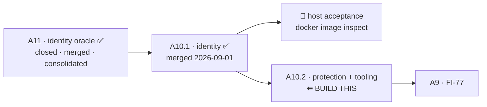

# Handoff — 2026-09-01 · A10.1 built, tested and **merged**. Next session builds **A10.2**.

> **Ephemeral.** The previous handoff was deleted before this was written. It links **out** to the
> roadmap, ADRs, design and analysis — nothing links back to it.
>
> Written for a session that remembers **nothing** of the one that produced it. Everything below is
> either measured and cited, or named as unmeasured.

## Where we are

**Phase: Implementation + Test of [A10.1](roadmap.md) — COMPLETE, MERGED AND CONSOLIDATED.
Next is [A10.2](roadmap.md).** The maintainer approved the merge, the `CLAUDE.md` correction and
ADR-0060's Amendment A5 in-session. No decision is left open before A10.2's implementation starts —
its design is already done and approved (ADR-0060 D4, D5, D6; design §5, §6.2, §7, §8).

Order inside Block A: **A1 → A11 → A10.1 → A10.2 → A9**, then A2 · A3 · A6 · A7, with **A12**
(`cco doctor`) schedulable independently. ⚠ **The numbers are identifiers, not the order.**

### State, measured

| Claim | Measured |
|---|---|
| Branch | the working tree is left on **`develop`**, and **everything from this cycle is merged into it** — A10.1 itself, and the closure commits (this handoff + the roadmap consolidation). No feature branch is left open. ⚠ Host and container share one working tree, so measure the branch again before writing |
| A10.1 merged | ✅ `--no-ff` into `develop`, and the merged tree verified **identical** to the branch: `git diff feat/devmode/a10-1-identity develop` is **empty**. That is why the suite figure measured on the branch carries without a re-run |
| Suite | **1812 passed / 7 failed / 1819 total**, `Results:` line **present**, and the 7 are the documented host-only set **name for name** (6 `test_as_*` + `test_paths_symlink_safe_tool_root`). Run it with `bin/test` (dry-run, no Docker) |
| New tests | `tests/test_dev_mode.sh` **25/25** (22 contract + 3 for Amendment A5). `tests/test_dev_sandbox.sh` **9/9, unmodified**, the pinned `test_dev_sandbox_config_stays_shared` included — design §9's check that CONFIG did not fork |
| Push | 🔴 **STILL OWED.** `develop` is ahead of `origin/develop`. ⚠ **No count is stated here on purpose — the commit that states one invalidates it.** Measure: `git rev-list --count origin/develop..develop`. **Not possible from a session** — measured three ways: `origin` is SSH, `credential.helper` unset, `gh auth status` → not logged in. **Host step**: `git push origin develop` |
| Branches | ✅ **all four merged branches were consolidated and then deleted** (`git branch -d`, never `-D`): `feat/devmode/dev-execution-mode`, `feat/devmode/clone-without-dev-note`, `feat/devmode/a10-1-identity`, `feat/devmode/a10-1-identity-impl`. The worktree `/workspace/a101-impl` was removed |
| ⚠ `feat/claude-view-file-overlays` | **rares' branch — untouched, and it stays that way** |
| git in this container | `git worktree` **always** needs `GIT_CONFIG_COUNT=1 GIT_CONFIG_KEY_0=safe.directory GIT_CONFIG_VALUE_0='*'`; `~/.gitconfig` is a **read-only host mount**, so `git config --global` is not a route. Other git verbs fail only intermittently |

## Gates still open

| Gate | What unblocks it |
|---|---|
| 🔴 **Push `develop`** | **not possible from a session** (measured above). **Host step**: `git push origin develop` |
| 🔴 **A10.1's acceptance check** | **host-only by construction** — `--dev` refuses in-container, which is itself verified. On the host: a real `cco build` under `--dev`, then `docker image inspect` on **both** tags, proving `claude-orchestrator-dev:latest` was produced and `claude-orchestrator:latest` untouched. ⚠ Never `docker run` ([FI-82](improvements.md): rc 0, empty stdout in-session) and never `cco --version` (non-discriminating across both binaries, ADR-0060 M3) |
| **[A10.2](roadmap.md)** | designed and unblocked — the next unit |
| **[FI-83](improvements.md)** direction | trigger measured; the cheap candidate (start teammate panes in the lead's cwd) touches no security surface. ⚠ Still unobserved: **which directory the dialog named** |
| **[FI-84](improvements.md)** | free to relieve locally (move `user-config/`); the design half must be decided **with [FI-16](improvements.md)** |
| **[FI-78](improvements.md)** | the 2 macOS test-portability failures. ⚠ **Host-only measurable**. **Owed before `0.7.0`** |
| **[FI-81](improvements.md)** | ✅ **narrowed this session**: `/implement` is **NOT** affected — it runs in the lead context and delegates to `implementer`/`tester`/`documenter`, all three carrying `Write`+`Edit`. The two measured instances (`/analyze`, `/design`) stand. ⚠ The fix must still be a **sweep with a stated enumeration command**, not the two known cases, and it needs approval — skills/agents are user-owned config **and** `defaults/global/` is shipped content |
| **[FI-82](improvements.md)** | the `docker run` stdout swallow is **measured, not diagnosed** |
| **[FI-73](improvements.md)** | the SIGPIPE sentinel — a maintainer's call, unchanged |
| 📝 **the `_secret_scan_staged` pipefail contract** | raised by A2's review as `minor`, **still never ruled** |
| **A1's roadmap entry → [roadmap-history.md](roadmap-history.md)** | ~450 lines of a closed unit, and it still says *"unmerged"* fifteen lines below where the same roadmap calls A1 closed. ⚠ Its branch was deleted 2026-08-26, so the automatic trigger (*the branch appears among the merged*) **can never fire again**. A maintainer's call now |
| **A11's two remaining residues** | `whoami`'s host branch does not read the image label, and the `IMAGE_NAME` tag is not surfaced. The third — the `cco start` CLI↔image divergence warning — **is scheduled inside A10.2** (ADR-0060 D7) |
| **[FI-74](improvements.md)** · **[FI-76](improvements.md)** | A1's review residue, none blocking |
| **[A2](roadmap.md)** · **[A3](roadmap.md)** · **[A6](roadmap.md)** · **[A7](roadmap.md)** · **[A12](roadmap.md)** | the rest of Block A. ⭐ A2: start from sub-problem 3 |
| **FI-58 leftovers** | ADR-0058's **D3**, **D7** and **D8-as-amended** are unbuilt. ⚠ D8 touches a **baked** file |
| **[FI-72](improvements.md)** | nothing detects the *next* unclassified `warn` producer |

## How to resume

**First command**: `git branch --show-current` — host and container share one working tree, so the
host can move this session's branch under it between turns.

**Then read, in this order** (and re-derive none of it):

1. **[ADR-0060](engineering/decisions/0060-developer-execution-mode.md)** — the six rulings and the
   **five** amendments. **This is the contract.** A10.2 is governed by **D4** (the snapshot and the
   `<repo>/.cco` guard), **D5** (migration routing) and **D6** (the verb surface).
2. **[`engineering/design/dev-execution-mode.md`](engineering/design/dev-execution-mode.md)** — the
   *how*. For A10.2 you need **§5** (snapshot store, restore, the project guard), **§6.2** (the
   `cco start` build-ref warn), **§7** (fixtures, `project.dev.yml`), **§8** (the `cco dev` verb) and
   **§10**'s definition of done. ⚠ Its status block says which sections are shipped and which are not.
3. §*Traps that bind A10.2* below.

⚠ **Do NOT read the decision clinic to find out what to build.**
[`engineering/analysis/dev-execution-mode-decisions.md`](engineering/analysis/dev-execution-mode-decisions.md)
is **historical**: three rounds in which the `D1` recommendation **changed twice**, plus a dated
correction. Read it only to see *why* an alternative was rejected.

## Tasks

The [roadmap](roadmap.md) is the single source of truth for status; this list points at it.

- [ ] 🔴 **Push `develop`** from the host — `git push origin develop`
- [ ] 🔴 **A10.1's acceptance** on the host — `cco build` under `--dev`, then `docker image inspect`
      on **both** tags. Never `docker run`, never `cco --version`
- [ ] ▶ **Implement [A10.2](roadmap.md)** — the snapshot store · the `<repo>/.cco` restorability
      guard (ADR-0060 D4.8) · `cco dev restore|list|reset|seed` · the migration routing · the
      fixtures · `project.dev.yml` · `clean` environment-scoping and `--images` · the `cco start`
      build-ref warn (§6.2)
- [ ] **Tests for A10.2** by an independent role, derived from the design. Each new guard must be
      shown to **fail when neutralised** before its pass is believed
- [ ] **Living docs for A10.2** — `cli.md` §3.34 (the `cco dev` verb), `changelog.yml`
- [ ] **Decide [FI-83](improvements.md)'s direction** — capture the one missing observation first
- [ ] **Move `user-config/` out of the checkout** — [FI-84](improvements.md), free, host-side
- [ ] **[FI-78](improvements.md)** — the two macOS failures, host-verified only, owed before `0.7.0`
- [ ] **[FI-81](improvements.md)** — propose the sweep (the two standing instances + the enumeration
      command). `/implement` is cleared and needs no fix
- [ ] **[FI-82](improvements.md)** — diagnose *why* `docker run` stdout is swallowed
- [ ] **Decide**: move A1's ~450-line closed entry into [roadmap-history.md](roadmap-history.md)
- [ ] **Rule the `_secret_scan_staged` pipefail contract** — open since A2's review
- [ ] **[FI-73](improvements.md)** · **[FI-74](improvements.md)** · **[FI-76](improvements.md)**
- [ ] **[A2](roadmap.md)** · **[A3](roadmap.md)** · **[A6](roadmap.md)** · **[A7](roadmap.md)** ·
      **[A12](roadmap.md)**, then **FI-58 leftovers** (D3, D7, D8-as-amended) and
      **[FI-72](improvements.md)**

## Context

### What A10.1 shipped, and what closed with it

The identity half of the developer execution mode. After it, **a dev run cannot overwrite the image
a real session uses** — the 2026-08-27 incident is closed in mechanism, and closed in *verification*
only once the host acceptance check above runs. The rulings are in
[ADR-0060](engineering/decisions/0060-developer-execution-mode.md) and are **not restated here**.

⭐ **The one sentence worth carrying**, because it reversed two earlier recommendations:
*configuration is the test's **input**, not its target.* So `~/.cco` **and** `<repo>/.cco` stay
shared, and what dev mode protects is the survival of a **bad write** — which is exactly what A10.2
builds.

### Three decisions the maintainer took in-session — do not re-open them

1. **ADR-0060 Amendment A5** — the clone probe tests **existence**, not directory-ness. Raised by the
   build: a git **worktree's `.git` is a regular file**, so every worktree classified `unknown` and
   §6.3's note was blind in the workflow `rules/git-practices.md` mandates. The amendment names all
   **three** consumers, including the one that is a real if minor cost: `cco update`'s engine hint now
   offers a worktree `git -C "$REPO_ROOT" pull`, which **fails on a feature branch with no upstream**.
   Accepted deliberately.
2. **The `CLAUDE.md` STATE bullet was corrected.** It still asserted that the dev sandbox meant a dev
   build *"never collides with the published one"* — the belief the incident disproved — in the file
   every agent working in this repo reads first.
3. **The merge of A10.1 into `develop`**, `--no-ff`, with the four merged branches then reaped in the
   order the rules require: consolidate first, delete second.

### Two defects found inside the cycle rather than shipped

- **Two table-shape assertions counted a merged `2>&1` stream.** `run_cco` (`tests/helpers.sh`) fuses
  stdout and stderr, so the new stderr note read as a table row. The implementation was right — §6.3
  puts the note on stderr *precisely* so machine-readable stdout is never corrupted — and the
  assertions were reading the wrong stream. `run_cco_stdout` is the seam; use it whenever the question
  is about the **shape of stdout** rather than about a message.
- **Three defects inside the new tests themselves**, found by mutation before the implementation
  existed: two false passes and one gap. ⭐ The gap generalises — the `--` terminator was covered on
  the dispatch path only, and the missing half is exactly the shape an implementer falls into (fix
  the new scan, leave the old strip behind).

### Traps that bind A10.2

- 🔴 **Never write `git -C <unit-dir> … -- .cco`.** Every git **output** path (`status --porcelain`,
  `ls-files`, `diff --cached --name-only`, `check-ignore -v`'s source) is reported relative to the
  **top level**, never to cwd — joining those onto the unit dir failed silently and **a secret under
  a nested `.cco/` was committed under `✓ saved`**. Use `_project_resolve_unit`
  (`lib/cmd-project-save.sh:86-97`) and anchor on `$_PROJECT_GITROOT` + `$_PROJECT_SPEC`.
  **A10.2's D4.8 guard sits squarely in this blast radius.**
- ⚠ **An ordering that is a false pass in waiting**: the snapshot store's `info/exclude` must be
  written **before** the first `git add -A`. A test asserting the exclusions exist would pass on a
  store whose *first commit* already contained `secrets.env`.
- ⚠ **The project-writer list is a lower bound, demonstrated within one session**: the clinic's round
  3 named four, a re-grep found a fifth (`cco project add`) and a probable sixth (`cco repo rename`).
  Design §5.2 records the **enumeration command** — re-run it and classify every hit; do not inherit
  the table.
- 🔴 **In a session, `docker run` returns rc 0 with EMPTY stdout**; only the exit code crosses.
  `docker image inspect` **does** work — that is the channel. And `docker run <image> <cmd>` does
  **not** replace an ENTRYPOINT (`Dockerfile:233`): the wrong form installs Claude Code and prints
  plausible output. Use `--entrypoint`.
- 🔴 **A missing `Results:` line is the signal.** An aborted suite reads green and prints no summary.
- 🔴 **A mutation that PASSES = untested behaviour**, and **an unreachable guard is an unmeasured
  guard**. ⭐ When the code does not exist yet, the way to prove a guard discriminates is a throwaway
  **reference implementation** on a scratchpad copy — never the working tree, never committed — then
  mutate that. And when the evidence wanted is *"this row moved and the others did not"*, the test
  must report **every** row: a fail-fast test structurally cannot show it.
- ⚠ **A `die` inside `$( )` exits only the subshell.** `_cco_dev_image` is called from command
  substitutions and its call sites carry `|| _cco_exit $?` for exactly this reason — INV-EXIT bans
  the `|| exit $?` spelling.
- ⚠ **Concurrent agents on one checkout share one git index.** Commit with the **pathspec form**
  (`git commit <paths> -m …`), never `git add` + bare `git commit`. Two agents on **separate
  worktrees** do not share an index.
- ⚠ **The host can change this session's branch under it** — one working tree, two writers.

### Tooling notes, measured this session

- ✅ **`/implement` is not affected by [FI-81](improvements.md)** — it runs in the lead context and
  delegates to agents that all carry `Write`+`Edit`. This closes an item the previous handoff listed
  as unmeasured.
- 🔴 **The Agent tool's `isolation: "worktree"` was REFUSED in this repo** — *"git metadata could not
  be resolved"* — after already creating the worktree, leaving an orphan checked out on `main`. The
  remedy is to create the worktree by hand (`git worktree add`), which is the form
  `rules/git-practices.md` prescribes anyway.

### Still unmeasured — say so, do not assume

- The **`unknown` half** of the `/opt/cco/BUILD` + `cco.build-ref` oracle is **asserted, not
  measured**: only `branch@sha` has ever been executed; no npm-provenance build has been made.
- **Which directory FI-83's trust dialog named.**
- **Why `docker run` stdout is swallowed** — measured, never diagnosed.
- Whether a **dev `cco build` actually produces two tags** — that is A10.1's open acceptance gate,
  and no session can close it.

## Reference documents

- [roadmap.md](roadmap.md) — the SSOT. **A10.2** is the next entry; **A10.1** and **A11** are now
  one line each, pointing into history
- [roadmap-history.md](roadmap-history.md#block-a--the-dev-mode-identity-cycle-a11-and-a101-merged-2026-09-01)
  — the consolidated A11 + A10.1 block, moved whole and verbatim
- [engineering/decisions/0060-developer-execution-mode.md](engineering/decisions/0060-developer-execution-mode.md)
  — **the contract**, with Amendment A5
- [engineering/design/dev-execution-mode.md](engineering/design/dev-execution-mode.md) — the *how*;
  its status block says which sections are shipped
- [engineering/analysis/dev-execution-mode.md](engineering/analysis/dev-execution-mode.md) — the
  approved analysis (§12.1 the host probes)
- [engineering/analysis/dev-execution-mode-decisions.md](engineering/analysis/dev-execution-mode-decisions.md)
  — the decision clinic, **historical**
- [improvements.md](improvements.md) — FI-73 · FI-74 · FI-76 · FI-78 · **FI-81** · FI-82 · FI-83 ·
  FI-84 · FI-16
