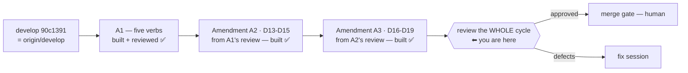

# Handoff — 2026-08-26

> **Ephemeral.** At most one of these exists per line of work; the previous was deleted before this
> was written. It links **out** to the roadmap, ADRs and designs — nothing links back to it.

## Methodology / where we are

**Phase: IMPLEMENTATION COMPLETE for [A1](roadmap.md) and all three of its amendments. The next step
is ONE review over the WHOLE save/status/history cycle, then the merge gate.**

A1 shipped five verbs. Then each review widened the unit rather than closing it, three times:



⚠ **Read that chain before deciding anything.** A1's review produced A2; A2's review produced A3;
**A3's own code has never been reviewed.** The maintainer's call on 2026-08-26 is therefore not
another delta review but **one pass over the finished cycle**, so the unit stops growing by one
amendment per review.

Everything below was **measured on this branch**, not carried over:

| Claim | Measured |
|---|---|
| Suite (container) | **`Results: 1770 passed, 7 failed, 1777 total`** — the 7 are the [known host-only set](roadmap.md), verified name for name |
| Branch | `feat/config/save-and-history`, **25 ahead of `develop`**, clean tree, **not merged** |
| `develop` vs `origin/develop` | **0** — that gate is closed |
| Baked files touched | **none** across all 9 A2+A3 commits ⇒ **no `cco build` owed** |
| bash 3.2 | the 5 changed files **parse** under real `bash:3.2` (Docker socket), with a negative control. ⚠ A **lint**, not the suite |

## What the next session must do

**Run `/review-implementation` over the ENTIRE cycle — six verbs, both stores — not over the A3 delta.**

| Store | write | read: not saved yet | read: what was saved |
|---|---|---|---|
| `~/.cco` | `cco config save` | `cco config status` | `cco config history` |
| `<repo>/.cco` | `cco project save` | `cco project status` | `cco project history` |

Judge **correctness, absence of bugs, coherence, adherence to the approved design, and completeness**
of the whole matrix. Give A3 particular attention — it is the unreviewed part — but do **not** scope
the pass to it.

**The whole surface, so nothing is missed by omission:**

```
lib/cmd-project-save.sh    cmd_project_save · cmd_project_status · cmd_project_history
lib/cmd-config.sh          _config_save · _config_status · _config_history
lib/config-read.sh         the shared history/status renderers (BOTH stores go through these)
lib/secrets.sh             _secret_scan_paths / _secret_scan_staged / the pattern lists + floor

tests/test_project_save.sh   53 tests — T1…T17, AT1…AT9, AR1…AR9, the config twins
tests/test_operator_shim.sh  T18…T22, S8, S9 — the access classification of all six verbs
tests/test_invariants.sh     INV-GIF (test_invariant_project_gitignore_floor_covered)
tests/test_reminders.sh      the D4 multi-repo report this cycle calls into
```

**Contract to judge against** — the design is living and current; the ADR carries the decisions:

- [ADR-0038](configuration/decentralized-config/decisions/0038-project-config-versioning.md) —
  D1…D8 + **A1** (D9…D12) + **A2** (D13…D15) + **A3** (D16…D19)
- [the design](configuration/decentralized-config/design/design-project-config-versioning.md) —
  §2.4 the barrier, §2.6 the levels, §5b the whole `status` half, §6.1/§6.2/§6.2b/**§6.2c**/**§6.2d**
  the test plans, §6.4 what the suite cannot reach, §7 what the build settled

Then: **approved → the merge gate opens** (a human decision the maintainer has already framed as the
next step); **defects → a fix session**, not a merge.

## Gates still open

| Gate | What unblocks it |
|---|---|
| **Review the whole cycle** | the next session's work — this is the intended entry point |
| **Merge into `develop`** | the human review point, after the review is clean. ⚠ Does the diff touch `.cco/`? **No** — so [FI-20](improvements.md)'s host-only merge rule does not apply. Measure before assuming |
| **macOS host suite (bash 3.2)** | ▶ **the maintainer is running it on the host in parallel** — the command is below. Still owed before `0.7.0`; nothing has run the full suite on 3.2 since `v0.6.0` |
| **[A9](roadmap.md)** ([FI-77](improvements.md)) | ▶ **the next unit once A1 closes**, scheduled 2026-08-22. The `.claude` authoring axis is invisible to the agent it governs. Needs a short design first, and a `cco build` |
| **[FI-73](improvements.md)** | the SIGPIPE sentinel — still a maintainer's call, unchanged |

⚠ **`feat/claude-view-file-overlays` is rares' branch and is deliberately untouched** — local and
remote identical at `43c2c33`. Not merged, not deleted, not part of any cleanup.

## The host suite command (maintainer runs this in parallel)

```bash
cd /Users/alessandro/Projects/CaveResistance/Software/claude-orchestrator
git branch --show-current          # must say feat/config/save-and-history
bash --version | head -1           # must say 3.2.x — that is the point of the run

bash bin/test 2>&1 | tee /tmp/cco-suite-host.log

# THE ORACLE — do not read the [PASS]/[FAIL] lines, they carry ANSI codes:
grep -c 'Results:' /tmp/cco-suite-host.log     # MUST be 1. Zero = the suite ABORTED
grep    'Results:' /tmp/cco-suite-host.log
grep 'FAIL' /tmp/cco-suite-host.log | grep -v 'ASSERTION FAILED'
```

🔴 **A missing `Results:` line is the failure signal, and the log still reads green without it** —
that is how the `v0.6.0` release nearly shipped on an aborted host run. Expected outcome:
`1770 passed, 7 failed, 1777 total`, the 7 being the known host-only set. **Anything else — including
a different total — is a finding**, and a bash 3.2 parse abort is the specific one to fear.

## Tasks

The [roadmap](roadmap.md) is the single source of truth for status; this list points at it.

- [ ] ▶ **`/review-implementation` over the whole save/status/history cycle** — six verbs, both
      stores, per the table above. Particular attention to A3, which is unreviewed; **not** scoped to it
- [ ] **Then the merge gate** — approved → merge to `develop` and delete the branch per
      `rules/git-practices.md`; defects → a fix session
- [ ] **macOS host suite (bash 3.2)** — ▶ maintainer-run, results to be folded into the review
- [ ] ▶ **[A9](roadmap.md)** ([FI-77](improvements.md)) — **THE NEXT UNIT after A1 closes**. Short
      design first; three questions are open in the roadmap entry. ⚠ Both targets are **baked** ⇒ `cco build`
- [ ] **[FI-73](improvements.md)** — decide the SIGPIPE sentinel fix
- [ ] **[FI-74](improvements.md)…[FI-76](improvements.md)** — A1's review residue, none blocking
- [ ] **[A2](roadmap.md)** (the roadmap item) — per-project custom Docker image
      ([FI-49](improvements.md)). ⭐ Sub-problem 3 first: the `setup.sh` docs contradict themselves
- [ ] **[A3](roadmap.md)** (the roadmap item) — cross-scope collision warning
      ([FI-32](improvements.md)) + three open decisions
- [ ] **[A6](roadmap.md)** — `.claude/worktrees` in the functional-write floor ([FI-56](improvements.md))
- [ ] **[A7](roadmap.md)** — the A4 review residue ([FI-62](improvements.md) … [FI-66](improvements.md))
- [ ] **FI-58 leftovers** — ADR-0058's **D3**, **D7** and **D8-as-amended** are unbuilt. ⚠ D8 touches a
      **baked** file, so that unit also takes a `cco build`
- [ ] **[FI-72](improvements.md)** — nothing detects the *next* unclassified `warn` producer

## Context

### Decided this session, and not to be reopened

**[ADR-0038 Amendment A3](configuration/decentralized-config/decisions/0038-project-config-versioning.md#a3--2026-08-24-a2s-own-barrier-repeated-the-defect-a2-removed)**
— D16…D19, all four ruled by the maintainer after being shown the findings with options and
trade-offs. Read the ADR, not this line.

⚠ **D15 and D13 are annotated in place**, with dated blocks that leave the originals readable. A
reader who reaches D15 without A3 will rebuild the defect A3 removed.

🔑 **A3's through-line is D13's OWN defect, reappearing one screen from where D13 removed it**: *a
message that claims more than its mechanism proves, and a remedy the user cannot follow.* That is the
lens to review this cycle with.

The two points a reader is most likely to challenge:

- **D16 widened D15 rather than narrowing it.** The refusal now fires for *any* rule that drops an
  essential file, not only a wholesale `.cco/` ignore — because the harm (a partial config, silently)
  does not depend on how the rule is spelled. ⚠ **Refusing when `.cco/` is ignored wholesale is
  deliberate and stays**: it is the supported path for a solo adopter keeping cco config out of git,
  and there the save must abort rather than half-succeed. The message says so in as many words.
- **D18 changed a verb A1 shipped.** `--full` withholding a flagged file's diff is A1 behaviour, not
  A2's. It was fixed here because A2 is what made the verb *know* it was a secret in the same run, so
  the inconsistency is this unit's to close.

### Open questions needing a human

- 📝 **[FI-73](improvements.md)** — the SIGPIPE sentinel. Unchanged. ⚠ Whoever takes it must verify
  the sentinel STILL fires on a real `set -u` violation.
- 📝 **An unrecognised answer at the `cco start` pause starts the session** (only `a`/`A` aborts).
  ADR-0059 D10 decided bare Enter and `[S/a]`; it did not decide what a stray `n` does. Not blocking.
- 📝 **[Open decision #7](roadmap.md)** — should `cco clean` sweep `$TMPDIR/cco-warn.*`?

### 🔑 Non-obvious things the next session would otherwise rediscover

- 🔴 **`git check-ignore` IS INDEX-AWARE.** A **tracked** file reports *not ignored* even with the rule
  present — git consults the index before the ignore chain. That is the whole of D13, and it is
  invisible to anyone reading only the `.gitignore`.
- 🔴 **NEVER restore the claim *".cco/ is ignored entirely"***. Measured: a root `.gitignore` of merely
  `*.yml` satisfies D15's key while git still stages **two** files — so that message named a rule
  **not in the file**. No finite set of probes proves "entirely". Name the rule that fires, with
  `git check-ignore -v --no-index`.
- 🔴 **A root rule of just `.cco/.gitignore` produced `✓ saved` on a config whose BARRIER never
  landed** — every clone of it starts unprotected, and its first `cco project save` refuses with
  *missing*. This is why the essential set is `project.yml` **and** `.gitignore`.
- ⭐ **THE POST-CONDITION WAS UNTESTED, AND ONLY A MUTATION SHOWED IT.** Neutralising
  `_project_save_assert_essentials` changed **nothing** in the whole suite: the barrier ahead of it
  makes it unreachable from the CLI. It is pinned by a **direct call** (AR9). *A guard nothing can
  reach is a guard nothing has measured* — and the same question is worth asking of every other guard
  in this cycle.
- ⚠ **`_secret_scan_staged` IS NOW A PIPELINE.** Under `set -o pipefail` a failing `git diff --cached`
  (rc 128) makes the function return 128, and the caller would print its refusal with an **empty
  path**. Fail-closed and unreachable on a sane repo (guarded upstream by `rev-parse
  --is-inside-work-tree`), but it is a silent contract change to the function **both** save gates share.
  Raised by A2's review as `minor`; never ruled.
- 🔴 **COMMITTING A READ-ONLY `.cco/` SUCCEEDS.** `git add -- .cco/` returns **0** on a `.cco` bound
  `ro`: git reads the **worktree** and writes to **`.git/`**, which is `rw`. **So D8's gate is policy**,
  and `test_operator_project_save_needs_edit_project` is the ONLY thing guarding it. A reviewer
  reasoning from the mount table concludes the opposite.
- ⭐ **THE PATHSPEC IS ON THE COMMIT, NOT ONLY THE STAGING.** A file the user had **already staged** is
  in the index and a bare `git commit` sweeps it into the config commit. Same reason the refusal's
  reset is `git reset -q -- .cco`.
- ⚠ **`config status`'s allowlist pathspec looks redundant and is not**, and a test on a **saved** store
  cannot see it (measured: the mutation passed). `test_config_status_on_a_never_saved_store` discriminates.
- ⚠ **A suite log's `[PASS]`/`[FAIL]` lines carry ANSI colour codes.** The **`Results:` line is the only
  authoritative count**, and its *absence* is itself a signal.
- ⚠ **A pipeline's rc is the LAST command's.** `grep … | sed …` returns sed's 0 even when grep matched
  nothing — it defeated a completion check twice this session. Use `if grep -q …; then`.
- ⚠ **`bash -n` READS ONLY THE FIRST FILE.** One invocation per file, or the check silently covers one.
- ⚠ **The docker proxy filters container names** to `cc-<project>-*`; anything else fails with rc **125**,
  which is Docker's error, not the command's. It also returns no container stdout — a bash-3.2 probe can
  assert an **exit code** only.
- ⚠ **THE HOST CAN CHANGE THIS SESSION'S BRANCH UNDER IT** — host and container share one working tree.
  Run `git branch --show-current` before any write. ⚠ **The maintainer is running the host suite in
  parallel**, so expect the tree to be read (not written) from outside.
- ⚠ **git in this container needs `safe.directory`** and `~/.gitconfig` is a read-only bind mount:
  `GIT_CONFIG_COUNT=1 GIT_CONFIG_KEY_0=safe.directory GIT_CONFIG_VALUE_0=/workspace/claude-orchestrator git …`
- ⚠ **A manual smoke of these verbs needs the ambient operator env cleared** — `env -u
  CCO_CONTAINER_OPERATOR -u CCO_ACCESS_TRIPLE -u PROJECT_NAME -u CCO_SESSION_CONTEXT`, or the shim
  refuses at exit 2. ⚠ Do **not** set `CCO_ALLOW_HOST_RESOLVE=1` to silence the ADR-0007 guard: it sends
  the run at the internal store and dies on `/var/lib/cco-internal`. Filter that one line out instead.

## Reference documents

- [roadmap.md](roadmap.md) — the living SSOT; A1's entry carries all three amendments and their measures
- [improvements.md](improvements.md) — the `FI-*` tracker
- [ADR-0038](configuration/decentralized-config/decisions/0038-project-config-versioning.md) — the contract
- [design-project-config-versioning.md](configuration/decentralized-config/design/design-project-config-versioning.md)
  — the mechanism and the test plans
- [ADR-0059](cli/decisions/0059-message-classification-and-the-start-warning-gate.md) — the message
  taxonomy, and why the pause is not reachable from a verb
- [ADR-0008](configuration/decentralized-config/decisions/0008-personal-store-management.md) — the twin
  `cco config save`; its *non-blocking* principle bounds what these verbs may become
