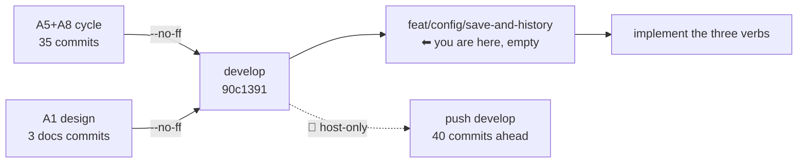

# Handoff — 2026-08-21

> **Ephemeral.** At most one of these exists per line of work; the previous was deleted before this
> was written. It links **out** to the roadmap, ADRs and designs — nothing links back to it.

## Methodology / where we are

**Phase: Implementation — build [A1](roadmap.md) to its approved design. Nothing else is owed first.**

The previous cycle is **closed and merged**. `develop` now carries the A5+A8 cycle and A1's design,
through two `--no-ff` merges, and both feature branches are deleted. The branch you are on,
**`feat/config/save-and-history`**, was cut from the tip of that `develop` and is **empty of work** —
it exists so implementation starts clean.

Every prerequisite was verified on this branch, not assumed:

| Prerequisite | Verified |
|---|---|
| ADR-0038 + design present | both files on disk |
| `note()` and the warn-capture layer available | present in `lib/colors.sh` (they did **not** exist on the old `develop`) |
| Suite baseline | **`Results: 1710 passed, 7 failed, 1717 total`** on merged `develop`, the 7 verified name for name as the [known host-only set](roadmap.md) |



### Gates still open

| Gate | What unblocks it |
|---|---|
| **Push `develop`** | host-only — 40 commits ahead of `origin/develop`, unpushed. No SSH key / gh auth / token in a session (measured repeatedly). Command under *How to resume* |
| **Delete `origin/feat/cli/start-warning-gate`** | host-only **and** outward-facing, so it is asked, not assumed. The local branch is already deleted; the remote ref is the natural end of a merged branch's life |
| **A1 implementation** | this session's work — the design is approved, no further human gate before building |
| **macOS host suite (bash 3.2)** | owed before `0.7.0`; nothing has run the full suite on 3.2 since `v0.6.0` (`1626 / 0` on that tree) |
| **A live look at the new pause** | ⭐ one host `cco start` — the acceptance run measured the form Amendment A2 replaced. Nothing depends on it; the suite covers the three forms and the abort |

⚠ **`feat/claude-view-file-overlays` is rares' branch and is deliberately untouched** — verified
identical local and remote at `43c2c33`. It is not merged, not deleted, and not to be included in any
cleanup. The maintainer reviews it in a dedicated session.

## How to resume

**1. Push, from the host** — the one owed action no session can perform:

```
cd /Users/alessandro/Projects/CaveResistance/Software/claude-orchestrator
git push origin develop
git push origin --delete feat/cli/start-warning-gate    # merged; the local branch is already gone
```

Measure before repeating any position stated here — including these:

```
git rev-list --count origin/develop..develop
git branch -vv
```

**2. Then implement A1**, from
[ADR-0038](configuration/decentralized-config/decisions/0038-project-config-versioning.md) and
[its design](configuration/decentralized-config/design/design-project-config-versioning.md). The
design carries the mechanism, the three command surfaces, and the **full test plan (T1…T22)** across
three files. Do not re-derive the decisions — all eight are ruled.

The unit is **three verbs**: `cco project save` · `cco project history` · `cco config history`.

**3. Order the work so the barriers exist before the writer does.** The secret scan and the
missing-`.gitignore` refusal (D7) are what make `save` safe to run at all; building them after the
commit path means every manual test in between runs unprotected against a real `secrets.env`.

**4. Do not re-derive the TTY contract.** `_cco_have_tty` (`lib/utils.sh`) is the single interactivity
spelling, enforced by `test_invariant_tty_gate_single_spelling`. A raw `/dev/tty` probe hangs the
suite silently.

## Tasks

The [roadmap](roadmap.md) is the single source of truth for status; this list points at it.

- [ ] **Push `develop`** + delete the merged remote branch — host-only (command block above)
- [ ] **[A1](roadmap.md) — `cco project save`** — staging scoped to `.cco/**`, the D7 barrier, the
      secret scan reused from `lib/secrets.sh`, the D4 multi-repo report
- [ ] **[A1](roadmap.md) — `cco project history` + `cco config history`** — compact summary + `--full`,
      the changed-parts grouping, the degradation paths (never a die on an empty history)
- [ ] **[A1](roadmap.md) — shim classification** — `_op_write … project` for `save`, free for
      `project history`, `_op_read_scope global` for `config history` (D8)
- [ ] **[A1](roadmap.md) — the surfaces around it** — `lib/reminders.sh` remedy (b), the baked managed
      rule, `cco --help` / `cco project --help`, CLI reference, user guide, `changelog.yml`
- [ ] **[A1](roadmap.md) — acceptance** — ⚠ **one `cco build`**, owed by exactly one file (the baked
      managed rule). Everything else is host-side CLI produced at run time
- [ ] **macOS host suite (bash 3.2)** — owed before the `0.7.0` release
- [ ] **[A2](roadmap.md)** — per-project custom Docker image ([FI-49](improvements.md); short design).
      ⭐ Sub-problem 3 first: the `setup.sh` docs contradict themselves and the answer is a
      **measurement** that changes what the guide should recommend for the other two
- [ ] **[A3](roadmap.md)** — cross-scope collision warning ([FI-32](improvements.md)) + three open decisions
- [ ] **[A6](roadmap.md)** — `.claude/worktrees` in the functional-write floor ([FI-56](improvements.md))
- [ ] **[A7](roadmap.md)** — the A4 review residue ([FI-62](improvements.md) … [FI-66](improvements.md))
- [ ] **FI-58 leftovers** — ADR-0058's **D3**, **D7** and **D8-as-amended** are unbuilt. ⚠ D8 touches a
      **baked** file (`config/hooks/subagent-context.sh`), so whichever unit takes it also takes a
      `cco build` in its acceptance lane
- [ ] **[FI-72](improvements.md)** — nothing detects the *next* unclassified `warn` producer

## Context

### Decided, and not to be reopened

**[ADR-0038](configuration/decentralized-config/decisions/0038-project-config-versioning.md)**, D1…D8,
all ruled by the maintainer. Read the ADR, not this line. The two rulings a builder is most likely to
drift from:

- **D1 — the verb is `cco project save`**, not `cco save`. Two shipped surfaces already name it, so
  the baked rule needs a **deletion** (of *"is forthcoming; until it lands, use git directly"*), not a
  rewrite.
- **D7 — cco does not author `.cco/.gitignore`.** A missing or insufficient one **refuses and names
  the fix**. It is a versioned file in the user's own repo, and writing it would put an unrequested
  change inside the very commit they asked for. This is where the design deliberately diverges from
  `_config_ensure_gitignore`, and "make it consistent with the twin" is the wrong instinct.

### Open questions needing a human

- 📝 **Two A1 choices left to implementation**, both cheap and both fine to just pick: the default
  commit message when `-m` is absent (the twin uses `config update`), and `history`'s default `-n`.
- 📝 **An unrecognised answer at the pause starts the session** (only `a`/`A` aborts). D10 decided bare
  Enter and `[S/a]`; it did not decide what a stray `n` does. **Not blocking.**
- 📝 **[Open decision #7](roadmap.md)** — should `cco clean` sweep `$TMPDIR/cco-warn.*`?
- The five older ones are in the roadmap's [Open decisions](roadmap.md).

### 🔑 Non-obvious things the next session would otherwise rediscover

- ⭐ **Committing a read-only `.cco/` SUCCEEDS.** Measured with a separate `GIT_INDEX_FILE`:
  `git add -- .cco/` returns **0** on a `.cco` bound `ro`, because git reads the worktree and writes to
  `.git/`, which is `rw` — the `.cco` bind is a read-only *child* mount inside a read-write repo. The
  twin's ro-mount guard (`lib/cmd-config.sh:93`) exists because `~/.cco` **contains its own `.git`**,
  and that reason does not transfer. **So D8's `edit-project+` gate is policy, not mechanism**, and
  `project save` gets **no** ro-mount guard. Anyone reasoning from the mount table concludes the
  opposite and "fixes" it.
- ⚠ **`_sync_synced_files` is the WRONG list for `save`.** It looks right and is the *copy* set for
  `cco sync`, enumerated positively so a copy is deterministic. A positive enumeration in a versioning
  verb silently drops a file the user added. Stage `.cco/**` and let `.gitignore` do its job.
- 🔑 **`lib/reminders.sh` reminder (b) is a caller already waiting for the verb** — it says
  *"→ commit with your normal git flow"* while sibling (a) says *"→ cco config save"*. Closing that
  asymmetry is part of the unit, and it is emitted at every `cco start` and every `cco sync`.
- 🔑 **At `read-project`, `~/.cco` is not mounted as a store** — only the referenced pack is bound under
  `~/.cco/packs/`. No `.git`, which is *why* `config history` is gated `_op_read_scope global`. Exact
  precedent in the shim: `template show|validate`.
- 🔑 **Reuse the scan, do not write a second one.** `_config_scan_staged` is nearly right already; it
  differs only in its git root. `lib/secrets.sh`'s own header says why a divergent second copy is the
  failure to avoid.
- ⚠ **THE HOST CAN CHANGE THIS SESSION'S BRANCH UNDER IT.** Host and container share **one** working
  tree. During the previous session the host checked out `feat/claude-view-file-overlays`, and the
  session's branch and `handoff.md` changed on disk mid-conversation — nothing was lost, but a session
  that had assumed its branch would have committed onto someone else's. **Run `git branch --show-current`
  before any write, not only at session start.** The same mechanism is how a host-side push becomes
  visible here with no fetch.
- ⚠ **A suite log's `[PASS]`/`[FAIL]` lines carry ANSI colour codes.** Grepping `'^\[PASS\]'` counts
  only the uncoloured minority and under-reports badly (519/6 against a true 1710/7). The **`Results:`
  line is the only authoritative count** — and its *absence* is itself a signal (a bash-3.2 abort
  leaves a log that reads green with no summary).
- ⚠ **A stated commit count is invalidated by the commit that states it.** The handoff commit itself
  made this branch's "+2" a "+3", and the number was repeated once before being re-measured. Measure,
  never restate.
- ⚠ **git in this container needs `safe.directory`** and `~/.gitconfig` is a read-only bind mount, so
  it cannot be set globally. Use
  `GIT_CONFIG_COUNT=1 GIT_CONFIG_KEY_0=safe.directory GIT_CONFIG_VALUE_0=/workspace/claude-orchestrator git …`.
- 🔑 **`git merge -F -` does not read stdin** (`could not read file '-'`). Write the merge message to a
  file and pass its path.
- 📝 **The FI-25 mask (`access: {claude: all}` in `.cco/project.yml`) is ON**, deliberately. Masked
  in-container figures are the `…/7` ones. Pin `--claude-access` explicitly for any A4-style measurement.

## Reference documents

- [roadmap.md](roadmap.md) — the living SSOT; A1's entry carries the scope, the decisions and the
  measurement the implementation must not re-derive
- [improvements.md](improvements.md) — the `FI-*` tracker
- [ADR-0038](configuration/decentralized-config/decisions/0038-project-config-versioning.md) — project
  config versioning + the history surface, D1…D8 — **the contract to build to**
- [design-project-config-versioning.md](configuration/decentralized-config/design/design-project-config-versioning.md)
  — mechanism, the three surfaces, **the T1…T22 test plan**, and §6.4 on what the suite cannot reach
- [ADR-0008](configuration/decentralized-config/decisions/0008-personal-store-management.md) — the twin
  `cco config save`; its *non-blocking* principle bounds what A1 may become
- [ADR-0042](configuration/agent-cco-access/decisions/0042-agent-cco-interaction-model.md) — names
  `cco project save` in its Level-C guidance
- [ADR-0059](cli/decisions/0059-message-classification-and-the-start-warning-gate.md) — the message
  taxonomy every new message must be classified by
