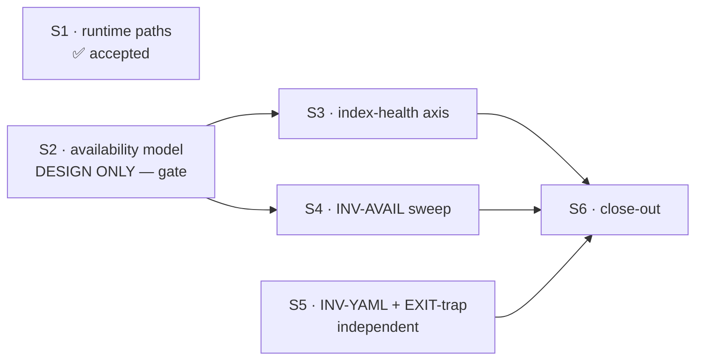

# Handoff — S1 is accepted; S2 awaits its start gate

> **Ephemeral.** Delete this file before writing the next handoff. It links out only.
> Written 2026-07-28, after cycle-1.2 **S1** was accepted.

## Methodology / where we are

Branch **`fix/release/cycle-1.2`** off `develop` (which is level with `origin/develop`).
**17 commits, nothing pushed.** Tip `80788d8`.

**S1 (lane L3 — R-D + R-F) is closed and accepted**: both container probes are green and recorded.
The cycle's next unit is **S2**, which is a **Design** phase — *design only, no code* — and it ends at
a human gate. S3 and S4 implement S2's ADR and cannot start before it.

**The gate that is pending is S2's own start.** It was offered at the end of the last session and not
answered, so no direction has been approved. Per `.claude/rules/workflow.md` this is gate (a):
launching the work *and approving its direction*. Do not open S2 unilaterally.

## How to resume

1. Confirm the ground: `git log --oneline -1` → `80788d8` on `fix/release/cycle-1.2`.
2. **Ask the maintainer to open S2** (it is a phase transition — a gate, not a formality). While
   waiting, the reading below is free to do; writing the ADR is not.
3. Switch to **Plan mode** for S2 — the permission-mode-per-phase rule puts Design in read-only.
4. Read the S2 brief: **§4** of
   [`fix-design-v3.1/00-plan.md`](configuration/agent-cco-access/e2e-review/fix-design-v3.1/00-plan.md)
   — §4.1 is what the ADR must settle, §4.2 the exit criteria. Then its own reading list:
   `consolidated-review-v3.1.md` §3/§4/§6 · `invariant-gap-audit.md` §2 ·
   [ADR-0043](cli/decisions/0043-unified-cli-environment-access-scope.md) ·
   ADR-0047 §INV-S6 · `lib/access-scope.sh` · `lib/index.sh:104-180`.
5. S2 produces **one ADR** covering both halves, because they meet in the same renderer:
   `project show`'s `[unresolved]` marker answers *"the index did not tell me a path"* and prints it
   as *"no path is bound"*. Splitting them would put one predicate in two ADRs.

⚠ **The runbook warns that the W4 report's diagnosis of R-B is wrong**, and says why: packs *are*
wired into the scope layer (`cmd-pack.sh:116` calls `_env_note_hidden`). The real cause is that at
`G=none` the store is not mounted, so the enumeration loop never iterates. **You cannot count what
you cannot enumerate** — the count has to come from the elevated side.

## Tasks

Status lives in the [roadmap](roadmap.md) §B2-next (lanes L1–L5) and in §2 of the runbook; this list
points at them, it does not fork them.

- [ ] **S2** — availability model, design only, one ADR → roadmap lanes **L1 + L2**. *Blocked on the
      start gate.*
- [ ] **S3** — index-health session/host axis (**R-C** 🔴) → lane **L2**. Needs S2. **Requires a
      container probe** after `cco build`; suite-green does not accept it.
- [ ] **S4** — INV-AVAIL sweep + CLASS lint (**R-A**, **R-B** 🔴) → lane **L1**. Needs S2.
- [ ] **S5** — INV-YAML + EXIT-trap sentinel → lanes **L4 + L5**. Independent; may run any time.
- [ ] **S6** — close-out: §10.9e/E6B-04 (never executed in any round), host cleanup of the stale
      remotes/projects, README platform contradiction (`:59` vs `:220`).
- [ ] **D7 residual** — *"composes with no packs at all"*, the one item S1's probes could not reach.
      It needs a project referencing **no** pack, so it is **host-side** (`cco start` is refused
      in-session). Only `test_claude_view_composed_for_the_write_floor_without_packs` covers it today.
- [ ] **Host-side, yours** (FI-20 — merges touching `.cco` are host-only): `git push` this branch,
      then the merge into `develop`.
- [ ] **[FI-37](roadmap-backlog.md)** and **[FI-38](roadmap-backlog.md)** — filed, not scheduled.

## Context

### What this session established

The `Cp=rw` arm of S1 — the only code path left unprobed, because its fix (`aa97b3b`) landed after
the first container probe was recorded. Full output is in the runbook's **acceptance log §7, second
block**; the short version:

- The marker survived the restart with its checksum intact, **and the run is provably not vacuous**.
  That distinction is the whole point: `probe.js` survives *because* it now lives in the committed
  tree, so its survival alone would prove nothing. What proves it is that the view's own mtime moved
  to the restart (`16:01`) while the marker kept its pre-restart one (`15:57`) — so
  `rm -rf "$_claude_view"` (`lib/cmd-start.sh:1905`) really ran, and the save outlived it.
- Two of the three items §7 listed as *not observed* closed in the same run: a non-`-workspace` key
  (`-workspace-claude-orchestrator`) written by a **real** Claude Code session from a repo cwd — the
  end-to-end write, not the mechanical `mkdir` the first probe reproduced — and its survival across
  the restart.
- Here the maintainer's `access: {claude: all}` block was deliberately **kept**, because at `Cp=rw`
  it is not the mask but the *subject*: the only configuration in which the path executes. That is
  the inverse of the first probe, which required stashing it.

No decision was made that needs an ADR; ADR-0055 already carries S1's model and needed no amendment.

### Open question for the human

**Should the memory-bucket observation be filed as a backlog item?** Observed during the probe, not
chased, recorded in §7: the new transcript key was given a plain `memory/` directory of its own. Only
`-workspace/memory` is the bound bucket (ADR-0055 D5), so a teammate started from a repo cwd writes a
**different** memory bucket. It persists — it is inside the STATE bind — but it is not the memory the
main session reads. It is a sibling in shape to FI-37: the repo-cwd lane again gets a path that works
but is not the one that counts. Filing it is the maintainer's call, so it was left unfiled.

### Non-obvious things worth not rediscovering

- **Any suite figure from a self-dev session must state whether `access: {claude: all}` was on.** The
  block is still uncommitted in `.cco/project.yml` and it is currently **on**. With it on,
  `test_update_new_file_added` and `test_update_dry_run` pass; with it off they fail, because they
  write into `defaults/global/.claude/rules/`, which is tracked *and* `:ro` when `Cr=ro`. The
  unmasked figure is **1551 passed / 9 failed of 1560**; seven of the nine are the long-standing
  host-only set. This mask has now cost three wrong numbers in this cycle.
- **`cco start` runs host-side.** Edits to `lib/` change behaviour on the next start with no rebuild;
  edits to the `Dockerfile` need `cco build`. Record provenance (`cco whoami` → `image built from:`)
  with any probe — this session ran on `fix/release/cycle-1.2@c40e556`.
- **L2/L3/L4 cannot be accepted on suite-green** (RC-17's fourth recurrence). The hermetic suite is
  blind to mount-time and container-context reality by construction. S3 still owes a probe.
- The working tree carries three untracked paths that are **not** this cycle's (`tmp`,
  `to-verify-guides-docs.md`, `.claude/worktrees/`) and an uncommitted `.cco/project.yml` that also
  contains a port change (`8081` → `8082`) beside the access block. Leave them alone unless asked.

## Reference documents

- [Roadmap](roadmap.md) — §B2-next, lanes L1–L5 (SSOT for status) · [backlog](roadmap-backlog.md)
- [Cycle-1.2 runbook](configuration/agent-cco-access/e2e-review/fix-design-v3.1/00-plan.md) — §2
  session map · §3 S1 · **§4 S2** · §5 S3/S4 · §7 acceptance log · §8 host-only gates
- [ADR-0055](environment/decisions/0055-claude-runtime-state-and-mountpoint-ancestry.md) — what S1
  decided: `claude_access` governs authoring, never Claude Code's runtime state
- [ADR-0043](cli/decisions/0043-unified-cli-environment-access-scope.md) — symmetric read scoping,
  the model S2 extends (note it lives under `cli/decisions/`, not with the access-model ADRs)
- `docs/maintainers/engineering/analysis/invariant-gap-audit.md` — why the unit of work in this cycle
  is the invariant plus its lint, not the reported finding
