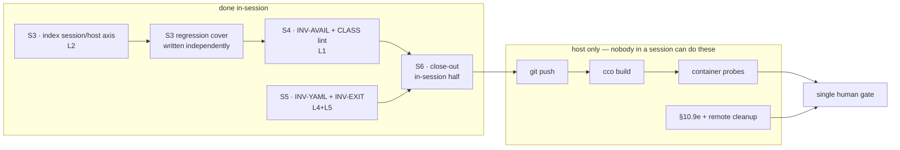

# Handoff — cycle-1.2 implementation block complete in-session; the host-side gate is what remains

> **Ephemeral.** Delete this file before writing the next handoff. It links out only.
> Written 2026-07-29, at the maintainer's pause. Supersedes the S2-acceptance handoff.

## Where we are

Branch **`fix/release/cycle-1.2`**, tip **`9599111`**. `develop` carries the merge of everything
accepted through S2 (`142276a`) and is **22 commits ahead of `origin/develop`** — **nothing is
pushed**.

**The whole implementation block landed in-session.** S3, S4, S5 and S6's in-session half are
implemented, tested and merged into the cycle branch. What is left is **not implementation**: it is
the single human gate plus the host-only probes that no session can run.



### Suite — state the mask, always

**1608 passed / 7 failed of 1615**, measured **with `access: {claude: all}` ON** (the uncommitted
block in `.cco/project.yml`; `cco whoami` confirms `Cr=rw Cp=rw Cg=rw Co=rw`). The 7 are the
long-standing host-only set, unchanged name-for-name: the six `test_as_*` plus
`test_paths_symlink_safe_tool_root`. **Do not chase them** — see the `suite-7-host-only` memory note,
which records two already-refuted hypotheses.

The arithmetic closes with no slack, which is itself the check: baseline **1553/7 of 1560** → +12
(S3's regression cover) +9 (S5) +25 (S4) = **1599/7 of 1606** at the merge → +9 (S6) = **1608/7 of
1615**.

⚠ **This mask has now cost four wrong numbers across the cycle.** Any figure recorded from a self-dev
session must state whether the block was in place. Unmasked, two further tests fail
(`test_update_new_file_added`, `test_update_dry_run`) because they write into
`defaults/global/.claude/rules/`, which is tracked *and* `:ro` whenever `Cr=ro`.

## What landed

| Unit | Lane | Where | Note |
|---|---|---|---|
| **S3** | L2 | merged | `_index_read_state` **byte-unchanged** (A3 not taken — verified mechanically, not by eye). Axis in `_index_assert_readable`, two causes split by parent traversability. Found and guarded a site the brief did not list: `cco project validate --all` enumerated the index unguarded and returned **exit 0, share-ready**, having validated zero projects |
| **S3 test** | L2 | merged | `tests/test_index_session_axis.sh`, 12 tests, written by an **independent tester from ADR-0056**, not from the code. **7 of the 12 fail on the pre-S3 tree**; the 5 that pass on both are deliberate contract-preservation guards |
| **S4** | L1 | merged | The sweep found **five sites the ADR's table did not name**. Largest: `tags.sh:287-313` — `cco list` itself, which at `G=none` counted nothing. *That* is R-B, and it is bigger than the `pack validate` site the ADR named. Also corrected two now-stale ADR characterisations (`project coords` **does** consult scope; the discarded-argument defect was already fixed on the parent) |
| **S5** | L4+L5 | merged | INV-YAML buffer-and-flush in the one sanctioned function; INV-EXIT via a single `_cco_exit` primitive. Both with CLASS lints carrying **must-fire and must-not-fire** plants |
| **S6** | close-out | merged | Zero-row index refused in-session; `migrate.sh` comment destruction fixed — which earned it **off** the INV-YAML allowlist; README platform statement corrected |

Changelog IDs **53** (S3) · **54, 55** (S5) · **56** (S4) · **57+** (S6) — sequential, no gaps. S3 and
S5 both claimed 53 while working in parallel; resolved at merge.

## ⛔ What is owed, and cannot be done from a session

**These are the acceptance criteria. Cycle-1.2 Rule 1: suite-green is not acceptance for L2.**
Run them from the Mac at `/Users/alessandro/Projects/CaveResistance/Software/claude-orchestrator`.

1. **Push** — `git push origin develop fix/release/cycle-1.2`
2. **`cco build`** — `lib/` and `Dockerfile` are baked into the image, so every fix in this block is
   **invisible in-session until a rebuild**. Record provenance (`cco whoami` → `image built from:`)
   alongside each probe.
3. **S3's container probe** — with a session live:
   ```
   mv ~/.local/state/cco/shared/index ~/.local/state/cco/shared/index.probe
   cco path list ; cco list ; cco list projects ; cco project show claude-orchestrator
   cco project validate --all
   mv ~/.local/state/cco/shared/index.probe ~/.local/state/cco/shared/index
   ```
   Expect a read failure from each (exit 1, the **severed** sentence — on macOS the parent is still
   enterable), then recovery. ⚠ **The path is `state/cco/`*`shared/`*`index`.** The pre-S1
   `state/cco/index` no longer exists; a copy-paste of the older command moves nothing and produces a
   **false pass**. The **store-unreachable** arm is unreachable on macOS by construction — it is the
   native-Linux default and will first be observed there.
4. **S4's `CCO_STORE_TOTALS` probe** — D5's host-computed hidden count only materialises after
   `cco build`. Check a `read-project` session reports non-zero hidden counts for packs/templates.
5. **S6's host-only half** — **§10.9e / E6B-04** (pack-rename fan-out, never executed in any round)
   and `cco remote remove probe-2 && cco remote remove x && cco remote remove probe-3 && cco remote
   remove probe-3b`. ⚠ Clear the stale `scratch-pack` and `scratch-a`/`scratch-b` **first**, or the
   fan-out result is ambiguous to read.
6. **D7 residual from S1** — *"composes with no packs at all"*. Needs a project referencing **no**
   pack, so it is host-side. Only `test_claude_view_composed_for_the_write_floor_without_packs`
   covers it today.
7. Then the **merge into `develop`** and the CLI-surface documentation audit (roadmap step 3), before
   `develop → main`.

## Decisions taken this session — recorded, not open

All five were raised by the implementers rather than assumed, and **ratified by the maintainer**.
They are written into
**[ADR-0056](configuration/agent-cco-access/decisions/0056-availability-model-and-index-session-axis.md)**
under *"Implementation annotations — ratified 2026-07-29"*. The decision text itself was **not**
rewritten — ADRs are immutable history.

1. **D4's refusal wording deviates from the ADR's literal string.** D4's phrasing would destroy the
   reserved fragment `not available at this access scope`, which INV-ENV budgets and the managed rule
   quotes. The implementation keeps the fragment and deletes only the disclosing clause.
2. **The `unknown` arm is gated on operator mode as well as scope `all`** — narrower than a literal
   reading, because the false claim D4 kills lives in the not-mounted sentence, which only a session
   produces.
3. **D9's lint watches one function, not the full probe set** — the wide set flags twelve legitimate
   sites, and a lint whose hits are mostly legitimate gets allowlisted until inert.
4. **A missing parent directory stays in D6's row 2, no third arm** — rows 1 and 3 share a remedy, and
   separating `ENOENT` from `EACCES` needs an ancestor walk (on Linux the *grandparent* is also
   0700/`cco-svc`, so a naive probe misclassifies the Linux default).
5. **A zero-row index in a session is non-benign** — closed in S6.

Also settled: **the golden-file round trip is sufficient acceptance for L4** (Rule 1's list was too
broad; runbook §1 and the roadmap corrected in step).

## Non-obvious things worth not rediscovering

- **`cco start` runs host-side; the in-container `cco` is the IMAGE-BAKED one.** Edits to `lib/` are
  invisible to store-touching verbs in-session until `cco build`. The suite, by contrast, sources
  `lib/*.sh` at runtime — so **never edit `lib/` while a suite run is in flight**. Two agents lost
  runs to this in one day.
- **FI-20 did not apply to the `develop` merge**, contrary to the previous handoff. The rule is real
  (`.cco` is `:ro`, so a branch op whose diff touches `.cco` fails), but *this* branch's diff touches
  no `.cco` file — verified with `git diff --name-status develop <branch> -- .cco/`. **Check the
  actual diff before assuming a merge is host-only.**
- **`tests/test_start_dry_run.sh:1740` and `:1762` contain literal conflict markers.** They are
  **fixture content** for a test asserting `cco start` refuses unresolved markers — a repo-wide grep
  for merge markers will flag them as false positives.
- **A lint that passes on the pre-fix tree is not thereby inert.** D9 says so explicitly: a static
  invariant cannot "fail on reverted `lib/`" when the defective file is the *allowlisted owner*. The
  discrimination proof is the planted violation, in both directions.
- **The working tree carries three untracked paths that are not this cycle's** (`tmp`,
  `to-verify-guides-docs.md`, `.claude/worktrees/`) and an uncommitted `.cco/project.yml` that also
  contains a port change (`8081` → `8082`) beside the access block. **Leave them alone unless asked.**
- **Two worktrees remain** at `.claude/worktrees/s4-inv-avail` and `.claude/worktrees/s5-inv-yaml`,
  both merged. They can be removed with `git worktree remove` once the branches are no longer wanted.

## Reference documents

- [Roadmap](roadmap.md) — §B2-next, lanes L1–L5 (SSOT for status) · [backlog](roadmap-backlog.md)
- [Cycle-1.2 runbook](configuration/agent-cco-access/e2e-review/fix-design-v3.1/00-plan.md) — §1 the
  two governing rules · §5 S3/S4 · §6 S5 · **§7 acceptance log** · §8 host-only gates
- [ADR-0056](configuration/agent-cco-access/decisions/0056-availability-model-and-index-session-axis.md)
  — the model, **plus the ratified implementation annotations**
- [ADR-0055](environment/decisions/0055-claude-runtime-state-and-mountpoint-ancestry.md) — S1
- [`engineering/analysis/invariant-gap-audit.md`](engineering/analysis/invariant-gap-audit.md)
