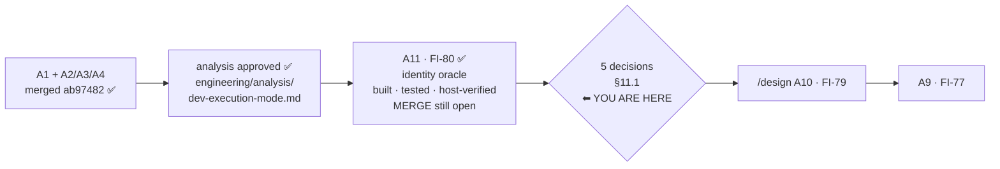

# Handoff — 2026-08-27 (A11 closed, A10's decisions open)

> **Ephemeral.** The previous handoff was deleted before this was written. It links **out** to the
> roadmap, ADRs, analyses and improvements — nothing links back to it.
>
> Written for a session that remembers **nothing** of the one that produced it. Everything below is
> either measured and cited, or named as unmeasured.

## Where we are

**Phase: Implementation+Test (A11) → CLOSED. Next is Design (A10), and it is gated on decisions the
maintainer has not made.** A11 shipped as A10's measuring instrument and owes only its merge. A10 —
the developer execution mode — has an **approved analysis and no design**; `/design` may not begin
until the five questions in [analysis §11.1](engineering/analysis/dev-execution-mode.md) are answered.

Order inside Block A, ratified 2026-08-27: **A1 → A11 → A10 → A9**, then A2 · A3 · A6 · A7.
⚠ **The numbers are identifiers, not the order.**

### State, measured

| Claim | Measured |
|---|---|
| Branch | `feat/devmode/dev-execution-mode`, tree clean, **not merged, not pushed**. ⚠ **No commit count is stated here on purpose** — the commit that states one invalidates it. Measure: `git rev-list --count develop..HEAD` |
| `develop` vs remote | **level** at `ed69492` |
| Merged branches | `git branch --merged develop` → only `develop`, `main`. No worktree to clean (`git worktree list` = one entry) |
| ⭐ The merge is **not** host-only | `git diff --name-only develop..HEAD` touches **no `.cco/`** — the rule that makes a merge host-only keys on the *diff*, not the branch. Mechanically it can be done in-session; it stays a **human gate** by decision, not by mechanics |
| Push from here | **No.** `origin` is SSH (`git@github.com:…`), `credential.helper` unset, `gh auth status` → not logged in. Push is a **host step** |
| A11 suite | **1787 passed / 7 failed / 1794**, the 7 the documented host-only set **name for name**. ⚠ Verify the `Results:` line exists — a run that aborts reads green *and prints no summary* |
| A11 image label | ✅ **Host-verified**: `docker image inspect … '{{index .Config.Labels "cco.build-ref"}}'` → `feat/devmode/dev-execution-mode@e0c93a8`, the branch tip at build time |

⚠ **`feat/claude-view-file-overlays` is rares' branch and stays untouched.**

## Gates still open

| Gate | What unblocks it |
|---|---|
| ▶ **The five [A10](roadmap.md) design decisions** | a human. See *How to resume* — this is the next session's whole first act |
| **Merge this branch** | the human gate. Everything on it is complete and green; nothing is half-done |
| **Push** | never pushed, and **not possible from a session** (measured above). Host step |
| **[FI-83](improvements.md)** direction | trigger now measured; the cheap candidate touches no security surface. Needs one more observation and a call — see *Context* |
| **[FI-84](improvements.md)** | free to relieve locally (move `user-config/`); the design half must be decided **with [FI-16](improvements.md)**, not apart from it |
| **[FI-78](improvements.md)** | the 2 macOS test-portability failures. ⚠ **Host-only measurable**. **Owed before `0.7.0`** |
| **[FI-81](improvements.md)** | fixing the `/analyze` skill needs approval — skills/agents are user-owned config **and** `defaults/global/` is shipped content |
| **[FI-82](improvements.md)** | the `docker run` stdout swallow is **measured, not diagnosed** |
| **[FI-73](improvements.md)** | the SIGPIPE sentinel — a maintainer's call, unchanged |
| 📝 **the `_secret_scan_staged` pipefail contract** | raised by A2's review as `minor`, **still never ruled** |
| **A1's roadmap entry → [roadmap-history.md](roadmap-history.md)** | ~450 lines of a closed unit. ⚠ Its branch was deleted 2026-08-26, so the automatic trigger (*the branch appears among the merged*) **can never fire again**. A maintainer's call now |
| **[FI-74](improvements.md)** · **[FI-76](improvements.md)** | A1's review residue, none blocking |
| **[A2](roadmap.md)** · **[A3](roadmap.md)** · **[A6](roadmap.md)** · **[A7](roadmap.md)** | the rest of Block A. ⭐ A2: start from sub-problem 3 |
| **FI-58 leftovers** | ADR-0058's **D3**, **D7** and **D8-as-amended** are unbuilt. ⚠ D8 touches a **baked** file |
| **[FI-72](improvements.md)** | nothing detects the *next* unclassified `warn` producer |

## How to resume

**First command**: `git branch --show-current` — host and container share one working tree, so the
host can move this session's branch under it.

Then, as ruled by the maintainer when this handoff was commissioned, the session runs in **two acts**.

### Act 1 — recover context, do not re-derive it

Read, in this order, and do **not** restart any of it from scratch:

1. [`engineering/analysis/dev-execution-mode.md`](engineering/analysis/dev-execution-mode.md) —
   the **approved** analysis. §11.0 records what was already ruled; §11.1 the five still open;
   §12.1 the host probes and the three findings they produced unasked.
2. The [A10 and A11 roadmap entries](roadmap.md), and [FI-79](improvements.md) / [FI-80](improvements.md).
3. §*The measurements a design must not argue away* below.

### Act 2 — the decision clinic

Produce, **for each open decision**, in one document the maintainer can answer against:

- the **context** — what the decision is actually about, in one paragraph, grounded in a measurement;
- the **options**, with honest **pros and cons** each — including the option of not doing it;
- a **recommendation**, stated as a recommendation and defended;
- ⭐ the **impact on the product and on the UX** — what a *user* and what a *developer* sees change.
  This is the axis the analysis is thinnest on, and the maintainer asked for it explicitly.

⚠ **The recommendations are owed by that session, not carried from this one.** This handoff records
the *inputs* each decision needs and where the evidence lives; it deliberately does not pre-empt the
judgement, because no design work has been done yet.

**The five that gate `/design`** (verbatim scope in [analysis §11.1](engineering/analysis/dev-execution-mode.md)):

1. **Is the WS-6 "CONFIG stays shared" call reopened?** ⚠ Reopening changes a **pinned** test,
   `tests/test_dev_sandbox.sh:75-86`, and `_cco_config_dir` (`lib/paths.sh:455-460`) is a literal
   `$HOME/.cco` with **no override seam** — so it costs either a new resolver seam or a `$HOME`
   redirect. Accepting the exposure is legitimate *if the split-brain is written down*.
2. **What is the scope of dev identity?** buckets (today) · **+ image tag** · + container/network
   names · + CONFIG. Each addition is a separate namespace **and a separate cleanup obligation**.
3. **Does a tag axis pre-empt `packaging-distribution.md` §4's deferred `:<package.version>`
   tagging?** Someone owns reconciling it with that refinement and with **B1**.
4. **Is the dev surface legal in-container?** Today the analogous flag is **silently swallowed**
   there. Refuse, or ignore-with-notice.
5. **Which lifecycle verbs are in scope now vs deferred?** §8 lists six gaps. ⚠ Shipping an identity
   **without a reaper** adds a new orphan class to a project that already tracks one (ADR-0045), and
   **there is no `cco doctor` verb at all**.

**The others, which do not gate `/design` but are open** — the three A11 residues (below),
[FI-83](improvements.md)'s direction, [FI-84](improvements.md)'s design half, A1's entry archival,
and the `_secret_scan_staged` pipefail contract.

## Tasks

The [roadmap](roadmap.md) is the single source of truth for status; this list points at it.

- [ ] ▶ **Run the decision clinic** for [A10](roadmap.md) — Act 2 above, the five in
      [analysis §11.1](engineering/analysis/dev-execution-mode.md) first
- [ ] **`/design` [A10](roadmap.md)** — only after the five are answered; record the ruling as an ADR
- [ ] **Merge** this branch, then **push** from the host (both open; push impossible from a session)
- [ ] **Decide [FI-83](improvements.md)'s direction** — and capture the one missing observation first
      (below)
- [ ] **Move `user-config/` out of the checkout** — [FI-84](improvements.md), free, host-side
- [ ] **[FI-78](improvements.md)** — the two macOS failures, host-verified only, owed before `0.7.0`
- [ ] **[FI-81](improvements.md)** — propose the `/analyze` + `analyst` fix in `defaults/global/`, and
      decide whether it should ship a duplicate of a pack-owned skill at all
- [ ] **[FI-82](improvements.md)** — diagnose *why* `docker run` stdout is swallowed
- [ ] **Decide**: move A1's ~450-line closed entry into [roadmap-history.md](roadmap-history.md)
- [ ] **Rule the `_secret_scan_staged` pipefail contract** — open since A2's review
- [ ] **[FI-73](improvements.md)** · **[FI-74](improvements.md)** · **[FI-76](improvements.md)**
- [ ] **[A2](roadmap.md)** · **[A3](roadmap.md)** · **[A6](roadmap.md)** · **[A7](roadmap.md)**,
      then **FI-58 leftovers** (D3, D7, D8-as-amended) and **[FI-72](improvements.md)**

## Context

### What A11 shipped, and what it deliberately did not

Both halves, on this branch: the `cco CLI` identity block on `cco whoami`'s **host** branch
(version · provenance · `REPO_ROOT`), and `LABEL cco.build-ref="$CCO_BUILD_REF"` at `Dockerfile:230`.
Living docs and `changelog.yml` (id 68) updated. **9 tests**, written independently from a contract
rather than from the code — 8 in `tests/test_whoami.sh` (a new file: the host branch had **no**
coverage) and 1 in `tests/test_build.sh`.

⭐ **The verification boundary, which does not go away at the next build**: the **suite** pins the
Dockerfile's *declaration* — the `LABEL` exists, interpolates `$CCO_BUILD_REF`, and sits **after**
the `ARG` (one placed before it bakes an empty value silently). That the value **arrives in the built
image** is a claim no hermetic test can make; it took a host `./bin/cco build` + `docker image
inspect`. **Never read the green suite as covering both.**

⚠ **Three residues were left unbuilt on purpose** — user-perceivable and outside the ruled shape, so
each is an undecided question, not an unfinished implementation: `whoami`'s host branch does **not**
read the image label · `cco start` does **not** warn on a CLI↔image divergence · `IMAGE_NAME` is not
surfaced. **A11 makes the handshake computable; it does not compute it.**

### The measurements a design must not argue away

- 🔴 **`--dev-sandbox` isolates the half that does NOT decide which code runs.** It covers
  STATE/DATA/CACHE (ADR-0052 §7). But `IMAGE_NAME` is hardcoded at `bin/cco:37` with **no override**
  (8 consumers + 7 documentation surfaces, including `FROM claude-orchestrator:latest` in the
  custom-image guide ⇒ the tag is a **published user contract**), so both binaries build **one global
  tag** and overwrite each other — sandbox or not. ⭐ **The image tag IS the code identity of the
  in-session cco**: `Dockerfile:201-211` bakes `bin/`+`lib/` into `/opt/cco` and a normal session
  mounts **no host `lib/`**. This, not the buckets, is what coexistence turns on.
- 🔴 **The clone has no name on PATH.** `which -a cco` printed the **same path twice** — one binary
  through a duplicated PATH entry, **not two installs**. So the ruled coexistence is a state **to
  create**, not to disambiguate; the ergonomic problem is *the clone has no name*, not *which one
  wins*; and a design that "detects the other install and warns" has, today, **nothing to detect**.
- 🔴 **The ADR-0052 §1 version gate is DORMANT, not bypassed.** npm `latest` and the clone are both
  `0.6.0`, both `CCO_INDEX_VERSION=2`, both max migration `017`, across **148 commits**. ⇒
  `cco --version` is a **NON-DISCRIMINATING oracle** and any acceptance test built on it is a false
  pass by construction. Do not let a design say *"the gate protects us"*.
- 🔴 `_run_migrations` runs **target-shared / marker-sandboxed** — `lib/update.sh:138` (target
  `~/.cco/.claude`) and `:432` (target **the user's repo**, so the mutation gets committed). Worst
  reachable writer: `cco init --force` → `rm -rf` of the real `~/.cco/.claude` (`lib/cmd-init.sh:198`)
  re-seeded from the **dev** tree.
- ⚠ `package.json`'s `files` lists **`"bin/cco"`, not `"bin/"`**, while `Dockerfile:201` does
  `COPY bin/`. A new `bin/cco-dev` would be **baked into the image but never published**, and
  `scripts/check-pack-hygiene.sh` is a **denylist** that would not catch it.
- ⚠ **The dispatcher option cannot be used until an npm release carrying it ships** — the installed
  `0.6.0` cannot dispatch. Ruled consequence of "both CLIs stay".
- ⚠ **Naming-namespace collision**: A10's tag axis, **B1** (`cco build` inside `cco update`) and
  **B2** (`cco attach` container naming) all touch one namespace. **Sequence it, do not discover it
  late.**
- ⚠ `cco --dev-sandbox <verb>` **inside a session is silently consumed and ignored**, and nothing
  ever reaps a created sandbox.

### Two findings this session produced, and where each stands

- **[FI-83](improvements.md) — an interactive trust prompt stalls a delegated run.** 🔴 **Trigger
  measured**: a teammate is a **separate `claude` process** (tmux pane, own pid) whose `cwd` is the
  repo, while the lead's is `/workspace` — and **workspace trust is directory-scoped**, so the lead's
  acceptance grants nothing there. 🔴 **`--dangerously-skip-permissions` does not cover it** —
  measured, the session was already running with the flag. ⇒ The cheapest candidate fix is **start
  teammate panes in the lead's cwd**, which touches **no security surface at all**. ⚠ **Still not
  observed: the directory the dialog actually named** — capture it, it costs one spawned teammate.
  ⚠ The pre-accept option's security argument stands for whatever that does not cover: trust also
  gates **execution** of shell-carrying settings the *repo* supplies, which `:ro` stops the agent
  editing and does nothing to stop Claude Code executing.
- **[FI-84](improvements.md) — the fresh-HOME legacy-vault toll.** `_cco_first_run` archives the
  legacy vault for **every verb except `help`** (`lib/migrate.sh:329-331`), read-only ones included.
  With this checkout's git-versioned 454MB `user-config/`, every test that gives cco a fresh `$HOME`
  pays ~13s and a throwaway tarball. **Idempotent per STATE root ⇒ not a shipped defect.** Relieving
  it locally is free; the design half belongs with **FI-16**.

### Traps this repo has paid for, that still bind

- 🔴 **Inside a session, `docker run` returns rc 0 with EMPTY stdout; only the exit code crosses.**
  Any in-session check that captures `docker run` output is a false pass in the most convincing shape
  there is. **`docker image inspect` DOES work** — that is the channel, and the reason A11 carries a
  label ([FI-82](improvements.md)).
- 🔴 **`docker run <image> <cmd>` does NOT replace an ENTRYPOINT** (`Dockerfile:233`). The wrong form
  installs Claude Code and prints "Please run /login" — long, plausible output that reads like a
  working probe. Use `--entrypoint`.
- 🔴 **A missing `Results:` line is the signal.** An aborted suite reads green and prints no summary.
- 🔴 **A guard that is unreachable is a guard nobody measured.** A11's tester proved the
  `REPO_ROOT`-unset fallback unreachable rather than manufacturing a harness for it, and recorded the
  four pieces of evidence plus the condition that would reopen it. Do the same, do not pin an
  artificial case.
- 🔴 **`/analyze` forks to a read-only agent and cannot write its own artifact** — two `/analyze`
  skills register at once and `defaults/global/`'s wins over the pack's. **Until it is fixed, the
  lead must write the analysis file.** ([FI-81](improvements.md))
- ⚠ **git in this container needs `safe.directory`**, and `~/.gitconfig` is a read-only bind mount:
  `GIT_CONFIG_COUNT=1 GIT_CONFIG_KEY_0=safe.directory GIT_CONFIG_VALUE_0=/workspace/claude-orchestrator git …`
- ⚠ **Concurrent agents share one index.** Commit with the **pathspec form**
  (`git commit <paths> -m …`), never `git add` + bare `git commit`, or one agent's staged work lands
  in another's commit.
- ⚠ **The host can change this session's branch under it** — one working tree, two writers.

### Still unmeasured — say so, do not assume

- **The `unknown` half of the `/opt/cco/BUILD` oracle is ASSERTED, not measured.** Only `branch@sha`
  has ever been executed; no npm-provenance build has been made. The same now applies to the
  `cco.build-ref` label.
- **Which directory FI-83's trust dialog named.**
- **Why `docker run` stdout is swallowed** — measured, never diagnosed.
- **The bash 3.2 lint** was not verified in the session that first recorded it (proxy container limit).

## Reference documents

- [roadmap.md](roadmap.md) — the SSOT; entries **A11** (closed but unmerged) and **A10** (next)
- [improvements.md](improvements.md) — [FI-79](improvements.md) · [FI-80](improvements.md) ·
  [FI-81](improvements.md) · [FI-82](improvements.md) · **[FI-83](improvements.md)** (new) ·
  **[FI-84](improvements.md)** (new) · [FI-16](improvements.md) (coupled to FI-84)
- [engineering/analysis/dev-execution-mode.md](engineering/analysis/dev-execution-mode.md) — the
  approved analysis: §11.0 ruled, §11.1 open, §12.1 the host probes
- [roadmap-history.md](roadmap-history.md) — where A1's closed entry goes, if the maintainer says so
- `docs/users/reference/cli.md` §3.1 and §3.5c — the living docs A11 changed
