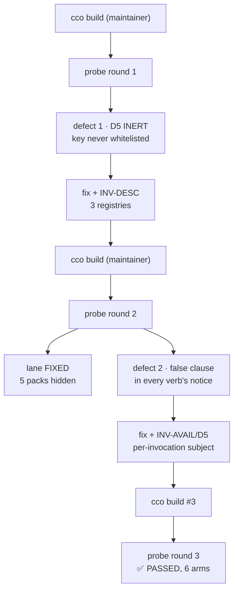

# Handoff — every probe this cycle owed is now run: S4 green at round 3, S3 green on both arms

> **Ephemeral.** Delete this file before writing the next handoff. It links out only.
> Written 2026-07-30, updated the same day after S3's probe. Supersedes the "implementation block
> complete" handoff of 2026-07-29.

## The one lesson of this session

**"Host-only" was a classification error, and it cost a gate its whole round.** S3's probe sat in the
owed list as host-only because its `mv` is host-side. But §5.1 asks for the `mv` from the host **and the
observations from inside a live session** — so it was never host-only, it was **split**, and filing it
under the wrong label is what left both sides waiting for the other. The moment it was read correctly,
the maintainer ran two `mv`s and the session ran five verbs.

Every remaining gate now lives in one **operational runbook** —
**[`08-gates-to-release.md`](configuration/agent-cco-access/e2e-review/fix-design-v3.1/08-gates-to-release.md)**,
G0…G6, each command with its trap attached, all the way to the published release. Before, a gate's command
had to be reassembled from three documents — which is exactly where the copy-paste false pass comes from
(S3's own trap: the pre-S1 `state/cco/index` spelling moves nothing). The plan's §8 is now a pointer;
`00-plan.md` stays the design + evidence document, and §7 stays where probe output goes.

## What changed since the last handoff

The last handoff said the remaining work was **all host-only**. That was right about the gate and wrong
about the reach — **twice over**: the maintainer ran `cco build` and S4's probe became runnable (below),
and then S3's turned out to be split rather than host-only, so **its severed arm is now green too**.

**S4's `CCO_STORE_TOTALS` probe failed twice, for two different reasons, and passed on the third round.**
Two fixes landed in-session between the rounds; each `cco build` is what made the next failure visible,
and the suite was green throughout — which is the whole argument for Rule 1.

### Defect 1 — D5 was inert: the signal never crossed the boundary

`lib/cmd-start.sh:1837` writes `CCO_STORE_TOTALS` into the trusted descriptor under a comment reading
*"Keys mirror the helper's whitelist"*. It did not: `config/cco-svc-helper.c`'s `ALLOWED_KEYS[]` never
listed it, and the helper rebuilds the elevated child's environment from scratch — so the key was
dropped **in silence** and the supplement returned at its own guard on every real invocation. Net
effect: **R-B shipped unfixed**, `cco list packs` showing 1 of 6 packs with no notice at all.

The signal had **three** registries, not one, and S4 had updated one of them: the helper whitelist,
`bin/test`'s ambient-env `unset` list (a real value leaked into the suite and failed three notice tests
in-container only — that is why an in-session run showed **10** failures where 7 are documented), and
`tests/helpers.sh`'s `_lane_operator_exports` (latent, and against its own comment (c)). All three are
now one lint, **INV-DESC**, each arm proved against the real pre-fix file.

### Defect 2 — found by round 2: the notice claimed kinds the verb never listed

Once live, `_env_apply_store_supplement` turned out to loop over **every** store kind on **every** flush:
`cco list llms` announced *"6 packs hidden"* while showing all the llms; `cco list packs` announced
*"2 llms hidden"* about the two it was showing; `cco path list` and `cco project show` made store claims
with no store rows on screen. The same session answered **6 or 5** to the same question depending on the
verb, because the count is total-minus-enumerated and a verb listing llms enumerates no packs.

Ratified fix: a notice is **per-invocation** — a verb declares what it enumerates exhaustively
(`_env_store_subject`), only declared kinds are supplemented, and **no declaration means no supplement**
so an omission is silence rather than a fabricated count. Guarded by **INV-AVAIL/D5**, which names
exactly the four enumerators on the pre-fix tree.

## Suite

**1614 passed / 7 failed of 1621**, measured **with `access: {claude: all}` ON** (the uncommitted block
in `.cco/project.yml`). The arithmetic closes with no slack: **1608/7 of 1615** at the last handoff, plus
the **6** tests added here (2 INV-DESC + 1 INV-AVAIL/D5 + 3 for the scoping rule).

The 7 are the documented host-only set, **name for name**: the six `test_as_*`
(`list_compact_scoped_at_read_project`, `list_compact_global_hides_other_projects`,
`list_compact_full_at_read_all`, `list_pack_degrades_at_read_project`,
`list_llms_scoped_at_read_project`, `llms_show_used_by_hides_out_of_scope_referrers`) plus
`test_paths_symlink_safe_tool_root`. They fail in-container because the setuid helper pins the store
buckets to the privileged root, so a test's redirected buckets are replaced by the real ones — visible in
the failure output, which lists this session's real resources instead of the fixtures. **Do not chase
them**; two hypotheses are already refuted in the `suite-7-host-only` memory note.

⚠ **The 10-vs-7 episode is the lesson.** Three of those "extra" failures were `bin/test` leaking a real
session value into the suite. A count is not a fingerprint; the names are.

## ⛔ What is owed, in order

**The commands live in one file: [`08-gates-to-release.md`](configuration/agent-cco-access/e2e-review/fix-design-v3.1/08-gates-to-release.md).**
This list says *what* and *why*; the runbook says *how*, once, G0…G6.

**Every probe this cycle owed is now run.** L1, L2 and L3 all have their Rule-1 evidence; L4 and L5
closed in-session by ruling. What is left is **one never-executed gate (E6B-04), one small residual
(D7), the human gate, and the release path** — no probe is outstanding on a landed lane.

0. ✅ **`git push`** — done 2026-07-30; both refs track origin with no *ahead* marker.
1. **G1 — S6's host half + D7** (§10.9e / **E6B-04**, pack-rename fan-out, **never executed in any
   round**). The only remaining item that can still produce a blocking 🔴: data-loss if the fan-out
   half-applies, and a fix for an unreproduced defect is unverified. **Placed before the merge** — the
   cycle branch modifies `cmd_pack_rename` itself, so a 🔴 belongs on this branch, not after the merge.
   ⚠ Clear the stale `scratch-pack` and `scratch-a`/`scratch-b` first or the fan-out is ambiguous to read.
   💡 `scratch-a` references no pack between `cco init` and the `packs:` edit — **D7 rides that window**,
   one setup for two gates.
2. **G2 — the CLI-surface documentation audit** (roadmap step 3). **Sequential after G1**, by the
   maintainer's decision, so the audit is written knowing G1's outcome. The only owed item a session can
   perform end to end.
3. **G3 — the block's single human gate.** The maintainer relaxed the per-phase gates for S3→S4→S5 down to
   one gate at the end. This is it; the runbook carries its checklist.
4. **G4/G5/G6 — merge → verify on `develop` → release.** The merge is a **content fast-forward** (both
   `develop` and `main` contribute a tree identical to their merge-base), so the tree verified on the
   branch *is* the released tree — but that only holds if the merge itself was performed cleanly, so it is
   checked by tree hash, and **G5 re-verifies on `develop`** what topology cannot promise: the unmasked
   suite, the **macOS host suite** (never run on this tree — the largest unknown left), and a `cco build`
   from `develop` plus a smoke dogfood.

### Closed on 2026-07-30, after this handoff was first written

- ✅ **S4's probe, round 3 (third `cco build`) — PASSED on all six arms.** `list packs` counts 5 packs
  and says nothing about llms · `list llms` emits no notice at all · `list` speaks for every kind
  (9 projects, 5 packs, 1 template) · `path list` reports paths only · `pack validate --all` is
  pack-only · `project show` is silent on the store. Every number matches the behaviour ratified before
  the fix was written, so this confirms rather than re-specifies. Provenance `@d01d42a`, and this time
  the artefact agreed with the line. **L1's Rule-1 evidence is complete**; the lane awaits only the
  block's single human gate. Full output in the runbook's §7, round 3.
- ✅ **The stray OAuth line is out of `.cco/project.yml`** — 0 occurrences; the file's residual diff is
  exactly the intended `access:` block, the `8081→8082` port change and the `packs:` entry.
- ✅ **S3's probe — PASSED on BOTH arms**, run as the split gate (host `mv`, in-session observations), so
  **L2's Rule-1 evidence is now complete too**. Severed: all five read verbs (`path list`, `list`,
  `list projects`, `project show`, `project validate --all`) refuse at **rc=1** with the session-axis
  cause — *"this session was LAUNCHED from the index … this is NOT an empty index"* — and §10.9d's benign
  rc=0 sentence is unreachable; it is still on `develop` at `lib/index.sh:189` to compare against.
  `cco whoami` correctly stays **rc=0**: it renders the session descriptor, which crossed the boundary at
  start-up and needs no index read. Restored: all five back at **rc=0** with their fully scoped notices
  and the same counts as S4's round 3, so the entry guard is proven in **both** directions — a guard only
  ever tested on the failing side is how a lane ships fail-closed *and* unusable. Full output in §7.
- 📝 **One observation logged for the audit, deliberately not fixed** (runbook §7, S3's entry): the
  refusal names the internal `/var/lib/cco-internal/state/cco/shared/index` — accurate, it is the agent's
  side of the bind — while its remedy is host-side and this session has `show_host_paths: true`, so the
  reader cannot act on the path they were handed. User-facing wording is a human gate, not a sweep.
- ✅ **A stale roadmap header corrected**: the index-integrity cluster (ADR-0052) read *"S1+S2+S3 landed;
  S4 next"* while S4 landed at `50ba8f7` and `feat/index/integrity-hardening` is an ancestor of `develop`
  (plan rows WS-6/WS-7/N3 all ✅, changelog #48). Status was reported from that file, so it had to be true.

## Non-obvious things worth not rediscovering

- **Never edit `bin/test`, `tests/helpers.sh` or `lib/` while a suite run is in flight.** The runner is
  the script bash is executing; shifting byte offsets under a running shell invalidates the run. This
  cost one full run today — the previous handoff warned about `lib/` only, and the warning is wider.
- **A dirty tree makes `cco build` provenance misleading, not wrong.** `/opt/cco/BUILD` records a git
  *ref*; a docker build takes the working *tree*. Round 2's line read `@e27ad6e` while the binary already
  carried an uncommitted fix. Round 3, with everything committed, agreed with the artefact. **Check the
  artefact whenever the tree is dirty**: `strings /usr/local/bin/cco-svc-helper | grep CCO_STORE_TOTALS`,
  `diff -rq /opt/cco/lib lib`.
- **When a fix adds a member to an existing family, ask how many registries name that family.** Both of
  defect 1's instances were the same omission in different files; cycle-1.1's S9 lesson (a named list is
  a lower bound) applies to registries, not just call sites.
- **A test that asserts silence needs its cause pinned.** Two of the five pre-existing D5 tests would
  have started passing **vacuously** under the new default, asserting an emptiness that now has a second
  possible cause. They declare a subject explicitly for that reason.
- **The setuid helper refuses to run without its setuid bit** (fail-closed, by design), so a
  recompiled-in-place copy cannot be used to observe the boundary. End-to-end boundary verification
  always costs a `cco build`.
- The working tree still carries three untracked paths that are not this cycle's (`tmp`,
  `to-verify-guides-docs.md`, `.claude/worktrees/`). **Leave them alone unless asked.**
- Two merged worktrees remain at `.claude/worktrees/s4-inv-avail` and `.claude/worktrees/s5-inv-yaml`.
- `tests/test_start_dry_run.sh:1740` and `:1762` contain literal conflict markers as **fixture
  content** — a repo-wide grep for merge markers flags them as false positives.

## Reference documents

- [Roadmap](roadmap.md) — §B2-next, lane **L1** carries both defects and what they owe · [backlog](roadmap-backlog.md)
- [Cycle-1.2 runbook](configuration/agent-cco-access/e2e-review/fix-design-v3.1/00-plan.md) — §1 the two
  governing rules · **§7 acceptance log, both probe rounds** · §8 host-only gates
- [ADR-0056](configuration/agent-cco-access/decisions/0056-availability-model-and-index-session-axis.md)
  — the model + the ratified annotations (the two D5 entries of 2026-07-30 are the newest)
- [ADR-0055](environment/decisions/0055-claude-runtime-state-and-mountpoint-ancestry.md) — S1
- [`engineering/analysis/invariant-gap-audit.md`](engineering/analysis/invariant-gap-audit.md)
