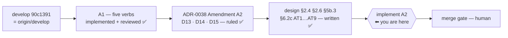

# Handoff — 2026-08-22

> **Ephemeral.** At most one of these exists per line of work; the previous was deleted before this
> was written. It links **out** to the roadmap, ADRs and designs — nothing links back to it.

## Methodology / where we are

**Phase: DESIGN COMPLETE for [ADR-0038 Amendment A2](configuration/decentralized-config/decisions/0038-project-config-versioning.md#amendments).
The next step is IMPLEMENTATION of D13/D14/D15 on the same branch, then the merge gate.**

A1 is implemented **and reviewed** — `/review-implementation` returned *fixed-in-place*. It did not
end the unit: it produced three decisions the maintainer then ruled, recorded as **Amendment A2**.
The branch continues rather than merging, deliberately and for the same reason Amendment A1 was
absorbed mid-flight — **one review covers the whole unit**.



Everything below was **measured on this branch**, not carried over:

| Claim | Measured |
|---|---|
| Suite | **`Results: 1749 passed, 7 failed, 1756 total`** — the 7 are the [known host-only set](roadmap.md) |
| Branch | `feat/config/save-and-history`, **14 ahead of `develop`**, clean tree, **not merged** |
| `develop` vs `origin/develop` | **0** — that gate is closed |
| A2's state | **designed, NOT built** — nothing in `lib/` implements D13/D14/D15 yet |

## Gates still open

| Gate | What unblocks it |
|---|---|
| **Implement A2** | the next session's work — this is the intended entry point |
| **Merge into `develop`** | the human review point, after A2 is built and green. ⚠ Does the diff touch `.cco/`? **No** — so [FI-20](improvements.md)'s host-only merge rule does not apply. Measure before assuming |
| **macOS host suite (bash 3.2)** | still owed before `0.7.0`. Nothing has run the full suite on 3.2 since `v0.6.0` |
| **[A9](roadmap.md)** ([FI-77](improvements.md)) | ▶ **scheduled: the next unit after A1 closes.** The `.claude` authoring axis is invisible to the agent it governs. Needs a short design first |
| **[FI-73](improvements.md)** | the SIGPIPE sentinel — still a maintainer's call, unchanged |

⚠ **`feat/claude-view-file-overlays` is rares' branch and is deliberately untouched** — local and
remote identical at `43c2c33`. Not merged, not deleted, not part of any cleanup.

## How to resume

Implement Amendment A2. The contract is
**[ADR-0038 D13…D15](configuration/decentralized-config/decisions/0038-project-config-versioning.md#amendments)**
and **[the design](configuration/decentralized-config/design/design-project-config-versioning.md)**
§2.4 (the predicate), §2.6 (the level), §5b.3 (both refusal paths), **§6.2c (AT1…AT9, the test plan)**.
All three decisions are ruled — do not re-derive them.

▶ **And when A1 closes (A2 built, reviewed, merged), the next unit is [A9](roadmap.md)** — scheduled
by the maintainer on 2026-08-22. Do not pick the next item off the block by number.

The three code sites, all measured:

```
lib/cmd-project-save.sh:106   git check-ignore -q ".cco/$probe"     ← D13: add --no-index
lib/cmd-project-save.sh       _project_gitignore_gaps               ← D15: the vacuous-pass arm
lib/config-read.sh            the status renderers                  ← D14: preview the scan too
```

**Measure before repeating any position stated here**, including these:

```
bash bin/test 2>&1 | tail -5          # the Results: line is the ONLY authoritative count
git rev-list --count develop..HEAD
git branch --show-current             # the HOST can change it under this session
```

## Tasks

The [roadmap](roadmap.md) is the single source of truth for status; this list points at it.

- [ ] **Implement A2 D13** — [A1](roadmap.md): `--no-index` on the probe, the tracked-file `note`
      (level `note`, **never** `warn`), AT1–AT3
- [ ] **Implement A2 D15** — the vacuous-coverage refusal, discriminated by a **non-secret** path;
      AT4–AT5
- [ ] **Implement A2 D14** — `status` previews the scan as well, rc 0, **without staging**; AT6–AT7
- [ ] **AT8** — ⚠ owed regardless of the rest: pin the compensating control §7 already leans on
      (a `.netrc` under `.cco/` is refused by the scan). Nothing tests it today
- [ ] **AT9** — assert no `warn` is emitted by any of the above
- [ ] **User-facing docs for A2** — `docs/users/reference/cli.md` and
      `configuration-management.md` were **deliberately NOT touched** this session: A2 is not built,
      and `rules/documentation-lifecycle.md` forbids documenting behaviour the code does not expose.
      Update them at the phase that makes them true
- [ ] **Merge to `develop`** after A2 is green (human gate), then delete the branch per
      `rules/git-practices.md`
- [ ] ▶ **[A9](roadmap.md)** ([FI-77](improvements.md)) — **THE NEXT UNIT after A1 closes**, by the
      maintainer's decision of 2026-08-22. Give the `.claude` authoring axis a managed rule + a
      session-context surface, mirroring the cco axis. **Short design first** — three questions are
      open in the roadmap entry. ⚠ It is an **omission, not staleness**: no shipped rule says anything
      false, so this adds a section rather than correcting text. ⚠ Both targets are **baked**, so the
      unit takes a `cco build` — and the managed-rule half cannot be verified in-session without it
- [ ] **[FI-73](improvements.md)** — decide the SIGPIPE sentinel fix
- [ ] **[FI-74](improvements.md)…[FI-76](improvements.md)** — the review's residue, none blocking
- [ ] **macOS host suite (bash 3.2)** — owed before the `0.7.0` release
- [ ] **[A2](roadmap.md)** (the roadmap item, not the amendment) — per-project custom Docker image
      ([FI-49](improvements.md)). ⭐ Sub-problem 3 first: the `setup.sh` docs contradict themselves
- [ ] **[A3](roadmap.md)** — cross-scope collision warning ([FI-32](improvements.md)) + three open decisions
- [ ] **[A6](roadmap.md)** — `.claude/worktrees` in the functional-write floor ([FI-56](improvements.md))
- [ ] **[A7](roadmap.md)** — the A4 review residue ([FI-62](improvements.md) … [FI-66](improvements.md))
- [ ] **FI-58 leftovers** — ADR-0058's **D3**, **D7** and **D8-as-amended** are unbuilt. ⚠ D8 touches a
      **baked** file, so that unit also takes a `cco build`
- [ ] **[FI-72](improvements.md)** — nothing detects the *next* unclassified `warn` producer

## Context

### Decided this session, and not to be reopened

**[ADR-0038 Amendment A2](configuration/decentralized-config/decisions/0038-project-config-versioning.md#amendments)**
— D13, D14, D15, all ruled by the maintainer. Read the ADR, not this line. What it corrects is **not**
a build defect: the implementation was faithful to D7 as written, and D7's *measurement* was wrong.

⚠ **D7 itself is amended in place**, with a dated block that leaves the original readable. A reader
who reaches D7 without reading A2 will implement the defect again.

The two points a reader is most likely to challenge:

- **D13 lets a save proceed over a tracked secret.** It is not a loosening. The save is not the event
  that exposes it — the file is already in history — and the floor holds where it *can* act:
  `_secret_scan_staged` reads `git diff --cached`, so tracked **and modified** stages and refuses.
  Refusing forever would punish a past act, block config versioning entirely, and un-expose nothing.
- **The level is `note`, and a confirmation prompt was rejected.** Design §2.6 forbids `warn` here
  because a `warn` gates a launch; and the pause a prompt would reach, `_cco_warn_gate`, has **exactly
  two call sites asserted by name** in `test_warn_gate_is_reached_only_through_the_two_launch_paths`.
  A third is an ADR-0059 amendment, not a code change.

### Open questions needing a human

- ✅ **[FI-77](improvements.md) is no longer an open question — it is scheduled as [A9](roadmap.md)**,
  the next unit after A1. Kept here for the measurements a designer needs: the derived default gives trees
  `Cr=Cp=Cg=Co=ro` with entries `claude_md=ask`, `rules`/`agents`/`skills`=`ro`; **no** managed rule
  mentions Axis B; and `lib/session-context.sh` is never passed `claude_access` at all. So **`ask`
  covers `CLAUDE.md` alone** — the other three are `ro`, a **mount** property, i.e. a restart and not
  a prompt. Meanwhile `memory-policy.md` and `documentation.md` already instruct the agent to
  *propose* rule changes: the instruction ships without the context that makes it actionable.
- 📝 **[FI-73](improvements.md)** — the SIGPIPE sentinel. Unchanged from the previous handoff. ⚠ Whoever
  takes it must verify the sentinel STILL fires on a real `set -u` violation.
- 📝 **An unrecognised answer at the `cco start` pause starts the session** (only `a`/`A` aborts).
  ADR-0059 D10 decided bare Enter and `[S/a]`; it did not decide what a stray `n` does. Not blocking.
- 📝 **[Open decision #7](roadmap.md)** — should `cco clean` sweep `$TMPDIR/cco-warn.*`?

### 🔑 Non-obvious things the next session would otherwise rediscover

- 🔴 **`git check-ignore` IS INDEX-AWARE.** A **tracked** file reports *not ignored* even when a
  matching rule exists — git consults the index before the ignore chain. Measured three ways in one
  repo (untracked → ignored; tracked → not ignored; tracked `--no-index` → ignored). This is the whole
  of D13, and it is invisible to anyone reading only the `.gitignore`.
- 🔴 **A `.gitignore` at the REPO ROOT that ignores `.cco/` makes the D7 barrier pass vacuously.** All
  four probes report *ignored*, `git add -- .cco` stages **0 files**, and the verb reports *nothing to
  save* while `status` reports *clean*. The config is never saved and **both verbs affirm success** —
  measured. The discriminator is a **non-secret** path.
- 🔴 **COMMITTING A READ-ONLY `.cco/` SUCCEEDS.** `git add -- .cco/` returns **0** on a `.cco` bound
  `ro`: git reads the **worktree** and writes to **`.git/`**, which is `rw`. **So D8's gate is
  policy**, and `test_operator_project_save_needs_edit_project` is the ONLY thing guarding it. A
  reviewer reasoning from the mount table concludes the opposite.
- ⭐ **THE PATHSPEC IS ON THE COMMIT, NOT ONLY THE STAGING.** A file the user had **already staged** is
  in the index and a bare `git commit` sweeps it into the config commit. Same reason the refusal's
  reset is `git reset -q -- .cco`.
- ⚠ **§7's narrow `.gitignore` floor rests on a control nothing tested.** INV-GIF guards only
  scaffold ⊇ floor — the direction that would kill the verb, not the one that would leak. **AT8.**
- ⚠ **`config status`'s allowlist pathspec looks redundant and is not**, and a test on a **saved**
  store cannot see it (measured: the mutation passed). `test_config_status_on_a_never_saved_store`
  discriminates.
- ⚠ **A failed `cd` in an `&&` chain skips the edit, and the SEPARATE command that follows commits
  anyway** — producing a commit whose message announces a change that is not in it. It happened this
  session (the tool's cwd persists between calls, so a relative `cd` that already succeeded once
  fails the second time). Use absolute paths, and verify **content** (`git show --stat`, a `grep` on
  the asserted fact), not just that the commit succeeded. Same family as the `git add` trap below.
- ⚠ **`git add a b c` with ONE bad pathspec stages NOTHING** — and the following `git commit` still
  succeeds if something was already staged. **Read `git diff --cached --name-status` before
  committing.**
- ⚠ **A suite log's `[PASS]`/`[FAIL]` lines carry ANSI colour codes.** The **`Results:` line is the
  only authoritative count**, and its *absence* is itself a signal.
- ⚠ **THE HOST CAN CHANGE THIS SESSION'S BRANCH UNDER IT** — host and container share one working
  tree. Run `git branch --show-current` before any write.
- ⚠ **git in this container needs `safe.directory`** and `~/.gitconfig` is a read-only bind mount:
  `GIT_CONFIG_COUNT=1 GIT_CONFIG_KEY_0=safe.directory GIT_CONFIG_VALUE_0=/workspace/claude-orchestrator git …`
- ⚠ **`git add -- .cco` exits 1 when everything under `.cco/` is ignored**, with an advice block. Not
  an error — the call is `|| true` and emptiness is decided by `git diff --cached --quiet -- .cco`.
- ⚠ **The docker proxy caps containers at 10 and does NOT return container stdout.** A bash-3.2 probe
  can assert an **exit code** only — write it as an assertion, discriminating by construction.
- 📝 **The FI-25 mask (`access: {claude: all}` in `.cco/project.yml`) is ON**, deliberately. This
  session therefore **cannot** measure the Axis-B default from itself — call `_claude_derive_triple`
  directly, or pin `--claude-access`.

## Reference documents

- [roadmap.md](roadmap.md) — the living SSOT; A1's entry carries the review verdict and A2's scope
- [improvements.md](improvements.md) — the `FI-*` tracker; **FI-74…FI-77 are new**
- [ADR-0038](configuration/decentralized-config/decisions/0038-project-config-versioning.md) —
  D1…D8 + **Amendment A1 (D9…D12)** + **Amendment A2 (D13…D15)**, the contract to build to
- [design-project-config-versioning.md](configuration/decentralized-config/design/design-project-config-versioning.md)
  — §2.4 the predicate, §2.6 the level, §5b.3 both refusal paths, **§6.2c the A2 test plan**, §6.4
  what the suite cannot reach, §7 the settled choices
- [ADR-0059](cli/decisions/0059-message-classification-and-the-start-warning-gate.md) — the message
  taxonomy, and the reason the pause is not reachable from a verb
- [ADR-0008](configuration/decentralized-config/decisions/0008-personal-store-management.md) — the twin
  `cco config save`; its *non-blocking* principle bounds what A1 may become
