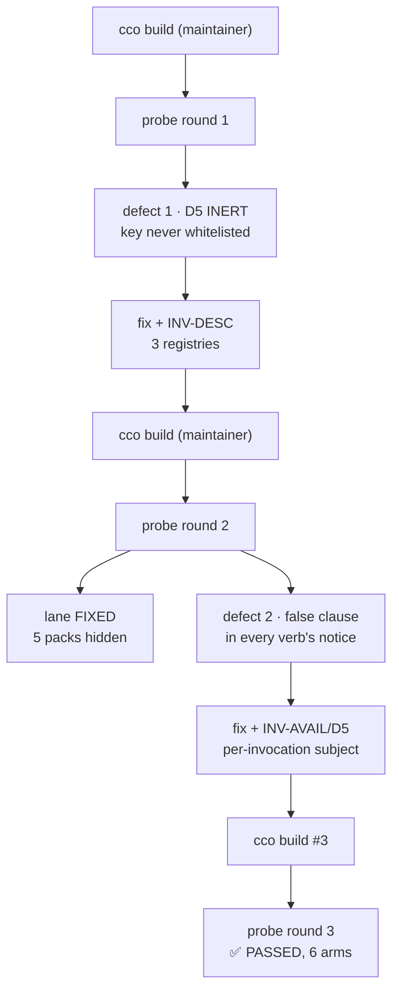

# Handoff — S4's lane is closed after three probe rounds; the rest of the gate is host-only

> **Ephemeral.** Delete this file before writing the next handoff. It links out only.
> Written 2026-07-30. Supersedes the "implementation block complete" handoff of 2026-07-29.

## What changed since the last handoff

The last handoff said the remaining work was **all host-only**. That was right about the gate and wrong
about the reach: the maintainer ran `cco build`, and from inside the rebuilt session **one of the owed
probes became runnable** — S4's. It is now **done and green**, and it is where the news is.

**S4's `CCO_STORE_TOTALS` probe failed twice, for two different reasons, and passed on the third round.**
Two fixes landed in-session between the rounds; each `cco build` is what made the next failure visible,
and the suite was green throughout — which is the whole argument for Rule 1.

### Defect 1 — D5 was inert: the signal never crossed the boundary

`lib/cmd-start.sh:1837` writes `CCO_STORE_TOTALS` into the trusted descriptor under a comment reading
*"Keys mirror the helper's whitelist"*. It did not: `config/cco-svc-helper.c`'s `ALLOWED_KEYS[]` never
listed it, and the helper rebuilds the elevated child's environment from scratch — so the key was
dropped **in silence** and the supplement returned at its own guard on every real invocation. Net
effect: **R-B shipped unfixed**, `cco list packs` showing 1 of 6 packs with no notice at all.

The signal had **three** registries, not one, and S4 had updated one of them: the helper whitelist,
`bin/test`'s ambient-env `unset` list (a real value leaked into the suite and failed three notice tests
in-container only — that is why an in-session run showed **10** failures where 7 are documented), and
`tests/helpers.sh`'s `_lane_operator_exports` (latent, and against its own comment (c)). All three are
now one lint, **INV-DESC**, each arm proved against the real pre-fix file.

### Defect 2 — found by round 2: the notice claimed kinds the verb never listed

Once live, `_env_apply_store_supplement` turned out to loop over **every** store kind on **every** flush:
`cco list llms` announced *"6 packs hidden"* while showing all the llms; `cco list packs` announced
*"2 llms hidden"* about the two it was showing; `cco path list` and `cco project show` made store claims
with no store rows on screen. The same session answered **6 or 5** to the same question depending on the
verb, because the count is total-minus-enumerated and a verb listing llms enumerates no packs.

Ratified fix: a notice is **per-invocation** — a verb declares what it enumerates exhaustively
(`_env_store_subject`), only declared kinds are supplemented, and **no declaration means no supplement**
so an omission is silence rather than a fabricated count. Guarded by **INV-AVAIL/D5**, which names
exactly the four enumerators on the pre-fix tree.

## Suite

**1614 passed / 7 failed of 1621**, measured **with `access: {claude: all}` ON** (the uncommitted block
in `.cco/project.yml`). The arithmetic closes with no slack: **1608/7 of 1615** at the last handoff, plus
the **6** tests added here (2 INV-DESC + 1 INV-AVAIL/D5 + 3 for the scoping rule).

The 7 are the documented host-only set, **name for name**: the six `test_as_*`
(`list_compact_scoped_at_read_project`, `list_compact_global_hides_other_projects`,
`list_compact_full_at_read_all`, `list_pack_degrades_at_read_project`,
`list_llms_scoped_at_read_project`, `llms_show_used_by_hides_out_of_scope_referrers`) plus
`test_paths_symlink_safe_tool_root`. They fail in-container because the setuid helper pins the store
buckets to the privileged root, so a test's redirected buckets are replaced by the real ones — visible in
the failure output, which lists this session's real resources instead of the fixtures. **Do not chase
them**; two hypotheses are already refuted in the `suite-7-host-only` memory note.

⚠ **The 10-vs-7 episode is the lesson.** Three of those "extra" failures were `bin/test` leaking a real
session value into the suite. A count is not a fingerprint; the names are.

## ⛔ What is owed, in order

**Every command for these gates is now written out, copy-pasteable, in the runbook's [§8](configuration/agent-cco-access/e2e-review/fix-design-v3.1/00-plan.md).**
This list says *what* and *why*; §8 says *how*, once.

1. **`git push`** — `git push origin develop fix/release/cycle-1.2` (§8.1). Nothing is pushed;
   `develop` is 22 commits ahead of `origin/develop`, plus this branch's commits on top. **This is now
   the top of the list** — S4's lane is closed (see below) and nothing else in-session is blocking it.
2. **S3's container probe** (§8.3) — the one probe still fully owed, and the only **split** gate: the
   `mv` is host-side, the observations belong **inside a live session**, so a session can run its half
   the moment the maintainer moves the index aside.
   ⚠ The path is `state/cco/`*`shared/`*`index` — the pre-S1 `state/cco/index` no longer exists and a
   copy-paste of the older command moves nothing, producing a **false pass**. Partial in-session
   evidence exists (`cco project validate --all` now reports the hidden-project count instead of
   claiming share-ready over zero projects), but the severed-index arm needs the host.
3. **S6's host-only half** (§8.4) — §10.9e / E6B-04 (pack-rename fan-out, never executed in any round)
   and the stale-remote cleanup.
   ⚠ Clear the stale `scratch-pack` and `scratch-a`/`scratch-b` first or the fan-out is ambiguous to read.
4. **D7 residual from S1** (§8.5) — *"composes with no packs at all"*: needs a project referencing no pack.
5. Then, per §8.6: the **CLI-surface documentation audit** (roadmap step 3) — ordered deliberately
   **before** the merge — then the merge into `develop`, then `develop → main`.
   📝 The audit is the **only owed item a session can perform end to end**; it needs no probe and no
   build, so it can run in parallel with the host gates above.

### Closed on 2026-07-30, after this handoff was first written

- ✅ **S4's probe, round 3 (third `cco build`) — PASSED on all six arms.** `list packs` counts 5 packs
  and says nothing about llms · `list llms` emits no notice at all · `list` speaks for every kind
  (9 projects, 5 packs, 1 template) · `path list` reports paths only · `pack validate --all` is
  pack-only · `project show` is silent on the store. Every number matches the behaviour ratified before
  the fix was written, so this confirms rather than re-specifies. Provenance `@d01d42a`, and this time
  the artefact agreed with the line. **L1's Rule-1 evidence is complete**; the lane awaits only the
  block's single human gate. Full output in the runbook's §7, round 3.
- ✅ **The stray OAuth line is out of `.cco/project.yml`** — 0 occurrences; the file's residual diff is
  exactly the intended `access:` block, the `8081→8082` port change and the `packs:` entry.

## Non-obvious things worth not rediscovering

- **Never edit `bin/test`, `tests/helpers.sh` or `lib/` while a suite run is in flight.** The runner is
  the script bash is executing; shifting byte offsets under a running shell invalidates the run. This
  cost one full run today — the previous handoff warned about `lib/` only, and the warning is wider.
- **A dirty tree makes `cco build` provenance misleading, not wrong.** `/opt/cco/BUILD` records a git
  *ref*; a docker build takes the working *tree*. Round 2's line read `@e27ad6e` while the binary already
  carried an uncommitted fix. Round 3, with everything committed, agreed with the artefact. **Check the
  artefact whenever the tree is dirty**: `strings /usr/local/bin/cco-svc-helper | grep CCO_STORE_TOTALS`,
  `diff -rq /opt/cco/lib lib`.
- **When a fix adds a member to an existing family, ask how many registries name that family.** Both of
  defect 1's instances were the same omission in different files; cycle-1.1's S9 lesson (a named list is
  a lower bound) applies to registries, not just call sites.
- **A test that asserts silence needs its cause pinned.** Two of the five pre-existing D5 tests would
  have started passing **vacuously** under the new default, asserting an emptiness that now has a second
  possible cause. They declare a subject explicitly for that reason.
- **The setuid helper refuses to run without its setuid bit** (fail-closed, by design), so a
  recompiled-in-place copy cannot be used to observe the boundary. End-to-end boundary verification
  always costs a `cco build`.
- The working tree still carries three untracked paths that are not this cycle's (`tmp`,
  `to-verify-guides-docs.md`, `.claude/worktrees/`). **Leave them alone unless asked.**
- Two merged worktrees remain at `.claude/worktrees/s4-inv-avail` and `.claude/worktrees/s5-inv-yaml`.
- `tests/test_start_dry_run.sh:1740` and `:1762` contain literal conflict markers as **fixture
  content** — a repo-wide grep for merge markers flags them as false positives.

## Reference documents

- [Roadmap](roadmap.md) — §B2-next, lane **L1** carries both defects and what they owe · [backlog](roadmap-backlog.md)
- [Cycle-1.2 runbook](configuration/agent-cco-access/e2e-review/fix-design-v3.1/00-plan.md) — §1 the two
  governing rules · **§7 acceptance log, both probe rounds** · §8 host-only gates
- [ADR-0056](configuration/agent-cco-access/decisions/0056-availability-model-and-index-session-axis.md)
  — the model + the ratified annotations (the two D5 entries of 2026-07-30 are the newest)
- [ADR-0055](environment/decisions/0055-claude-runtime-state-and-mountpoint-ancestry.md) — S1
- [`engineering/analysis/invariant-gap-audit.md`](engineering/analysis/invariant-gap-audit.md)
