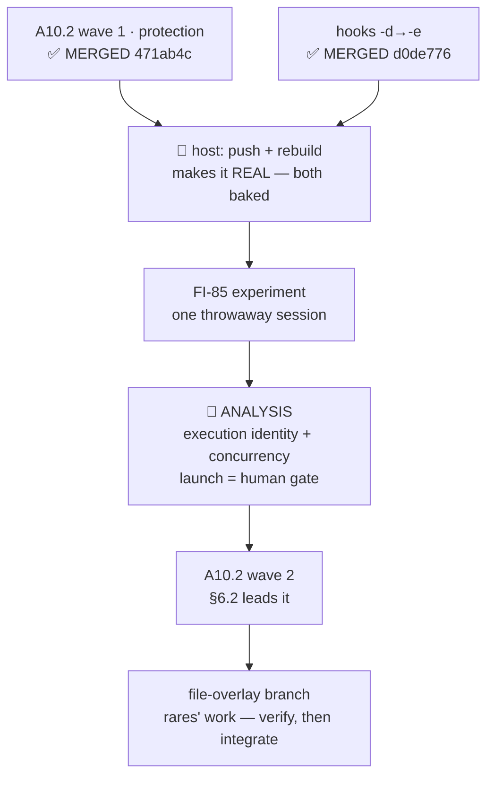

# Handoff — 2026-09-04 · A10.2 wave 1 is MERGED. Wave 2 is gated behind a new analysis. Two host steps are owed.

> **Ephemeral.** The previous handoff was deleted before this was written. It links **out** to the
> roadmap, ADRs, design and analysis — nothing links back to it.
>
> Written for a session that remembers **nothing** of the one that produced it. Everything below is
> either measured and cited, or named as unmeasured.

## Where we are

**Phase: between Implementation and Analysis.** [A10.2](roadmap.md) wave 1 (protection) is **merged
into `develop`**; wave 2 is **not** next. It is gated behind a cross-cutting analysis the maintainer
ruled on 2026-09-04 — see [*Before wave 2*](roadmap.md#before-wave-2--session-execution-identity--concurrency-analysis).



### State, measured

| Claim | Measured |
|---|---|
| Branch / tree | on **`develop`**, working tree **clean**. ⚠ Host and container share one tree — `git branch --show-current` before any write |
| ✅ **A10.2 wave 1 merged** | `471ab4c` (`--no-ff`), preceded by `a10-2-impl` → the unit branch (`d49d689`, clean). `lib/dev.sh` + `lib/cmd-dev.sh` + the guards + `tests/test_dev_protection.sh` are on `develop` |
| ✅ **hooks fix merged** | `d0de776` (`--no-ff`). ⚠ The **predicted conflict arrived in the predicted shape** — two independent lints appended at the tail of `tests/test_invariants.sh` — and was resolved by **keeping both**, reconstructed from the two parents after verifying this branch's version is a pure 48-line append. `bin/test --file test_invariants` → **43 passed / 0 failed / 43** |
| ✅ **Suite on `develop`, after both merges** | **1837 passed / 7 failed / 1844 total**, `Results:` line **present**. ⭐ **The delta closes exactly** against the unit-tree run (1836/7/1843): **+1 passed, +1 total, failed unchanged at 7** — that +1 is `INV-WT`, the lint the hooks fix brought in. So every added test passes and no pre-existing test changed state, which is the strongest form this figure can take. The 7 verified **name for name** (6 × `test_as_*` + `test_paths_symlink_safe_tool_root`), and count and names **agree** |
| 🔴 **`develop` is AHEAD of `origin/develop`, 0 behind — the push is a HOST step** | detected, not assumed (`rules/git-practices.md`): SSH remote, **no** credential helper, **no** `GITHUB_TOKEN`, `gh` not authenticated. ⚠ **The count is deliberately not written here** — `git rev-list --count origin/develop..develop` is the answer, because a stated count is invalidated by the commit that states it (this handoff's own commit did exactly that, turning 38 into 40) |
| 🔴 **Neither merge is ACTIVE yet** | `lib/` and `config/hooks/` are **baked**. Wave 1's protections and the hooks fix are inert until a host `./bin/cco build` from `develop` |
| Image in use | `078fe704`, label `cco.build-ref: feat/devmode/a10-2-protection@74b6164` — built **before** the merges, so it carries A10.1 but **not** wave 1 |
| 🔴 **git needs an env prefix here** | `dubious ownership` fires **intermittently**; `~/.gitconfig` is a read-only host mount so `git config --global` is not a route. Use `GIT_CONFIG_COUNT=1 GIT_CONFIG_KEY_0=safe.directory GIT_CONFIG_VALUE_0='*'` |
| 🔴 **bash 3.2 cover is PARTIAL** | 5 of 14 changed files were never parsed on the real interpreter — the docker proxy's container limit refuses at **rc 125**, which is *docker's* code and reads as a pass |

## Gates still open

| Gate | What unblocks it |
|---|---|
| 🔴 **push `develop`** | **host only** — this session cannot push. Step 1 of `scratchpad/RUNBOOK-2026-09-04.md` |
| 🔴 **rebuild from `develop`** | **host only**. Until it runs, wave 1 and the hooks fix are inert. Oracle = the `cco.build-ref` label reads `develop@<sha>`; **empty means 0.6.0 was rebuilt again** ([FI-86](improvements.md)) |
| 📝 **[FI-85](improvements.md) attribution** | one throwaway session started with the **npm 0.6.0** cco on the current image, then the probe. Prompt returns ⇒ the 0.6.0 `cco start` path, which is the **published** release. No prompt ⇒ closes as *resolved, mechanism not isolable* |
| 🔴 **launching the analysis** | the maintainer's gate — the strongest one in `rules/workflow.md`. Scope, questions and the requirement to carry verbatim are in the roadmap entry. Home: `environment/analysis/` |
| 🔴 **2 decisions the lead declined to rule** | the fan-out guard **superset**, and the **two rename guard placements** — both below in *Context*, both user-perceivable, both wave-2 material |
| 📝 **[FI-86](improvements.md) · [FI-87](improvements.md) · [FI-88](improvements.md)** | FI-86 **proposal 1** (announce the build's ref + `REPO_ROOT`) is one line and **independent** — shippable without the analysis. Everything else in the three is **downstream of it** |
| **acceptance of wave 1 and of the hooks fix** | host-side, after the rebuild. For the hooks fix: spawn a subagent in a session that has a worktree under `/workspace/` and check the worktree appears in its repo list |
| **the file-overlay branch** | `feat/claude-view-file-overlays` — **rares' work, scheduled as the unit after A10.2**. Verify his analysis and design, then integrate or correct. ⚠ **144 commits behind `develop`**; ⚠ **out of every cleanup sweep**, local and remote |
| 📝 **the `_secret_scan_staged` pipefail contract** | raised by A2's review, **still never ruled** |
| **A1's roadmap entry → [roadmap-history.md](roadmap-history.md)** | ~450 lines of a closed unit; its branch is gone, so the automatic trigger can never fire again |
| **[A9](roadmap.md) · [A2](roadmap.md) · [A3](roadmap.md) · [A6](roadmap.md) · [A7](roadmap.md) · [A12](roadmap.md)** · FI-58 leftovers · [FI-72](improvements.md) · FI-73 · FI-74 · FI-76 · FI-78 · FI-81 · FI-82 · FI-83 · FI-84 | the rest of Block A |

## How to resume

1. `git branch --show-current` — host and container share one working tree. Expect **`develop`**.
2. **Read `scratchpad/RUNBOOK-2026-09-04.md`** — it is the maintainer's, gitignored, and holds the
   four host steps (push · rebuild · the FI-85 experiment · back to normal) with the oracle for each.
   ⚠ If it is gone, the maintainer deleted it after use; the same steps are recoverable from the
   gates table above.
3. **Confirm the rebuild landed** before trusting anything about wave 1:
   ```
   cco whoami        # must print:  image built from: develop@<sha>
   ```
   ⚠ That line **does not exist at all** in 0.6.0's `whoami` — its absence means the old image is
   still in use, not that the field is empty.
4. **The next unit of work is the analysis, not wave 2.** Read the roadmap entry
   [*Before wave 2*](roadmap.md#before-wave-2--session-execution-identity--concurrency-analysis)
   first; it carries the two questions and the maintainer's requirement verbatim.
5. Background for it: [FI-86](improvements.md), [FI-87](improvements.md), [FI-88](improvements.md),
   [ADR-0060](engineering/decisions/0060-developer-execution-mode.md) and
   [design §6.2](engineering/design/dev-execution-mode.md).

⚠ **Do NOT read the decision clinic to find out what to build.**
[`engineering/analysis/dev-execution-mode-decisions.md`](engineering/analysis/dev-execution-mode-decisions.md)
is **historical** — read it only to see *why* an alternative was rejected.

## Tasks

The [roadmap](roadmap.md) is the single source of truth for status; this list points at it.

- [ ] 🔴 **Host: push `develop`** — this session cannot (measure the count, never quote one)
- [ ] 🔴 **Host: `./bin/cco build` from `develop`**, verify by the `cco.build-ref` label — [FI-86](improvements.md)
- [ ] 📝 **Run the [FI-85](improvements.md) experiment** — npm 0.6.0 `cco start` + the probe; record the outcome with its date
- [ ] 🔴 **Launch the analysis** (human gate) — execution identity + concurrency, [roadmap](roadmap.md#before-wave-2--session-execution-identity--concurrency-analysis)
- [ ] 🔴 **Rule the two wave-1 decisions** (fan-out superset · rename guard placement) — see *Context*
- [ ] 📝 **Ship [FI-86](improvements.md) proposal 1** — `cco build` prints its ref and `REPO_ROOT`. One line, independent of the analysis
- [ ] ▶ **A10.2 wave 2**, respecified by the analysis — §6.2 leads it, then `cco dev seed|reset|list|config|project` · `clean` scoping + `--images` · fixtures · `project.dev.yml`
- [ ] **Tests for wave 2** by an independent role, derived from the design. Each new guard shown to **fail when neutralised** before its pass is believed
- [ ] **Living docs for A10.2** — `docs/users/reference/cli.md` §3.34, `changelog.yml`, **rewrite `CONTRIBUTING.md`'s dev section**, and **a "dev vs distributed" explanation**. ⭐ A maintainer ruling, not optional polish
- [ ] **Accept wave 1 and the hooks fix** after the rebuild
- [ ] **Fix the test-file env leak** — `tests/test_dev_mode.sh` and `tests/test_dev_sandbox.sh` unset `CCO_DEV_SANDBOX_ROOT` but **not** `CCO_DEV_ROOT`
- [ ] **Cover the two untested guarded writers** — `cco project import` and `cco repo rename`, named in design §5.2's table and driven by **no test**
- [ ] **Finish the bash 3.2 cover** — 5 of 14 files. ⚠ One file per invocation: `bash -n` reads only the **first** file argument
- [ ] **Tighten INV-CCOSPEC's Rule B** — it keys on the token `git ` and fires on the *prose* of a message containing `$_PROJECT_SPEC`
- [ ] **The file-overlay branch** — verify rares' analysis and design, then integrate or correct
- [ ] **Decide**: move A1's ~450-line closed entry into [roadmap-history.md](roadmap-history.md)
- [ ] **Rule the `_secret_scan_staged` pipefail contract**
- [ ] the rest of Block A

## Context

### The analysis, and why it is not a detour

⭐ **Wave 2 contains §6.2, and §6.2 *is* the divergence policy applied at `cco start`.** Specifying it
before deciding which combinations are legitimate would build the wrong thing. Two questions that
cannot be answered apart — a policy without enforcement cannot be imposed at runtime; locking rules
without a policy do not know what they protect. The roadmap entry holds both, plus **the maintainer's
requirement, to be carried verbatim**: *a system that stops working is wrong; one that requires a
restart, says so explicitly and keeps working on the stale version — or forces the restart when
divergence is dangerous — is correct, if explicit and designed.*

### 🔴 Two decisions the lead deliberately did NOT rule

- **The fan-out guard is a superset.** `_cco_dev_project_guard_fanout` guards the unit dir **and** the
  members, over-covering `cco llms rename` (which touches only the primary `project.yml`). The
  implementer's argument — *a guard that under-covers a fan-out is the failure that actually loses
  work* — is sound, but the declared cost is a **refusal a user can hit** on a member repo the rename
  would never have touched.
- **The two rename guards sit in different places** — `pack rename` in Phase 0 (before the confirm),
  `repo rename` after it. The lead's view is uniformity (*never ask someone to confirm an action you
  are then going to refuse*); one line per file, user-perceivable.

### Decisions already taken — do not re-open them

1. **[ADR-0060 Amendment A6](engineering/decisions/0060-developer-execution-mode.md#amendments)** —
   **dev mode cannot bootstrap a machine**. ⭐ The intuitive reading was **measured wrong**: the schema
   marker lives in **STATE** (sandboxed) while the config it describes lives in **CONFIG** (shared).
2. **`cco dev seed` on a populated dev root says so and does nothing** — exit 0 naming `cco dev
   reset`, **no `--force`**. Design §8.1.
3. **The documentation scope of A10.2 is widened** — see Tasks.
4. **Wave 1 stands alone**: refusals name wave-2 verbs with *"not implemented yet"* rather than
   *"unknown command"*. ⭐ **This is what made merging wave 1 without wave 2 anticipated rather than a
   shortcut.**

### 🔴 [FI-85](improvements.md) — what was learned, and what was got wrong three times

The symptom is **gone**; the cause is **located, not isolated**. What matters for the next session is
the epistemic record, because the same error was made three times in two sessions:

1. blamed cco config + a hook remedy — refuted;
2. blamed a Claude Code auto-update and **wrote "CAUSE IDENTIFIED" into a document** — refuted the next
   day (the dialogs reproduced under 2.1.260 in the same container and image);
3. blamed the repo-native `.claude/settings.local.json` — the test was **inconclusive**, and this time
   it was recorded as inconclusive rather than as a refutation.

⭐ **An exclusion plus a correlation is not a cause.** E1 exonerated this project's configuration by
measurement; three candidates remain and only one is still testable. Full elimination table in the FI.

🔑 **The workaround, still in force**: in a command containing a **pipeline**, give `grep` an
**absolute** path, or drop the `cd`. It is **not** "keep commands simple" — four-statement commands
and `sed` pipelines both measured clean.

### Measurement traps paid, and the new ones

- 🔴 **A silent no-op replace reports success.** A `python` string replace that matched **nothing**
  still wrote the file and printed *"updated"*. Use a tool that **fails on no-match**, or assert the
  content changed — never that the write happened.
- 🔴 **The exit code of `grep … | sed` is `sed`'s.** Fallen into a third time this session: a
  `grep -q … | sed` guard read as success on an empty match. Test with `grep -q` alone.
- 🔴 **An image's `Created` is not a build time** — a fully cached `docker build` re-tags an identical
  image and leaves the timestamp. The **label** is the oracle.
- 🔴 **`cco --version` is blind across install provenances** — same string from npm and from a clone.
  `provenance` + `REPO_ROOT` discriminate; `which cco` answers PATH order.
- 🔴 **A diagnostic message describes the analyzer's limit, not the command.** Two FI-85 hypotheses
  were built on one dialog's wording and both died.
- 🔴 **A file-count oracle does not discriminate a destroying guard** when the remedy re-creates what
  it destroyed — use a **sentinel**, i.e. identity, never the number. And an **rc-and-wording oracle
  does not either**: the refusal was entirely correct while the config had already been deleted.
  **Only survival caught it.**
- ⚠ `assert_refused … "cco"` asserts **nothing** — every message that command prints contains *"cco"*.
- ⚠ **Process substitution renders EMPTY inside the runner's capture** — write manifests to files.
- ⚠ **A named list is a lower bound**, including **a design's own prescribed enumeration command**:
  two writers reach `<repo>/.cco` through a *resolver*, invisible to the mandated grep.

### Non-obvious things the next session would otherwise rediscover

- ⭐ **In a git worktree `.git` is a FILE, not a directory** — proven again in isolation 2026-09-04
  (116 bytes, `gitdir: …`), so `-d` is FALSE and `-e` TRUE. That is the whole content of the hooks
  fix, and its correctness rests on that git fact — **not** on any FI-85 diagnosis, despite having
  been found during that investigation.
- ⭐ **This project's sessions mount ~30 individual per-file binds** under `/workspace/.claude/`.
  That is the live subject of the file-overlay branch.
- `isolation: worktree` on the Agent tool is **refused** in this repo — create the worktree by hand.

## Reference documents

- [roadmap.md](roadmap.md) — the SSOT. **A10.2** and **[Before wave 2](roadmap.md#before-wave-2--session-execution-identity--concurrency-analysis)** are the open entries
- [improvements.md](improvements.md) — **FI-86 · FI-87 · FI-88 new**; **FI-85 rewritten twice**
- [engineering/decisions/0060-developer-execution-mode.md](engineering/decisions/0060-developer-execution-mode.md) — the contract, six amendments
- [engineering/design/dev-execution-mode.md](engineering/design/dev-execution-mode.md) — the *how*; **§6.2** is wave 2's first item and the analysis's subject
- [engineering/analysis/dev-execution-mode.md](engineering/analysis/dev-execution-mode.md) — the approved analysis
- [engineering/analysis/dev-execution-mode-decisions.md](engineering/analysis/dev-execution-mode-decisions.md) — the clinic, **historical**
- `scratchpad/RUNBOOK-2026-09-04.md` — the host steps, **the maintainer's and gitignored**; deleted after use
