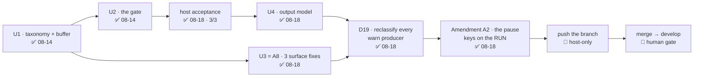

# Handoff — 2026-08-18 (late)

> **Ephemeral.** At most one of these exists per line of work; the previous was deleted before this
> was written. It links **out** to the roadmap, ADRs and designs — nothing links back to it.

## Methodology / where we are

**Phase: Implementation — and the A5 + A8 cycle is finished.** All five units are on
`feat/cli/start-warning-gate`: **U1** (taxonomy + capture buffer + lints) and **U2** (the gate),
2026-08-14; **U4** (the output model), **U3** (= all of [A8](roadmap.md)) and **U5** (= D19 +
[Amendment A2](cli/decisions/0059-message-classification-and-the-start-warning-gate.md#amendments)),
2026-08-18.

Suite **1710 passed / 7 failed of 1717** — the 7 are the [known host-only set](roadmap.md)
(6 `test_as_*` + `test_paths_symlink_safe_tool_root`), verified name for name. Working tree clean.

**Nothing is owed before the merge.** What is left is host-only: push, then the merge gate.
Measure the branch's position with `git rev-list --count develop..feat/cli/start-warning-gate` —
never trust a number written in a document.



### Gates still open

| Gate | What unblocks it |
|---|---|
| **Push `feat/cli/start-warning-gate`** | host-only — no SSH key, no `gh` auth, no token in this session (measured). ⚠ It is **not** unpushed: it tracks `origin/feat/cli/start-warning-gate` and runs ahead of it, so a plain `git push` is what it needs. The command is under *How to resume* |
| **Merge `feat/cli/start-warning-gate` → `develop`** | a human sign-off. ⚠ The branch is **not merged**: the whole cycle is reachable from this ref and nothing else |
| **A live look at the new pause** | ⭐ worth one host `cco start` before the merge — the previous acceptance run measured the *old* form, which stopped only on warnings. Nothing depends on it: the three graduated forms and the abort are covered in the suite, through the shipped body |
| **macOS host suite (bash 3.2)** | owed before `0.7.0`; nothing has run the full suite on 3.2 since `v0.6.0` (`1626 / 0` on that tree) |
| **One undecided UX residue** | see *Open questions* — not blocking, and the current behaviour is defensible |

## How to resume

**1. Push, from the host** — the one owed action no session can perform (measured here: no
`~/.ssh`, `gh auth status` reports no host, no token in the environment):

```
cd /Users/alessandro/Projects/CaveResistance/Software/claude-orchestrator
git push
```

⚠ **The branch is NOT unpushed** — three documents said it was, including the handoff this one
replaces. It has an upstream and runs ahead of it; `-u origin <branch>` is not needed. No distance is
recorded here on purpose (a stated count is invalidated by the commit that states it — the same rule
the roadmap applies to the commit count). Measure before repeating any such claim:

```
git branch -vv | grep start-warning-gate      # upstream + how far ahead
git rev-list --count develop..feat/cli/start-warning-gate
```

📝 What this session **cannot** verify is whether the remote still holds that ref: `git ls-remote`
fails here (`Host key verification failed`), so `origin/…` is only what the local clone last saw.

**2. Then the merge gate.** ⚠ A merge whose **diff touches `.cco/`** is host-only in this project.
This one does not, but check before assuming.

**3. Do not re-derive the TTY contract.** `_cco_have_tty` (`lib/utils.sh`) is the single interactivity
spelling, enforced by `test_invariant_tty_gate_single_spelling`. A raw `/dev/tty` probe hangs the
suite silently.

## Tasks

The [roadmap](roadmap.md) is the single source of truth for status; this list points at it.

- [ ] **Push `feat/cli/start-warning-gate`** — host-only; plain `git push`, it already has an upstream
- [ ] **Look at the new pause once on a real terminal** — the earlier acceptance run measured the form
      A2 replaced. Not a blocker; the three forms and the abort are covered in the suite
- [ ] **Merge to `develop`** — the human review point; the cycle owes nothing else
- [ ] **macOS host suite (bash 3.2)** — owed before the `0.7.0` release
- [ ] **[A1](roadmap.md)** — `cco save`, project-config versioning helper (needs a short design)
- [ ] **[A2](roadmap.md)** — per-project custom Docker image ([FI-49](improvements.md); short design)
- [ ] **[A3](roadmap.md)** — cross-scope collision warning ([FI-32](improvements.md)) + three open decisions
- [ ] **[A6](roadmap.md)** — `.claude/worktrees` in the functional-write floor ([FI-56](improvements.md))
- [ ] **[A7](roadmap.md)** — the A4 review residue ([FI-62](improvements.md) … [FI-66](improvements.md))
- [ ] **FI-58 leftovers** — ADR-0058's **D3**, **D7** and **D8-as-amended** are unbuilt. ⚠ D8 touches a
      **baked** file (`config/hooks/subagent-context.sh`), so whichever unit takes it also takes a
      `cco build` in its acceptance lane
- [ ] **[FI-72](improvements.md)** *(new)* — nothing detects the *next* unclassified `warn` producer

## Context

### Decided this session

**[ADR-0059 Amendment A2](cli/decisions/0059-message-classification-and-the-start-warning-gate.md#amendments)
(D20–D25)** — ruled by the maintainer at the D19 analysis gate, then built. Read the ADR and
[design §4.6](cli/design/design-warning-gate-and-onboarding-prompts.md), not this line. In one
sentence: **the pause is a property of the RUN, not of the warning level** — D1 had fused *how
serious is this message* with *may the user read what this run printed*, which left `note()` and
`info()` write-only by construction.

**D19 is discharged and reclassified nothing.** Every one of the 46 reached producers is correct at
its level. What the measurement bought was coverage — and the discovery that made A2 necessary.

### Open questions needing a human

- 📝 **An unrecognised answer at the pause starts the session** (only `a`/`A` aborts). D10 decided
  bare Enter and `[S/a]`; it did not decide what a stray `n` does. Starting is D10's own reasoning
  applied consistently — *confiscating a session the user asked for is the worse error* — but a
  re-prompt loop is a one-line change and a UX call. **Not blocking.**
- 📝 **[Open decision #7](roadmap.md)** — should `cco clean` sweep `$TMPDIR/cco-warn.*`? The design
  claimed `cco clean --tmp` already did; it does not, and the claim is corrected in
  [design §4.2](cli/design/design-warning-gate-and-onboarding-prompts.md).
- The five older ones are in the roadmap's [Open decisions](roadmap.md).

### 🔑 Non-obvious things the next session would otherwise rediscover

- ⚠ **The defect this session paid for, and its class.** Removing D25's counting loop left
  `_start_resolve_paths` ending on `[[ $rc -eq 2 ]] && return 2`, whose status on the normal path is
  **1**. The caller read that as a failed resolve and aborted every start: **227 suite failures**, all
  of them a dry-run that produced no compose file. ⭐ **Deleting the last statement of a function
  changes its return value.** An explicit `return 0` is now there with the reason attached.
- 🔑 **The pause's own prompt is now reachable in the suite**, with `tests/test_resolve.sh`'s `_p8_*`
  technique duplicated as `_wg_*` in `tests/test_warn_capture.sh` (deliberately duplicated, so
  `bin/test --file test_warn_capture` runs standalone). It `awk`s the shipped `_cco_warn_gate` body
  out of `lib/utils.sh` **at run time** and `sed`s **only** `read -r reply < /dev/tty` into a queue
  pop. ⚠ It **refuses a body it could not patch** — an unpatched one would block on `/dev/tty`
  forever rather than fail an assertion.
- ⭐ **The strongest oracle in that file is not a string match.** `CCO_ASSUME_YES=1` is asserted with
  **`a` queued as the answer**: had the gate read it, the run would have aborted, so `rc 0` proves the
  read never happened. Checking for the absence of the prompt text proves only that the text changed.
- 🔑 **Both counts are read BEFORE the flush** in `_cco_warn_gate`. Flushing **empties** the buffer
  (D18), so asking afterwards reports a clean run every time and the `[S/a]` form is never reached.
- 🔑 **Deferral is conditional on the append succeeding** — for `note` now as much as for `warn`. A
  buffer that cannot be written prints immediately. Do not "simplify" it into an unconditional defer.
- 🔑 **Dedup runs BEFORE the level filter** in `_cco_warn_capture_records`: one sentence emitted at two
  levels is one entry, and the warning is the one that stands.
- 🔑 **D24's silence is deliberately NOT uniform across the four kinds.** llms and packs go quiet
  during a start because compose generation restates them better; repos and extra_mounts have **no**
  downstream producer, so `cmd-resolve.sh:271,294` are the only statement of that condition. A later
  tidy-up that extends the silence to all four **deletes the message**. Commented at the sites.
- 🔑 **The area is DERIVED from `${BASH_SOURCE[1]}`**, read inside the emitter's own frame. The
  file→area table in `lib/colors.sh` is a maintained list and is admissible **only because** a missing
  file costs a *label* (falls to `other`), never the message. A *gating* list would cost the guarantee.
- 🔑 **D19's method, if it is ever repeated** ([the analysis](cli/analysis/d19-warn-producer-reclassification.md)
  §2): a trace line inside `warn` (`${BASH_SOURCE[1]}:${BASH_LINENO[0]}`), `set -x` with `FUNCNAME` in
  `PS4`, and `shopt -s extdebug; declare -F` to attribute a line to its function. ⚠ Two false-pass
  traps it paid for: an oracle that matched a function name inside a **comment** (strip `#…` first),
  and a brace-depth body parser that mis-attributed lines (`declare -F` instead — the shell answers).
- ⚠ **When a message changes, grep the suite for the old wording.** `test_start_..._and_badged`
  asserted the exact sentence D25 removed; it is now `..._and_reported` and counts that the condition
  is stated **once**, which is the property D25 is about.
- 🔑 **The in-container bash-3.2 lane loses STDOUT** (the docker socket proxy): only the **exit code**
  comes back, and the container name must start with `cc-claude-orchestrator-`.
- 📝 **No unit in this cycle touches a baked file**, so **no `cco build`** is in the acceptance lane.
- 📝 **The FI-25 mask (`access: {claude: all}` in `.cco/project.yml`) is ON**, deliberately. Masked
  in-container figures are the `…/7` ones. Pin `--claude-access` explicitly for any A4-style
  measurement in this project.
- ⚠ **"Unpushed" was a restated claim, not a measured one — and it was wrong.** The previous handoff,
  the roadmap and my memory all said the branch had never been pushed; `git branch -vv` shows an
  upstream at `48bef8a` with HEAD ahead of it. This is the *second* time in this repo that a push
  status carried in prose disagreed with the refs (the A4 cycle was the first). ⭐ **Treat every
  stated branch position as unverified**: `git branch -vv` and
  `git rev-list --count develop..<branch>` cost nothing.
- ⚠ **git in this container needs `safe.directory`** and `~/.gitconfig` is a read-only bind mount, so
  it cannot be set globally. Use
  `GIT_CONFIG_COUNT=1 GIT_CONFIG_KEY_0=safe.directory GIT_CONFIG_VALUE_0=/workspace/claude-orchestrator git …`.

## Reference documents

- [roadmap.md](roadmap.md) — the living SSOT; A5 carries the U1…U5 table and the discharged D19 block
- [improvements.md](improvements.md) — the `FI-*` tracker; **FI-72 opened** this session
- [ADR-0059](cli/decisions/0059-message-classification-and-the-start-warning-gate.md) — message
  classification and the start-time pause: D1…D15 + A1 (D16…D19) + **A2 (D20…D25)**
- [design-warning-gate-and-onboarding-prompts.md](cli/design/design-warning-gate-and-onboarding-prompts.md)
  — **§3.3** the producer survey *(rewritten from the measurement)*, **§4.6** what the pause keys on
  *(new)*, **§6.2/§6.4** what the suite can and cannot reach *(narrowed again)*
- [d19-warn-producer-reclassification.md](cli/analysis/d19-warn-producer-reclassification.md) — the
  measurement: method, the 15 scenarios, the per-site verdicts
- [ADR-0058](integration/agent-teams/decisions/0058-teammate-coordination-tools.md) — its D3/D7/D8
  leftovers are in *Tasks*
- [ADR-0008](configuration/decentralized-config/decisions/0008-personal-store-management.md) — its
  *non-blocking* reminders: **compatible with the pause**, and D19 §5.1 records why the opposite
  reading was wrong
