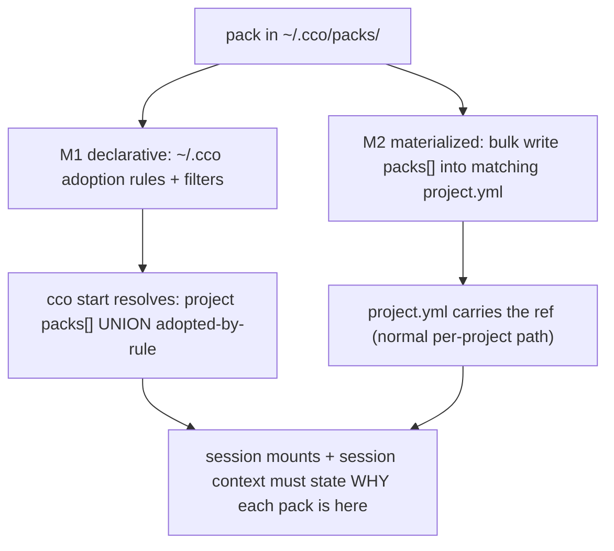

# Framework Improvements — Analysis & Decisions

> Backlog of framework improvements; see [roadmap.md](roadmap.md) for the live plan.
>
> Raised: 2026-03-14. Collected from field usage observations.
> These items will be revisited individually at design/analysis time before implementation.
>
> **Convention (2026-07-16) — re-verify the bound before designing an item.** A note records the
> symptom as *observed*, plus a suggested direction; neither is a finding. Before designing, re-derive
> the item's real boundary from the code: which call sites/artifacts are actually in scope, which are
> correct-by-design and must not be "fixed", and which **related** defects sit in the same
> neighbourhood — then design and fix them as one boundary-aware change. Rationale: this is how the
> 2026-07-16 triage found that `cco repo rename` needed no change at all (FI-21), that a second
> host-path defect sat inside the very function being fixed (§ e2e `project show`), and that
> FI-21/22/23 are three faces of one index model. A per-symptom fix would have missed all three.

---

## FI-1: Framework Context for the Coding Agent

**Status**: Implemented. Operational context added to `defaults/managed/CLAUDE.md` (Docker environment, workspace layout, agent teams, memory policy).

**Question**: Should the coding agent inside the container know that it's running within claude-orchestrator? For example via managed CLAUDE.md or rules?

**Context**: Currently the managed `CLAUDE.md` (`defaults/managed/CLAUDE.md`) tells the agent *how to behave* (workspace layout, memory policy, agent teams) but does not explain what claude-orchestrator is or how the framework works.

**Analysis**:
- The agent does NOT need to know the framework internals (how `cco` works, config hierarchy, migrations) — it should use the workspace, not manage the framework.
- The agent SHOULD know key operational details: ports are mapped to host, `docker compose` creates sibling containers on `cc-<project>` network, `/etc/claude-code/` files are managed and non-modifiable, `/init-workspace` exists for project initialization, `cco` is a host-side CLI not available inside the container.
- The current managed CLAUDE.md already covers most of this. Missing: explicit mention that `cco` is host-only, Docker network naming convention.

**Decision**: Small additions to the existing managed CLAUDE.md. No separate knowledge pack or documentation needed — minimal operational context is sufficient.

**Effort**: Low (text additions to `defaults/managed/CLAUDE.md`).

---

## FI-2: `/init-workspace` on Empty Projects

**Status**: Implemented (2026-03-19). Adaptive flow added to init-workspace: detects empty workspaces and guides user through 3 detail levels (idea → decisions → specs).

**Question**: When `/init-workspace` runs on an empty, unconfigured project, the agent doesn't know what to include. Should it ask the user clarification questions (project description, architecture, goals) before generating the CLAUDE.md? Or should init-workspace be suggested only after a first analysis phase?

**Context**: The current skill (`defaults/managed/.claude/skills/init-workspace/SKILL.md`) proceeds silently with automatic discovery. It is explicitly instructed to "proceed without confirmation" if the file is empty/missing. On an empty workspace (no repos, no manifests), it generates a nearly empty CLAUDE.md with placeholder sections.

**Analysis**:
- **Option A — Ask questions first**: Before writing, the skill asks "Describe what you want to build" and uses the answer to populate Overview and Architecture. More useful for greenfield projects.
- **Option B — Suggest init after first analysis**: The user first describes their goals (via `/analyze` or conversation), then invokes `/init-workspace` which already has context from the conversation. More aligned with the phased workflow.

**Decision**: Option B is more pragmatic and coherent with the structured workflow. The skill should add a check: if no repos are found and no `workspace.yml` descriptions exist, ask the user for a brief project description before generating.

**Effort**: Low (conditional logic addition to SKILL.md).

---

## FI-3: Default Ports and Chrome DevTools Port Management

**Status**: Implemented. Template default changed to `ports: []` with example comments. Chrome DevTools port management unchanged (already correct).

**Question**: The default `project.yml` template includes `ports: ["3000:3000", "8080:8080"]`. Is this correct? Should the default be empty? How should the Chrome DevTools port be managed — automatically by the framework or manually by the user? What about port conflicts?

**Context**:
- Template: `templates/project/base/project.yml` has ports 3000 and 8080 by default.
- Browser config: `enabled: false`, `cdp_port: 9222`, `mode: host`.
- `_resolve_browser_port()` in `lib/cmd-chrome.sh` already handles port conflict auto-resolution.

**Analysis**:
- **Default ports**: 3000/8080 are reasonable web dev defaults but violate "secure by default" — an empty `ports: []` with a comment explaining how to add them is cleaner. Unused ports don't cause conflicts but add noise.
- **Chrome DevTools port**: Already managed automatically by the framework. Chrome runs on the host (`mode: host`), not in the container. The CDP port (9222) is used directly on the host and does not appear in `docker.ports`. Port conflict resolution via `_resolve_browser_port()` handles edge cases.
- **User vs DevTools conflicts**: No architectural conflict — `docker.ports` maps container ports to host, while CDP is host-to-host. The only conflict would be if a user maps port 9222 inside the container AND uses Chrome DevTools — an edge case manageable via documentation.
- **Security**: All defaults are safe. Ports map to localhost only (Docker default). Browser is `enabled: false` by default. Docker socket proxy filters API calls.

**Decision**: Change template default to `ports: []` with a comment listing common examples. Chrome DevTools port management is already correct — no changes needed.

**Effort**: Low (template edit + one-line migration if needed for existing projects — actually no migration needed since ports are user-owned and additive).

---

## FI-4: Per-Project LLM Model Configuration

**Status**: Not implemented — planned as quick win (priority 2, effort medium-low). No `model:` field in `project.yml` or `--model` integration in entrypoint yet.

**Question**: Could it be useful to set a default LLM model globally and a different default per project, per agent, or per workflow phase?

**Context**:
- Currently no mechanism exists to configure the model from the framework. The model is decided by Claude Code at launch time.
- Subagents already support per-agent model via YAML frontmatter (`model: claude-3-5-haiku` in analyst, `model: claude-3-5-sonnet` in reviewer).
- `claude --model <name>` is the CLI flag.

**Analysis**:
- **Per project** (new): Add `model:` field in `project.yml`, passed to `claude` at launch via `--model` in the entrypoint. Most concrete use case: simple projects on haiku, complex projects on opus.
- **Per agent**: Already supported natively via agent frontmatter. No changes needed.
- **Per phase**: Not practical. Phases are conceptual (user workflow), not framework-managed entities. The user can change model manually during a session.
- **Global default**: Equivalent to setting `CLAUDE_MODEL` env var or a default in settings. Lower priority — the per-project level is more useful.

**Decision**: Implement per-project `model:` in `project.yml` only. Global default is a simple env var. Per-agent is already covered. Per-phase is not worth the complexity.

**Effort**: Medium (project.yml schema, entrypoint integration, documentation).

---

## FI-5: Human Workflow Guide and Review Best Practices

**Status**: Implemented (2026-03-19). Guides written (2026-03-16), defaults aligned with guides (2026-03-19). Scope revised: branch protection docs dropped (out of cco scope — user configures via GitHub if needed). Instead, defaults aligned to guide recommendations: CLAUDE.md rewritten, workflow.md expanded, diagrams.md→documentation.md, template cleaned up.

**Question**: Should the documentation or tutorial include guidance on which tasks remain human responsibilities, the recommended development flow, common problems and workarounds?

**Original observations from field usage**:
> - Verificare sempre in dettaglio tutti gli artifact intermedi tra fasi. Il riferimento sono i documenti di analisi e design creati.
> - Dopo ogni ciclo di implementazione far fare una o più review automatiche (da uno o più agents) a Claude per:
>   - Review allineamento dell'implementazione al design e caccia di bug critici
>   - Review della docs: nessuna docs stale, tutti i riferimenti e concetti sono aggiornati al nuovo design
>   - Review dei test. Verifica che i test hanno coverage sufficiente e sono completi
> - Da eseguire sempre prima di considerare una feature chiusa e completa. Spesso la seconda review trova errori di implementazione o fix necessari che durante l'implementazione sono sfuggiti al modello.
> - Ovviamente l'umano deve sempre controllare e dirigere le scelte principali e la qualità del codice, di sicurezza, di conformità e scelte architetturali.
> - Possono essere spesso utili anche delle review e analisi di refactor possibili o ottimizzazioni dell'architettura.
> - Template project può consigliare all'utente di seguire queste fasi e direttive.
> - **Human in the loop + review automatiche migliorano drasticamente la qualità dei risultati ed evitano l'accumularsi di bug ed errori.** Ogni ciclo di sviluppo deve essere concluso con testing automatizzato + test e verifica umana.
>
> Git flow recommendations:
> - Definire un flusso git preciso e convenzioni di nomenclatura branch e direzione dei commit.
> - Includere nelle rules commit automatici dall'agent.
> - I punti di review non sono i commit, ma i merge da branch feature o fix al branch develop o main. Questo sembra essere il compromesso migliore.
> - Configurare ruleset git per PR obbligatorie per forzare la review umana e impedire merge automatici del modello — non solo tramite rules ma meccanicamente (GitHub branch protection).

**Context**: `docs/user-guides/structured-agentic-development.md` already covers team discipline, two-layer review (agent + human), and workflow phases with approval gates. Default rules in `defaults/global/.claude/rules/` cover git practices and workflow phases. The `/review` skill and `reviewer` agent exist.

**Analysis**: The conceptual framework exists, but a **practical operational guide** is missing. What's needed:
1. **`docs/user-guides/development-workflow.md`** — step-by-step guide with:
   - Checklist per phase (what to do, what to verify)
   - Recommended review pattern: implementation → design alignment review → docs review → test review
   - Common problems and workarounds (e.g., "model forgets constraints during long implementation")
   - Precise git flow: branch naming, when to commit, when to merge, mandatory PR rules
2. **Template integration** — the base project template could reference these best practices in the generated CLAUDE.md or suggest them post-`cco project create`.
3. **GitHub branch protection** — document how to configure rulesets to mechanically enforce human review on merges to develop/main, not just via soft rules.

**Decision**: Create the practical guide. The core message: human-in-the-loop + automated multi-pass reviews drastically improve output quality and prevent bug accumulation.

**Effort**: Medium (documentation writing, template updates).

---

## FI-6: Read-Only Mounts for User-Owned `.claude/` Config

**Status**: Implemented. Deny rules added to `defaults/managed/managed-settings.json` preventing agent writes to `.claude/rules/*`, `.claude/agents/*`, `.claude/skills/*` at project level.

**Question**: Currently `.claude/` rules, agents, and other user-defined files can be modified by the agent inside the container. Should these be mounted read-only to prevent unintended modifications?

**Original observation**: The agent was observed modifying user-defined rules and config files during a session. The only project that should legitimately modify these is the tutorial project (which explicitly mounts `user-config` in rw).

**Context — current mount modes**:
| Resource | Mount mode | Reason |
|---|---|---|
| Global settings, CLAUDE.md, rules, agents, skills | `:ro` | User-owned, never modified |
| Project `.claude/` | `:rw` | `/init-workspace` writes CLAUDE.md and workspace.yml |
| Pack resources (knowledge, rules, agents, skills) | `:ro` | Read-only by design (ADR-14) |
| Managed files (`/etc/claude-code/`) | Baked in image, root-owned 644 | Non-modifiable |
| `project.yml` | `:ro` | Config, not modified at runtime |

**Analysis**: The only issue is project `.claude/` being `:rw`. This is needed because `/init-workspace` writes to `.claude/CLAUDE.md` and `.claude/workspace.yml`. But it also allows the agent to modify `.claude/rules/`, `.claude/agents/`, `.claude/skills/`.

**Solutions evaluated**:
1. **Granular mounts**: Mount each subdirectory separately (CLAUDE.md `:rw`, rules/ `:ro`, etc.). More complex compose generation, harder to maintain.
2. **Deny rules in managed-settings.json**: Add deny patterns for write access to `.claude/rules/*`, `.claude/agents/*`, `.claude/skills/*` at project level. Simpler, no mount changes needed. `/init-workspace` only writes CLAUDE.md and workspace.yml, which remain writable.
3. **Soft rule only** (current): `memory-policy.md` says "Do NOT modify user-owned config files without explicit user approval" — but this is not enforced technically.

**Decision**: Option 2 (deny rules in managed-settings.json) is the most elegant. Technical enforcement without mount complexity. Tutorial project can override if needed via its own settings.

**Effort**: Low (deny rule additions to `managed-settings.json`).

---

## FI-7: Publish-Install Sync and Resource Versioning

**Status**: Implemented (2026-03-17) — **but later superseded** by the decentralized-config
refactor. Projects no longer publish/install/update/internalize: a project rides its own
code-repo remote (ADR-0018 D2), and `cco project publish|install|update|internalize` were
removed (`bin/cco` now returns a removal notice). **Needs triage**: confirm which sub-decisions
survive under the new model (e.g. the 3-way merge path lives on in `cco update`; `cco project
internalize` / Case-C is reserved post-v1, ADR-0023 D4). The original FI-7 design doc
([link](../archive/sharing/publish-install-sync-design.md)) appears to have
been removed/archived in a docs reorg (dead link — needs triage alongside the doc review).

**Question**: After `cco project install`, the installed project has no connection to the source Config Repo. If the publisher pushes updates, how does the consumer know? Should there be a `cco project update` flow? What about versioning?

**Analysis & Design**: Full analysis and design completed 2026-03-17. Key decisions:

1. **Unified discovery** — `cco update` becomes the single "what's new?" command covering framework changes, remote publisher updates, and changelog. Actions are type-specific.

2. **Source-aware sync** — `cco update --sync` on installed projects skips opinionated files (managed by publisher chain: Framework → Publisher → Consumer). `--local` flag overrides this for inactive publishers.

3. **3-way merge for project updates** — `cco project update <name>` fetches remote, merges via `_collect_file_changes()` / `_interactive_sync()`. Consumer customizations preserved.

4. **Publish safety** — migration check (blocking), secret scan (blocking), framework alignment (warning), diff review, per-file confirmation, `.cco/publish-ignore`.

5. **Project internalize** — `cco project internalize <name>` disconnects from remote permanently.

6. **Version metadata** — optional `version:` field in `.cco/source` for human-readable labels; `commit:` field for precise comparison via `git ls-remote`.

**Docs**: [analysis](../archive/sharing/publish-install-sync-analysis.md) | [design](../archive/sharing/publish-install-sync-design.md) | [user guide](../users/configuration/guides/configuration-management.md)

**Effort**: Medium-High (6 implementation phases defined in design doc).

## FI-8: PromptSubmit Hook + Documentation-First Rule

**Status**: Implemented. See [defaults-alignment-design.md](configuration/rules-and-guidelines/design/design-defaults-alignment.md) §2.2, §2.3.

**Problem**: Rules loaded at session start lose effective weight as conversation grows or after compaction. The agent frequently forgets key behavioral rules — particularly git practices and commit discipline.

**Solution**:

1. **UserPromptSubmit hook** (`config/hooks/prompt-submit.sh`) — managed hook injecting a concise per-prompt reminder. Follows the Content Principle: reminds the agent to check its configured rules rather than hardcoding specific rule content. Works regardless of how the user has customized their rules.

2. **Documentation-first rule** (`defaults/managed/.claude/rules/documentation-first.md`) — managed rule requiring the agent to check existing docs, design documents, ADRs, and prior analysis before starting new work. Prevents proposing solutions that contradict or duplicate existing design decisions.

3. **Defaults review** (8c-8e) — global rules, global CLAUDE.md, and managed CLAUDE.md reviewed against user guides. No changes needed — FI-5 alignment was already complete.

**Design principle**: The hook and rule are managed (framework behavior), not opinionated defaults. They govern *how to use existing artifacts*, not *which artifacts to create*. The hook references user-configured rules rather than encoding specific conventions.

**Effort**: Low.

---

## FI-9: Migration UX gaps surfaced by the v0.4.0 release

**Status**: Open (raised 2026-06-30 during the npm-packaging analysis). To be addressed in the
`cco update` responsibility refactor — see
[`engineering/opinionated-extraction-and-update-refactor-handoff.md`](engineering/opinionated-extraction-and-update-refactor-handoff.md) §6.

**Context**: Running cco after the v0.4.0 decentralized-config migration exposed three UX gaps in the
migration / update flow.

**Items**:
1. **No rebuild reminder after migration.** When `cco <cmd>` triggers the preventive vault backup and
   advises `cco update` + `cco init --migrate`, nothing tells the user that a **fresh `cco build`
   (`--no-cache`?) is required before `cco start`** — a new release needs a new image, but this is
   surfaced nowhere. Add the hint; evaluate whether the migration should auto-trigger the rebuild.
2. **`cco update` as first command — backup symmetry.** Clarify whether `cco update` run as the very
   first command performs the **preventive backup of the old centralized vault** like every other cco
   command (it should, symmetrically), or intentionally skips it.
3. **Re-build coupling.** Decide whether the decentralized-config migration **triggers the rebuild**
   itself, or stays separate with an explicit user hint.

**Analysis**: All three point toward the future **`cco update` orchestrator** (detect install method →
run engine update + migrations, one command). Keep them together with that refactor.

**Effort**: Low–Medium (hints now; full orchestration with the update refactor).

## FI-10: Is managed `permissions.deny` enforced under `--dangerously-skip-permissions`?

**Status**: Open (raised 2026-06-30 during the `settings.json` decomposition for npm packaging —
ADR-0037 D10). Security investigation; does **not** block packaging.

**Context**: cco always launches `claude --dangerously-skip-permissions` (`config/entrypoint.sh:261,267`),
which bypasses the permission-prompt gate. The framework relies on managed `permissions.deny`
(`defaults/managed/managed-settings.json` — `Read(~/.ssh/*)`, `Read(~/.claude.json)`) as a security
backstop. Official Claude Code docs list `allowManagedPermissionRulesOnly` and
`permissions.disableBypassPermissionsMode` as the controls that make *only* managed rules apply and
disable bypass mode — and **cco sets neither**.

**Question**: Under bypassPermissions, are managed `deny` rules still enforced, or are they decorative?
- If enforced → no action; document the guarantee.
- If not → either add `allowManagedPermissionRulesOnly` / `disableBypassPermissionsMode` (but that would
  re-enable prompting, conflicting with the zero-friction model), **or** accept that **Docker-is-the-sandbox**
  is the real boundary and downgrade the `deny` to informational (the container already isolates host
  secrets; `~/.ssh` is not mounted).

**Verify**: read the official permissions/bypass docs precisely, then test in a live container
(attempt a denied `Read` under skip-permissions).

**Effort**: Low (investigation + doc/test); fix scope depends on the finding.

## FI-11: Top-level `cco --version` / `-v` (and `--help` / `-h`)

**Status**: ✅ Done (2026-06-30). Implemented exactly as scoped below: `--version`/`-v`
prints `package.json` `version` (`_cco_print_version` in `bin/cco`), `--help`/`-h` aliases
`usage()`, both handled before the dispatch and the J0 bootstrap (no side effects).
Tests in `tests/test_version.sh`; changelog #27. Ships in the next release (`0.5.2`).

**Context**: now that `cco` ships as an npm CLI, users expect `cco --version` to print the version
and `cco --help`/`-h` to show usage — both are near-universal CLI conventions. The dispatcher
(`bin/cco`) currently has **neither**: bare `cco` and `cco help` print usage (`usage()`, dispatch
line ~282), and `cco <command> --help`/`-h` work per-subcommand, but a top-level `--version`/`-v` or
`--help`/`-h` falls through to the `*)` arm → `die "Unknown command: …"` (line ~283). Surfaced when
`cco --version` errored during the post-release smoke test (the version had to be read from
`npm ls -g` instead).

**Proposed scope**:
- `cco --version` / `-v` → print the version. Source of truth = `package.json` `version` (read with
  the already-required `jq` from the resolved package root). Keeps the single source of truth
  (ADR-0037 D7) — no hardcoded string to drift.
- `cco --help` / `-h` (top-level, no subcommand) → call `usage()` (alias of `cco help`).
- Handle these **before** the command dispatch so they work with no other args.

**Type & tracking**: additive user-visible feature → `changelog.yml` entry; add a small dispatch test
(`cco --version` matches `package.json`, `cco --help` prints usage). No migration, no template change.

**Effort**: Low.

## FI-12: Retire `cco stop` — stop belongs to session exit

**Status**: 📝 Note — to analyze (surfaced 2026-07-14 during the resource-naming work).

**Context**: `cco stop [project]` is effectively unused. A session already terminates the
normal way: the user runs `/exit` in Claude and, once the last tmux pane exits, the `cco`
process (the `docker compose run --rm` foreground) ends and the container is removed. Nobody
runs `cco stop`. Worse, its detection is unreliable: with a session actually running, an
external `cco stop <project>` reports `No running session for '<project>'` and the project
keeps running — the lookup does not find the live session (likely because identity is the
compose `cco.project` label on a `run --rm`-discarded container, not a container name — see
the session-identity note in the access-model work).

**Direction to evaluate**: remove `cco stop` and assign stop responsibility entirely to the
`/exit` + tmux-exit path (which is already what happens). Before removing, verify no
teardown step (network `cc-<project>`, generated compose/overlay cleanup, running-registry
marker per ADR-0045) depends on `cco stop` being called — if so, re-home that teardown onto
the entrypoint/exit path or the `cco start` reconcile backstop. If a detection fix is cheaper
than removal, at minimum make the running-session lookup label-based so it stops matching by
container name.

**Type & tracking**: verb removal → breaking CLI surface change (deprecation + changelog);
possibly a migration only if teardown responsibilities move. **Effort**: Low–Med.

## FI-13: `cco deinit` — explicit, symmetric de-initialization

**Status**: 📝 Note — to analyze (surfaced 2026-07-14).

**Context**: there is no verb that is the clean inverse of `cco init` with an explicit
"de-initialize this project" intent. `cco forget` already performs the underlying action
(remove internal references to a project; `--purge` also removes `<repo>/.cco`), but its
intent/scope differs: `forget` is **not cwd-based** (takes a project name), and without
`--purge` it leaves `<repo>/.cco` in place. So the operation exists but the UX/verb for
"undo my init here" is missing — asymmetric with `init`.

**Direction to evaluate**: a `cco deinit` (cwd-based) that resolves the current repo's
project and wraps `forget --purge` (with the standard preview + confirm), giving init a clear
symmetric counterpart. Decide whether `deinit` should be a thin alias/wrapper or whether
`forget` itself grows a cwd-first form; keep one canonical implementation. Relates to the
resource-naming/lifecycle consistency theme.

**Type & tracking**: additive verb (or `forget` cwd-first form) → changelog; no schema
change. **Effort**: Low.

## FI-14: Unified credential/secret vault for agent access

**Status**: 📝 Note — major future feature, to analyze (surfaced 2026-07-14).

**Context**: today secrets reach a session only via the per-repo `secrets.env` (host-edited,
masked from every config mount) and `GITHUB_TOKEN`/`gh` for git+GitHub. There is no unified,
explicit management of credentials, keys, or passwords that agents (or cco-integrated tools)
may need — e.g. gh tokens, repo-access keys, or logins for portals/sites an agent drives in a
browser.

**Direction to evaluate**: a dedicated, access-controlled vault that unifies management of
secrets of various kinds for agent/tool use, integrated with the existing access model
(`cco_access`/`claude_access`, the setuid privilege boundary of ADR-0047, and the secret-file
masking already in place). Most important near-term use: repo + `gh` access. Design guidance
to capture: recommend **dedicated per-agent accounts** for external platforms so audit trails
stay faithful and permissions stay granular per access/operation. Cross-reference the archived
`docs/archive/vault/` design material (the old centralized-vault direction) for prior art —
this is a different, agent-credential-oriented scope, not that vault.

**Type & tracking**: large, multi-ADR feature; security-sensitive → requires its own analysis
+ design tree before any code. **Effort**: High.

## FI-15: Resource locking for concurrent sessions sharing a repo

**Status**: 📝 Note — to analyze (surfaced 2026-07-14). **Related**: Sprint 10 — Git worktree
isolation (#6) in `roadmap.md`.

**Context**: two different projects that reference the **same** repo (the supported
one-repo-multiple-projects model) can both be launched with `cco start` — the operation is
permitted with no guard. Their agents then potentially write the same files in the same host
repo/mount, risking concurrent-edit conflicts and corruption, with nothing protecting them.
The planned worktree isolation (Sprint 10) is the mechanism that would let multiple sessions
safely share a repo (each on its own `cco/<project>` worktree/branch), but until it lands the
shared-repo case is unprotected.

**Direction to evaluate**: a resource-locking mechanism over the host directories/repos/mounts
a started project holds — e.g. an advisory lock (tied to the ADR-0045 running-registry) that,
on `cco start`, detects another live session already holding an overlapping repo/mount and
either refuses, warns, or requires worktree isolation. Frame worktrees (Sprint 10) as the
**enabler** for safe concurrent sharing and the lock as the **guard** for the un-isolated case.
Needs proper analysis, evaluation, and design — captured here as a note to keep in mind.

**Type & tracking**: safety/correctness feature; couples with Sprint 10 → design together.
**Effort**: Med–High.

## FI-16: Fail-loud state guards for mixed cco versions

**Status**: ✅ Done (2026-07-23, [ADR-0052](configuration/decentralized-config/decisions/0052-index-integrity-version-gate-and-reconcile.md) — index-integrity cluster). A single host-only
version gate in `_cco_first_run` (`_cco_version_gate`, `lib/migrate.sh`) now `die`s on ANY command
when the on-disk index (`version:`) or global `.cco/meta` (`schema_version`) is newer than this
binary supports — the max index version is the declared `CCO_INDEX_VERSION` constant, the schema
bound is the self-maintaining `_latest_schema_version global`. The gate never trusts a version it
could not cleanly read (probes by opening, dies honestly on unreadable/truncated/malformed). The
`_cco_in_container` `==0` gap is closed. Tests: `tests/test_version_gate.sh`; changelog #48; the
developer sandbox (ADR-0052 §7, `--dev-sandbox`) is the dev-side mitigation that makes the hard
`die` costless. The three new defects the 2026-07-22 e2e incident surfaced are resolved with it:
**N1** (migration 017's "new-wins `rm -f`" data loss) and **N2** (the hot path never reconciled the
legacy index location) → the non-destructive merge reconcile + residue absorption of ADR-0052 §2/§3
(`_index_reconcile_legacy_location`, called from both `_cco_first_run` and 017); **N3** (`q`/Exit did
not abort `cco start`) → rc=2 now propagates through `_resolve_unit` (ADR-0052 §6). Broad
structural validation of the OTHER unversioned readers (tags, remotes) stays open under
[FI-22](#fi-22-internal-state-validation-doctor-and-repair).

**Status history**: 📝 Note — to analyze (surfaced 2026-07-15 while fixing the ADR-0049 §5 start bug).

**Context**: two cco installs on one machine share a single config store, and a newer one can
leave state an older one silently misreads. Observed: `./bin/cco` (dev, ADR-0051) upgraded the
machine-local index to `version: 2` on its first write; the npm-released `0.5.2` — which predates
per-project scoping and looks for the flat `paths:` section — then found no bindings and prompted
to re-clone a repo that was present all along. The index migration itself is sound (`lib/index.sh`
reads v1 as global-flat and upgrades on the first host write); the defect is that the **downgrade
degrades illegibly**, into a misleading prompt rather than a clear refusal.

The maintainer's framing (2026-07-15): the breaking changes were deliberate and correct (pre-1.0,
~2 users, unified config + access model wanted fast) — the lesson is not "break less" but
**fail loud at the boundaries where one version reads another's state**. Fixing the `0.5.2` symptom
is not worth it: that code is published and the edge case dies at release. Fix the root.

**Second sighting (2026-07-16)** — the same incident recurred on the host and widened the symptom
set, confirming the note is worth acting on. Running the **npm-released `cco`** against a
dev-written store: `cco path list` reported *"the path index is empty"* (v1 reader, flat `paths:`,
against a v2 `project_paths:` index), and `cco resolve` then offered to re-clone a repo that was
present all along. Worse than the misread: `cco resolve` / `cco path set` are **index writers** — an
old binary that misreads v2 as "empty" can write **v1-format records back into a v2 file**, mixing
formats in place (the corruption feared in [FI-22](#fi-22-internal-state-validation-doctor-and-repair)).
The maintainer's framing stands: fix the root, not the published `0.5.2` symptom.

**Direction to evaluate** (a **global, schema-driven gate** — explicitly NOT a per-command guard;
the stated requirement is that no command can be "forgotten"):
- **The choke point already exists.** `_cco_first_run "$cmd"` (`bin/cco:521`) runs **before every
  dispatch**, host-side only, idempotent — the natural home for one gate covering the whole surface.
- **The max supported version is already derivable.** `_latest_schema_version <scope>`
  (`lib/update-meta.sh`) computes the max by scanning the binary's **own `migrations/<scope>/`**.
  A gate written as `on-disk > latest → die` therefore **self-maintains**: adding a migration bumps
  the bound automatically, with no constant to remember to update. (Verify at design: `migrations/`
  covers `global`/`project`; the **index** version is a separate hardcoded `2` in
  `_index_ensure_file` — it needs its own declared bound, and it is the artifact that actually broke.)
- **The gap is one-directional.** Only `current < latest` exists today (`lib/cmd-start.sh:858`,
  "Updates available. Run 'cco update'"). The reverse — disk **newer** than the binary — has no
  check anywhere, so the old binary proceeds silently. That asymmetry is the whole defect.
- **Which artifacts need a bound**: today only `.cco/meta` (`schema_version`) and the index
  (`version:`) carry one at all. Tags/remotes/running-registry/source records are **unversioned**
  (see FI-22) — decide at design whether the gate needs them stamped, or whether refusing on the
  two versioned artifacts is sufficient to stop the session before anything else is written.
- **CLI↔image version handshake** at `cco start` — the host cco and the image's `/opt/cco` can
  diverge (exactly the 2026-07-15 case: npm cco + dev-built image), today with no signal.
- **Dev-side mitigation** (no code, available today): keep the npm cco off `PATH` while developing
  (`npm link`/alias) so the mixed-version state cannot arise in the first place.
- Note `_cco_in_container` has a related gap: the `CCO_IN_CONTAINER` override honours `==1` but
  never `==0`, so there is no escape hatch to force host semantics.

**Re-verify the bound before design** (per the 2026-07-16 triage convention): confirm the write-side
inventory — *every* index/store writer reachable from an old binary, not just `resolve`/`path set` —
and check whether the gate belongs **before** `_cco_first_run`'s own bootstrap/self-heal steps
(`_cco_flatten_global_claude` etc. already mutate state at that point, so a gate placed after them
would fire too late). Decide read-only verbs' fate too: a hard `die` on `cco list` may be worse than
a warn, but a `die` on any writer is the point of the exercise.

**Type & tracking**: additive guards → changelog; no schema change. **Effort**: Low.
**Priority**: high among the FI notes — it is the root cause that makes FI-22's corruption class
possible, and it is cheap. Not gating the access/CLI e2e review (that runs a single binary — the one
baked into the image — so the mixed-version scenario cannot arise there).

## FI-17: config-editor should mount the target project's repos read-only

**Status**: 📝 Note — to analyze (raised by the maintainer 2026-07-15).

**Context**: `cco start config-editor` mounts config only. But editing a project's rules/config
well needs the project's **context**: its repos and extra_mounts, read-only. The precedent is the
personal store — `~/.cco` is mounted `ro` precisely so decisions are informed rather than blind;
the same argument applies to the repos the rules govern. Today the config-editor edits rules for
code it cannot see.

**Direction to evaluate**: in config-editor **project mode** (cwd-in-project or `--project <name>`),
mount the target's repos/extra_mounts `:ro` by default. Touches ADR-0044 §3 (min-privilege by mode)
and the ADR-0048 WS-A refinement — the `--repo <name>` flag already adds one repo, so decide whether
this becomes the default or stays opt-in, and whether extra_mounts follow. Weigh against the
min-privilege default the preset is built on.

**Type & tracking**: default-behaviour change in a built-in preset → changelog; ADR-0044 annotation.
**Effort**: Low–Med.

## FI-18: Decouple CLAUDE.md from rules/agents/skills in claude_access

**Status**: ✅ **Designed — [ADR-0057](configuration/agent-cco-access/decisions/0057-ask-enforcement-plane-and-resource-classes.md)**
(2026-08-05, accepted; implementation pending). Raised by the maintainer 2026-07-15, re-raised by the
same trigger on 2026-08-05 — a session blocked from updating a `CLAUDE.md` its own work had made stale.

**Context**: Axis B (`claude_access`, ADR-0049) governs each `.claude` **tree** as a unit: CLAUDE.md,
`rules/`, `agents/`, and `skills/` share one `ro`/`rw` decision per tree. A finer split may be
wanted: let a session author **CLAUDE.md** (project narrative/context, routinely updated as work
progresses) while `rules/`, `agents/`, and `skills/` stay read-only (governance the agent should not
rewrite for itself). Today the two intents can only be had together.

**Direction to evaluate**: whether the axis granularity should grow a per-resource dimension, or
whether a `settings.local.json`-style **functional-write floor** (ADR-0049 §5) is the better shape —
i.e. a narrow always-writable carve-out rather than a new axis. Consider the cost: Axis B is already
a 4-tuple `(Cr,Cp,Cg,Co)`, and multiplying it by resource class risks an unusable surface. Weigh
against P2 discordance and the concordant-default model before committing.

**Direction taken** (ADR-0057 settles both candidates and a third the note did not anticipate): the
per-resource dimension, **not** the floor — the floor's contract is *"what Claude Code must write to
function"*, derived from the official application-data table, and `CLAUDE.md` is not runtime state.
The surface cost this note warned about is contained by keeping the two dimensions **flat and composed
by `max()`** (`entries.{claude_md,rules,agents,skills}`, reaching `Cr`+`Cp` only) instead of a 4×5
matrix. The third element: a **middle lattice value `ask`** — mount `rw` plus a managed
`permissions.ask` rule — which resolves the note's tension with P3 outright, because `ask` grants the
capability to *request*, never to write unilaterally. Default: `claude_md: ask`,
`rules|agents|skills: ro`.

Also closed by the same ADR, and not visible when this note was written: `<repo>/**/CLAUDE.md` (root
and nested) was governed by **nothing** — the recursive detection matches directories, and those are
files — so the same class of file had three regimes, one of them by omission.

**Type & tracking**: access-model extension → ADR + changelog + `cco build`. **Effort**: Med.
**Preconditions**: measured and passed —
[`probe-ask-enforcement-plane.md`](configuration/agent-cco-access/analysis/probe-ask-enforcement-plane.md).

## FI-19: Host-only suite tests should skip, not fail, under the privilege boundary

**Status**: 📝 Note — to analyze (surfaced 2026-07-15 while fixing the ADR-0049 §5 start bug).

**Context**: the suite reports a permanent **7 failures when run inside a cco session** — 6 in
`tests/test_access_scope.sh` (`test_as_*`) and `test_paths_symlink_safe_tool_root`. They are **not a
code defect**: the ADR-0047 privilege boundary is live in-session (`cco-svc-helper` setuid 4750,
`~/.cache/cco` unreadable to the agent), and the 6 `test_as_*` tests explicitly set
`CCO_CONTAINER_OPERATOR=1`, so `cco list` re-enters via the setuid helper — which by design ignores
env (`CCO_STATE_HOME` & co.) and reads the real internal store. The tests' redirected fixture store is
therefore invisible and the real environment shows up instead. `test_paths` fails on `mkdir ~/.cache/cco`
→ Permission denied, same boundary. Ironically these tests accidentally prove the boundary cannot be
bypassed by environment. On the host they are expected to pass (1308/0 — worth confirming once).

**Why it matters**: a standing 7-failure baseline trains everyone to read failures as noise. That is
the same habit that let the ADR-0049 §5 start bug ship green.

**Direction to evaluate**: detect the boundary (`-u /usr/local/bin/cco-svc-helper`, or `~/.cache/cco`
unreadable) and **skip with a reason** instead of failing. The harness has no `skip_test()` helper
today — add one, keeping the suite hermetic (it mocks docker throughout; no daemon dependency).
Refuted while diagnosing, do not retry: a `CCO_IN_CONTAINER=0` escape hatch, and unsetting the
inherited session env — neither fixes any of the 7.

**Type & tracking**: test-harness change only; no user-facing surface. **Effort**: Low.

## FI-20: git operations vs the `:ro` `.cco` overlay — partial checkout footgun

**Status**: 📝 Note — to analyze (hit live 2026-07-15 while merging the start-bug fix in-session).

**Context**: the Axis-A1 edit-protection overlay mounts `<repo>/.cco` `:ro` at `read-project`. Git
is not exempt: **any branch operation whose diff touches `.cco` fails**, because git must write the
worktree file and hits `EROFS`. This is **correct by design** — if git could write `.cco`, an agent
could bypass the structural-config boundary by committing and checking out — but it has consequences
nobody has written down:

- A branch carrying a committed `.cco` change (e.g. a migration's own output, as migration 015
  produced here) **cannot be merged or checked out from a normal session**.
- Worse, git applies checkouts **partially**: `git checkout develop` switched branches and updated
  every other file, failing only on `.cco/.gitignore`. The result was a worktree silently sitting on
  the wrong branch **without the fix that had just been made** — a subsequent `cco start` would have
  reintroduced the very bug being fixed. The `Aborting` message came from the follow-on merge, not
  the checkout, so the failure read as "nothing happened" when in fact the tree had moved.
- Recovery is non-obvious: `git checkout <branch>` refuses (local changes), `git stash`/`git checkout
  -- <path>` also need to write `.cco`. What works: `git add .cco/<file>` to align the index with the
  (already-correct) worktree content, so the next checkout needs no write.

**Direction to evaluate**: decide the intended contract and make it legible rather than emergent.
Options, not exclusive — (a) detect the condition at `cco start`/in the shim and **warn** that git
branch ops touching `.cco` will fail at this access level; (b) document the pattern (commit `.cco`
changes host-side, or use `--cco-access edit-project`) in the access docs; (c) consider whether the
overlay should be relaxed for git's own writes — **probably not**, it would reopen the bypass. Note
the interaction is generic: it applies to `secrets.env` and any other `:ro`-masked path too.

**Type & tracking**: UX/safety of the access model; docs + possibly a start-time warning. No schema
change. **Effort**: Low.

## FI-21: Explicit project scope on the host-path surface (post-ADR-0051 completeness)

**Status**: 📝 Note — to analyze (surfaced 2026-07-16, maintainer host session, while renaming a repo;
scope refined by the maintainer the same day — see the principle below).

**Context**: ADR-0051 made repo/extra_mount names **per-project labels for a path** — the same name
may legitimately name *different resources* in different projects. The index primitives and the
rename verbs implement that model correctly, but **the CLI surface around them was never audited for
the ambiguity the model introduces**. The maintainer's question — *"if I rename a `<repo-name>` that
differs across projects, which one moves? if `cco path set` gets a name that exists in several
projects, which path changes?"* — gets three different answers today, and the surface as a whole was
never given a deliberate scope UX:

- **`cco repo|extra-mount rename` — semantics correct; scope UX incomplete.** `lib/cmd-repo.sh` is
  deliberately project-scoped and path-anchored, and the *default* (cwd project) is right: another
  project's same-named-but-different-path binding **is a different resource**, so cross-project
  fan-out must never be the default (D1). It also names the project it acted on. **But "the default
  is correct" is not "the verb is complete"**: there is no way to target another project without
  `cd`-ing into it (`--project <name>`), and no way to re-label a path **everywhere it is
  referenced** (`--all-projects`). Note the latter is *not* in tension with D1 — re-labelling one
  PATH across the projects that reference it is path-anchored by definition, which is exactly what
  D1 makes identity. (An earlier triage pass recorded this as "correct, no action, question closed";
  that was **wrong** — it answered the semantics question and mistook it for the UX one.)
- **`cco path set <name> <path>` — same shape.** Binds in the project hosting the **cwd**; outside any
  project it writes the `unscoped:` bucket. The default is sound and the choice is deterministic
  **and printed** (`path set: [<proj>] <name> -> <abs>`), and the verb is the documented low-level
  escape hatch — but again there is no `--project` to aim it elsewhere.
- **Silent first-match resolution — the outright defect.** `_index_get_path_any <name>` returns the
  **first** binding across all projects with no disambiguation and no notice. `lib/index.sh:533`
  documents 3 such call sites; there are **5**: `cco sync --from` (`cmd-sync.sh:178`), `cco sync
  <target>` (`cmd-sync.sh:200`), `resolve --scan` pass 2 (`cmd-resolve.sh:566`), `cco start --from`
  (`cmd-start.sh:720`), config-editor `--repo` (`cmd-start.sh:613`). With homonyms (`backend`, `web`,
  `assets`) these act on **whichever project is indexed first** — a wrong-target write for `sync`.
  The doc under-counts its own ambiguity sites, which is itself a signal the surface was not swept.

**Proposed guiding principle (maintainer, 2026-07-16 — to ratify at design, NOT yet normative)**.
It governs **read and write alike**, and its point is *deliberate, complete* scope UX rather than
scope-by-accident:

> Every `cco` command that handles the host path of a **per-project-scoped resource** (repo,
> extra_mount) MUST make its project scope **explicit and complete**:
> 1. **Default to the cwd project** — the established cco convention, and the right default.
> 2. **Never be limited to it.** Where another scope is meaningful, offer it explicitly:
>    `--project <name>` to aim at another project, `--all-projects` where acting on every binding of
>    a path is coherent. cwd is a *convenience default*, never a ceiling (the same resolution D-CE1
>    reached for config-editor).
> 3. **Declare the scope, or show everything.** A per-project-scoped output must *say* it is scoped
>    (as `cco path list` does with its `[project]` prefix). A lookup that is generic must return
>    **all** matching bindings — **never the first occurrence while silently hiding the others**.
>    "Scoped" and "generic" are both fine; *undeclared* is not.
> 4. **Filter, don't force.** Give the user a scope filter (e.g. `cco path list --project <name>`)
>    rather than making them read a mixed view — the current list is legible only because it is short.
>
> Rationale: the same UX applies whether the command reads or writes, so the user learns **one** rule
> for the whole surface. Point 3 is the one that turns a UX preference into a correctness rule — it is
> what makes `_index_get_path_any`'s silent first-match a bug rather than a shortcut.

**Suggested direction (verify at design)**: extend the **existing** ADR-0051 D4 machinery
(`_index_bindings_for_name`, `_resolve_reuse_menu`, `_resolve_disambiguate`, + the git-origin/url
divergence signal) from the add-time surface to the read/edit/consume surface, rather than inventing a
second mechanism. Interactive prompts need a non-interactive twin (`sync`/`start` must stay
scriptable, and cco's own convention is "widen via explicit flags, not prompts" — D-CE1), which is why
the flags in point 2 and the prompt are the *same* decision seen from two contexts. Naming to settle
at design: `--all-projects` vs a `--project` that repeats; and whether path listing becomes a `cco
list` kind (`cco list path --project …`, the maintainer's phrasing) or stays `cco path list
--project …`.

**Re-verify the bound before design**: re-derive the call-site list from the code (do not trust the 5
above, nor the stale `index.sh:533` header — that under-count *is* the failure mode). Then classify
every site on **two** axes, not one: (a) *genuinely cross-project* (config-editor `--repo` is
intentionally so) vs *ambiguous by omission*; and (b) **read vs write** — a wrong-target *read*
degrades, a wrong-target *write* (`sync`) corrupts, so they may deserve different answers (prompt /
flag / fail-loud refusal). Sweep the **whole** kind, not just the verbs named here: any verb taking a
repo/extra_mount name is in scope. Check `_index_get_path`'s `unscoped:` fallback in the same pass —
see [FI-23](#fi-23-extra_mount-legacy-bindings-land-in-the-unscoped-bucket-adr-0051-migration-residue),
which is the same model leaking from the other end, and would otherwise re-introduce a cross-project
default underneath any flag added here.

**Type & tracking**: UX + correctness on the naming surface → changelog; no schema change expected
(flags + lookups only). If ratified, the principle belongs in a **living design doc**, not only in
this note — the natural home is the naming design tree, cross-referenced from
[design-cli-environment-awareness](cli/design/design-cli-environment-awareness.md) (which owns the
*other* host-path axis: host-vs-container, §4c). Keep the two axes distinct — *which project does this
path belong to* and *does this path exist in this environment* are different questions that happen to
share the word "path". **Effort**: Med.
**Not gating the access/CLI e2e review** — the e2e handoff §9 explicitly defers "broader naming
semantics (per-project scoping ADR-0051, disambiguation prompts)" to a separate naming track. This
note **is** that track.

## FI-22: Internal-state validation, doctor and repair

**Status**: 🟡 Partially done (2026-07-23, [ADR-0052 §5](configuration/decentralized-config/decisions/0052-index-integrity-version-gate-and-reconcile.md) — index-integrity cluster). The
**index-focused doctor** landed: `cco config validate` now collects malformed/unparseable index
records into a separate `_CV_MALFORMED` set, reports them under their own heading with remediation
advice, and NEVER auto-prunes them (the user decides format repair); only genuine orphans are pruned,
keeping the ADR-0021 two-phase sync-class confirm. This generalises the `cco path list` flag-on-read
precedent to `config validate`. Tests: `tests/test_config_validate.sh`; changelog #48. **Still open
(this note stays):** broad structural/format validation of the OTHER unversioned lenient readers —
the **tags** and **remotes** registries — is explicitly out of scope for the index-integrity cluster
(ADR-0052 §5) and remains to analyze here. The root-cause misread that made corruption look like
"empty" is closed upstream by [FI-16](#fi-16-fail-loud-state-guards-for-mixed-cco-versions).

**Status history**: 📝 Note — to analyze (surfaced 2026-07-16, maintainer question following the FI-16 incident).

**Context**: if an internal file is written by a wrong/older cco or hand-edited, records can end up
malformed or **mixed-format** (e.g. an un-scoped v1 repo path inside a v2 per-project index). The
question was whether cco has validation / warning / doctor / sanitisation for this, or whether it is
left to "conventions" that each writer must follow. Conventions are the wrong answer for exactly the
FI-16 reason: they are what gets forgotten.

**What already exists** (so this is an *extension*, not a new subsystem):
- **`cco config validate [--fix]`** (`lib/cmd-config.sh:300`) already has the right shape:
  orphan-sanitisation, **detect-only by default**, `--fix` preview-first + confirmed, never
  automatic. Its prune aggressiveness is already calibrated by bucket sync-class (ADR-0021 Dec.5):
  STATE/CACHE are machine-local + rebuildable via `cco resolve --scan`; **DATA is synced, so a wrong
  prune propagates across machines** and needs a second explicit confirmation. That reasoning is the
  hard part and it is already settled — reuse it, do not re-litigate it.
- Self-heal precedents: the ADR-0045 running-registry reconcile backstop (silent prune of stale
  markers at `cco start`) and the transparent index v1→v2 migration (ADR-0051 D6).
- Per-resource validators exist for **user-facing** config: `cco project|pack|template validate`.

**The actual gap**: the **internal** artifacts have no integrity story. Readers are uniformly
*lenient* — `lib/index.sh` (awk section extraction, `_peel_tab`), `lib/tags.sh` (`_tags_get` bracket
regex), `lib/cmd-remote.sh` (`IFS='=' read`) all **skip or silently misparse** a malformed record
rather than flag it, so corruption reads as "empty" (precisely the FI-16 symptom). And only
`.cco/meta` + the index carry a version at all: **tags, remotes, tokens, running markers and source
records are unversioned**, so nothing can even detect that they were written by another generation.

**Direction to evaluate**:
- **Fix the source first.** Much of this class is closed upstream by the [FI-16](#fi-16-fail-loud-state-guards-for-mixed-cco-versions)
  gate — refusing the old binary prevents the corruption instead of detecting it afterwards.
  Sequence FI-16 **before** this note and re-scope what is left.
- **Extend `cco config validate`** with structural/format checks (does each record parse? is any
  record in a foreign format? is the file's version within the supported bound?) rather than adding a
  `cco doctor` verb — a second entry point for the same job would split the surface. Whether a
  `doctor` **alias** is warranted is a naming question, decidable later.
- **Decide the read-time contract**: strict-fail vs warn-once vs lenient-skip on a malformed record.
  Today's silent-skip is the reason a corrupt index looks empty; at minimum a malformed record should
  be *visible*. Note `cco path list` already flags malformed (non-absolute) entries — a local
  precedent to generalise from.

**Re-verify the bound before design**: inventory each internal artifact as **regenerable**
(index → `resolve --scan`; llms → re-download) vs **irreplaceable** (tags, tokens) — repair strategy
follows from that split, and the ADR-0021 sync-class reasoning already encodes half of it. Confirm
what FI-16 leaves unfixed before sizing.

**Type & tracking**: extends an existing verb → changelog; possibly version stamps on unversioned
artifacts (schema-touching → migration). **Effort**: Med (Low if FI-16 lands first).
**Not gating** the e2e review.

## FI-23: extra_mount legacy bindings land in the `unscoped:` bucket (ADR-0051 migration residue)

**Status**: ✅ Done (2026-07-23, [ADR-0052 §4](configuration/decentralized-config/decisions/0052-index-integrity-version-gate-and-reconcile.md) — index-integrity cluster). The v1→v2
migration now re-homes each extra_mount under the project whose `project.yml` declares it (via
`yml_get_mount_coords`, host-only), leaving `unscoped:` for genuine project-less `cco path set` pins
only — restoring ADR-0051 D2. Residue already on disk is re-homed by a dedicated `fi23_rehome` lane
in `cco config validate --fix` (a MOVE under the declaring project, distinct from the orphan-prune
lane). Tests: `tests/test_resolve.sh` / `test_migrate_completeness.sh`; changelog #48.

**Status history**: 📝 Note — to analyze (found 2026-07-16 by code inspection while triaging FI-21; **live on
the maintainer's machine**).

**Context**: the v1→v2 index migration (`lib/index.sh:97`) re-homes a flat `paths:` name under every
project that lists it **in the `projects:` membership**. But membership is written by
`_index_set_project_repos`, fed from `yml_get_repo_coords` (`cmd-resolve.sh:330`/`537`, `cmd-init.sh`,
`cmd-join.sh`) — i.e. **repos only, never extra_mounts**. So every legacy extra_mount matches no
membership and is migrated into the `unscoped:` bucket, where `_index_get_path` (`lib/index.sh:523`)
consults it as a **fallback for any project**.

**Why it matters**: that fallback is a de-facto **global default layer for extra_mounts** — the exact
construct **ADR-0051 D2 explicitly rejected** ("no global-default layer … a global default is
meaningless for generic labels"). And it lands precisely on the generic names the ADR was written for:
the maintainer's live index shows `assets`, `mock`, `reference`, `project-docs`,
`cave-api-framework` sitting unscoped. Observable symptom: the messy mixed `cco path list` view
(prefixed `[project] name` rows *and* bare rows) that prompted the maintainer's "path list is a bit
of a mess" remark — the format is not the cause, the residue is.

**Severity is low, and why**: a project's own `project_paths` binding **wins** over the unscoped
fallback, so the residue is a stale record, not a wrong resolution. But it is a **completeness gap in
a just-shipped migration**, and it keeps a rejected mechanism reachable.

> **Correction (2026-07-20, RC-4).** The residue does **not** self-heal. `_resolve_entry_index`
> (`lib/local-paths.sh`) returns early when `_index_get_path` already answers — and that INCLUDES the
> unscoped fallback — so a legacy extra_mount resolving through `unscoped:` is never re-homed by
> `cco resolve`; `cco resolve --scan` re-homes host *repos* only (and duplicates rather than moves),
> extra_mounts by neither pass. The earlier "self-healing — `cco resolve` re-binds per project"
> wording was inaccurate. RC-4 does not clean the residue; it makes `cco path list` scope it correctly
> in its presence (a claimed unscoped row a current project resolves through stays visible as that
> project's binding; anything else rides `Po`). See `docs/maintainers/configuration/agent-cco-access/e2e-review/fix-design-v2/06-path-list-scoping.md` §5.5.

**Direction to evaluate**: decide whether the fallback is (a) an intentional escape hatch for the
project-less `cco path set` pin — which is how `index.sh:512-517` describes it, and that use is
legitimate — or (b) an unintended global default once *migrated* mounts land there. If the split is
real, the fix is in the **migration**, not the fallback: re-home a legacy extra_mount under the
projects whose `project.yml` actually references it (the coordinate reader for mounts already exists
alongside `yml_get_repo_coords`), leaving `unscoped:` for genuine project-less pins only. Pair with a
prune path for residue already on disk (`cco config validate --fix` is the natural home — FI-22).

**Re-verify the bound before design**: confirm whether membership *should* include extra_mounts at all
(it is named `_index_set_project_repos` and `cco join` reasons about repos — widening it may have
callers' semantics attached), and check whether `_index_get_path_any` (FI-21) plus this fallback
overlap into the same cross-project resolution question. FI-21, FI-22 and this note all touch the
index model — **scope them together before designing any one of them**.

**Type & tracking**: migration completeness → likely a follow-up migration + changelog.
**Effort**: Low–Med. **Not gating** the e2e review (project bindings win; RC-4 scopes the display — see the 2026-07-20 correction above, the residue does not self-heal).

---

## FI-24: The false-success class outside the cycle-1.1 boundary

**Status**: Audited 2026-07-21, not designed. Full report:
[`engineering/analysis/false-success-class-audit.md`](engineering/analysis/false-success-class-audit.md).

**Symptom**: a state-mutating call whose failure status is not propagated, followed by an
unconditional success announcement — the user sees `✓ <done>` and exit 0 while the mutation did not
happen, or half happened.

**Why the codebase is exposed to it**: `bin/cco` dispatches every verb as `cmd_foo "$@" ||
_cco_rc=$?`, and a `||` context **disables errexit for the whole call tree**. Explicit `||` / `if !`
propagation is the only mechanism that works, at every link.

**Boundary already claimed elsewhere — do not duplicate**: the `_index_*` writers, the three
failure-incapable primitives (`_remote_token_set`, `_remote_token_remove`, `_yaml_rename_list_ref`)
and the rename `project.yml` half are **cycle-1.1 stage S2b**
(`configuration/agent-cco-access/e2e-review/fix-design-v3/00-plan.md` §3b). Everything routed
through `lib/store.sh` is correct by architecture and out of scope.

**What FI-24 holds** — three clusters, each worth its own boundary pass:

1. **The update engine** (`update-merge.sh`, `update-sync.sh`, `update.sh`, `update-meta.sh`,
   `update-hash-io.sh`). No file-mutating call in the engine has its status checked — not one
   `|| die`, `|| warn` or `if !` guards any `cp`, `mv`, `mkdir`, `sed -i` or `>`. Two second-order
   effects make this the highest-consequence cluster: (a) `_resolve_with_merge`'s post-condition
   greps the *target* for conflict markers, so a failed `cp` leaves the user's unmarked original and
   the check asserts the opposite of the truth; (b) the run then advances `.cco/base/`, so the next
   `cco update` classifies the file `USER_MODIFIED` and filters it out — **the update is
   permanently and silently suppressed**. The corrupted config is committed/pushed while the base
   state that would reveal it is machine-local and never synced.

2. **`pack` / `template publish`** (`cmd-pack.sh:1315-1345`, `cmd-template.sh:1096`). `git commit`
   is bare and the `|| die` sits on `push` — so a failed commit leaves HEAD unmoved, `push` exits 0
   ("Everything up-to-date") and the guard is structurally unreachable. `_record_pack_base` then
   records the never-pushed tree as the merge ancestor, so every subsequent publish sees
   `ours == base`, takes theirs, and silently drops the user's change. Also `rm -rf "$theirs_dir"`
   followed by a bare `cp -R`, which on failure stages **deletion of the whole remote pack tree**.

3. **Local-destructive / backup-believed-to-exist**: bare `tar czf` announced as a completed export
   (`cmd-pack.sh:738`, `cmd-project-export-import.sh:128`), `rm -rf` + bare `cp -R` in
   install/import (`cmd-pack.sh:827/837/847`, `cmd-template.sh:585/600`,
   `cmd-project-export-import.sh:195`), `cco forget --purge`, `secrets.sh:155`, `migrate.sh:179`.

**Re-verify the bound before designing** (backlog convention): the audit lists ~20 sites
"considered and dismissed" with reasons — several look like the class and are not (deliberate
`|| true` on optional cleanup, tail-called redirects whose status does propagate, read-only
verdicts). Two items are explicitly **unresolved statically** and need a runtime check first:
whether `git merge-file` can exit 0 with a truncated output on a full `/tmp`, and
`_generate_project_cco_meta`'s status masking (`update-meta.sh:185-202`).

**Type & tracking**: correctness hardening; likely an invariant/lint (a mutation helper whose tail
statement cannot return non-zero) plus per-cluster fixes. **Effort**: Med–High (three clusters).
**Not gating** the e2e review or cycle 1.1 — but cluster 1 overlaps workstream **F** (the `cco
update` responsibility refactor), so scope them together.

## FI-25: the nested-`.claude` `:ro` clamp catches cco's OWN shipped `.claude` payload (self-dev)

**Status**: 📝 Note — to analyze (hit live 2026-07-21 while landing cycle-1.1 S5, which needed a
one-line edit to a managed rule and could not make it from inside a cco session).

**Context**: `_find_nested_config_dirs` (`lib/cmd-start.sh:507`) sweeps `find -type d -name .claude`
to maxdepth 6 under every repo, and each hit gets a `:ro` overlay when `claude_access` does not
grant rw (the ADR-0049 default). **For a normal project this is exactly right** — a monorepo's
`packages/x/.claude` *is* an authoring tree Claude Code discovers natively, so a root-only overlay
would leak; the function's own comment argues this well.

**But cco's own repo ships `.claude` directories as PRODUCT PAYLOAD, not authoring trees.** Measured
in a live session (`/proc/self/mountinfo`), the repo is `rw` while these are all `:ro`:

| Path | What it actually is |
|---|---|
| `defaults/managed/.claude/` | rules baked into the image at `/etc/claude-code/` — tool source |
| `defaults/global/.claude/` | the defaults copied to `~/.cco/.claude/` on `cco init` — tool source |
| `templates/project/base/.claude/` | a template's payload |
| `internal/{tutorial,config-editor}/.claude/` | built-in preset payload |

A name-based sweep cannot tell "an authoring tree this session will load" from "a directory of files
this tool ships to users". In cco's repo the two have the same shape and opposite roles — and
`defaults/` is classified as **tracked tool code** by the root `CLAUDE.md`.

**Consequence**: cco cannot self-develop its own managed rules, global defaults, or template payload
from inside a cco session — which contradicts the self-development model `/workspace/.claude/
CLAUDE.md` explicitly adopts. It is not hypothetical: S5 had to hand the maintainer a patch to apply
on the host (plan §6.-1), and the same will recur on every future change to `defaults/` or
`templates/`. Note the failure is at least **loud** (`EROFS`), not silent.

**Direction to evaluate** — options, not exclusive:
- **(a)** exclude the tool's own payload roots from the sweep when the repo IS the cco source repo
  (detectable: `defaults/managed/` + `bin/cco` present). Narrow, but a special case keyed on
  self-identification.
- **(b)** exclude by position rather than identity: never clamp a `.claude` under a directory that
  is itself template/preset payload (`defaults/`, `templates/`, `internal/`). Generalises to any
  project that *ships* config trees, not just cco.
- **(c)** accept it and make it legible — document that self-dev of `defaults/**/.claude` is
  host-side, and have `cco start` say so when it clamps a path under `defaults/`/`templates/`.
- **(d)** let `--claude-access all` cover it (it already would) and document that as the self-dev
  workflow. Cheapest; cost is that self-dev then runs with every authoring tree writable, which is
  broader than the need.
- **(e)** **explicit per-path override in config** (maintainer proposal, 2026-07-22). A declared
  list in `project.yml → access.claude.exclude: [<path>, …]` (paths freed from the default clamp),
  or the richer `access.claude.overrides: {<path>: <policy>}` (assign a per-path claude policy, e.g.
  `rw`). Unlike (a)/(b), the author *states* which nested `.claude` trees are shipped payload rather
  than the tool inferring it from self-identification or position — so it generalises to ANY project
  that ships config trees, not only cco, and composes with an equivalent map in `~/.cco/access.yml`
  for a cross-project default. **Fail-safe is preserved**: only listed paths are freed, an unlisted
  `.claude` stays clamped by default — satisfying the ⚠ below. Cost: a new (additive) `project.yml`
  schema surface + a lookup the B1 overlay loop (`cmd-start.sh:1807`) consults before emitting the
  `:ro` overlay for a swept path (`_find_nested_config_dirs` stays a pure finder; the override is
  applied at the mount-decision site). This is the only option that is a **user-facing feature**
  rather than an internal special-case — (a)/(b)/(c)/(d) remain valid as its zero-config default
  behaviour. In cco's own repo the list would be `defaults/`, `templates/`, `internal/` (the
  payload roots of the table above).

⚠ **Do not "fix" this by narrowing the sweep generally** — the monorepo case it exists for is real,
and the clamp is fail-safe. Whatever lands must keep an unrecognised `.claude` clamped by default.

**Type & tracking**: access-model UX + self-development workflow; no schema change. Interacts with
FI-20 (the same "a `:ro` overlay is correct but its consequences are unwritten" shape). **Effort**:
Low–Med. **Not gating** cycle-1.1 — but it makes S9's doc sweep partly host-side, so note it there.

---

## FI-26: `repo`/`extra-mount rename` resolves its unit from cwd, so it only runs from the HOSTING repo

**Status**: 📝 Note — to analyze (found 2026-07-21 by code inspection while landing cycle-1.1 S8's
V3-03; the ambiguity arm V3-03 added sits directly on top of this and deliberately does not fix it).

**Context**: `_rename_index_keyed` (`lib/cmd-repo.sh`) resolves the project it is about to rewrite
with `_resolve_find_unit_dir` — a walk up from cwd looking for `<dir>/.cco/project.yml`. `$unit` is
then load-bearing twice more: `_mount_declared_target "$unit/.cco/project.yml"` and the §3.5
fail-closed pre-flight `_rename_assert_writable "$unit/.cco"`.

**The consequence**: a project's committed config lives in ONE repo (the hosting one), so in a
session that walk succeeds **only from the hosting repo's mount**. From any other member repo — and
from the WORKDIR root — it fails, and it fails for BOTH forms:

- bare `cco repo rename <new>` — now correctly diagnosed as ambiguous at the WORKDIR root (S8/V3-03),
  but from a non-hosting member dir it still answers the generic "run from inside a project repo",
  which is false: the user *is* inside one.
- `cco repo rename <old> <new>` — the fully-specified form, which has no ambiguity at all, dies with
  advice to "pass `<old> <new>`" — which the user just did. This is the sharper half.

V3-03's guard was scoped to the WORKDIR root because that is what D-M9's Q-6 governs, and its message
deliberately avoids advising the 2-arg form for exactly this reason.

**Why it is not a one-liner**: the fix is to resolve `$unit` from the SESSION's project rather than
from cwd — the hosting repo's *mount*. `_resolve_unit_dir_for_project` already exists but returns
index HOST paths, which by **INV-F** can never be existence-tested in-container; it would need to
route through `_cco_member_probe_path`, the way B-DF1's class of fixes did. That is a resolution
change touching a fail-closed pre-flight, so it wants its own design pass, not an opportunistic edit.

⚠ **Check the class, not the instance** — B-DF1 and S7 both taught this cycle that these fixes come
in families. `_resolve_find_unit_dir` has **nine** other callers (`cmd-sync.sh`, `cmd-project-add.sh`,
`cmd-project-export-import.sh`, `cmd-project-rename.sh`, `cmd-resolve.sh` ×2, `cmd-start.sh` ×2,
`cmd-project-validate.sh`); `project validate` and `project show` already route around it via
`_project_session_fallback` (S6/R4), which is evidence the gap is known and being closed
piecemeal. Enumerate all of them before designing.

**Type & tracking**: CLI environment-awareness (dual-context correctness); no schema change.
Sibling of FI-21's "explicit project scope on the host-path surface". **Effort**: Med.
**Not gating** cycle-1.1.

## FI-27: `_index_normalize_path` does not canonicalize symlinks or a trailing `/.` (macOS index divergence)

**Status**: ✅ **Design + implementation DONE (2026-07-24)** — ADR-0053 + code + tests, on
`feat/index/path-canonicalization` (off develop; see Resolution). Found during the macOS bash-3.2 /
BSD test-portability sweep. It **gated the e2e v3.1 review** (impl-touching fixes decided *before*
the review); with it closed, the gate lifts.

**Context**: `_index_normalize_path` (`lib/index.sh`) is the single normalizer every value written to
the index `paths:` section flows through. By design (design §3) it is a **pure string** normalizer —
it expands `~`/`$HOME` and rejects non-absolute input, but deliberately does **not** touch the
filesystem. So it neither resolves symlinks nor collapses a trailing `/.`: two spellings of the *same*
directory are stored and compared as distinct keys.

**The consequence**: on macOS the same dir has two names — `/var/folders/…` is a symlink to
`/private/var/…`, and cco resolves the caller cwd with `cd -P … && pwd` → the `/private/var` form,
while a path registered from a raw `mktemp`/coordinate keeps `/var`. The two never match, so by-name
resolve, cwd-first repo/extra-mount rename, `join` member indexing and the AD5 conflict check all
diverge — plus the reconcile "legacy … vs current … differ" warning fires. The test suite hit exactly
this; it is now papered over in the harness by wrapping `mktemp` to canonicalize its output with
`pwd -P` (commit `8317222`; the earlier `TMPDIR`-canonicalization `92bdad0` was a macOS no-op — BSD
`mktemp` ignores a reassigned `TMPDIR`). **A real macOS user is still exposed**: any repo under
`/var`, `/tmp`, or another symlinked prefix — or a path
registered with a trailing `/.` — reproduces it. The live self-dev session path map already shows this
repo registered as `…/claude-orchestrator/.` (trailing `/.`), which is the same class.

**Why it is not a one-liner**: adding `realpath`/`pwd -P` at the write boundary is a filesystem-
touching change on the hot path that *every* path write crosses, and it reverses the deliberate purity
of design §3. The design pass must decide: (a) resolve symlinks + strip trailing `/.` at the write
boundary, vs canonicalize only at the (fewer) compare sites; (b) how to stay correct when the path
does **not exist yet** at write time (a coordinate not yet cloned — `realpath` on a missing path); and
(c) whether a migration is needed to re-key already-divergent bindings in existing indexes.

**Type & tracking**: index-model correctness (macOS symlink / `/.` canonicalization). Part of the
FI-21/22/23 index-model theme; **no schema change** (see Resolution (c)). **Effort**: Med.
Was **gating** the e2e v3.1 review (design + decision), not blocking the shipped test-harness fix.

**Resolution (ADR-0053, 2026-07-24).** The three design questions were answered:
(a) **canonicalize at the write boundary, two-tier** — a pure-string lexical pass folded into
`_index_normalize_path` (collapses `//`, `/./`, trailing `/.`/`/`; `..` left intact) closes the
lexical class at every read/compare site, plus a filesystem-touching `_index_canonicalize_path`
(`cd … && pwd -P`, no `realpath`) at the write boundary + `_resolve_to_abs` resolves symlinks;
(b) **best-effort** — resolve symlinks only when the dir exists, else keep the lexical form (the
hot-path writers always have an existing dir; `path set`/legacy-rehome fall back and self-heal);
(c) **no migration** — lazy self-heal on write + a new `cco config validate` **re-key** lane
(`--fix` rewrites a non-canonical entry to canonical; the `016_normalize-index` precedent stays
pure-string, ADR-0051 D6 keeps the index self-upgrade in-index). Physical resolution is host-only
(INV-CANON, ADR-0047). Suite **1521/7** in-container (+8 new tests; the 7 = pre-existing FI-19
host-only). See ADR-0053, changelog #50; fwd-annotated on ADR-0051 D1 + ADR-0052 §5/§7.

**Follow-on fix (2026-07-26): bash 3.2 replacement escaping.** The Tier-1 lexical loop shipped with
`${p//\/\//\/}` / `${p//\/.\//\/}`, whose replacement `\/` carries a backslash. bash ≥4.3 un-escapes it
to `/`; bash 3.2 (macOS default `/bin/bash`) keeps it literal, so `//`→`\/`, `/./`→`\/`
(`/a//b`→`/a\/b`, `//`→`\`). The in-container review (bash 5) never saw it; the host suite did
(`test_index_normalize_path_lexical_canon`). Fixed by moving the slash sequences into variables so
neither pattern nor replacement carries an escaped `/` (`c9b6d35`, `fix/index/normalize-bash32-replacement`
→ develop). Only those two lines carried the antipattern (`remote.sh:41` escapes only in the pattern →
safe). Host suite now fully green on bash 3.2; no changelog/migration (unreleased code). Lesson: a
backslash in the **replacement** of `${var//pat/rep}` is a bash-3.2 antipattern the in-container suite
cannot catch — use variables.

---

## FI-28: Global pack adoption — declare a pack adopted across projects from the personal store (with filters)

**Status**: 📝 Note — to design (raised 2026-07-26 by the maintainer, from a field question: *"how do
I import a pack globally into `~/.cco` and adopt it in all my projects by default?"*). Not started.

**Context (code-grounded, verified 2026-07-26).** Attaching a pack is **per-project and only
per-project**: a `packs:` entry in `<repo>/.cco/project.yml`, written by hand or by `cco project add
pack <name>` (`lib/cmd-project-add.sh`, cwd-first or `--project`). `_generate_pack_mounts`
(`lib/packs.sh`) reads that list and nothing else, so a pack that is not named in a project's manifest
is invisible to its sessions. There is **no** global/default adoption surface anywhere: no
`defaults.yml`, no `default_packs`, no `~/.cco` file that `cco start` consults for packs. The two
things that come close are both something else:

- `~/.cco/.claude/{CLAUDE.md,rules/,agents/,skills/,settings.json,mcp.json}` — mounted user-level in
  **every** session (`lib/cmd-start.sh`, B3 block). This is the real always-on layer today, but it is
  the `.claude` **authoring** tree, not the pack model: no `knowledge/` mount, no pack identity /
  coordinate / provenance / `cco pack update`, and no per-project opt-in or visibility.
- project **templates** — a `packs:` list in a template gives a default to **new** projects only,
  never retroactively.

**The ask (maintainer, 2026-07-26).** A **global settings surface in `~/.cco`** where a pack can be
declared adopted across projects, optionally **filtered** (tags / attributes / conditions) so it lands
only on a subset. A CLI verb may exist but would be a thin editor of that config — bulk adoption
without touching any repo. A **second mode** materializes the adoption instead: write the `packs:`
reference into every matching project's `project.yml`, which some users will prefer (explicit,
committed, team-visible), also filter-driven.



**The two modes are not exclusive** (plausibly one verb with a `--mode`/`--materialize` switch), and
each carries a different hazard:

- **M1 — declarative / personal store (maintainer's preferred primary).** Personal, reversible, no
  repo churn, works even for repos you do not own. Hazard: it is **implicit context** — a session
  carries packs the repo does not declare, so a teammate cloning the same repo gets a *different*
  session. That runs against the standing invariant that `<repo>/.cco/project.yml` is the source of
  truth and committed config is machine-agnostic + reproducible. Mitigation is visibility, not
  prohibition: the resolved set and its provenance must surface in the injected session context and in
  `cco project show` (same "hidden ≠ absent" discipline as ADR-0043).
- **M2 — materialized / bulk (the earlier option B).** Explicit, git-visible, reproducible for the
  team. Hazard: a fan-out **write across N repos**, each with its own git state; in-session the
  `<repo>/.cco` overlay is `:ro` (FI-20) and writing other projects' trees is the `Po` axis of the
  ADR-0046/0047 model (`edit-all` or granular today) — so it is host-leaning, non-atomic (cf. the
  E6B-04 pack-rename fan-out half-apply class), and not undoable in one step.

**Design questions**:
1. **Where + what name.** A dedicated `~/.cco/packs.yml`, or a general `~/.cco/defaults.yml` that
   could later host other cross-project defaults (model, ports, llms)? Precedent exists:
   `~/.cco/access.yml` is already a personal-store settings file consulted by `cco start` and sitting
   in a documented precedence chain (CLI > `project.yml` > `~/.cco/access.yml` > preset) — the
   adoption file should join a chain of the same shape.
2. **Filter grammar.** The per-user **tag registry** (DATA, `cco tag add`, `lib/tags.sh`) already tags
   projects/packs/templates and `cco list --tag` already filters on it → tags are the obvious primary
   selector. What else is needed (name globs, path prefixes, "project has repo X", arbitrary
   attributes)? Constraint: declarative and evaluable host-side, never user code execution.
3. **Precedence + opt-out.** Union with the project's own `packs:`? Can a project refuse an adopted
   pack (an explicit exclude list), and does a project-local pack of the same name win (three-layer
   resolution, ADR-0019 D5)?
4. **Provenance/visibility.** The session context must distinguish "declared in project.yml" from
   "adopted by rule R" — otherwise the implicit-context hazard above is unattributable.
5. **Access model.** Which `(G,Pc,Po)` levels may read/write the adoption file (personal store = `G`)
   and which may run M2 (`Po=rw`)? The in-container shim must gate both, and M2 is a candidate
   host-only verb.
6. **Contribution surface.** Which pack kinds a global adoption may contribute — `knowledge/`,
   `rules/`, `agents/`, `skills/` today; `commands/` is missing entirely → **FI-29**.
7. **Change class.** Additive (new optional personal-store file + new verb): code-level default when
   absent + `changelog.yml` entry; no migration unless M2 rewrites manifests.

**Type & tracking**: pack model + personal-store configuration; introduces a **new configuration
precedence axis**, which is ADR-worthy rather than a quiet feature. Related: **FI-29** (`commands/`),
`#9 Pack inheritance / composition` in [roadmap.md](roadmap.md) (same "who composes what" question),
ADR-0019 D5 (three-layer pack resolution), ADR-0032 (pack coordinates), ADR-0043 (scoped visibility /
hidden ≠ absent), ADR-0046/0047 (write axes + boundary), FI-20 (`:ro` `.cco` overlay vs writes).
**Effort**: Med–High (design-first; the implementation of M1 alone is small).

---

## FI-29: `commands/` (slash commands) has no home in the global store or in packs

**Status**: 📝 Note — to analyze (found 2026-07-26 by code inspection while answering FI-28's field
question). Independent of FI-28 but blocks the same use case.

**Context**: a grep over `lib/`, `config/` and `defaults/` finds **no handling of `commands/` at
all**. Two consequences, both asymmetric with how skills/agents/rules are treated:

- The global `.claude` mount is **explicit, entry by entry** (`lib/cmd-start.sh` B3: `settings.json`,
  `CLAUDE.md`, `rules/`, `agents/`, `skills/`, `mcp.json`), so a `~/.cco/.claude/commands/` directory
  would simply never be mounted — it is silently ignored, not an error.
- `pack.yml` declares only `knowledge` / `skills` / `agents` / `rules` (`templates/pack/base/pack.yml`,
  `_generate_pack_mounts` + `_validate_single_pack` in `lib/packs.sh`), so a pack cannot ship slash
  commands either.

Only the **project** tree works today, and only incidentally: `<repo>/.cco/claude/` is mounted whole
at `/workspace/.claude`, so a `commands/` inside it lands exactly where Claude Code looks for project
commands.

**Why it matters**: a "dev framework" distributed as Claude Code slash commands is a common shape (it
was precisely the shape of the directory that raised FI-28). Today such a bundle can only be adopted
per-project by hand, and cannot be packaged as a pack at all.

**Suggested direction** (re-derive the boundary before designing): (a) add `commands/` to the B3
global mount + a `defaults/global/.claude/commands/` scaffold; (b) add `commands:` to the pack schema,
`_generate_pack_mounts` (per-file mounts to `/workspace/.claude/commands/<f>.md`, identical in shape
to the rules/agents lanes), `_validate_single_pack` and `cco pack show`; (c) verify the pack conflict
detectors (`_detect_pack_conflicts`, `_detect_cross_tree_conflicts`) cover the new kind. Additive
(changelog entry); no migration needed — an absent `commands/` reproduces today's behavior.
**Effort**: Low–Med.

---

## FI-30: user-facing install / init / configuration procedures — coherence review

**Status**: 📝 Note — to analyze (raised 2026-07-25/26 by the maintainer; captured here from the
working note `to-verify-guides-docs.md` at the repo root).

**Context**: the top-level README quick start reads

```
npm install -g @claude-orchestrator/cco   # install the CLI
cco init                                   # "seeds your personal ~/.cco store and builds the image"
cco start tutorial
```

which presents `cco init` as a **global bootstrap runnable from anywhere**. In the implemented model
`cco init` is **cwd/repo-based project initialization**; seeding `~/.cco` on first run is a side
effect, not its purpose. As written the quick start is misleading about the very first command a new
user types.

**Scope of the review**: install / init / configuration procedures across the top-level README, the
user guides (installation, project-setup, configuration-management), the tutorial, and the maintainer
docs — checking each is correct, non-misleading, and mutually coherent (user docs vs maintainer docs).
Per the documentation-lifecycle rule these are **shipped-behavior** docs: they must track what works
today, not a target model.

**Adjacent question flagged by the maintainer**: whether the install itself should be unified behind
an npm **post-install hook** ("Unificazione dell'install => hook post install", note in
`workspace-ai.rtf`) — a design question in its own right, to be settled before rewriting the quick
start around it. **Effort**: Low (review) + Med if the post-install unification is taken on.

---

## FI-31: pack/llms child mounts have no mountpoint stub → `cco start` fails on a `:ro` `/workspace/.claude`

**Status**: ✅ **FIXED 2026-07-26** — [ADR-0054](configuration/decentralized-config/decisions/0054-framework-owned-mountpoints.md)
+ implementation + 9 tests, changelog #51 (see Resolution). Reproduced on the host the same day
(maintainer, project `cave-ensemble` after `cco pack import` + `cco project add pack
core-dev-framework`); it blocked pack adoption at the **default** access level.

**Symptom** (host, `cco start`):

```
Error response from daemon: failed to create task for container: … runc create failed:
error mounting "/host_mnt/Users/…/.cco/packs/core-dev-framework/skills/review-refactoring"
to rootfs at "/workspace/.claude/skills/review-refactoring": create mountpoint … : read-only file system
```

**Root cause (confirmed in code)**: a child bind whose target does not exist inside a `:ro` parent
bind cannot be created — runc must `mkdirat`/`mknod` the mountpoint in the parent's backing tree and
gets `EROFS`. `_generate_pack_mounts` (`lib/packs.sh:171–211`) emits **four** such child binds —
`/workspace/.claude/packs/<pack>` (knowledge), `/workspace/.claude/rules/<f>`,
`/workspace/.claude/agents/<f>`, `/workspace/.claude/skills/<dir>` — and `_generate_llms_mounts`
(`lib/llms.sh:123`) a fifth, `/workspace/.claude/llms/<name>`. **None of them seeds the mountpoint in
the mount source** (`<repo>/.cco/claude/`). The parent B2 mount is `:ro` whenever `claude` `Cp=ro`
(`lib/cmd-start.sh:1582/1637`), which **ADR-0049 made the default** (it reverses P17 — a normal
session no longer authors `.claude`).

**This is the exact class already fixed once**: ADR-0049 §5's `_emit_local_settings_overlay`
(`lib/cmd-start.sh:479`) exists *only* because of it, and its comment states the rule — *"Mountpoint
stub inside the `:ro`-to-be parent … a missing one means a caller bug, and the bind fails loudly."*
The fix was applied to the `settings.local.json` lane and **never extended to the pack/llms lanes**.
See the `start-mount-fix` diagnosis (2026-07-15) for the original analysis of the same shape.

**The design trail says the intent was right and a precondition was dropped.** ADR-0005's
`RD-claude-mount` resolution designed exactly this composition — pack/llms resources as nested `:ro`
binds inside `/workspace/.claude`, ordered parent-before-child — and recorded **F3 as an invariant:
"parent stays rw"**. The nested-overlay mechanism was proven *on that precondition*. **ADR-0049 §2
then made `Cp=ro` the default and never revisited F3.** The consequence was discovered on 2026-07-15
and written down verbatim in ADR-0049 §5's forward annotation — *"Docker/runc cannot create the
mountpoint inside the `:ro` parent … the target must simply pre-exist"* — but the remedy was applied
**only to the `settings.local.json` lane**. The pack/llms overlays are the other consumers of the same
dropped precondition, and nothing carried the fix to them. So the ADRs do **not** disagree about the
intent (pack resources are readable in every session regardless of the `claude` policy — that policy
governs *authoring*, never *visibility*); what is missing is the mechanism that still makes the intent
true after F3 stopped holding.

**Why it surfaced only now**: projects configured **before** ADR-0049 flipped the default ran with
`.claude` writable, so runc silently created the mountpoint dirs inside their committed
`<repo>/.cco/claude/` tree — those stubs persist and mask the bug (claude-orchestrator's own tree
carries exactly this residue: `.cco/claude/llms/{platform-claude,code-claude}/`, auto-created empty
dirs). A **newly adopted** pack has no such residue → first `cco start` after adoption fails.

**Why the suite is green**: the same blind spot recorded for the ADR-0049 §5 bug — tests assert the
**generated compose YAML** (dry-run), and no test starts a real container.

**Directions to weigh at design** (re-derive the boundary first):
- **(a) extend the stub-seeding precedent** — one `_ensure_mountpoint` helper called for every child
  bind under a `:ro` B2/B1 parent (dir stub for `skills/`, `packs/`, `llms/`; empty-file stub for
  `rules/`, `agents/`), reusing the migration-014 `.gitignore` machinery so the stubs do not pollute
  the repo. ⚠ Three traps: an empty-file stub must **never truncate** an existing committed file; a
  `packs/<n>` stub must stay **empty** or `_detect_cross_tree_conflicts` (`lib/packs.sh:106`) fires
  its "framework-reserved" warning on the framework's own stub; and a **file** stub in `rules/` /
  `agents/` is indistinguishable from user content to a static `.gitignore` pattern (the
  `settings.local.json` precedent got away with a single fixed name — here the names come from
  whatever the pack declares). Also note this direction writes framework-derived artifacts into the
  committed tree, which **ADR-0005 F1 explicitly decided against** ("generated files are NOT written
  into `.cco/claude/`; they are produced in a machine-local cache dir and overlaid"): the `settings.local.json`
  seed is already an exception to F1, and this would multiply it across four more lanes.
- **(b) framework-owned parent** — compose `/workspace/.claude` in CACHE (committed-tree entries bound
  in individually at the policy's mode, pack/llms children as today) so the parent's writability
  belongs to the **framework**, not to the policy. This restores F3 by construction, applies F1's own
  rule to mountpoints, leaves zero residue in the repo, and makes pack visibility structurally
  independent of `claude_access`. ⚠ Cost to weigh: a *shared* namespace that must hold files from two
  sources (`rules/`, `agents/`, `skills/`) has to be framework-owned, so a **newly created** file
  written there in-session lands in CACHE rather than the repo (edits to existing files still reach
  the repo through their per-file bind). Bounding the composition to the namespaces a pack actually
  contributes to — or to `Cp=ro` sessions only — keeps that cost off the authoring path.
- **(c) parent `:rw`** — already **rejected** for the settings lane (holes the `ro` guarantee: new
  files become creatable). Today it is the only *workaround* available to users.
- **Test gap**: whichever lands, the regression is invisible to a dry-run assertion — this class needs
  a real-container smoke check (the e2e harness is the natural home).

**Type & tracking**: mount-generation correctness; **user-visible regression on the default path**
(any project at default access adopting a pack that ships skills/rules/agents/knowledge). Feeds the
pending **e2e v3.1** run. Related: ADR-0049 §5, `_emit_local_settings_overlay`, FI-20 (`:ro` overlay
consequences), FI-32. **Effort**: Low–Med (the fix is small; choosing (a) vs (b) is the design call).

**Resolution (ADR-0054, 2026-07-26).** Direction **(b)** — the design question was *who owns the
mountpoint*, and answering "the framework" removes the coupling instead of working around it.
**INV-MP**: cco creates every framework mountpoint host-side, in a tree it owns, never leaving it to
runc and never depending on a policy-governed tree being writable. When (and only when) a session
injects children under `/workspace/.claude`, the parent becomes a mountpoints-only view in CACHE
(`_cco_project_claude_view`, rebuilt per start) mounted **at the policy's mode** (D3 — a rw-by-fiat
parent would fake successful writes), with the committed tree bound back in entry by entry: per file
inside a namespace that received an injection, whole-directory otherwise. The injected set is
**derived from the emitted mount lines**, so FI-29's `commands/` lane will be covered the day it
emits one. ADR-0005 F2 precedence is now explicit (the duplicate committed bind is dropped) and F1
regains the `settings.local.json` lane (its stub moves into the view). One bounded delta, surfaced at
start (D4): in a composing session with `Cp=rw`, a *newly created* file directly under a composed
namespace is session-local. No migration. Suite **1531/7** (+9 tests; 8 revert-checked against
pre-fix `lib/` — the 9th pins the unchanged no-injection path and must pass on both). ⚠ The
mount-time failure itself remains invisible to the hermetic suite (D7, third recurrence) — one e2e
v3.1 probe with a skills-shipping pack at default access is what actually proves it on a host.

**Follow-up the same day — the first implementation was still broken on the host** (`EROFS` on
`settings.json` instead of on a pack skill). Cause: `local view="$1" rel="$2" src="$3"
mp="$view/$rel"` — `local` is a builtin, so every argument is expanded *before* any assignment lands,
and `$view`/`$rel` resolved to the **caller's** identically-named variables (dynamic scope). That is
correct by accident inside the injected-children loop and a silent no-op for every committed entry,
so their mountpoints were never created and the emitted binds had no target. Three things came out of
it: the one-line fix; D7 strengthened from spot checks to a **property** (every emitted child target,
from both halves, must have a mountpoint of the matching shape — the assertion that would have caught
it); and a static lint **INV-LOCAL** (`test_invariant_no_local_self_reference`) closing the language
trap for good, which surfaced two more latent instances (`_config_ensure_gitignore`, `_mig014_rm` —
both accidentally correct today, one caller rename from breaking). Suite **1533/7**.

---

## FI-32: pack↔global collisions are undetected (`_detect_cross_tree_conflicts` only looks at the project tree)

**Status**: 📝 Note — to analyze (found 2026-07-26 while diagnosing FI-31, on the maintainer's real
`core-dev-framework` pack). Silent, not a crash.

**Context**: `_detect_cross_tree_conflicts` (`lib/packs.sh:106`) compares a pack's declared
`rules`/`agents`/`skills` against the **committed project tree** (`<repo>/.cco/claude/`) only.
The **global** store `~/.cco/.claude/{rules,agents,skills}` — mounted user-level into *every* session
(`lib/cmd-start.sh` B3) — is never consulted, and `_detect_pack_conflicts` only compares packs against
each other.

**Consequence**: a pack that ships `rules/workflow.md`, `agents/reviewer.md` or `skills/review/` with
the same names as the user's global defaults produces **two live copies at different scopes** (user
level `~/.claude/…` + project level `/workspace/.claude/…`) with **no warning at all**. This is not
theoretical: the maintainer's `core-dev-framework` duplicates three of the four shipped global rules
(`documentation.md`, `git-practices.md`, `workflow.md`) and overlaps the shipped global skills
(`analyze`, `commit`, `design`, `review*`) and agents (`analyst`, `reviewer`). The agent then reads
two potentially divergent versions of the same rule with no signal about which is authoritative.

**Suggested direction**: extend the detector with a global-tree pass (warn, never block — P14), and
decide the *reporting* question it exposes: cross-scope duplication is legitimate in some cases
(a project deliberately overriding a global rule), so the message must name the scopes and the
resolution order rather than imply an error. Relevant to **FI-28** (a globally adopted pack multiplies
exactly this class). **Effort**: Low.

> 🔗 **Updated 2026-08-04 — this is the *detection* half of [FI-51](#fi-51-two-homonymous-config-files-at-different-scopes-are-both-in-context-and-indistinguishable)**, which is the resolution.
> FI-32 ships earlier (roadmap Block A) precisely because it is cheap and independent: warning about a
> collision needs no decision about how to resolve it. Keep the two consistent — whatever wording FI-32
> ships for naming scopes and resolution order is the wording FI-51's directions 2 and 3 build on.

---

## FI-33: two cco surfaces render the same binding's host path differently

**Status**: 📝 Note — to analyze (found 2026-07-28, e2e v3.1 session W1; cosmetic, no data risk).

**Context**: in one session, before a rename, `cco path list` printed
`…/Software/claude-orchestrator` while `cco project show` printed the same binding as
`…/Software/claude-orchestrator/.` — with a trailing `/.`. `_cco_display_path`
(`lib/paths.sh:395-403`) is a pass-through when `show_host_paths` is on, so the two diverge
**upstream**: `path list` reads the index, while the repo-centric `project show` takes `$repo_path`
from the effective-mount source, which carries the compose bind's `/.` (the same form the injected
session `path_map` shows). After the rename the divergence disappeared — the re-keyed index entry
became the source for both.

**Suggested direction**: ADR-0053 / FI-27-adjacent. The two-tier canonicalization landed at the index
**write** boundary; this is a *display* source that never passes through it. Decide whether the
effective-mount source should be normalized on read, or whether `project show` should read the index
like its sibling. **Effort**: Low.

---

## FI-34: a project-shaped index entry that no reconciliation can see (`projects` vs `project_paths`)

**Status**: 📝 Note — to analyze (found 2026-07-28, e2e v3.1 session W2, at `edit-all` where nothing
is scope-hidden, so the two surfaces genuinely disagree).

**Context**: `proj-b` owns a row in `cco path list` (`[proj-b] proj-c /tmp/cco-scratch/proj-c`) and is
absent from `cco list projects`. Mechanism confirmed at the source: the two surfaces read **different
index sections** — `_index_list_projects` dumps `projects` (`lib/index.sh:1130`), `cco path list`
dumps `project_paths` (`_index_pp_dump_all`, `:774`, used at `:1122`, ADR-0051 D6). An entry with
`project_paths` rows and no `projects` entry is structurally invisible to `_index_list_projects`.

**Consequence**: S7's declared-vs-effective diff is built on exactly that call, so such an entry is
**neither mounted nor announced** — the class S7 exists to close. `cco pack rename`'s fan-out guard
counts unmounted projects from the same source, so its atomicity promise has a hole in the direction
it was built to prevent.

**Suggested direction**: probably scratch residue (`/tmp/cco-scratch/proj-c` is a host scratch path),
but *"a project-shaped index entry no reconciliation can see"* is the item, not the entry. Whether
this instance is residue or a live orphan **cannot be discriminated from inside a container** — it
needs a host `cco config validate`, which is the verb that would normally arbitrate it. Decide
whether `projects` and `project_paths` need a consistency lane in `config validate --fix`.
**Effort**: Low–Med.

---

## FI-35: a binding whose target is a **file** passes every surface unflagged

**Status**: 📝 Note — to analyze (found 2026-07-28, e2e v3.1 session W3; inert in that session because
config-editor never mounts a target's extra_mounts).

**Context**: `cave-web-kit` resolves to `…/shared/cave-web-kit/vite.config.ts` — a **file**, where a
mount source must be a directory. `cco path list` and `cco project show` print it without comment, and
`cco project validate` flags it only for the *unrelated* missing-`url` reason (`reachability=2`); the
**shape** of the binding is never checked.

**Consequence**: no surface distinguishes *"bound to something usable"* from *"bound to nonsense"* —
V1-F2's `[unresolved]` covers **unbound**, not **bound-to-a-file**. Almost certainly a mis-scoped host
`cco path set`, i.e. the host-side index-hygiene class `handoff-v3.md` §9 defers to cycle 2.

**Suggested direction**: add a shape check to the validate lane (a mount source must be a directory),
and decide whether it is a warning or an error. Related to FI-34 (both are index hygiene the container
cannot arbitrate). **Effort**: Low.

---

## FI-36: after a rename the cwd-first `<old>` derivation is stale and misdiagnoses

**Status**: 📝 Note — to analyze (found 2026-07-28, e2e v3.1 session W1; narrow — post-rename,
pre-restart only — and non-destructive).

**Context**: the cwd-first form of `cco repo rename` derives `<old>` from
`_cco_member_name_from_mount`, i.e. the **mount basename** (`lib/paths.sh:411-418`). After a rename
the mount path still carries the *old* label, so the derived `<old>` names something the index no
longer has:

```
$ cco repo rename w1-third-name -y
✗ No repo named 'claude-orchestrator' in project 'claude-orchestrator'. Run
  'cco project show claude-orchestrator' to see its members.
$ cco project show | tail -1
  claude-orchestrator-w1probe (…) — also in: cave-ensemble
```

The message sends the user to a command whose output does **not** contain the name it just said is
missing.

**Suggested direction**: V3-P's info note (*"restart the session for the new name to take effect"*) is
printed on the rename that creates the condition and does its job, so this is the cost of a state the
user was warned about — not a contradiction of it. Cheapest correct fix is probably for the cwd-first
derivation to consult the index rather than the mount basename, or to say *"this session still has the
pre-rename mount"* when the derived name is absent. **Effort**: Low.

---

## FI-37: no working workflow-save path in the repo lane (`<repo>/.claude`, axis `Cr`)

**Found**: 2026-07-28, `/review-implementation` of cycle-1.2 S1. **Severity**: usability, no data
loss. **Effort**: Medium — the fix is a mechanism choice, not a patch.

ADR-0055 D3 gives the cco *project* tree (`/workspace/.claude`) a functional-write floor so
project-scope workflow saves work at any access level. The **repo** tree did not get one, and
**INV-FLOOR is scoped accordingly** (ADR-0055 D2) — deliberately, because a repo's native `.claude/`
is cross-cutting config shared with everyone who clones it, so writing there is closer to authoring
that repository than to this session's runtime state.

The usability gap that remains is real, and it lands on the class D5 exists to serve. Verified on a
live default session:

```
.../claude-orchestrator/.claude   /workspace/claude-orchestrator/.claude          ro
.../local-settings/repo-….json    /workspace/claude-orchestrator/.claude/settings.local.json  rw
```

A subagent, teammate, worktree or background session whose cwd is inside a repo saves to
`<repo>/.claude/workflows/` — the official range is *"the closest existing `.claude/workflows/`
between your working directory and the repository root"*, and `/workspace/.claude/workflows/` sits
**above** that root, so D3's overlay is not a fallback. The save fails whether or not the directory
exists (`:ro` bind either way).

Worse in the nested case: `packages/*/.claude` overlays get **no floor at all**, not even
`settings.local.json` — that overlay is conditioned on `_cl_rel == ".claude"` (`lib/cmd-start.sh`).

**Options** (each was weighed and deferred rather than dismissed):

- **(a) Stub directory in the user's repo + rw bind from STATE.** Extends the precedent already in
  place for `settings.local.json`, which writes a stub into the user's repo. Cost: a visible
  directory appears in a repo the user did not ask cco to modify, plus the gitignore question.
- **(b) A per-repo view in CACHE**, generalizing ADR-0054's mechanism to B1. No residue in the user's
  repo and structurally the same answer B2 already uses. Cost: a substantial mechanism change that
  deserves its own design pass — which is why it is here and not in S1.
- **(c) Leave it**, and say so in the user docs so the failure is expected rather than surprising.

**Related**: ADR-0055 D2/D3 · ADR-0049 §2 (`Cr=ro` by default) · ADR-0024 (the reach argument that
makes the repo tree cross-cutting).

---

## FI-38: hygiene of the workflows STATE overlay (stale stubs, silent collision)

**Found**: 2026-07-28, `/review-implementation` of cycle-1.2 S1. **Severity**: minor, no data loss.
**Effort**: Low each, but both are policy choices rather than bugs — which is why they are here.

Two properties of `_emit_workflows_overlay` (`lib/cmd-start.sh`), the rw overlay ADR-0055 D3 puts at
`/workspace/.claude/workflows` when B2 is `:ro`. Each committed workflow gets a 0-byte mountpoint stub
seeded into STATE so its `:ro` bind has somewhere to land.

**(a) A stub outlives the entry that justified it.** Remove a workflow from the committed tree and its
stub stays in STATE — where STATE is the *rw parent*, so it now reads as a real, empty workflow of the
same name. The CACHE view does not have this problem because it is rebuilt from scratch at every
start; the STATE overlay cannot be, since it holds real user saves. A GC needs a rule for telling a
stale stub from a genuinely empty file the user saved, which is the decision.

**(b) A collision is resolved silently.** If the user saves `X.js` (lands in STATE) and the repo later
commits its own `X.js`, the overlay correctly does not overwrite — and then binds the committed file
`:ro` on top, so the user's version is invisible and unwritable with no notice. The exact precedent
for saying so exists: `lib/packs.sh:133-143` warns *"collides with pack … the pack ':ro' overlay
wins"*. ⚠ Implementation note for whoever takes this: the function runs inside `$( )` and its stdout
**is** compose YAML, so any notice must go to stderr or be emitted by the caller — printing it from
inside would corrupt the generated file.

**Related**: ADR-0055 D3 · ADR-0005 F2 (pack overlay wins) · [FI-37](#fi-37-no-working-workflow-save-path-in-the-repo-lane-repoclaude-axis-cr).

---

## FI-39: Claude Code memory state cco does not persist — one ADR, two decisions

**Found**: 2026-07-28, answering a maintainer question after S1's probe. **Severity**: (a) silent
loss of content Claude writes, no user-visible error · (b) none — a simplification.
**Effort**: (a) Low · (b) Medium. **Scheduling — maintainer decision 2026-07-28**: **one ADR
covering both**, opened **after cycle-1.2**; the priority until then is finishing the cycle's fixes
and the release. Do not split this into two ADRs.

> 🔗 **Field measurement added 2026-08-04** —
> [`packs/analysis/input-subagent-role-memory.md`](packs/analysis/input-subagent-role-memory.md),
> from an external adopter line, independently confirms (a) by `findmnt` and real write attempts: of
> the four declared scopes **only the lead's works**, and six pack agents produced **zero bytes** over
> weeks of adoption. It adds two things this entry did not have. **Priority is declared low and
> nothing is blocked** — the pack already removed the 37×6 lines that leaned on the inert store, and
> kept the `memory: user` field deliberately (inert, not false). And **the constraint that must be
> settled before designing**: the fix **cannot be "make `.claude` writable"**, because that `:ro`
> mount is what guarantees a session cannot tamper with its own hooks, agents, skills and settings —
> see the same property in [FI-48](#fi-48-a-pack-cannot-carry-permissions-and-hooks--the-only-real-enforcement-it-could-ship).
> Directions that respect it: a separate writable mount outside `.claude` with the STATE treatment the
> lead's memory already has · making only `agent-memory*/` writable inside an otherwise `:ro` tree ·
> or doing nothing and **declaring it**, which still closes the worst defect — today a declared scope
> fails **silently**. ⚠ §4: weigh this together with cross-PC/team state sync, never before it.

Same axis as [ADR-0055](environment/decisions/0055-claude-runtime-state-and-mountpoint-ancestry.md):
`claude_access` governs *authoring*, while Claude Code's **runtime state** must persist. ADR-0055
settled transcripts and the `{settings.local.json, workflows/}` floor. Memory has two remaining
holes, and they meet in one ADR because both answer *"where does Claude's own memory live in a
container that is destroyed at exit"*.

### (a) Per-agent memory is declared on eight agents and evaporates — the defect

The subagent frontmatter field `memory:` gives an agent a persistent directory
(`user` → `~/.claude/agent-memory/<name>/` · `project` → `.claude/agent-memory/<name>/` ·
`local` → `.claude/agent-memory-local/<name>/`).

**Eight agent definitions in a normal session already declare `memory: user`** — the six from the
`core-dev-framework` pack (`analyst`, `designer`, `documenter`, `implementer`, `reviewer`, `tester`)
and the two user-level ones (`analyst`, `reviewer`). Their target is `~/.claude/agent-memory/`, and:

- it is **not bound anywhere** — under `~/.claude` cco binds `agents`, `skills`, `rules`,
  `settings.json`, `CLAUDE.md`, `projects`, `.credentials.json` and `mcp-global.json`, and nothing
  else (verified against `/proc/self/mountinfo` in a live session);
- the container runs `docker compose run --rm` (`lib/cmd-start.sh:2455`), so its own filesystem is
  destroyed at exit.

So the capability is advertised to eight agents and has never survived a session. The strings
`agent-memory` and `autoMemoryDirectory` appear **nowhere** in cco's code or maintainer docs. Nothing
remains from past sessions to confirm an agent ever wrote there — by construction, the container is
gone — so the evidence is the mount shape, not a recovered file.

⚠ **`project` scope is a trap here, not an alternative**: it resolves to
`/workspace/.claude/agent-memory/`, which is the CACHE view `cco start` rebuilds with `rm -rf` — the
exact defect `aa97b3b` has just closed for `workflows/`. Whatever the ADR decides, it must not land
there without the same materialisation treatment.

### (b) `autoMemoryDirectory` — collapse the cwd-derived split, and drop a nested mount

Project auto-memory is **not** per-agent and not per-cwd: the official docs put it at
`~/.claude/projects/<project>/memory/`, where `<project>` is **derived from the git repository** —
worktrees and subdirectories of one repo share it, and outside a repo the project root is used
instead. That is why a cco session splits: the main session's cwd `/workspace` is **not** a git repo
→ key `-workspace`; anything started inside `/workspace/<repo>` **is** → its own key, its own memory
directory. cco binds STATE memory only at `-workspace/memory`.

`autoMemoryDirectory` (settings.json, honoured at user/project/local/**policy** scope; landed in
Claude Code **2.1.74**, and the installed version is well past it) points every key at one directory.

- **The real gain is structural, not symptomatic.** The split has not been observed to bite — the
  second key's memory directory was created empty and removed again, nothing was ever written there.
  What the change buys is removing the `-workspace/memory` **child mount**: memory stops being a bind
  nested inside the `projects` bind, which is the shape that required INV-MP, the D6 self-heal and
  the mountpoint work. It takes one case out of the class that has now failed four times.
- **Migration is trivial**: the STATE source stays `session/memory`; only the container-side target
  and the setting change. No content moves, no migration script.
- **Safe in both branches**: if the setting is honoured memory goes to the new path; if it is not
  (an older Claude Code), it falls back inside the `projects` bind, which is already bound. Neither
  branch loses data — but the fallback is **silent**, and the ADR should say whether that is accepted
  or covered by a version check.

**What it costs, to be weighed in the ADR, not assumed away:**

- the native per-repo semantic goes: two repos in one cco project would share one memory. Defensible
  (in cco the *project* is the unit) but it is a model choice and must be written as one;
- **policy scope is the only honest home** — project scope needs the workspace trust dialog, and
  `~/.cco/.claude/settings.json` is user-owned and never rewritten by cco — so the user loses the
  ability to relocate memory;
- it does **not** fix (a). Different mechanism, separate decision inside the same ADR.

**Related**: ADR-0055 (the axis) · ADR-0039 (Claude Code installed at first start, version not
pinned) · ADR-0054/INV-MP (nested mountpoints) ·
[FI-37](#fi-37-no-working-workflow-save-path-in-the-repo-lane-repoclaude-axis-cr) (same lane: the
repo cwd gets a path that works but is not the one that counts).

---

## FI-40: a fail-closed refusal states a count where naming is safe (`pack rename`, unmounted census)

> ⏸ **DEFERRED TO CYCLE-2 by the maintainer, 2026-07-31**, with the rest of the step-2b block. The
> [topology analysis](configuration/agent-cco-access/analysis/config-mount-topology.md) §7 confirms it
> is **topology-independent** — the census counts a *name* set (`store.sh:185-194`), so no mount
> change affects it and it could have shipped on either side of the gate. It is deferred purely to
> keep the release tree unchanged: it is user-facing wording **and** a behaviour change, i.e. code
> plus a suite re-run, on a cycle whose gates are already green. Nothing blocks it in cycle-2.

**Found**: 2026-07-30, during cycle-1.2's **G1/E6B-04** gate, from a real refusal in an `edit-all`
config-editor session. **Severity**: low — nothing is lost and the refusal is correct; it is the
*remedy* that is unactionable. **Effort**: Low. **Class**: availability vocabulary (R-A's family),
but on a **refusal**, not on a hidden-by-scope notice — so INV-AVAIL's current subject does not
cover it.

**What happened.** `cco pack rename scratch-pack scratch-pack-renamed -y` in a session whose
`cco whoami` reports `edit-all` / `G=rw Pc=rw Po=rw (read: all, write: all)` refused with:

> ✗ Cannot rename pack 'scratch-pack' in this session: **1 project(s)** on this machine are not
> mounted here, so a packs[] reference they may carry cannot be updated (it would drift). Run
> 'cco pack rename …' on your host, **or start a session that mounts them**.

**The refusal itself is right, and conservative by construction** — not a defect.
`lib/cmd-pack.sh:628-631` consumes `_STORE_REFS` from `_store_unmounted_project_count`
(`lib/store.sh:185-194`), which counts every index project absent from
`PROJECT_NAME`+`CCO_CONFIG_TARGETS` **regardless of whether it references the pack**. It must be
conservative: in-container `_project_foreach` only reaches *mounted* projects' `project.yml`, so
whether an unmounted one carries the reference is **unknowable from inside** — the same
*"you cannot count what you cannot enumerate"* that produced R-B. Narrowing the census would be the
silent-drift bug the guard exists to prevent.

**The defect is the message.** It gives a **count** and not the **names**, while the second half of
its own remedy (*"start a session that mounts them"*) cannot be acted on without knowing which. The
reader is left to diff `cco list projects` against `cco whoami`'s `editing target` by hand — which
is exactly the hand-diffing the *count-is-not-a-fingerprint* lesson warns about.

**Naming is safe here, on an axis this project has already ratified.** **D-V31-1** enables the
`unknown` arm *only at read scope `all`*, with the rationale that **at `all` nothing can be hidden,
so there is no oracle risk**. The identical argument applies: at read scope `all` (`edit-all`,
`read-all`) the session may already enumerate every project, so naming leaks nothing. At any narrower
scope the count must stay a count — `edit-global` is `(rw,rw,none)`, i.e. `Po=none`, and there the
names *are* out of scope.

**Proposed fix** (needs the human gate — it is user-facing wording *and* a behaviour change):
have the census return the names alongside the count, and render names when
`_cco_level_read_scope` is `all`, count otherwise. The single-owner rule applies: the choice belongs
in `lib/access-scope.sh`, not at the `cmd-pack.sh` print site.

**Related**: ADR-0043 (read-scope symmetry) · ADR-0056 D2 (a remedy is a function of the print
site) · [ADR-0047](configuration/agent-cco-access/decisions/0047-config-access-enforcement.md)
(the census runs on the elevated side) · the sibling observation logged in cycle-1.2's §7 S3 entry
(a refusal naming the internal `/var/lib/cco-internal/…` path while its remedy is host-side).

---

## FI-41: in a session, *not-mounted* is reported as *unresolved* — and the remedy cannot work

> ✅ **FIXED 2026-07-30** on `fix/release/cycle-1.2` (`1814ba3`, changelog **60**), by the narrow
> route proposed below and approved by the maintainer: the consumer asks `_env_member_state` and
> `_env_unavailable` renders, so the sentence *and* the exit code (2 for a session shape, D8) come
> from one owner; `_project_member_status` is untouched. **INV-AVAIL gained a fourth arm**
> (`test_invariant_no_status_word_refusals`) for the gap this proved, with both discrimination
> directions self-tested. Regression: `test_pack_rename_operator_refuses_a_not_mounted_member_without_the_resolve_remedy`
> fails on the pre-fix tree with the exact shipped message, and its counterweight
> (`…still_prescribes_resolve_for_an_unbound_member`) is green on both trees. Suite 1617/7 of 1624.
>
> ⚠ **The fix makes the refusal honest; it does NOT make the container arm work.** `cco pack rename`
> still refuses in a session that does not bind a referring project's repos — it now says so
> correctly. E6B-04 still runs on the host, for the structural reason recorded below.

**Found**: 2026-07-30, running cycle-1.2's **G1/E6B-04** gate. **Severity**: **the refusal is
unactionable** — the remedy names a verb that will report success and change nothing, so the operator
loops. Candidate 🔴 against **criterion C** (*"the 'not mounted in this session' vocabulary is used
wherever it applies"* + *"every refusal names a reason **and a remedy**"*). **Effort**: Low for the
message, Medium once the lint gap is closed. **Class**: **R-A**, the availability vocabulary — i.e. the
class cycle-1.2 exists to close, at a site the S4 sweep did not reach.

**Observed.** `./bin/cco start config-editor --all` (`edit-all`, `G=rw Pc=rw Po=rw`):

> ✗ Cannot rename pack 'scratch-pack': **unresolved member(s)** in referencing project(s):
> proj-a:proj-a proj-b:proj-b. Run **'cco resolve' on your host** first (ADR-0031).

Both projects are fully resolved on that machine — `cco project show proj-a` on the host prints
`/private/tmp/cco-scratch/proj-a` with no unresolved marker, and **the same verb inside the same
session renders it correctly**: `[not mounted in this session] [code-only]`. So one session answers
the same question two different ways, and the refusing answer is the wrong one.

**Mechanism — two vocabularies share one word.**

| Owner | `unresolved` means | Distinguishes *not-mounted*? |
|---|---|---|
| `_env_member_state` (`lib/access-scope.sh:931-937`) — the sanctioned availability owner | no binding at all (INV-F.1) | **yes** — `here` / `not-mounted` / `unresolved` |
| `_project_member_status` (`lib/index.sh:1420-1428`) — index-level ownership | `[[ -n "$repo_path" && -d "$repo_path" ]]` fails | **no** |

`_project_iter_members`' column 2 is *"the path at which the member is INSPECTABLE in the current
context — the container MOUNT in operator mode"* (`index.sh:1432-1434`). So in any session that does
not bind a member's repo, the probe fails and the status **collapses to `unresolved`**. The rename
pre-scan (`lib/cmd-pack.sh:606-620`) branches on that raw status and prints the `cco resolve` remedy.

**Why the INV-AVAIL lint does not catch it — the real gap.** All three arms miss it, each for a good
reason: `PRED` catches a verb *computing* the predicate itself, and this one does not compute it;
`STR` matches the **bracket badges** (`[unresolved]`), not the word in prose; and D2's `cco resolve`
rule is *satisfied* — the line carries its own `_cco_container_operator` qualifier (this cycle put it
there). **INV-AVAIL guards computation and badges, not the consumption of the wrong owner's
vocabulary.** That is the meta-root one level out: not *"a predicate every call site computes for
itself"* but *"a call site reading the right value from the wrong owner"*.

**Blast radius — treat as a lower bound (S9).** `_project_iter_members` is documented as *"the
ownership-guarded loop shared by `cco join` / `cco forget --purge` / the rename verbs' project.yml
rewrite"* (`index.sh:1439-1440`). Every consumer branching on `unresolved` inherits the conflation.

**Consequence for E6B-04.** ⚠ **Corrected 2026-07-31** — this entry first claimed the gate's container
arm was *structurally unreachable*. That was **wrong**: it enumerated the config-editor modes and
missed that **`--repo <name>` composes with `--all`** (the collector's `--repo` loop runs after the
mode chain, unconditionally — `cmd-start.sh:1128-1135`), so the mode-all + repos combination keeps
`config_editor_mode=all` (G=rw) *and* binds both repos, and both guards then pass.
⚠ **Re-corrected at G2, 2026-07-31**: the literal `--all --repo …` spelling is rejected by
`cmd-start.sh:2687`; the reachable one is `--cco-access edit-all --repo …` (see
[FI-42](#fi-42-the-packs-fan-out-resolves-its-write-path-by-member-probe-while-its-read-path-is-operator-aware)).

E6B-04 still belongs on the host, for a **different and sharper** reason: `cmd-start.sh:1898` forces
the repo-path `.cco` overlay `:ro` for the config-editor built-in **regardless of `Pc`** (RC-6 §3.7),
while the fan-out rewrites exactly that path (`rename.sh:316-318`). A container run would pass both
guards, move the store, fail every rewrite, and print the documented partial state — output
indistinguishable at a glance from the half-apply the gate exists to detect, and caused by the mount
policy rather than the cascade. → **[FI-42](#fi-42-config-editor-has-no-repo-mounting-broad-mode-and-that-is-two-decisions-not-a-missing-flag)**.

**Proposed fix — narrow, at the consumer, not at the shared status:**

1. **Do not** change `_project_member_status`'s vocabulary: `join` and `forget --purge` share it, and
   widening it there is a blast radius nobody has measured.
2. In the rename pre-scan, classify with **`_env_member_state`** and split the message — `unresolved`
   keeps the `cco resolve` remedy; `not-mounted` gets the sentence the sibling guard already prints
   correctly 10 lines below (`cmd-pack.sh:630`): *"Run it on your host, or start a session that mounts
   them."*
3. Extend **INV-AVAIL** to the gap it just proved: flag a consumer that branches on
   `_project_iter_members`' status where the availability owner should be asked.

**Related**: [ADR-0056](configuration/agent-cco-access/decisions/0056-availability-model-and-index-session-axis.md)
D1 (one owner) · D2 (a remedy is a function of the print site) · criterion C ·
[FI-40](#fi-40-a-fail-closed-refusal-states-a-count-where-naming-is-safe-pack-rename-unmounted-census)
(the sibling guard, same verb, correct sentence but count-only).

---

## FI-42: the packs[] fan-out resolves its WRITE path by member probe, while its READ path is operator-aware

> ⏸ **DEFERRED TO CYCLE-2 by the maintainer, 2026-07-31**, after the [config mount topology
> analysis](configuration/agent-cco-access/analysis/config-mount-topology.md). **Not** because it is
> unimportant: **the fix cannot be taken without taking the contract decision below** (all-or-nothing
> vs all-or-declared-partial), and that decision is the subject of the cycle-2 session. Fixing the
> writer now would settle the contract *by implementation* — the decision-never-made the workflow's
> golden rule forbids. Secondary cost: `lib/rename.sh` is the surface **E6B-04** validates, and that
> gate ran for the first time in any round on 2026-07-31; touching it invalidates the evidence and
> costs a full host round (`cco build` + re-run) on a cycle whose only remaining work is verification.
>
> **Reachability, established before deferring** (this is what makes the deferral safe):
>
> | Invocation | Behaviour today |
> |---|---|
> | normal session, `edit-global` | **works** — a normal session *is* layout 1, member `.cco` is rw (`cmd-start.sh:1885-1887`), so the probe is correct by construction |
> | normal session, `edit-project` | refused, exit 2 — `pack rename` writes the store, needs `G=rw` (`bin/cco:490`) |
> | `config-editor --project X` | refused, exit 2 — project mode is `global=ro` (`_config_editor_default_cco`) |
> | `config-editor --all` (no `--repo`) | refused **before any mutation** by the pre-scan, with FI-41's corrected wording |
> | `config-editor --all --repo a --repo b` | **refused before launch** — `cmd-start.sh:2687` rejects `--all` combined with `--project`/`--repo` (*"cannot be combined … (which narrow the scope)"*, exit 1). See the correction below. |
> | `config-editor --cco-access edit-all --repo a --repo b` | ⚠ **the only path that reaches the fan-out**: store moved, every rewrite fails on the forced `:ro`, exits **declared** — rc 1 + the `failed` paths listed (S2b contract). Not silent corruption. |
>
> ⚠ **Corrected at G2, 2026-07-31 — the reachable invocation is not the one this entry first named.**
> `--all` and `--cco-access edit-all` are two spellings of the same resolved mode
> (`_resolve_config_editor_mode`, `cmd-start.sh:1001`), but **only the first is guarded** against a
> narrowing selector. So `--all --repo …` dies at the guard, and the route that actually reaches the
> fan-out is `--cco-access edit-all --repo …`. Verified by running both against the hermetic harness
> (A refuses rc=1; B launches rc=0 with the repo mounted), not by reading. **This makes the exposure
> narrower and stranger than recorded — a guard that half-covers its own mode — and it is a fact the
> cycle-2 topology decision inherits.** Do not fix the asymmetry as a stray guard: which spelling is
> canonical is part of that decision.
>
> So the residual exposure is **one built-in, one flag combination** — failing declared and
> repairably. Carried as a release known-issue, **whose wording must name the reachable spelling**.
>
> 🔑 **A result derived while persisting the analysis, which weakens the topology fix and belongs
> here**: *"the writer becomes correct verbatim"* and *soundness in `--all`* are **mutually
> exclusive**. `--all` exists to reach projects whose repos are **not** mounted, and repo names are
> per-project labels (ADR-0051 D2) — so `--all` structurally needs a project-keyed component.
> `<project>--<repo>` is layout 2 under another name (the fan-out would still have to compose the
> path → no verbatim fix); a mode-split keeps the verbatim property only in project mode, where it
> already works today via the same-inode second bind (D-M11). **The topology's residual value is UX —
> host/session path parity — not FI-42's correctness.**

**Found**: 2026-07-31, from two maintainer questions about config-editor's repo mounting.
**Severity**: a capability that exists in the session is unreachable — `cco pack rename` refuses in a
config-editor session although the files it must rewrite are mounted **and writable** there.
**Effort**: Low for single-repo projects; **Medium** because the multi-member case needs a decision.
**Supersedes this entry's first framing**, which asked for an `--all-repos` flag. That framing was
built on a wrong premise (recorded below, because the premise is the interesting part).

**The maintainer's question, which is the finding**: *if `config-editor --all` already mounts every
project's `.cco`, the `project.yml` files are already writable — so why does the rename need the repo
mounted at all?* It does not. Code-grounded:

- `_config_editor_mount_ro pc` → at `edit-all` `pc=rw` → the `<name>-config` mounts are **rw**
  (`cmd-start.sh:1044-1054`).
- `_resolve_operator_project_yml` layout 2 returns `<workdir>/<name>-config/project.yml` for a
  config-editor target (`cmd-resolve.sh:134-138`).
- `_rename_fanout_projectyml`'s **outer** loop already receives exactly that path from
  `_project_foreach`, and reads it: `_yaml_list_has_ref "$yml" packs "$old"` (`rename.sh:304-305`).
- Its **inner** loop then writes a *different* file: `$path/.cco/project.yml`, where `$path` is the
  member **probe** (`rename.sh:316-318`) — absent in `--all` mode, and `:ro` when the repo is mounted
  (`cmd-start.sh:1898`, RC-6 §3.7).

So the verb reads the writable copy and writes the unwritable one. **INV-F** — *"resolve through the
operator-aware pair, not the host-only index resolver"* — was applied to the readers; this writer
escapes it. Same shape as [FI-41](#fi-41-in-a-session-not-mounted-is-reported-as-unresolved--and-the-remedy-cannot-work),
one layer over: there a consumer read availability from the wrong owner, here a writer resolves a path
from the wrong locator.

**What is NOT a bug, and is the decision to make.** The member loop exists for a real reason:
`project.yml` is **replicated across a multi-repo project's owned members** (`_project_member_status`
→ `synced` / `divergent`), and every owned copy must be re-keyed or the project drifts under `cco
sync`'s clobber-guard. The `<name>-config` mount exposes exactly **one** copy — the unit dir's. For a
single-repo project the two coincide, which is precisely why the maintainer's case *feels* like it
should already work: it could. For a multi-repo project, rewriting through the config mount reaches
one copy and silently leaves the others.

**Two options, both needing the human gate:**

1. **Write through the reachable config mount, and be honest about the rest** — re-key every copy the
   session can reach, then report (not silently skip) the owned members it cannot, with the
   not-mounted vocabulary FI-41 just installed. Turns a blanket refusal into a partial-but-declared
   application. ⚠ It moves `cco pack rename` from all-or-nothing to all-or-declared-partial, which is
   a contract change, not an implementation detail.
2. **Keep refusing when any owned copy is unreachable** (today's behaviour), but refuse for the *right*
   reason — the unreachable **copies**, not the unmounted repos — and say so. Cheapest, honest, and
   leaves the capability gap open for single-repo projects where nothing is actually unreachable.

⚠ **Not a flag.** An `--all-repos` widener would mount the code and still not help: the built-in forces
the repo-path `.cco` overlay `:ro` regardless of `Pc` (`cmd-start.sh:1898`), and relaxing *that*
re-opens what RC-6 §3.7 closed — two writable paths to the same file
(`/workspace/<n>/.cco/project.yml` and `/workspace/<n>-config/project.yml` are the **same inode**, per
W3's D-M11 probe). Option 1 or 2 avoids that question entirely by using the mount the design already
designates as *the* authoring path.

**For the record — the corrected premise, twice.** An earlier note here claimed E6B-04's container arm
was *structurally unreachable*, having enumerated the config-editor modes and missed that **`--repo`
composes with `--all`** (its loop runs after the mode chain, unconditionally — `cmd-start.sh:1128-1135`).
That correction was itself half wrong (**re-corrected at G2, 2026-07-31**): the collector does compose
them, but the CLI never lets that pair through — `cmd-start.sh:2687` rejects `--all` with
`--project`/`--repo`. The composition is reachable only via the *other* spelling of the same mode,
`--cco-access edit-all --repo a --repo b`, which does keep `mode=all` (G=rw), bind both repos, and pass
both guards — the run fails later, at the `:ro` rewrite. E6B-04 stays a **host** gate either way: a container run
would move the store, fail every rewrite and print the documented partial state (`ok` then `die` at
exit 1, S2b), which at a glance is indistinguishable from the half-apply the gate exists to detect.

**Related**: ADR-0044 §3 + ADR-0048 · RC-6 §3.7 (`03-config-editor-repos.md`) · ADR-0046 §6 (deferred
multi-repo `Pc` span — same underlying question) · ADR-0024 D2 (clobber-guard / which copy is
canonical) · FI-41 · [FI-43](#fi-43---repo-mounts-the-code-rw-while-its-stated-purpose-is-to-read-it).

---

## FI-43: `--repo` mounts the code **rw** while its stated purpose is to READ it

> ⏸ **DEFERRED TO CYCLE-2 by the maintainer, 2026-07-31.** The
> [topology analysis](configuration/agent-cco-access/analysis/config-mount-topology.md) §5 established
> that this is **a sub-question of the topology decision, not a standalone flag**: if the mount
> topology moves, `--repo`'s contract is restated anyway, and option (ii) — body `:ro`, config rw —
> is exactly what would make RC-6 §3.7's rationale *true* rather than merely re-worded. Deciding it
> first would fix the cheaper half of a question whose expensive half is still open. No exposure: the
> current default is documented as `rw`, so nothing is misstated in the release.

**Found**: 2026-07-31, same conversation. **Severity**: none observed — a coherence question between a
documented behaviour and the rationale of the decision that shaped it. **Effort**: Low (a flag), but
the question is whether it should be the user's choice at all.

**What is true today** (`cmd-start.sh:2164-2166` and the overlays that follow):

| Layer | Mode in a config-editor session | Source |
|---|---|---|
| the repo **body** `/workspace/<name>` | **rw** — `_compose_vol` with no `ro` argument | help text says *"(rw; repeatable)"* |
| its committed `<repo>/.cco` | **`:ro`**, forced for the built-in regardless of `Pc` | `:1898` (RC-6 §3.7) |
| its native `<repo>/.claude` | `:ro` when `Cr=ro` — which config-editor resolves | ADR-0048 (claude triple) |

There is **no per-repo mode syntax**: `--repo <name>` takes a bare name (`:2565`). `--mount` accepts
`:ro|:rw` (`:2558`) but that is the user-mount flag, a different surface.

**The tension.** RC-6 §3.7's rationale for forcing `.cco` to `:ro` states that *"the config-editor
built-in mounts its target's repos to READ code, not to author config"*. If the purpose is to read,
the body being rw is a wider grant than the rationale claims — an agent in a config-authoring session
can rewrite source. Conversely the current default is convenient exactly when the user is doing both.
Either reading is defensible; what is not is that the two live in different files and disagree.

**Worth checking against real uses of `--repo` before deciding** — the flag is a *cross-project
reference* mount (`_index_get_path_any`, `:1132`), so its use cases are (a) look at a repo while
authoring another project's config, (b) reach a repo whose project is not a target. Neither needs
write. A third — "fix the code while I am in here" — is real but is arguably a normal session's job.

**Options**: leave as-is and align §3.7's wording · default `:ro` with an opt-in `--repo <name>:rw` ·
follow an existing axis instead of inventing one (e.g. `Cr`, already `ro` here). **Decide before
touching it** — the default is user-visible and currently documented as rw.

**Related**: RC-6 §3.7 · ADR-0042 §8 (repos are an explicit opt-in) · ADR-0048 · FI-42.

---

## FI-44: historical docs link to ephemeral handoffs, so the links dangle by construction

**Found**: 2026-07-31, from a repo-wide relative-link audit run while closing step 2b.
**Severity**: none functional — dead links in maintainer docs. **Effort**: Low, but **editorial**, not
mechanical. **Class**: a documented rule violated at scale, not a set of typos.

**What the audit found.** 40 dangling relative links across 19 files in `docs/`. They split cleanly:

| Class | Count | Disposition |
|---|---|---|
| **A — wrong path, target exists** | 11 | ✅ **FIXED 2026-07-31**: `docs/maintainers/roadmap.md` + `improvements.md` spelled `../configuration/…` / `../cli/…` / `../engineering/…` (as link targets) although the file's own directory *is* `docs/maintainers/` (`docs/configuration` etc. do not exist); plus `handoff-v3.1.md` missing one `../`. Purely mechanical, verified target-by-target. |
| **B — target gone: consumed ephemeral handoffs** | 15 link instances in 8 files | ✅ **FIXED 2026-07-31** (in parallel with G2, on the maintainer's instruction) — de-linked, prose kept, each marked *(consumed)*. Re-derived from the audit, not from this list: the ~9 estimate counted distinct handoffs, the repair touched 15 links. |
| **C — `docs/archive/**`** | 7 | **Leave.** Archived docs are frozen; `documentation-lifecycle.md` explicitly accepts dangling back-references in frozen material. |
| **D — literal `url` placeholders (a link target left as the word *url*)** | 3 | ✅ **CLOSED 2026-07-31 — not a defect.** All three are `` `[name](url)` `` **inside code spans**, illustrating the llms.txt link *format*; the surrounding prose even calls them *"format placeholders"*. "Fixing" them would corrupt a format example. The finding was the **audit script's**, not the docs'. |

**Class B is the finding.** Immutable ADRs and reviews link *forward* to handoffs that have since been
consumed and deleted — e.g. `0029-…` → `../ux-ui-review-handoff.md`, `0030-…` →
`../migration-completeness-fix-handoff.md`, `0031-…` → `../cd-list-rename-handoff.md`, `0034-…` →
`../s3-join-forget-handoff.md`, the two `27-06-2026-*` reviews, and both `hardening-v2/phase-*-kickoff.md`
→ `implementation-handoff.md`.

This is exactly what the pack rule **`documentation.md`** forbids (`core-dev-framework`, referenced by
name — a relative link to a pack-supplied rule dangles by construction, which is this entry's own
lesson applied to itself): *"A living or
historical doc **never links to** an ephemeral one — the handoff links **out** to the roadmap/ADRs/design
it references, never the reverse, so nothing dangles when it is deleted."* The links dangle **because
the rule was broken when they were written**, not because anything later went wrong. So the repair is
not "find the new path" — there is no new path.

⚠ **Do not repair class B by basename search.** `hardening-v2/phase-II-kickoff.md`'s
`implementation-handoff.md` resolves by basename to `naming/implementation-handoff.md` — a *different
domain's* file. Pointing at it would replace a dead link with a **wrong** one, which is worse: a reader
follows it and is silently misinformed. The audit script flags this as `RESOLVABLE`; it is not.

✅ **Applied fix (2026-07-31)**: the hyperlink is dropped and the prose kept — *the implementation
handoff* as a link → *"`implementation-handoff.md` (consumed)"* as plain prose — so the historical
record still says a handoff existed without pretending it is readable. Nothing else in those documents
was touched, which is what keeps the edit compatible with their immutability: it removes a broken
promise, it does not restate a decision. The alternative — re-pointing each link at the roadmap/ADR
that absorbed the handoff — was rejected: it requires reading each one to know what absorbed it, and it
edits history to say something it did not say.

Files: ADRs `0029` · `0030` · `0031` · `0034`, reviews `27-06-2026-refactoring-review` ·
`27-06-2026-ux-ui-review`, kickoffs `hardening-v2/phase-II` · `phase-III`.

**Prevention is the durable half**: the audit is a ~20-line script over `](…)` links. A repo-wide
dangling-link check belongs in the suite as a docs lint — it would have caught class A the day it
appeared, and it makes the rule above enforceable instead of aspirational.
⚠ **Two things the lint must do, both learned by running it**: (a) **skip inline code spans**, or it
reports the `` `[name](url)` `` format examples of class D — and this very entry — as broken forever;
(b) **never auto-repair by basename**, per the trap above. A lint that cries wolf on its own
documentation gets muted, which is worse than not having it.

**Related**: the pack rule `documentation.md` (`core-dev-framework`) — the ephemeral-link rule ·
[`.claude/rules/documentation-lifecycle.md`](../../.claude/rules/documentation-lifecycle.md) (frozen
ADRs may dangle — *"accept, or fix in one pass; do not block the cutover on it"*).

---

## FI-45: `cco remote list` answers "widen your access" for a verb that does not exist

> ✅ **FIXED 2026-07-31**, on the maintainer's decision the same day it was raised. `remote list` now
> refuses with the removal notice at **every** level (exit 2), exactly like its four siblings —
> `bin/cco`'s `list)` arm moved to `_op_removed_list`. **No new contract**: it copies the shape
> `pack|template|llms|project list` already had, so the exit-code question below answered itself by
> precedent (in-container 2 via the shim; host 1 via the dispatcher, unchanged).
> Regression cover: `test_operator_remote_list_is_a_removed_alias_at_every_level` asserts **both**
> directions at four levels (the removal is stated; the widening advice is absent) — the defect was
> that the levels *disagreed*, so one-level cover would not have caught it. The two tests that pinned
> the old behaviour were rewritten with it. Changelog **61**.
> 📝 Verified while fixing: the redirect's `cco list remote` (singular) **resolves** — both singular
> and plural kinds work — so the remedy it hands the reader is one they can actually run.
> 📝 `_cco_verb_touches_store`'s `remote list` entry is now unreachable (the shim refuses first and
> `refuse` exits) and was **kept deliberately**, annotated: it answers *"would this verb touch the
> store"*, and keeping the honest answer means a future re-classification cannot silently lose the
> trampoline.

**Found**: 2026-07-31, by the **G2** CLI-surface audit
([report](cli/reviews/2026-07-31-cli-surface-audit.md) §4).
**Severity**: low, but it is the *false-remedy* class the whole cycle was about.
**Effort**: Low — one `case` arm; the cost is the pinned test + a changed user-visible message.

**The two answers.** `cco remote list` was removed by ADR-0029 D1 (→ `cco list remotes`), and
`cmd-remote.sh:471-472` dies with that redirect. But the operator shim still classifies it as a live
**read-global** verb (`bin/cco:440`, `_op_read_scope global "remote list"`), and that gate fires
**first**. So in a session:

| Level | What the user is told | Exit |
|---|---|---|
| `read-project` | *"'cco remote list' needs read-global scope or higher … Widen it on the host with `--cco-access read-global`."* | 2 |
| `read-global` + | *"'cco remote list' was removed — use 'cco list remotes' (ADR-0029)."* | 1 |

The first message sends a user to restart their session at a wider access level **to reach a verb
that will then tell them it does not exist**. Its sibling removed aliases (`pack|template|llms|project
list`) are refused by the shim itself via `_op_removed_list`, before any scope test — which is the
right shape and the one `remote list` misses.

**Direction (verify at design)**: move `remote list` to the `_op_removed_list` arm so the removal
notice is level-independent, matching its four siblings. Check the exit code deliberately: the
siblings refuse at **2** (policy), the dispatcher's own removal notice is **1** — pick one and state
why, since D8's taxonomy calls a removed alias a policy refusal.

⚠ **Not fixed inside G2** — it was raised instead: `tests/test_operator_shim.sh:320` and `:648` pinned
the old classification, so the change was a test edit plus a user-visible message change, i.e. a
decision rather than a doc correction. ✅ **The maintainer took that decision immediately** (see the
annotation at the top of this entry).

**Related**: ADR-0029 D1 (the `list` unification) · the R9 refusal taxonomy (`bin/cco:392-398`) ·
[FI-41](#fi-41-in-a-session-not-mounted-is-reported-as-unresolved--and-the-remedy-cannot-work) — the
same class (a remedy the reader cannot act on), one layer down.

---

## FI-46: a heredoc inside `$( … )` makes `tests/test_invariants.sh` unparseable on bash 3.2 ✅ fixed, host re-run owed

**Found**: 2026-08-03, by the **G5** macOS host-suite run (the gate's *"single largest unknown"*).
**Severity**: 🔴 **release-blocking**. It does not break the shipped CLI, but it makes the host suite —
the only gate that runs on the platform the release declares *verified* — impossible to complete.
**Effort**: Low and fully prescribed by precedent (see *The fix* below). The cost is the host round-trip.

**What happens.** On macOS stock `/bin/bash` (3.2), the suite runs 427 tests and then dies:

```
tests/test_invariants.sh: line 1398: unexpected EOF while looking for matching `)'
```

⚠ **The log ends with no `Results:` line and `0 failed`.** That zero is not a pass — the run aborted
before reaching any test that could fail. *A count is not a fingerprint*, and here there was no count
at all: **the absence of the summary line is the signal**, and it is the only thing distinguishing this
from a green run at a glance.

**Root cause.** Three sites in `tests/test_invariants.sh` (**1398**, **1520**, **1651**) build an awk
program as `prog=$(cat <<'AWK' … AWK\n)` — a heredoc **inside** a command substitution. Bash 3.2's
legacy `$( … )` scanner does not skip heredoc bodies, so the parens and apostrophes in the awk source
desync it and it never finds the closing `)`. Bash 5.x (the container) parses it fine, which is exactly
why the in-container suite is green on the same tree.

**This project already knew the rule and wrote it down.** `bin/cco:181-186` carries the prohibition
verbatim, with the same failure mode and the fix:

> Kept in its own function — **NOT** inline as `_body=$(cat <<'EOF' … )` — because bash 3.2's legacy
> command-substitution scanner does not skip heredoc bodies: the apostrophes in the text … desync its
> single-quote tracking, it never matches the closing `)`, and `cco help`/`--help` dies with a syntax
> error on macOS stock /bin/bash. A trivial `$(_cco_usage_text)` sidesteps that scanner entirely.

**The fix.** Move each awk program into its own function that `cat`s the heredoc, and call it as
`prog=$(_avail_lint_awk)`. Mechanical, and the shape is already in the tree at `_cco_usage_text`.

**Provenance.** All three sites came in with `1814ba3` — *"fix(pack): ask the availability owner before
refusing a rename (FI-41)"*, a **post-acceptance in-cycle fix**. Confirmed not an ancestor of the
cycle's merge-base `14779d4`, i.e. introduced by cycle-1.2 itself.

**The class, which is the part worth keeping.** A bash-3.2-hostile idiom entered the tree through a
late fix, and **the container is structurally incapable of seeing it** — there is no bash 3.2 in the
image (`bash 5.2.15`), so no in-session run of any kind would have caught it. The two fixes that landed
after G3's acceptance (FI-41, FI-45) were both verified in-container only.

**Regression cover — and why a plain test is not enough.** The defect cannot fail in the environment
where the suite normally runs, so the cover must be **static**, not behavioural: a CLASS lint that
rejects `=$(cat <<` anywhere in `bin/`, `lib/`, `tests/`. That runs and passes in-container, exactly
like the existing `INV-S6` / `INV-YAML` / `INV-AVAIL` CLASS lints it should sit beside. A behavioural
regression test would be green in CI and in every session, and would prove nothing.

📋 **Open question for the maintainer** (do not settle it inside the fix): should the host suite be
part of a *gate* rather than a manual step? Every other release check runs in an environment that
cannot observe this failure mode. That is a process decision, not a bug.

**Related**: `bin/cco:181-186` (the rule, already written) · [FI-41](#fi-41-in-a-session-not-mounted-is-reported-as-unresolved--and-the-remedy-cannot-work)
(the commit that introduced it) · the `bash 3.2 compatibility` convention in the repo's `CLAUDE.md`.

### Resolution — 2026-08-03, merged into `develop` (`f1813c1`)

**Fixed, covered, and verified on real bash 3.2. What remains is the host re-run**, which is a *gate*
item (G5's fourth), not a defect: the fix is not "verified" for the release until a macOS run prints a
`Results:` line.

**In-container suite on the fix branch: 1619 passed / 7 failed of 1626, mask ON** (`access: {claude:
all}`). The 7 are the expected host-only set *name for name* — six `test_as_*` plus
`test_paths_symlink_safe_tool_root` — and the total is the 1625 of the masked baseline plus INV-B32.
No test regressed; the fourth site's fixture extraction left `test_migrate.sh` green (53/53).

Three things the diagnosis above did not have, each of which changed the work:

1. **The container is NOT structurally blind to bash 3.2.** The premise stated above — repeated in the
   handoff and the runbook — is **false as written**. The session's Docker socket reaches the public
   `bash:3.2` image, so a real 3.2 parse oracle is available in-session:
   `docker run --rm --name cc-<project>-b32 -v <host-repo>:/src bash:3.2 bash -n <file>`. Pre-fix the
   file exits **2**; after the fix **173** shell sources across `bin/ lib/ tests/ config/ migrations/`
   all exit **0**. (Two constraints: the docker proxy demands the `cc-<project>-` name prefix, and it
   swallows container stdout — read results from exit codes or from a file written into the mounted
   repo.) The narrower claim that stays true is the one that matters for the cover: *the suite's own
   interpreter* is bash 5.2, so a **behavioural** regression test still proves nothing.
2. **What actually aborts the parse is the heredoc BODY, not the construct.** Measured on 3.2, not
   assumed: an unbalanced quote (`it's`) or a bare unquoted paren desyncs the scanner; balanced quotes,
   and parens *inside* quotes, parse fine. So of the three named sites, **1398 and 1520 really aborted
   and 1651 was benign** — it would have stayed benign until someone added an apostrophe to a comment
   in the awk source. This is the argument for an **unconditional** rule rather than "keep bodies tidy".
3. **There was a fourth site**, found by the lint and not by the diagnosis: `tests/test_migrate.sh:1093`,
   a heredoc inside a *process* substitution nested in a command substitution. Older than the cycle and
   currently benign — again the argument for the guard.

**The cover: INV-B32**, beside INV-S6 / INV-YAML / INV-AVAIL, static as prescribed, with two arms
because the tree is not uniform:

- `bin/` `lib/` `migrations/` — host-executed (the migrations run under the same `/bin/bash` 3.2) and
  **measured clean of the whole class** → they carry the unconditional rule.
- `tests/` — the FI-46 **assignment** shape only. **180 argument-position fixtures**
  (`create_project … "$(cat <<YAML`) predate the guard and parse on 3.2 today.

📋 **Second open question for the maintainer** (deliberately not settled here): **those 180 sites are
the same class**, latent — each one aborts the whole host suite the day its fixture body gains an
apostrophe. Closing them is a mechanical but wide refactor (extract each fixture into a function, as
the fourth site now does). Options: (a) leave the two-arm lint as shipped and accept the latency;
(b) schedule the refactor for cycle-2 and tighten INV-B32 to one unconditional arm at its end;
(c) neither, and instead make the bash-3.2 parse sweep of finding 1 a **release gate** — it covers the
whole class by construction, including shapes no lint models. Note (c) also answers the *first* open
question above (should the host suite be a gate?) in a cheaper way than a full host run, though **not
the same way**: a parse sweep proves the suite can be *read* on 3.2, never that it *passes* there.

---

## FI-47: packs cannot ship `*.template.md` instantiated at install, with declared parameters

**Status**: 📝 Note — to design (raised 2026-08-04 by an external adopter line running the
`core-dev-framework` pack on real projects). Input persisted verbatim at
[`packs/analysis/input-pack-templates-and-scope-resolution.md`](packs/analysis/input-pack-templates-and-scope-resolution.md)
§2–§3 and §5. **Block C, stage C1** on the [roadmap](roadmap.md) — and a declared **prerequisite of
FI-48**, not a preference.

**Context.** A pack ships `knowledge` / `skills` / `agents` / `rules`. Anything needing a per-adopter
value is shipped as *"after installing, copy this template and fill it in"* — and that instruction
belongs to the rule class that fails.

**The measured argument, which is the reason this is a design item and not a convenience.** On real
adoption of the pack, two classes of rule behaved differently: a rule prescribing the **form of an
artefact the agent is already producing** was followed reliably (7 of 7 measured cases); a rule
requiring the agent to **stop and take an extra step before proceeding** is the class that fails, and
fails badly (one case at 83 % violation, another with three violations in a single session).
Instantiation at install moves the object from the second class to the first: it becomes something the
system **produces**, not something a human must remember.

**The objects that already need it are four, and one does not come from the pack** — which is the
decisive clue that the missing layer is cco's, not the pack's:

| Object | Parameterizes | Typical scope | Origin |
|---|---|---|---|
| `project-profile` | which decisions require a human (autonomy) · branch strategy · remote policy · PRs required | pack's, with more specific overrides | pack line |
| `maintenance-policy` | the project's maintenance policy | project | **already in the pack**, today copy-by-hand |
| `settings.json` | `permissions` + `PreToolUse` hook for read-only roles | project | pack line (opt-in) — see FI-48 |
| **`language`** | language of **code**, **documentation**, **communication** | global, project override | **pre-existing in cco**, today handled through template interpolation |

A fifth candidate is already named: **PR required**, for adopters on rulesets with mandatory pull
requests.

⚠ `language` also has a standing roadmap note proposing it move into the Level-A/C injection model and
retire its template path. **Decide the two together** — they are the same question seen from two sides.

**Constraints the design must not rediscover** (input §2): the instance does **not** live in the pack
(mounted `:ro`, and a reinstall would overwrite the user's answers) · the instantiation scope is the
scope the pack is active in · override on a more specific scope through a dedicated post-install
command · repo-native (`<repo>/.claude/`) is a valid home but loads **on demand**, so a decision taken
before the first read was never governed by it, and a multi-repo project can hold two peer policies
with no criterion between them · **an instantiated template is a user file** and a pack update must
never overwrite it silently.

**Parameters and prompts** (input §3): each template declares its parameters and how to ask for each ·
**every default equals current behaviour**, so pressing enter throughout changes nothing · prompts
skippable non-interactively · re-runnable on an existing instance · a template can mark a cell as
**structurally not a parameter** and state the reason beside it · a template can declare its preferred
instantiation scope.

**Effort**: Med–High.

---

## FI-48: a pack cannot carry `permissions` and `hooks` — the only real enforcement it could ship

**Status**: 📝 Note — to design (raised 2026-08-04, same line as FI-47). Input persisted verbatim at
[`packs/analysis/input-pack-enforcement-transport.md`](packs/analysis/input-pack-enforcement-transport.md).
**Block C, stage C2**; depends on **FI-47**.

**The ask.** Not a new channel — the project-scope channel **already exists and is empty**
(`<repo>/.cco/claude/settings.json`). The ask is that a pack may declare `permissions` and `hooks`,
that cco composes them into the settings of the scope the pack is active in, and that the pack may
ship the hook scripts alongside the rules that invoke them.

**Verified at the source** — these constrain the *shape* of what cco transports; a transport that
ignores them ships an inert rule:

- Rules evaluate **deny → ask → allow**, first match, and *"specificity does not change the order"*;
  a **deny rule cannot carry allowlist exceptions**. So *"write only inside your own directory"* is
  **not expressible with deny rules alone**. The documented form for "broad permissions, targeted
  blocks" is **broad allow + a `PreToolUse` hook that denies**.
- `PreToolUse` **runs inside subagents** and its input carries `agent_type` / `agent_id` — present
  only inside a subagent. A rule **per role and per path** is exactly what a pack defining roles needs.
- Two syntax traps already paid: a **path rule on `Write`** is accepted and **never consulted** (write
  `Edit(...)`, which covers every modifying tool); and `/path` is **not absolute** — it anchors to the
  settings source, so the absolute forms are `//path` or `~/path`.

**Measured on the field 2026-08-04** (claude 2.1.221, fresh headless sessions, repeated for
determinism) — this was a stated precondition, because everything above came from documentation:

| Question | Measured |
|---|---|
| Hook denies in normal mode | yes |
| ⭐ **Hook denies under `bypassPermissions`** | **yes — blocked 2/2**, with a `mode=bypassPermissions` log line |
| Hook sees `agent_type` and blocks **inside** a subagent | yes |
| Covers `Bash`? | `echo >`, `sed -i`, `printf >` denied; `dd of=`, `truncate` and **any interpreter** pass |
| An `ask` rule prompts under bypass | yes; `Bash(git push *)` also covers a bare `git push` |

⭐ is the decisive row **for cco specifically**: cco launches every session with permissions skipped.
Had the hook not held there, only the `ask`/`deny` half would have been worth transporting.

**The hard question the design owes — composition.** Markdown rules concatenate; `settings.json` is a
structured object and two packs carrying one must be **composed**. The existing *last pack in the list
wins, with a warning* rule would be **worse than the problem**: a pack overwriting another's `deny`
rules removes them. Starting point: `deny` **union always** · `ask` union · `allow` union **with a
warning** · `hooks.<event>[]` concatenated by matcher group; conflicts made **visible**, never silently
resolved.

**The mechanical detail not to underestimate — where the hook script lives** (input §3.1). A
`type: command` hook points at an executable. Ship the rule without the script and the rule is broken;
ship the script and it lives in the pack's **read-only mount**. Open: can `command` point at the pack's
mounted path, and is that path stable across sessions? What does `$CLAUDE_PROJECT_DIR` resolve to under
cco? Is the exec bit preserved through the mount? Is a declarative alternative (`type: prompt`, or a
predicate declared in `pack.yml`) needed so simple cases need not ship code?

⚠ **A hook with state or a log needs a declared writable destination** — `.claude` is `:ro`. The shape
already exists: the STATE treatment the lead's auto-memory has.

⚠ **The trap that nearly invalidated the field test, and belongs in any hook template cco ships**: the
test hook `printf`-ed to its log **before** evaluating the decision, under `set -euo pipefail`. With
the log unwritable (full disk, permissions, `:ro` mount) it aborted with exit 1 — **fail-OPEN**, with
no trace. Run that way, every test would have reported "passed" from a hook that never reached its
decision line. **An enforcement hook evaluates its deny before it logs, and logging is never fatal.**

⚠ **Present whatever ships as surface reduction, not a guarantee.** The arbitrary subprocess — a script
that writes files, launched from `Bash` — is not covered; only an OS-level sandbox closes it, and the
measurement bypassed the hook in two moves by writing a script inside the permitted directory and
running it from there. The originating pack had to withdraw four claims that promised more than the
mechanism held, and they had been written to the **model**, in its system prompt — the most effective
way to build false confidence.

📝 **A separable doc item, worth taking even if nothing else is**: cco already provides a guarantee it
states nowhere. `<repo>/.claude` and `<repo>/.cco` are mounted `:ro`, so **a session cannot tamper with
its own hooks, agents, skills and settings**. That is enforcement at the **OS** level, therefore
independent of permission mode — it holds under `bypassPermissions` — and **not bypassable by a
subprocess**, i.e. precisely the route no hook can close. It is also the strongest argument for pack
transport: a `settings.json` mounted by cco is *harder* to neutralize than one copied into the repo by
hand.

**Not being asked for**: the sandbox (OS-level, outside the pack format — name it as the boundary
beyond which hooks do not reach) · that cco impose an enforcement default · that a pack write into the
global or managed scope (the pack's own scope is sufficient, and is the sensible security boundary).

**Effort**: High.

---

## FI-49: a per-project custom Docker image can be declared but has no lifecycle

**Status**: 📝 Note — to design (raised 2026-08-04 from real use on an adopting project that needs extra
system packages). **Block A, item A2** on the [roadmap](roadmap.md).

**What exists** (code-grounded): `project.yml` accepts an `image:` key
(`templates/project/base/project.yml:113`, commented in the base template) and `cco start` honours it
(`lib/cmd-start.sh:1682`, `image: ${docker_image}`). **What does not exist** is everything around it —
`lib/cmd-build.sh` has no project awareness at all.

**Three sub-problems, in the order they hurt.**

1. **Maintenance is manual and silent.** The docs state that after every base `cco build` the derived
   image must be rebuilt too; forget, and the session runs an old entrypoint with **no signal**. Today
   that means hand-running `docker build -t <project-image> -f <repo>/.cco/Dockerfile <repo>`.
   Directions to weigh: `cco build` also rebuilding the derived images it knows about · an explicit
   `cco build --project <name>` · a lazy prompt at `cco start` when the custom image is older than the
   base.
2. **A missing image produces no actionable error.** A project declaring an image nobody built should
   say so and name the fix (*"requires a custom image not found — build it and restart"*), not fail
   deep inside compose.
3. **The `setup.sh` documentation contradicts itself** on which user runs it: the generated script
   header says *as root*, the guide says *runs as user `claude` — cannot install system packages*, and
   the decision matrix then recommends that same file for *"an apt package for one project (light)"*.
   ⚠ Settle this **by running it**, not by reading further — and do it first, because the answer
   changes what the guide should recommend for 1 and 2.

**Effort**: Low–Med (3 is Low and gated on a measurement; 1 is the design question).

---

## FI-50: resources can only be published from the store or an archive, never from a directory

**Status**: 📝 Note — to design (raised 2026-08-04). **Block C, stage C4**; adjacent to workstream F.

**Context** (code-grounded): `cmd_pack_publish` (`lib/cmd-pack.sh:1262`) takes a pack **`<name>`**,
resolved against the personal store; the same shape holds for templates. So the publishable source is
a store resource or an archive — **publishing an arbitrary working directory straight to a remote is
not supported**, which is exactly the shape a team wants when it keeps shared config in a repo and
wants to push it to the sharing remote.

**The adjacent decision, which should be taken with it**: what the **target** of a published resource
is — a sharing **repo** (today's model) or a **package** (the npm channel cco itself already uses).
This bears directly on workstream F: the opinionated defaults leaving the core need a distribution
channel, and choosing it per-resource-kind after the fact would fragment the model.

**Effort**: Med. ⚠ Re-derive the boundary first: `pack publish`, `template publish` and any future
`config publish` share `_pack_sync_merge` and the sync-before-publish contract — treat them as one
surface, not three.

---

## FI-51: two homonymous config files at different scopes are both in context, and indistinguishable

**Status**: 📝 Note — to analyze (raised 2026-08-04; **measured**, not inferred). Input persisted at
[`packs/analysis/input-pack-templates-and-scope-resolution.md`](packs/analysis/input-pack-templates-and-scope-resolution.md)
§1.1 and §4. **Block C, stage C3**. **FI-32 is the detection half of this item** and ships earlier, in
Block A.

**The measurement**, from a real session (August 2026, a project with one pack installed):

| File | `~/.claude/rules/` (global) | `/workspace/.claude/rules/` (project, from the pack) |
|---|---|---|
| `documentation.md` | ✅ user's | ✅ pack's |
| `git-practices.md` | ✅ user's | ✅ pack's |
| `workflow.md` | ✅ user's | ✅ pack's |
| `language.md` | ✅ | — |
| `testing.md` | — | ✅ |

**Three name collisions out of four files**, both versions loaded into context. Markdown rules have
**no merge semantics** — there is no `settings.json` fusing them, it is concatenated text. The
precedence exists **only as a sentence** in the managed `CLAUDE.md` (*"Project-level rules take
precedence over global rules"*) — a rule addressed to the model, not a mechanism.

⚠ **It has already falsified an analysis**: in that same session an observed behaviour was being
attributed to the pack's rules when the governing rule may have been the user's global one — two
homonymous files, both in context, no way to say which had governed.

**Three directions, not mutually exclusive** (input §4.1):

| # | Direction | Force | Cost / risk |
|---|---|---|---|
| **1** | **Resolve at mount.** cco already materializes the rule set — a pack's rules appear in `/workspace/.claude/rules/` without being in the user's project source — so it already owns the control point: on a **name collision** it could mount only the most specific version | **High** — real enforcement; the agent never sees two conflicting rules | Rules are not key-value: two homonymous files *might* both be wanted. Restrict to **name** collision, which is the detectable case — and the real one (3 of 4) |
| **2** | **Mount everything, generate a precedence header** into the session preamble, as cco already does for the knowledge list | Medium | Still prose, but **framework-generated**, so it cannot diverge from the real state the way a hand-written managed rule can |
| **3** | **`scope:` frontmatter** on every config file (`global` \| `project` \| `repo` \| `managed`) | Low | A **declarative** mitigation: makes the ambiguity *readable*, does not remove it |

**Direction 3 is needed even if 1 is taken**: when two files legitimately coexist, the reader still has
to tell where each came from.

⚠ **Direction 1 needs a proof on a real configuration as a precondition, not a follow-up.** In the
originating line, three claims about enforcement mechanisms turned out false because they were deduced
from documentation and never executed.

**The repo-native case, and the clause that makes it safe** (input §4.2). A repo's native `.claude/`
loads when the agent reads a file in that directory — which *looks* perfectly aligned with intent, but
the mechanism is weaker than the intent in two ways: the trigger is *"reads a file there"*, not *"the
session concerns that repo"*, so a decision taken at session start, during planning, or when opening a
gate falls **before** the policy arrives; and a cco project can mount several repos, so two repos with
their own override give two peer policies and no criterion between them. The mitigation found on the
pack side, which **cco can absorb and do better**: the project-scope file **lists which repos carry an
override** — the content stays in the repo, what becomes always-in-context is its **existence**. cco
knows which repos are mounted and which carry a `.claude/`, so it can *generate* that list — which
moves the clause from the rule class that fails to the one that works.

⚠ **Fix the vocabulary before designing**: "scope" is used for two different things — the recursive
**scope level** (task · feature · module · app) and the **configuration scope** (global · project ·
repo-native · managed). In one sentence they read as the same word.

**Effort**: Med.

---

## FI-52: the `claude_md` permission rule out-reaches the matrix that produced it

**Status**: ✅ **Decided 2026-08-06 — options 1 + 4** (accept and amend, plus a start-time notice).
Recorded as [ADR-0057 Amendment A1](configuration/agent-cco-access/decisions/0057-ask-enforcement-plane-and-resource-classes.md#amendments);
notice shipped in `66a446c` (`_claude_matrix_overreach`). **A4 is unblocked.**
Predicted from the dry-run pre-flight 2026-08-06, then CONFIRMED against a real config-editor session
the same day ([acceptance results](configuration/agent-cco-access/acceptance/0057-acceptance-results.md) §3:
a dialog on every edit inside the target, including its `claude/CLAUDE.md`). Raised against
[ADR-0057](configuration/agent-cco-access/decisions/0057-ask-enforcement-plane-and-resource-classes.md).
It is a **conflict between two ratified decisions in that ADR**, not an implementation slip: the code
implements D8 literally.

**What happens.** The `claude_md` gate is a single glob, `Edit(//workspace/**/CLAUDE.md)` — D8's
deliberate choice, because `<repo>/**/CLAUDE.md` is an unbounded set that enumeration cannot win.
The emitter therefore asks one question, *"does any tree resolve `claude_md` to `ask`?"*, and emits
that one rule. But the glob spans **all of `/workspace`**, so it also gates trees whose cell resolved
to `rw` — where D3 explicitly says a prompt is noise (*"a tree already `rw` absorbs `ask`: the user
has granted authoring"*).

**Measured**, `cco start --claude-access current=rw --dry-run --dump`:

```
- ".../test-proj/.cco/claude:/workspace/.claude"          ← rw, no :ro — the matrix says rw
["Edit(//workspace/**/CLAUDE.md)"]                        ← …and the rule gates it anyway
```

The mount says *write freely*; the rule says *ask*. From inside a session those two are
indistinguishable from a bug — which is the exact divergence INV-P was written to prevent, and INV-P
cannot see it because INV-P checks code STRUCTURE (one producer, two pure emitters), not semantic
agreement between the planes.

**Blast radius — wider than it first looks.** The condition is
`cell(current, claude_md) == rw` **and** `cell(repo, claude_md) == ask`. Since `Cr` defaults to `ro`
and never derives up, while `claude_md` defaults to `ask`, the repo cell is `ask` in almost every
session. So this fires whenever the *project* tree is opened but the repo tree is not — which is
**every `--cco-access edit-project` session** (Cp derives `rw`), including the `develop → main` merge
the standing operational notes prescribe, **and every config-editor session**.

⚠ **It makes ADR-0057 acceptance check 5 fail as written** — *"a config-editor session: no prompt on
any class of its target project"*. Measured: config-editor project mode emits the rule (its `repo`
tree asks), and its target's config is mounted at `/workspace/<name>-config`, which the glob matches.
D5's "consequence requiring no code" reasoned about the **matrix**, and the matrix is right; it is the
**rule** that does not discriminate by tree.

**Options** (none taken — this is a maintainer decision):

1. **Accept and amend.** Amend check 5 and D5's consequence: these sessions do prompt on `CLAUDE.md`.
   Defensible — `ask` is not a denial, and both session kinds are interactive by definition. Zero
   code. Cost: friction in exactly the sessions meant for deliberate authoring.
2. **Per-tree rules.** `current` asks → `Edit(//workspace/.claude/CLAUDE.md)`; `repo` asks → a repo
   glob. ⚠ The repo set is unbounded by design, which is D8's whole argument, and a one-level glob
   (`//workspace/*/**/CLAUDE.md`) still catches `/workspace/<name>-config/`. Needs its own design.
3. **Suppress the rule when `current` is `rw`.** Simplest, and **wrong**: it silently drops the gate
   over the repo trees, which is the class of file the ADR most wanted governed.
4. **Keep the glob, surface the divergence.** Emit a start-time notice whenever the rule's reach
   exceeds the matrix. Cheap and honest, no behaviour change — combines with 1.

**Effort**: Low for 1+4, Med for 2.

**Decision (2026-08-06) — 1 + 4.** Three reasons, in order of force: (a) the friction already has a
one-flag exit that needs no code — `--claude-access …,entries.claude_md=rw` resolves every tree to
`rw`, so no rule is emitted (it opens *every* `CLAUDE.md` under `/workspace`, which is what an
authoring session is asking for); (b) option 2 cannot be both cheap and correct today — a one-level
glob still catches `/workspace/<name>-config/`, exactly where the friction lands, and **Block D may
move that mount**, so designing now means designing against a layout that will change; (c) option 4
buys the only thing that actually cost something during acceptance — a session could not tell this
divergence from a defect, and one reader did not. Option 2 stays open; the notice is what will tell us
whether the friction is real. **Verification check 5 is inverted, not dropped** — these sessions are
expected to prompt, and the acceptance record says so.

---

## FI-53: `cco whoami` reports Axis-B class INPUTS where a reader expects effective permissions

**Status**: 🔴 Open — **measured 2026-08-06** during the A4 acceptance run, by watching a session's
own agent misread it. Raised against the reporting surface added by
[ADR-0057](configuration/agent-cco-access/decisions/0057-ask-enforcement-plane-and-resource-classes.md);
does not affect enforcement. Record:
[`acceptance/0057-acceptance-results.md`](configuration/agent-cco-access/acceptance/0057-acceptance-results.md) §4.

**What happened.** In a config-editor session, `cco whoami` printed:

```
claude entries:   claude_md=ask rules=ro agents=ro skills=ro
```

The session's agent read `rules=ro`, edited `<target>/.cco/claude/rules/git-workflow.md`, saw the
write succeed, and reported *"`rules=ro` is not enforced"*. **The write was correct**: D3 says a
class never reduces below its tree, config-editor derives `Cp=rw`, so
`cell(current, rules) = max(rw, ro) = rw`. Nothing is broken — the **report** is.

**Why the surface invites it.** The line prints the class **axis inputs**, which is not what governs
any file; what governs a file is its resolved **cell**. The companion block only lists cells that
differ *from their tree*, so a class resolving **upward** (`ro` input → `rw` cell, the config-editor
case) is shown nowhere at all. The one direction a reader most needs to see — "this is writable even
though I asked for read-only" — is the direction the output omits.

⚠ **Why it is worth fixing rather than documenting.** This is the surface a session uses to answer
*"what may I write?"*, and a trained reader drew the wrong conclusion from it within minutes, in
writing, in a security context. The previous cycle already produced a false claim that reached the
release notes because a plausible reading went unchecked.

**Options**:

1. **Print resolved cells, not axes.** Replace the `claude entries:` line with the full
   `(tree × class)` matrix, or with the per-tree cells for `repo`/`current`. Most honest, slightly
   more output.
2. **Keep the axes line but label it as input**, and widen the companion block to list every cell
   that differs from its class axis *in either direction* — so an upward resolution appears.
3. **Both** — the axes are what you would type on `--claude-access`, so they are worth keeping
   beside the effective values, provided the two are visibly distinguished.

**Effort**: Low. Confined to `lib/cmd-whoami.sh`; the matrix it needs is already reconstructed there.

---

## FI-54: the second `[debug]` line was never gated — every `cco start` leaked the access matrix

**Status**: ✅ **Fixed 2026-08-06** (`3be2466`), with a two-directional regression test. Introduced by
`b324c0e` (A4's implementation commit), found while re-reading the acceptance transcript.

**What happened.** The debug output in `_start_resolve_access` was written as:

```bash
[[ "${CCO_DEBUG:-}" == "1" ]] && \
    echo "[debug] access: …" >&2
    echo "[debug] matrix: …" >&2     # ← runs unconditionally
```

A `\` continuation binds to the **first** command only; the second line is a sibling statement. So
every `cco start` — every user, no debug flag — printed the resolved access matrix to stderr. `set -e`
does not catch it: the failing `[[ … ]]` is the *left* operand of an AND-list, which errexit exempts.

⚠ **The lesson is not the fix, it is that nobody saw it.** The leaked line is the **first line** of the
maintainer's own host transcript in the
[acceptance record](configuration/agent-cco-access/acceptance/0057-acceptance-results.md) §6, sitting
directly under the `./bin/cco start` command, and it went unremarked through an entire six-check
acceptance run. Output that *looks* like framework chatter is not read. The shape now carries a
comment saying why it is an `if` block; a CLASS lint over `&& \`-plus-indented-sibling is a candidate
if it recurs.

**Effort**: Done (Low).

---

## FI-55: `cco start` never pauses on its own warnings — the session opens over them

**Status**: 🔴 Open — raised by the maintainer 2026-08-06, from repeated field experience. **Quick
win, Block A.**

**What happens.** `cco start` emits its warnings (uncommitted `~/.cco`, uncommitted `.cco`,
framework-reserved `llms/` shadowing, resolution notices…) and then immediately hands the terminal to
`docker compose run`, which opens the Claude TUI. The warnings scroll away or are cleared before the
user can read them, let alone act. In practice they are **write-only output**: emitted, never
consumed. The A4 acceptance run is the proof — a wrong debug line ([FI-54](#fi-54-the-second-debug-line-was-never-gated--every-cco-start-leaked-the-access-matrix))
sat in that stream for a week and was read by no one.

**Wanted behaviour.** After emitting warnings, and **only if there are any**, stop and ask: start the
session, or abort. A clean start stays silent and immediate — the prompt is the *exception*, never a
new step in the happy path. Later this can grow into offering the fix for each warning
(`cco config save`, commit `.cco`, …), which is why the prompt should carry the warning list, not just
a yes/no.

**Boundary to re-derive before designing** (per the convention at the top of this file):

- **What counts as a warning.** Today's start path mixes `⚠ warn`, `note:` and `ℹ info`. Only the
  first should gate — and the FI-52 divergence notice was deliberately emitted as a `note:` for
  exactly this reason. Enumerate the emitters rather than trusting this list.
- **Interactivity is not optional to get right.** The prompt MUST gate on `_cco_have_tty`
  (`lib/utils.sh`) and honour `CCO_NONINTERACTIVE=1`, or the suite, CI, and any output-capturing
  caller hang on a question whose text the capture swallowed. This is a rule in `CLAUDE.md` and an
  invariant (`test_invariant_tty_gate_single_spelling`), and the project has already paid for it once.
- **A non-interactive escape** (`--yes` / env) is part of the design, not an afterthought.

**Effort**: Low-Med. The prompt is small; the honest classification of every start-time message is the
actual work.

---

## FI-56: `.claude/worktrees` is outside the functional-write floor, and sessions hit it

**Status**: 🔴 Open — reported by the maintainer 2026-08-06 (*"spesso alcune sessioni vogliono aprire
dei worktrees e si lamentano di `.claude/worktrees` non scrivibile"*). **Quick win, Block A** — the
remedy's shape already exists; the full worktree design is a separate, larger unit.

**What happens.** The ADR-0055 functional-write floor is `{settings.local.json, workflows/}`. Its
provenance comment (`lib/cmd-start.sh`, the workflows emitter) states explicitly why `worktrees/` is
absent: *"the docs place it at the REPOSITORY root, which is inside the repo's own rw mount and needs
nothing"*. The field says otherwise. The likely mechanism is the **same one the workflows floor was
created for**: the WORKDIR is `/workspace`, so a "closest existing `.claude/` between cwd and the
repository root" resolution lands on `/workspace/.claude`, which ADR-0049 §2 makes `:ro` by default.

**This is the third recurrence of one lesson** — *a named list is a lower bound* (INV-B32's script
directories, the pack-line inputs, now the floor). The floor was derived once, correctly, from the
official docs; it was never re-derived when Claude Code grew a path.

**Before implementing**: capture the **actual failing path and message** from a live session (the
report does not carry them), then re-derive the whole floor against the current
`llms/code-claude/llms-full.txt`, not just this one entry. Fixing only the reported path would repeat
the mistake that produced it.

**Effort**: Low, if the mechanism is confirmed — `_emit_workflows_overlay` is the shape to copy (a rw
child overlay from per-project STATE, so a `read-project` session gets a working directory that
survives the container without writing the committed tree).

---

## FI-57: `.cco` blocks in-session commits and merges — a taxonomy question, not a mount bug

**Status**: 🔴 Open — recurring, raised again by the maintainer 2026-08-06. Sibling of
[FI-20](#fi-20-git-operations-vs-the-ro-cco-overlay--partial-checkout-footgun); this entry is the
**general** form. Belongs to the **cross-cutting analysis** (resource taxonomy + scope model), not to
a point fix.

**What happens.** A merge or commit that touches the committed `<repo>/.cco/` fails in-session,
because `.cco` is overlaid `:ro` at any read-level `cco_access`. The workaround has been "do it on the
host", which has silently become a *rule* — and it is now hit often enough to be a workflow tax.

**Why a point fix would be wrong.** The question underneath is **what `.cco` is**: it is not project
content and not code, it is *session configuration that happens to be versioned with the repo so it
can be shared*. The access model treats it as a config tree to be protected from the agent; git treats
it as tracked content the working tree must be able to write. Both are right, which is why this needs
the taxonomy work rather than a wider mount.

**Second question, same neighbourhood, not yet answered**: `.cco` can **diverge across branches**. Is
that a feature (per-branch session config) or a footgun (a checkout silently changes what the next
session mounts)? Whichever it is, it should be a decision, not an emergent property.

**Effort**: Med — analysis first. The fix could be as small as a write floor for git's needs or as
large as moving `.cco` out of the branch-versioned surface; that is precisely what the analysis is for.

---

## FI-58: 🔴 subagent and teammate deliverables never reach the lead

**Status**: 🔴 **Open — top priority**, reported by the maintainer 2026-08-06 as the single most
expensive recurring failure. **Needs its own investigation session**; do not guess at a fix.

**What happens.** The lead spawns an agent, the agent does the work and its output is visible in its
own tmux pane, and the lead reports it *"finished / idle without delivering"*. The lead then
re-triggers it, gets nothing again, and finally redoes the work **itself** — so a delegated task costs
three executions and the one that lands is the **worst** of the three: it fills the lead's context,
which is exactly what delegation existed to avoid.

**Known workaround**: instruct the agent to deliver by writing a file in `/tmp` via Bash. That works —
which is itself the strongest clue, since it says the agent CAN produce and persist output; it is the
**return channel** that fails.

**Prior art — do not re-derive.** The same symptom was once caused by `EACCES` on the subagent
transcripts, fixed by ADR-0055 D5 (the whole `~/.claude/projects` **tree** is mounted, because
subagents and teammates write under keys other than `-workspace`). **No error is shown now**, which
means either a different cause or the same one failing silently.

**First measurements** (before any hypothesis): does the subagent's transcript file actually appear
under the mounted tree, with the lead's expected key? Is any path in that chain still `:ro` or owned by
another uid? Does the failure reproduce with `cco_access=none` / outside cco at all — i.e. is this
cco's surface or the harness's? Answer that last one **first**: it decides whose bug it is.

**Effort**: Med for the investigation; unknown for the fix until the channel is identified.

---

## FI-59: `cco new` temp sessions — no tmux, and Claude re-installs on every start

**Status**: 🔴 Open — reported by the maintainer 2026-08-06, two symptoms in one report, possibly one
cause.

**What happens.** (a) In a session started with `cco new`, tmux appears absent — the maintainer's
split-pane binding does nothing (it works in project sessions). (b) Three consecutive temp sessions
each **re-installed Claude Code into the cache**, where ADR-0039's whole design is a persistent CACHE
mount that installs once and auto-updates in place.

**Likely shared root**: the temp-session path composes a different mount/env set than
`_start_generate_compose` does for a named project. If the CACHE install dir is keyed by project
identity, a nameless session gets a fresh key every time — which would explain (b) exactly, and (a) if
the tmux config travels the same way.

**Verify before designing**: run `cco new --dry-run --dump` and diff the emitted compose against a
named project's. The answer is probably visible there without starting anything.

**Effort**: Low-Med, once the diff is read.

---

## FI-60: Claude Code auto-update reports "failed" in some sessions

**Status**: 🔴 Open — reported by the maintainer 2026-08-06, intermittent, **not yet captured**.

**What happens.** Some sessions show the Claude Code auto-update as `failed`. ADR-0039 has the
entrypoint install Claude natively into a persistent CACHE mount that then updates itself in place, so
a failure points at that mount (permissions, a stale launcher, or a concurrent writer between
sessions).

⚠ **Related prior incident** — a *stale launcher* in the shared cache install dir once made
`cco start` fatal. Same neighbourhood; check it first.

**Needed**: the verbatim message and the session shape that produced it. Without those this cannot be
distinguished from an upstream network failure.

**Effort**: Low to diagnose once captured.

---

## FI-61: bypass-permissions mode disappeared mid-session, once

**Status**: 📝 **Watch** — one occurrence, reported by the maintainer 2026-08-06, cause unknown, no
reproduction.

Recorded so that a **second** occurrence is a pattern rather than a rediscovery. If it recurs, capture
the session shape and whether a per-session managed-settings overlay was in play — A4 now writes one
(ADR-0057 D9), which makes `/etc/claude-code/managed-settings.json` a per-session artefact where it
used to be a baked constant. That is a change in exactly the surface that decides permission mode, so
it is the first thing to rule in or out.

**Effort**: —
