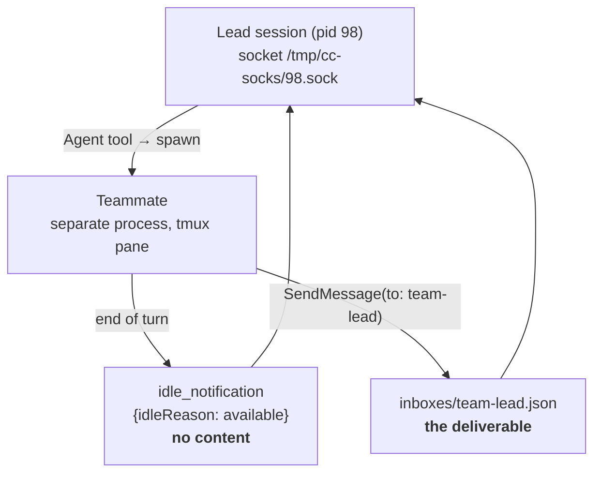
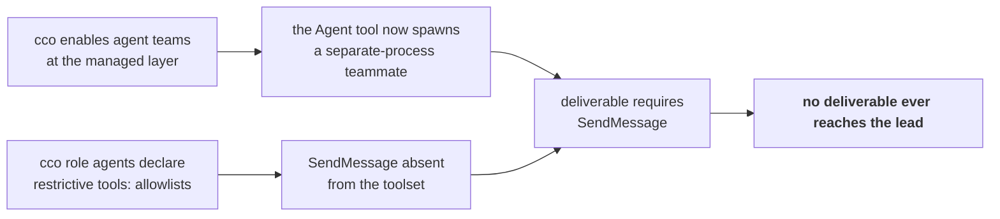

# Analysis: the delegation return channel — why teammate deliverables never reach the lead

> Date: 2026-08-13 · Status: **Analysis complete**, direction approved by the maintainer.
> Closes the investigation opened by **[FI-58](../../../improvements.md)**.
> Decision record: **[ADR-0058](../decisions/0058-teammate-coordination-tools.md)**.
> Prior art deliberately re-checked and **excluded**: ADR-0055 D5 (`EACCES` on subagent transcripts).

---

## 1. Problem statement

Reported by the maintainer as the single most expensive recurring failure. The lead spawns an
agent; the agent visibly does the work in its own tmux pane; the lead reports it *"went idle
without delivering"*, re-triggers it, gets nothing again, and finally redoes the work itself. A
delegated task costs three executions and the surviving one is the worst of the three, because it
fills the lead's context — which is what delegation existed to avoid.

The roadmap fixed one gating question before any hypothesis: **is this cco's surface at all?**
This document answers it, and everything else follows from the answer.

## 2. Method

Four measurement lanes, in this order — the cheap forensic ones first, so the live experiment
would test a hypothesis rather than a hunch:

| Lane | Source | What it can prove |
|---|---|---|
| M1 mechanism | official `llms/code-claude` docs + the installed bundle + live env | what the return channel *is* |
| M2 forensics | 164 session transcripts under the mounted `~/.claude/projects` tree | what happened in past incidents |
| M3 surface | mounts, uids, managed settings, sockets, team state | whether cco owns any link in the chain |
| M4 reproduction | three probe agents spawned live, by toolset shape | the causal step, isolated |

⚠ **The FI-25 mask is ON in this project** (`access: {claude: all}`), so every `.claude` tree
resolves `rw` here. It does not affect this analysis — the defect is in *tool registration*, not in
mount modes — but any re-measurement that touches Axis B must pin the shape with an explicit
`--claude-access`.

## 3. What cco ships, and what it turns the `Agent` tool into

Two configuration facts, both cco's own:

| Setting | Source in repo | Effect |
|---|---|---|
| `CLAUDE_CODE_EXPERIMENTAL_AGENT_TEAMS=1` | `defaults/managed/managed-settings.json:5` | agent teams **on**, at the **managed** layer — the user cannot turn it off |
| `teammateMode: "tmux"` | `defaults/global/.claude/settings.json:46` | teammates get their own tmux pane |

Upstream ships agent teams **disabled by default** and documents them as experimental, with known
limitations *"around session resumption, task coordination, and shutdown behavior"*.

With teams enabled, the `Agent` tool stops being an in-session subagent and becomes a **teammate
spawner**. Measured command line of a live teammate:

```
…/versions/2.1.226 --agent-id probe-sync@session-14e883bb --agent-name probe-sync
                   --team-name session-14e883bb --parent-session-id 0f135143-…
                   --agent-type analyst --dangerously-skip-permissions --model haiku
```

A separate OS process, in its own pane, with its own context and its own transcript. The tool
result the lead receives is **not the report**:

```
Spawned successfully. … agent_id: <name>@session-<team>
The agent is now running and will receive instructions via mailbox.
```

📝 This is returned **even when the caller passes `run_in_background: false`**, so the documented
"synchronous run when you need the result before continuing" is silently unavailable. Independent
of FI-58's root cause; recorded in §8.

## 4. The return channel



Both paths are real and both were observed working. They carry different things:

- The **idle notification** is a liveness signal. Its entire payload is
  `{"type":"idle_notification","from":"…","idleReason":"available"}`. It contains **no** result.
- The **deliverable** travels only through `SendMessage`, landing in
  `~/.claude/teams/<team>/inboxes/team-lead.json` and from there into the lead's context.

A teammate's final assistant text is **not** a return value. When a teammate ends its turn without
calling `SendMessage`, the lead receives the idle notification and nothing else — which the lead
correctly, if unhelpfully, reports to the user as *"finished without delivering"*.

## 5. The defect

**`SendMessage` is not in the toolset of any of the role agents in play**, because every one of them
declares a restrictive `tools:` allowlist and none of those lists contains it:

> **Forward annotation, 2026-08-13**: read the *Source* column strictly — it is load-bearing. Of the
> definitions below, cco **authors only** the two under `defaults/global/`. The six pack roles are
> **user content** (`core-dev-framework` is authored outside cco). See
> [ADR-0058 A1](../decisions/0058-teammate-coordination-tools.md#amendments): the remedy may never
> assume cco can edit them.

| Definition | Source | `tools:` |
|---|---|---|
| analyst · designer · documenter · implementer · reviewer · tester | pack `core-dev-framework/agents/` (mounted `:ro` at `/workspace/.claude/agents/*.md`) | `Read, Grep, Glob, Bash` + `Write, Edit` / `WebFetch, WebSearch` per role |
| analyst · reviewer | `defaults/global/.claude/agents/` | idem |

Per the official reference, `tools` *"inherits all tools if omitted"*; specifying it makes the list
exhaustive. `SendMessage` is absent from every one, so it is absent from the teammate's registry:

```
Error: No such tool available: SendMessage.
SendMessage is disabled for this session, in subagents as well as here.   [2.1.226]
SendMessage exists but is not enabled in this context.                    [2.1.220]
```

### 5.1 The three probes

Spawned live, same trivial task (`head -3 package.json`), differing only in toolset shape:

| Probe | `subagent_type` | `tools:` | Instructed to deliver | Outcome at the lead |
|---|---|---|---|---|
| `probe-sync` | `analyst` | restricted | no | idle notification only |
| `probe-send` | `analyst` | restricted | **yes, explicitly** | idle notification only — the call errored |
| `probe-free` | `general-purpose` | `*` (unrestricted) | yes | **`PROBE-FREE-OK` + payload delivered** |

All three arrived at the lead in a single message, which is the cleanest form the evidence could
take. Two conclusions follow, and the second is the one that constrains the fix:

1. The transport is **healthy**. `probe-free` delivered with a `summary` attribute; the inbox file
   was created and drained. Nothing is broken in mounts, sockets, uids or persistence.
2. 🔑 **Instructing the agent cannot work.** `probe-send` was ordered to deliver, tried, and could
   not. The failure is not an omission by the model — the tool does not exist for it. **Every
   prompt-level remedy is inert on a restricted agent.**

📝 `probe-free` had to call **`ToolSearch` first**: in this build `SendMessage` is a *deferred*
tool. An allowlist that grants `SendMessage` but not the discovery path grants a tool the agent
cannot find. Any fix that enumerates one name is a partial fix.

## 6. Historical confirmation — and a correction

Session `3b6778bf` (2026-08-04, v2.1.220) dispatched **ten `reviewer` teammates** across disjoint
documentation scopes:

- **six** attempted `SendMessage` → all six received `SendMessage exists but is not enabled in this
  context`;
- **four** never attempted it at all;
- **zero** deliverables reached the lead.

The lead then nudged (*"You signalled idle. If your scope is finished, return your final report
now…"*, *"Deliver your report NOW, even if abbreviated — I cannot commit your work…"*) and finally
**re-spawned three** of them. That is the three-executions cost, recorded verbatim in the
transcript. A memory note written by that same session had already concluded it correctly:

> Seven subagents were dispatched on disjoint scopes; four produced nothing on the first dispatch,
> and **NO agent ever returned a report** — only idle notifications.

⚠ **Correction to an intermediate reading in this investigation.** Counting `SendMessage`
*invocations* per transcript suggested a ~60% success rate and an intermittent defect. Reading the
matching **tool_results** instead showed 0 of 17. Counting attempts where the question is outcomes
is the same class of trap already catalogued in `measurement-traps.md`: *prove the oracle
discriminates before believing a pass.*

## 7. Why it looked intermittent

Nothing about the defect is intermittent — it is total and it tracks the **agent type**:

- teammates *do* write to disk (`Bash`, `Write`, `Edit` are in the allowlists), so when the
  deliverable was **files** — `implementer`, `documenter` — the session succeeded and only the
  report was lost;
- when the deliverable was **the report itself** — `analyst`, `reviewer` — everything was lost;
- delegation to an **unrestricted** agent (`general-purpose`, or the built-in `Explore` / `Plan`)
  always worked, because those inherit all tools.

That is exactly the maintainer's own observation — *"analysis agents, or agents with restricted
permissions"* — and it is the discriminator, not a coincidence.

## 8. Ownership

**Not a cco plumbing bug.** Measured and excluded: no `EACCES` anywhere in the chain; the
`~/.claude/projects` tree mounts and persists teammate transcripts correctly (ADR-0055 D5 holds —
teammates wrote under the `-workspace-claude-orchestrator` key exactly as it anticipated); the
lead's messaging socket is bound and listening (`SO_ACCEPTCON`, inode present among pid 98's fds);
team config and inboxes are written and drained.

**It is a cco configuration defect, in two halves that only fail together:**



Either half alone is harmless. A restricted allowlist is fine for an in-session subagent, whose
final text *is* the return value — which is precisely the semantics cco's own definitions are
written in (`analyst.md`: *"returns the document … the lead persists it"*). Enabling teams changes
that contract underneath every definition, and nothing in cco was updated to match.

**Upstream contribution, real but secondary.** The agent-teams documentation states:

> Team coordination tools such as `SendMessage` and the task management tools are **always
> available** to a teammate even when `tools` restricts other tools.

**Measured false on 2.1.220 and 2.1.226.** Worth reporting; cco must not wait for it, and the
remedy must not assume it.

## 9. Collateral findings

Independent of the root cause, surfaced by the same measurements:

1. **`run_in_background: false` is silently ignored** when teams are enabled — the tool returns
   *"Spawned successfully… will receive instructions via mailbox"* regardless. A caller that needs
   the result before continuing has no way to get it.
2. **The team is pinned to the session that created it.** The live team is `session-14e883bb`
   while the live session is `0f135143` (the id changed at `/clear`); `leadSessionId` still names
   the old one, and task files keep being written under the old team directory. The documentation
   states *"one team per session, scoped to that session"*. Not FI-58's cause — messaging works
   because the lead is the same process — but the same neighbourhood, and it is what
   [FI-61](../../../improvements.md) would have to be ruled in or out against.
3. **Two producers emit agent mounts**: `lib/cmd-start.sh:2220` (global tree, via
   `_claude_matrix_mount_mode`) and `lib/packs.sh:192` (pack agents, individual file mounts). The
   six failing roles come from the **pack** — verified byte-identical to the mounted files. Any
   remedy applied at one producer silently misses the other; this is the second clause of
   [FI-63](../../../improvements.md), and the third recurrence of *a named list is a lower bound*.

## 10. Solution space

Recorded here for traceability; the choice belongs to
[ADR-0058](../decisions/0058-teammate-coordination-tools.md).

| # | Approach | Covers user-authored definitions? |
|---|---|---|
| 0 | express restrictions **subtractively** (`disallowedTools:` instead of `tools:`) | no — only what cco writes |
| 1 | **normalize** agent definitions at `cco start`, in the existing overlay pattern | yes |
| 2 | detect and **warn** at start time | no — but it makes the invisible visible |
| 3 | file-based fallback delivery via `Bash` | yes, as a degraded mode |
| 4 | wait for the upstream fix | not actionable |

The maintainer's constraint rules out any approach that depends on the user remembering a
technical detail they are not aware of: *the user sees an error, does not understand it, and blames
cco.* Since cco ships agent teams enabled, cco owns making them work.

⚠ **Prompt-level remedies are excluded by measurement** (§5.1), including "instruct the agent to
deliver". Option 3 survives only in the form *"write the report to a file with `Bash`"*, because
`Bash` is in every allowlist.

## 11. Open questions for the design

> **Forward annotation, 2026-08-13**: questions 1 and 2 were ruled the same day —
> [ADR-0058 D10 and D11](../decisions/0058-teammate-coordination-tools.md). The text below is kept
> as it was written, as the record of what was open at analysis time.

1. **The `entries.agents=rw` cell.** When the user asked for a writable agents tree, projecting a
   normalized copy at the same path means they edit an overlay rather than their file. Same shape
   as A4's mixed cell (ADR-0057 §D8).
2. **Refuse or pass through** when a definition cannot be parsed. Refusing blocks a session on a
   malformed user file; passing through re-opens the silent failure.
3. **Security posture.** Injecting `SendMessage` grants every restricted agent a cross-session
   communication channel — in a product whose model is explicit access boundaries, and where
   upstream has already hardened messaging against *permission laundering*. Defensible, but it
   should be **declared**, not incidental.
4. **Coupling to the knob.** If agent teams become configurable, the injection must be a function
   of the same knob and computed once (ADR-0057 D10), not a constant.

## 12. What this analysis did not measure

- No reproduction **outside cco** was run. It became unnecessary: the causal step is a property of
  the agent definitions and of a documented tool-registration rule, both readable without a
  control. A control would still be needed before filing the upstream report, to show the
  behaviour on a stock installation with no cco configuration present.
- Only `analyst` and `general-purpose` were probed live. The other five roles are covered by the
  same mechanism and by the 2026-08-04 `reviewer` evidence, but they were **not** individually
  measured.
- `TaskCreate`/`TaskUpdate` availability inside a restricted teammate was **not** probed directly;
  it is inferred from the same allowlist rule and from the documented "task status can lag"
  limitation.
