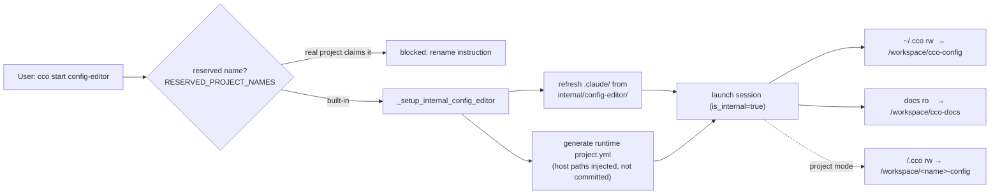
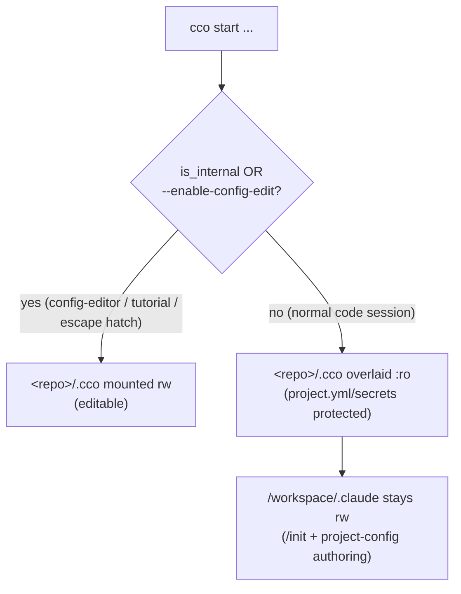

# Config-Editor Project — Design

> **Status**: Current — config-editor is a framework-internal resource
> **Prerequisite**: [analysis](../analysis/analysis-001-config-editor.md) ·
> [ADR-0027](../../../configuration/decentralized-config/decisions/0027-config-editor-builtin-and-edit-protection.md)

This is a living design doc: it reflects the current/target behavior and is
rewritten in place (see `.claude/rules/documentation-lifecycle.md`).

---

## 1. Design Overview

config-editor is a framework-internal session at `internal/config-editor/`. It is
**not** scaffolded into the user's store and does **not** appear in `cco list` —
`cco start config-editor` launches it directly, refreshing its runtime content
from source on every start (exactly like the tutorial).

Its purpose is the inverse of the tutorial's: where the tutorial *teaches* with a
read-only view, config-editor is a hands-on **configuration assistant** with
read-write access to the personal store `~/.cco`. The lead agent IS the assistant
— there is no dedicated subagent. The project CLAUDE.md provides behavior and a
documentation map; one rule (`config-safety.md`) and two skills
(`/setup-project`, `/setup-pack`) round it out.



### 1.1 Key Design Decisions

| Decision | Choice | Rationale |
|----------|--------|-----------|
| Distribution | **Built-in** (`cco start config-editor`) | Always current; no install, no update tracking (ADR-0027 D1). |
| Agent model | Lead (inherits session model) | Interactive dialogue; no delegation overhead. |
| `~/.cco` mount | **read-write** | Editing the personal store is the purpose. |
| Docs mount | **read-only** | Accurate guidance, zero staleness, no duplication. |
| Project mode | Optional `<repo>/.cco` **rw** | Edit a project's committed config when requested. |
| `project.yml` | **Generated at runtime**, never committed | Host paths injected at start time → AD3/G8 hold by construction. |
| Edit-protection | **Exempt** (`is_internal=true`) | This is the sanctioned agentic editing path (ADR-0027 D3). |
| Knowledge packs | None | Self-contained; docs mounted live. |
| `settings.json` | Empty `{}` | Inherits global settings. |

---

## 2. Project File Structure

```
internal/config-editor/
├── .claude/
│   ├── CLAUDE.md                     # Role, layout, operational guidelines, doc map
│   ├── settings.json                 # Empty {} (inherits global)
│   ├── agents/.gitkeep               # No dedicated agents
│   ├── rules/
│   │   └── config-safety.md          # Safety constraints (secrets, deletes, overwrites)
│   └── skills/
│       ├── setup-project/SKILL.md    # /setup-project — project creation wizard
│       └── setup-pack/SKILL.md       # /setup-pack — pack creation wizard
├── memory/.gitkeep                   # Memory placeholder
└── setup.sh                          # Minimal runtime setup (no-op by default)
```

**Notes**:
- No `project.yml` is committed in source — it is generated at runtime (see §3).
  The committed tree carries only `.claude/`, `memory/`, and `setup.sh`.
- No `/tutorial` skill and no curriculum — config-editor is task-driven, not a
  guided course.
- No `.cco/` metadata — internal resources don't participate in the update system.

---

## 3. Generated `project.yml` and Mount Structure

`_setup_internal_config_editor` (`lib/cmd-start.sh`) generates `project.yml` into
the runtime dir (`$USER_CONFIG_DIR/.cco/internal/config-editor/`) on every start.
There are **no `repos:`** — config-editor is about configuration, not code. Mounts
are expressed as named `extra_mounts`; the host paths behind those names are
supplied by an **in-process session mount override**, never written into a
persistent index or a committed file (review H4, AD3/G8).

### 3.1 Global mode (default)

```yaml
name: config-editor
description: "Configuration editor for claude-orchestrator"
extra_mounts:
  - name: cco-config            # → ~/.cco
    target: /workspace/cco-config
    readonly: false             # rw: editing the personal store is the purpose
  - name: cco-docs              # → <repo>/docs
    target: /workspace/cco-docs
    readonly: true
docker:
  mount_socket: false
  ports: []
  env: {}
auth:
  method: oauth
```

### 3.2 Project mode

`cco start config-editor --project <name>` (or launching from a cwd that
hosts/belongs to a configured repo) resolves the target's `<repo>/.cco` via the
STATE index and appends a third rw mount:

```yaml
  - name: <name>-config         # → <repo>/.cco
    target: /workspace/<name>-config
    readonly: false
```

### 3.3 Resolved mount table

| Host source | Container target | Mode | Mode availability |
|---|---|---|---|
| `~/.cco` (personal store) | `/workspace/cco-config` | rw | always |
| `<repo>/docs` (framework docs) | `/workspace/cco-docs` | ro | always |
| `<repo>/.cco` (target project) | `/workspace/<name>-config` | rw | project mode only |

**Excluded by design**: STATE/CACHE/DATA buckets (index, `tags.yml`, remotes,
caches, transcripts). They are internal and never mounted — managed only via
`cco …`.

---

## 4. CLAUDE.md Behavior Rules

The project CLAUDE.md (`internal/config-editor/.claude/CLAUDE.md`) frames the
agent as a **configuration assistant**, not an autonomous executor. It defines:

- **Role**: help users create/edit packs, templates, global rules/skills/agents,
  and a project's committed `.cco/`; version & sync the store; share via a sharing
  repo; optimize existing configs against best practices.
- **Responsible write access**:
  1. Always explain what will change and why **before** modifying files.
  2. Get explicit approval before destructive operations (delete, overwrite).
  3. Suggest the exact `cco` commands the user runs on the host.
- **Documentation map**: a topic→path table over `/workspace/cco-docs/` (project
  setup, knowledge packs, configuring rules, CLI reference, project.yml reference,
  context hierarchy, custom environment, authentication, troubleshooting).
- **Layout**: the `~/.cco` tree (global, packs, templates, top-level
  `setup.sh`/`mcp-packages.txt`) and, in project mode, the `<repo>/.cco/` tree
  (`project.yml`, `claude/`, `secrets.env.example`, `.gitignore`).
- **Operational guidelines**: version with `cco config save`; sync with `cco
  config push/pull`; create projects via `/setup-project` or host `cco init`;
  create packs via `/setup-pack` or directly under `~/.cco/packs/<name>/`; share
  via a sharing repo (`cco pack publish` / `cco pack install`), never by
  publishing the personal store.

### 4.1 `config-safety.md` (rule)

The always-loaded safety rule encodes the non-negotiables:

- **Before modifying**: check existence and show the diff if overwriting; validate
  YAML after `project.yml` edits and keep it machine-agnostic (logical names +
  coordinates, never real host paths); after `pack.yml` edits remind the user to
  run `cco pack validate` on host.
- **Protected content**: never write real secret values into a committed file
  (`secrets.env` is gitignored/host-edited; only `*.example` skeletons are
  committed); never delete projects or packs without explicit confirmation;
  never touch internal data (index, `tags.yml`, remotes, caches, transcripts) —
  it is not mounted and is managed only via `cco …`.
- **Versioning/sharing awareness**: remind to `cco config save` / `cco config
  push` after significant edits; reference the sharing-repo flow (no
  `manifest.yml`).
- **cco commands**: host-only — show the exact command and explain it.

---

## 5. Skills

| Skill | Purpose | Notes |
|-------|---------|-------|
| `/setup-project` | Assisted project-creation wizard | Decentralized model: a project's config lives in its own repo at `<repo>/.cco/`, scaffolded on the host with `cco init`. In project mode the wizard can edit the mounted `<repo>/.cco/` directly after `cco init` has scaffolded it. |
| `/setup-pack` | Assisted pack-creation wizard | Creates packs under `~/.cco/packs/<name>/` (mounted rw at `/workspace/cco-config/packs/`). Applies composability best practices; reminds to `cco pack validate` and `cco config save` on host. |

Both skills mirror the tutorial's wizards but assume **read-write** access to the
personal store (the tutorial versions had to check for/instruct toward rw access;
config-editor has it by default). They still defer host-only `cco` commands to the
user.

---

## 6. Edit-Protection Mechanism

config-editor is the **sanctioned agentic editing path**. In a *normal* `cco
start` session, ADR-0027 D3 overlays the committed structural framework config
(`<repo>/.cco`: `project.yml`, `secrets.env`, internal metadata) **read-only**
inside the container so a code-working agent cannot involuntarily mutate it. The
project's Claude config tree (`/workspace/.claude`) stays rw so `/init` and normal
project-config authoring keep working.

Grounded in `lib/cmd-start.sh` (compose generation):

```bash
local _committed_ro=":ro"
if $is_internal || $enable_config_edit; then _committed_ro=""; fi
```

Because config-editor sets `is_internal=true`, the `:ro` overlay is suppressed —
its `~/.cco` and any project-mode `<repo>/.cco` mounts stay read-write. The same
exemption applies to the tutorial (also `is_internal`). A normal session can
opt in once with `cco start --enable-config-edit`, but the recommended path for
agentic config editing is config-editor.

This guardrail is **container-only** (the host IDE always edits `~/.cco` and
`<repo>/.cco` freely), **per-session** (no managed image change, no `cco build`),
and **not overridable** by in-session settings.



---

## 7. Session Flow

```mermaid
sequenceDiagram
  participant U as User (host)
  participant CLI as cco (host)
  participant A as config-editor agent (container)
  U->>CLI: cco start config-editor [--project <name>]
  CLI->>CLI: reserved-name check; _setup_internal_config_editor
  CLI->>CLI: refresh .claude/, generate runtime project.yml
  CLI->>A: launch (~/.cco rw, docs ro, [<repo>/.cco rw])
  A->>A: read /workspace/cco-config (existing packs/templates/global)
  U->>A: "create a pack for acme backend"
  A->>U: explain plan, propose structure, get approval
  A->>A: write files under /workspace/cco-config/packs/<name>/
  A->>U: "run on host: cco pack validate <name>; cco config save"
  U->>CLI: cco config save / cco pack validate (host)
```

1. **Launch & materialize**: reserved-name check, refresh `.claude/` from source,
   generate the runtime `project.yml` with injected host paths.
2. **Orient**: the agent reads the mounted `~/.cco` (packs, templates, global) to
   ground its suggestions in the user's actual setup.
3. **Edit with approval**: explain the change, get consent, write files; show the
   diff before overwriting; require confirmation for deletes; never write real
   secrets.
4. **Activate on host**: surface the exact host-only `cco` commands to validate
   and persist (`cco pack validate`, `cco config save`, `cco config push`, `cco
   start`).

---

## 8. Relationship to the Tutorial

config-editor and the tutorial are deliberately complementary built-ins:

- **tutorial** — read-only teacher; explains, never edits; points users to
  config-editor for hands-on work. See the
  [tutorial design](../../tutorial/design/design-tutorial.md).
- **config-editor** — read-write assistant; the sanctioned path for agentic
  configuration editing.

They share one code path (`_setup_internal_*`, reserved-name handling,
`is_internal` exemption), differing only in mount modes (ro vs rw `~/.cco`),
behavior rule, and skill set.
