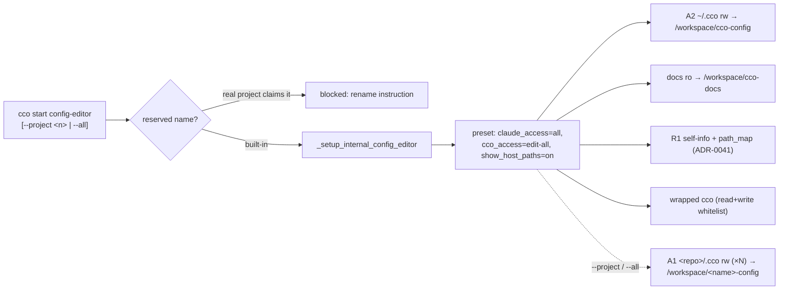

# Config-Editor Project — Design

> **Status**: Target design per [ADR-0036](../../../configuration/decentralized-config/decisions/0036-session-config-capability-model.md)
> (session config capability model) + [ADR-0041](../../../configuration/decentralized-config/decisions/0041-unified-session-info-surface.md)
> (R1 self-info). **Implementation pending** — this living doc describes the agreed target;
> the shipped code is the pre-capability-model config-editor (ADR-0027) until the handoff
> implementation lands.
> **Prerequisite**: [analysis](../analysis/analysis-001-config-editor.md) · ADR-0027 (built-in +
> edit-protection, **generalized** by ADR-0036)

This is a living design doc: it reflects the current/target behavior and is rewritten in place
(see `.claude/rules/documentation-lifecycle.md`). The general model lives in ADR-0036/0041;
this doc describes config-editor **as a preset/consumer** of that model — it does not duplicate
the model's rationale.

---

## 1. Design Overview

config-editor is a framework-internal session at `internal/config-editor/`, materialized at
runtime like the tutorial (reserved name, generated `project.yml`, `is_internal=true`). Its
purpose is a hands-on **configuration assistant**: the sanctioned agentic path for editing the
user's cco configuration. The lead agent IS the assistant — no dedicated subagent.

Under the capability model (ADR-0036), config-editor is simply the **maximal edit preset**:

| Knob | Value | Effect |
|------|-------|--------|
| `claude_access` | `all` | B1/B2/B3 `.claude` trees rw (incl. global `~/.cco/.claude`) |
| `cco_access` | `edit-all` | A1 `<repo>/.cco` + A2 `~/.cco` (incl. packs/templates) rw; A3 (tags/remotes/…) rw **via wrapped `cco`** |
| `show_host_paths` | `on` (default) | R1 `path_map` + host-path labelling in read output |

A maintainer can narrow it per session (`--cco-access edit-project` / `edit-global`,
`--claude-access repo`, `--no-show-host-paths`) — config-editor is not special-cased, it is a
named default over the same knobs.



---

## 2. Project File Structure

```
internal/config-editor/
├── .claude/
│   ├── CLAUDE.md                     # Role, layout, doc map, wrapped-cco usage, path-map note
│   ├── settings.json                 # Empty {} (inherits global)
│   ├── agents/.gitkeep               # No dedicated agents
│   ├── rules/
│   │   └── config-safety.md          # Safety constraints (secrets, deletes, host-path leaks)
│   └── skills/
│       ├── setup-project/SKILL.md    # /setup-project — project creation wizard
│       └── setup-pack/SKILL.md       # /setup-pack — pack creation wizard
├── memory/.gitkeep
└── setup.sh                          # Minimal runtime setup (no-op by default)
```

- No committed `project.yml` — generated at runtime (§3).
- No `.cco/` metadata — internal resources don't participate in the update system.

---

## 3. Generated `project.yml`, mounts, and the wrapped-`cco` surface

`_setup_internal_config_editor` (`lib/cmd-start.sh`) generates `project.yml` into the STATE
internal runtime dir on every start. Host paths behind the named mounts are supplied by the
in-process mount override (`_CCO_MOUNT_OVERRIDE`), never persisted (AD3/G8 — review H4).

### 3.1 Mounts (driven by the resolved preset)

| Host source | Container target | Mode | When |
|---|---|---|---|
| `~/.cco` (A2 personal store) | `/workspace/cco-config` | rw | always (`edit-*` incl. global) |
| `<repo>/docs` (framework docs) | `/workspace/cco-docs` | ro | always |
| `<repo>/.cco` (A1 target project) | `/workspace/<name>-config` | rw | `--project` / cwd (per target) |
| each resolved member `<repo>/.cco` | `/workspace/<name>-config` | rw | `--all` (skip unresolved) |
| DATA bucket (tags/remotes/source) | (operator paths) | rw | for wrapped-`cco` A3 writes |
| STATE index | (operator path) | ro | for wrapped-`cco` listings |

**Excluded by design**: STATE `remotes-token` (secrets — host-only), CACHE, transcripts.
`--all`/`--project` mount **only `<repo>/.cco`**, never full code repos (ADR-0036 D6).

### 3.2 Wrapped `cco` (ADR-0036 D4)

config-editor runs `cco` in-container behind the **whitelist shim** in **container-operator
mode** (`CCO_CONTAINER_OPERATOR=1` + `CCO_*_HOME` → mounted buckets). Allowed: the path-free
read verbs + (under `edit-all`) the path-free write verbs that mutate CONFIG or internal XDG
**through the shared `cco` functions** (`tag`, `remote add|remove`, `pack|template|llms *`,
`config save|pull|push`). Blocked: `start/stop/build/new`, `resolve/sync/init/join/forget/
update/clean/project rename`, and token verbs (`remote set-token|remove-token` — host-only).
Internal XDG (A3) is **never** hand-edited — only via these verbs.

### 3.3 R1 self-info + path map

The R1 surface (ADR-0041) gives config-editor its project structure + knowledge/llms index +,
since `show_host_paths=on`, the labelled `host → /workspace/<target>` path map so the agent can
hand the user exact host commands.

---

## 4. CLAUDE.md behavior & `config-safety.md`

The CLAUDE.md frames the agent as a **configuration assistant** (not an autonomous executor):
explain-before-write; approval before destructive ops; edit hand-editable config directly by
convention, mutate internal state **only via wrapped `cco`**; surface host-only `cco` commands
using the R1 path map. Plus the documentation map over `/workspace/cco-docs/`.

`config-safety.md` (always-loaded) encodes the non-negotiables, updated for the model:

- **Before modifying**: check existence, show diffs on overwrite; validate YAML after
  `project.yml`; keep committed config machine-agnostic (logical names, never host paths).
- **Two edit mechanisms**: hand-edit A1/A2 files (YAML/text) by convention; mutate A3
  (tags/remotes/index) **only via `cco`** — never a raw file edit (corruption risk).
- **Secrets**: never write real secret values into committed files; `remotes-token` is host-only
  and not mounted; only `*.example` skeletons are committed.
- **Host paths**: the path map shows the **user's host paths** mounted at `<target>`; **do not
  paste host paths into commits / PRs / external calls** (ADR-0036 D2/D4).
- **cco commands**: blocked verbs are host-only — show the exact command (using the path map)
  and explain it.

---

## 5. Skills

| Skill | Purpose | Notes |
|-------|---------|-------|
| `/setup-project` | Assisted project-creation wizard | Decentralized: a project's config lives in its repo at `<repo>/.cco/`, scaffolded on host with `cco init`. In project mode the wizard edits the mounted `<repo>/.cco/` after scaffold. |
| `/setup-pack` | Assisted pack-creation wizard | Creates packs under `~/.cco/packs/` (A2, mounted rw). Applies composability best practices; reminds to `cco pack validate` + `cco config save` (host or wrapped-`cco`). |

Both assume rw access to the personal store (config-editor's `edit-all` preset) and defer the
blocked/host-only `cco` verbs to the user.

---

## 6. Edit-protection & the capability model

config-editor is the **maximal edit preset**; a *normal* session defaults to
`claude_access=repo` + `cco_access=none` (ADR-0027's edit-protection generalized — ADR-0036 D2).
The `is_internal` exemption becomes "this session's preset is `edit-all`". A normal session can
opt into narrower edit levels (`--cco-access edit-project`, the successor to
`--enable-config-edit`) without launching config-editor.

Guardrail properties are unchanged: **container-only** (host IDE always edits freely),
**per-session** (no image change / `cco build`), **not overridable** by in-session settings.

---

## 7. Session Flow

```mermaid
sequenceDiagram
  participant U as User (host)
  participant CLI as cco (host)
  participant A as config-editor agent (container)
  U->>CLI: cco start config-editor [--project &lt;n&gt; | --all]
  CLI->>CLI: reserved-name check; resolve preset (edit-all); _setup_internal_config_editor
  CLI->>A: launch (~/.cco rw, docs ro, [targets rw], wrapped-cco, R1 + path_map)
  A->>A: read R1 self-info + /workspace/cco-config to ground suggestions
  U->>A: "create a pack for acme backend"
  A->>U: explain plan, propose structure, get approval
  A->>A: write files under /workspace/cco-config/packs/<name>/ (hand-edit)
  A->>A: cco pack validate <name> (wrapped-cco, whitelisted)
  A->>U: "run on host (path map): cd <HOST_PATH> && cco config save"
```

---

## 8. Relationship to the tutorial

Both are presets of the one capability model (ADR-0036 D6), sharing the code path
(`_setup_internal_*`, reserved names, preset resolution, wrapped-`cco` shim):

- **tutorial** — `cco_access=read`, `claude_access=none`: read-only teacher; reads all configs +
  global via read-only wrapped `cco`; never edits. See the
  [tutorial design](../../tutorial/design/design-tutorial.md).
- **config-editor** — `cco_access=edit-all`, `claude_access=all`: the maximal edit preset.
