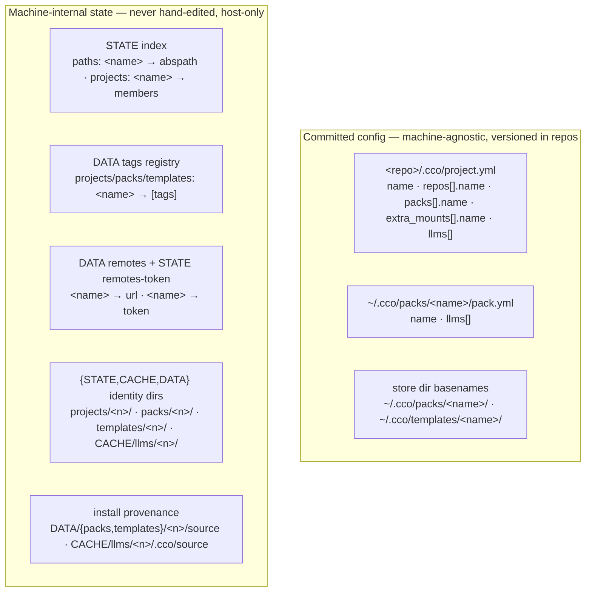

# Resource Name/ID Storage Map — Reference

**Domain**: `naming/` (resource naming & rename — `feat/naming/resource-management`)
**Class**: living reference / analysis (fotografa la verità corrente; da riscrivere in place
quando cambia). **Not** a decision record — the decisions live in the forthcoming
resource-rename ADR (candidate **#0050**, which generalizes **ADR-0031** `cco project rename`).
**Produced**: 2026-07-14, from a full read of `lib/{index,paths,tags,remote,packs}.sh` +
`lib/cmd-{project-rename,llms,pack,template,remote,resolve,init,join,sync,forget}.sh`.

## 1. Why this document exists

Every cco resource has a **logical name** (its identity). That name is stored and referenced
in more than one place. To rename a resource correctly you must re-key **all** of them, or the
stores diverge. This map is the authoritative answer to *"where does the name of a `<kind>`
live?"* — the input to designing `cco <kind> rename` for the kinds that still lack it, and a
standing reference for any future task that touches identity (init, join, sync, forget,
resolve, path, share/publish).

Resource kinds: **project, repo, pack, template, llms, remote, extra_mount**.

## 2. Two persistence layers

A resource name can live in either or both of two independent layers:



- **Committed config** is the machine-agnostic source of truth for *user-authored* references
  (which packs/llms/repos a project uses). Versioned with the repo's own git; a cross-repo
  rename edit here cannot be transactional and is delegated to git (P17).
- **Machine-internal state** is corruption-prone and mutated **only** via `cco` helpers
  (`_index_*`, `_tags_*`, `cco remote …`). Never hand-edited (managed-rule invariant).

## 3. The storage map (authoritative)

For each kind, every location its name appears. `—` = not applicable.

| Kind | Committed config | STATE index | Tags (DATA) | Identity dirs | Other stores |
|---|---|---|---|---|---|
| **project** | `project.yml` `name:` (in **every** member repo) | key of `projects:` | `projects:` | `{STATE,CACHE,DATA}/projects/<n>/` | — |
| **repo** | `project.yml` `repos[].name` (in **every** project that includes it) | key of `paths:` **and** a token in `projects:` membership values | — | — | — |
| **pack** | `project.yml` `packs[].name` · `pack.yml` `name:` | — | `packs:` | `STATE/packs/<n>/` | `DATA/packs/<n>/source` |
| **template** | — (discovery-only, no committed reference) | — | `templates:` | `STATE/templates/<n>/` | `DATA/templates/<n>/source` |
| **llms** | `project.yml` `llms[]` · `pack.yml` `llms[]` | — | — (not taggable) | `CACHE/llms/<n>/` | `CACHE/llms/<n>/.cco/source` |
| **remote** | — (registered via `cco remote add`, not versioned) | — | — | — | `DATA/remotes` (name→url) · `STATE/remotes-token` (name→token, 0600, never-sync) |
| **extra_mount** | `project.yml` `extra_mounts[].name` | key of `paths:` (same layer as repos) | — | — | — |

### 3.1 Index structure (`lib/index.sh`)

STATE `index` file, two sections:

```yaml
version: 1
paths:                 # logical name → absolute path (GLOBAL flat map)
  backend: "/abs/path/to/backend"
  shared-mount: "/abs/path/to/mount"
projects:              # project name → space-separated member (repo/mount) names
  app-a: "backend web"
  app-b: "backend"
```

- `paths:` is keyed by **repo/extra_mount name** (not by the directory basename, not by
  project name). Value = absolute path. Normalized to absolute at the write boundary
  (`_index_normalize_path`).
- `projects:` maps a **project name** → its member **repo names**. Reverse lookup
  (`_index_repos_get_projects`, `index.sh:270`) yields every project referencing a repo.
- Uniqueness (AD5, `index.sh:229`): one logical name → one path (enforced by callers
  init/join/resolve, not the index).

## 4. Two structural families (determines rename mechanics)

| Family | Kinds | Name is… | Rename must… |
|---|---|---|---|
| **Index-keyed** | repo, extra_mount | the **key** of `paths:` (+ tokens in `projects:` membership) | re-key `paths:`, rewrite every `projects:` membership list containing it, rewrite `repos[]`/`extra_mounts[].name` in **every** referencing `project.yml` |
| **Directory-keyed** | pack, template, llms | the **basename** of a store directory | `mv` the store dir(s), rewrite committed references, move provenance + STATE/DATA sidecars, re-key tags |
| *(special)* **project** | project | `project.yml name:` = index `projects:` key = identity-dir basename = tags key | the full 6-store re-key already implemented by ADR-0031 |
| *(special)* **remote** | remote | single registry key (`DATA/remotes`) + token file key | re-key the registry entry + migrate the token file |

## 5. Mono-repo vs multi-repo, project-name vs repo-name

**Project name and repo name are independent axes.** `cco init`/`cco join` derive the repo
name from `--repo-name` › interactive prompt › **dir basename**, independently of `--name`
(the project) — same coordinate model as the join model (ADR-0017 D1/D2). Their coincidence is
incidental, never structural.

```mermaid
flowchart LR
  subgraph projects["projects (identity: project.yml name:)"]
    PA["app-a"]
    PB["app-b"]
  end
  subgraph repos["repos (identity: index paths: key)"]
    RB["backend"]
    RW["web"]
  end
  PA -->|repos[]| RB
  PA -->|repos[]| RW
  PB -->|repos[]| RB
```

Cases the design must keep distinct:

| Case | Shape | Naming relationship |
|---|---|---|
| **mono-repo** | project has 1 member repo | `project name == repo name` (both default to basename) **or** they diverge (e.g. `--name`/`--repo-name`) — must not assume equality |
| **multi-repo** | project spans N repos | `project name` ≠ (some/all) `repo name`s; at most one repo may share the project's name |
| **shared repo** | 1 repo, M projects | the **same** `repo name` appears in `repos[]` of M different `project.yml`s + M membership lists |

**Consequences for rename correctness:**

1. **Kind-scoped.** `cco repo rename api …` must touch only the repo store; it must **not**
   rename the project named `api` (or vice-versa), even when the names coincide. The re-key
   operates on one family's stores only.
2. **Cross-project fan-out for shared repos.** Renaming a repo that M projects reference must
   rewrite `repos[].name` in **M** `project.yml`s **and** M membership lists in the index —
   the repo analogue of ADR-0031's cross-*repo* project.yml fan-out. Inherit ADR-0031 D3
   strictness: refuse unless every affected member/project resolves locally, else the
   un-rewritten copies diverge under `cco sync`'s clobber-guard.

## 6. Uniqueness & sharing invariants

- **Repo/extra_mount name**: globally unique in `paths:` (one name → one path). Per-project
  namespacing is reserved post-v1 (H7, `index.sh:23`).
- **A path hosts one project config** (`<repo>/.cco/project.yml name:`), but a **repo name can
  be a member of multiple projects** (officially supported one-repo-multiple-projects model;
  drives `forget` shared-repo guard, `project show`, `join`).
- **Pack/template/llms name**: unique within its store (dir basename). Not index-keyed, so no
  path divergence.
- **Remote name**: unique registry key; single source of truth.

## 7. Existing rename precedents (what they touch / omit)

### `cco project rename` (ADR-0031) — the complete model, 6 stores

| # | Store | Change | Helper |
|---|---|---|---|
| 1 | `project.yml name:` (every member repo) | `<old>`→`<new>` | `_sed_i` + user commit (git-delegated) |
| 2 | STATE index `projects:` | re-key, members preserved | `_index_rename_project` (`index.sh:260`) |
| 3 | DATA tags `projects:` | re-key, tags carried | `_tags_rename projects` (`tags.sh:126`) |
| 4–6 | `{STATE,CACHE,DATA}/projects/<old>/` | `mv` to `<new>` | `mv` (no-op if absent) |

Strict (D3): refuses unless every member repo resolves locally. Machine-local phase (2–6)
applied atomically; cross-repo phase (1) delegated to git with a commit+push+sync reminder.

### `cco llms rename` — directory-keyed precedent, 3 stores

| # | Store | Change | Method |
|---|---|---|---|
| 1 | `CACHE/llms/<old>/` | `mv` to `<new>` (provenance `.cco/source` moves with it) | `mv` |
| 2 | `pack.yml` `llms:` (all packs) | replace `- <old>` → `- <new>` | `_llms_rename_in_yaml` (awk, `cmd-llms.sh:635`) |
| 3 | `project.yml` `llms:` (all projects) | replace `- <old>` → `- <new>` | `_llms_rename_in_yaml` |

Omits `_tags_rename` — harmless because llms are **not taggable** (`_list_tag_kind` excludes
them). Its `_llms_rename_in_yaml` reference-scanner is the seed for a **generic** committed-
reference rewriter to be shared by pack/repo/extra_mount rename.

## 8. Kinds with NO rename command — required update-set each

| Kind | Full rename would need |
|---|---|
| **repo** | re-key `paths:` (new `_index_rename_path`) · rewrite `projects:` membership in every referencing project · rewrite `repos[].name` in every referencing `project.yml` · optional `mv` of the on-disk dir (user territory → prompt) |
| **pack** | `mv ~/.cco/packs/<old>/` · `pack.yml name:` · `packs[].name` in every `project.yml` · `mv STATE/packs/<old>/` · `mv DATA/packs/<old>/source` · `_tags_rename packs` |
| **template** | `mv` store dir · `mv STATE/templates/<old>/` · `mv DATA/templates/<old>/source` · `_tags_rename templates` (no committed reference to rewrite) |
| **remote** | re-key `DATA/remotes` entry · migrate `STATE/remotes-token` entry if present |
| **extra_mount** | rewrite `extra_mounts[].name` in every referencing `project.yml` · re-key `paths:` · rewrite `projects:` membership · optional `mv` of the on-disk dir (prompt) |

Missing internal primitives: **`_index_rename_path`** (re-key a `paths:` key + all membership
tokens), a **generic committed-reference rewriter** (generalize `_llms_rename_in_yaml` across
`repos[]`/`packs[]`/`extra_mounts[]`/`llms[]`), and `_tags_rename` calls for pack/template.

## 9. Two UX issues surfaced (name/path divergence & input)

### 9.1 Repo-name staleness after a directory rename — *by design, not a bug*

In the index the repo name is the **key** and the path is the **value**. `cco resolve` and
`cco path set` rewrite only the **value** (`_index_set_path`), never the key, and never touch
`project.yml`. There is no `_index_rename_path`. So: rename the dir on disk → update the path →
the **name stays old everywhere** (index key + `repos[].name` in every `project.yml`). The
"resolve fixes everything" flow does not exist by design — the fix is a dedicated
`cco repo rename` (§8), plus a divergence **hint** from `path set`/`resolve` when the index key
no longer matches the directory basename.

### 9.2 Quotes not stripped in interactive path input

`lib/local-paths.sh:141-147` (`_prompt_for_path`): `read -r reply` keeps surrounding quotes
literal (`-r` blocks backslash escapes, not quote removal); `_resolve_to_abs` / `expand_path`
do tilde-expansion only, no quote strip. Entering `'/my/path'` yields a non-existent path and
validation fails. Fix direction: strip one layer of matched surrounding `'`/`"` before
absolutizing (bash-consistent paste behavior).

## 10. Mismatch-risk classification (for future audits)

| Kind | Name storage | Dir keying | Divergence risk | Root cause |
|---|---|---|---|---|
| project | `project.yml name:` | index key + state-dir basename | **Low** | rename enforces sync across all 6 stores |
| **repo** | `project.yml repos[].name` | index `paths:` key (not dir basename) | **Medium** | user renames dir; `resolve`/`path set` update path only, key drifts from disk |
| **extra_mount** | `project.yml extra_mounts[].name` | index `paths:` key | **Medium** | same as repo |
| pack | `pack.yml name:` + `packs[].name` | dir basename | **Low** | scan uses `basename`; no stored key to drift |
| template | — | dir basename | **Low** | discovery scan-based |
| llms | `project.yml`/`pack.yml` `llms[]` | CACHE dir basename | **Low** | `llms rename` keeps refs in sync |
| remote | `DATA/remotes` key | registry key | **Very low** | single source of truth |

## 11. Out-of-CLI: post-rename staleness in prose

Renaming a repo/project can leave stale references in `docs/`, `CLAUDE.md`, and other prose
inside the repos — **not** resolvable by `cco` (they are free-text). This is agent territory,
a natural fit for the `init-workspace` re-analysis task (ADR-0049 §6): a "refresh references
after rename" responsibility. Tracked there, not in the rename CLI.

## 12. Identity model — path is the resource, name is a per-project label

**Load-bearing principle for repo & extra_mount (the index-keyed kinds).** The *identity* of a
repo or extra_mount is the **host path** it resolves to (the working tree / mount on disk). The
**name is only a per-project label** for that path. Two consequences that any feature touching
these resources must obey:

- **Same path ⇒ same resource** — even under different names (aliases). Two projects that both
  point a member at `/abs/backend` reference the *same* repo, whatever they call it.
- **Same name + different path ⇒ different resources** — homonyms that are conceptually
  distinct. `assets → /a/assets` in project A and `assets → /b/assets` in project B are two
  different mounts that merely share a label.

**Classification rule (for all current and future code): decide resource-sameness by PATH
coincidence, never by NAME coincidence.** Anything that needs to know "is this the same
resource?" — rename (which references to rewrite), `resolve`/`cco path` (dedup, divergence
hints), a future lock/sharing/GC feature — must compare **paths**, not names. Name-based
identity is only valid *within a single project's scope*, where the name→path map is 1:1.

This principle **reverses the v1 assumption** that a bare name is a global identity (the
global-flat index, AD5). It is formalized as the per-project name-scoping model in **ADR-0051**
(§13) and is why repo/extra_mount `rename` becomes project-scoped and path-anchored
(ADR-0050, revised).

## 13. Per-project name scoping (ADR-0022 D2 / H7 — the deferral now firing)

**v1 model (today):** the STATE index is **global-flat** — `paths: <name> → abspath` is one
machine-global map with **AD5** ("one logical name → one absolute path per machine"), so a
repo/extra_mount name is globally unique. This buys a real UX win **(V)**: a new project reusing
an already-resolved name needs no path re-specification — the global binding resolves it for
free. ADR-0022 D2 ratified global-flat for v1 and **deferred** per-project namespacing to
"when real cross-project name collisions appear" (`lib/index.sh:23`, roadmap `Index per-project
namespacing`).

**The trigger has fired** — two collision cases that global-flat cannot represent:

1. **Sharing / import**: an imported external project references a repo/extra_mount name that
   already exists on the target machine bound to a **different** path (often a **different repo
   `url`** — a divergence signal). Global-flat **refuses** (`cco project import` /
   `_index_path_conflicts`), or would mis-bind.
2. **Generic mount names, same machine**: different projects legitimately use generic
   extra_mount names (`assets`, `resources`) pointing at **different** paths. Global-flat cannot
   hold both — no meaningful "global default" exists for such a name.

**Decision → per-project scoping (ADR-0051).** repo/extra_mount names become **scoped to their
project** (identity = path, §12; name = per-project label). No global-default layer (a global
default is meaningless for case 2). The UX win **(V)** is preserved not by a global binding but
by an **add-time suggestion + disambiguation prompt**: when a name already exists in other
projects, cco surfaces the existing binding(s) and asks **reuse that path (same resource) or
specify a different path (homonym)** — with a warning when the on-disk `git remote` at the
existing path diverges from the incoming coordinate `url` (case 1's signal).

### 13.1 Blast-radius of the schema change (index consumers)

Verified inventory of `lib/index.sh` consumers (grep across `lib/`+`bin/`):

| Index helper | Sites | Under per-project scoping |
|---|---|---|
| `_index_path_conflicts` | 2 (`cmd-resolve.sh:537`, `migrate.sh:1039`) | **The single chokepoint** — becomes `(project, name, path)`-aware; all uniqueness enforcement flows from here |
| `_index_get_path` | ~25 | ~17 must become project-aware; 2 stay global (**llms**, which remain globally scoped); 3 misuse it on *project* names (semantic clean-up) |
| `_index_set_path` | ~10 | 8 must thread project context |
| `_index_repos_get_projects` (name→projects reverse) | 3 (`cmd-forget.sh:44` shared guard, `cmd-project-query.sh:206` referenced-by, `cmd-resolve.sh:700`) | **Semantic break** — "which projects use name X" is ambiguous under scoping. Replace with a **path-based reverse lookup** ("which (project,name) bindings point to path P") — the §12 path-identity primitive |
| `_index_list_paths` | 3 | must decide nested (all projects) vs current-project-filtered per caller |
| `_index_remove_path` | 2 (`cmd-config.sh:282`, `cmd-forget.sh:195`) | thread project context |
| project-level (`_index_*_project`, `_project_iter_members`, `_index_rename_project`) | many | **unchanged** — project names stay globally unique; `_project_iter_members` already takes a project arg (but its internal `_index_get_path` becomes project-scoped) |

**Collision surfaces today** (all to gain the disambiguation prompt): `init`/`join` **refuse**
on a name bound to a different path; `resolve --scan`/`migrate` **keep-existing + warn**
(non-destructive); `project import` **refuses** on the *project* name only and **never compares
member `url`s** (the divergence signal is unused today). Under scoping, same-name-different-project
stops being a collision; only same-scope-different-path is.

**Migration**: **breaking but deterministic**, and **transparent** — because names are globally
unique *today*, each existing global `paths: <name>` is losslessly re-homed under every project
that lists it as a member (walk `projects:`), producing the per-project map; orphan paths (a
`cco path set` name not in any project) go to an unscoped bucket (kept). The index is machine-
local, scan-rebuildable STATE and its `version:` field is currently written-but-never-read, so
this is **not** a `migrations/` script and needs **no `cco update` / no user action**: it is a
version-gated in-place self-upgrade in `lib/index.sh` on the next host-side write, with the
resolver tolerating both schemas during the transition and `cco resolve --scan` as backstop
(ADR-0051 D6). A `changelog.yml` breaking entry notifies only.

---

*Related: ADR-0031 (`cco project rename`), ADR-0017 (join/coordinate model), ADR-0024
(identity dirs / reverse lookup), ADR-0045 (running registry). Forthcoming: resource-rename
ADR #0050 + CLI design doc under `naming/`.*
