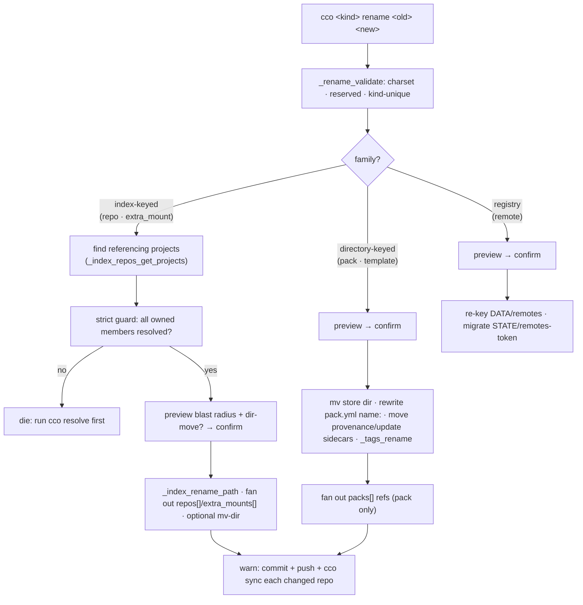

# Resource Rename — CLI & Implementation Design

> Status: Design (2026-07-14), `feat/naming/resource-management`. Decisions in
> [ADR-0050](../decisions/0050-resource-rename-model.md); re-key surface in
> [analysis/resource-name-storage-map.md](../analysis/resource-name-storage-map.md).
> Living doc — rewritten to truth as the feature ships.

## 1. Scope

Add per-kind `rename` verbs for the kinds that lack one (**repo, extra_mount, pack, template,
remote**), backed by a shared `lib/rename.sh`; align `cco llms rename`; and fix two UX
papercuts (path-input quote hygiene + a name↔path divergence hint). No schema change, no
migration, additive changelog.

## 2. CLI surface

```
cco repo rename [<old>] <new>          # cwd-first when <old> omitted
cco extra-mount rename <old> <new>
cco pack rename <old> <new>
cco template rename <old> <new>
cco remote rename <old> <new>

Common options:
  -y, --yes        skip the confirmation prompt (non-TTY without -y → error)
  --move-dir       (repo/extra_mount only) also move the on-disk directory
                   non-interactively; default is name-only (see §5)
  -h, --help
```

Cwd-first (`<old>` omitted) is offered where a current resource is unambiguous from the working
directory — **repo** (the repo hosting `cwd`, via the resolve helper). pack/template/remote/
extra_mount take explicit `<old>` (no cwd anchor). This mirrors `cco project rename`'s cwd-first
ergonomics (ADR-0031 D1).

### Help text (per verb, shape)

```
Usage: cco repo rename [<old>] <new>

Rename a repo's logical name, re-keying it across the machine-local index and the
project.yml 'repos:' entry of every project that references it. The repo's directory,
git identity, and url/ref coordinate are unchanged.

A repo name is independent of the project name and the directory basename — renaming
the repo does NOT rename a project that happens to share the name.

Every project referencing the repo must have its owned member repos resolved on this
machine (run 'cco resolve' first). After renaming, commit + push the updated
.cco/project.yml in each changed repo and run 'cco sync'.

Options:
  -y, --yes        Skip the confirmation prompt
      --move-dir   Also move the directory on disk (basename must equal <old>)
```

## 3. Shared module `lib/rename.sh`

| Helper | Signature | Responsibility |
|---|---|---|
| `_yaml_rename_list_ref` | `<file> <section> <old> <new>` | Section-scoped rewrite of a YAML list ref, both scalar (`- old`) and mapping (`- name: old`) forms; exits on the next top-level key; returns 0 iff changed. Generalizes `_llms_rename_in_yaml`. |
| `_rename_validate` | `<kind> <new>` | Charset (reuse the kind's existing predicate), reserved-name, kind-scoped uniqueness. Dies on failure before any write. |
| `_rename_fanout_projectyml` | `<section> <old> <new>` (over a project set) | Owned+resolved member loop (`_project_iter_members`): rewrite each owned resolved `project.yml`, collect `changed[]`/`unresolved[]`, drive the strict guard + commit/push/sync warning. |
| `_rename_preview_confirm` | `<lines...>` | Uniform preview + `_confirm_destructive` (ADR-0029 D2). |

New index primitive (in `lib/index.sh`, next to `_index_rename_project`):

| Helper | Signature | Responsibility |
|---|---|---|
| `_index_rename_path` | `<old> <new>` | Re-key the `paths:` entry (`get`→`set new`→`remove old`) **and** rewrite every `projects:` membership token equal to `<old>`. The repo/extra_mount analogue of `_index_rename_project`. |

## 4. Per-kind flow



**repo** (`lib/cmd-repo.sh`): validate → `_index_repos_get_projects <old>` → strict guard over
each project's owned members → preview (list every referencing project + whether dir moves) →
`_index_rename_path` → `_rename_fanout_projectyml repos <old> <new>` → optional dir move (§5) →
commit/push/sync warning. **Emits a note if `<old>` also names a project**, clarifying the
project was left untouched (→ `cco project rename`).

**extra_mount**: as repo but fan out `extra_mounts`; if `target:` was implicit, note the changed
container mount path.

**pack** (`lib/cmd-pack.sh`) / **template** (`lib/cmd-template.sh`): `mv` store dir (refuse if
target exists), rewrite `pack.yml name:` (pack), move `DATA/{packs,templates}/<old>/source` +
`STATE/{packs,templates}/<old>/update/`, `_tags_rename <kind>`, fan out `packs[]` (pack).

**remote** (`lib/cmd-remote.sh`): re-key `DATA/remotes` key + `STATE/remotes-token` key.

**llms** (`lib/cmd-llms.sh`): migrate `_llms_rename` onto `_yaml_rename_list_ref`; add
`_tags_rename llms`.

## 5. Directory-move for repo / extra_mount (ADR-0050 D4)

```
Interactive, dir basename == <old>:
  Rename also moves the directory?
    /workspace/api → /workspace/backend
    (external references to the old path are NOT updated)  [y/N]
  → y: mv + _index_set_path <new> <newpath>
  → N (default): name re-key only

Non-interactive:
  --move-dir given  → move (basename must equal <old>, else die)
  -y without --move-dir → name-only (No is the default)
  basename != <old> → never offer/allow the move (ambiguous)
```

The directory move is opt-in and prudent because a repo working tree may be shared by other
projects and referenced by external tools; `cco <kind> rename` (name axis) stays orthogonal to
`cco path` (path axis) by default.

## 6. Operator-shim gating (ADR-0050 D7)

Register in `bin/cco`'s write-verb whitelist with the target tree:
- `repo rename`, `extra-mount rename` → **current-project** tree → `edit-project` (Pc=rw) for
  the current project, else needs Po=rw.
- `pack rename`, `template rename`, `remote rename` → **global store** → `edit-global` (G=rw).

`usage()`/help filtering in container-operator mode must show these correctly per scope.

## 7. Quote hygiene + divergence hint (ADR-0050 D8)

- In `lib/cmd-resolve.sh` `_resolve_to_abs` (and the interactive path reads in
  `lib/local-paths.sh`): strip **one** pair of surrounding matching quotes before `expand_path`
  — e.g. `'/a/b'`→`/a/b`, `"/a/b"`→`/a/b`; leave unbalanced/inner quotes literal.
- `cco path set` / `cco resolve`: after updating a path, if the index key ≠ the new directory
  basename, print a hint: *"index name '<key>' no longer matches the directory basename
  '<base>'; run 'cco repo rename <key> <base>' to align them."*

## 8. Implementation steps

1. `lib/rename.sh` — `_yaml_rename_list_ref` (scalar+mapping, section-scoped), `_rename_validate`,
   `_rename_fanout_projectyml`, `_rename_preview_confirm`. Unit-test the rewriter first.
2. `lib/index.sh` — `_index_rename_path` (+ tests).
3. Migrate `_llms_rename` onto `_yaml_rename_list_ref`; add `_tags_rename llms` (keep existing
   tests green).
4. `lib/cmd-repo.sh` — `cmd_repo rename`; wire `repo)` into `bin/cco`.
5. extra_mount rename (same file/sibling).
6. `pack rename` / `template rename` in their cmd files.
7. `remote rename` in `lib/cmd-remote.sh`.
8. Operator-shim classification in `bin/cco` (§6) + help filtering.
9. Quote-strip fix + divergence hint (§7).
10. Docs + changelog; `cco *-rename --help`, `docs/users/reference/cli.md`, root `CLAUDE.md`.
11. Tests (§9).

## 9. Test matrix

Per verb (`tests/test_<kind>_rename.sh`):
- every store updated; **no stale references** — grep the index and all member `project.yml`s
  for `<old>` → none.
- **kind-scoped isolation**: a same-named project/pack/etc. of another kind is untouched.
- **strict refusal**: an unresolved owned member → die, **no machine-local write**.
- **shared repo**: a repo in M projects → all M `project.yml`s + M membership lists updated.
- **dir-move**: prompt `y` moves + reindexes; `N`/`-y` leaves the dir; basename≠old never moves.
- **operator gating**: `edit-project` session refused `pack rename`, allowed `repo rename` (own
  project); `edit-global` allowed `pack rename`.
- **quote input**: `'/path'` and `"/path"` accepted; divergence hint fires when key≠basename.
- negatives: rename to an existing name of the same kind / invalid `<new>` → rejected.

## 10. Risks & mitigations

| Risk | Mitigation |
|---|---|
| Fan-out across unresolved members | ADR-0031 D3 strict guard, reused via `_rename_fanout_projectyml` |
| Shared-repo blast radius surprises the user | preview lists **all** referencing projects before confirm |
| YAML rewriter over-matches (form/adjacent section) | section-scoped awk, both list forms, targeted tests |
| Operator-mode mis-gating | explicit per-verb target-tree + gating test (§9) |
| Name-vs-path confusion resurfacing | default name-only rename + coincident-name note + divergence hint keep the axes orthogonal |
