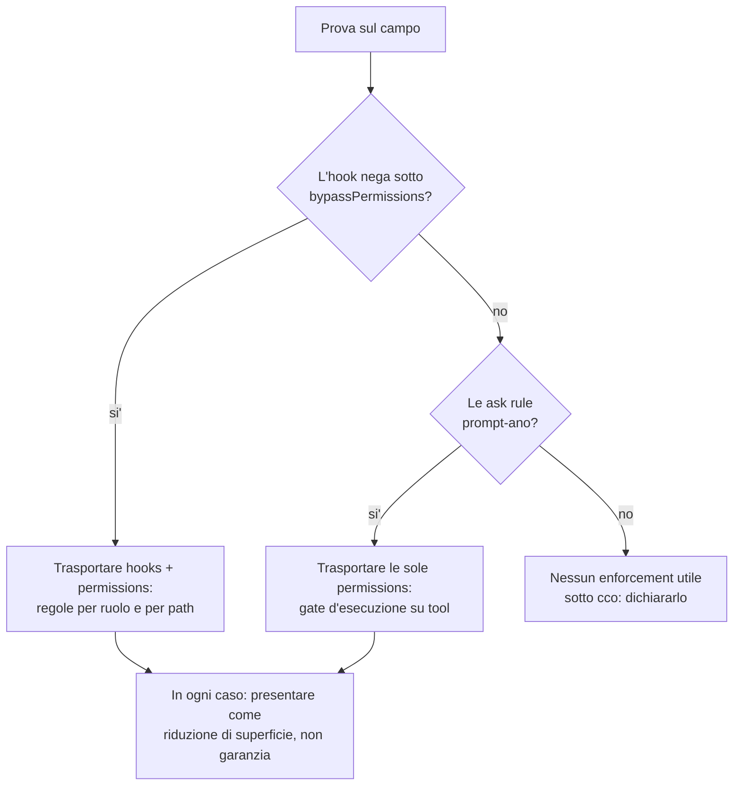

# Handoff verso cco — `settings.json` e hooks trasportati dal formato pack

> ℹ️ **Provenance.** Received 2026-08-04 from an external adopter line and persisted here
> **verbatim**, in the language it was written in: it is a point-in-time *input*, not a cco decision.
> Feeds Block C of the [roadmap](../../roadmap.md); tracked as **FI-48** in
> [improvements.md](../../improvements.md). Twin document:
> [input-pack-templates-and-scope-resolution.md](input-pack-templates-and-scope-resolution.md) —
> §5 states the ordering constraint between the two (templates first).
>
> **Da**: la linea di lavoro sul pack `core-dev-framework` (repo del corso), agosto 2026.
> **A**: una sessione di **analisi** interna a cco.
> **Cosa è**: la richiesta che il formato pack possa trasportare **permissions e hooks**, con
> le verifiche già fatte sulla documentazione ufficiale di Claude Code e le trappole già
> pagate. **Non è un design**: è l'input da cui l'analisi cco può partire senza ri-scoprire
> nulla.
> **Autoconsistente di proposito**: non linka documenti del repo di provenienza.
> **Documento gemello**: la richiesta sui *template dei pack e la risoluzione degli scope* è
> in un handoff separato. Questo è indipendente da quello, ma §5 mostra dove si toccano.
>
> 🆕 **Aggiornato il 2026-08-04 con l'esito della prova sul campo.** La precondizione di §4
> **è soddisfatta**: la prova è stata eseguita e ha risposto a tutte le domande. Gli esiti
> sono in §4, e **tre reperti su cco** — non previsti dalla prova — sono in §2.6. Uno di essi
> cambia la giustificazione della richiesta.

---

## 0. La richiesta, in tre righe

Il formato pack cco spedisce **knowledge · skills · agents · rules**. Non spedisce
`settings.json` né hooks. Ma **l'unico enforcement reale disponibile a un pack di metodo
vive esattamente lì**: tutto ciò che un pack può dire oggi è prosa che il modello può
seguire o no.

> **Richiesta**: che un pack possa dichiarare `permissions` e `hooks`, e che cco li
> componga nel `settings.json` dello scope in cui il pack è attivo — inclusi gli script
> degli hook, che il pack deve poter spedire insieme alla regola che li invoca.

✅ **La precondizione è soddisfatta.** Era: *non trasportare un meccanismo prima di sapere
che funziona nel modo in cui cco avvia le sessioni* — cioè in container, con i permessi
saltati. **La prova è stata eseguita il 2026-08-04 e l'hook nega anche lì** (§2.5).

---

## 1. Perché non è un problema di Claude Code

Questa distinzione è costata una revisione a mente fredda, e conviene non ri-farla.

Un'analisi precedente aveva concluso che «l'enforcement non è imponibile». **È falso.**
`hooks` e `permissions` **bloccano davvero** — sono applicati da Claude Code, non dal
modello. Il limite è **del formato pack**: il canale c'è, il pack non ci arriva.

E il canale a livello progetto **esiste già ed è vuoto**: `<repo>/.cco/claude/settings.json`.
La richiesta non è quindi «crea un canale», ma **«fai in modo che un pack possa scriverci»**,
con una semantica di composizione dichiarata (§3).

---

## 2. Cosa è già verificato — alla fonte, e poi sul campo

Quattro fatti riscontrati sulla documentazione ufficiale (§2.1–§2.4), poi **misurati**
(§2.5). Servono perché **vincolano la forma** di ciò che cco dovrà trasportare: un trasporto
che non li rispetta spedisce una regola inerte.

### 2.1 `permissions.deny` da solo NON esprime «scrivi solo in casa tua»

Le rule si valutano **deny → ask → allow**, prima corrispondenza, e *«la specificità non
cambia l'ordine»*. Soprattutto: *«una deny rule non può portare eccezioni di allowlist»*.
Non esiste quindi un modo di scrivere «nega tutto tranne questa directory» con le sole deny.

**La forma corretta, che è anche quella documentata** per «larghi permessi, blocchi mirati»:

> **allow largo + hook `PreToolUse` che nega.**

### 2.2 L'hook `PreToolUse` gira **dentro i subagent**, e sa chi sta chiamando

È il fatto che rende la richiesta utile invece che marginale. L'input dell'hook contiene:

| Campo | Serve a |
|---|---|
| `tool_name` · `tool_input.file_path` / `.command` | la regola **per path** e per comando |
| `agent_type` · `agent_id` | la regola **per ruolo** — presenti **solo** dentro un subagent |
| `permission_mode` | sapere in che modalità gira la sessione |

Verbatim: *«Hooks from settings files, managed policy settings, and plugins also run inside
subagents. When a subagent calls a tool, tool events such as `PreToolUse` and `PostToolUse`
fire the same configured hooks as in the main conversation»*.

Una regola **per ruolo e per path** è esattamente ciò che serve a un pack che definisce
ruoli: *«il ruolo di sola lettura scrive solo il proprio artefatto e nient'altro»*.

### 2.3 Le `ask` e `deny` rule sopravvivono a `bypassPermissions` — gli hook non è detto

Verbatim: *«These controls apply in every mode, including `bypassPermissions`: deny rules
and explicit ask rules»*.

⚠️ **Quell'elenco non nomina gli hook.** Altrove la documentazione dice che un hook con
`exit 2` *«stops the tool call before permission rules are evaluated»*, il che suggerisce che
sopravviva — ma le due frasi non si compongono in una certezza: una parla di **regole**,
l'altra di **precedenza**.

**Perché era il punto centrale per cco e non un dettaglio**: cco avvia le sessioni in
container con i permessi saltati. Se l'hook non avesse negato in quella modalità, il
trasporto degli hook non avrebbe comprato nulla *nel modo in cui cco è usato*, e sarebbe
rimasto solo quello delle `ask`/`deny` rule.
➡️ **Sciolto dalla misura: l'hook nega anche sotto `bypassPermissions`** (§2.5). Entrambe
le metà della richiesta hanno valore.

### 2.4 Due trappole di sintassi, già pagate

| Trappola | Effetto | Forma corretta |
|---|---|---|
| Rule di **path su `Write`** | **Mai consultata.** Claude Code accetta la regola e la ignora, con warning all'avvio | Si scrive `Edit(...)`, che copre tutti i tool di modifica |
| `/path` | **Non è assoluto**: àncora alla sorgente del settings | `//path` o `~/path` per l'assoluto |

Un template che sbaglia la prima **spedisce una regola che non esiste**, e sembra funzionare.

### 2.5 ✅ Verificato sul campo, non più solo sulla documentazione

Prova eseguita il **2026-08-04** su `claude 2.1.221`, sessioni headless fresche, workspace
trusted, ripetizioni per il determinismo. **Esiti:**

| Domanda | Esito misurato |
|---|---|
| L'hook nega in modalità normale? | **sì** |
| ⭐ **L'hook nega sotto `bypassPermissions`?** | **SÌ — bloccato 2 volte su 2**, con riga di log `mode=bypassPermissions` |
| L'hook vede `agent_type` e blocca **dentro** un subagent? | **sì** — `agent_type=probe` nel log, scrittura negata |
| Copre `Bash`? | `echo >`, `sed -i`, `printf >` **negati**; `dd of=`, `truncate`, e **qualunque interprete** passano |
| Una `ask` rule prompta sotto bypass? | **sì**, e `Bash(git push *)` copre anche `git push` nudo |
| L'ordine dei livelli | **confermato per osservazione**: la riga di log dell'hook compare **prima** del prompt di conferma |

➡️ **Il trasporto di hooks *e* permissions ha entrambi valore sotto cco.** Era l'esito
migliore fra quelli possibili: se l'hook non avesse retto al bypass, sarebbero rimaste solo
le `ask`/`deny` rule.

⚠️ **Un reperto che vale per chiunque scriva un hook di enforcement, e che ha quasi
invalidato la prova**: l'hook di test faceva `printf` sul proprio log **prima** di valutare
la decisione, sotto `set -euo pipefail`. Con il log non scrivibile — disco pieno, permessi,
mount ro — l'hook **abortiva con exit 1, cioè fail-OPEN**, senza lasciare traccia. Eseguito
così, ogni test avrebbe risposto «passato» da un hook che non raggiungeva mai la propria riga
di decisione. **Un hook di enforcement valuta il `deny` prima di loggare, e il logging non è
mai fatale.** Se cco spedirà template di hook, questa è la prima cosa da mettere nel modello.

### 2.6 La copertura, dichiarata con onestà

Coperti: `Write`/`Edit` e i comandi di file che Claude Code riconosce dentro `Bash`
(`cat`, `head`, `tail`, `sed`). **Non coperto**: il **sotto-processo arbitrario** — uno
script che scrive file, lanciato da `Bash`. Quello lo chiude solo la **sandbox**, che è
enforcement a livello di OS.

➡️ Qualunque cosa cco spedisca va presentata come **riduzione di superficie, non garanzia** —
e la misura di §2.5 lo conferma: delegando a un subagent, il bypass è avvenuto in due mosse,
scrivendo lo script **dentro** la directory consentita ed eseguendolo da lì.
Il pack di provenienza ha dovuto ritirare quattro affermazioni che promettevano più di
quanto un meccanismo reggesse: sono state scritte al **modello**, nel suo system prompt, ed
è il modo più efficace di costruire falsa sicurezza.

---

### 2.7 🆕 Tre reperti su cco emersi dalla prova — il primo cambia la giustificazione

1. **cco monta `<repo>/.claude` in sola lettura** (solo `settings.local.json` è scrivibile),
   come `<repo>/.cco`. Ne segue una garanzia che nessuno aveva nominato:

   > Una sessione **non può manomettere i propri hook, agent, skill e settings.** È
   > enforcement a livello di **OS**, quindi indipendente dal permission mode — vale anche
   > sotto `bypassPermissions` — e **non aggirabile da un sotto-processo**, cioè proprio la
   > via che §2.5 dimostra impossibile da chiudere con un hook.

   **cco offre già questa garanzia, e non la dichiara da nessuna parte.** È l'argomento più
   forte a favore del trasporto via pack: un `settings.json` montato da cco è *più* difficile
   da neutralizzare di uno copiato a mano nel repo, che la sessione potrebbe riscrivere.
   ➡️ **Vale come voce a sé, anche se non si fa altro**: documentare la proprietà.

2. **Un hook spedito dal pack non può scrivere stato o log dentro `.claude/`** — quel path è
   ro. È un vincolo di progetto, non un'ipotesi: se il trasporto prevede hook con stato,
   **serve una destinazione scrivibile dichiarata** (una directory STATE per gli hook, sulla
   forma di quella che la memoria del lead ha già).

3. **Gli hook si sommano** fra `settings.json` e `settings.local.json`: un hook definito nel
   `settings.json` montato ro **non è disattivabile dalla sessione**. Corollario dei due
   punti precedenti, e ulteriore argomento a favore del trasporto — ma anche un motivo in più
   perché la **semantica di composizione di §3 sia decisa esplicitamente**: ciò che non si può
   disattivare va poter essere previsto.

---

## 3. La domanda difficile che l'analisi cco deve sciogliere

Le rule in markdown si **concatenano**: due file omonimi finiscono in contesto insieme.
`settings.json` **no**: è un oggetto strutturato, e due pack che ne portano uno vanno
**composti**, non concatenati.

| Chiave | Composizione plausibile | Perché |
|---|---|---|
| `permissions.deny` | **unione, sempre** | una `deny` persa in composizione è un buco di sicurezza silenzioso |
| `permissions.ask` | **unione** | stesso argomento, più debole |
| `permissions.allow` | unione, ma **con avviso** | un allow di un pack può vanificare l'intenzione di un altro |
| `hooks.<event>[]` | **concatenazione** dei matcher group | sono già una lista; l'ordine può contare |

**Il conflitto va reso visibile**, non risolto in silenzio: oggi per rule/agent/skill omonimi
vale *l'ultimo pack della lista vince*, con un warning. Per `settings.json` la stessa regola
sarebbe **peggiore del problema**: un pack che sovrascrive le deny di un altro le rimuove.

### 3.1 Il dettaglio meccanico che non va sottovalutato: **dove vive lo script dell'hook**

Un hook `type: command` punta a un eseguibile. Se il pack spedisce la regola ma non lo
script, la regola è rotta; se spedisce lo script, quello vive nel **mount read-only del
pack**, e il `command` deve risolvere a quel path *dentro il container*.

Domande concrete per l'analisi:

- il `command` può puntare al path montato del pack, ed è **stabile** fra sessioni?
- `$CLAUDE_PROJECT_DIR` a cosa risolve sotto cco, e il pack può contarci?
- lo script montato read-only è **eseguibile** (bit di permesso preservato dal mount)?
- serve una forma dichiarativa alternativa (`type: prompt`, o un predicato dichiarato nel
  `pack.yml`) per i casi semplici, così che il pack non debba spedire codice?

---

## 4. La precondizione — ✅ **soddisfatta il 2026-08-04**

Era: *non implementare il trasporto prima di una prova sul campo*, perché tutto §2 viene da
**documentazione**, che è una fonte e non una misura — ed è esattamente questa distanza ad
aver prodotto, nel pack di provenienza, quattro affermazioni false che *sembravano*
verificate.

**La prova è stata eseguita.** Esiti in §2.5, reperti su cco in §2.7. Restano due limiti
dichiarati: è stata eseguita **dentro un container cco** e non sull'host (una riconferma
sull'host è opportuna, non bloccante, visto che l'esito decisivo è «bloccato» su due
ripetizioni con riga di log esplicita), e **la sandbox non è stata misurata** — è l'unico
livello che chiude il sotto-processo di §2.5, e resta fuori dal formato pack.

Per riferimento, la griglia usata:

| # | Domanda | Perché decide |
|---|---|---|
| **A** | L'hook nega, in modalità normale? | baseline |
| **B** | ⭐ **L'hook nega ancora sotto `bypassPermissions`?** | **è la modalità con cui cco avvia**. Se no, il trasporto degli hook non serve a cco, e resta quello delle `ask`/`deny` rule |
| **C** | L'hook vede `agent_type` e blocca **dentro** un subagent? | metà del valore atteso è governare i ruoli |
| **D** | Copre la redirezione di shell? E un sotto-processo? | fissa il confine da dichiarare (§2.5) |
| **E** | Una `ask` rule prompta sotto bypass? | è il gate che sopravvive comunque |

L'esito di **B** e **E** insieme dice **cosa** vale la pena trasportare. Sono due esecuzioni
di dieci minuti.

---

## 5. Dove tocca l'altra richiesta

Un `settings.json` con permissions e hook è **uno dei quattro oggetti** che l'adottante oggi
istanzia a mano, insieme al profilo di progetto, alla politica di manutenzione e alla lingua.
Se cco realizza i **template parametrici all'install** (l'altro handoff), questo diventa il
loro quarto caso d'uso e non richiede un meccanismo separato: il pack spedisce un
`settings.template.json`, l'install lo istanzia con le risposte dell'utente.

➡️ **Suggerimento di ordine**: valutare le due richieste insieme, ma **implementare prima i
template**. Il trasporto dell'enforcement senza parametrizzazione produrrebbe un
`settings.json` uguale per tutti i progetti — e la scelta di *quanto* enforcement volere è
per sua natura per-progetto.

---

## 6. Cosa NON si sta chiedendo

- **La sandbox.** È enforcement a livello di OS e sta fuori dal formato pack. Va nominata
  solo come il confine oltre il quale gli hook non arrivano.
- **Che cco imponga un enforcement di default.** La richiesta è che un pack *possa*
  spedirlo; l'adozione resta una scelta del progetto.
- **Che il pack possa scrivere nello scope global o managed.** Lo scope del pack è
  sufficiente, ed è anche il confine di sicurezza sensato.

---

## 7. Una nota di metodo, se è utile

La distinzione che ha sbloccato tutto questo è arrivata **ri-aprendo la fonte invece di
fidarsi di una sintesi**: un'analisi precedente aveva constatato che gli hook esistono e
possono bloccare, poi aveva scritto *«progettarlo non è oggetto di questa analisi»* — e
quel rinvio non era mai stato ripreso. Il rilievo con più conseguenze dell'intera linea di
lavoro stava dentro una frase che diceva «non ora».

➡️ In una revisione, vale la pena cercare **i rinvii** oltre agli errori. Un rinvio è un
errore che non è ancora stato commesso.
