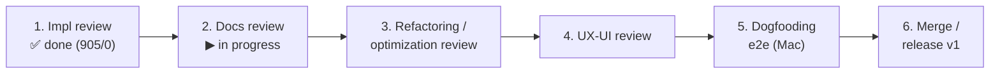

# Roadmap

> The live, forward-looking plan for claude-orchestrator. Detailed chronology,
> completed sprints, and the known-bug log live in
> [roadmap-history.md](roadmap-history.md). The framework-improvements backlog
> lives in [roadmap-backlog.md](roadmap-backlog.md).
>
> Last updated: 2026-06-26.

## Current status

The **decentralized in-repo config** refactor is **build-complete**: design closed
(ADRs 0005–0027, principles P1–P18), and Phases 0–5 are all shipped on
`feat/vault/decentralized-config` (suite **905/0**; commits local, pushed from the
maintainer's Mac). Project config now lives in `<repo>/.cco/`; the central vault and
the profile/`@local` machinery are gone; personal config lives in `~/.cco`; machine-local
state/cache/data live in hidden XDG buckets. The work is now in the **pre-merge review
cycle**: the implementation review is done; the **documentation review (this step)** has
reorganized `docs/` to the audience→domain→doc-type structure and run a shipped-behavior
coherence sweep (which surfaced and fixed one writer/reader path bug — see step 3). Next:
refactoring/UX review, dogfooding, and the v1 merge/release.

## Decentralized-config v1 — phase index

All phases closed; Phase 5 build-complete. Full per-phase commit/baseline log:
[roadmap-history.md → phase-by-phase log](roadmap-history.md#decentralized-config-refactor--phase-by-phase-log).

| Phase | Scope | Status | Key outcome |
|-------|-------|--------|-------------|
| Design + review (V) | Analyses, ADRs, impl-readiness review | ✅ Closed | ADRs 0005–0023; 4-bucket taxonomy, coordinate-per-unit, sharing unification; 58-finding review resolved into ADR-0021/0022/0023 |
| **P0** Substrate | Resolver, STATE index, coordinate parsers, mount re-point | ✅ Closed | `cco resolve` substrate; `.claude` overlays → CACHE `:ro`; baseline 982/16 |
| **P1** Core local | `cco resolve`/`path`/`sync`, reminder aggregator, `project add` | ✅ Closed | Index-backed local commands; suite 1043/16 |
| **P2** Migration & bootstrap | J0 bootstrap, backup, `init --migrate`, `join` | ✅ Closed | Eager global + lazy per-project migration; ADR-0024/0025; suite 1087/8 |
| **P3** Legacy cutover | Decentralized `start`, `tag`/`config`, vault removed, `init` scaffold | ✅ Closed | Vault/profile world deleted; config-editor built-in (ADR-0026/0027); suite 936/3 |
| **P4** Sharing core | source→DATA, structure discovery, sync-before-publish, 2×2 verbs | ✅ Closed | Manifest subsystem deleted; schema bridge → index-only; ADR-0022; suite 827/1 |
| **P5** Sharing-ext + lifecycle | `forget`, `config validate`, pack resolution/internalize, `project validate`/`coords`, `update --check`, `config protect` | ✅ Build complete | Lifecycle + sharing-ext verbs; changelog #15; suite **894/0** |

## What's next

### Pre-merge review cycle (gate to v1)

1. **Implementation review** — ✅ done (2026-06-25 adherence review + 2026-06-26 deep
   migration review; all findings resolved, baseline 905/0).
2. **Documentation review** — ▶ **largely done** (this step). Reorganized `docs/` to the
   Cave structure (`maintainers/` + `users/` + `archive/`, audience→domain→doc-type leaf;
   `guiding-principles` promoted to `foundation/`); ran the shipped-behavior coherence
   sweep (browser-mcp/llms/packs/update-system/environment/security designs aligned to the
   4-bucket model; ~220 cross-refs repaired; `users/` verified clean). Plan + execution
   log: `configuration/decentralized-config/documentation-reorganization-plan.md`.
   **Deferred to post-merge** (see backlog): per-domain split of `cli.md` /
   `context-hierarchy.md` / the `configuration-management.md` guide, and the by-domain
   redistribution of the `decentralized-config/` sprint folder.
3. **Refactoring / optimization review** — consumes the 13 optimization flags from the
   pre-merge adherence review, plus the **global build-extension reader bug** found during
   the docs sweep: `cco init` / `init --migrate` write `setup-build.sh` / `setup.sh` /
   `mcp-packages.txt` to `~/.cco` **top level** (design §2.3) but `cco build` read them from
   `~/.cco/global` (legacy-vault remnant), so global build-time customization was silently
   inert. **Verified + fixed 2026-06-26** in `lib/cmd-build.sh` (regression test
   `tests/test_build.sh`); the broader stale-path sweep found no other active mismatch
   (secrets/runtime readers already correct). **Re-validate in dogfooding** on a real build.
4. **UX-UI review**.
5. **Dogfooding e2e on Mac** — `configuration/decentralized-config/P2-dogfooding-validation.md`
   (sandboxed roots + HOME-flip; legacy-vault removal accepted only after merge + validation).
6. **Merge / release v1** — merge `feat/vault/decentralized-config`, reconcile both roadmaps,
   mark ADRs.

### Pre-merge to-do — flatten `~/.cco/global/.claude/` → `~/.cco/.claude/`

**Must land before the v1 merge** (decided 2026-06-26; not done in the docs session).
**Launcher**: `configuration/decentralized-config/flatten-global-claude-handoff.md`
(self-contained, code-grounded checklist: ADR-0028 + design + impl + migration + docs + tests).
**Why pre-merge**: fold it into the **single** decentralized-config migration so every user
gets the flat layout in ONE coherent migration — avoid shipping `~/.cco/global/.claude`
now and a *second* `mv … → ~/.cco/.claude` later. The `global/` wrapper is a vault-era
vestige: `~/.cco` is already the global (user) config scope, and `.claude/` is the **only**
thing under `global/` (setup.sh / setup-build.sh / mcp-packages.txt / languages / packs/ /
templates/ are already top-level; update base/meta live in STATE). After the flatten the
future per-project centralization becomes `~/.cco/projects/<name>/` (P18), a clean sibling
of `~/.cco/.claude/`. Work items:

- **Superseding ADR-0028** — supersede the `~/.cco/global/.claude` layout from ADR-0024 /
  design §2 (forward-annotate ADR-0024; the `global/` vs future `projects/` contrast is
  preserved as root-`.claude` vs `projects/<name>/`).
- **Design** — update `decentralized-config/design.md` §2 layout, the mount
  (`~/.cco/.claude/ → ~/.claude`), and the `~/.cco/.gitignore` allowlist
  (`global/.claude` → `.claude`).
- **Implementation** — retire/redefine `GLOBAL_DIR` (`bin/cco:49`) and update **every**
  `~/.cco/global/.claude` reference: `cmd-start.sh`, `utils.sh`, `update*.sh`, `secrets.sh`,
  `cmd-clean.sh`, `cmd-init.sh`, `cmd-new.sh` (the `$GLOBAL_DIR/.claude` readers).
- **Migration** — the decentralized-config migration must place global config directly at
  `~/.cco/.claude` for fresh AND migrating users (single move, idempotent), so legacy-vault
  restore lands at the new location with no second relocation.
- **Tests + docs** — update fixtures/helpers (`CCO_GLOBAL_DIR`) and any doc referencing
  `~/.cco/global/`.

### Post-v1 (decentralized-config backlog)

Decided-but-deferred; each rides the shipped v1 substrate. Priorities are a recommendation —
confirm before scheduling. None blocks the v1 merge.

- **Close shipped-surface gaps** — `cco template update` (symmetric twin of `cco pack
  update`); make `cco pack update` a 3-way merge (currently overwrites local edits).
- **Governance & resolution UX** — `cco config protect` helper (CODEOWNERS + ruleset
  scaffold; contract ADR-0020 D4 / ADR-0023 D6; docs already shipped);
  internalize-as-cache interactive prompt (ADR-0019 D6).
- **State-sync (T / R-state-sync)** — opt-in cross-PC/cross-team sync of STATE + DATA
  (memory, transcripts, tags, provenance). Largest deferred item; needs its own design.
- **`cco project internalize` (Case-C)** + `~/.cco/projects/` config home — sever a
  project's config from its code repo (solo-adopter case). Name reserved (ADR-0023 D4).
- **Index per-project namespacing** (ADR-0022 D2) — only when real name collisions appear.
- **Distribution / packaging (R-pkg)** — distribute as npm/npx + publish the image to a
  registry so users need not clone the source. Also: an opinionated official sharing repo
  (F-opin, ADR-0020).
- **Deferred documentation operations (post-merge)** — split the monolithic references
  `cli.md` and `context-hierarchy.md` (and the `configuration-management.md` user guide)
  into per-domain pages; **redistribute the `decentralized-config/` sprint folder** into the
  by-domain `design/` + `adr/` homes (deferral decided during the docs reorg; the 27 ADRs
  keep their numbers, the living design splits into the config/sharing/packs/update domains).
  Tracked in `configuration/decentralized-config/documentation-reorganization-plan.md` §11.
  (The `browser-mcp/design.md` deep layout rewrite was already applied in the docs review.)

## Broader planned work (beyond decentralized-config v1)

Full long-form descriptions (scope, design, effort) are preserved in
[roadmap-history.md → Planned Sprints](roadmap-history.md#planned-sprints).

| Item | Priority | Effort | Summary |
|------|----------|--------|---------|
| Quick wins: FI-4 model config, `cco project edit` | 1 | Low–Med | Per-project `model:` in `project.yml` → `claude --model`; open `project.yml` in `$EDITOR` and regenerate compose |
| AI-assisted merge (Update System Phase 4) | 2 | Low–Med | `(I)` AI-merge option for `.md` files on `cco update --sync` when `MERGE_AVAILABLE` |
| Sprint 6C — Network hardening | 2/3 | Med–High | Squid sidecar + `internal: true` network, SNI domain filtering (Phase A/B shipped, Phase C pending). Security: required pre-open-source |
| Sprint 8 — E2E integration tests | 3 | Med | `bin/test-e2e` verifying real container behavior (mounts, socket, auth, entrypoint) |
| Sprint 9 — Linux OAuth | 4 | Med | OAuth on Linux without Keychain (pre-generated credentials / `secret-tool` / `pass` / encrypted file / API-key default) |
| Sprint 10 — Git worktree isolation (#6) | 5 | Med | Opt-in per-session worktrees on `cco/<project>` branches; enables PR/merge workflow |
| #9 Pack inheritance / composition | 5 | Med | `extends:` in `pack.yml` |
| #10b StatusLine improvements | 5 | Low | Remaining-session % for Max users; fix stale ctx% after `/compact`; configurable format |
| Sprint 12 — Project RAG (#13) | Exploratory | High | Built-in opt-in RAG MCP (default `mcp-local-rag`/LanceDB), auto-generated config at `cco start` |

> Note: `#6b`/`#6c` (worktree-based vault profile sync) and the Vault UI/UX enhancements
> are **superseded/mooted** by the decentralized-config refactor (no branch-switch vault
> remains). See history for the original entries.

## Exploratory (long-term)

Uncommitted ideas — evaluate demand before scheduling. Details in
[roadmap-history.md → Long-term / Exploratory](roadmap-history.md#long-term--exploratory).

- Native installer migration (auto-update support, persistent volume)
- Hot-reload for in-container configuration (Docker-proxy `SIGHUP`, `cco reload`)
- Session reattach (`cco attach`) — likely a one-liner post-worktree
- Remote sessions (SSHFS-mounted repos) · Multi-project sessions
- System notifications for human-in-the-loop (OS notification / webhook)
- Web UI dashboard

## Declined / Won't Do

Decisions preserved in
[roadmap-history.md → Declined / Won't Do](roadmap-history.md#declined--wont-do).

- **PreToolUse safety hook** — Docker is the sandbox (ADR-1); block commands case-by-case if needed.
- **claude-mem integration** — heavy deps, per-tool-call overhead, AGPL; native memory covers the need.
- **claude-context (Zilliz) as default RAG** — cloud dependency + OpenAI key + privacy concern; allowed only as an optional provider.

## Backlog

The framework-improvements tracker (FI-1 … FI-8, with analysis and decisions) is the
detailed backlog: see [roadmap-backlog.md](roadmap-backlog.md).

## History

Detailed chronology — the full status snapshot, per-phase build log, completed sprints,
and the known-bug log: see [roadmap-history.md](roadmap-history.md).
