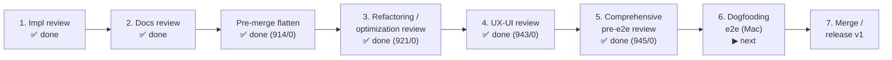

# Roadmap

> The live, forward-looking plan for claude-orchestrator. Detailed chronology,
> completed sprints, and the known-bug log live in
> [roadmap-history.md](roadmap-history.md). The framework-improvements backlog
> lives in [roadmap-backlog.md](roadmap-backlog.md).
>
> Last updated: 2026-06-27.

## Current status

The **decentralized in-repo config** refactor is **build-complete**: design closed
(ADRs 0005–0028, principles P1–P18), and Phases 0–5 are all shipped on
`feat/vault/decentralized-config` (suite **943/0**; commits local, pushed from the
maintainer's Mac). Project config now lives in `<repo>/.cco/`; the central vault and
the profile/`@local` machinery are gone; personal config lives in `~/.cco` (global Claude
config flattened to `~/.cco/.claude/`, ADR-0028); machine-local state/cache/data live in
hidden XDG buckets. The work is now in the **pre-merge review cycle**: the implementation
review, the documentation review (reorg + coherence sweep), the pre-merge **flatten**
(`~/.cco/global/.claude` → `~/.cco/.claude`, ADR-0028), the **refactoring/optimization
review** (step 3), the **UX-UI review** (step 4, ADR-0029), and the **comprehensive pre-e2e
review** (step 5, suite 943/0 → **945/0**) are all done. **Next: dogfooding e2e on the Mac
(step 6)** — then the v1 merge/release (step 7).

## Decentralized-config v1 — phase index

All phases closed; Phase 5 build-complete. Full per-phase commit/baseline log:
[roadmap-history.md → phase-by-phase log](roadmap-history.md#decentralized-config-refactor--phase-by-phase-log).

| Phase | Scope | Status | Key outcome |
|-------|-------|--------|-------------|
| Design + review (V) | Analyses, ADRs, impl-readiness review | ✅ Closed | ADRs 0005–0023; 4-bucket taxonomy, coordinate-per-unit, sharing unification; 58-finding review resolved into ADR-0021/0022/0023 |
| **P0** Substrate | Resolver, STATE index, coordinate parsers, mount re-point | ✅ Closed | `cco resolve` substrate; `.claude` overlays → CACHE `:ro`; baseline 982/16 |
| **P1** Core local | `cco resolve`/`path`/`sync`, reminder aggregator, `project add` | ✅ Closed | Index-backed local commands; suite 1043/16 |
| **P2** Migration & bootstrap | J0 bootstrap, backup, `init --migrate`, `join` | ✅ Closed | Eager global + lazy per-project migration; ADR-0024/0025; suite 1087/8 |
| **P3** Legacy cutover | Decentralized `start`, `tag`/`config`, vault removed, `init` scaffold | ✅ Closed | Vault/profile world deleted; config-editor built-in (ADR-0026/0027); suite 936/3 |
| **P4** Sharing core | source→DATA, structure discovery, sync-before-publish, 2×2 verbs | ✅ Closed | Manifest subsystem deleted; schema bridge → index-only; ADR-0022; suite 827/1 |
| **P5** Sharing-ext + lifecycle | `forget`, `config validate`, pack resolution/internalize, `project validate`/`coords`, `update --check`, `config protect` | ✅ Build complete | Lifecycle + sharing-ext verbs; changelog #15; suite **894/0** |

## What's next

### Pre-merge review cycle (gate to v1)

1. **Implementation review** — ✅ done (2026-06-25 adherence review + 2026-06-26 deep
   migration review; all findings resolved, baseline 905/0).
2. **Documentation review** — ▶ **largely done** (this step). Reorganized `docs/` to the
   Cave structure (`maintainers/` + `users/` + `archive/`, audience→domain→doc-type leaf;
   `guiding-principles` promoted to `foundation/`); ran the shipped-behavior coherence
   sweep (browser-mcp/llms/packs/update-system/environment/security designs aligned to the
   4-bucket model; ~220 cross-refs repaired; `users/` verified clean). Plan + execution
   log: `configuration/decentralized-config/documentation-reorganization-plan.md`.
   **Deferred to post-merge** (see backlog): per-domain split of `cli.md` /
   `context-hierarchy.md` / the `configuration-management.md` guide, and the by-domain
   redistribution of the `decentralized-config/` sprint folder.
3. **Refactoring / optimization review** — ✅ **done (2026-06-27).** Record:
   [`reviews/27-06-2026-refactoring-review.md`](configuration/decentralized-config/reviews/27-06-2026-refactoring-review.md).
   8 atomic LOCAL commits `e65aa2f`→`0c3c822`, behaviour-preserving, suite **914/0 → 921/0**.
   Applied: `_peel_tab` TSV splitter (#1) + `_coords_scan_section` (#5) + per-section split of
   `_pv_validate_unit` (#4) + `_project_foreach` (#2, honest 6-of-13 scope) + `cmd_update`
   307→212 via `_update_usage`/`_update_discover_pack_remotes` (#7/#11) + `cmd-build` secret
   scan routed through `lib/secrets.sh` (#10, "route-as-is" — non-blocking warn) + L4/NIT
   backup-diagnostics polish. Skipped as moot/forced (KISS/YAGNI): #3, #6, #8, #9, #12, #13.
   **L6** (container-detection false-positive for a host user named `claude`) **fixed**
   (`a216c8b`): dropped the `HOME=/home/claude` heuristic, kept the daemon-injected
   `/.dockerenv` signal + an explicit `CCO_IN_CONTAINER` test/dev seam — cco is Docker-only,
   so no entrypoint/image change was needed. The **global build-extension reader bug**
   (`cco build` read setup scripts from `~/.cco/global`, now `~/.cco` top level) was fixed
   2026-06-26 (`a92effc`); **re-validate in dogfooding** (step 6).
4. **UX-UI review** — ✅ **done (2026-06-27).** Record:
   [`reviews/27-06-2026-ux-ui-review.md`](configuration/decentralized-config/reviews/27-06-2026-ux-ui-review.md);
   design in **[ADR-0029](configuration/decentralized-config/decisions/0029-ux-ui-review-unified-list-confirm-symmetry.md)**
   (refines ADR-0023 D1). A reachability sweep came back clean; the fixes were coherence
   defects, implemented in 7 phases (Ph.1–7) across atomic LOCAL commits, suite **921/0 → 943/0**:
   unified `cco list [<kind>] [--tag] [--sort]` + redirect stubs (D1); uniform
   destructive-confirm contract `-y`/`--yes`/`--force`-override (D2); `cco tag remove` +
   `cco template update`/`validate` (D3); `cco path` demoted out of `cco help` (D4); the help
   sweep + `-h` alias + `cco forget` L8 recovery hint (D5). Shipped-behavior docs re-synced
   (`cli.md`, repo `CLAUDE.md`, design §7).
5. **Comprehensive pre-e2e review** — ✅ **done (2026-06-27).** Record:
   [`reviews/27-06-2026-pre-e2e-comprehensive-review.md`](configuration/decentralized-config/reviews/27-06-2026-pre-e2e-comprehensive-review.md).
   Multi-agent, read-only, adversarial whole-system pass over v1 across four dimensions
   (bug-free · design adherence · user-guide/CLI coherence · migration completeness). **No
   blocker**; the D4 migration dimension came back clean. 20 verified findings (6 high / 5 med /
   9 nit) resolved in 5 atomic LOCAL commits (one per cluster), suite **943/0 → 945/0** (+2
   regression tests). Headline fixes: migration 009 no longer rewrites `~/.gitignore` on fresh
   installs (C1); the ADR-0029 D2 destructive-confirm contract is enforced in code (C6/C7);
   `start`/`stop` resolve multi-repo projects via index membership (C2/C3); `docs/users/` +
   `CLAUDE.md` re-synced to the shipped surface (C12–C20); dead-code/comment cleanup
   (C4/C8/C9/C10/C11). Open items handed to step 6: the `_confirm_destructive` `/dev/tty` idiom
   decision, and a spot-check of the §6 coverage gaps (`cmd-update.sh`, `cmd-resolve.sh`,
   `index.sh` atomicity).
   Launcher: [`configuration/decentralized-config/pre-e2e-comprehensive-review-handoff.md`](configuration/decentralized-config/pre-e2e-comprehensive-review-handoff.md).
6. **Dogfooding e2e on Mac** — plan: `configuration/decentralized-config/P2-dogfooding-validation.md`
   (sandboxed roots + HOME-flip; legacy-vault removal accepted only after merge + validation);
   runnable checklist (legacy → backup → migration → functional test → failure-path, with the
   pre-migration safety nets): [`configuration/decentralized-config/e2e-validation-checklist.md`](configuration/decentralized-config/e2e-validation-checklist.md).
7. **Merge / release v1** — merge `feat/vault/decentralized-config`, reconcile both roadmaps,
   mark ADRs.

### Pre-merge: flatten `~/.cco/global/.claude/` → `~/.cco/.claude/` ✅ DONE (2026-06-27)

The global Claude config now lives at the flat `~/.cco/.claude/` (the vault-era `global/`
wrapper is gone — `~/.cco` is already the global config scope). Folded into the single
decentralized-config v1 migration so every user gets the flat layout in one coherent move,
with no second `mv` later. Decision recorded in **ADR-0028** (supersedes the layout in
ADR-0024 / ADR-0026; foundation ADRs forward-annotated). The future per-project
centralization becomes `~/.cco/projects/<name>/` (P18), a clean sibling of `~/.cco/.claude/`.

- **ADR + living design** — ADR-0028 + design.md §2/§6/§7/§9/§11 + file-destinations and
  scope-hierarchy design rewritten to the flat layout (`b1a35cc`).
- **Code + migration** — new `_cco_global_claude_dir()` resolver; `GLOBAL_DIR` /
  `CCO_GLOBAL_DIR` retired; all readers/writers repointed; `migrations/global/015`
  (idempotent flatten, converges fresh / legacy-vault / eager-update). Also fixed a latent
  inconsistency: global root files (`setup.sh`, `setup-build.sh`) reseed to `~/.cco` top
  level. `defaults/global/.claude` (shipped source) unchanged (`cd6c0b3`).
- **Tests** — `CCO_GLOBAL_DIR` removed from the harness; +4 migration-015 tests; suite
  green **912/0** (`CCO_ALLOW_HOST_RESOLVE=1 ./bin/test`).
- **Docs** — shipped-behavior user docs + root `CLAUDE.md` repointed to `~/.cco/.claude`.
- **Remaining** — pre-merge dogfooding (real `cco update` flatten on a live install).

### Post-v1 (decentralized-config backlog)

Decided-but-deferred; each rides the shipped v1 substrate. Priorities are a recommendation —
confirm before scheduling. None blocks the v1 merge.

- **Close shipped-surface gaps** — `cco template update` (symmetric twin of `cco pack
  update`); make `cco pack update` a 3-way merge (currently overwrites local edits).
- **Governance & resolution UX** — `cco config protect` helper (CODEOWNERS + ruleset
  scaffold; contract ADR-0020 D4 / ADR-0023 D6; docs already shipped);
  internalize-as-cache interactive prompt (ADR-0019 D6).
- **State-sync (T / R-state-sync)** — opt-in cross-PC/cross-team sync of STATE + DATA
  (memory, transcripts, tags, provenance). Largest deferred item; needs its own design.
- **`cco project internalize` (Case-C)** + `~/.cco/projects/` config home — sever a
  project's config from its code repo (solo-adopter case). Name reserved (ADR-0023 D4).
- **Index per-project namespacing** (ADR-0022 D2) — only when real name collisions appear.
- **Distribution / packaging (R-pkg)** — distribute as npm/npx + publish the image to a
  registry so users need not clone the source. Also: an opinionated official sharing repo
  (F-opin, ADR-0020).
- **Deferred documentation operations (post-merge)** — split the monolithic references
  `cli.md` and `context-hierarchy.md` (and the `configuration-management.md` user guide)
  into per-domain pages; **redistribute the `decentralized-config/` sprint folder** into the
  by-domain `design/` + `adr/` homes (deferral decided during the docs reorg; the 27 ADRs
  keep their numbers, the living design splits into the config/sharing/packs/update domains).
  Tracked in `configuration/decentralized-config/documentation-reorganization-plan.md` §11.
  (The `browser-mcp/design.md` deep layout rewrite was already applied in the docs review.)

## Broader planned work (beyond decentralized-config v1)

Full long-form descriptions (scope, design, effort) are preserved in
[roadmap-history.md → Planned Sprints](roadmap-history.md#planned-sprints).

| Item | Priority | Effort | Summary |
|------|----------|--------|---------|
| Quick wins: FI-4 model config, `cco project edit` | 1 | Low–Med | Per-project `model:` in `project.yml` → `claude --model`; open `project.yml` in `$EDITOR` and regenerate compose |
| AI-assisted merge (Update System Phase 4) | 2 | Low–Med | `(I)` AI-merge option for `.md` files on `cco update --sync` when `MERGE_AVAILABLE` |
| Sprint 6C — Network hardening | 2/3 | Med–High | Squid sidecar + `internal: true` network, SNI domain filtering (Phase A/B shipped, Phase C pending). Security: required pre-open-source |
| Sprint 8 — E2E integration tests | 3 | Med | `bin/test-e2e` verifying real container behavior (mounts, socket, auth, entrypoint) |
| Sprint 9 — Linux OAuth | 4 | Med | OAuth on Linux without Keychain (pre-generated credentials / `secret-tool` / `pass` / encrypted file / API-key default) |
| Sprint 10 — Git worktree isolation (#6) | 5 | Med | Opt-in per-session worktrees on `cco/<project>` branches; enables PR/merge workflow |
| #9 Pack inheritance / composition | 5 | Med | `extends:` in `pack.yml` |
| #10b StatusLine improvements | 5 | Low | Remaining-session % for Max users; fix stale ctx% after `/compact`; configurable format |
| Sprint 12 — Project RAG (#13) | Exploratory | High | Built-in opt-in RAG MCP (default `mcp-local-rag`/LanceDB), auto-generated config at `cco start` |

> Note: `#6b`/`#6c` (worktree-based vault profile sync) and the Vault UI/UX enhancements
> are **superseded/mooted** by the decentralized-config refactor (no branch-switch vault
> remains). See history for the original entries.

## Exploratory (long-term)

Uncommitted ideas — evaluate demand before scheduling. Details in
[roadmap-history.md → Long-term / Exploratory](roadmap-history.md#long-term--exploratory).

- Native installer migration (auto-update support, persistent volume)
- Hot-reload for in-container configuration (Docker-proxy `SIGHUP`, `cco reload`)
- Session reattach (`cco attach`) — likely a one-liner post-worktree
- Remote sessions (SSHFS-mounted repos) · Multi-project sessions
- System notifications for human-in-the-loop (OS notification / webhook)
- Web UI dashboard

## Declined / Won't Do

Decisions preserved in
[roadmap-history.md → Declined / Won't Do](roadmap-history.md#declined--wont-do).

- **PreToolUse safety hook** — Docker is the sandbox (ADR-1); block commands case-by-case if needed.
- **claude-mem integration** — heavy deps, per-tool-call overhead, AGPL; native memory covers the need.
- **claude-context (Zilliz) as default RAG** — cloud dependency + OpenAI key + privacy concern; allowed only as an optional provider.

## Backlog

The framework-improvements tracker (FI-1 … FI-8, with analysis and decisions) is the
detailed backlog: see [roadmap-backlog.md](roadmap-backlog.md).

## History

Detailed chronology — the full status snapshot, per-phase build log, completed sprints,
and the known-bug log: see [roadmap-history.md](roadmap-history.md).
