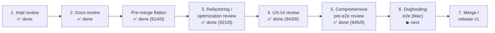

# Roadmap

> The live, forward-looking plan for claude-orchestrator. Detailed chronology,
> completed sprints, and the known-bug log live in
> [roadmap-history.md](roadmap-history.md). The framework-improvements backlog
> lives in [roadmap-backlog.md](roadmap-backlog.md).
>
> Last updated: 2026-07-02.

## Current status

The **decentralized in-repo config** refactor is **build-complete**: design closed
(ADRs 0005–0028, principles P1–P18), and Phases 0–5 are all shipped on
`feat/vault/decentralized-config` (suite **943/0**; commits local, pushed from the
maintainer's Mac). Project config now lives in `<repo>/.cco/`; the central vault and
the profile/`@local` machinery are gone; personal config lives in `~/.cco` (global Claude
config flattened to `~/.cco/.claude/`, ADR-0028); machine-local state/cache/data live in
hidden XDG buckets. The work is now in the **pre-merge review cycle**: the implementation
review, the documentation review (reorg + coherence sweep), the pre-merge **flatten**
(`~/.cco/global/.claude` → `~/.cco/.claude`, ADR-0028), the **refactoring/optimization
review** (step 3), the **UX-UI review** (step 4, ADR-0029), and the **comprehensive pre-e2e
review** (step 5, suite 943/0 → **945/0**) are all done. **Dogfooding e2e on the Mac (step 6) is
complete and validated by the maintainer** — host runs of real projects surfaced fix rounds (round 2 =
ADR-0032 pack/llms coordinate coherence; **round 3** = first `cco start` of claude-orchestrator itself).
**Round 3 is complete** — S1 (resolution surface + index normalization, ADR-0033 + migration `016` +
changelog #21), S2 (migration completeness, ADR-0009 fwd-annot), and S3 (`join` Journey E +
`forget --purge`, ADR-0034 + changelog #22/#23) all shipped, suite **1005/0**. A follow-on pre-merge
**`cco sync` UX refinement** (ADR-0035: cwd-anchored `--from` target + `--all`; summary-first diff with
`--dry-run --dump → .cco/.tmp/`) landed next, suite **1010/0**. **v1 is merged to `develop`/`main`
and released on npm** as [`@claude-orchestrator/cco`](https://www.npmjs.com/package/@claude-orchestrator/cco)
(`0.5.0` → `0.5.1` → **`0.5.2`**, 2026-06-30; CI OIDC trusted publishing). Work is now in the
**post-merge additive phase** — remaining workstreams {B, D, F} (all non-gating). The latest cut,
**`0.5.2`**, ships the user-facing **npm-install docs cutover** (npm is now the primary install path;
clone demoted to "from source") and the top-level **`cco --version`/`--help`** flags (FI-11).
Intentional post-v1 deferrals (not blockers): the
`cco config protect` helper (docs-only today), pack/template migration-scope iteration in `cco update`
(forward-compatible stub — the `migrations/{pack,template}/` dirs are empty), interactive
internalize-as-cache prompts, `cco project internalize` (Case-C), and cross-PC memory/state sync.

**Workstream B (session config capability model) is now implementation-complete** (all 7 steps,
2026-07-01) on `feat/config-access/capability-model` — three access knobs + wrapped-`cco`
container-operator mode + built-in presets + R1 unified `workspace.yml` (ADR-0036/0041; changelog
#28–31; suite **1095/1**, the 1 fail pre-existing env-only). Additive, non-gating; only release
housekeeping remains (merge into `develop` + push, both from the Mac). See the B row below.

### Path to release — sequenced workstreams

**A gated the merge (✅ done); E/B/C/D run on `develop` after it; the release is
`develop → main` + npm publish.** **C (npm packaging) is ✅ RELEASED** —
`@claude-orchestrator/cco` is live on npm via CI **OIDC trusted publishing**
(no stored token; `0.5.1` 2026-06-30, then **`0.5.2`** with the user-docs npm cutover +
`cco --version`/`--help`; the OIDC publish debug handoff was removed after release).
**E** is ✅ done + host-e2e validated. **Remaining workstreams — all additive,
non-gating: {B, D, F}** (F sequenced after C). Release housekeeping: `main`/`develop`
reconciled (✅, both at `0.5.2`); still open — validate `npm i -g @claude-orchestrator/cco`
on a Mac (then `git push --follow-tags` to publish `0.5.2`).

| # | Workstream | When | Gating? | Handoff |
|---|---|---|---|---|
| **A** | **Docs/CLI-reference cutover sweep** — bring all user + agent-facing docs to the implemented truth (the built-in tutorial/config-editor mount and consume them). **✅ done**: agent-facing doc tables remapped to the reorg tree + store layout flattened; cli.md code-grounded (0 stale/0 wrong, 11 missing flags added); removed-concept token probe clean (only migration/affirmation hits); shipped scaffold/setup doc pointers fixed; suite **1010/0**. | **PRE-MERGE — ✅ done** | **Merge gate (cleared)** | — (completed; handoff removed in post-merge cleanup) |
| **B** | **config-editor/tutorial access scope** → generalized into a **session config capability model**. **✅ DESIGN DONE (2026-07-01)** on `feat/config-access/capability-model`: two axes (A `.cco`, B `.claude`) + read surface (R1 self-info, R2 global-read) + managed floor; three knobs (`claude_access`, `cco_access` granular `edit-project/global/all`, `show_host_paths` default on); wrapped-`cco` in-container (whitelist + container-operator mode, tokens host-only, no logic duplication); caller-context signal (D8); built-ins as presets; config-editor `--all`/`--project` (only `<repo>/.cco`). **ADR-0036** (model) + **ADR-0041** (R1) Accepted; config-editor + tutorial design docs rewritten. **Implementation COMPLETE (2026-07-01) on `feat/config-access/capability-model`** — **all 7 steps done**: (1) caller-context signal D8; (2) three-knob access resolution + precedence + `--enable-config-edit` alias; (3) Axis-B/Axis-A mount generation driven by the knobs (generalized `_committed_ro`); (4) **wrapped-`cco` shim + container-operator mode** (`_cco_container_operator` guard, whitelist/blocklist in `bin/cco`, Dockerfile bake to `/opt/cco`, bucket mounts DATA/CACHE-per-level + STATE index-only ro + tokens/secret-file masking; changelog #29; ships R2); (5) **built-in presets** (config-editor `all`/`edit-all` + `--all`/repeatable `--project`, tutorial `none`/`read`, both emitting the operator env; built-in docs rewritten to the wrapped-`cco` model; changelog #30; also fixed a pre-existing tutorial-mount bug — `source:`→name-based); (6) **R1 self-info (ADR-0041)** — unified `workspace.yml` absorbs `packs.md` (`knowledge`+`llms` sections) + gated `path_map` (`show_host_paths` default on); net cut (no dual-emit), all consumers migrated (hooks + `init-workspace`); changelog #31; doc-sweep. Suite **1095/1** (the 1 fail pre-existing env-only). **R1-D5 completeness gate PASSED via live host dogfood (2026-07-01)**: after `./bin/cco build && ./bin/cco start` from the branch, the container's baked hook renders `knowledge`/`llms` from the new `workspace.yml` (no `packs.md`), `path_map` carries the real host path, and `.cco` is `:ro` under `cco_access=none` (edit-protection confirmed). (7) **docs polish + host cleanup** — stale committed `.cco/claude/packs.md` removed via `git rm` on host (dead file, no migration needed); grep-audit confirms no `packs.md` survives in shipped code beyond the intentional `rm -f` stale-cleanup; forward-annotation added to `adr-0014` (→ ADR-0041 R1). **All 7 steps done — only release housekeeping remains: merge into `develop` + push (both from the Mac).** Additive. | post-merge, on `develop` | No (additive) | design brief: [`config-editor-access-design-handoff.md`](../configuration/decentralized-config/config-editor-access-design-handoff.md) · impl: [`config-access-capability-model-impl-handoff.md`](../configuration/decentralized-config/config-access-capability-model-impl-handoff.md) |
| **B2** | **agent ↔ cco access & context** — follow-on to B, surfaced by host dogfooding. Reframes agent awareness + config read/write as a **three-level model** (A hook context injection / B wrapped-`cco` + read scoping / C managed rules) and **retires the `workspace.yml` file**. **✅ DESIGN APPROVED (2026-07-02)** — [ADR-0042](../configuration/agent-cco-access/decisions/0042-agent-cco-interaction-model.md) + [design](../configuration/agent-cco-access/design.md). Ratified decisions: normal default `cco_access=read-project` (was none); full symmetric read scoping (`read-project/global/all`); config-editor **broad default** + `--project` repo-aware + `--repo`; `cco docs` at any read level; descriptions single-sourced in `project.yml` (optional `repos[]/extra_mounts[].description`), rendered into injected context (no file, no round-trip); `init-workspace` split (keeps CLAUDE.md, drops workspace.yml write-back). **Corrects a step-7 error**: legacy projects carry stale committed generated files (`workspace.yml`/`packs.md`/`scheduled_tasks.lock`) in `<repo>/.cco/claude/` → **migration 014 + `.gitignore`** required (the earlier "no migration needed" was wrong). Additive schema (changelog #32) + cleanup migration. **✅ IMPL + REVIEW COMPLETE (2026-07-02)** (7 steps + 4.5, dependency-first; stacked on B; only merge→develop + push from the Mac remain). **Step 1 ✅ DONE (2026-07-02, `0e6bc87`)**: symmetric read scoping (`read-project/global/all`, `read`→read-all alias), normal + tutorial default `read-project`, operator shim gates `template`/`remote list` behind `read-global`, scope-aware `usage()` in container-operator mode. **Step 2 ✅ DONE (2026-07-02, `8183b4a`)**: Level-A hook injection replaces `workspace.yml` (net cut) — session-info computed host-side, injected as `CCO_SESSION_CONTEXT`/`CCO_SUBAGENT_CONTEXT` env (base64) via new `lib/session-context.sh`; `lib/workspace.sh` retired; hooks decode+merge; `:ro` overlay gone; `init-workspace` reads injected context/`project.yml`, Step-6 write-back dropped; INV-2/3/4 honored; tests on the new parity surface; suite `1100/1` (pre-existing env-only fail). `read-project` mount-narrowing still open (re-eval with Step 4). **Steps 3–7 + 4.5 ✅ ALL DONE (2026-07-02)**: (3 `a098719`) `repos[]/extra_mounts[].description` rendered into Level A (changelog #32); (4 `9e4535f`) config-editor broad-default + `--project`(repo-aware)/`--repo` + **`read-project` mount-narrowing to referenced packs**; (4.5 `62a166b`) **`lib/access-scope.sh`** — unified env & access-scope layer scoping read-verb OUTPUT ([ADR-0043](../cli/decisions/0043-unified-cli-environment-access-scope.md); `CCO_PROJECT_PACKS/LLMS` membership signals; count-only stderr notice; changelog #33); (5 `027c345`) managed `cco-config-interaction.md` (access-conditional) + Level-A read-project awareness; (6 `61c8503`) **migration 014** purges committed generated artifacts + `.gitignore` (single-source writer `_cco_write_project_gitignore`); (7 `c022b04`) docs cutover + `workspace.yml`-file retirement. **✅ CORRECTNESS REVIEW DONE (2026-07-02, commits `d8e6848..b33f458`)** — 5-domain cross-verified; no blockers; 2 MAJOR fixed (INV-B llms name-leak; stale `project.yml`/template access model) + MINORs (changelog #34). Suite **1128/1** (pre-existing env-only fail). **CODE/DOCS COMPLETE — only merge → `develop` + push (both branches, from the Mac) remain.** | post-merge, on `develop` (stacks on B) | No (additive) | [design](../configuration/agent-cco-access/design.md) |
| **C** | **npm packaging & distribution** — ship `cco` as an npm package. **ADR-0037 + design doc.** **✅ IMPLEMENTED 2026-06-30** on `feat/packaging/npm-distribution` (suite **1036/0**): `package.json` `@claude-orchestrator/cco` + `files` allowlist (`npm pack` clean 182 files; Linux `npm i -g` validated); `USER_CONFIG_DIR` **split** → STATE runtime (read-only `FRAMEWORK_ROOT` fix D5); **read-only publish-gate test** (`tests/test_readonly_framework.sh`, caught+fixed a cp-mode refresh bug); `docs/users`-only via allowlist; **`cco docs`** (D9, changelog #25); **`cco update` provenance-aware** (D8, changelog #26); `scripts/release.sh` + `check-pack-hygiene.sh` + CI `release.yml` (publish on tag **or manual `workflow_dispatch`**, via OIDC) + Pages `pages.yml`. settings.json decomposition resolved (D10). **✅ RELEASED 2026-06-30: `0.5.1` published to npm via CI OIDC trusted publishing — no stored token; the earlier NPM_TOKEN plan was replaced by OIDC trusted publishing (debug handoff removed after release).** **Follow-on `0.5.2` (2026-06-30)**: user-facing npm-install docs cutover (README/installation/cli/project-setup → `npm i -g` primary, clone demoted to "from source"; CONTRIBUTING gains local-dev + release/publishing) + top-level `cco --version`/`-v` and `--help`/`-h` (FI-11, changelog #27); `main`/`develop` reconciled, tag `v0.5.2` cut locally (push from the Mac publishes). Deferred: image-tag-by-version (v1 keeps `:latest`); macOS `npm i -g` validation (on a Mac). | post-merge, on `develop` | **Release gate** | [ADR-0037](../engineering/decisions/0037-npm-packaging-distribution.md) · [design](../engineering/design/packaging-distribution.md) · (handoffs removed — released) |
| **D** | **`cco project save` — project-config versioning helper** — ergonomic, path-scoped commit of `<repo>/.cco/**` + isolated history. Reintroduces the old `vault save` convenience for the decentralized in-repo model. ADR-0038, additive. Needs its own design session (see below). | post-merge, on `develop` | No (additive) | _design session — see §D below_ |
| **E** | **Native Claude Code install** — replace the deprecated `npm install -g @anthropic-ai/claude-code` with the official native installer run at first start, into a persistent CACHE-backed mount so Claude auto-updates in-place (no rebuild). Re-implements Rares' `#B2` onto develop's XDG/decentralized architecture. **✅ done + host e2e validated (2026-06-29)** on `feat/docker/native-claude-install` (commits `ebe0e1b` impl+tests, `5f6b975` docs): install home → CACHE `claude-install/{bin,share}` bind-mounted to `~/.local`; config knob `~/.cco/claude-version` (default `latest`, knob outranks the baked default); re-pin via channel marker; `cco build --no-cache` resets the cache; `cco clean --all` leaves it untouched (regression test). **No migration** (purely additive). ADR-0039, changelog #24. Suite **1022/0**. **▶ ready to merge `feat/docker/native-claude-install → develop`.** | **post-merge, FIRST — ✅ done** | No (additive) | (handoff removed — done + resolved) |

Sequence: **A → merge → E (✅) → {B, C, D}; C ✅ RELEASED (`0.5.1` on npm via OIDC,
2026-06-30) → remaining additive work {B, B2, D, F}** (B2 = agent↔cco access, stacks on
B; F = opinionated extraction + `cco update` refactor, after C). ADR map: **0036** + **0041** (B — capability model +
R1), **0042** (B2 — agent↔cco access, ✅ design approved), **0037** (C, ✅ shipped +
released), **0038** (D), **0039** (E, ✅), **0040** (F). ADR **0042** (B2, ✅ accepted) +
**0043** (unified CLI env & access-scope, ✅ accepted). Next free ADR = **0044**.

#### B2 e2e-review fix — agent ↔ cco access (✅ implemented 2026-07-05)

The B2 host-dogfood e2e review's 9 consolidated roots are **implemented** on
`feat/config-access/e2e-review` (fix design: `configuration/agent-cco-access/e2e-review/fix-design/`).
Read/write **symmetric** scope model (edit-project reads at project scope; read-global ≠
read-all; target-tree write gate); label-based session identity (R1); operator-mode project
resolver + `cco whoami` introspection (R2/R4/F4); explicit `none` contract + declared-but-
unresolved markers + Level-A-as-sole-authority hook (R6/R7/R8); shim refusal taxonomy +
filtered in-container help + 0/2/1 exit codes (R9); `docs/users` baked into the image (R10).
ADR-0036/0042/0043 forward-annotated; changelog #36. Suite green. **Needs `cco build` +
re-run of the e2e harness (acceptance gate) before merge → develop + push (from the Mac).**

**Two post-fix follow-ups** (deferred from the fix design overview §6, *pending maintainer approval*):
- **Internal maintainer CLI reference** — matrix `command × {host, in-container} × cco_access`,
  seeded by the R5 write-scope table, the R9 refusal taxonomy, and the D8 exit-code convention.
- **Post-fix UX/CLI-completeness review** — verb intuitiveness/naming; finalizes the F4
  introspection verb name (`whoami` is provisional; vs `session`; reserve `cco status`?).

#### F — opinionated-config extraction + `cco update` responsibility refactor (post-C, structural)

Make the cco **core agnostic** of opinionated config: keep `managed/` baked in, move the opinionated
defaults (workflow/git/documentation rules, agents, skills, global `CLAUDE.md`, parts of `settings.json`)
into a **separate official axis-2 sharing repo** (working name `cco-config-defaults`), installable like any
shared resource. Refactor `cco update` to split its two mixed responsibilities — **core engine+migrations**
vs **external shared-source 3-way merge**. Realizes **F-opin** (`../configuration/decentralized-config/design.md`
§12). **Decoupled from C** (packaging does not require it); sequenced **after** C. Analysis (2026-06-30):
axis-2 lacks a global-config install target + per-scope install + single-resource granularity + global
source/meta tracking (gaps G1–G7); recommended vehicle = a new **`config` resource kind**
(`cco config install/publish/update [--scope global|project] [--pick]`), pending a **resource-taxonomy
analysis** first. Full reference:
[`opinionated-extraction-and-update-refactor-handoff.md`](../engineering/opinionated-extraction-and-update-refactor-handoff.md).
ADR-0040, additive, **non-gating**.

#### D — `cco project save` (project-config versioning helper) — design notes

**Problem.** In the decentralized model, project config lives in `<repo>/.cco/` and is versioned by the
repo's **own git**. To version just the config the user must manually stage only `.cco/**` among unrelated
repo changes — error-prone and easy to get wrong. The old `cco vault save` gave a one-command,
secret-checked commit of the personal store; the in-repo model lost that ergonomics for **project** config.

**Proposed scope (v1 of the helper).**
- A verb that stages **exclusively** `<repo>/.cco/**` (never touches the rest of the repo's working tree)
  and commits it with a message, in the repo's own git — a path-scoped `git add <repo>/.cco && git commit`.
- **Secret detection** before commit, reusing the existing scan from `cco config save` (`lib/secrets.sh`);
  `<repo>/.cco/secrets.env` stays gitignored and is never staged.
- **Isolated history** view: surface only the commits that touched the project config.

**Naming — open question.** `cco config save` is **taken** (it versions the personal store `~/.cco`).
Candidates, for symmetry: **`cco project save`** (recommended — mirrors `cco config save`, but for the
repo's project store) · `cco save` · `cco project commit`. Decide in the design session.

**Isolated history — feasibility: YES.** `git log -- <repo>/.cco/` already path-filters commits that
touched the project config (works regardless of how the commit was made). For commits made specifically
via the helper, optionally add a commit **trailer** (e.g. `Cco-Save: true`) and filter with
`git log --grep`. A companion read verb (`cco project history` / `cco project log`) can wrap either.

**Type & gating.** Additive, non-gating. **Open questions for the session**: exact verb name; path-only
vs trailer-based history; whether to offer `--amend`/message templating; interaction with a multi-repo
project (commit `.cco/` in the invoking repo only, or fan out to config-bearing repos like `--sync`?).

**⚠ Integration with agent↔cco access (B2, [ADR-0042](../configuration/agent-cco-access/decisions/0042-agent-cco-interaction-model.md)).**
B2 designs/references `cco project save` **as if it already exists**: the Level-C config-interaction
rule tells edit-level agents to version config atomically with `cco project save`, and it is expected to
be reachable via wrapped-`cco`. When D is designed/built, **verify the fit with the agent↔cco model**:
(a) classify the verb in the operator shim (in-container write verb at `cco_access ≥ edit-project`, vs
host-only?); (b) ensure the injected context + managed rule reference the real verb name once decided
(§D naming is open — B2 assumes `cco project save`); (c) confirm secret-scan + path-scoping hold under
the container-operator mode. Until D lands, the managed rule (post-review, `2b0934e`) degrades
gracefully — it names `cco project save` as *forthcoming* and tells the agent to commit a project's
`<repo>/.cco/` with the repo's own git in the meantime, so an edit-level session never hits an
"Unknown project command". When D ships, restore the direct `cco project save` guidance.

## Decentralized-config v1 — phase index

All phases closed; Phase 5 build-complete. Full per-phase commit/baseline log:
[roadmap-history.md → phase-by-phase log](roadmap-history.md#decentralized-config-refactor--phase-by-phase-log).

| Phase | Scope | Status | Key outcome |
|-------|-------|--------|-------------|
| Design + review (V) | Analyses, ADRs, impl-readiness review | ✅ Closed | ADRs 0005–0023; 4-bucket taxonomy, coordinate-per-unit, sharing unification; 58-finding review resolved into ADR-0021/0022/0023 |
| **P0** Substrate | Resolver, STATE index, coordinate parsers, mount re-point | ✅ Closed | `cco resolve` substrate; `.claude` overlays → CACHE `:ro`; baseline 982/16 |
| **P1** Core local | `cco resolve`/`path`/`sync`, reminder aggregator, `project add` | ✅ Closed | Index-backed local commands; suite 1043/16 |
| **P2** Migration & bootstrap | J0 bootstrap, backup, `init --migrate`, `join` | ✅ Closed | Eager global + lazy per-project migration; ADR-0024/0025; suite 1087/8 |
| **P3** Legacy cutover | Decentralized `start`, `tag`/`config`, vault removed, `init` scaffold | ✅ Closed | Vault/profile world deleted; config-editor built-in (ADR-0026/0027); suite 936/3 |
| **P4** Sharing core | source→DATA, structure discovery, sync-before-publish, 2×2 verbs | ✅ Closed | Manifest subsystem deleted; schema bridge → index-only; ADR-0022; suite 827/1 |
| **P5** Sharing-ext + lifecycle | `forget`, `config validate`, pack resolution/internalize, `project validate`/`coords`, `update --check`, `config protect` | ✅ Build complete | Lifecycle + sharing-ext verbs; changelog #15; suite **894/0** |

## What's next

### Pre-merge review cycle (gate to v1)

1. **Implementation review** — ✅ done (2026-06-25 adherence review + 2026-06-26 deep
   migration review; all findings resolved, baseline 905/0).
2. **Documentation review** — ▶ **largely done** (this step). Reorganized `docs/` to the
   Cave structure (`maintainers/` + `users/` + `archive/`, audience→domain→doc-type leaf;
   `guiding-principles` promoted to `foundation/`); ran the shipped-behavior coherence
   sweep (browser-mcp/llms/packs/update-system/environment/security designs aligned to the
   4-bucket model; ~220 cross-refs repaired; `users/` verified clean). Plan + execution
   log: `configuration/decentralized-config/documentation-reorganization-plan.md`.
   **Deferred to post-merge** (see backlog): per-domain split of `cli.md` /
   `context-hierarchy.md` / the `configuration-management.md` guide, and the by-domain
   redistribution of the `decentralized-config/` sprint folder.
3. **Refactoring / optimization review** — ✅ **done (2026-06-27).** Record:
   [`reviews/27-06-2026-refactoring-review.md`](configuration/decentralized-config/reviews/27-06-2026-refactoring-review.md).
   8 atomic LOCAL commits `e65aa2f`→`0c3c822`, behaviour-preserving, suite **914/0 → 921/0**.
   Applied: `_peel_tab` TSV splitter (#1) + `_coords_scan_section` (#5) + per-section split of
   `_pv_validate_unit` (#4) + `_project_foreach` (#2, honest 6-of-13 scope) + `cmd_update`
   307→212 via `_update_usage`/`_update_discover_pack_remotes` (#7/#11) + `cmd-build` secret
   scan routed through `lib/secrets.sh` (#10, "route-as-is" — non-blocking warn) + L4/NIT
   backup-diagnostics polish. Skipped as moot/forced (KISS/YAGNI): #3, #6, #8, #9, #12, #13.
   **L6** (container-detection false-positive for a host user named `claude`) **fixed**
   (`a216c8b`): dropped the `HOME=/home/claude` heuristic, kept the daemon-injected
   `/.dockerenv` signal + an explicit `CCO_IN_CONTAINER` test/dev seam — cco is Docker-only,
   so no entrypoint/image change was needed. The **global build-extension reader bug**
   (`cco build` read setup scripts from `~/.cco/global`, now `~/.cco` top level) was fixed
   2026-06-26 (`a92effc`); **re-validate in dogfooding** (step 6).
4. **UX-UI review** — ✅ **done (2026-06-27).** Record:
   [`reviews/27-06-2026-ux-ui-review.md`](configuration/decentralized-config/reviews/27-06-2026-ux-ui-review.md);
   design in **[ADR-0029](configuration/decentralized-config/decisions/0029-ux-ui-review-unified-list-confirm-symmetry.md)**
   (refines ADR-0023 D1). A reachability sweep came back clean; the fixes were coherence
   defects, implemented in 7 phases (Ph.1–7) across atomic LOCAL commits, suite **921/0 → 943/0**:
   unified `cco list [<kind>] [--tag] [--sort]` + redirect stubs (D1); uniform
   destructive-confirm contract `-y`/`--yes`/`--force`-override (D2); `cco tag remove` +
   `cco template update`/`validate` (D3); `cco path` demoted out of `cco help` (D4); the help
   sweep + `-h` alias + `cco forget` L8 recovery hint (D5). Shipped-behavior docs re-synced
   (`cli.md`, repo `CLAUDE.md`, design §7).
5. **Comprehensive pre-e2e review** — ✅ **done (2026-06-27).** Record:
   [`reviews/27-06-2026-pre-e2e-comprehensive-review.md`](configuration/decentralized-config/reviews/27-06-2026-pre-e2e-comprehensive-review.md).
   Multi-agent, read-only, adversarial whole-system pass over v1 across four dimensions
   (bug-free · design adherence · user-guide/CLI coherence · migration completeness). **No
   blocker**; the D4 migration dimension came back clean. 20 verified findings (6 high / 5 med /
   9 nit) resolved in 5 atomic LOCAL commits (one per cluster), suite **943/0 → 945/0** (+2
   regression tests). Headline fixes: migration 009 no longer rewrites `~/.gitignore` on fresh
   installs (C1); the ADR-0029 D2 destructive-confirm contract is enforced in code (C6/C7);
   `start`/`stop` resolve multi-repo projects via index membership (C2/C3); `docs/users/` +
   `CLAUDE.md` re-synced to the shipped surface (C12–C20); dead-code/comment cleanup
   (C4/C8/C9/C10/C11). Open items handed to step 6: the `_confirm_destructive` `/dev/tty` idiom
   decision, and a spot-check of the §6 coverage gaps (`cmd-update.sh`, `cmd-resolve.sh`,
   `index.sh` atomicity).
6. **Dogfooding e2e on Mac** — plan: `configuration/decentralized-config/P2-dogfooding-validation.md`
   (sandboxed roots + HOME-flip; legacy-vault removal accepted only after merge + validation);
   runnable checklist (legacy → backup → migration → functional test → failure-path, with the
   pre-migration safety nets): [`configuration/decentralized-config/e2e-validation-checklist.md`](configuration/decentralized-config/e2e-validation-checklist.md).
7. **Merge / release v1** — merge `feat/vault/decentralized-config`, reconcile both roadmaps,
   mark ADRs.

### Dogfooding findings (step 6 — in progress, host e2e on Mac)

Real-host migration of `cave-flow` surfaced a sequence of defects; fixing them all
**pre-merge**. Commits are LOCAL (push from Mac). Suite baseline 945 → **966/0** (A/B/B-robustness/C/D).

- **Migration completeness** ✅ — `cco init --migrate` dropped most of `project.yml`
  (extra_mounts/docker/auth/github/browser). Fixed (passthrough-by-default + extra_mounts
  name-synth, **ADR-0030**); GAP-1 remotes de-tokenize split; GAP-2 template provenance.
- **A — `cco resolve` never prompted** ✅ (`c558568`) — the interactivity guard used
  `[[ -t 0 ]]` inside `while read … done < <(yml_…)` loops (fd 0 = the process-substitution
  pipe), so it always took the non-interactive branch; local-only `extra_mounts` were
  permanently unresolvable. Fixed with `_cco_have_tty()` (the `/dev/tty`-reachability idiom),
  replacing 5 broken guards.
- **B — `cco start` crashed `yaml: line 52`** ✅ (`7f65268` + `c558568`) — migrated
  `extra_mounts` whose legacy source was `@local` stored the marker in the index → reached the
  generated compose as `- @local:/…:ro`, whose leading `@` is a reserved YAML char that breaks
  `docker compose`. Fixed at the root (migration resolves `@local`→real path via
  `local-paths.yml`) + defense (bridges skip non-absolute index values, so a dirty index can't
  crash start before re-migration).
- **B-robustness — quote compose volume paths** ✅ (`02c17f4`) — cco emitted volume paths
  UNQUOTED, so a resolved path with a space / YAML-special char (the host has `…/Cave gif/…`)
  broke the compose. Added a DRY `_compose_vol()` emitter (double-quoted) routed through every
  bind-mount site (`cmd-start.sh`/`packs.sh`/`llms.sh`); verified with `docker compose config`
  on space-bearing paths. Suite 950 → 953/0.
- **C — `cco list` packs UX** ✅ (`9434919` + `451c385`) — the packs table wrapped because of
  hardcoded column widths plus a latent `grep -c` count bug (empty category → `"0\n0"`, an
  embedded newline that split rows). Fixed with a shared `_fit_col` helper (dynamic NAME width +
  ellipsis) across `cmd_list`/`cmd_pack_list`, the count bug, `--sort tag` (untagged last,
  tie-break by name), `--reverse`/`-r`, and a TAGS column on `cco list packs`. Additive flags +
  a rendering fix refining ADR-0029 D1 (forward-annotated, no new ADR). Suite 953 → **959/0**
  (+6 tests; the 6 in-container `test_paths`/`test_is_installed` failures are a pre-existing
  XDG-base env quirk, identical with/without this change — not a regression).
- **D — `cco project rename [<old>] <new>`** ✅ (**ADR-0031**) — new verb that re-keys the project
  identity across every store: `project.yml` `name:` in each member repo, the STATE index
  membership, the DATA tags, and the STATE/CACHE/DATA identity dirs. New `lib/cmd-project-rename.sh`
  + `_index_rename_project`/`_tags_rename` helpers; cwd-first one-arg + explicit two-arg forms;
  preview + confirm (`-y`, non-TTY→die). **Strict (D3)**: refuses unless every member resolves on
  this machine — a partial `name:` rewrite would diverge members permanently under `cco sync`'s D2
  guard. Surfaced two related findings: (1) `:`/`/` in a name silently corrupts the index/dirs →
  added the shared `_cco_valid_project_name` validator (Design Invariant 10) used by init/start/
  rename, closing a latent `cco start` regex inconsistency; (2) cross-resource name policy +
  id-consumption re-validation deferred to a hardening follow-up (below). +7 tests; suite 959 →
  **966/0** (the 6 in-container `test_paths`/`test_is_installed` failures are the same pre-existing
  XDG-base env quirk).

#### Round 2 (host e2e of `cave-web`/`cave-flow`, 2026-06-29) — ✅ DONE pre-merge

Five findings from a second e2e pass: multi-agent analysis → design → implementation. **All resolved
pre-merge** (commits LOCAL on `feat/vault/decentralized-config`, push from Mac). Suite **966 → 978/0**
in-container. changelog **#19** + **#20**.

- **F2 — pack llms not re-fetchable (coordinate drift)** ✅ (**ADR-0032**; `cc182dd`, `57ad53b`, `2d2a718`)
  — `cco pack validate` flagged missing llms with a **non-executable** remedy (`cco llms install` needs a
  url it never supplied). Root cause: `pack.yml` allowed url-less (short-form) llms, pack migration
  relocated wholesale without url backfill, and pack validate checked only local presence — drifting from
  the ADR-0017 D1 / ADR-0019 D6 invariant (llms url mandatory → always re-fetchable). Closed: D2 validate
  parity + executable remedy / url-gap flag; D3 `_backfill_pack_llms_urls` run from `cco update` (an
  update-flow step, **not** a `migrations/pack/NNN` — pack-scope migrations are unwired); D4 long-form
  template with required url; D5 `cco resolve` heals missing llms (hybrid install-from-url / different-url
  / skip), unified under one heal verb (P14), **not** a separate `cco llms resolve`.
- **F1 — `validate` output inconsistency** ✅ (`9797386`) — `project validate` is greppable/no-symbols
  (ADR-0023 D2) while `pack`/`template validate` used inline `✓/✗/⚠`. Unified `pack` + `template validate`
  to the greppable contract (`<name>: <reason>` lines + `validate: N issue(s)` summary; success still
  prints "… is valid"). `config validate` left unchanged (orphan-sanitization, ADR-0021; outside the
  user-stated `{project,pack,template}` scope). Refines ADR-0023 D2 / ADR-0029; no new ADR.
- **F3 — `cco project coords` wording** ✅ (`5aab14c`) — not a bug (validate = per-unit reachability;
  coords = cross-unit consistency), but the empty-result message read as a contradiction. Reworded +
  help note distinguishing the two.
- **F4 — `cco clean` default friction** ✅ (`cfb105e`) — no path/scope bug; default cleans only `.bak`, so
  `.tmp` needs explicit `--tmp`. Shipped: conservative default + discoverability hint + clearer help/scope
  docs. Deeper redesign deferred to the Post-v1 backlog.
- **F5 — 6 in-container test failures** ✅ (`6fcd185`) — not regressions; the anti-resolve guard
  (ADR-0007, keyed on `/.dockerenv` since `a216c8b`) fires in-container while 6 tests omitted
  `CCO_ALLOW_HOST_RESOLVE=1`. Added the flag so the suite is green in-container **and** on host.

Residual gate: Mac host re-validation (`e2e-validation-checklist.md`) before merge.

#### Round 3 (first real `cco start` of `claude-orchestrator` itself via decentralized-config, 2026-06-29) — ✅ S1 · S2 · S3 ALL DONE

The project's own first migration + start on the Mac surfaced four scopes of defects.
Each was **verified against the shipped code** (read-only multi-agent analysis, file:line
evidence — not trusting any prior resolution-log). They are organized into **three
sequential fix sessions**, each running the full Analysis → Design → Implementation cycle
with approval gates (per `.claude/rules/workflow.md`). Order is dictated by data/dependency
flow: correct the index data → unify the resolution surface → multi-repo membership ops that
depend on clean resolution. Commits will be LOCAL (push from Mac). Baseline **978/0**.

> **Pre-merge migration principle (applies to S1–S3 and the whole decentralized-config
> branch).** This branch is **unreleased** — there are **zero external installs**, so no user has
> received any of these bugs or the decentralized migration at all. Therefore: **fix the *live*
> legacy→new migration path** (`_cco_migrate_project` / `_cco_populate_global_from`) so the one
> migration real users run post-merge is correct in a single pass (**born-at-latest**). Do **not**
> author fix-up `migrations/{scope}/NNN` scripts to repair an install already on the new layout from
> an intermediate branch state — the only such install is the developer's own e2e test, rebuilt from
> backup via `cco forget` + `cco init --migrate` (or a fresh `cco update`). **Keep** the legacy-vault
> chains `migrations/{global,project}/001-015`: real legacy vaults still migrate exactly once. This
> avoids designing redundant migration scripts in S2/S3.

Verified findings (read-only analysis, 2026-06-29):

- **Scope 1 — resolve/path** (all confirmed): tilde/`@local` written raw into the STATE index
  by the migration repos branch (`lib/migrate.sh:761-763`; the mounts branch `802-813`
  already normalizes) → false AD5 conflict in `_index_path_conflicts` (`lib/index.sh:184-188`,
  exact-string compare) and `cco resolve <name>` "not resolvable" (`lib/cmd-resolve.sh:65-77`);
  `cco path list` surfaces the resulting `@local` entries. `<name>` vs cwd asymmetry resolves
  with the tilde fix.
- **Scope 2 — migration completeness** (MERGE-BLOCKER, data-loss): transcripts are **not
  migrated** — the helper `_cco_project_session_transcripts` (`lib/paths.sh:163`,
  dest `<state>/.../session/claude-state`) exists but is **never invoked**; migration copies
  only memory (`lib/migrate.sh:1010-1015`). Memory migrates correctly; the legacy backup is a
  complete raw tar (`lib/migrate.sh:158`, incl. `.git` + gitignored + all profiles' shadows),
  so no data is lost at source — the gap is the missing local backup→destination mapping.
  **Decision premise (confirmed 2026-06-29):** the local legacy→new-layout migration **must
  copy transcripts** (no data loss); ADR-0009's deferral applies **only to cross-PC sync**,
  not to local migration. The session re-audits *every* resource type independently.
- **Scope 3 — `cco join`** (design↔code gap): current `cco join` (`lib/migrate.sh:1058-1084`)
  is Journey C (no `<project>` arg, registers a repo that already hosts its own `.cco/`),
  which is **redundant** — `cco start` (cwd-first, `lib/cmd-start.sh:114-123`) and
  `cco resolve --scan` (`lib/cmd-resolve.sh:297,308`) already cover it. `design.md:707` +
  `cli.md:275-295` promise `cco join <project>` = Journey E (add the current repo as a member
  to an existing project's `repos[]`), **not implemented**. Repurpose `join`→Journey E (drop C),
  mirroring the multi-repo same-id edit pattern of `cco project rename` (ADR-0031).
- **Scope 4 — `cco forget`** (cleanup enhancement): current `lib/cmd-forget.sh` removes index
  membership + per-repo path (shared-guard), STATE/DATA/CACHE dirs (incl. memory, `:132`), and
  tags, but **never touches `<repo>/.cco`**. Add an always-on TTY final prompt + `--purge` flag
  to delete `<repo>/.cco` across member repos, **ownership-guarded** (`project.yml` `name:` ==
  forgotten id, via `_cco_project_id`), with uncommitted-changes warning + backup; default
  "repo untouched" preserved. Reuses `_confirm_destructive`/`_reminder_git_dirty`.

| Session | Scopes | Goal | Decision artifact |
|---|---|---|---|
| **S1 — Resolution surface + index normalization** ✅ **DONE (2026-06-29)** | 1 | Fix tilde/AD5/`@local` at the index boundary (`_index_set_path` + `_index_path_conflicts` + expansion in `_resolve_unit_dir_for_project`) + a one-shot index-cleanup migration; `cco path list` expands & flags non-absolute entries. Design the unified `resolve↔start` resolution surface: status of **all** referenced resources (repos/llms/packs/mounts) + per-resource actions (clone/download-to-chosen-path / explicit local path / cached pack), `cco start` on an unresolved project **invokes** resolve (no command duplication, P14 never-block). | new **ADR-0033** |
| **S2 — Migration completeness (data-loss)** ✅ **DONE (2026-06-29)** | 2 | Independent re-audit (4 parallel analyst agents: per-project / global / transcript-wiring / backup+chains) → **2 confirmed data-loss gaps, all else SAFE**. **GAP#2 transcripts**: wired the missing `session/claude-state` copy mirroring memory (dual-resolve active+shadow, `cp -rn`, dest == `cco start` mount). **GAP#1 arbitrary secret files**: glob-copy `*.env`/`*.key`/`*.pem` into `<repo>/.cco/` gitignored-by-design, secret-scan aligned to the project `.gitignore`. D2 dissolved (projects are profile-exclusive → no multi-profile divergence). | forward-annotated **ADR-0009** + design §9; **no new ADR, no changelog** (completeness bugfix) |
| **S3 — Multi-repo same-id ops: `join` + `forget`** ✅ **DONE (2026-06-29)** | 3 + 4 | Built one reusable ownership-guarded classifier `_project_member_status` (5-way: unresolved/code-only/foreign/divergent/synced via index + `name:` + sync-meta F39) shared by `join`, `forget --purge`, and `cco project show` (the `_project_member_role` retrofit, which closed two latent ADR-0024 D5 bugs). **`cco join`→Journey E** (`<project>` arg + `--name` + `--sync`; edits `repos[]` in all in-sync same-id members, prompts on divergent Case C — NOT strict since `repos[]` ≠ the `name:` sync discriminator, refuses non-TTY divergent; url auto-derived from `git remote origin`; D2 clobber-guard on `--sync`; Journey C dropped). **`cco forget --purge`** deletes owned `.cco/` with backup + consent (default repo-untouched preserved). 4 commits `6926d35`→`4a176ee`, suite **1005/0**. | new **ADR-0034** (join/Journey E); forward-annotated **ADR-0021** D2 (forget) + **ADR-0024** D5 (classifier); changelog **#22** (join) + **#23** (forget --purge) |

Dependencies: S1's index-boundary fix also corrects the migration writer (`migrate.sh:762`
flows through `_index_set_path`), so S1 precedes S2 (re-test migration on a corrected index)
and S3 (join/forget rely on clean member resolution). **S1 shipped** as ADR-0033 + changelog #21
(7 commits `cb99e60`→`dbb1e96`, suite **989/0**); the bug-fix (a) corrected the migration writer +
added cleanup migration `016`, and (b) unified the resolve surface (one heal verb for
repos/mounts/llms/packs, `cco start` invokes `_resolve_unit`, never-block). **S2 shipped** (3 commits
`784016f`→`ab15880`, suite **989→993/0**): wired the transcript copy (GAP#2) + arbitrary secret-file
copy (GAP#1) into the live `cco init --migrate` path, forward-annotated ADR-0009, re-synced design §9,
added `test_migrate_completeness.sh` as the audit-matrix oracle — **no new ADR, no changelog, no
migration script** (per the pre-merge principle above). **S3 shipped** (4 commits `6926d35`→`4a176ee`,
suite **993→1005/0**): shared `_project_member_status` classifier + `cco join` Journey E (new
`lib/cmd-join.sh`, ADR-0034) + `cco forget --purge` (ADR-0021 D2 fwd-annot), changelog #22/#23,
`test_join.sh` + extended `test_index.sh`/`test_forget.sh`. Residual gate = **host re-validation on
the Mac** (`e2e-validation-checklist.md` + `P2-dogfooding-validation.md`). **Next free ADR = 0035;
next changelog = #24.** ▶ Next session = **v1 merge/release (step 7)** after host e2e.

### Pre-merge: flatten `~/.cco/global/.claude/` → `~/.cco/.claude/` ✅ DONE (2026-06-27)

The global Claude config now lives at the flat `~/.cco/.claude/` (the vault-era `global/`
wrapper is gone — `~/.cco` is already the global config scope). Folded into the single
decentralized-config v1 migration so every user gets the flat layout in one coherent move,
with no second `mv` later. Decision recorded in **ADR-0028** (supersedes the layout in
ADR-0024 / ADR-0026; foundation ADRs forward-annotated). The future per-project
centralization becomes `~/.cco/projects/<name>/` (P18), a clean sibling of `~/.cco/.claude/`.

- **ADR + living design** — ADR-0028 + design.md §2/§6/§7/§9/§11 + file-destinations and
  scope-hierarchy design rewritten to the flat layout (`b1a35cc`).
- **Code + migration** — new `_cco_global_claude_dir()` resolver; `GLOBAL_DIR` /
  `CCO_GLOBAL_DIR` retired; all readers/writers repointed; `migrations/global/015`
  (idempotent flatten, converges fresh / legacy-vault / eager-update). Also fixed a latent
  inconsistency: global root files (`setup.sh`, `setup-build.sh`) reseed to `~/.cco` top
  level. `defaults/global/.claude` (shipped source) unchanged (`cd6c0b3`).
- **Tests** — `CCO_GLOBAL_DIR` removed from the harness; +4 migration-015 tests; suite
  green **912/0** (`CCO_ALLOW_HOST_RESOLVE=1 ./bin/test`).
- **Docs** — shipped-behavior user docs + root `CLAUDE.md` repointed to `~/.cco/.claude`.
- **Remaining** — pre-merge dogfooding (real `cco update` flatten on a live install).

### Post-v1 (decentralized-config backlog)

Decided-but-deferred; each rides the shipped v1 substrate. Priorities are a recommendation —
confirm before scheduling. None blocks the v1 merge.

- **Close shipped-surface gaps** — `cco template update` (symmetric twin of `cco pack
  update`); make `cco pack update` a 3-way merge (currently overwrites local edits).
- **Language rule → context injection (agent↔cco access follow-up)** — surfaced by B2
  ([ADR-0042](../configuration/agent-cco-access/decisions/0042-agent-cco-interaction-model.md),
  design §9 deferral). Today the user's language preference is delivered via the
  template-interpolation mechanism (`.claude/rules/language.md`). Candidate to move into the
  Level A/C injection model so it is delivered like other managed awareness, dropping the
  template path. **Decision (2026-07-02): left unchanged / out of the B2 sprint scope** —
  recorded here for a future analysis+design session (evaluate template-retirement impact,
  migration, and whether other template-interpolated rules follow).
- **Name/id validation hardening** (surfaced by ADR-0031 D5) — a single cross-resource name
  policy (packs/templates/remotes/llms still carry their own regexes) and a **defensive
  re-validation at the id-consumption layer** (`_cco_project_id`) so a hand-edited or shared
  malformed `name:` (esp. with `:`/`/`, proven to corrupt the index/dirs) cannot silently break
  the stores. `cco project rename` already validates `<new>`; this generalizes the guard.
- **Governance & resolution UX** — `cco config protect` helper (CODEOWNERS + ruleset
  scaffold; contract ADR-0020 D4 / ADR-0023 D6; docs already shipped);
  internalize-as-cache interactive prompt (ADR-0019 D6).
- **State-sync (T / R-state-sync)** — opt-in cross-PC/cross-team sync of STATE + DATA
  (memory, transcripts, tags, provenance). Largest deferred item; needs its own design.
  - *Idea to analyze & expand — background sync daemon (user-local cross-PC STATE).* A native
    daemon started at login that keeps a single user's STATE (sessions, history, memory) in
    sync across their own machines — precisely the data where git is a poor fit (append-heavy,
    high-frequency, machine-local), which is why STATE is never-sync in v1. Three scopes to
    evaluate separately: **(a)** user-local cross-PC STATE sync = the real new value the daemon
    unlocks; **(b)** frictionless `~/.cco` vault sync = automation *over git* (daemon as a
    scheduler/watcher for `cco config push/pull`), not a new engine; **(c)** peer/team
    transport = a separate, larger bet. **Boundary to preserve:** git stays the one engine for
    vault sync (project `.cco` + `~/.cco`) and resource sharing — the daemon owns only what git
    can't carry well. Open questions: conflict model for concurrent sessions (per-device
    namespacing / last-writer-wins / CRDT), secret exposure of synced sessions+memory, daemon
    lifecycle (launchd/systemd) vs the dependency-light bash CLI, and reconciling identity/trust
    without re-introducing the gatekeeping that P7/P8/P17 deliberately delegated to git.
- **`cco project internalize` (Case-C)** + `~/.cco/projects/` config home — sever a
  project's config from its code repo (solo-adopter case). Name reserved (ADR-0023 D4).
- **`cco clean` redesign for the decentralized model** (surfaced by dogfooding round-2 F4) — a fuller
  classification of *what* is cleanable in the new architecture (XDG STATE/CACHE + `<repo>/.cco`, plus
  later-added cached resources), and a use-case-driven choice of defaults / behaviour / subcommands:
  validate the legacy `.bak`-only-default approach or adapt/expand it for decentralized config. Pre-merge
  ships only the conservative-default + discoverability hint (ADR-0032 round-2 scope); this is the
  deferred deeper pass.
- **`cco update` responsibility re-analysis** (dogfooding round-2) — re-examine how `cco update` mixes
  native-cco updates, schema migrations, and team-shared resource updates (e.g. llms version bumps) under
  the new decentralized architecture and newly-added cached resources: evaluate explicit command
  separation by responsibility vs the maintained unification + subcommands. Needs its own analysis.
- **Index per-project namespacing** (ADR-0022 D2) — only when real name collisions appear.
- **Distribution / packaging (R-pkg)** — distribute as npm/npx + publish the image to a
  registry so users need not clone the source. Also: an opinionated official sharing repo
  (F-opin, ADR-0020).
- **Deferred documentation operations (post-merge)** — split the monolithic references
  `cli.md` and `context-hierarchy.md` (and the `configuration-management.md` user guide)
  into per-domain pages; **redistribute the `decentralized-config/` sprint folder** into the
  by-domain `design/` + `adr/` homes (deferral decided during the docs reorg; the 27 ADRs
  keep their numbers, the living design splits into the config/sharing/packs/update domains).
  Tracked in `configuration/decentralized-config/documentation-reorganization-plan.md` §11.
  (The `browser-mcp/design.md` deep layout rewrite was already applied in the docs review.)

## Agent ↔ cco access — hardening v2 (active)

> **Status (2026-07-10)**: **design phase COMPLETE (D1–D3 approved); implementation IN PROGRESS —
> S1 Phase I (model `(G,Pc,Po)`) + Phase II (privilege boundary) DONE + dogfooded on the Mac
> (boundary confirmed: `cat index` → EACCES); S2 Phase III (per-command A1 fixes) + Phase IV
> (built-in presets, ADR-0044) ✅ DONE (2026-07-09). **Unified implementation review over Phases
> I–IV ✅ DONE (2026-07-10)** — 3 fixes landed (F1 `7f06be7`, F2 `9b4f27d`, F3 `eac219c`) + **F4
> CLOSED/FIXED `82dbdc7`** (fail-loud guard on inert config-editor edit-project). **Post-`cco
> build` dogfood CONFIRMS live**: boundary, trampoline, whoami+ triple, F3 hint. **S3 Phase V ✅
> DONE (2026-07-10)** — running registry (ADR-0045) + B1–B4 + B-DF2 in 5 commits
> `95eb8b5`..`0b8f295` (registry `:ro` **under the ADR-0047 boundary** since marker filenames are
> S1-confidential; `cco start` owns the marker, host reconcile is the reaper per B-DF3; tri-state
> status + STATUS column + `--sort status`; whoami/empty-section help; init prompt; ADR-0045
> forward-annotation). Suite **1197/7** (7 = pre-existing §6.2 in-container artifacts, no
> regressions). **S3 Phase VI ✅ DONE in-session (2026-07-11)** — changelog #37 (`6436665`),
> config-editor project mode → `edit-global` fix + tests (`67ad13f`; ADR-0044 §3 reconciled with
> the ADR-0046 ladder, maintainer-approved Option A), DOC5 shipped-doc cutover across 6 docs
> (`3b947ad`), CLI-surface ⏳ flags cleared + `design-docker.md` `running/` mount + ADR-0044
> forward-annotation (`9f179b4`); migrations **verified none needed** (additive/code-only, schema
> stays project 014/global 016); suite **1197/7**. **`cco build` DONE** (session restarted on the
> rebuilt image — boundary/preset fixes live). **▶ The access-model refinements are now COMPLETE
> (WS-A + WS-B, ADR-0048/0049 — see the "Access-model refinements" subsection), so e2e v2 is the
> next acceptance gate** (run on the final, settled model). Pre-merge open: **B-DF1**,
> config-editor `--project` host live-dogfood, Linux write-path check-in; then push all access
> branches (from the Mac) + merge → develop.
> The shipped access model (ADR-0036/0042/0043 +
> the e2e fix) was reviewed by the maintainer; the review surfaced **two structural gaps to
> close before releasing the feature**: (1) the permission model can't express legit
> asymmetric read/write cases, and (2) a **confidentiality bypass** — an agent can `cat` the
> unscoped STATE index / DATA bucket and enumerate out-of-scope projects' names/host-paths/
> membership/tags/remotes, and read host paths even at `show_host_paths=off` (integrity is
> safe; only confidentiality leaks). Root: agent + wrapped `cco` share UID, no FS confinement.
>
> **Design plan** (complete): captured in **ADR-0046/0047** + the
> [A1 matrix](configuration/agent-cco-access/e2e-review/analysis/A1-command-scope-matrix.md)
> (D1/D2/D3 rows below), implemented across **3 dedicated-context sessions** then the e2e
> re-validation. Item tracker:
> [`…/e2e-review/pre-revalidation-backlog.md`](configuration/agent-cco-access/e2e-review/pre-revalidation-backlog.md).
> *(The hardening-v2 design/impl handoffs were consumed and removed — see the ADRs + design.md.)*

| Phase | Session | Output | Context to load |
|---|---|---|---|
| **D1** — unified `(G,Pc,Po)` permission model | **✅ DESIGN DONE (2026-07-08)** | **[ADR-0046](configuration/agent-cco-access/decisions/0046-unified-cco-access-model.md)**: 3 axes `none<ro<rw` (G governs non-referenced store; referenced ride with Pc), invariants + `Po≤Pc` + auto-promotion, presets = symmetric-ladder sugar (`edit-global`→`(rw,rw,none)`), cases 6 & 7 + curate-global-only granular-only via `{global,current,others}` map, multi-repo Pc (opt-in `include_member_configs`, sync host-only). design.md §4 + ADR-0043 §1 + matrix §1/§5 updated. → **D2 next** | ADR-0036/0042/0043/0044, `access-scope.sh`, `cmd-start.sh:_start_resolve_access`; handoff §0.1/§0.2 |
| **D2** — enforcement architecture (security) | **✅ DESIGN DONE (2026-07-08)** | **[ADR-0047](configuration/agent-cco-access/decisions/0047-config-access-enforcement.md)**: not a broker — confine only the **internal store** behind a **privilege boundary** (dedicated `cco-svc` mode-0700 real-FS parent `/var/lib/cco-internal` the `claude` user can't traverse, crossed by a setuid helper enforcing `(G,Pc,Po)`); no daemon/protocol/duplication; config-content stays mounted. Grounded in a macOS-DD `fakeowner` test (Test A/B/C). Options A (ro projection) + B (socket broker) rejected/fallback. Forward-annotates ADR-0043 INV-D; design.md INV-5 + design-docker.md §1.2.3. → **D3 next** | handoff §0, `security/design/design-socket-proxy.md`, `config/entrypoint.sh:47-85`, `cmd-start.sh` mount block |
| **D3** — A1 per-command info × scope | **✅ DONE + APPROVED (2026-07-08)** — [`analysis/A1-command-scope-matrix.md`](configuration/agent-cco-access/e2e-review/analysis/A1-command-scope-matrix.md) | Every verb classified on two orthogonal axes — **enforcement side** (config-content / internal-store / environment-host) + **resource area** (`(G,Pc,Po)` × read/write, [ADR-0046](configuration/agent-cco-access/decisions/0046-unified-cco-access-model.md) §7); shim's hardcoded level literals → **gate-by-resource-area**. Decisions: **B5** tag gated by tagged resource's axis (project→`Pc`/`Po`, pack/template→`G`); **B6** hint invariant (audited clean); **`path`** keep+scope `path list`, `path set` host-only; **`cco sync` divergent = host-only, config-editor incl.** (closes ADR-0046 §6); **no `cco state`**, `whoami`→triple. Fix list B1–B6+`path`+`whoami+`; ⏳ CLI-surface rows | ADR-0046 §7/§6, ADR-0047, CLI-surface matrix, `bin/cco:_cco_operator_shim`, `lib/tags.sh`, `lib/paths.sh` |
| **Impl** — `implementation` | **▶ IN PROGRESS — 3 dedicated-context sessions** | **S1 Phase I ✅ DONE (2026-07-09)** — model `(G,Pc,Po)` on `feat/config-access/e2e-review` (5 commits `ec56f9f`→`274723e`; suite **1147→1169/0**; §6 mount-narrowing deferred). **S1 Phase II ✅ DONE (2026-07-09)** — privilege boundary (ADR-0047), 6 commits `3d77c8d`→`81f191d` + dogfood fix `98de9b1` (cco-svc uid + setuid C helper + `/var/lib/cco-internal` 0700 + XDG symlinks + trampoline `cco __store` + `:ro` session descriptor; suite **1169→1174/0**). **Dogfooded on the Mac**: boundary CONFIRMED (`cat ~/.local/state/cco/index` → EACCES; `cco list` scoped works); a `setgroups`/bash-privilege helper bug was fixed (`98de9b1` — euid-only + `bash -p`, stays within ADR-0047 §2 "not root"). **Maintainer check-in** (ADR-0047 §8 Test B) + helper-variant decision (bash-p vs setuid-root full-drop) pending. **S2 Phase III + IV ✅ DONE (2026-07-09)** — 7 atomic commits `1b4ec02`→`c0f5dbe`: B5 tag gate-by-axis (`6458fd1`), `path list` scoping (`0605f15`), whoami+ triple (`91e8e54`), B6 no-silent-exit-2 (`176f344`), test-infra (`1b4ec02`), ADR-0044 presets tutorial `read-all` + config-editor min-privilege (`8617e24`), docs (`c0f5dbe`); host suite **1174/0 + new tests → 1187/0** (in-container 1180/7 = 7 pre-existing env artifacts, zero regressions). **Unified implementation review over Phases I–IV ✅ DONE (2026-07-10)** (the unified review) — 3 fixes landed (F1 `7f06be7`, F2 `9b4f27d`, F3 `eac219c`) + backlog log `aad1a02`; suite → **in-container 1183/7** (+3 tests, same 7 §6.2 artifacts); **post-`cco build` dogfood CONFIRMS boundary + trampoline + whoami+ + F3 hint live**. **F4 CLOSED/FIXED `82dbdc7`** (fail-loud guard). **S3 Phase V ✅ DONE (2026-07-10)** — running registry (ADR-0045) + B1–B4 + B-DF2, 5 commits `95eb8b5`..`0b8f295` (registry `:ro` under the ADR-0047 boundary; `cco start` owns the marker + host reconcile reaper per B-DF3; tri-state status + STATUS column + `--sort status`; whoami/empty-section help; init prompt; ADR-0045 fwd-annot); suite **1197/7** (pre-existing §6.2 artifacts, no regressions). **S3 Phase VI ✅ DONE in-session (2026-07-11)** — 4 commits `6436665` (changelog #37), `67ad13f` (config-editor project mode → `edit-global` fix + tests; ADR-0044 §3 reconciled with the ADR-0046 ladder, maintainer Option A), `3b947ad` (DOC5 cutover, 6 docs), `9f179b4` (CLI-surface ⏳ cleared + `design-docker.md` `running/` mount + ADR-0044 fwd-annot); migrations **verified none needed** (schema stays project 014/global 016); suite **1197/7**. **`cco build` DONE** (session restarted on the rebuilt image; fixes live). **▶ Access-model refinements now COMPLETE (WS-A ADR-0048 + WS-B ADR-0049, suite 1234/7) → e2e v2 is the next acceptance gate on the settled model.** Dogfood bug **B-DF1** (in-container `cco project show` repo-resolution) logged for pre-merge. | Review handoff: the unified review; Phase III kickoff: [`phase-III-kickoff.md`](configuration/agent-cco-access/hardening-v2/phase-III-kickoff.md); approved D1/D2/D3 ADRs + [A1 matrix](configuration/agent-cco-access/e2e-review/analysis/A1-command-scope-matrix.md) |
| **e2e v2** | Mac | acceptance re-validation vs the definitive CLI-surface matrix (S1–S8 + S1/S1b as criteria; `cco build` as launch rule 0) | e2e handoff v2 (written post-impl) |

Base produced 2026-07-07/08 (in working tree, pending review/commit): **ADR-0044**
(built-in presets + config-editor scope; tutorial→read-all), **ADR-0045** (running registry
DI1), **CLI-surface matrix** (`cli/reference/cli-surface-matrix.md`), **DOC1** central-gate
(`cli/design/design-cli-environment-awareness.md` v1.3.0), living `design.md` §8, backlog.

### Access-model refinements (post hardening-v2)

> Emerged from the Phase VI maintainer dialogue (2026-07-11).
> **WS-A DONE + shipped** (config-editor min-privilege, [ADR-0048](configuration/agent-cco-access/decisions/0048-config-editor-min-privilege-refinement.md); incl. 4 UX refinements).
> **WS-B — claude×cco coupling — ✅ IMPLEMENTATION DONE (2026-07-13)**: [ADR-0049](configuration/agent-cco-access/decisions/0049-claude-access-concordant-model.md)
> (concordant Axis-B triple + cco-derived defaults) implemented in **5 atomic commits**
> `96b08ae`→`2f0cd19` on `feat/config-access/claude-access-model` (from the WS-A tip; **NOT
> pushed**). Suite **1234/7** (7 pre-existing). **▶ NEXT (Mac-side): `cco build` → live dogfood
> → e2e v2 acceptance → push all branches → merge to develop.** The `init-workspace` re-analysis
> (ADR-0049 §6 / design §7) is a separate future task.

| Workstream | Status | Decision |
|---|---|---|
| **WS-A — config-editor default + read floor** | **✅ DONE + SHIPPED (2026-07-13, `cco build` live)** on `feat/config-access/config-editor-access` | config-editor min-privilege **by mode**: project **`(ro,rw,none)`** (edit project, read store) / bare-global **`(rw,none,none)`** / `edit-global` → `(rw,rw,none)` / `--all` → edit-all; **`G ≥ ro` clamp** + **`claude_access` follows `G`** (A-V3, closes C2 at config-editor level); **INV-2 conditional** project floor (Pc≥ro iff a current project is in scope). [ADR-0048](configuration/agent-cco-access/decisions/0048-config-editor-min-privilege-refinement.md) + annot 0044/0046. Commits `aab422f`→`00b8b2a`; changelog #38. **+ 4 UX refinements (2026-07-13, model unchanged):** R1/R2 `whoami` identity-first + dedup (`eea8395`), R3 `cco list` KIND `builtin` + `--include-internal` (`327add2`), R4 bare `project show` at `/workspace` root (`a87dcd8`), docs+changelog #39 (`394c649`). Suite **1211/7** (7 pre-existing). ⏳ pre-merge: push both branches from the Mac. |
| **WS-B — `claude_access` × `cco_access` coupling** | **✅ IMPLEMENTATION DONE (2026-07-13)** on `feat/config-access/claude-access-model` (NOT pushed) | Final model = **concordant derived defaults**, NOT a runtime clamp (the "bounds/clamp" direction was rejected). `claude_access` is a per-tree **triple `(Cr,Cp,Cg,Co)`** on the `ro<rw` lattice mirroring cco `(G,Pc,Po)`; unset → each axis DERIVES from cco (Cr always ro), so the default never authors `.claude` wider than cco config — a normal session's `.claude` is **read-only by default** (reverses ADR-0027 P17). `none\|repo\|all` = preset sugar; both knobs share one scalar\|map grammar in every source. Explicit discordance is honored with a note (never refused). Functional-write floor keeps `settings.json`/`settings.local.json` writable. extra_mounts gained `config_access_policy` (ro\|project\|write) + recursive nested-config detection. [ADR-0049](configuration/agent-cco-access/decisions/0049-claude-access-concordant-model.md) + design.md §4bis; 5 commits `96b08ae`→`2f0cd19`; changelog #40; migration **none** (additive, schema stays 14). Suite **1234/7**. ⏳ pre-merge (Mac): `cco build` + e2e v2 + push. |

Tutorial `read-all` overridable-downward = **confirmed correct as-is** (no change). To extract into a
new ADR (refining 0036/0044/0046) + living `design.md` once validated.

### Resource naming & init consistency (`feat/naming/resource-management`)

> Umbrella branch off **develop fast-forwarded to the access-model tip** (`57a0554`,
> 2026-07-14) so it starts aligned with the settled access model. Local FF only —
> host-mounted `.git`, so it applies on the Mac too; **NOT pushed**. e2e v2 (access
> model) still gates push + develop→main, not this local FF. Hosts the `cco init`
> repo-seed fix + upcoming **project-rename / resource (pack·template·llms) naming**
> incongruities the maintainer will specify as design + fix.

| Unit | Status | Notes |
|---|---|---|
| **init seeds the current repo into `repos[]`** | **✅ DONE (2026-07-14, `35e41bb`) — live-verified** (repo mounts; `origin` url injected when the git remote is present) | `cco init` now seeds the hosting repo into `project.yml` `repos[]` (was `repos: []`, so `cco start` mounted nothing and warned until a manual edit). Machine-agnostic coordinate: logical name + `url` derived from `git remote get-url origin` (guarded for non-git repos). New **`--repo-name`** flag (+ interactive prompt), an axis **independent of `--name`**, default = dir basename. The STATE index binds path + project membership under the **repo** name (not the project name), so a repo name that diverges from the project name still resolves — same coordinate model as `cco join` (ADR-0017 D1/D2). Reuses `_yml_append_coord` (upgrades the `repos: []` stub); base template unchanged. Additive (**changelog #41**); **migration none** (project.yml schema unchanged, existing projects untouched). Suite **1238/7** (+4 init tests; 7 = pre-existing §6.2 access-scope artifacts). ⏳ pre-merge: `cco build` + push from the Mac. |
| **project-rename + resource naming fixes** | 🔍 ANALYSIS DONE (2026-07-14) → DESIGN next | Add `cco rename` for the kinds that lack it (**repo · pack · template · remote · extra_mount**; `project`/`llms` already exist), + fix UX (quote-stripping in path input; repo-name staleness after a dir rename). **Decisions locked**: per-kind verbs (uniform with `project`/`llms`); repo/extra_mount = re-key + optional `mv`-dir prompt; kind-scoped re-key (never rename a same-named resource of another kind); shared-repo cross-project fan-out with ADR-0031 D3 strictness. Full storage/identity map + mono-vs-multi-repo analysis: [naming/analysis/resource-name-storage-map.md](naming/analysis/resource-name-storage-map.md). Design output = resource-rename ADR **#0050** (generalizes ADR-0031) + CLI design doc under `naming/`; changelog additive, migration none. |

## Broader planned work (beyond decentralized-config v1)

Full long-form descriptions (scope, design, effort) are preserved in
[roadmap-history.md → Planned Sprints](roadmap-history.md#planned-sprints).

| Item | Priority | Effort | Summary |
|------|----------|--------|---------|
| **CLI surface environment-awareness review** (post-B2) | 1 | Med | Audit the **entire** `cco` verb surface against the [CLI environment-awareness principle](cli/design/design-cli-environment-awareness.md): every command must detect host vs container-operator context (D8 / `_cco_container_operator`) and behave correctly — shim classification, resolver guard, secret masking, host-path hygiene, scope-aware help, **and output scoping (§4b)**. Surfaced by ADR-0042/0043 (wrapped-`cco` is now a *primary* channel present in almost every session). **✅ DONE (2026-07-02)** on `feat/cli/surface-awareness-review` (from `develop`) — [findings report](cli/reviews/2026-07-02-cli-surface-awareness-review.md), design doc §6 marked done. Five findings, all fixed: **F1** `config validate`→host-only (host-path leak + false orphans in-container), **F2** `remote add --token` refused in-container (ephemeral secret + false "[token saved]"), **F3** `config save` edit-project message, **F4** `usage()` top-level granularity recorded, **F5** `llms remove` relative path. Network-write cluster + host-only refusals + B2 read surface confirmed correct. Commits `d78a46e` (fix) · `312cea7` (tests) · `b893b9c` (docs); changelog #35; suite 1132/1 (pre-existing env-only fail). Touches `bin/cco` shim + `lib/*` → needs `cco build` to be live. **Only merge → `develop` + push (from the Mac) remain.** |
| **Design-doc consolidation review** — scattered concepts → unified references (post-B2) | 2 | Med | Sweep the maintainer docs for **long-living concepts reused by multiple features but living scattered across per-sprint ADRs**, and decide which deserve a consolidated **living design doc + domain home** (the same signal that produced `cli/design/design-cli-environment-awareness.md`). Known case: the **CLI surface/UX conventions** are spread across `decentralized-config/decisions` (**0017** consolidation, **0023** command surface, **0029** unified list/verb symmetry, **0033** unified resolution) with no unified `cli/design/` reference — the `cli/` domain currently holds only env-awareness + ADR-0043. Output: a short gap report + a plan for which concepts to re-home/cross-reference (ADRs stay history; new living design docs consolidate the "how it is/will be"). |
| Quick wins: FI-4 model config, `cco project edit` | 1 | Low–Med | Per-project `model:` in `project.yml` → `claude --model`; open `project.yml` in `$EDITOR` and regenerate compose |
| AI-assisted merge (Update System Phase 4) | 2 | Low–Med | `(I)` AI-merge option for `.md` files on `cco update --sync` when `MERGE_AVAILABLE` |
| Sprint 6C — Network hardening | 2/3 | Med–High | Squid sidecar + `internal: true` network, SNI domain filtering (Phase A/B shipped, Phase C pending). Security: required pre-open-source |
| Sprint 8 — E2E integration tests | 3 | Med | `bin/test-e2e` verifying real container behavior (mounts, socket, auth, entrypoint) |
| Sprint 9 — Linux OAuth | 4 | Med | OAuth on Linux without Keychain (pre-generated credentials / `secret-tool` / `pass` / encrypted file / API-key default) |
| Sprint 10 — Git worktree isolation (#6) | 5 | Med | Opt-in per-session worktrees on `cco/<project>` branches; enables PR/merge workflow |
| #9 Pack inheritance / composition | 5 | Med | `extends:` in `pack.yml` |
| #10b StatusLine improvements | 5 | Low | Remaining-session % for Max users; fix stale ctx% after `/compact`; configurable format |
| Sprint 12 — Project RAG (#13) | Exploratory | High | Built-in opt-in RAG MCP (default `mcp-local-rag`/LanceDB), auto-generated config at `cco start` |

> Note: `#6b`/`#6c` (worktree-based vault profile sync) and the Vault UI/UX enhancements
> are **superseded/mooted** by the decentralized-config refactor (no branch-switch vault
> remains). See history for the original entries.

## Exploratory (long-term)

Uncommitted ideas — evaluate demand before scheduling. Details in
[roadmap-history.md → Long-term / Exploratory](roadmap-history.md#long-term--exploratory).

- Native installer migration (auto-update support, persistent volume)
- Hot-reload for in-container configuration (Docker-proxy `SIGHUP`, `cco reload`)
- Session reattach (`cco attach`) — likely a one-liner post-worktree
- Remote sessions (SSHFS-mounted repos) · Multi-project sessions
- System notifications for human-in-the-loop (OS notification / webhook)
- Web UI dashboard

## Declined / Won't Do

Decisions preserved in
[roadmap-history.md → Declined / Won't Do](roadmap-history.md#declined--wont-do).

- **PreToolUse safety hook** — Docker is the sandbox (ADR-1); block commands case-by-case if needed.
- **claude-mem integration** — heavy deps, per-tool-call overhead, AGPL; native memory covers the need.
- **claude-context (Zilliz) as default RAG** — cloud dependency + OpenAI key + privacy concern; allowed only as an optional provider.

## Backlog

The framework-improvements tracker (FI-1 … FI-11, with analysis and decisions) is the
detailed backlog: see [roadmap-backlog.md](roadmap-backlog.md).

## History

Detailed chronology — the full status snapshot, per-phase build log, completed sprints,
and the known-bug log: see [roadmap-history.md](roadmap-history.md).
