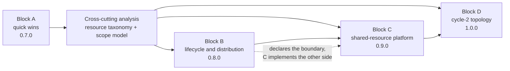

# Roadmap

> **The living single source of truth** for status and priorities. Cross-cutting by nature — it spans
> every domain — and kept current: updated at `/plan`, when `/implement` closes a unit, at
> `/review-docs`, and at `/handoff`.
>
> **Last updated: 2026-08-05** — **A4** was added to Block A on this date and **implemented** the
> same day (design accepted as ADR-0057; host acceptance still owed — see its entry). The **block
> order** below was ratified by the maintainer on **2026-08-04** and replaces every prior sequencing
> note; A4 does not change it.

## The planning documents — and why there are three

The pack convention is **exactly one `roadmap.md`**. The other two are not competing plans; each is a
different document class, and the roadmap links out to both.

| File | Class | Holds |
|---|---|---|
| **`roadmap.md`** (this file) | living | The only roadmap: current state, the ordered plan, open decisions |
| [`improvements.md`](improvements.md) | living notes + closed records | The issue tracker, `FI-1 … FI-51`, each with its own analysis. **Not a roadmap** — it is the detail the roadmap cites |
| [`roadmap-history.md`](roadmap-history.md) | historical | Immutable chronology: closed cycles, completed sprints, the resolved-bug log |
| `handoff.md` | ephemeral | Session state; deleted before the next one is written. **Deliberately not linked** — an inbound link would dangle the moment it is consumed |

Before 2026-08-04 the issue tracker was named `roadmap-backlog.md`, which made it read as a second
plan. Git holds the rename.

## Where the project stands

**`v0.6.0` is released** (2026-08-04) on npm as
[`@claude-orchestrator/cco`](https://www.npmjs.com/package/@claude-orchestrator/cco), published by CI
through OIDC trusted publishing. It closed the whole agent↔cco access line: the acceptance rounds
(e2e v2 → v3 → v3.1) and their fix cycles (1 → 1.1 → 1.2) are **finished and accepted**; the
narrative, the lessons, and the per-stage records live in
[roadmap-history.md](roadmap-history.md).

- **The upgrade is three commands**, in this order:
  `npm update -g @claude-orchestrator/cco && cco update && cco build`. `cco update` has never rebuilt
  the image and nothing else does, so a session started without the rebuild silently runs the previous
  release. **Block B exists to end this.**
- **Branches**: `main` is an *ancestor* of `develop` (no divergence, no backmerge owed); both carry
  `0.6.0`; `develop` is level with `origin/develop`.
- **Test baseline**: macOS host (bash 3.2) **1626 passed / 0 failed** — the cycle's first complete
  host run. In-container **1619/7** on the same tree with the mask on, **1616/9 of 1625** unmasked.
  The 9 are 7 host-only tests defeated by the ADR-0047 boundary ([FI-19](improvements.md)) plus 2
  update tests the mask hides.
  ⚠ **`access: {claude: all}` is committed** in `.cco/project.yml` (self-dev workaround for
  [FI-25](improvements.md), with its own expiry note), so **every in-container figure from now on is
  masked** — expect `…/7`, never `…/9`.
- **Next free ADR number: 0057.** ⚠ **ADR-0038 and ADR-0040 do not exist as documents** — they are
  numbers reserved by earlier roadmap entries for workstreams D and F. Whoever writes them writes them
  for the first time; do not go looking for a file.

## The plan — order ratified 2026-08-04

Four blocks, sequenced **A → B → C → D**, with one shared analysis pulled ahead of B. The criterion is
not size but **which layer an item touches**, because that is where items collide with each other.

| Block | Subject | Release | Why here |
|---|---|---|---|
| **A** | Quick wins and coherence debts | `0.7.0` | Each item is self-contained; three of them close inconsistencies already shipped |
| **—** | **Cross-cutting analysis**: resource taxonomy + scope model | *none* | Read-only. Feeds B, C and D; moving it earlier costs no release |
| **B** | Lifecycle & distribution | `0.8.0` | The upgrade UX, and splitting `cco update`'s conflated responsibilities |
| **C** | Shared-resource platform (packs & config) | `0.9.0` | **This is what unblocks external projects and packs** |
| **D** | Cycle-2: config multiplicity, divergence, mount topology | `1.0.0` | The last open architectural debt |

```mermaid
flowchart LR
  A["Block A<br/>quick wins<br/>0.7.0"] --> AN["Cross-cutting analysis<br/>resource taxonomy + scope model"]
  AN --> B["Block B<br/>lifecycle and distribution<br/>0.8.0"]
  AN --> C["Block C<br/>shared-resource platform<br/>0.9.0"]
  AN --> D["Block D<br/>cycle-2 topology<br/>1.0.0"]
  B --> C
  C --> D
  B -. "declares the boundary,<br/>C implements the other side" .-> C
```

Two ordering constraints are load-bearing:

- **`cco attach` goes before Block D.** Both rewrite `lib/cmd-start.sh` — one the container lifecycle,
  the other the mount composition. Sequential either way; the smaller one first.
- **The shared analysis goes before B's design.** B must strip `cco update` of the opinionated-content
  responsibility, and *what an opinionated resource is* is decided by that analysis. Designing B first
  would settle the boundary by implementation.

---

### Block A — quick wins and coherence debts → `0.7.0`

Minor bump, not a patch: it introduces new verbs and a new access knob. Nothing here needs an analysis
phase; A1 and A2 need a short design, A3 needs none, and **A4's design is already done and accepted**
([ADR-0057](configuration/agent-cco-access/decisions/0057-ask-enforcement-plane-and-resource-classes.md)).

#### A1 — `cco save`: project-config versioning helper

**Problem.** In the decentralized model, project config lives in `<repo>/.cco/` and is versioned by the
repo's own git. To version *only* the config, the user must hand-stage `.cco/**` among unrelated repo
changes. `cco config save` gives exactly this ergonomics for the personal store `~/.cco`; the in-repo
model never got its twin.

**Why it is first.** It closes a coherence debt **already in production**: the baked managed rule
`cco-config-interaction.md` and ADR-0042's Level-C guidance tell edit-level agents to version config
atomically with `cco project save` — a verb that does not exist. Today the rule degrades gracefully by
calling it *forthcoming* and pointing at plain git. When this ships, that text is restored to the real
verb.

**Scope (v1).** Stage **exclusively** `<repo>/.cco/**`, never the rest of the working tree; secret
detection before commit, reusing `lib/secrets.sh` as `cco config save` does; `secrets.env` stays
gitignored and is never staged; an isolated-history read (`git log -- <repo>/.cco/` already
path-filters, regardless of how a commit was made).

**Decisions the session owes.**
- **The verb name.** The maintainer's note says `cco save`; ADR-0042 and the managed rule assume
  `cco project save`; `cco config save` is taken by the personal store. Pick once — the injected
  context and the managed rule must name the real verb.
- Path-filtered history vs a commit trailer (`Cco-Save: true` + `git log --grep`), and whether a
  companion read verb (`cco project history`) exists at all.
- `--amend` / message templating: in or out.
- **Multi-repo**: commit the invoking repo's `.cco/` only, or fan out to every config-bearing member
  the way `--sync` does?
- **Operator-shim classification**: in-container write verb at `cco_access ≥ edit-project`, or
  host-only? Confirm the secret scan and the path scoping hold under container-operator mode.

**References.** ADR number **reserved as 0038, never written**. Twins to read first: `lib/cmd-config.sh`
(`cco config save`), `lib/secrets.sh`, `bin/cco` `_cco_operator_shim`. Integration contract:
[ADR-0042](configuration/agent-cco-access/decisions/0042-agent-cco-interaction-model.md).

#### A2 — Per-project custom Docker image ([FI-49](improvements.md))

**What already exists**: `project.yml` accepts `image:` (`templates/project/base/project.yml:113`) and
`cco start` honours it (`lib/cmd-start.sh:1682`). **What is missing** is everything around it.

Three sub-problems, all raised from real use on an adopting project:

1. **Maintenance is manual and silent.** The docs say a base `cco build` obliges you to rebuild the
   derived image too. Forget, and you run yesterday's entrypoint with no signal. `lib/cmd-build.sh`
   has no project awareness at all. Options to weigh: `cco build` rebuilding the derived images it
   knows about · an explicit `cco build --project <name>` · a lazy prompt at `cco start` (*"the custom
   image is older than the base — rebuild?"*).
2. **A missing image gives no actionable error.** A project declaring an image nobody built should say
   so and name the fix, not fail deep inside compose.
3. **The `setup.sh` docs contradict themselves**: the generated script header says *runs as root*, the
   guide says *runs as user `claude` — cannot install system packages*, and the decision matrix then
   recommends that same file for *"an apt package for one project"*. One of these is wrong; find out
   which by running it, not by reading further.

**Note for the session.** Sub-problem 3 is a doc fix gated on a measurement, and it is the cheapest of
the three — do it first, because the answer changes what the guide should recommend for 1 and 2.

#### A3 — Cross-scope collision warning ([FI-32](improvements.md)) + the three open decisions

**FI-32** is Low effort and directly protects work on adopting projects.
`_detect_cross_tree_conflicts` (`lib/packs.sh:106`) compares a pack's `rules`/`agents`/`skills` against
the **committed project tree** only; the global store `~/.cco/.claude/{rules,agents,skills}` — mounted
user-level into *every* session — is never consulted. Real instance: `core-dev-framework` duplicates
three of the four shipped global rules and overlaps the shipped skills and agents, and the agent then
reads two possibly divergent copies with **no signal at all**.

⚠ **This is the detection half of [FI-51](improvements.md)** (Block C). Keep it a *warning, never a
block* (P14) and make the message name the **scopes and the resolution order** — cross-scope
duplication is legitimate when a project deliberately overrides a global rule, so a message implying
an error would be wrong.

The **three open decisions** in the section below are also A-sized: take them here, or answer them
inline.

#### A4 — `ask`: the second enforcement plane + Axis-B resource classes ([FI-18](improvements.md))

**Design accepted, IMPLEMENTED, host acceptance PENDING** (2026-08-05).
[ADR-0057](configuration/agent-cco-access/decisions/0057-ask-enforcement-plane-and-resource-classes.md);
its four gating measurements ran on the host the same day and **all passed**
([record](configuration/agent-cco-access/analysis/probe-ask-enforcement-plane.md)). This entry does
**not** restate the model; read the ADR, then `design.md` §4bis.1.

Built on `feat/access/claude-md-axis` in four commits — `b324c0e` (resolver, lattice, `entries`,
both emitters, seeding) · `24ec2fb` (INV-P) · `be2cc9e` (schema, CLI, user docs, `changelog.yml`
#62) · `190f8cd` (golden). Suite **1626/7 of 1633** in-container, the 7 being the known host-only
set unchanged name for name against a HEAD baseline measured in an isolated worktree (1619/7 of
1626) — **zero regressions**.

⚠ **It is NOT accepted, and one blocker is already known.** The six container checks in the ADR's
Verification are host-side and still owed — runbook:
[`acceptance/0057-ask-plane-runbook.md`](configuration/agent-cco-access/acceptance/0057-ask-plane-runbook.md)
(hybrid: three host-started sessions, mechanical checks delegated to each session's agent, only the
permission dialogs manual). A six-shape dry-run pre-flight is recorded in its §5.

🔴 **[FI-52](improvements.md) blocks acceptance.** The `claude_md` gate is one glob spanning all of
`/workspace` (D8), so it also gates trees whose cell resolved to `rw` — where D3 says a prompt is
noise. Measured: a `current=rw` session mounts `/workspace/.claude` **rw** and gates it anyway. It
fires in **every `--cco-access edit-project` session** and every config-editor session, and it makes
**acceptance check 5 fail as written**. A conflict between ADR-0057's own decisions, not an
implementation slip — four options are on the table and **the choice is the maintainer's**.

📝 **`cco build` is NOT a prerequisite** (measured): the diff touches no image-baked file, and both
planes are produced at start time by `./bin/cco` on the host. What survives is that the `cco` on the
container `PATH` is the image-baked build — hence `/workspace/claude-orchestrator/bin/cco` in-session.

🔑 **Do not run checks 1–3 on this project as it stands.** `.cco/project.yml` commits
`access: {claude: all}` (the FI-25 mask), which makes every tree `rw`; `max()` then absorbs `ask`
and **no rule is emitted at all**, so those checks would pass while measuring nothing — the failure
mode this cycle already paid for twice. Use a project without the mask, or force the default shape
with `--claude-access repo=ro,current=ro,global=ro,others=ro`.

Two implementation decisions the ADR left open, both recorded in `design.md` §4bis.1: the overlay
**replaces** the baked `managed-settings.json` rather than merging with it (P1 measured a whole-file
substitution, so it must carry the baked hooks/env/statusLine/deny forward, and it fails closed if
it cannot); and D13's stub is seeded **only** into the B2 tree, never into a user's repos.

**What it delivers.** A middle value on Axis B's lattice (`ro < ask < rw`) — mount `rw` plus a managed
`permissions.ask` rule, so the write is possible but never silent — and a second dimension of the axis,
`entries.{claude_md,rules,agents,skills}`, reaching `Cr` and `Cp`. Default: `claude_md: ask`, the other
three `ro`. cco gains a **second enforcement plane** (mount = boundary, permissions = gate) and, with
it, a graduated configuration: hard for unattended work, gated for interactive work, chosen by the user.

**Why it is in this block.** It closes a coherence debt already in production — `<repo>/**/CLAUDE.md`
is governed by **nothing** today, so one class of file has three regimes, one by omission. And it is
the daily friction that opened FI-18 twice: a session refused while updating a `CLAUDE.md` its own work
had made stale, where the only remedy is restarting the session.

**Why before B2 and D**, on the roadmap's own criterion: A4 rewrites mount generation in
`lib/cmd-start.sh`, the same file `cco attach` and Block D rewrite. Sequential either way; the smallest
first.

**Scope of the implementation session.**
- Extend the resolver to produce the **access matrix** `(tree × class) → {ro, ask, rw}` — one producer,
  no consumer re-derives (ADR-0057 D10).
- New **permissions emitter** + the per-session managed-settings overlay (D9).
- Mount-generation changes for the class dimension, plus the `CLAUDE.md` seeding (D13).
- **INV-P** static CLASS lint in `tests/test_invariants.sh` — the thing that keeps *"one point of
  change"* true rather than intended.
- Schema (`project.yml`, `access.yml`, `--claude-access` dotted key), `cco whoami` reporting both
  dimensions, user docs, and the **`changelog.yml` entry — owed at implementation, not before**: it is
  shipped-behaviour documentation and the feature does not exist yet.

⚠ **Acceptance is not suite-green.** This lane is invisible to the hermetic suite by construction
(RC-17, fourth recurrence): it needs `cco build` plus the six container checks listed in the ADR's
Verification section. And ⚠ the behaviour change runs in **two directions** — `Cp`'s `CLAUDE.md` opens
(gated), `<repo>/**/CLAUDE.md` tightens from silent `rw` to prompted. The second is the one users
notice.

---

### Cross-cutting analysis — resource taxonomy & the configuration-scope model

**One analysis session, read-only, no release.** It exists because three separate blocks are each
about to decide the same thing, and deciding it three times guarantees divergence.

**What it must settle.**

- **What a shareable configuration resource is**: what it may contain, where it installs, at which
  scope, and how it is instantiated and updated. Today packs carry knowledge/skills/agents/rules and
  nothing else; templates, llms and the personal store each hold a partial answer; the recommended
  vehicle on record is a new **`config` resource kind**, pending exactly this taxonomy.
- **The configuration-scope model**: what governs a session when several scopes carry a file of the
  same name, and whether the session can *say* which one is in force.
- ⚠ **Fix the two senses of "scope" in the first paragraph** — the recursive *scope level* (task ·
  feature · module · app) and the *configuration scope* (global · project · repo-native · managed).
  In one sentence they look like the same word and are not. The input document flags this explicitly.

**Preconditions the inputs state, and that are not optional.**

- **Measure before sizing.** The collision problem was found by *measuring* a live session, not by
  reasoning — three name collisions were in context while it was being debated whether they could
  exist. Repeat that measurement on a few real configurations before designing.
- **A documentary source is not a verified outcome.** Three claims in the originating pack turned out
  false because they were deduced from documentation and never executed.

**Inputs — do not re-derive.**

- [`packs/analysis/input-pack-templates-and-scope-resolution.md`](packs/analysis/input-pack-templates-and-scope-resolution.md)
  — §1 the measurement, §4 the three directions for scope resolution, §5 the hardest template
- [`packs/analysis/input-pack-enforcement-transport.md`](packs/analysis/input-pack-enforcement-transport.md)
  — §2 what is already verified, §3 the composition question
- [`engineering/opinionated-extraction-and-update-refactor-handoff.md`](engineering/opinionated-extraction-and-update-refactor-handoff.md)
  — gaps G1–G7 of the axis-2 sharing model (ADR number reserved as **0040**, never written)
- [FI-28](improvements.md) global adoption · [FI-29](improvements.md) `commands/` ·
  [FI-32](improvements.md) detection · [FI-47](improvements.md) templates ·
  [FI-48](improvements.md) enforcement · [FI-50](improvements.md) publish sources ·
  [FI-51](improvements.md) scope resolution

**Output**: an analysis document — suggested home
`configuration/analysis/resource-taxonomy-and-scope-model.md` — persisted by the lead when the
direction is approved. Per the workflow, `/design` for B and C does not begin until that file exists.

---

### Block B — lifecycle & distribution → `0.8.0`

The maintainer's ruling (2026-08-04): **one definitive design, no interim verb.** A temporary reshuffle
of `cco update` that a later refactor revisits costs more than waiting one cycle — the three commands
have been three commands until now, and one more cycle changes little.

#### B1 — `cco update`: responsibilities, orchestration, post-install

**The direction, ratified.** `cco update` becomes the **orchestrator** of
`npm update → migrations → cco build`. Updating **opinionated content** leaves it entirely: that
content is leaving the core (workstream F, Block C), so it deserves its own update path rather than
sharing a verb with migrations.

**What `cco update` conflates today** — read the code before designing: `lib/cmd-update.sh` plus
`lib/update*.sh`, already split by responsibility into hash-io, merge, meta, discovery, sync, changelog
and remote. It runs migrations, discovers framework and remote changes, reports the changelog, applies
a 3-way merge of opinionated defaults via `--sync`, and is provenance-aware. **It has never built the
image.**

**Decisions the design owes.**
- Always unified, or are the single steps still separately invocable?
- If `cco update` becomes the orchestrator, do migrations need their own on-demand verb, or is a flag
  enough? (The same question decides whether the current name still fits.)
- What the **npm post-install hook** does: notify that steps are pending, or execute them?
- **Where the boundary is declared** toward the opinionated-resource update path — B names the
  boundary; C implements the other side of it.

**References.** ADR **0040 reserved, unwritten** · the opinionated-extraction handoff ·
`.claude/rules/update-system.md` (the changelog/migration conventions any new verb must respect) ·
the post-v1 *"`cco update` responsibility re-analysis"* note, now folded into this item.

#### B2 — `cco attach` and session persistence

**Goal.** When a session is interrupted abruptly (IDE or terminal closed without `/exit`), the
container keeps running and `cco attach <project>` resumes it, instead of losing in-progress work.

**Why the substrate is nearly there.** The container runs `tmux` with `claude` inside it, so
detach/reattach is native; sessions already carry the `cco.project` label; the running registry
([ADR-0045](environment/decisions/0045-session-running-registry.md)) already tracks live sessions with
a host-side reconcile reaper for orphans.

**The blocker.** `cco start` runs `docker compose run --rm --service-ports claude` — foreground **and
`--rm`**, so an abrupt disconnect stops *and removes* the container. Persistence means detached and
named (`up -d`), then attaching into it.

**Shape to ratify in a short ADR.** Opt-in `session.persist: true|false`, precedence mirroring the
access knobs (CLI > `project.yml` > `~/.cco` global default > built-in). Default likely `false`;
**open**: default-off vs default-on-with-`cco stop`-cleanup. `cco attach <project>` cwd-first,
resolving through the label / running registry, refusing gracefully with a `cco start` hint. Lifecycle
leans on the ADR-0045 reaper; decide the idle-timeout and max-persistent-count policy.

**Trade-off to weigh explicitly**: persistence holds RAM/CPU and risks orphans, against losing work.
That asymmetry is the whole argument for opt-in.

**Effort**: Med — touches compose generation in `cco start`, a new verb, the settings-precedence
resolver, and `cco stop`/registry cleanup. Needs `cco build` to test.

#### B3 — Install / init / configuration coherence review ([FI-30](improvements.md))

**Sequenced last in the block on purpose**: the guides are rewritten once the procedure is decided,
never before.

The README quick start presents `cco init` as a global bootstrap runnable from anywhere; it is the
**project entry verb** and acts on `$PWD` (`lib/cmd-init.sh:270-282`), with the `~/.cco` seed and the
image build as first-run side effects (`:104-112`). The living-docs sweep already fixed the README's
own contradiction; what is owed is the coherence pass across README, the user guides (installation,
project-setup, configuration-management), the tutorial, and the maintainer docs — **shipped-behavior
docs, so they track what works today, not a target model.**

---

### Block C — shared-resource platform (packs & config) → `0.9.0`

**This is the block that unblocks external projects.** Four stages, in dependency order. C1 is a
declared prerequisite of C2, not a preference: shipping enforcement without parametrization produces
one `settings.json` for every project, and *how much* enforcement to want is per-project by nature.

#### C1 — `*.template.md` in packs, instantiated at install ([FI-47](improvements.md))

A pack may carry `*.template.md`; cco instantiates them **at pack install**, writing the result into
the user's configuration — never inside the pack.

**Constraints the analysis must not rediscover** (all from the input document):
- The instance does **not** live in the pack: the pack mounts `:ro` and a reinstall would overwrite it.
- The instantiation scope is the scope the pack is active in — global install → global instance,
  project install → project instance.
- Override on a more specific scope, through a dedicated post-install command.
- Repo-native (`<repo>/.claude/`) is a valid home with a caveat: it loads **on demand**, when the agent
  reads a file there — so a decision taken before the first read was never governed by it, and a
  multi-repo project can end up with two peer policies and no criterion between them.
- **An instantiated template is a user file.** A pack update must never silently overwrite it; at most
  report that the upstream template changed.

**Parameters and prompts** (the second half): every template declares its parameters and how to ask
for each; install and re-instantiation run them interactively. Every parameter has a default equal to
**current behaviour**, so pressing enter through the whole thing changes nothing. Prompts must be
skippable non-interactively and re-runnable on an existing instance. Some cells are structurally
**not** parameters, and the template must be able to mark them so with the reason beside them.

**Already-existing use cases to count** (the mechanism was missing before anyone asked for it):
`maintenance-policy` was already a copy-by-hand template in the pack, and **`language` was already a
cco rule** — which is the decisive clue that the missing layer is cco's, not the pack's. There is a
standing note to move the language rule into the Level-A/C injection model and retire its template
path; **decide it here**, in the same design, rather than as a separate item.

#### C2 — `settings.json` and hooks transported by packs ([FI-48](improvements.md))

Packs ship prose; **the only real enforcement available to a method pack lives in `permissions` and
`hooks`**, which packs cannot carry. The project-scope channel already exists and is empty:
`<repo>/.cco/claude/settings.json`. The ask is not a new channel but that a pack may write to it, with
a declared composition semantics.

**The field precondition is satisfied** (measured 2026-08-04, not deduced): the hook denies under
`bypassPermissions` — which is how cco launches every session — and sees `agent_type` inside a
subagent. Both halves of the request therefore have value under cco.

**The hard question is composition.** Markdown rules concatenate; `settings.json` is a structured
object, and two packs carrying one must be **composed**, not concatenated. The existing *last pack in
the list wins, with a warning* rule would be **worse than the problem**: a pack overwriting another's
`deny` rules removes them. Proposed starting point — `deny` union always, `ask` union, `allow` union
*with a warning*, `hooks.<event>[]` concatenated by matcher group; conflicts made **visible**, never
silently resolved.

**Mechanics not to underestimate — where the hook script lives.** A `type: command` hook points at an
executable. If the pack ships the rule but not the script, the rule is broken; if it ships the script,
that script lives in the pack's **read-only mount**. Open: can `command` point at the pack's mounted
path, and is it stable across sessions? What does `$CLAUDE_PROJECT_DIR` resolve to under cco? Is the
exec bit preserved through the mount? And a hook with state or a log **needs a declared writable
destination**, because `.claude` is `:ro` — the same STATE treatment the lead's auto-memory already has.

⚠ **Two things to carry into any hook template cco ships.** An enforcement hook **evaluates its deny
before it logs, and logging is never fatal** — the test hook printed to its log first under
`set -euo pipefail`, and with the log unwritable it aborted **fail-open**, leaving no trace. And
whatever ships must be presented as **surface reduction, not a guarantee**: an arbitrary subprocess
launched from `Bash` is not covered, and the measurement bypassed the hook in two moves by writing a
script inside the permitted directory and running it from there.

📝 **A doc item that stands on its own, whatever else is decided.** cco already gives a guarantee it
states nowhere: `<repo>/.claude` and `<repo>/.cco` mount `:ro`, so **a session cannot tamper with its
own hooks, agents, skills and settings**. That is OS-level, therefore independent of permission mode —
it holds under `bypassPermissions` — and not bypassable by a subprocess, i.e. precisely the gap no hook
can close. Documenting it is also the strongest argument for pack transport: a `settings.json` mounted
by cco is *harder* to neutralize than one copied into the repo by hand.

#### C3 — Global adoption, slash commands, scope resolution

- **[FI-28](improvements.md) — global pack adoption.** A settings surface in `~/.cco` declaring a pack
  adopted across projects, with **filters** (tags/attributes) to scope it to a subset; the CLI verb is
  a thin editor of that config. Second mode: **materialize** the adoption into every matching
  `project.yml`. Today there is no default-pack mechanism at all — `packs:` is per-project only.
- **[FI-29](improvements.md) — `commands/` has no home.** No handling of `commands/` anywhere in
  `lib/`, `config/` or `defaults/`: the global `.claude` mount is entry-by-entry and would silently
  ignore it, and `pack.yml` declares only knowledge/skills/agents/rules. Only the project tree works,
  and only incidentally.
- **[FI-51](improvements.md) — scope resolution and marking.** Three non-exclusive directions, from
  strongest to weakest: **(1) resolve at mount** — cco already materializes the rule set, so on a
  *name* collision it could mount only the most specific version; real enforcement, the agent never
  sees two conflicting rules. **(2) mount everything but generate a precedence header** into the
  session preamble, the way the knowledge list already is — still prose, but framework-generated, so
  it cannot diverge from reality. **(3) `scope:` frontmatter** on every config file — a declarative
  mitigation: it makes the ambiguity *readable*, it does not remove it. Direction 3 is needed even if 1
  is taken, because legitimate coexistence still requires the reader to tell the files apart.
  ⚠ Direction 1 needs a **proof on a real configuration as a precondition, not a follow-up.**

#### C4 — Publish sources, and the opinionated extraction (workstream F)

- **[FI-50](improvements.md) — publish from an arbitrary directory.** `cmd_pack_publish` takes a pack
  **name** resolved from the personal store, so today the source must be a store pack or an archive;
  publishing a directory straight to a remote — the shape a team wants for shared config — is not
  supported. Decide the target model too: sharing **repo** vs **package**.
- **Workstream F — opinionated extraction + the update split.** Make the cco core agnostic of
  opinionated config: `managed/` stays baked, and the opinionated defaults (workflow/git/documentation
  rules, agents, skills, the global `CLAUDE.md`, parts of `settings.json`) move into a separate
  official sharing repo, installable like any shared resource. **This is the other side of the boundary
  Block B declared**, and the first consumer of the resource kind the shared analysis defines.
  ADR **0040 reserved, unwritten**. Reference:
  [`engineering/opinionated-extraction-and-update-refactor-handoff.md`](engineering/opinionated-extraction-and-update-refactor-handoff.md).
- Also here, as shipped-surface gaps in the same family: `cco template update` as the symmetric twin of
  `cco pack update`, and making `cco pack update` a **3-way merge** (it currently overwrites local
  edits).

---

### Block D — cycle-2: config multiplicity, divergence awareness, mount topology → `1.0.0`

Analysis → design, subject fixed by the maintainer 2026-07-31. ⚠ **The subject is wider than the mount
topology, and the topology is downstream of it.**

**The prior question.** A session cannot ask **how many config copies exist for a project, nor whether
they diverge.** Mechanically: `sync-meta` never crosses **INV-STATE**, so `_sync_is_divergent` always
returns false and every owned member reports `synced`. The question is not badly answered — it is
**unaskable**.

Three consequences, in this order:

1. **config-editor is the authoring tool** and must therefore *know* a project's sync/divergence state
   and let the user handle it explicitly — which implies `cco sync`, or a successor, being reachable in
   that session. Its blocking prerequisite is **the STATE crossing, not the mounts.**
2. **A standard session is right to see only the config of the project it was launched from.** The two
   modes have different needs, and today a single mechanism serves both by accident.
3. **Then, and only then, the topology**: validate or discard the two-path model
   (`/workspace/<name>-config` vs `/workspace/<repo>/.cco`).

**Start from the analysis, which is already written and approved**:
[`configuration/agent-cco-access/analysis/config-mount-topology.md`](configuration/agent-cco-access/analysis/config-mount-topology.md)
§3.3 and §8 — four blockers and six open questions, all code-grounded. It is not a dead end even if the
topology is discarded: it either validates the current design or names what is wrong with it.

**Results already derived — do not re-litigate.**
- The proposal is structurally *"delete layout 2"*, and under it FI-42's fan-out writer becomes correct
  **verbatim** — a fix by removing a special case.
- 🔑 But *"the writer becomes correct verbatim"* and **soundness under `--all`** are **mutually
  exclusive**: `--all` exists to reach projects whose repos are not mounted, and a repo name is a
  per-project label (ADR-0051 D2), so `--all` structurally needs a project-keyed component.
  **The topology's residual value is UX — host/session path parity — not FI-42's correctness.**
- The four blockers: **(a)** INV-MP — a passed-through `/workspace/<repo>` ancestor materializes
  root-owned and would fail `test_invariant_mount_ancestry_owned`, so an ADR-0054-style framework-owned
  scaffold is mandatory · **(b)** ADR-0051 homonyms are sound in project mode, **unsound under `--all`**
  where N×M collisions are the expected case · **(c)** no ADR states which of N replicated copies is
  canonical in-session — glob order decides today · **(d)** a `.cco`-only stub trips three dir-test
  predicates into *absent-reported-as-present*, landing on `cco project show`, the very verb the
  proposal designates as the mapping surface.
- Supersessions to make explicit if the topology is taken: **RC-6 §3.7** and **ADR-0046 §6** (already
  ratified in place — a normal `edit-project` session ships `include_member_configs`' span unenforced
  at `cmd-start.sh:1885-1887`, so config-editor is the stricter of the two).

**Carried into this block:**

| Item | Note |
|---|---|
| [FI-42](improvements.md) | The fan-out resolves its WRITE path by member probe while its READ path is operator-aware. **Cannot be fixed without taking the contract decision it carries** — all-or-nothing vs all-or-declared-partial. Reachability is bounded and documented: the only path reaching the fan-out is `config-editor --cco-access edit-all --repo …`, and it exits **declared** (rc 1 + the failed paths), not silently. Shipped as the `0.6.0` known-issue |
| [FI-43](improvements.md) | `--repo` mounts the code **rw** while its stated purpose is to read it. A **sub-question of the topology decision**, not a standalone flag |
| [FI-40](improvements.md) | A fail-closed refusal states a count where naming is safe (`pack rename` unmounted census). **Topology-independent** — it could have shipped on either side of the gate; deferred only to keep the release tree unchanged |
| **Linux write path** | ⚠ **An ADR, not a patch.** The conflict is structural: the agent's uid must equal the host user's or it cannot write the repos; the store content is owned by that same uid; the elevated identity must **not** be that uid. Candidates — a dedicated host group + setgid dirs with the gid joined in the entrypoint · POSIX ACLs granting uid 900 · dropping the boundary on Linux (a security regression). All imply host-side setup. ⚠ Criterion F is signed off as **macOS-verified only**: macOS `fakeowner` makes the fail-closed pre-validation unfalsifiable, so every `chmod`-driven unwritable-bucket test passes in the Linux container and proves nothing from a macOS run |

---

## Not in the sequence — schedule when convenient

Each is independent and rides the shipped substrate. None blocks anything in A–D.

| Item | Why it is not in a block |
|---|---|
| [FI-37](improvements.md) — no working workflow-save path in the repo lane (`<repo>/.claude`, axis `Cr`) | Usability, no data loss. ADR-0055 gave the *project* tree a functional-write floor; the repo tree deliberately did not get one, because a repo's native `.claude/` is cross-cutting config shared with everyone who clones it. The fix is a mechanism choice, not a patch |
| [FI-38](improvements.md) — workflows STATE overlay hygiene | Two policy choices, not bugs: a stub outlives the entry that justified it, and a collision with a later-committed workflow is resolved silently. ⚠ The emitting function runs inside `$( )` and its stdout **is** compose YAML — any notice must go to stderr or be emitted by the caller |
| [FI-39](improvements.md) — Claude Code memory state cco does not persist | **One ADR covering both halves; do not split it.** (a) per-agent `memory:` is declared on eight agents and evaporates — measured: of four declared scopes only the lead's works, and six pack agents produced **zero bytes** in weeks. (b) `autoMemoryDirectory` — a simplification. ⚠ **Weigh it together with cross-PC state sync, never before**: role memory becomes an object to sync, with its own ownership/conflict/confidentiality questions, and deciding it first means deciding it without its most binding requirement. ⚠ And the fix **cannot be "make `.claude` writable"** — that would buy a low-priority feature by selling the security guarantee named in C2 |
| **State sync (cross-PC / cross-team)** | The largest deferred item; needs its own design. Boundary to preserve: git stays the one engine for vault sync and resource sharing; a daemon would own only what git carries badly (append-heavy, machine-local STATE) |
| #10b — statusline | Show session usage/limit percentage instead of (or beside) the dollar cost; fix stale ctx% after `/compact`; configurable format. Low effort, fits any release |
| FI-4 — per-project `model:` · `cco project edit` | Quick wins: `model:` in `project.yml` → `claude --model`; open `project.yml` in `$EDITOR` and regenerate compose |
| **Developer-mode residue** | ✅ **Mostly shipped**: `cco --dev-sandbox` / `--dev-sandbox-seed` isolate STATE/DATA/CACHE and seed them one-shot from the real buckets (`docs/users/reference/cli.md` §3.34). What remains is ergonomics — running the local `bin/` build against an npm-installed cco without typing the path |
| Name/id validation hardening · `cco config protect` · `cco project internalize` (Case-C) · `cco clean` redesign · the deferred doc splits | Post-v1 backlog, unchanged. Detail in [roadmap-history.md](roadmap-history.md) |

## Open decisions for the maintainer

None blocking. Each is cheap to answer and expensive to discover later.

1. **180 latent bash-3.2 fixtures in `tests/`.** Argument-position `"$(cat <<YAML` sites that parse
   today and abort the **whole host suite** the day one gains an apostrophe. Options: leave the
   two-arm INV-B32 as shipped · refactor them and tighten to one arm · make the **bash-3.2 parse sweep
   a gate**. ⚠ The sweep answers *"should the host suite be a gate?"* more cheaply but **not the same
   way**: it proves the suite is *readable* on 3.2, never that it *passes*.
2. **`cco init` has no `$HOME` guard.** It scaffolds `$PWD/.cco`, and in a home directory that is the
   personal store's own path. On a fresh machine the outcome is a confusing `refusing to clobber`, not
   corruption — but it is exactly the mistake the old README invited. A guard is a code change.
3. **`cco pack internalize` is documented twice** (`cli.md` §3.23 unified, §3.27 dedicated). The
   divergence is fixed; the duplication is not. Merging sections in a shipped reference is editorial.

## Long-term planned work

Full descriptions in [roadmap-history.md → Planned Sprints](roadmap-history.md#planned-sprints).

| Item | Priority | Effort | Summary |
|---|---|---|---|
| **Design-doc consolidation review** | 2 | Med | Sweep the maintainer docs for long-living concepts reused by several features but scattered across per-sprint ADRs, and decide which deserve a consolidated living design doc. Known case: the CLI surface/UX conventions, spread across four ADRs with no unified `cli/design/` reference |
| AI-assisted merge (Update System Phase 4) | 2 | Low–Med | `(I)` AI-merge option for `.md` files on `cco update --sync`. ⚠ Overlaps Block B — re-check it there |
| Sprint 6C — Network hardening | 2/3 | Med–High | Squid sidecar + `internal: true` network, SNI domain filtering (Phases A/B shipped, C pending). Required pre-open-source |
| Sprint 8 — E2E integration tests | 3 | Med | `bin/test-e2e` verifying real container behaviour (mounts, socket, auth, entrypoint). ⚠ Every acceptance round of cycle 1 was blocked on exactly this gap |
| Sprint 9 — Linux OAuth | 4 | Med | OAuth on Linux without Keychain. ⚠ Same platform as Block D's Linux write path — consider pairing them |
| Sprint 10 — Git worktree isolation | 5 | Med | Opt-in per-session worktrees on `cco/<project>` branches |
| #9 — Pack inheritance / composition | 5 | Med | `extends:` in `pack.yml`. ⚠ Re-evaluate **after** Block C: the taxonomy may subsume it |
| Sprint 12 — Project RAG | Exploratory | High | Built-in opt-in RAG MCP, auto-generated config at `cco start` |

## Exploratory (long-term)

Uncommitted ideas — evaluate demand before scheduling. Detail in
[roadmap-history.md → Long-term / Exploratory](roadmap-history.md#long-term--exploratory).

- Native installer migration · hot-reload for in-container configuration (`cco reload`)
- Remote sessions (SSHFS-mounted repos) · multi-project sessions
- System notifications for human-in-the-loop · web UI dashboard

## Declined / Won't do

Decisions preserved in [roadmap-history.md](roadmap-history.md#declined--wont-do).

- **PreToolUse safety hook as a cco default** — Docker is the sandbox (ADR-1). ⚠ Note the distinction
  Block C draws: what is declined is cco *imposing* one, not a pack being *able* to ship one.
- **claude-mem integration** — heavy deps, per-tool-call overhead, AGPL.
- **claude-context (Zilliz) as the default RAG** — cloud dependency + key + privacy; optional provider
  only.

## Standing operational notes

Cheap to read, expensive to rediscover. The full release procedure is the gates runbook
[`08-gates-to-release.md`](configuration/agent-cco-access/e2e-review/fix-design-v3.1/08-gates-to-release.md),
kept as the template for the next release.

- **`git push` without `--follow-tags` leaves the tag behind**, and then `release.yml` never fires
  while `pages.yml` does. **The release workflow not firing is the signal that the tag never left.**
- **A `develop → main` merge is host-only when its `.cco/` diff is non-empty** — a merge writes the
  working tree, and `.cco` is `:ro` at the default access level. The fix is the designed knob, not a
  workaround: `--cco-access edit-project`.
- ⚠ **`git stash -u` half-applies in-container** (observed 2026-08-05, same family as the note above).
  Framework-generated **empty** mountpoint dirs under the `:ro` `.cco` (`claude/llms/*`,
  `claude/workflows/`) are untracked, so `-u` tries to remove them and fails with
  `Read-only file system`. The stash **is created with everything in it**, but the cleanup aborts and
  the tracked modifications **stay in the working tree** — so a later `pop` collides with itself. `git
  status` never shows the offenders (git does not track empty directories; `git clean`, which `-u`
  calls, does try to remove them). Recovery: confirm the stash holds the work
  (`git stash show --name-only` **and** `git show --name-only stash@{0}^3` for the untracked half),
  then `git checkout --` the tracked files and `pop` onto a clean tree. Prefer committing on a scratch
  branch over stashing.
- **The host and the container share one working tree.** Never switch branches while something is
  running on the host — it produces failures that are artefacts, not data.
- **Prove a check's input is non-empty before believing its PASS.** A green check that measured nothing
  recurred twice in the last cycle: a host log reading `0 failed` **with no `Results:` line** was an
  abort, and a coverage check reported "no gaps" because its extraction returned nothing.
- **A named list is a lower bound.** Three separate sweeps missed a site their file list did not name.
  Ask what actually executes in the hostile environment.
- **The container is NOT blind to bash 3.2.** The Docker socket reaches the public `bash:3.2` image:
  `docker run --rm --name cc-<project>-b32 -v <host-repo>:/src bash:3.2 bash -n <file>` is a real parse
  oracle in-session. ⚠ Two constraints: the proxy demands the `cc-<project>-` name prefix and
  **swallows container stdout** — read results from exit codes or a file written into the mounted repo.
  What stays true is narrower: the *suite's* interpreter is bash 5.2, so a behavioural regression test
  proves nothing about 3.2.

## History

Full chronology — closed cycles, the phase-by-phase build log, completed sprints and the resolved-bug
log: [roadmap-history.md](roadmap-history.md).
