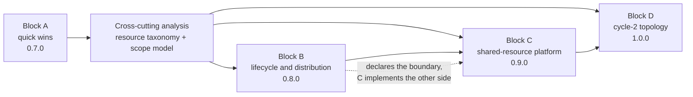

# Roadmap

> **The living single source of truth** for status and priorities. Cross-cutting by nature — it spans
> every domain — and kept current: updated at `/plan`, when `/implement` closes a unit, at
> `/review-docs`, and at `/handoff`.
>
> **Last updated: 2026-09-01** — **A11 and A10.1 are closed and merged**; both entries moved to
> [roadmap-history.md](roadmap-history.md#block-a--the-dev-mode-identity-cycle-a11-and-a101-merged-2026-09-01).
> The dev execution mode's identity half is shipped, so a dev build can no longer overwrite the image
> a real session uses. **A10.2 is next.** One gate is owed on A10.1 and is host-only: the
> `docker image inspect` acceptance check. `develop` is **unpushed**.
>
> **2026-08-21** — **A4** was added to Block A on 2026-08-05, implemented the same day,
> **accepted on 2026-08-06 after a re-run** (5 pass · 1 measured-and-amended), and its
> **implementation review passed on 2026-08-08** with two objective defects fixed in place — both on
> the security surface, both in shapes the acceptance run structurally could not reach.
> [FI-52](improvements.md) is **decided** (options 1+4) and no longer blocks. Thirteen items entered
> the tracker across the two days (`FI-54 … FI-66`): two are new Block A quick wins, five are the
> review residue (A7), and one — **FI-58**, subagent deliverables never reaching the lead — is
> **pulled ahead of the queue**. The **block order** below was ratified on **2026-08-04** and replaces
> every prior sequencing note; none of this changes it.
>
> **2026-08-09** — a **pre-merge gate review** of the whole A4 branch found no new objective defect and
> fixed nothing in place, but raised one **REVIEW NEEDED**: [FI-67](improvements.md), where
> `claude_access: none` did **not** lock `<repo>/**/CLAUDE.md` while three living documents said it did.
> ✅ **Closed the same day** as
> [ADR-0057 A2](configuration/agent-cco-access/decisions/0057-ask-enforcement-plane-and-resource-classes.md#amendments)
> — options 1+2 together: `none` now emits the **deny** half of D8, **and** the three claims were
> reworded, because on that surface cco holds a **gate**, not a boundary. The measurement A2 rests on
> also closed [FI-10](improvements.md), open since 2026-06-30. **A4 and the FI-67 fix are merged into
> `develop`** (`3ca4cfa`) — see *Where the project stands* for the push that is still owed.
> Three field reports the same day became **A8** ([FI-68](improvements.md) … [FI-70](improvements.md)),
> in Block A: the onboarding prompts and the mount-declaration surface. ⚠ One of the three
> (**FI-68**) arrived with its premise **inverted** — the read-only default it asks for is already
> shipped; only the flag surface is wrong. The entry says so, because acting on the report as written
> would invert a security default.
>
> **2026-08-09, `/review-docs`** — the post-merge docs pass realigned the surfaces A4/A2 had left
> behind: the `project.yml` reference and the `~/.cco/access.yml` scaffold (neither knew about `ask`
> or `entries`), the repo `CLAUDE.md` and the CLI-surface matrix (two-valued Axis-B lattice),
> `cco start --help` (still *"`none` (locked)"* after A2 renamed it *refused*), `design.md` §4bis's
> header, and a forward annotation on the acceptance record's check 4. It raised three items:
> ✅ `cli.md`'s guarantee block read *"a refusal when it is `ro`"* while A2's predicate denies only
> when **every** in-reach tree resolves `ro` — the FI-67 failure mode one level down, in text written
> the same day. **Fixed** (`32f15c8`): the block now names the combination that gets neither rule and
> why, leaving the *code* gap where it already was, as A1's residue for Block D.
> 📄 [FI-71](improvements.md) — `design-config-editor.md` still describes an access model **replaced
> twice** (ADR-0048, ADR-0049 §8) and overstates the built-in's privilege. Filed, scheduled at the top
> of *Not in the sequence*, and left to the `documenter`: the doc predates two ADRs, so the three
> flagged lines are a lower bound.
> Full record: [post-merge docs review](configuration/agent-cco-access/reviews/2026-08-09-post-merge-docs-review.md).
>
> **2026-08-13 → 18, the A5 + A8 cycle** — designed jointly
> ([ADR-0059](cli/decisions/0059-message-classification-and-the-start-warning-gate.md), D1…D15 +
> **Amendment A1** D16…D19 + **Amendment A2** D20…D25) and built as five units on
> `feat/cli/start-warning-gate`: **U1 + U2** (2026-08-14) gave `cco start` / `cco new` a gate that
> stops on the warnings the run emitted; **host acceptance passed 2026-08-18** and its own findings
> became **U4**, the output model (each warning printed once, grouped by an area derived from the
> producing file); **U3** shipped the same day and closes **A8** — `--writable`, the clone
> destination, the literal reuse tokens ([FI-68](improvements.md) … [FI-70](improvements.md), all
> three closed); **U5** discharged **D19** and shipped the amendment it produced.
> ✅ **D19 is done, and it reclassified nothing.** Measured by *running* both verbs — 184 `warn` call
> sites, **46 reached in 12 files**, 24 fired — every reached producer is correct at its level. Three
> files had simply never been classified (`reminders.sh`, `llms.sh`, and `lib/migrate.sh`, which no
> list had ever named), and **D1 held throughout** because it keys on the level and never on a list:
> *P2 paying itself back*. ADR-0008 was **not** contradicted — its *non-blocking* forbids a
> precondition that forces commits, not a prompt that defaults to proceed.
> ⭐ What the measurement really found is what **A2** then decided: D1 had fused the level with the
> pause, leaving `note:` and `ℹ` write-only. The pause now keys on *the run reaching the launch*; the
> level only decides what it says.
> ✅ **MERGED into `develop` 2026-08-21** (`6208228`, `--no-ff`), branch deleted.
>
> **2026-08-20, A1's design** — ✅ **[ADR-0038](configuration/decentralized-config/decisions/0038-project-config-versioning.md)
> written and accepted** (D1…D8), taking the number this roadmap reserved for it and never wrote.
> The unit is **three verbs, not one**: `cco project save` plus `cco project history` and
> `cco config history` — D2 ruled that reading the config's history is a cco verb on **both** stores,
> so the user never needs git. All five decisions the A1 entry owed are taken; see the entry.
> 🔑 One measurement is load-bearing and counter-intuitive: **committing a read-only `.cco/` succeeds**
> (git writes to `.git/`, which is `rw`), so D8's `edit-project+` gate is **policy, not mechanism** —
> and `project save` deliberately gets no ro-mount guard. ⚠ Exactly one file in the unit is
> image-baked (the managed rule), so exactly one `cco build` is owed at acceptance.
>
> **2026-08-21, the merge** — both branches are **in `develop`**: the A5+A8 cycle (`6208228`) and A1's
> design (`90c1391`), two `--no-ff` merges, both feature branches deleted. Suite on the merged
> `develop`: **1710 / 7 of 1717**, identical to the pre-merge figure, so nothing regressed. 🔴
> **`develop` is unpushed, 40 ahead** — that is the next action, and `origin/feat/cli/start-warning-gate`
> is the one merged remote branch still to delete. ⚠ **`feat/claude-view-file-overlays` is rares' and
> stays untouched** (`43c2c33`, local = remote). The A1 implementation now runs on
> **`feat/config/save-and-history`**, cut from the merged tip — where `note()` finally exists, which is
> the whole reason the design branch could not be cut from the old `develop`.

## The planning documents — and why there are three

The pack convention is **exactly one `roadmap.md`**. The other two are not competing plans; each is a
different document class, and the roadmap links out to both.

| File | Class | Holds |
|---|---|---|
| **`roadmap.md`** (this file) | living | The only roadmap: current state, the ordered plan, open decisions |
| [`improvements.md`](improvements.md) | living notes + closed records | The issue tracker, `FI-1 … FI-70`, each with its own analysis. **Not a roadmap** — it is the detail the roadmap cites |
| [`roadmap-history.md`](roadmap-history.md) | historical | Immutable chronology: closed cycles, completed sprints, the resolved-bug log |
| `handoff.md` | ephemeral | Session state; deleted before the next one is written. **Deliberately not linked** — an inbound link would dangle the moment it is consumed |

Before 2026-08-04 the issue tracker was named `roadmap-backlog.md`, which made it read as a second
plan. Git holds the rename.

## Where the project stands

**`v0.6.0` is released** (2026-08-04) on npm as
[`@claude-orchestrator/cco`](https://www.npmjs.com/package/@claude-orchestrator/cco), published by CI
through OIDC trusted publishing. It closed the whole agent↔cco access line: the acceptance rounds
(e2e v2 → v3 → v3.1) and their fix cycles (1 → 1.1 → 1.2) are **finished and accepted**; the
narrative, the lessons, and the per-stage records live in
[roadmap-history.md](roadmap-history.md).

- **The upgrade is three commands**, in this order:
  `npm update -g @claude-orchestrator/cco && cco update && cco build`. `cco update` has never rebuilt
  the image and nothing else does, so a session started without the rebuild silently runs the previous
  release. **Block B exists to end this.**
- **Branches**: `main` is an *ancestor* of `develop` (no divergence, no backmerge owed); both carry
  `0.6.0`. ✅ **The A5+A8 cycle and A1's design are MERGED into `develop`** (2026-08-21), as two
  `--no-ff` merges in that order: `6208228` (the five A5/A8 units) and `90c1391` (ADR-0038 + design).
  Both feature branches were deleted locally with `-d` — it did not refuse, and `git log develop..<b>`
  was **0 for both** before the deletion.
  ✅ **`develop` is LEVEL with `origin/develop`** — measured 2026-08-22 (`git rev-list --count
  origin/develop..develop` = 0). The push happened host-side and that gate is closed;
  `origin/feat/cli/start-warning-gate` is gone too. The only remote feature branch left is
  `origin/feat/claude-view-file-overlays`, which is rares' and stays.
  ✅ **`origin/feat/cli/start-warning-gate` is GONE** — measured 2026-08-27, `git branch -r` lists
  only `origin/develop`, `origin/main` and `origin/feat/claude-view-file-overlays`. This row said it
  *"still exists"* while the row above it, in the same paragraph, already said it had been deleted:
  ⚠ the contradiction survived because **both sentences were prose, and neither was a measurement**.
  ⚠ **`feat/claude-view-file-overlays` is NOT ours and is deliberately untouched** — rares' branch,
  verified identical local and remote at `43c2c33`, reviewed by the maintainer in a dedicated session.
  It must stay out of every cleanup sweep.
  ⚠ **Measure, never restate — a rule this project has now paid for four times.** A branch position
  written in prose has disagreed with the refs three times, and a *stated commit count is invalidated
  by the commit that states it* (the last handoff commit turned its own "+2" into "+3"). And ⚠ **the
  host can change this session's branch under it**: host and container share one working tree, so a
  host-side `checkout` or `push` lands here with no fetch. `git branch --show-current` before any
  write, not only at session start.
  📝 A local deletion can need `-D` when the branch is merged into `develop` but *ahead of its own
  stale remote-tracking ref* — `-d` reads that ref, not `develop`. Verify with `git log develop..<branch>`
  (empty = safe), never by trusting `-d`'s refusal. It was not needed this time.
  ⚠ **Push with `--follow-tags`** when a tag is involved — a bare `git push` leaves the tag behind
  and `release.yml` never fires.
- **Test baseline**: in-container **1710 passed / 7 failed of 1717**, measured on `develop` **after the
  two 2026-08-21 merges** (mask on) — identical to the figure measured on the branch before merging, so
  the merges introduced no regression; the 7 verified **name for name**. Before it, **1654 / 7 of 1661**
  after the FI-58 merge (2026-08-13). Previously
  **1633 passed / 7 failed of 1640** on `develop` at `3ca4cfa` (2026-08-09, mask on) — the 7 verified **name for name** as the known host-only set
  (6 `test_as_*` + `test_paths_symlink_safe_tool_root`, defeated by the ADR-0047 boundary,
  [FI-19](improvements.md)). +2 against A4's `1631/7 of 1638`: the FI-67 regression pair. The last
  macOS host run (bash 3.2) was **1626 / 0** on the `v0.6.0` tree — **owed again** before the `0.7.0`
  release, since nothing has re-measured 3.2 since. Unmasked the count is `…/9` (the 7 plus 2 update
  tests the mask hides).
  📝 **The FI-25 mask (`access: {claude: all}` in `.cco/project.yml`) is ON** — commented out on
  2026-08-06 to run the A4 acceptance, then **deliberately restored** once it was done, so that
  `defaults/` and `templates/` stay editable in self-dev sessions until [FI-25](improvements.md) gives
  them a narrower grant. The working tree is clean; masked in-container figures are the `…/7` ones.
  ⚠ **Consequence for any future A4 measurement in this project**: the mask makes every tree `rw`, so
  `max()` absorbs `ask` and no rule is emitted — pin the shape with an explicit `--claude-access`
  instead, exactly as the runbook does.
- **Next free ADR number: 0060** (0059 = message classification + the start warning gate,
  **Accepted (design)** with D1…D15; 0058 = teammate coordination tools, **implemented** for D4/D5+D6,
  D1…D11 + amendments A1–A3). ✅ **ADR-0038 now exists** — written 2026-08-20 as A1's design
  (project-config versioning + the history surface), taking the number this roadmap had reserved for it.
  ⚠ **ADR-0040 still does not exist as a document** — it is a number reserved by an earlier roadmap
  entry for workstream F. Whoever writes it writes it for the first time; do not go looking for a file.

## The plan — order ratified 2026-08-04

Four blocks, sequenced **A → B → C → D**, with one shared analysis pulled ahead of B. The criterion is
not size but **which layer an item touches**, because that is where items collide with each other.

| Block | Subject | Release | Why here |
|---|---|---|---|
| **A** | Quick wins and coherence debts | `0.7.0` | Each item is self-contained; three of them close inconsistencies already shipped |
| **—** | **Cross-cutting analysis**: resource taxonomy + scope model | *none* | Read-only. Feeds B, C and D; moving it earlier costs no release |
| **B** | Lifecycle & distribution | `0.8.0` | The upgrade UX, and splitting `cco update`'s conflated responsibilities |
| **C** | Shared-resource platform (packs & config) | `0.9.0` | **This is what unblocks external projects and packs** |
| **D** | Cycle-2: config multiplicity, divergence, mount topology | `1.0.0` | The last open architectural debt |

```mermaid
flowchart LR
  A["Block A<br/>quick wins<br/>0.7.0"] --> AN["Cross-cutting analysis<br/>resource taxonomy + scope model"]
  AN --> B["Block B<br/>lifecycle and distribution<br/>0.8.0"]
  AN --> C["Block C<br/>shared-resource platform<br/>0.9.0"]
  AN --> D["Block D<br/>cycle-2 topology<br/>1.0.0"]
  B --> C
  C --> D
  B -. "declares the boundary,<br/>C implements the other side" .-> C
```

Two ordering constraints are load-bearing:

- **`cco attach` goes before Block D.** Both rewrite `lib/cmd-start.sh` — one the container lifecycle,
  the other the mount composition. Sequential either way; the smaller one first.
- **The shared analysis goes before B's design.** B must strip `cco update` of the opinionated-content
  responsibility, and *what an opinionated resource is* is decided by that analysis. Designing B first
  would settle the boundary by implementation.

---

### ✅ Closed — the delegation channel ([FI-58](improvements.md))

**DONE 2026-08-13**: implemented, verified in a live session, and **merged into `develop`**
(`979a0e4`, a `--no-ff` merge of 13 commits; the feature branch is deleted locally and
`origin/feat/delegation/return-channel` still needs deleting from the host). Suite **1654/7 of
1661** (mask on), the 7 the known host-only set. The detail below is kept because the *unfinished*
parts of ADR-0058 are listed in it — D3, D7 and D8-as-amended are unbuilt.

**Investigation DONE 2026-08-13 — the fix is now a Block-sized unit.** Priority set by the
maintainer 2026-08-06, on cost.
📄 [analysis-002](integration/agent-teams/analysis/analysis-002-delegation-return-channel.md) ·
📌 [ADR-0058](integration/agent-teams/decisions/0058-teammate-coordination-tools.md) — **Accepted
(design) 2026-08-13**, D1…D11. Design gate passed; implementation not started.

**The gating question is answered: it IS cco's surface**, and not the one anyone expected. cco
enables agent teams at the **managed** layer, which turns the `Agent` tool into a teammate spawner
whose deliverable travels **only** through `SendMessage` — and `SendMessage` is absent from the
`tools:` allowlist of every cco role agent. Measured **0 deliverables out of 17 teammates** across
two Claude Code versions: not intermittent, total, and tracking the *agent type*.

⚠ Two things a fix session must not re-derive. **ADR-0055 D5 is excluded by measurement** — no
`EACCES`, transcripts persist, socket listening, inboxes drained: the transport is healthy. And
**no prompt-level remedy works** — a probe ordered to call `SendMessage` tried and could not.

✅ **D4/D5 + D6 IMPLEMENTED 2026-08-13** on `feat/delegation/return-channel` — `lib/agents.sh` (the
D2 set + the normalizer), all **four** producers routed, `INV-AGN`, `cco whoami`, the report mounted
at `/etc/cco/agents-report`, user docs + `changelog.yml` #64. Suite **1653/7 of 1660** in-container
(mask on), the 7 verified name for name as the known host-only set; +20 tests, zero regressions. The
19 new tests were shown to **discriminate**: with the projection neutralised, 8 of them fail.
✅ **VERIFIED IN A LIVE SESSION 2026-08-13 — checks 1–3 PASS**
([results](integration/agent-teams/reviews/0058-delivery-probe-results.md)). A restricted pack role
delivered (`ToolSearch` → `SendMessage` → `success:true` → `<teammate-message>` at the lead); the
unrestricted agent still delivered; and the **negative control fell in the same session** — a
platform built-in with an exhaustive `tools:` allowlist, which cco does not touch, made **zero tool
calls** and reached the lead as an **idle notification with no content**. That is FI-58 reproduced in
vivo beside its fix, with nothing else varying.
🔑 **D2's `ToolSearch` clause is now measured, not argued**: the restricted role had to search for
`SendMessage` before it could call it. Guaranteeing the channel alone would have granted a tool the
agent cannot find.
📝 **Check 4 is only half done** (the *pack* producer; the global one is shadowed by the pack and
cannot be addressed by name), and **checks 6–7 (D10/D11) were not run live** — the suite covers them.
📝 **Operational fact**: the lead's inbox drains when the lead's **turn ends**, not while it runs. A
mid-turn transcript read shows "delivered to inbox" and "nothing received" at once, and both are
true — this was nearly filed as a second defect.

**What it needs now**: implementation, and **there is no content-level quick win** — see
[A1](integration/agent-teams/decisions/0058-teammate-coordination-tools.md#amendments). The first
unit is **D4/D5 + D6**: the normalizer, a lint over **every** producer of an agent mount
(`lib/cmd-start.sh:2220` and `lib/packs.sh:192` are the two the ADR names — [FI-63](improvements.md)'s
clause — and they are a **lower bound**, see below), and the warning.

✅ **The sequencing question is answered (2026-08-13, maintainer):
[ADR-0058 A2](integration/agent-teams/decisions/0058-teammate-coordination-tools.md#amendments)** —
**D4/D5 + D6 ship now, without A5**. The `⚠ warn` is emitted as designed even though the start-time
stream stays write-only until A5, which is a Block-A quick win expected in the **same `0.7.0`
release**. The degradation is partial and bounded by one release: `cco whoami` and `--dry-run --dump`
carry the same information and are readable throughout. A5 changes the stream, not the message, so
nothing here is rewritten when it lands — but the message must be classified honestly as a `⚠ warn`
**now**, or A5 will not gate on it later.

**Unit scope, fixed 2026-08-13**: **D4/D5 + D6 only**. D3 (cco's own two definitions in the
subtractive form) and D8-as-amended (the fallback instruction in the `SubagentStart` hook) are
separate later units — D8 in particular touches a **baked** file (`config/hooks/subagent-context.sh`),
which would add a `cco build` to this unit's acceptance lane. As scoped, the unit is verified by a
plain `cco start` from the host: everything it changes is produced at start time by `./bin/cco`.
📌 **[A3](integration/agent-teams/decisions/0058-teammate-coordination-tools.md#amendments)** rules
the case the design left open: a member of the set named in `disallowedTools:` is **honoured**, the
agent is named in D6's warning, and `disallowedTools:` is never rewritten.

⚠ **The producer list is a lower bound** — the same shape that has already cost this project four
times. An agent definition reaches a session through **four** paths today, not two: the global tree
(`~/.cco/.claude/agents`, whole-directory mount, `lib/cmd-start.sh:2220`), pack agents (per-file
mounts, `lib/packs.sh:199`), the **committed project tree** (`<repo>/.cco/claude/agents/`, bound
entry-by-entry through `_emit_claude_view` or whole through the no-injection arm at
`lib/cmd-start.sh:2286`), and the **repo-native trees** (`<repo>/**/.claude/agents`, recursive, at
`lib/cmd-start.sh:2511`). The last two are empty in this repo and populated in an adopting one, which
is precisely how they stay invisible to a fix that enumerates producers. **So D5's lint keys on the
mount TARGET** (`*/.claude/agents/*`), not on a list of call sites: a fifth producer is then covered
the day it is written.

### Block A — quick wins and coherence debts → `0.7.0`

Minor bump, not a patch: it introduces new verbs and a new access knob. Nothing here needs an analysis
phase; A1, A2 and **A9** need a short design, A3 needs none, and **A4's design is already done and accepted**
([ADR-0057](configuration/agent-cco-access/decisions/0057-ask-enforcement-plane-and-resource-classes.md)).
✅ **A5 and A8's shared design is done and accepted** (2026-08-13,
[ADR-0059](cli/decisions/0059-message-classification-and-the-start-warning-gate.md) D1…D15 +
[design](cli/design/design-warning-gate-and-onboarding-prompts.md)) — it decomposes into **three
ordered units, U1 → U2 → U3**, listed under A5 (U4 and U5 were added by the two amendments the live
run and D19 produced). ✅ **All of them have landed — U1 + U2 on 2026-08-14 (closing A5), U4, U3
(= all of A8) and U5 (= D19 + Amendment A2) on 2026-08-18. The pair owes nothing before it merges.**

▶ **Order inside the block, as of 2026-08-31**: **A1 → A11 → A10.1 → A10.2 → A9**, then A2 · A3 ·
A6 · A7, with **A12** (`cco doctor`, split out of A10 at its design gate) schedulable independently.
⚠ **The numbers are identifiers, not the order** — every position here is a decision of the
maintainer's, not a dependency. A11 precedes A10 because it is A10's measuring instrument; A9 was
scheduled immediately after A1 and now follows the pair.

✅ **A1 IS CLOSED** — merged into `develop` at `ab97482` on 2026-08-26, branch deleted, and the
merged tree verified **identical** to the branch tip the suite measured. ✅ **A1 owes nothing** — the
push and the `cco build` both closed 2026-08-27 (see A1's entry). ✅ **A11 IS CLOSED** — built, tested and
host-verified 2026-08-27 (the image label read back as `feat/devmode/dev-execution-mode@e0c93a8`,
so it **discriminates**), **merged into `develop` 2026-09-01**, entry moved to
[roadmap-history.md](roadmap-history.md#block-a--the-dev-mode-identity-cycle-a11-and-a101-merged-2026-09-01).
✅ **A10 IS DESIGNED 2026-08-31** — six decisions ruled across three rounds of a decision clinic,
recorded as [ADR-0060](engineering/decisions/0060-developer-execution-mode.md) with the *how* in
[`engineering/design/dev-execution-mode.md`](engineering/design/dev-execution-mode.md), and split
into **A10.1** (identity) + **A10.2** (protection and tooling). Both units were opened 2026-08-27
after the `cco build` incident, with the analysis approved the same day. ✅ **A10.1 IS BUILT, TESTED AND
MERGED 2026-09-01** (suite 1812/7 of 1819; entry moved to
[roadmap-history.md](roadmap-history.md#block-a--the-dev-mode-identity-cycle-a11-and-a101-merged-2026-09-01)).
🔴 **One gate still owed on it**, and no session can close it: the host `docker image inspect`
acceptance check. ▶ **Next is A10.2.**

📝 **A1's entry below is ~450 lines of a ~1260-line roadmap and is CLOSED**, but its branch was
deleted on 2026-08-26, so `rules/documentation.md`'s trigger for moving it into
[roadmap-history.md](roadmap-history.md) — *the branch appears among the merged* — **can never fire
again** (`git branch --merged develop` lists only `develop` and `main`). Moving it is now a
maintainer's call, not an automatic step; it is recorded in the handoff's task list rather than done
silently.

#### A1 — `cco project save`: project-config versioning, the status preview, and the history surface

✅ **DESIGN DONE AND ACCEPTED 2026-08-20** —
[ADR-0038](configuration/decentralized-config/decisions/0038-project-config-versioning.md) (D1…D8,
all eight ruled by the maintainer at the gate) +
[design](configuration/decentralized-config/design/design-project-config-versioning.md). The ADR
number reserved by this entry is now **written**.

✅ **IMPLEMENTED 2026-08-21** on `feat/config/save-and-history` — **five verbs**, both barriers, the
D4 multi-repo report, the shim classification, and every surface in design §5. T1…T22 + S1…S9 are
covered, plus four shapes no plan named (a pre-staged file surviving both a save and a refusal; a
`.gitignore` spelled equivalently; INV-GIF, the drift guard on the coverage floor; and the
never-saved store, the only state where `config status`'s allowlist pathspec is load-bearing).

✅ **`cco build` DONE 2026-08-21** — the acceptance lane is closed. The rebuilt image carries the
managed rule naming the real verb; verified in-session at `/etc/claude-code/`, no *"forthcoming"*.

⭐ **Amendment A1 (D9…D12) widened the unit mid-flight** — the maintainer raised, against the
finished three verbs, that the write half had **no preview**: `save` has two refusal paths and a
commit set that is not obvious from outside, and `history` answers a different question (what WAS
saved). `cco project status` + `cco config status` close it, on both stores by P-B — the same
argument that turned D2 from one read verb into two. The matrix is now **2×3**.

**Both original `Open` choices are settled**: default commit message **`project config update`** (it
lands in the user's own log among code commits, where the twin's bare `config update` would be
ambiguous); `history`'s default limit **`-n 10`**.

✅ **REVIEWED 2026-08-21/22** (`/review-implementation`) — verdict *fixed-in-place*: faithful to
D1…D12, §6's plan mapped to real tests voice by voice, suite `1749 passed, 7 failed, 1756` with the 7
the known host-only set. One objective defect fixed (a mirror comment naming a function the branch had
factored away). Three residual nits are **not** this unit's: [FI-74](improvements.md) …
[FI-76](improvements.md).

⭐ **Amendment A2 (D13…D15) came OUT of that review** — designed 2026-08-22, ✅ **BUILT 2026-08-24**. The
review measured two states where `git check-ignore` answers a different question than D7 asks, and
they fail in **opposite** directions: a **tracked** file reports not-ignored, so the barrier refuses
forever with a remedy already in the file (**false refusal**); a root `.gitignore` swallowing `.cco/`
whole makes every probe pass, after which nothing is staged and both verbs report success (**false
pass — silent and total**). D13 fixes the predicate (`--no-index`) and rules the tracked file a
`note`, not a refusal and **not** a confirmation prompt; D14 extends `status` to both refusal paths,
which was Amendment A1's own stated premise; D15 refuses vacuous coverage. Contract: ADR-0038
Amendment A2 + design §2.4/§2.6/§5b.3/**§6.2c (AT1…AT9)**.

✅ **A2 IMPLEMENTED 2026-08-24** on the same branch, three commits (the predicate; the preview; the
status-side ruling below).
**AT1…AT9 are all written and green**, and the oracle was shown to discriminate before the fix: 7 of
the first 10 new tests failed first, AT4 reproducing the false pass verbatim (`already up to date —
nothing to save`, rc 0). Suite **`1761 passed, 7 failed, 1768 total`** — **+12 tests, zero regressions**, and
the 7 verified **name for name** as the known host-only set (6 `test_as_*` +
`test_paths_symlink_safe_tool_root`). A2 touches **no baked file**, so it owes no `cco build`.
The four changed `lib/` files and the test file parse under **real bash 3.2** (`bash:3.2` via the
Docker socket, one invocation per file — `bash -n` reads only the first — with three controls proving
the oracle rejects). ⚠ That is a **lint**: the macOS host *suite* on 3.2 is still owed before `0.7.0`. ⚠ **AT8 was owed regardless of the rest** and is now pinned: a `.netrc` under a
scaffold-conformant `.gitignore` is refused by the scan and the staged set reset — the compensating
control §7 leans on, which carried the narrow gitignore floor with nothing measuring it. It **passed
on first run**, i.e. it pins behaviour that already held rather than fixing anything.

⭐ **D14 was applied to `cco config status` as well**, which §6.2c does not name. `_config_save`'s
first barrier writes itself, so the scan is its only refusal path; previewing it on one store and not
the other would rebuild the exact asymmetry A1 D9 refused to leave open.

✅ **The one question A2's design left open is RULED (maintainer, 2026-08-24)**: `project status`
**does** surface D13's tracked-file finding — `status` is the surface read before deciding, so it is
where the user should meet the file without running a save. ⚠ Not as a `note`: §5b.5 keeps facts about
*this* repo inside the answer on **stdout**, so `save` emits the `note` and `status` prints the same
words, from one definition. And it is computed **after** the D15 return — in the vacuous state every
file under `.cco/` probes as ignored, so the finding would name the whole config. Both are pinned by
tests, the first asserting **stdout alone** (capturing `2>&1` would pass on a stderr `note` and
measure nothing).

⭐ **Amendment A3 (D16…D19) came out of A2's OWN review** — raised 2026-08-24, ruled by the maintainer
the same day, built immediately. The through-line is one defect and it is **D13's own**: *a message
that claims more than its mechanism proves, and a remedy the user cannot follow.* D13 removed one
instance; D15's refusal reintroduced another one screen away. All four measured:

| Measured | Class |
|---|---|
| root `.gitignore` of merely `*.yml` → *"ignores `.cco/` entirely… would commit nothing"* + *"remove the rule that ignores .cco/"*, while git stages **2 files** and **that rule does not exist** | the unfollowable remedy, verbatim D13 |
| root rule of just `.cco/.gitignore` → **`✓ saved`** on a config whose **barrier never landed**; every clone starts unprotected | the silent total failure, verbatim D15 |
| root swallows `.cco/` **and** `.cco/.gitignore` missing → `status` says **"is clean"** over 4 unsaveable files; the two remedies arrive a round trip apart | "clean" claims the config is saved |
| `status --full` on a `.cco/.netrc` → the password printed **24 lines below** its own warning | the verb publishes what it just called a secret |

**D16** keeps D15's key and drops its conclusion — no finite probe set proves *"entirely"* — naming the
rule that **actually fires**, widening to an **essential set** (`project.yml` + `.gitignore`), and
adding a **post-condition** `save` asserts after staging. ⚠ Refusing when `.cco/` is wholly ignored
**stays and is deliberate**: it is the supported path for a solo adopter keeping cco config out of
git, and there the save must abort, not half-succeed. **D17** renders all findings together and bars
the word *clean* while any stands. **D18** withholds the diff of a flagged file (`*.example` exempt).
**D19** branches the secret remedy on tracked → `git rm --cached`.

⭐ **The post-condition was untested until it was pinned deliberately** — neutralising it changed
nothing in the whole suite, because the barrier ahead of it makes it unreachable from the CLI. AR9
calls it directly. A guard nothing can reach is a guard nothing has measured.

Suite after A3: **`1770 passed, 7 failed, 1777 total`** — **+9 tests, zero regressions**, the 7 again
the known host-only set name for name. Five independent mutations were run and all five now fail (one
passed before AR9 existed). The five changed files parse under **real bash 3.2**, with a negative
control.

### ▶ Where A1 stands: reviewed, fixed, at the merge gate *(2026-08-26)*

**Implementation COMPLETE, and the whole-cycle review is DONE and its rulings BUILT.** A1 plus
**four** amendments, 8 commits added on 2026-08-26, unmerged.

🔴 **THIS CYCLE DOES OWE A `cco build`, and earlier records said the opposite.** Measured against
`Dockerfile` — the image bakes `bin/`, `lib/`, `templates/`, `docs/users`, `changelog.yml` and
`defaults/managed/` (lines 201–225) — and the branch changes **all but one** of those, including
`defaults/managed/.claude/rules/cco-config-interaction.md`. The earlier "no baked file touched" was
true only of the **A2+A3 delta**, and the conclusion drawn from it did not hold for the cycle. ⚠ The
consequence is not cosmetic: an in-session agent's `cco project save` runs the **image-baked** copy,
so none of A4's fixes reach a running session until the image is rebuilt. The host CLI is unaffected
— users run their installed `bin/cco`, which is why the changelog correctly says no rebuild is needed
*for the commands themselves*.

The review the maintainer scoped — one pass over the finished `save`/`status`/`history` cycle, six
verbs, both stores, rather than over the A3 delta — ended the pattern that had grown the unit by one
amendment per review three times. It returned **REVIEW NEEDED**: one defect fixed in place and **two
blockers**, both of them A3's own through-line (*a message that claims more than its mechanism proves,
and a remedy the user cannot follow*) in states A3 never looked at. All three were ruled by the
maintainer and are built as
**[Amendment A4](configuration/decentralized-config/decisions/0038-project-config-versioning.md#a4--2026-08-26-the-same-defect-two-states-further-out-and-one-verb-that-could-not-be-asked)**
(D20…D22), plus seven realignments that needed no decision:

| Ruling | What it closes |
|---|---|
| **D20** — anchor on the git top-level, not the unit dir | a secret under a `.cco/` **below** the repo root was committed under `✓ saved`; `status --full` printed nothing at all. Pathspecs are cwd-relative, every git *output* path is top-level-relative |
| **D21** — a deletion is not a leak | the save that **removes** a secret was refused, and the refusal's own reset undid the `git rm --cached` it prescribed. Both stores |
| **D22** — `cco config save --help` | the only verb of the six without the arm, so its access gate could only be asked negatively |

⭐ **Why three reviews missed D20**: at the top level the prefix is empty and every message is
byte-identical, so *a test written only at the top level cannot see it*. Every A4 fix is pinned by a
mutation, and the nested pair discriminates (§6.2e).

✅ **CLOSED 2026-08-26** — merged at `ab97482` (`--no-ff`, 39 commits), branch `feat/config/save-and-history`
deleted with `-d`. Measured before the merge: `Results: 1778 passed, 7 failed, 1785 total`, the
`Results:` line present **once**, the 7 the known host-only set verified name for name; and after it,
`git diff feat/config/save-and-history develop` **empty** — the merged tree is the tree the suite
measured, so nothing was re-run on a different tree.

✅ **Both closed 2026-08-27**: the **push** (`develop` level with `origin/develop` at `ed69492`) and
the **`cco build`**, run from the clone — `/opt/cco/BUILD` reads
`feat/devmode/dev-execution-mode@cc6ba5b`, in the build log and in the session that verified it.
⚠ Building from that branch is equivalent to building from `develop`: `git diff --name-only
develop..<branch>` listed only files under `docs/maintainers/`, none of them baked. **A1 owes
nothing.** The macOS host-suite failures are [FI-78](improvements.md), not A1.

**macOS host suite (bash 3.2), run 2026-08-26**: `Results: 1775 passed, 2 failed, 1777 total`, the
`Results:` line present **once** ⇒ **no bash 3.2 parse abort**, which was the risk to fear. ⚠ The
expectation of `1770/7` written previously was wrong: those 7 fail **in the container**, not on the
host. The two real failures are **test-portability defects in the A5+A8 warn-gate cycle, already
merged — not A1**: a lexical `$TMPDIR` prefix match against a path macOS returns resolved
(`/private/var/…`), and a `\$` in an awk `-v` pattern that the macOS one-true-awk turns into an ERE
anchor. ⚠ **Neither is measurable from the container** (bash 3.2 is reachable over the Docker socket;
BSD `awk`/`mktemp` are not), so a fix has to be re-run on the host. Tracked as
[FI-78](improvements.md).

**Problem.** In the decentralized model, project config lives in `<repo>/.cco/` and is versioned by the
repo's own git. To version *only* the config, the user must hand-stage `.cco/**` among unrelated repo
changes. `cco config save` gives exactly this ergonomics for the personal store `~/.cco`; the in-repo
model never got its twin.

**Why it is first.** It closes a coherence debt **already in production**: the baked managed rule
`cco-config-interaction.md` and ADR-0042's Level-C guidance tell edit-level agents to version config
atomically with `cco project save` — a verb that does not exist. Today the rule degrades gracefully by
calling it *forthcoming* and pointing at plain git. When this ships, that text is restored to the real
verb. ✅ **D1 chose that spelling**, so the restoration is a deletion, not a rewrite.

**Scope — five verbs, not one.** The unit closes a 2×3 matrix: `cco config save` is shipped;
**`cco project save`**, **`cco project status`**, **`cco config status`**, **`cco project history`**
and **`cco config history`** are new (the `status` row is Amendment A1, raised during
implementation). The
read half grew from the maintainer's ruling on D2: the user gets an official cco command for the
history of *both* stores and never needs to know git — and the personal store is the side where the
user is least able to construct the git command themselves.

🔑 **The one measurement the implementation must not re-derive.** Committing a **read-only** `.cco/`
*succeeds* — `git add -- .cco/` returns 0, because git reads the worktree and writes to `.git/`, which
is `rw` (the `.cco` bind is a read-only child mount inside a read-write repo). The twin's ro-mount
guard exists because `~/.cco` **contains its own `.git`**, and that reason does not transfer. So D8's
`edit-project+` gate is **policy, not mechanism**, and `project save` gets **no** ro-mount guard
mirroring `_config_save`'s. A reader who reasons from the filesystem will conclude the opposite.

**The five decisions this entry owed are all taken** (ADR-0038): the verb name is `cco project save`
(D1); the history is path-filtered, never trailer-marked (D3 — measured: a trailer would show **0 of
the 5** real config commits in this repo); `--amend` and message templating are **out**, `-m` only
(D5); multi-repo commits the **invoking repo only** and *names* the others, distinguishing
uncommitted from divergent (D4); the shim classification is `_op_write … project` for `save`, free for
`project history`, `_op_read_scope global` for `config history` (D8 — measured: at `read-project`
`~/.cco` is not mounted as a store at all).

⚠ **One `cco build` in the acceptance lane**, owed by exactly one file: the managed rule
`defaults/managed/.claude/rules/cco-config-interaction.md` is **image-baked**. Everything else is
host-side CLI produced at run time.

**References.** Twins to read first: `lib/cmd-config.sh` (`cco config save`), `lib/secrets.sh`,
`bin/cco` `_cco_operator_shim`, `lib/reminders.sh` (reminder (b) is the caller already waiting for the
verb). Integration contract:
[ADR-0042](configuration/agent-cco-access/decisions/0042-agent-cco-interaction-model.md).

#### A9 — the `.claude` authoring axis is invisible to the agent it governs ([FI-77](improvements.md))

▶ **Scheduled 2026-08-22 by the maintainer, immediately after A1** — the position is a decision, not a
dependency: nothing in A9 needs A1, and A1's cycle simply has to close first.

**A4 built the mechanism; nothing told the agent it exists.** ADR-0057 shipped the `ask` plane and the
Axis-B resource classes, and the agent that lives under them is never informed of either. This is
A4's *awareness* residue the way [A7](#a7--the-a4-review-residue-fi-62--fi-66) is its code residue.

⚠ **It is an OMISSION, not staleness — and that decides the shape of the work.** No shipped rule
asserts anything false about the axis (measured: the four managed rules do not mention it at all). So
this adds a section; it does not correct wrong text. Anyone scoping it as "fix the stale rules" will
go looking for text that is not there.

**The asymmetry, measured 2026-08-22.** The **cco** axis reaches the agent twice — a baked managed
rule (`cco-config-interaction.md`) states the policy, and the session context narrates this session's
level. The **`.claude` authoring** axis reaches it through **neither**:

| Measured | Value |
|---|---|
| derived default at `cco_access=read-project` | trees `Cr=Cp=Cg=Co=ro`; entries `claude_md=ask`, `rules`/`agents`/`skills`=`ro` |
| effective on `<repo>/.claude` (tree `max()` class) | `CLAUDE.md` → **`ask`**; `rules`, `agents`, `skills` → **`ro`** |
| managed rules mentioning Axis B | **none** |
| `lib/session-context.sh` | receives `cco_access`; **`claude_access` is never passed to it** |

🔴 **`ask` covers `CLAUDE.md` ALONE.** The other three classes are `ro`, and `ro` is a **mount**
property — a **restart**, not a prompt. An agent that assumes the whole tree is askable proposes the
wrong remedy; one that assumes the whole tree is locked does not propose at all.

**Why it is a defect and not a nice-to-have.** Two shipped rules already instruct the agent to
*propose* rule changes — `memory-policy.md` (*"proposing the change to the user, not writing
directly"*) and `documentation.md` (*"propose moving it to a rule, editing rules is the human's
call"*). The instruction ships without the context that makes it actionable, so the agent cannot tell
whether the route is a permission prompt, a restart, or nothing. It is `documentation.md`'s own
operational-artifact test failing: *delete this and does the agent get an operational decision wrong?*
— yes, and it is already deleted.

**Shape — mirror Axis A, do not invent a form.** Policy in a managed rule (natural home: a section of
`cco-config-interaction.md`, already access-conditional and already covering the sibling axis);
this session's values in the session context. Both are the places a reader already looks for the
other axis, which is most of the argument.

**Open at design time, not now:**
- Does the session context render Axis B **always**, or only when it differs from the derived default?
  (The cco axis is always rendered; the symmetry argument says always, the noise argument says not.)
- Does the rule state the **restart command** for the `ro` classes, and if so with a host path?
  ⚠ `rules/git-practices.md` forbids host paths in committed artifacts; the path map exists for
  handing them to the user in-session, not for baking them.
- Whether `cco whoami`'s *Authoring trees* block stays the only detailed surface.

⚠ **Both targets are BAKED** — `Dockerfile:225` copies `defaults/managed/`, and `lib/` likewise. The
unit takes a **`cco build`** in its acceptance lane, and the managed-rule half **cannot be verified
in-session** without it (`docs/maintainers/.../design §6.4` names this same limit for A1).

⚠ **A measuring session cannot use itself as the sample** — the FI-25 mask (`access: {claude: all}`)
is on in this project deliberately. Call `_claude_derive_triple` directly, or pin `--claude-access`.

#### A2 — Per-project custom Docker image ([FI-49](improvements.md))

**What already exists**: `project.yml` accepts `image:` (`templates/project/base/project.yml:113`) and
`cco start` honours it (`lib/cmd-start.sh:1682`). **What is missing** is everything around it.

Three sub-problems, all raised from real use on an adopting project:

1. **Maintenance is manual and silent.** The docs say a base `cco build` obliges you to rebuild the
   derived image too. Forget, and you run yesterday's entrypoint with no signal. `lib/cmd-build.sh`
   has no project awareness at all. Options to weigh: `cco build` rebuilding the derived images it
   knows about · an explicit `cco build --project <name>` · a lazy prompt at `cco start` (*"the custom
   image is older than the base — rebuild?"*).
2. **A missing image gives no actionable error.** A project declaring an image nobody built should say
   so and name the fix, not fail deep inside compose.
3. **The `setup.sh` docs contradict themselves**: the generated script header says *runs as root*, the
   guide says *runs as user `claude` — cannot install system packages*, and the decision matrix then
   recommends that same file for *"an apt package for one project"*. One of these is wrong; find out
   which by running it, not by reading further.

**Note for the session.** Sub-problem 3 is a doc fix gated on a measurement, and it is the cheapest of
the three — do it first, because the answer changes what the guide should recommend for 1 and 2.

#### A3 — Cross-scope collision warning ([FI-32](improvements.md)) + the three open decisions

**FI-32** is Low effort and directly protects work on adopting projects.
`_detect_cross_tree_conflicts` (`lib/packs.sh:106`) compares a pack's `rules`/`agents`/`skills` against
the **committed project tree** only; the global store `~/.cco/.claude/{rules,agents,skills}` — mounted
user-level into *every* session — is never consulted. Real instance: `core-dev-framework` duplicates
three of the four shipped global rules and overlaps the shipped skills and agents, and the agent then
reads two possibly divergent copies with **no signal at all**.

⚠ **This is the detection half of [FI-51](improvements.md)** (Block C). Keep it a *warning, never a
block* (P14) and make the message name the **scopes and the resolution order** — cross-scope
duplication is legitimate when a project deliberately overrides a global rule, so a message implying
an error would be wrong.

The **three open decisions** in the section below are also A-sized: take them here, or answer them
inline.

#### A4 — `ask`: the second enforcement plane + Axis-B resource classes ([FI-18](improvements.md))

**Design accepted, IMPLEMENTED, host acceptance PASSED, reviewed twice, MERGED into `develop`**
(2026-08-05 → accepted 2026-08-06 → merged 2026-08-09).
[ADR-0057](configuration/agent-cco-access/decisions/0057-ask-enforcement-plane-and-resource-classes.md);
its four gating measurements ran on the host the same day and **all passed**
([record](configuration/agent-cco-access/analysis/probe-ask-enforcement-plane.md)). This entry does
**not** restate the model; read the ADR, then `design.md` §4bis.1.

Built on `feat/access/claude-md-axis`. Implementation: `b324c0e` (resolver, lattice, `entries`, both
emitters, seeding) · `24ec2fb` (INV-P) · `be2cc9e` (schema, CLI, user docs, `changelog.yml` #62) ·
`190f8cd` (golden). Post-acceptance: `3be2466` (FI-54) · `66a446c` (the FI-52 notice). Post-review:
`dd06757` (entries reach) · `d6a49de` (fail-closed propagation). Post-merge-gate, on
`fix/access/fi67-none-locks-repo-claude-md`: `b12709c` (A2 — the deny half of D8) · `e4bbfbb`
(A2 — the wording the deny alone would have left subtly false, plus `changelog.yml` #63).

Suite **1631/7 of 1638** in-container with the FI-25 mask on — the 7 verified **name for name** as
the known host-only set (6 `test_as_*` + `test_paths_symlink_safe_tool_root`, [FI-19](improvements.md)),
against the pre-A4 baseline of 1626/7 of 1633. **Zero regressions**, +5 tests.

✅ **ACCEPTED 2026-08-06**, after a same-day re-run of the two checks that had measured nothing —
[results](configuration/agent-cco-access/acceptance/0057-acceptance-results.md) (§7 is the re-run),
[runbook](configuration/agent-cco-access/acceptance/0057-ask-plane-runbook.md). **5 pass · 1
measured-and-amended.**

- ✅ **1, 2, 3, 4, 6.** The trigger case is closed: a dialog on a nested `CLAUDE.md`, a refusal
  honoured, no dialog on a sibling. The mount half is proven both ways — `/workspace/.claude` `:ro`
  with its `CLAUDE.md` punched through `rw`, and the `rules` tree refusing with `EROFS` on five files
  for five, no dialog. `whoami` reports both dimensions. ⚠ **Check 4's *"`none` is genuinely
  locked"* held only for the `.claude` trees it probed** — `<repo>/**/CLAUDE.md` was outside it and
  stayed writable ([FI-67](improvements.md), closed by
  [ADR-0057 A2](configuration/agent-cco-access/decisions/0057-ask-enforcement-plane-and-resource-classes.md#amendments)).
  `none` now emits a deny there; on that surface it is a **gate**, not a boundary.
- 🔄 **5 — measured, then amended.** [FI-52](improvements.md) is **decided: options 1+4**
  ([ADR-0057 A1](configuration/agent-cco-access/decisions/0057-ask-enforcement-plane-and-resource-classes.md#amendments)).
  D8's single glob out-reaches the matrix that produced it, by construction; the divergence is
  **accepted** and `cco start` now **announces it** (`note: … FI-52 …`, naming the over-reached
  trees). Check 5's expectation is inverted, not dropped: `CLAUDE.md` prompts there, no other class
  does. Option 2 (per-tree rules) stays open and waits for Block D, which may move
  `/workspace/<name>-config`.
- 📝 **[FI-53](improvements.md) stays open** — and check 6 **cannot** close it: a class resolving
  *upward* equals its tree, so the "cells that differ from their tree" block can never show it. The
  session agent concluded otherwise; the record now says why that is wrong.
- 📝 Two defects came out of the run itself, not the checks: [FI-54](improvements.md) (✅ fixed —
  `[debug]` leaked into every `cco start` and nobody read it) and the runbook's **third** wrong
  instruction (an `Access:` line that only a `--dry-run` prints).

📝 **`cco build` is NOT a prerequisite** (measured): the diff touches no image-baked file, and both
planes are produced at start time by `./bin/cco` on the host. What survives is that the `cco` on the
container `PATH` is the image-baked build — hence `/workspace/claude-orchestrator/bin/cco` in-session.

🔑 **Do not run checks 1–3 on this project as it stands.** `.cco/project.yml` commits
`access: {claude: all}` (the FI-25 mask), which makes every tree `rw`; `max()` then absorbs `ask`
and **no rule is emitted at all**, so those checks would pass while measuring nothing — the failure
mode this cycle already paid for twice. Use a project without the mask, or force the default shape
with `--claude-access repo=ro,current=ro,global=ro,others=ro`.

Two implementation decisions the ADR left open, both recorded in `design.md` §4bis.1: the overlay
**replaces** the baked `managed-settings.json` rather than merging with it (P1 measured a whole-file
substitution, so it must carry the baked hooks/env/statusLine/deny forward, and it fails closed if
it cannot); and D13's stub is seeded **only** into the B2 tree, never into a user's repos.

**What it delivers.** A middle value on Axis B's lattice (`ro < ask < rw`) — mount `rw` plus a managed
`permissions.ask` rule, so the write is possible but never silent — and a second dimension of the axis,
`entries.{claude_md,rules,agents,skills}`, reaching `Cr` and `Cp`. Default: `claude_md: ask`, the other
three `ro`. cco gains a **second enforcement plane** (mount = boundary, permissions = gate) and, with
it, a graduated configuration: hard for unattended work, gated for interactive work, chosen by the user.

**Why it is in this block.** It closes a coherence debt already in production — `<repo>/**/CLAUDE.md`
is governed by **nothing** today, so one class of file has three regimes, one by omission. And it is
the daily friction that opened FI-18 twice: a session refused while updating a `CLAUDE.md` its own work
had made stale, where the only remedy is restarting the session.

**Why before B2 and D**, on the roadmap's own criterion: A4 rewrites mount generation in
`lib/cmd-start.sh`, the same file `cco attach` and Block D rewrite. Sequential either way; the smallest
first.

**Scope of the implementation session.**
- Extend the resolver to produce the **access matrix** `(tree × class) → {ro, ask, rw}` — one producer,
  no consumer re-derives (ADR-0057 D10).
- New **permissions emitter** + the per-session managed-settings overlay (D9).
- Mount-generation changes for the class dimension, plus the `CLAUDE.md` seeding (D13).
- **INV-P** static CLASS lint in `tests/test_invariants.sh` — the thing that keeps *"one point of
  change"* true rather than intended.
- Schema (`project.yml`, `access.yml`, `--claude-access` dotted key), `cco whoami` reporting both
  dimensions, user docs, and the **`changelog.yml` entry — owed at implementation, not before**: it is
  shipped-behaviour documentation and the feature does not exist yet.

⚠ **Acceptance is not suite-green.** This lane is invisible to the hermetic suite by construction
(RC-17, fourth recurrence): it needs `cco build` plus the six container checks listed in the ADR's
Verification section. And ⚠ the behaviour change runs in **two directions** — `Cp`'s `CLAUDE.md` opens
(gated), `<repo>/**/CLAUDE.md` tightens from silent `rw` to prompted. The second is the one users
notice.

✅ **Implementation review passed 2026-08-08** —
[report](configuration/agent-cco-access/reviews/2026-08-08-a4-ask-plane-implementation-review.md).
**Two objective defects found and fixed in place**, both on the security surface, both realignments
to what ADR-0057 had already decided — neither was a design change, so neither needed a gate:

- **The `entries` dimension escaped its declared reach.** D2 states *"reach: {Cr, Cp} only"*; the cell
  rule applied `max()` to all four trees and clamped only the token `ask`, so a class value of `rw`
  lifted `global`/`others` **above** their tree axis. Measured: `--claude-access repo` — whose triple
  ADR-0049 §3 fixes at `(rw,rw,ro,ro)` — mounted the whole of `~/.cco/.claude` **rw**, and the
  `entries.claude_md=rw` exit advertised as opening *"every CLAUDE.md under /workspace"* also opened
  `~/.cco/.claude/CLAUDE.md`, which is not. ⚠ **Why the acceptance run could not see it**: `ask` on a
  two-valued tree clamps back to `ro`, so the default path looked right while every `rw` class value
  escalated — and the three sessions run were default, `none` and config-editor. **No `repo`/`all`
  session was ever measured**, which is exactly the shape the defect lived in.
- **The permissions emitter was not fail-closed, despite documenting itself as such.** It runs inside
  `$( )`, so its `die` exited only that subshell; the caller tested the rc as a boolean and could not
  tell a refusal from *"no gate needed"* — and went on emitting `CLAUDE.md` binds already projected
  `rw` with **no rule bound**. That is the silent `rw` the emitter exists to refuse.

**What A4 still owes**: nothing on the enforcement plane. ✅ **Merged into `develop` on 2026-08-09**,
together with the FI-67 fix (tip `3ca4cfa`); what is left is the **push**, which is host-side.
[FI-53](improvements.md) rides the next docs/reporting pass; the review's residue is A7.

#### A7 — the A4 review residue ([FI-62](improvements.md) … [FI-66](improvements.md))

Five items the review left for a **decision** rather than a patch. Grouped here because they share an
origin, **not** because they must ship together — each is independent, and deferring any of them costs
nothing. Placement is a default, not a ruling.

- 🔴 **[FI-62](improvements.md)** — `_claude_matrix_get`'s *"fail loudly"* `die` is **fail-open** at
  every mount call site: it exits the substitution, the expansion is empty, and empty renders as `rw`.
  Latent (the producer emits every row), but pointing the wrong way. ⚠ **This is the second
  `die`-inside-`$( )` in one review, and the first was live** (`d6a49de`) — so the real question is
  whether cco wants a **stated convention** for a `die` that must cross a command substitution, and
  whether it can be linted. That is the design work; the ~10 call sites are not.
- 🔴 **[FI-63](improvements.md)** — INV-P's *published* second clause (*"no compose volume for a
  `.claude` path outside the mount emitter"*) is neither true (`lib/packs.sh:178-210`) nor checked.
  Reconcile text and lint in whichever direction; an invariant believed but unenforced is worse than
  one never claimed.
- 🔴 **[FI-64](improvements.md)** — `--dry-run --dump` under-reports the mount set when the project
  has no `CLAUDE.md` yet. Small, but it is the *artefact differs from what runs* hazard — and A4's own
  pre-flight reasoned about six session shapes from that artefact.
- 🔴 **[FI-65](improvements.md)** — `bin/test` does not neutralise `CCO_CLAUDE_ENTRIES` / `_TRIPLE`,
  so a self-dev run can measure the session it runs inside. Nothing depends on it today, which is what
  was true of `CCO_STORE_TOTALS` before the incident INV-DESC exists for.
- 🔴 **[FI-66](improvements.md)** — ADR-0044 calls the tutorial preset *"no write risk"*; D7's class
  default now applies to it. Net effect is arguably safer, but the published guarantee is literally
  false. Reword (forward annotation) or pin `claude: none`. **Listed in the open decisions below.**

#### ✅ A5 — `cco start` must pause on its own warnings — **CLOSED 2026-08-18**

Shipped as U1, U2, U4 and U5 and **merged into `develop` 2026-08-21** (`6208228`); [FI-55](improvements.md) closed. Design and amendments: [ADR-0059](cli/decisions/0059-message-classification-and-the-start-warning-gate.md). The full entry, the U1…U5 table and the discharged D19 block are in [roadmap-history.md](roadmap-history.md#block-a--the-a5--a8-cycle-closed-2026-08-18-merged-2026-08-21).

#### A6 — `.claude/worktrees` belongs in the functional-write floor ([FI-56](improvements.md))

Sessions that open a worktree hit a non-writable `.claude/worktrees`. The floor's own provenance
comment says why it was excluded — *"the docs place it at the repository root, which is inside the
repo's own rw mount"* — and the field says otherwise. The likely mechanism is **the one the workflows
floor exists for**: from WORKDIR `/workspace`, the "closest existing `.claude/`" resolution lands on
`/workspace/.claude`, which is `:ro` by default.

Third recurrence of *a named list is a lower bound*. So: capture the failing path from a live session
first (the report does not carry it), then **re-derive the whole floor** against the current
`llms/code-claude` docs — not just this entry. The remedy's shape already exists
(`_emit_workflows_overlay`). This is the quick win; the full **worktree design** (Sprint 10, *Git
worktree isolation*) stays a separate, larger unit and is now pulled by real demand.

#### ✅ A11 — no verb answers "which cco am I running, from where" ([FI-80](improvements.md)) — **CLOSED 2026-08-27**

Both halves shipped — the `cco CLI` identity block on `whoami`'s host branch, and `LABEL cco.build-ref` — and **merged into `develop` 2026-09-01**. The label was verified on a host and **discriminates**, carrying the exact branch ref: that is what made it A10's measuring instrument, and the only identity channel that works from a session. ⚠ Its **three deliberate residues** stay open and undecided; one of them, the `cco start` CLI↔image divergence warning, is scheduled inside [A10.2](#a102--protection-and-tooling). The full entry is in [roadmap-history.md](roadmap-history.md#block-a--the-dev-mode-identity-cycle-a11-and-a101-merged-2026-09-01).

#### A10 — the dev execution mode ([FI-79](improvements.md)) — ✅ **A10.1 MERGED 2026-09-01** · ▶ **A10.2 IS NEXT**

▶ **Opened 2026-08-27** after the maintainer ran `cco build` from the npm-distributed CLI instead of
the clone — the third instance of the FI-16 class. ✅ **Analysis approved 2026-08-27**
([`engineering/analysis/dev-execution-mode.md`](engineering/analysis/dev-execution-mode.md)).
✅ **Design done 2026-08-31**: six decisions ruled across three rounds of a decision clinic
([`engineering/analysis/dev-execution-mode-decisions.md`](engineering/analysis/dev-execution-mode-decisions.md),
now historical), recorded as
**[ADR-0060](engineering/decisions/0060-developer-execution-mode.md)**, with the *how* in
[`engineering/design/dev-execution-mode.md`](engineering/design/dev-execution-mode.md).
✅ **Design gate passed 2026-09-01** with four amendments, and **A10.1 is built, tested and merged**
the same day — a fifth amendment (**A5**) came out of the build itself. ▶ **Next: A10.2.**

**The shape as designed** — one binary, one mode. `--dev` forks the **code identity** (the image) and
the **internal buckets**, and leaves the **configuration shared** behind a restorable snapshot.

⭐ **The ruling that reorganised the unit**: *configuration is the test's **input**, not its target.*
A dev run against a different configuration is not testing the user's setup — so `~/.cco` and
`<repo>/.cco` both stay **shared**, and what dev mode protects is the survival of a **bad write**, not
the location of the file. This **upholds ADR-0052 §7's WS-6 call for a stronger reason than WS-6
gave**, and it is why the pinned `tests/test_dev_sandbox.sh:75-86` stays green **as written**.

| Ruling | Where |
|---|---|
| `--dev` is the primitive; dispatch is its sub-case. The published binary's only dev responsibility is **resolve and `exec`** ⇒ forward-compatible permanently. `cco-dev` is a shell alias, not a shipped file | ADR-0060 D1 |
| Dev identity = internal buckets + **the image**. Container/network names deferred to **B2** by name | D2 |
| The image forks on the **repository** (`claude-orchestrator-dev`), never the tag ⇒ `packaging-distribution.md` §4's `:<package.version>` axis stays free. `check_image` **dies** on a missing dev image | D3 |
| Configuration shared, protected by an **unconditional git snapshot** in a **separate `GIT_DIR`** at `<dev-root>/snapshots/config.git` — complete (`git add -A`, not the allowlist), secrets excluded, structurally unpushable, and 🔴 **fatal on failure** (amended 2026-09-01). A **restore verb does not exist today** and is new work | D4 |
| CONFIG-targeting **migrations** refuse under `--dev` unless an isolated config dir is in use — the one class a restore cannot repair, because target and marker sit on opposite sides of the boundary | D5 |
| 🔴 **`<repo>/.cco` is GUARDED, not snapshotted** (added 2026-09-01): the snapshot covers `~/.cco` alone, so under `--dev` a writer that can **destroy uncommitted content** refuses when the project tree is dirty, never-committed, or not a git repo. ⭐ **The criterion is the ruling, not the list** — a writer whose only effect is a *commit* is exempt, which is why `cco project save` must be | D4.8 |
| **The mode is the context**, not a flag on every verb. `whoami` · `doctor` · `clean` · `dev`. ⛔ **`cco doctor` is OUT of A10** — its own entry below | D6 |
| Refuse `--dev` in-container (and fix the existing **silent swallow**); **warn** at `cco start` on a `cco.build-ref` divergence — the only cover for a project that pins `docker.image`; and 🔴 **`note` when the clone runs WITHOUT `--dev`** (added 2026-09-01) — the **mirror of the incident**, since `./bin/cco build` from the clone tags the real image. Detect and say so; never auto-engage (building the real image from the clone is documented and legitimate) and never refuse | D7 |

##### ✅ A10.1 — identity — **BUILT, TESTED AND MERGED 2026-09-01**

`--dev` and the dispatcher contract, `_cco_dev_image` at its two application points, the in-container refusal, the clone-without-`--dev` note, the `--` terminator fix, and the legacy flags as superseded aliases. Suite **1812 passed / 7 failed / 1819**, `Results:` line present, the 7 the documented host-only set **name for name**. A defect the build uncovered in **existing** code was ruled and fixed with it — [ADR-0060 Amendment A5](engineering/decisions/0060-developer-execution-mode.md#amendments), a git worktree classified as `unknown`.

🔴 **One gate still owed, and it is host-only by construction**: a real `cco build` under `--dev` producing `claude-orchestrator-dev:latest` while leaving `claude-orchestrator:latest` untouched, **verified with `docker image inspect` on both tags** — never `docker run` (FI-82, empty stdout in-session), never `cco --version` (non-discriminating, ADR-0060 M3). `--dev` refuses in-container, so no session can close it. The full entry is in [roadmap-history.md](roadmap-history.md#block-a--the-dev-mode-identity-cycle-a11-and-a101-merged-2026-09-01).

##### A10.2 — protection and tooling

The snapshot store · the `<repo>/.cco` restorability guard (D4.8) · `cco dev restore|list|reset|seed` · the migration routing · the fixtures
(throwaway config dir, throwaway test project) · optional `project.dev.yml` (**`project.yml`-only**,
and `name:` is not overridable) · `clean` environment-scoping and `--images`.

**Done when** a dev run that mutates `~/.cco` is restorable to its pre-run state, a CONFIG-targeting
migration under `--dev` refuses and names the fixture, a project writer refuses on a dirty /
never-committed / non-git `<repo>/.cco` **while `cco project save` still works**, and `cco dev reset`
reclaims the sandbox root, the snapshot store **and** the dev image.

⚠ **Both stages are baked** — each takes a real host `cco build` in its acceptance lane.
⚠ **Sequence the naming namespace, do not discover it late**: A10's image axis, **B1** (`cco build`
inside `cco update`) and **B2** (`cco attach` container naming) all touch one namespace. ADR-0060 D3's
orthogonality sentence is now **written into** `engineering/design/packaging-distribution.md` §4, so
B1 and B2 inherit it.

⭐ **The `<dev-root>` is not a new XDG bucket** — dev mode adds none, it **re-points three of the
existing four** at children of `~/.cco-devsandbox`. The snapshot store and the fixtures are
**siblings** of those three, never inside `state/`: measured, `_cco_dev_sandbox_seed` does
`cp -a "$real_state" "$root/state"` behind a one-shot guard, so anything placed there is either
overwritten by a re-seed or blocks the seed entirely. The default path **does not move** —
renaming it would strand every existing sandbox.

📝 **Accepted and unrepaired, deliberately**: a broken dev migration can clobber `~/.cco/secrets.env`
(`lib/migrate.sh:382` is a measured writer, and secrets are excluded from the snapshot) ·
`cco project save` in dev mode commits into the user's repo — recoverable, noisy · the version gate
**stays dormant**, nothing here wakes it.

#### A12 — `cco doctor`: one verb that answers *is anything wrong* — ▶ **NEW, opened 2026-08-31**

▶ **Split out of A10 at its design gate** (ADR-0060 D6), because it is **user-facing** — the
maintainer's call — **independently useful**, and would otherwise put a new top-level surface
decision inside a maintainer-tooling unit.

**What it aggregates, all of it already reachable and none of it discoverable**: `cco config
validate` · `cco project validate` · ADR-0052's index reconcile (flag-on-read only) · ADR-0045's
running registry (internal) · **the CLI↔image `cco.build-ref` comparison A11 made computable** ·
install coherence (provenance vs PATH).

⚠ **It is capability that already exists, made findable** — not new checks. Size it that way.
⚠ The top-level verb surface goes **25 → 27** once A10's `dev` and this land; that is the cost to
weigh at its own design gate.

#### ✅ A8 — the onboarding prompts and the mount-declaration surface — **CLOSED 2026-08-18**

Shipped as U3 of the A5+A8 cycle and **merged into `develop` 2026-08-21** (`6208228`); [FI-68](improvements.md) … [FI-70](improvements.md) all closed. The full entry is in [roadmap-history.md](roadmap-history.md#block-a--the-a5--a8-cycle-closed-2026-08-18-merged-2026-08-21).

### Cross-cutting analysis — resource taxonomy & the configuration-scope model

**One analysis session, read-only, no release.** It exists because three separate blocks are each
about to decide the same thing, and deciding it three times guarantees divergence.

**What it must settle.**

- **What a shareable configuration resource is**: what it may contain, where it installs, at which
  scope, and how it is instantiated and updated. Today packs carry knowledge/skills/agents/rules and
  nothing else; templates, llms and the personal store each hold a partial answer; the recommended
  vehicle on record is a new **`config` resource kind**, pending exactly this taxonomy.
- **The configuration-scope model**: what governs a session when several scopes carry a file of the
  same name, and whether the session can *say* which one is in force.
- **What `<repo>/.cco` actually is** ([FI-57](improvements.md), added 2026-08-06). It is not project
  content and not code: it is *session configuration that happens to be versioned with the repo so it
  can be shared*. The access model therefore protects it from the agent (`:ro` at any read level),
  while git needs the working tree to write it — so **a commit or merge that touches `.cco` fails
  in-session**, often enough that "do it on the host" has silently become a rule. Both readings are
  correct, which is why this is taxonomy work and not a wider mount. Second question in the same
  neighbourhood, currently unanswered: `.cco` can **diverge across branches** — feature, or footgun
  where a checkout silently changes what the next session mounts? Either way it should be a decision.
  Sibling: [FI-20](improvements.md), the same collision seen as a single symptom.
- ⚠ **Fix the two senses of "scope" in the first paragraph** — the recursive *scope level* (task ·
  feature · module · app) and the *configuration scope* (global · project · repo-native · managed).
  In one sentence they look like the same word and are not. The input document flags this explicitly.

**Preconditions the inputs state, and that are not optional.**

- **Measure before sizing.** The collision problem was found by *measuring* a live session, not by
  reasoning — three name collisions were in context while it was being debated whether they could
  exist. Repeat that measurement on a few real configurations before designing.
- **A documentary source is not a verified outcome.** Three claims in the originating pack turned out
  false because they were deduced from documentation and never executed.

**Inputs — do not re-derive.**

- [`packs/analysis/input-pack-templates-and-scope-resolution.md`](packs/analysis/input-pack-templates-and-scope-resolution.md)
  — §1 the measurement, §4 the three directions for scope resolution, §5 the hardest template
- [`packs/analysis/input-pack-enforcement-transport.md`](packs/analysis/input-pack-enforcement-transport.md)
  — §2 what is already verified, §3 the composition question
- [`engineering/opinionated-extraction-and-update-refactor-handoff.md`](engineering/opinionated-extraction-and-update-refactor-handoff.md)
  — gaps G1–G7 of the axis-2 sharing model (ADR number reserved as **0040**, never written)
- [FI-28](improvements.md) global adoption · [FI-29](improvements.md) `commands/` ·
  [FI-32](improvements.md) detection · [FI-47](improvements.md) templates ·
  [FI-48](improvements.md) enforcement · [FI-50](improvements.md) publish sources ·
  [FI-51](improvements.md) scope resolution

**Output**: an analysis document — suggested home
`configuration/analysis/resource-taxonomy-and-scope-model.md` — persisted by the lead when the
direction is approved. Per the workflow, `/design` for B and C does not begin until that file exists.

---

### Block B — lifecycle & distribution → `0.8.0`

The maintainer's ruling (2026-08-04): **one definitive design, no interim verb.** A temporary reshuffle
of `cco update` that a later refactor revisits costs more than waiting one cycle — the three commands
have been three commands until now, and one more cycle changes little.

#### B1 — `cco update`: responsibilities, orchestration, post-install

**The direction, ratified.** `cco update` becomes the **orchestrator** of
`npm update → migrations → cco build`. Updating **opinionated content** leaves it entirely: that
content is leaving the core (workstream F, Block C), so it deserves its own update path rather than
sharing a verb with migrations.

**What `cco update` conflates today** — read the code before designing: `lib/cmd-update.sh` plus
`lib/update*.sh`, already split by responsibility into hash-io, merge, meta, discovery, sync, changelog
and remote. It runs migrations, discovers framework and remote changes, reports the changelog, applies
a 3-way merge of opinionated defaults via `--sync`, and is provenance-aware. **It has never built the
image.**

**Decisions the design owes.**
- Always unified, or are the single steps still separately invocable?
- If `cco update` becomes the orchestrator, do migrations need their own on-demand verb, or is a flag
  enough? (The same question decides whether the current name still fits.)
- What the **npm post-install hook** does: notify that steps are pending, or execute them?
- **Where the boundary is declared** toward the opinionated-resource update path — B names the
  boundary; C implements the other side of it.

**References.** ADR **0040 reserved, unwritten** · the opinionated-extraction handoff ·
`.claude/rules/update-system.md` (the changelog/migration conventions any new verb must respect) ·
the post-v1 *"`cco update` responsibility re-analysis"* note, now folded into this item.

#### B2 — `cco attach` and session persistence

**Goal.** When a session is interrupted abruptly (IDE or terminal closed without `/exit`), the
container keeps running and `cco attach <project>` resumes it, instead of losing in-progress work.

**Why the substrate is nearly there.** The container runs `tmux` with `claude` inside it, so
detach/reattach is native; sessions already carry the `cco.project` label; the running registry
([ADR-0045](environment/decisions/0045-session-running-registry.md)) already tracks live sessions with
a host-side reconcile reaper for orphans.

**The blocker.** `cco start` runs `docker compose run --rm --service-ports claude` — foreground **and
`--rm`**, so an abrupt disconnect stops *and removes* the container. Persistence means detached and
named (`up -d`), then attaching into it.

**Shape to ratify in a short ADR.** Opt-in `session.persist: true|false`, precedence mirroring the
access knobs (CLI > `project.yml` > `~/.cco` global default > built-in). Default likely `false`;
**open**: default-off vs default-on-with-`cco stop`-cleanup. `cco attach <project>` cwd-first,
resolving through the label / running registry, refusing gracefully with a `cco start` hint. Lifecycle
leans on the ADR-0045 reaper; decide the idle-timeout and max-persistent-count policy.

**Trade-off to weigh explicitly**: persistence holds RAM/CPU and risks orphans, against losing work.
That asymmetry is the whole argument for opt-in.

**Effort**: Med — touches compose generation in `cco start`, a new verb, the settings-precedence
resolver, and `cco stop`/registry cleanup. Needs `cco build` to test.

#### B3 — Install / init / configuration coherence review ([FI-30](improvements.md))

**Sequenced last in the block on purpose**: the guides are rewritten once the procedure is decided,
never before.

The README quick start presents `cco init` as a global bootstrap runnable from anywhere; it is the
**project entry verb** and acts on `$PWD` (`lib/cmd-init.sh:270-282`), with the `~/.cco` seed and the
image build as first-run side effects (`:104-112`). The living-docs sweep already fixed the README's
own contradiction; what is owed is the coherence pass across README, the user guides (installation,
project-setup, configuration-management), the tutorial, and the maintainer docs — **shipped-behavior
docs, so they track what works today, not a target model.**

#### B4 — the temp-session and self-update lane ([FI-59](improvements.md), [FI-60](improvements.md))

Two field reports from 2026-08-06, both on the install/lifecycle substrate this block owns:

- **`cco new` temp sessions** appear to have no tmux, and each one **re-installs Claude Code into the
  cache** — three consecutive sessions, three installs — where ADR-0039's whole design is a persistent
  CACHE mount that installs once and updates in place. Probable shared root: the temp path composes a
  different mount/env set than a named project's, and a nameless session gets a fresh cache key each
  time. **Read `cco new --dry-run --dump` against a named project's compose before designing** — the
  answer is likely visible there without starting anything.
- **Claude's auto-update reports `failed`** in some sessions, intermittently, not yet captured. Same
  substrate; ⚠ a *stale launcher* in that shared cache dir once made `cco start` fatal, so check that
  neighbourhood first. Needs the verbatim message before it can be told apart from a network failure.

---

### Block C — shared-resource platform (packs & config) → `0.9.0`

**This is the block that unblocks external projects.** Four stages, in dependency order. C1 is a
declared prerequisite of C2, not a preference: shipping enforcement without parametrization produces
one `settings.json` for every project, and *how much* enforcement to want is per-project by nature.

#### C1 — `*.template.md` in packs, instantiated at install ([FI-47](improvements.md))

A pack may carry `*.template.md`; cco instantiates them **at pack install**, writing the result into
the user's configuration — never inside the pack.

**Constraints the analysis must not rediscover** (all from the input document):
- The instance does **not** live in the pack: the pack mounts `:ro` and a reinstall would overwrite it.
- The instantiation scope is the scope the pack is active in — global install → global instance,
  project install → project instance.
- Override on a more specific scope, through a dedicated post-install command.
- Repo-native (`<repo>/.claude/`) is a valid home with a caveat: it loads **on demand**, when the agent
  reads a file there — so a decision taken before the first read was never governed by it, and a
  multi-repo project can end up with two peer policies and no criterion between them.
- **An instantiated template is a user file.** A pack update must never silently overwrite it; at most
  report that the upstream template changed.

**Parameters and prompts** (the second half): every template declares its parameters and how to ask
for each; install and re-instantiation run them interactively. Every parameter has a default equal to
**current behaviour**, so pressing enter through the whole thing changes nothing. Prompts must be
skippable non-interactively and re-runnable on an existing instance. Some cells are structurally
**not** parameters, and the template must be able to mark them so with the reason beside them.

**Already-existing use cases to count** (the mechanism was missing before anyone asked for it):
`maintenance-policy` was already a copy-by-hand template in the pack, and **`language` was already a
cco rule** — which is the decisive clue that the missing layer is cco's, not the pack's. There is a
standing note to move the language rule into the Level-A/C injection model and retire its template
path; **decide it here**, in the same design, rather than as a separate item.

#### C2 — `settings.json` and hooks transported by packs ([FI-48](improvements.md))

Packs ship prose; **the only real enforcement available to a method pack lives in `permissions` and
`hooks`**, which packs cannot carry. The project-scope channel already exists and is empty:
`<repo>/.cco/claude/settings.json`. The ask is not a new channel but that a pack may write to it, with
a declared composition semantics.

**The field precondition is satisfied** (measured 2026-08-04, not deduced): the hook denies under
`bypassPermissions` — which is how cco launches every session — and sees `agent_type` inside a
subagent. Both halves of the request therefore have value under cco.

**The hard question is composition.** Markdown rules concatenate; `settings.json` is a structured
object, and two packs carrying one must be **composed**, not concatenated. The existing *last pack in
the list wins, with a warning* rule would be **worse than the problem**: a pack overwriting another's
`deny` rules removes them. Proposed starting point — `deny` union always, `ask` union, `allow` union
*with a warning*, `hooks.<event>[]` concatenated by matcher group; conflicts made **visible**, never
silently resolved.

**Mechanics not to underestimate — where the hook script lives.** A `type: command` hook points at an
executable. If the pack ships the rule but not the script, the rule is broken; if it ships the script,
that script lives in the pack's **read-only mount**. Open: can `command` point at the pack's mounted
path, and is it stable across sessions? What does `$CLAUDE_PROJECT_DIR` resolve to under cco? Is the
exec bit preserved through the mount? And a hook with state or a log **needs a declared writable
destination**, because `.claude` is `:ro` — the same STATE treatment the lead's auto-memory already has.

⚠ **Two things to carry into any hook template cco ships.** An enforcement hook **evaluates its deny
before it logs, and logging is never fatal** — the test hook printed to its log first under
`set -euo pipefail`, and with the log unwritable it aborted **fail-open**, leaving no trace. And
whatever ships must be presented as **surface reduction, not a guarantee**: an arbitrary subprocess
launched from `Bash` is not covered, and the measurement bypassed the hook in two moves by writing a
script inside the permitted directory and running it from there.

📝 **A doc item that stands on its own, whatever else is decided.** cco already gives a guarantee it
states nowhere: `<repo>/.claude` and `<repo>/.cco` mount `:ro`, so **a session cannot tamper with its
own hooks, agents, skills and settings**. That is OS-level, therefore independent of permission mode —
it holds under `bypassPermissions` — and not bypassable by a subprocess, i.e. precisely the gap no hook
can close. Documenting it is also the strongest argument for pack transport: a `settings.json` mounted
by cco is *harder* to neutralize than one copied into the repo by hand.

#### C3 — Global adoption, slash commands, scope resolution

- **[FI-28](improvements.md) — global pack adoption.** A settings surface in `~/.cco` declaring a pack
  adopted across projects, with **filters** (tags/attributes) to scope it to a subset; the CLI verb is
  a thin editor of that config. Second mode: **materialize** the adoption into every matching
  `project.yml`. Today there is no default-pack mechanism at all — `packs:` is per-project only.
- **[FI-29](improvements.md) — `commands/` has no home.** No handling of `commands/` anywhere in
  `lib/`, `config/` or `defaults/`: the global `.claude` mount is entry-by-entry and would silently
  ignore it, and `pack.yml` declares only knowledge/skills/agents/rules. Only the project tree works,
  and only incidentally.
- **[FI-51](improvements.md) — scope resolution and marking.** Three non-exclusive directions, from
  strongest to weakest: **(1) resolve at mount** — cco already materializes the rule set, so on a
  *name* collision it could mount only the most specific version; real enforcement, the agent never
  sees two conflicting rules. **(2) mount everything but generate a precedence header** into the
  session preamble, the way the knowledge list already is — still prose, but framework-generated, so
  it cannot diverge from reality. **(3) `scope:` frontmatter** on every config file — a declarative
  mitigation: it makes the ambiguity *readable*, it does not remove it. Direction 3 is needed even if 1
  is taken, because legitimate coexistence still requires the reader to tell the files apart.
  ⚠ Direction 1 needs a **proof on a real configuration as a precondition, not a follow-up.**

#### C4 — Publish sources, and the opinionated extraction (workstream F)

- **[FI-50](improvements.md) — publish from an arbitrary directory.** `cmd_pack_publish` takes a pack
  **name** resolved from the personal store, so today the source must be a store pack or an archive;
  publishing a directory straight to a remote — the shape a team wants for shared config — is not
  supported. Decide the target model too: sharing **repo** vs **package**.
- **Workstream F — opinionated extraction + the update split.** Make the cco core agnostic of
  opinionated config: `managed/` stays baked, and the opinionated defaults (workflow/git/documentation
  rules, agents, skills, the global `CLAUDE.md`, parts of `settings.json`) move into a separate
  official sharing repo, installable like any shared resource. **This is the other side of the boundary
  Block B declared**, and the first consumer of the resource kind the shared analysis defines.
  ADR **0040 reserved, unwritten**. Reference:
  [`engineering/opinionated-extraction-and-update-refactor-handoff.md`](engineering/opinionated-extraction-and-update-refactor-handoff.md).
- Also here, as shipped-surface gaps in the same family: `cco template update` as the symmetric twin of
  `cco pack update`, and making `cco pack update` a **3-way merge** (it currently overwrites local
  edits).

---

### Block D — cycle-2: config multiplicity, divergence awareness, mount topology → `1.0.0`

Analysis → design, subject fixed by the maintainer 2026-07-31. ⚠ **The subject is wider than the mount
topology, and the topology is downstream of it.**

**The prior question.** A session cannot ask **how many config copies exist for a project, nor whether
they diverge.** Mechanically: `sync-meta` never crosses **INV-STATE**, so `_sync_is_divergent` always
returns false and every owned member reports `synced`. The question is not badly answered — it is
**unaskable**.

Three consequences, in this order:

1. **config-editor is the authoring tool** and must therefore *know* a project's sync/divergence state
   and let the user handle it explicitly — which implies `cco sync`, or a successor, being reachable in
   that session. Its blocking prerequisite is **the STATE crossing, not the mounts.**
2. **A standard session is right to see only the config of the project it was launched from.** The two
   modes have different needs, and today a single mechanism serves both by accident.
3. **Then, and only then, the topology**: validate or discard the two-path model
   (`/workspace/<name>-config` vs `/workspace/<repo>/.cco`).

**Start from the analysis, which is already written and approved**:
[`configuration/agent-cco-access/analysis/config-mount-topology.md`](configuration/agent-cco-access/analysis/config-mount-topology.md)
§3.3 and §8 — four blockers and six open questions, all code-grounded. It is not a dead end even if the
topology is discarded: it either validates the current design or names what is wrong with it.

**Results already derived — do not re-litigate.**
- The proposal is structurally *"delete layout 2"*, and under it FI-42's fan-out writer becomes correct
  **verbatim** — a fix by removing a special case.
- 🔑 But *"the writer becomes correct verbatim"* and **soundness under `--all`** are **mutually
  exclusive**: `--all` exists to reach projects whose repos are not mounted, and a repo name is a
  per-project label (ADR-0051 D2), so `--all` structurally needs a project-keyed component.
  **The topology's residual value is UX — host/session path parity — not FI-42's correctness.**
- The four blockers: **(a)** INV-MP — a passed-through `/workspace/<repo>` ancestor materializes
  root-owned and would fail `test_invariant_mount_ancestry_owned`, so an ADR-0054-style framework-owned
  scaffold is mandatory · **(b)** ADR-0051 homonyms are sound in project mode, **unsound under `--all`**
  where N×M collisions are the expected case · **(c)** no ADR states which of N replicated copies is
  canonical in-session — glob order decides today · **(d)** a `.cco`-only stub trips three dir-test
  predicates into *absent-reported-as-present*, landing on `cco project show`, the very verb the
  proposal designates as the mapping surface.
- Supersessions to make explicit if the topology is taken: **RC-6 §3.7** and **ADR-0046 §6** (already
  ratified in place — a normal `edit-project` session ships `include_member_configs`' span unenforced
  at `cmd-start.sh:1885-1887`, so config-editor is the stricter of the two).

**Carried into this block:**

| Item | Note |
|---|---|
| [FI-42](improvements.md) | The fan-out resolves its WRITE path by member probe while its READ path is operator-aware. **Cannot be fixed without taking the contract decision it carries** — all-or-nothing vs all-or-declared-partial. Reachability is bounded and documented: the only path reaching the fan-out is `config-editor --cco-access edit-all --repo …`, and it exits **declared** (rc 1 + the failed paths), not silently. Shipped as the `0.6.0` known-issue |
| [FI-43](improvements.md) | `--repo` mounts the code **rw** while its stated purpose is to read it. A **sub-question of the topology decision**, not a standalone flag |
| [FI-40](improvements.md) | A fail-closed refusal states a count where naming is safe (`pack rename` unmounted census). **Topology-independent** — it could have shipped on either side of the gate; deferred only to keep the release tree unchanged |
| **Linux write path** | ⚠ **An ADR, not a patch.** The conflict is structural: the agent's uid must equal the host user's or it cannot write the repos; the store content is owned by that same uid; the elevated identity must **not** be that uid. Candidates — a dedicated host group + setgid dirs with the gid joined in the entrypoint · POSIX ACLs granting uid 900 · dropping the boundary on Linux (a security regression). All imply host-side setup. ⚠ Criterion F is signed off as **macOS-verified only**: macOS `fakeowner` makes the fail-closed pre-validation unfalsifiable, so every `chmod`-driven unwritable-bucket test passes in the Linux container and proves nothing from a macOS run |

---

## Not in the sequence — schedule when convenient

Each is independent and rides the shipped substrate. None blocks anything in A–D.

| Item | Why it is not in a block |
|---|---|
| [FI-71](improvements.md) — the config-editor design doc describes an access model replaced twice | 📄 **A `documenter` task, and the only one here on a security surface.** ADR-0048 replaced `edit-all` with min-privilege-by-mode, ADR-0049 §8 removed the bespoke Axis-B floor, ADR-0057 added the `CLAUDE.md` prompt — the doc predates all three and overstates the built-in's privilege *in the permissive direction*. Nothing depends on it, which is why it is here rather than in a block; but it is the copy a maintainer reaches through the config-editor's own design tree, so it outranks the rest of this table. ⚠ Re-derive the whole model, not the three flagged lines |
| [FI-37](improvements.md) — no working workflow-save path in the repo lane (`<repo>/.claude`, axis `Cr`) | Usability, no data loss. ADR-0055 gave the *project* tree a functional-write floor; the repo tree deliberately did not get one, because a repo's native `.claude/` is cross-cutting config shared with everyone who clones it. The fix is a mechanism choice, not a patch |
| [FI-38](improvements.md) — workflows STATE overlay hygiene | Two policy choices, not bugs: a stub outlives the entry that justified it, and a collision with a later-committed workflow is resolved silently. ⚠ The emitting function runs inside `$( )` and its stdout **is** compose YAML — any notice must go to stderr or be emitted by the caller |
| [FI-39](improvements.md) — Claude Code memory state cco does not persist | **One ADR covering both halves; do not split it.** (a) per-agent `memory:` is declared on eight agents and evaporates — measured: of four declared scopes only the lead's works, and six pack agents produced **zero bytes** in weeks. (b) `autoMemoryDirectory` — a simplification. ⚠ **Weigh it together with cross-PC state sync, never before**: role memory becomes an object to sync, with its own ownership/conflict/confidentiality questions, and deciding it first means deciding it without its most binding requirement. ⚠ And the fix **cannot be "make `.claude` writable"** — that would buy a low-priority feature by selling the security guarantee named in C2 |
| **Report the upstream documentation defect** (agent teams) | `llms-full.txt:543` states that *"Team coordination tools such as `SendMessage` and the task management tools are always available to a teammate even when `tools` restricts other tools"*. **Measured false** on 2.1.220, 2.1.226 and again on 2026-08-13 — it is the sentence that made FI-58 invisible for weeks, and ADR-0058 exists because it is wrong. Evidence: [analysis-002 §12](integration/agent-teams/analysis/analysis-002-delegation-return-channel.md). ⚠ **Needs a control run on a stock installation first** — every measurement so far was taken inside cco, so the report must rule cco's own managed layer out before it is filed. Recorded here 2026-08-13 because it had only ever lived in an ephemeral handoff |
| **State sync (cross-PC / cross-team)** | The largest deferred item; needs its own design. Boundary to preserve: git stays the one engine for vault sync and resource sharing; a daemon would own only what git carries badly (append-heavy, machine-local STATE) |
| #10b — statusline | Show session usage/limit percentage instead of (or beside) the dollar cost; fix stale ctx% after `/compact`; configurable format. Low effort, fits any release |
| FI-4 — per-project `model:` · `cco project edit` | Quick wins: `model:` in `project.yml` → `claude --model`; open `project.yml` in `$EDITOR` and regenerate compose |
| **Developer-mode residue** | ⏹ **PROMOTED 2026-08-27 out of this list** → **[A10](#a10--the-dev-execution-mode-fi-79)** ([FI-79](improvements.md)), with **[A11](#a11--no-verb-answers-which-cco-am-i-running-from-where-fi-80)** ([FI-80](improvements.md)) ahead of it. 🔴 **This row scoped the remainder as *ergonomics* and that was wrong** — the analysis measured the image tag, the CLI↔image handshake and a migration target/marker split, all **correctness**. Kept as a pointer only; the entry is in Block A |
| [FI-61](improvements.md) — bypass-permissions mode vanished mid-session, once | 📝 **Watch, not work.** One occurrence, no reproduction, cause unknown. Recorded so a second one is a pattern rather than a rediscovery. If it recurs: A4 now writes a **per-session** `managed-settings.json` overlay (ADR-0057 D9) where there used to be a baked constant — that is the surface deciding permission mode, so rule it in or out first |
| [FI-83](improvements.md) — an interactive trust prompt stalls a delegated run, and the lead cannot even say so | 🔴 **Live cost, and it has a reproduction path** — unlike its sibling FI-61. Two spawned subagents were held at a *"do you trust this folder"* dialog while the lead reported them as *running*; the delegated work had not started. ⚠ **Not the gate cco already governs**: workspace trust is directory-scoped and `--dangerously-skip-permissions` does **not** cover it — measured, the session was already running with the flag. ▶ **Trigger measured the same day** and it was **not** the obvious one: a teammate is a separate `claude` process whose `cwd` is the repo (`/workspace/claude-orchestrator`) while the lead's is `/workspace` — and workspace trust is directory-scoped. ⇒ the cheapest candidate fix is now **start teammate panes in the lead's cwd**, which touches **no** security surface at all. ⚠ The blunt fix (pre-accept trust at `cco start`) is an **ADR on a security surface**: trust also gates shell-executing settings the *repo* supplies, which `:ro` mounts stop the agent from editing and do nothing to stop Claude Code from executing |
| Name/id validation hardening · `cco config protect` · `cco project internalize` (Case-C) · `cco clean` redesign · the deferred doc splits | Post-v1 backlog, unchanged. Detail in [roadmap-history.md](roadmap-history.md) |

## Open decisions for the maintainer

None blocking. Each is cheap to answer and expensive to discover later.

1. **180 latent bash-3.2 fixtures in `tests/`.** Argument-position `"$(cat <<YAML` sites that parse
   today and abort the **whole host suite** the day one gains an apostrophe. Options: leave the
   two-arm INV-B32 as shipped · refactor them and tighten to one arm · make the **bash-3.2 parse sweep
   a gate**. ⚠ The sweep answers *"should the host suite be a gate?"* more cheaply but **not the same
   way**: it proves the suite is *readable* on 3.2, never that it *passes*.
2. **`cco init` has no `$HOME` guard.** It scaffolds `$PWD/.cco`, and in a home directory that is the
   personal store's own path. On a fresh machine the outcome is a confusing `refusing to clobber`, not
   corruption — but it is exactly the mistake the old README invited. A guard is a code change.
3. **`cco pack internalize` is documented twice** (`cli.md` §3.23 unified, §3.27 dedicated). The
   divergence is fixed; the duplication is not. Merging sections in a shipped reference is editorial.
4. **The tutorial preset's "no write risk" claim** ([FI-66](improvements.md), added 2026-08-08).
   ADR-0044 §2 says it; ADR-0057 D7's class default now makes it literally false, in a direction that
   is arguably *safer* (its own `CLAUDE.md` opens behind a prompt; every `<repo>/**/CLAUDE.md`
   tightens). Reword the claim, or pin the preset at `claude: none` if it was meant literally.
5. **Does the worktree design (Sprint 10) move up?** Added 2026-08-06. Its priority is 5, set before
   sessions started hitting the wall on their own ([FI-56](improvements.md)) and before this project
   adopted *worktree per agent* as its rule for parallel work. A6 removes the immediate symptom, which
   is exactly why the question should be answered deliberately rather than by the next incident.
6. **Ratify or retire the `acceptance/` docs leaf.** Added 2026-08-13 (until then it had only ever
   lived in an ephemeral handoff). The pack's canonical set is `analysis/ design/ decisions/
   reviews/`; the access domain invented a sixth, `acceptance/`, and it exists in **exactly one**
   domain (`configuration/agent-cco-access/`). The FI-58 probe record was deliberately filed under
   `integration/agent-teams/reviews/` rather than spread the contested leaf into a second domain —
   which would have settled this question by accident. Ratify it into the taxonomy, or fold it into
   `reviews/`. ⚠ Moving the existing files breaks inbound links from ADRs and `improvements.md`, so a
   decision to fold must schedule the link sweep with it.
7. **Should `cco clean` sweep the warn-capture buffers?** Added 2026-08-14 (U1). The buffer is an
   `mktemp` file under `${TMPDIR:-/tmp}` (ADR-0059 D6); cleanup is explicit, so only a hard kill leaves
   one behind, and what it leaves is inert — an unread list of strings the OS reclaims on its usual
   schedule. The design claimed `cco clean --tmp` sweeps them; it does not (that flag removes
   `<project>/.cco/.tmp/` dry-run dirs), and the claim is now corrected in
   [design §4.2](cli/design/design-warning-gate-and-onboarding-prompts.md). Adding a `$TMPDIR/cco-warn.*`
   sweep is a **user-visible change to `cco clean`**, so it was not folded into U1 silently.

## Long-term planned work

Full descriptions in [roadmap-history.md → Planned Sprints](roadmap-history.md#planned-sprints).

| Item | Priority | Effort | Summary |
|---|---|---|---|
| **Design-doc consolidation review** | 2 | Med | Sweep the maintainer docs for long-living concepts reused by several features but scattered across per-sprint ADRs, and decide which deserve a consolidated living design doc. Known case: the CLI surface/UX conventions, spread across four ADRs with no unified `cli/design/` reference |
| AI-assisted merge (Update System Phase 4) | 2 | Low–Med | `(I)` AI-merge option for `.md` files on `cco update --sync`. ⚠ Overlaps Block B — re-check it there |
| Sprint 6C — Network hardening | 2/3 | Med–High | Squid sidecar + `internal: true` network, SNI domain filtering (Phases A/B shipped, C pending). Required pre-open-source |
| Sprint 8 — E2E integration tests | 3 | Med | `bin/test-e2e` verifying real container behaviour (mounts, socket, auth, entrypoint). ⚠ Every acceptance round of cycle 1 was blocked on exactly this gap |
| Sprint 9 — Linux OAuth | 4 | Med | OAuth on Linux without Keychain. ⚠ Same platform as Block D's Linux write path — consider pairing them |
| Sprint 10 — Git worktree isolation | 5 ⚠ **demand rising** | Med | Opt-in per-session worktrees on `cco/<project>` branches. ⚠ Sessions are **already trying** to open worktrees and failing ([FI-56](improvements.md), now A6) — and this project's own git rule makes a worktree per agent the default for parallel work. Priority 5 predates that; **re-prioritizing it is an open decision** (below). A6 unblocks the symptom, not the feature |
| #9 — Pack inheritance / composition | 5 | Med | `extends:` in `pack.yml`. ⚠ Re-evaluate **after** Block C: the taxonomy may subsume it |
| Sprint 12 — Project RAG | Exploratory | High | Built-in opt-in RAG MCP, auto-generated config at `cco start` |

## Exploratory (long-term)

Uncommitted ideas — evaluate demand before scheduling. Detail in
[roadmap-history.md → Long-term / Exploratory](roadmap-history.md#long-term--exploratory).

- Native installer migration · hot-reload for in-container configuration (`cco reload`)
- Remote sessions (SSHFS-mounted repos) · multi-project sessions
- System notifications for human-in-the-loop · web UI dashboard

## Declined / Won't do

Decisions preserved in [roadmap-history.md](roadmap-history.md#declined--wont-do).

- **PreToolUse safety hook as a cco default** — Docker is the sandbox (ADR-1). ⚠ Note the distinction
  Block C draws: what is declined is cco *imposing* one, not a pack being *able* to ship one.
- **claude-mem integration** — heavy deps, per-tool-call overhead, AGPL.
- **claude-context (Zilliz) as the default RAG** — cloud dependency + key + privacy; optional provider
  only.

## Standing operational notes

Cheap to read, expensive to rediscover. The full release procedure is the gates runbook
[`08-gates-to-release.md`](configuration/agent-cco-access/e2e-review/fix-design-v3.1/08-gates-to-release.md),
kept as the template for the next release.

- **`git push` without `--follow-tags` leaves the tag behind**, and then `release.yml` never fires
  while `pages.yml` does. **The release workflow not firing is the signal that the tag never left.**
- **A `develop → main` merge is host-only when its `.cco/` diff is non-empty** — a merge writes the
  working tree, and `.cco` is `:ro` at the default access level. The fix is the designed knob, not a
  workaround: `--cco-access edit-project`.
- ⚠ **`git stash -u` half-applies in-container** (observed 2026-08-05, same family as the note above).
  Framework-generated **empty** mountpoint dirs under the `:ro` `.cco` (`claude/llms/*`,
  `claude/workflows/`) are untracked, so `-u` tries to remove them and fails with
  `Read-only file system`. The stash **is created with everything in it**, but the cleanup aborts and
  the tracked modifications **stay in the working tree** — so a later `pop` collides with itself. `git
  status` never shows the offenders (git does not track empty directories; `git clean`, which `-u`
  calls, does try to remove them). Recovery: confirm the stash holds the work
  (`git stash show --name-only` **and** `git show --name-only stash@{0}^3` for the untracked half),
  then `git checkout --` the tracked files and `pop` onto a clean tree. Prefer committing on a scratch
  branch over stashing.
- **The host and the container share one working tree.** Never switch branches while something is
  running on the host — it produces failures that are artefacts, not data.
- **Prove a check's input is non-empty before believing its PASS.** A green check that measured nothing
  recurred twice in the last cycle: a host log reading `0 failed` **with no `Results:` line** was an
  abort, and a coverage check reported "no gaps" because its extraction returned nothing.
- **A named list is a lower bound.** Three separate sweeps missed a site their file list did not name.
  Ask what actually executes in the hostile environment.
- **The container is NOT blind to bash 3.2.** The Docker socket reaches the public `bash:3.2` image:
  `docker run --rm --name cc-<project>-b32 -v <host-repo>:/src bash:3.2 bash -n <file>` is a real parse
  oracle in-session. ⚠ Two constraints: the proxy demands the `cc-<project>-` name prefix and
  **swallows container stdout** — read results from exit codes or a file written into the mounted repo.
  What stays true is narrower: the *suite's* interpreter is bash 5.2, so a behavioural regression test
  proves nothing about 3.2.

## History

Full chronology — closed cycles, the phase-by-phase build log, completed sprints and the resolved-bug
log: [roadmap-history.md](roadmap-history.md).
