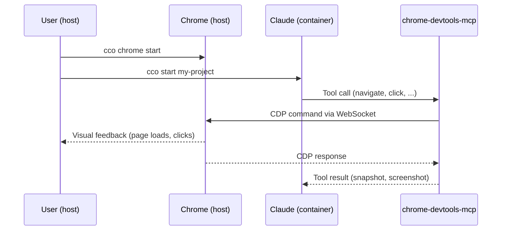

# Browser Automation

> Version: 1.0.0
> Status: v1.0 — Sprint 4
> Related: [project-setup.md](./project-setup.md) | [cli.md](../reference/cli.md) | [project-yaml.md](../reference/project-yaml.md)

---

## 1. Overview

Browser automation lets Claude control a real Chrome browser via the Chrome DevTools Protocol (CDP). The browser runs on your host OS — you see it on your screen in real time while Claude navigates, clicks, fills forms, takes screenshots, and reads page content.

This is powered by [`chrome-devtools-mcp`](https://github.com/anthropics/anthropic-tools), a Model Context Protocol server maintained by Google's Chrome DevTools team. It is pre-installed in the claude-orchestrator Docker image.



### What Claude Can Do

With browser automation enabled, Claude gains access to browser tools:

| Category | Tools | Description |
|----------|-------|-------------|
| **Navigation** | `navigate_page`, `list_pages`, `select_page`, `new_page`, `close_page` | Navigate URLs, manage tabs, go back/forward |
| **Interaction** | `click`, `hover`, `fill`, `fill_form`, `press_key`, `type_text`, `drag` | Click elements, fill inputs, submit forms |
| **Reading** | `take_snapshot`, `take_screenshot`, `evaluate_script` | Read page content (a11y tree), capture screenshots, run JavaScript |
| **Debugging** | `list_console_messages`, `list_network_requests`, `get_network_request` | Monitor console logs and network traffic |
| **Emulation** | `emulate`, `resize_page` | Simulate mobile devices, dark mode, geolocation, network throttling |
| **Performance** | `performance_start_trace`, `performance_stop_trace`, `performance_analyze_insight` | Record and analyze performance traces |
| **Files** | `upload_file` | Upload files through file inputs |
| **Dialogs** | `handle_dialog` | Accept or dismiss browser dialogs (alert, confirm, prompt) |

---

## 2. Prerequisites

- **Google Chrome** installed on your host
  - macOS: `/Applications/Google Chrome.app`
  - Linux: `google-chrome`, `google-chrome-stable`, `chromium`, or `chromium-browser`
- **claude-orchestrator** Docker image built (Chrome DevTools MCP is pre-installed)

No additional software or npm packages are needed.

---

## 3. Setup

### 3.1 Enable in project.yml

Add the `browser` section to your project configuration:

```yaml
# projects/my-project/project.yml

browser:
  enabled: true           # Activate chrome-devtools-mcp
  mode: host              # Chrome runs on your host (default and only mode)
  cdp_port: 9222          # Chrome remote debugging port (default: 9222)
  mcp_args: []            # Extra flags for chrome-devtools-mcp
```

Only `enabled: true` is required — all other fields have sensible defaults.

### 3.2 Start Chrome

Launch Chrome with remote debugging enabled:

```bash
cco chrome start
```

A new Chrome window opens with an isolated profile (`~/.chrome-debug`), separate from your personal browser. You will see Chrome ready with a blank tab.

### 3.3 Start the Session

```bash
cco start my-project
```

That's it. Claude now has access to all browser tools listed above.

### One-Session Override

If you want browser access for a single session without modifying `project.yml`:

```bash
cco chrome start
cco start my-project --chrome
```

The `--chrome` flag enables browser MCP for that session only.

---

## 4. Typical Workflows

### Web Development and Testing

```
You: "Navigate to http://localhost:3000 and verify the login flow works"
Claude: navigates → fills username/password → clicks submit → takes snapshot → reports results
```

### Visual Regression

```
You: "Take a screenshot of every page in the app and compare with the design specs"
Claude: navigates each route → takes screenshots → analyzes layout differences
```

### Web Scraping and Research

```
You: "Go to the API documentation at docs.example.com and extract all endpoint definitions"
Claude: navigates → reads page content → follows links → compiles structured data
```

### Responsive Design Testing

```
You: "Test the homepage at mobile (375px), tablet (768px), and desktop (1440px) widths"
Claude: emulates each viewport → takes screenshots → reports layout issues
```

### Performance Profiling

```
You: "Run a performance trace on the dashboard page and find bottlenecks"
Claude: starts trace → reloads page → stops trace → analyzes insights → reports findings
```

---

## 5. Multi-Project Setup

### Port Conflict Resolution

If you run multiple projects with browser automation simultaneously, each needs a separate Chrome instance on a different port. The orchestrator handles this automatically:

1. At `cco start`, the CLI scans running containers for claimed browser ports
2. If your configured `cdp_port` is already taken, it auto-assigns the next free port (9222 → 9223 → 9224...)
3. A warning is displayed with the effective port
4. The effective port is saved to `projects/<name>/.cco/managed/.browser-port`

### Launching Chrome for a Specific Project

When ports have been auto-assigned, use the `--project` flag to launch Chrome on the correct port:

```bash
# Start Chrome on the port assigned to my-project
cco chrome start --project my-project

# Check status for a specific project
cco chrome status --project my-project
```

### Explicit Port

You can also specify the port directly:

```bash
cco chrome start --port 9223
```

---

## 6. How It Works

### Architecture

When `browser.enabled: true` is set:

1. **`cco start`** generates `.cco/managed/browser.json` in the project directory with the chrome-devtools-mcp configuration
2. The `.cco/managed/` directory is mounted into the container as `/workspace/.managed/` (read-only)
3. **`entrypoint.sh`** merges all `*.json` files in `/workspace/.managed/` into Claude Code's settings (after global and project MCP)
4. A **socat proxy** starts inside the container, forwarding `localhost:<port>` to `host.docker.internal:<port>` — this solves Chrome 145+'s Host header validation
5. Claude Code loads the MCP server and browser tools become available

### Generated Files

| File | Location | Purpose |
|------|----------|---------|
| `browser.json` | `projects/<name>/.cco/managed/browser.json` | MCP server config (auto-generated, gitignored) |
| `.browser-port` | `projects/<name>/.cco/managed/.browser-port` | Effective runtime port (auto-generated, gitignored) |

### Privacy

All generated MCP configs include `--no-usage-statistics` and `--no-performance-crux` flags to disable telemetry by default.

---

## 7. Security Considerations

| Aspect | Protection |
|--------|------------|
| **Browser profile** | Isolated profile at `~/.chrome-debug` — separate from your main Chrome profile, no access to your bookmarks, cookies, or saved passwords |
| **CDP port** | Binds to `127.0.0.1` only — not exposed to the network |
| **Session isolation** | Each `cco start` session connects to its own port; port conflicts are auto-resolved |
| **Container boundary** | The container connects to Chrome via `host.docker.internal` — no direct host filesystem access |

**Recommendations**:

- Do not navigate to sensitive sites (banking, admin panels, email) in the debug Chrome window
- Do not log into personal accounts in the debug Chrome session
- Close the debug Chrome (`cco chrome stop`) when you are done with browser automation
- The debug Chrome window is a separate instance — closing it does not affect your normal Chrome

---

## 8. Configuration Reference

### project.yml — browser section

```yaml
browser:
  enabled: true           # Enable browser automation (default: false)
  mode: host              # Chrome location: "host" (default, only supported mode)
  cdp_port: 9222          # Chrome remote debugging port (default: 9222)
  mcp_args: []            # Extra CLI flags passed to chrome-devtools-mcp
```

| Field | Required | Type | Default | Description |
|-------|----------|------|---------|-------------|
| `browser.enabled` | No | bool | `false` | Activate chrome-devtools-mcp for this project |
| `browser.mode` | No | string | `host` | Where Chrome runs (`host` is the only mode in Sprint 4) |
| `browser.cdp_port` | No | int | `9222` | Chrome remote debugging port |
| `browser.mcp_args` | No | list | `[]` | Extra flags for chrome-devtools-mcp |

### CLI — cco chrome

```
Usage: cco chrome [start|stop|status] [OPTIONS]

Subcommands:
  start    Launch Chrome with remote debugging (default)
  stop     Kill the debug Chrome process
  status   Check if CDP endpoint is reachable

Options:
  --project <name>   Auto-detect port from project runtime state
  --port <n>         Explicit CDP port (default: 9222)
```

**Port resolution priority**:
1. `--port <n>` — explicit flag
2. `--project <name>` → `projects/<name>/.cco/managed/.browser-port` (effective runtime port)
3. `--project <name>` → `project.yml` `browser.cdp_port`
4. Default: `9222`

Full CLI reference: [cli.md](../reference/cli.md#37-cco-chrome-startstopstatus)

---

## 9. Troubleshooting

### Chrome tools not available in session

**Symptoms**: Claude does not have browser tools available.

**Solutions**:
1. Verify `browser.enabled: true` in `project.yml`, or that you used `--chrome` flag
2. Restart the session — MCP servers are loaded at startup, not mid-session
3. Check entrypoint logs for MCP merge errors

### Chrome not reachable from container

**Symptoms**: browser tools fail with connection errors.

**Solutions**:
1. Check that Chrome is running with `cco chrome status`
2. If Chrome is not running, start it: `cco chrome start`
3. Verify the port matches:
   ```bash
   # Check which port the container expects
   cat projects/my-project/.cco/managed/.browser-port

   # Start Chrome on that port
   cco chrome start --project my-project
   ```
4. On Linux, verify that `host.docker.internal` resolves inside the container

### Port conflict between projects

**Symptoms**: warning about port auto-assignment during `cco start`.

**Solution**: this is expected behavior. The CLI auto-assigns the next free port. Use `--project` with `cco chrome` commands:

```bash
cco chrome start --project my-project
cco chrome status --project my-project
```

### Chrome 145+ connection issues

**Symptoms**: CDP connection fails after Chrome auto-update.

**Cause**: Chrome 145+ validates the `Host` header on WebSocket connections, rejecting `host.docker.internal`.

**Solution**: this is handled automatically by a socat proxy inside the container that rewrites the connection to `localhost`. If you still have issues:
1. Rebuild the image: `cco build --no-cache`
2. Restart the session

### Chrome window doesn't open

**Symptoms**: `cco chrome start` shows no window.

**Solutions**:
- **macOS**: verify Chrome is installed at `/Applications/Google Chrome.app`
- **Linux**: verify one of `google-chrome`, `google-chrome-stable`, `chromium`, `chromium-browser` is in PATH
- Check if Chrome is already running on the port: `cco chrome status`
