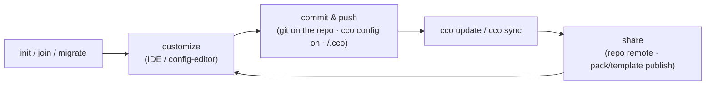
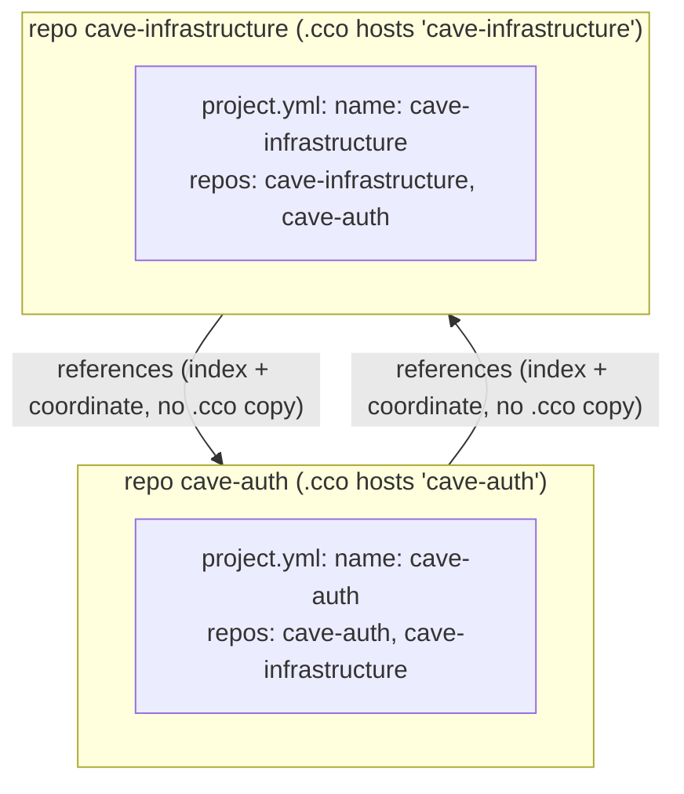
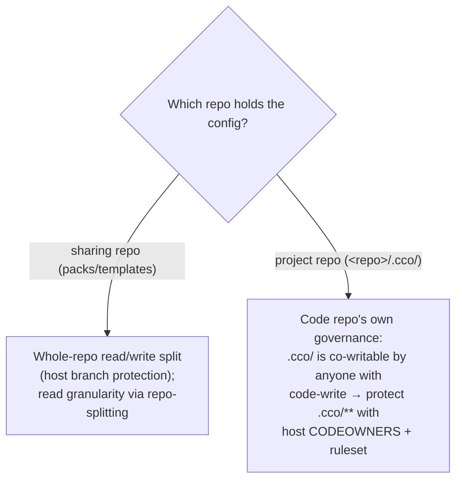

# Configuration Management

> Versioning, per-user tags, the two sync axes, sharing, installing, and updates —
> a unified guide.
>
> Related: [project-setup.md](./project-setup.md) | [knowledge-packs.md](./knowledge-packs.md) | [cli.md](../reference/cli.md)

---

## 1. The Big Picture

Configuration in CCO is **distributed per host-repo**. There is no central
`user-config/` root and no vault. Config lives in two kinds of stores:

| Store | What it holds | Versioned how |
|-------|---------------|---------------|
| **`<repo>/.cco/`** | One project's config: `project.yml` (logical names + coordinates), the `claude/` tree, `secrets.env` (gitignored) | The repo's **own git** (your normal commit/push) |
| **`~/.cco/`** | Your **personal** global store: `global/.claude/`, `packs/`, `templates/` | `cco config save` / `push` / `pull` |

Machine-local plumbing never lives in those stores: the **index** (logical name →
absolute path), session state, and memory live in hidden XDG buckets
(`~/.local/state/cco`, `~/.cache/cco`, `~/.local/share/cco`) that you never hand-edit.

CCO manages config across four dimensions:

| Dimension | What it solves | Key commands |
|-----------|---------------|--------------|
| **Versioning** | Backup + multi-PC sync of your config | git on `<repo>/.cco/`; `cco config save/push/pull` on `~/.cco` |
| **Tags** | Organizing resources per-user (work, personal) | `cco tag add/rm`, `cco list --tag` |
| **Updates** | Keeping config current with the framework and upstreams | `cco update`, `cco update --check` |
| **Sharing** | Publishing/installing packs & templates; sharing projects by construction | `cco pack/template publish/install`; the repo remote |

These form a coherent lifecycle:



---

## 2. Two Orthogonal Sync Axes

There are **two independent reasons** to sync config, and they use **different
transports**. Keeping them separate is the whole model.

| Axis | Purpose | Transport |
|------|---------|-----------|
| **Axis-1 — private, multi-PC** | Get *your* config onto *your* other machines | `git pull` on each repo (for `<repo>/.cco/`) · `cco config push/pull` (for `~/.cco`) |
| **Axis-2 — team sharing** | Get config to *other people* | a project rides its **code repo remote** (by construction) · packs/templates ride a **sharing repo** |

The key fact (ADR-0024 "Front E"): because a project's config is **committed inside
the repo it serves**, both axes are satisfied **by construction** through that repo's
own remote — clone the repo on a second machine *or* hand it to a teammate, and the
`<repo>/.cco/` config comes with it. There is no separate "publish a project" step.

> **Never put team config in `~/.cco`.** `~/.cco` is your **personal** global store
> (your private packs/templates/global rules). Team-sharing of packs/templates flows
> through a dedicated **sharing repo** (§5/§6), *outside* `~/.cco`. A `~/.cco` remote
> is private by default; a public one is allowed only with an explicit warning.

---

## 3. Versioning Your Configuration

### 3.1 Project config — ordinary git on the repo

`<repo>/.cco/` is committed with the code it serves, using your **normal git flow**.
There is no special command — it is just files in the repo.

```bash
git add .cco                       # stage the project config
git commit -m "tighten review rules"
git push                           # Axis-1 (your PCs) + Axis-2 (teammates), by construction

git log -- .cco/                   # isolate the config history
```

`<repo>/.cco/project.yml` is **machine-agnostic** — it carries logical names +
coordinates only, never real local paths — so `git diff` is always truthful and the
same commit works on every machine. The gitignored `secrets.env` never enters git
(only its `secrets.env.example` skeleton is committed); a pre-commit/pre-push secret
scan refuses real secrets and exempts `*.example`.

### 3.2 Personal store — `cco config`

`~/.cco/` is **always** a git working tree (versioning is not optional; only the
remote is opt-in). Version and sync it with `cco config`:

```bash
cco config save -m "add deploy pack"   # explicit, manual commit (allowlist + secret scan)
cco config push                        # push to your opt-in personal remote
cco config pull                        # pull on another machine
```

`cco config save` stages **only** the allowlisted content (`packs/`, `templates/`,
`global/.claude/`, the global `setup*.sh`/`mcp-packages.txt`/`languages`) — never
`git add -A` — and runs a 2-pass secret scan. Commits are **explicit and semantic**
(no auto-commit). A non-fast-forward `cco config pull` aborts and tells you to resolve
in your IDE, as ordinary git.

`cco config validate [--fix]` sanitizes orphaned internal state after a manual
deletion (detect/report, prune only on confirm) — never automatic.

### 3.3 Path portability — the machine-local index

`project.yml` carries logical names + machine-agnostic `url`/`ref` coordinates. Each
machine maps those names to absolute paths in its **STATE index**
(`<state>/cco/index`, never committed, never synced). There are no `@local` markers
and no per-repo `local-paths.yml`.

On a fresh machine after `git clone`, resolve the names:

```bash
cco resolve                          # interactively resolve the cwd's project
cco resolve --scan ~/dev             # discover + register all .cco/ projects under ~/dev
cco path set backend ~/dev/backend   # low-level: bind a logical name → absolute path
cco path list                        # show all name → path mappings
```

For each unresolved repo/mount, `cco resolve` offers *specify a local path* ·
*clone from the coordinate `url`* · *skip*. `cco start` prompts the same way if you
launch with anything unresolved — it never starts with a silent empty mount.

### 3.4 Inspecting changes

```bash
git status -- .cco/                  # project config: ordinary git
git log -- .cco/
cco config save --dry-run            # personal store: preview what would be committed
```

---

## 4. Tags — Organizing Resources

Per-user **tags** replace the old vault profiles. They are **multi-valued per
resource** and **transversal** — a resource can carry any number of tags, and tags
never force single membership the way a profile branch did.

```bash
cco tag add work my-saas             # tag a resource
cco tag add review my-saas
cco tag rm  work my-saas             # untag
cco list --tag work                  # list resources carrying a tag
cco list                             # list everything
```

Tags are **per-user**: they live in a machine-local-but-synced registry
(`<data>/cco/tags.yml`, the DATA bucket), synced across *your* machines but **never**
written into `project.yml`/`pack.yml` and **never** shared with third parties. They
are organizational only — a tag carries no privilege and never affects resolution or
sharing.

> Migration note: when you `cco init --migrate <project>`, CCO prompts (per project)
> whether to convert that project's origin profile into a tag or start untagged.

---

## 5. Sharing Repos & the Sharing Model

CCO uses git for distribution, but the **what** differs by resource type
(the 2×2 model):

| Resource | Live source (updatable) | Snapshot |
|----------|-------------------------|----------|
| **Packs** | `cco pack publish` / `cco pack install` | `cco pack export` / `cco pack import` |
| **Templates** | `cco template publish` / `cco template install` | `cco template export` / `cco template import` |
| **Projects** | **— shared by construction via the repo remote —** | `cco project export` / `cco project import` |

**Projects do not publish/install.** A project's `<repo>/.cco/` rides its own code
repo remote, so it is team-shared the moment you push the repo. Projects get only the
tar-snapshot half (`export`/`import`), used to bootstrap a repo that has no committed
`.cco/` yet (the other bootstrap paths are `cco init` and `cco init --migrate`).

### Personal store vs sharing repo

| | Personal store (`~/.cco`) | Sharing repo |
|---|---|---|
| **Purpose** | Your private global config, multi-PC | Team/community distribution of packs & templates |
| **Visibility** | Private (you) | Team, org, or public |
| **Content** | `global/.claude/`, your `packs/`, `templates/` | `packs/` + `templates/` only |
| **Flow** | `cco config push/pull` (bidirectional) | `publish` → `install` (one-way) |

> Never publish your personal `~/.cco` to teammates. Use a dedicated sharing repo with
> `publish`/`install` for team sharing of packs and templates; share a project via its
> own code repo.

### Sharing repo structure

A sharing repo holds **`packs/` + `templates/` only** — discovered **structure-based**
(via `git ls-tree`). There is **no `manifest.yml`** (removed): the directory layout is
the discovery mechanism.

```
my-sharing-repo/
├── .gitignore
├── packs/
│   ├── react-guidelines/
│   │   ├── pack.yml
│   │   ├── knowledge/
│   │   ├── skills/
│   │   ├── agents/
│   │   └── rules/
│   └── deploy-patterns/
│       └── ...
└── templates/
    └── microservice/
        ├── project.yml
        └── .claude/
```

When someone installs from your repo, only `packs/` and `templates/` are available.
The repo is initialized at first publish and merged-on-existing on subsequent publishes.

---

## 6. Installing & Publishing

### 6.1 Installing packs & templates

```bash
cco pack install https://github.com/acme/cco-sharing              # All packs
cco pack install https://github.com/acme/cco-sharing --pick acme-conventions
cco pack install https://github.com/acme/cco-sharing --force      # Overwrite existing

cco template install https://github.com/acme/cco-sharing --pick acme-service
```

Installed packs land in `~/.cco/packs/`. The upstream coordinate is recorded in DATA
(`<data>/cco/packs/<name>/source`) and the installed tree is recorded as the STATE
merge base for the next `cco pack update`. Single-pack repositories (a `pack.yml` at
root) are recognized and installed directly.

### 6.2 Authentication and ref pinning

```bash
# SSH (uses existing key)
cco pack install git@github.com:my-org/cco-sharing

# HTTPS with saved token
cco remote add team https://github.com/my-org/cco-sharing.git --token ghp_xxx
cco pack install https://github.com/my-org/cco-sharing.git   # token auto-resolved

# Pin to branch or tag
cco pack install https://github.com/acme/cco-sharing@v2.0
```

Sharing-repo endpoints are managed with `cco remote add/remove/list`. The de-tokenized
registry lives in DATA; the token is isolated in STATE (0600, never synced). See
[Authentication](./authentication.md) for full details.

### 6.3 Publishing

```bash
cco remote add my-remote https://github.com/me/my-sharing-repo.git
cco pack publish my-pack my-remote
cco template publish my-template my-remote
```

Publishing is **sync-before-publish**: a subsequent publish does a 3-way merge against
the recorded STATE base and **aborts on conflict** ("run `cco pack update` first") —
never a blind overwrite that would discard co-maintainers' remote changes. The remote
is resolved as: explicit arg → registered remote name → direct URL → the target
re-derived from the DATA remotes registry.

### 6.4 Exporting/importing (without git)

```bash
cco pack export acme-conventions       # -> acme-conventions.tar.gz
cco pack import ./acme-conventions.tar.gz

cco project export my-saas             # snapshot a project's <repo>/.cco/
cco project import ./my-saas.tar.gz    # bootstrap a repo's .cco/ from the snapshot
```

### 6.5 After installation

Installed packs/templates are fully yours — customize freely. The upstream connection
is kept for updates, but the publisher cannot force changes: every update goes through
your interactive choice. To sever the upstream coupling permanently, internalize:

```bash
cco pack internalize react-guidelines       # cut the upstream url → local authored source
cco template internalize team-service
```

---

## 7. Updates

CCO has two update sources:

1. **Framework defaults** — improved default rules, agents, skills, templates.
2. **Upstreams** — newer versions of packs/templates you installed from a sharing repo.

(Projects are **not** in the upstream-update surface — a project's config arrives by
`git pull` on its repo.)

### 7.1 Discovery

```bash
cco update              # migrations + eager vault migration + available framework updates
cco update --check      # list installed packs/templates with an upstream update
cco update --news       # show changelog (new features)
```

`cco update` also owns the **eager global migration** from a legacy vault: on first run
it backs the vault up (non-destructively, into STATE) and populates `~/.cco`. Removal of
the old vault is offered only here, **default keep**.

### 7.2 Framework updates

```bash
cco update --sync              # interactive merge for all framework changes
cco update --sync global       # only global config
cco update --sync my-project   # only one project
cco update --diff              # preview without applying
```

The interactive merge offers per-file options:

| Option | What it does |
|--------|-------------|
| **(A)pply** | Accept framework version (when you haven't modified the file) |
| **(M)erge** | 3-way merge preserving your changes + framework improvements |
| **(R)eplace** | Overwrite with framework version, save yours as `.bak` |
| **(K)eep** | Keep your version unchanged |
| **(N)ew-file** | Save framework version as `.new` for manual review |
| **(D)iff** | Show differences before deciding |

The merge ancestors (`base/`) and metadata live in machine-local STATE, never in the
committed `<repo>/.cco/`. **Tip**: if you've heavily restructured a file, use
**(N)ew-file** instead of **(M)erge**.

### 7.3 Upstream pack/template updates

```bash
cco update --check                     # which installed resources have an update?
cco pack update acme-conventions       # 3-way merge against the recorded STATE base
cco pack update --all
```

> 🚧 `cco template update` is planned for a later release (see the command
> reference table below) — packs support `update` today, templates do not yet.

### 7.4 Internalizing resources

To permanently disconnect a pack/template from its upstream sharing repo:

```bash
cco pack internalize react-guidelines
cco template internalize acme-service
```

After internalizing, the resource becomes a fully local authored source — framework
updates still apply via `cco update --sync`, but upstream updates are no longer checked.

---

## 8. One Project Per Repo, Referenced by N

A `<repo>/.cco/` holds the config of **exactly one** project — the one the repo
*hosts* (its `project.yml` `name`). That is one development scope. A repo can be a
**reference-member** of any number of *other* projects: they list it by logical name +
coordinate in *their* manifests and resolve it via the index — **without** copying any
of their `.cco/` into it.



- **Hosting two projects in one repo is unsupported** — a repo is one dev scope. The
  legitimate interdependency case is two projects, **each in its own host repo**,
  mounting the other (above).
- **The `cco sync` guard.** `cco sync` keeps a project's config-bearing repos
  byte-identical by copying the committed `<repo>/.cco/`. It **skips with a warning**
  any target that hosts a *different* project — never clobbering it, with no `--force`
  override. To re-home such a repo, de-init its `.cco/` then sync, or re-init with
  `--sync`.
- **Introspection.** `cco project show` reports, for the project's repos, which project
  each repo **hosts**, the projects that **reference** it (reverse index lookup), and
  each member's sync state (host / synced / divergent / code-only). The passive ⚠ badge
  at `cco start`/`cco list` flags unresolved/unreachable references.

> Shipping a project's config *only* through `~/.cco` (Axis-1-only, "don't ship the
> `.cco/`") is a post-v1 option (`~/.cco/projects/`), not the v1 model.

---

## 9. Governance & Protecting Config

cco **delegates enforcement to git**, exactly as it does for authentication: it is
never in the push path, so it cannot — and must not — act as a permission gatekeeper.
What protects shared config is the **git host** (branch protection, rulesets, review
routing); cco's job is to *surface* problems and *assist* setup, never to block. Two
governance models follow the resource's home.



### 9.1 Two models

- **Sharing repo.** A pack/template sharing repo is its own clean read/write split:
  whoever has push rights publishes; everyone else installs read-only. Need finer read
  granularity (some packs visible to a sub-team only)? **Split into multiple sharing
  repos** — one read scope per repo. cco discovers each by structure.
- **Project repo.** A project's `<repo>/.cco/` rides the **code repo's existing
  governance**. By default anyone with code-write can also edit `.cco/` — convenient, but
  it means a config change lands like any other commit. To restrict who may change the
  shared config, protect `.cco/**` with the host's path-scoped rules + CODEOWNERS (below).

### 9.2 The footgun and the safety net

A developer with code-write can silently alter `<repo>/.cco/`, changing how the project's
cco sessions behave for **every** teammate. cco surfaces this; it does not block it:

- **`cco project validate`** (share-readiness) flags broken coordinates / path leaks /
  pack collisions before they reach teammates.
- The change is a **truthful `git diff` in the PR** — no real host path ever enters
  committed config, so the diff shows exactly what changed.
- The recommended **CODEOWNERS** convention routes `.cco/**` edits to the right reviewers.

### 9.3 Protecting `<repo>/.cco/**` (manual setup)

Put the CODEOWNERS rule at a **host-recognized path** — the repo-root `CODEOWNERS`, or
`.github/CODEOWNERS` when the repo has a `.github/` directory. **Never** at
`<repo>/.cco/CODEOWNERS`: GitHub honors CODEOWNERS only at the repo root, `.github/`, or
`docs/`, so a file under `.cco/` is silently ignored.

```
# CODEOWNERS (repo root or .github/)
/.cco/**   @org/cco-maintainers
```

Then enable a **path-scoped write rule** on the protected branch — the mechanism differs
by host:

| Host | Path-scoped write protection for `.cco/**` |
|---|---|
| **GitHub** | Branch **Ruleset** with an fnmatch path condition `/.cco/**` + "Require review from Code Owners" on the protected branch |
| **Gitea** | Protected-branch **file-pattern** glob on `.cco/**` |
| **GitLab** | Push rules match the **filename only** (regex) → a true path-scoped block needs a **pre-receive hook**; Code Owners here is *advisory* (bypassable) |
| **generic git** | Server-side **`pre-receive`** hook |

> **Key fact:** CODEOWNERS is **review routing**, not a hard write gate on its own. Hard
> per-path enforcement comes from the host's Rulesets / protected-path patterns /
> pre-receive hooks — branch protection is what makes the CODEOWNERS review *required*.

> 🚧 **Planned:** `cco config protect` will scaffold the host-recognized CODEOWNERS entry
> (host detected from the repo's `origin`) and print these per-host instructions for you.
> Until it ships (post-v1), set protection up manually as above.

---

## 10. Recommended Workflows

### Solo developer — single machine

```bash
cd ~/dev/my-repo && cco init        # scaffold <repo>/.cco/, seed ~/.cco if first run

# Daily: edit config, commit with the repo
git add .cco && git commit -m "tweak rules" && git push

# Periodic: framework updates
cco update && cco update --sync
```

### Solo developer — multiple machines

```bash
# Machine A
git push                            # the <repo>/.cco/ rides the repo remote
cco config push                     # personal ~/.cco store

# Machine B
git pull                            # project config arrives with the repo
cco config pull                     # personal store
cco resolve --scan ~/dev            # map logical names → local paths on this machine
```

Use tags for different project sets per machine/context:

```bash
cco tag add work work-api
cco list --tag work
```

### Team — sharing a project

```bash
# Author: just push the repo — the .cco/ is shared by construction
cd ~/dev/api-service && cco init
git add .cco && git commit -m "project config" && git push

# Teammate: clone + start
git clone <repo-url> && cd api-service
cco start                           # .cco/ already present; resolve prompts if needed
git pull                            # later: config updates arrive as ordinary commits
cco sync                            # converge config-bearing repos on this machine
```

### Team — sharing packs/templates

```bash
# Maintainer
cco remote add team https://github.com/company/team-sharing.git
cco pack publish team-rules team           # sync-before-publish (3-way merge)

# Consumer
cco pack install https://github.com/company/team-sharing.git --pick team-rules
cco update --check                          # see when an update is available
cco pack update team-rules
```

### Memory and session data

Each project's runtime state is **machine-local STATE**, not config — it is **not**
versioned and **not** synced in v1:

- **Memory** (`<state>/cco/projects/<id>/session/memory/`) — auto memory files. Local
  to this machine; the old vault-tracked cross-PC memory sync no longer exists
  (cross-PC/team state sync is a deferred opt-in feature).
- **Session transcripts** (`<state>/cco/projects/<id>/claude-state/`) — large,
  machine-specific, enables `/resume`.

---

## 11. Command Reference

### Versioning & sync

| Command | Purpose |
|---------|---------|
| `git add .cco && git commit && git push` | Version + share project config (the repo's own git) |
| `cco config save [-m <msg>] [--dry-run]` | Commit the personal `~/.cco` store (allowlist + secret scan) |
| `cco config push` / `cco config pull` | Sync `~/.cco` to/from its opt-in remote |
| `cco config validate [--dry-run\|--fix [-y]]` | Sanitize orphaned internal state (detect/report; --fix prunes, confirmed) |
| `cco sync [target] [--from <src>] [--dry-run\|--auto-approve\|--check]` | Copy `<repo>/.cco/` across a project's repos (clobber-guarded) |
| `cco resolve [project] [--all] [--scan <dir>]` | Map logical names → absolute paths (index) |
| `cco path set <name> <path>` / `cco path list` | Low-level index editor |

### Tags

| Command | Purpose |
|---------|---------|
| `cco tag add <tag> <resource>` | Add a per-user tag |
| `cco tag rm <tag> <resource>` | Remove a per-user tag |
| `cco list [--tag <t>]` | List resources, optionally filtered by tag |

### Updates

| Command | Purpose |
|---------|---------|
| `cco update` | Migrations + eager vault migration + available framework updates + changelog |
| `cco update --check` | List installed packs/templates with an upstream update (read-only, 3-state, exit 0) |
| `cco update --sync [scope]` | Interactive framework file merge |
| `cco update --diff [scope]` | Preview framework changes |
| `cco update --news` | Show changelog details |
| `cco pack update <name>` / `--all` | Update pack(s) from upstream (3-way merge) |
| `cco template update <name>` / `--all` | Update template(s) from upstream — 🚧 planned, ships in a later release |

### Sharing & remotes

| Command | Purpose |
|---------|---------|
| `cco remote add <n> <url> [--token]` | Register a sharing-repo endpoint |
| `cco remote remove <name>` / `cco remote list` | Manage endpoints |
| `cco pack publish <name> [remote]` | Publish a pack (sync-before-publish) |
| `cco template publish <name> [remote]` | Publish a template |
| `cco pack install <url>` / `cco template install <url>` | Install from a sharing repo |
| `cco pack export\|import` / `cco template export\|import` | Tar-snapshot share |
| `cco project export\|import` | Snapshot/bootstrap a project's `<repo>/.cco/` |
| `cco pack internalize <name> [--as <new>]` | Cut the upstream coordinate (`cco template internalize` too; `--as` forks) |

### Entry & introspection

| Command | Purpose |
|---------|---------|
| `cco init [--migrate <project> [--sync]]` | Scaffold/hydrate a repo's `.cco/` (single entry verb) |
| `cco join <project> [--sync]` | Add the current repo to a project as a member |
| `cco forget <project> [-y]` | Deregister a project (index/tags/state only; repo untouched) |
| `cco project show <name>` | Project + repo↔project roles, referenced-by, sync state |
| `cco project validate [name] [--all] [--reachable]` | Share-readiness validation (coordinates, no path leaks, no pack collision) |
| `cco project coords [--diff] [--sync --from <unit>]` | Show/reconcile coordinate consistency across your projects |
