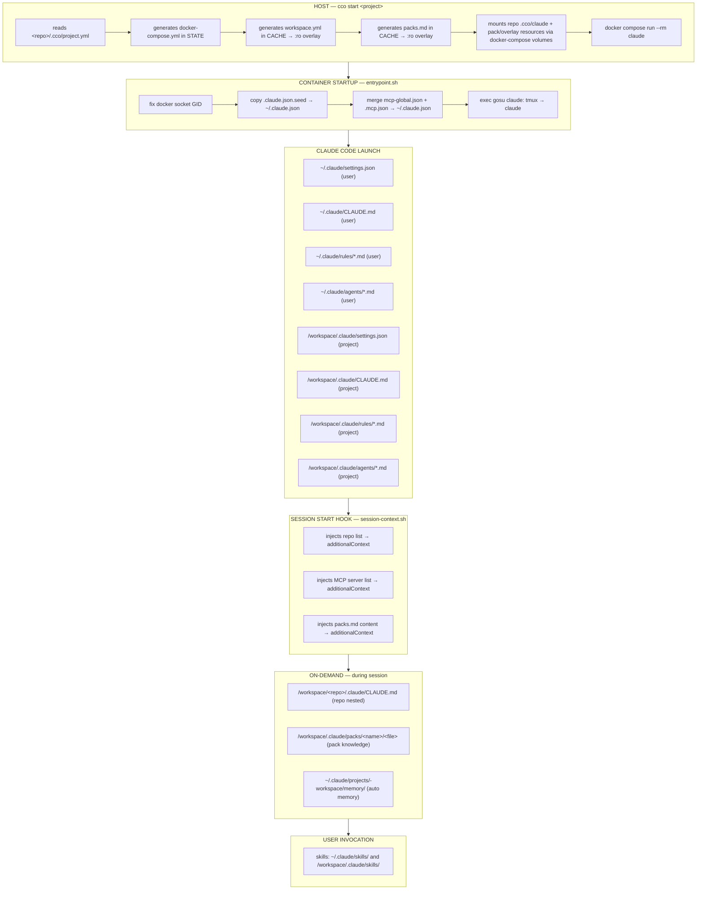

# Context & Settings Hierarchy

> Version: 1.1.0
> Status: v1.1 — Merged from context.md + context-loading.md
> Related: [architecture.md](../../../maintainers/foundation/design/architecture.md) | [spec.md](../../../maintainers/foundation/analysis/spec.md)

Complete reference for the context hierarchy, settings resolution, configuration
files, and the full loading lifecycle — from `cco start` through session runtime.

---

## 1. Overview

Claude Code loads configuration from multiple locations with a fixed precedence. The orchestrator maps its four-tier config (managed → global → project → repo) onto Claude Code's native hierarchy so that everything "just works" without hacks. See [scope-design.md](../../../maintainers/configuration/scope-hierarchy/design/design-scope-hierarchy.md) for the complete design document.

---

## 2. Settings Precedence

Claude Code resolves settings from highest to lowest precedence:

```
1. Managed settings       ← /etc/claude-code/managed-settings.json  ← OUR MANAGED (hooks, env, deny)
2. Command-line args      ← --dangerously-skip-permissions
3. Local project settings ← /workspace/.claude/settings.local.json (optional)
4. Shared project         ← /workspace/.claude/settings.json       ← OUR PROJECT
5. User settings          ← ~/.claude/settings.json                ← OUR USER (preferences)
```

**Implication**: Managed settings have the highest priority — hooks and env vars are always active. Project settings override user settings. This is correct behavior — a project can tighten or loosen rules defined globally.

---

## 3. Memory (CLAUDE.md) Resolution

### 3.1 Always Loaded

These files are loaded into Claude's context when the session starts:

| File | Container Path | Source | Tier |
|------|---------------|--------|------|
| Managed CLAUDE.md | `/etc/claude-code/CLAUDE.md` | `defaults/managed/CLAUDE.md` (in image) | Managed |
| User CLAUDE.md | `~/.claude/CLAUDE.md` | `~/.cco/.claude/CLAUDE.md` | User |
| User rules | `~/.claude/rules/*.md` | `~/.cco/.claude/rules/*.md` | User |
| Project CLAUDE.md | `/workspace/.claude/CLAUDE.md` | `<repo>/.cco/claude/CLAUDE.md` | Project |
| Project rules | `/workspace/.claude/rules/*.md` | `<repo>/.cco/claude/rules/*.md` | Project |

### 3.2 Loaded On-Demand

These files are loaded when Claude reads files in the corresponding directories:

| File | Container Path | Source |
|------|---------------|--------|
| Repo CLAUDE.md | `/workspace/<repo>/.claude/CLAUDE.md` | Lives in the repo itself |
| Repo rules | `/workspace/<repo>/.claude/rules/*.md` | Lives in the repo itself |
| Nested CLAUDE.md | `/workspace/<repo>/subdir/CLAUDE.md` | Lives in the repo itself |

### 3.2b The Four `.claude` Scopes — Where to Put Config (ADR-0024 D4)

In the decentralized model a session sees **four distinct `.claude` trees**, each with a different *reach*. Choose where to place a rule/agent/skill/CLAUDE.md by the audience it should reach — not by convenience:

| `.claude` scope | Host source | Container path | Reach (who sees it) |
|---|---|---|---|
| **Repo-native** | `<repo>/.claude/` | `/workspace/<repo>/.claude/` | **Cross-cutting** — every project that mounts this repo, *and* native Claude Code use in the repo. cco never touches or syncs it. |
| **Project (invoking repo's)** | `<repo>/.cco/claude/` | `/workspace/.claude/` | **This project only, across all its repos.** Belongs to the project the invoking repo hosts; does **not** leak into another project's session. |
| **Global** | `~/.cco/.claude/` | `~/.claude/` | **All of the user's projects** on this machine. |
| **Managed** | `defaults/managed/` (baked in image) | `/etc/claude-code/` | All sessions, **non-overridable, highest priority** — framework policy. |

**Placement by intended reach:**
- Convention that belongs to one codebase regardless of which project mounts it → **repo-native** `<repo>/.claude/`.
- Convention for *this* project that may span several of its repos → **project** `<repo>/.cco/claude/`.
- Personal convention you want in every project → **global** `~/.cco/.claude/`.
- Framework-enforced, non-overridable policy → **managed** (maintainers only; updated via `cco build`).

Only the **invoking** repo's `.cco/claude/` becomes the session's project scope (ADR-0005). A *referenced* repo's `.cco/claude/` is **not** mounted as project scope — so one project's cross-repo config never leaks into another project's session. Its repo-native `<repo>/.claude/`, however, is still loaded on-demand because the repo is mounted at `/workspace/<repo>/`.

### 3.3 Imports (@path syntax)

CLAUDE.md files support `@path/to/file` imports. Paths resolve relative to the file containing the import.

**Example** — project CLAUDE.md importing repo-specific docs:
```markdown
# Project: My SaaS Platform

See @backend-api/README.md for API overview.
See @frontend-app/docs/architecture.md for frontend architecture.
```

This works because the repos are subdirectories of `/workspace/`.

### 3.4 Knowledge Packs

Knowledge packs extend the context hierarchy with reusable documentation (conventions, business overviews, guidelines) and can also contribute project-level skills, agents, and rules.

**Load path** (automatic via SessionStart hook — no CLAUDE.md edit needed):
```
cco start
  ├── mounts knowledge dirs → /workspace/.claude/packs/<name>/  (:ro)
  ├── mounts pack rules → /workspace/.claude/rules/<file>.md  (:ro, per file)
  ├── mounts pack agents → /workspace/.claude/agents/<file>.md  (:ro, per file)
  ├── mounts pack skills → /workspace/.claude/skills/<name>/  (:ro, per dir)
  └── generates .claude/packs.md  (instructional file list)

session-context.sh (SessionStart hook)
  └── injects packs.md content → additionalContext

Pack knowledge files: read on-demand by Claude when relevant
Pack skills/agents/rules: available from project startup (mounted read-only)
```

| Layer | Container Path | Loader |
|-------|---------------|--------|
| Pack knowledge | `/workspace/.claude/packs/<name>/` | Mounted `:ro` by `cco start` |
| packs.md | `/workspace/.claude/packs.md` | Generated by `cco start`; injected by hook |
| Pack skills | `/workspace/.claude/skills/<s>/` | Mounted `:ro` by `cco start` |
| Pack agents | `/workspace/.claude/agents/*.md` | Mounted `:ro` by `cco start` (per file) |
| Pack rules | `/workspace/.claude/rules/*.md` | Mounted `:ro` by `cco start` (per file) |

Packs are activated by listing them in `project.yml`. No CLAUDE.md edit is required — the `session-context.sh` hook injects the knowledge file list into `additionalContext` automatically.

See [CLI.md §4.2](../../reference/cli.md) for pack definition format. See [Loading Lifecycle](#12-loading-lifecycle) below for the full loading sequence.

### LLMs.txt Framework Documentation

Official framework documentation (llms.txt files) installed via `cco llms install` are mounted read-only at `/workspace/.claude/llms/<name>/`. They are listed in `.claude/packs.md` under "Official Framework Documentation" and injected into context via the `session-context.sh` hook.

| Resource | Container Path | Mount Mode |
|----------|---------------|------------|
| LLMs docs | `/workspace/.claude/llms/<name>/` | `:ro` (read-only) |

Unlike knowledge files which are read in full, llms.txt files can be very large (10K+ lines). The managed rule `use-official-docs.md` instructs agents to read them selectively using offset/limit.

See [project-yaml.md § LLMs.txt](../../configuration/reference/project-yaml.md#llmstxt--framework-documentation) for configuration schema.

---

## 4. File Specifications

### 4.1 Managed Settings (`/etc/claude-code/managed-settings.json`)

Framework infrastructure — baked into the Docker image, non-overridable.

```json
{
  "$schema": "https://json.schemastore.org/claude-code-settings.json",
  "env": { "CLAUDE_CODE_EXPERIMENTAL_AGENT_TEAMS": "1" },
  "hooks": {
    "SessionStart": [{ "hooks": [{ "type": "command", "command": "/usr/local/bin/cco-hooks/session-context.sh", "timeout": 10 }] }],
    "SubagentStart": [{ "hooks": [{ "type": "command", "command": "/usr/local/bin/cco-hooks/subagent-context.sh", "timeout": 5 }] }],
    "PreCompact": [{ "hooks": [{ "type": "command", "command": "/usr/local/bin/cco-hooks/precompact.sh", "timeout": 5 }] }]
  },
  "statusLine": { "type": "command", "command": "/usr/local/bin/cco-hooks/statusline.sh" },
  "permissions": { "deny": ["Read(~/.claude.json)", "Read(~/.ssh/*)"] }
}
```

**Notes**:
- Hooks always execute — managed hooks cannot be disabled by user or project settings
- `deny` protects auth token and SSH keys from accidental reads
- SessionStart hook uses a catch-all (no matcher) to fire on all session events (startup, clear, etc.)
- Updated only via `cco build` (baked in Docker image)

### 4.1b User Settings (`~/.cco/.claude/settings.json`)

User preferences — copied once by `cco init`, fully customizable.

```json
{
  "$schema": "https://json.schemastore.org/claude-code-settings.json",
  "permissions": {
    "allow": [
      "Bash(git *)", "Bash(npm *)", "Bash(npx *)", "Bash(node *)",
      "Bash(python3 *)", "Bash(pip *)", "Bash(docker *)", "Bash(docker compose *)",
      "Bash(tmux *)", "Bash(cat *)", "Bash(ls *)", "Bash(find *)",
      "Bash(grep *)", "Bash(rg *)", "Bash(head *)", "Bash(tail *)",
      "Bash(wc *)", "Bash(sort *)", "Bash(mkdir *)", "Bash(cp *)",
      "Bash(mv *)", "Bash(rm *)", "Bash(chmod *)", "Bash(curl *)",
      "Bash(wget *)", "Bash(jq *)",
      "Read", "Edit", "Write", "WebFetch", "WebSearch", "Task"
    ]
  },
  "attribution": {
    "commit": "Co-Authored-By: Claude <noreply@anthropic.com>",
    "pr": "Generated with Claude Code"
  },
  "teammateMode": "tmux",
  "cleanupPeriodDays": 30,
  "enableAllProjectMcpServers": true,
  "alwaysThinkingEnabled": true
}
```

**Notes**:
- The `allow` list is comprehensive to avoid any prompt even if bypass mode is not active
- `teammateMode` defaults to `"tmux"` — user can override to `"auto"` for iTerm2
- `enableAllProjectMcpServers` trusts all project MCP servers (safe in containerized environment)
- `alwaysThinkingEnabled` enables extended thinking for better reasoning on complex tasks
- User can freely modify this file — changes persist across sessions

### 4.2 Global CLAUDE.md (`~/.cco/.claude/CLAUDE.md`)

```markdown
# Global Instructions

## Development Workflow

Every task follows this structured workflow. Phase transitions are MANUAL — 
never skip ahead or auto-advance without explicit user approval.

### Phases
1. **Analysis** → Understand requirements, explore codebase, identify constraints
2. **Review & Approval** → Present findings, wait for user feedback
3. **Design** → Propose architecture, interfaces, data models
4. **Review & Approval** → Present design, wait for user feedback  
5. **Implementation & Testing** → Write code, tests, verify
6. **Review & Approval** → Present implementation, wait for user feedback
7. **Documentation** → Update docs, README, API docs, changelog
8. **Closure** → Final review, merge readiness check

### Scope Levels
The workflow applies recursively at multiple levels:
- **Project**: Overall project planning and architecture
- **Architecture**: System-wide design decisions
- **App/Service**: Individual application or microservice
- **Module**: Component or module within an app
- **Feature**: Specific feature or user story

Always clarify the current scope level before starting work.

### Phase Behavior
- During **Analysis**: Read code, ask questions, produce summaries. NO code changes.
- During **Design**: Produce design docs, diagrams, interface definitions. NO implementation.
- During **Implementation**: Write code and tests. Follow the approved design.
- During **Documentation**: Update all relevant docs. NO new features.

## Git Practices
- Always work on feature branches, never directly on main/master
- Use conventional commits: feat:, fix:, docs:, refactor:, test:, chore:
- Commit frequently with meaningful, descriptive messages
- Create a new branch at the start of any implementation phase
- Branch naming: `<type>/<scope>/<description>` (e.g., `feat/auth/add-oauth-flow`)

## Communication Style
- Be concise and direct
- Present findings in structured format
- When presenting options, include trade-offs
- Ask clarifying questions before making assumptions
- At the end of each phase, summarize what was done and what's next

## Agent Teams
- The lead coordinates and delegates work to teammates
- Each teammate focuses on their specialized domain
- Use the shared task list for coordination
- Communicate relevant findings between teammates
- The lead synthesizes teammate outputs into coherent results

## Docker Environment
- This session runs inside a Docker container
- Repos are mounted at /workspace/<repo-name>/
- Docker socket is available — you can run docker and docker compose
- When starting infrastructure (postgres, redis, etc.), use the project network
- Dev servers run inside this container with ports mapped to the host
```

### 4.3 Global Rules

Modular rule files in `~/.cco/.claude/rules/`:

**`workflow.md`** — Detailed workflow phase behaviors:
```markdown
# Workflow Phase Rules

## Analysis Phase
- Read and understand all relevant code before proposing changes
- Identify dependencies, constraints, and potential risks
- Document findings in a structured analysis summary
- List questions that need answers before proceeding
- DO NOT modify any files during analysis

## Design Phase  
- Reference the analysis findings
- Propose clear interfaces and data models
- Consider error handling and edge cases
- Evaluate alternatives and document trade-offs
- Produce diagrams where helpful (see diagrams rule)
- DO NOT write implementation code during design

## Implementation Phase
- Follow the approved design
- Write tests alongside implementation
- Commit after each logical unit of work
- Run existing tests to verify no regressions
- If the design needs changes, pause and discuss

## Documentation Phase
- Update README if public API changed
- Update inline code comments
- Update changelog
- Document new configuration options
- DO NOT add new features during documentation
```

**`git-practices.md`** — Git conventions:
```markdown
# Git Practices

## Branch Strategy
- Main branch: `main` (never commit directly)
- Feature branches: `feat/<scope>/<description>`
- Fix branches: `fix/<scope>/<description>`
- Always branch from the latest main

## Commit Messages
Follow conventional commits:
- `feat: add user authentication`
- `fix: resolve race condition in queue processor`
- `docs: update API endpoint documentation`
- `refactor: extract validation logic to shared module`
- `test: add integration tests for payment flow`
- `chore: update dependencies`

## Commit Frequency
- Commit after each logical, working unit of change
- Each commit should leave the codebase in a working state
- Prefer many small commits over few large ones
```

### 4.4 Project CLAUDE.md Template (`templates/project/base/.claude/CLAUDE.md`)

```markdown
# Project: {{PROJECT_NAME}}

## Overview
{{DESCRIPTION}}

## Repositories

{{#each repos}}
### {{name}}
- Path: /workspace/{{name}}/
- Description: {{description}}
{{/each}}

## Project-Specific Instructions

<!-- Add project-specific instructions, conventions, and context here -->

## Architecture

<!-- Describe the overall architecture, how repos relate to each other -->

## Infrastructure

<!-- If this project uses docker compose for infrastructure:
- Network name: cc-{{PROJECT_NAME}}
- Set `networks.default.external = true` and `networks.default.name = cc-{{PROJECT_NAME}}`
  in infrastructure docker-compose files so containers join the project network.
-->

## Key Commands

<!-- Common commands for this project:
- Build: ...
- Test: ...
- Run dev: ...
- Deploy: ...
-->
```

### 4.5 Project Settings Template (`templates/project/base/.claude/settings.json`)

```json
{
  "$schema": "https://json.schemastore.org/claude-code-settings.json"
}
```

Empty by default — inherits everything from global. Projects add overrides as needed:

```json
{
  "$schema": "https://json.schemastore.org/claude-code-settings.json",
  "permissions": {
    "deny": [
      "Read(./.env)",
      "Read(./.env.*)",
      "Read(./secrets/**)"
    ]
  }
}
```

---

## 5. Auto Memory

### 5.1 How Auto Memory Works

Claude Code stores auto memory at:
```
~/.claude/projects/<project-identifier>/memory/
├── MEMORY.md          # Index, first 200 lines loaded at startup
├── debugging.md       # Topic files, loaded on demand
└── patterns.md
```

The `<project-identifier>` is derived from the git root directory. Since `/workspace` is not a git repo, Claude Code falls back to using the working directory name: `workspace`.

### 5.2 Isolation and Persistence Strategy

Auto memory and session transcripts are **machine-local STATE** (ADR-0009) — not config, never committed to a repo, and **not synced across machines in v1**. Each project's state lives under the per-machine STATE bucket, keyed by the project identity `<id>` (the `project.yml` `name`):

```
~/.local/state/cco/projects/<id>/
├── claude-state/         ← session transcripts → mounted to ~/.claude/projects/-workspace/
│   └── <session-transcripts>   ← enables /resume across container rebuilds
└── session/memory/       ← auto memory → mounted to ~/.claude/projects/-workspace/memory/
    ├── MEMORY.md
    └── ...
```

**Mount in docker-compose** (host sources are host-absolute, resolved by `cco start`):
```yaml
volumes:
  - <state>/cco/projects/<id>/claude-state:/home/claude/.claude/projects/-workspace
  - <state>/cco/projects/<id>/session/memory:/home/claude/.claude/projects/-workspace/memory
```

The transcripts mount captures session history; the child `memory/` mount captures auto memory written by Claude Code, so `/resume` works even after `cco build --no-cache`. Since only one project's container runs at a time (or they use different container names), there's no conflict.

> Memory is **machine-local** (ADR-0009). Cross-PC / cross-team sync of state (memory and transcripts) is a deferred opt-in feature, not part of v1. The old vault auto-commit of `memory/` is removed.

---

## 6. Subagents

### 6.1 Resolution

Claude Code loads subagents from (highest to lowest priority):
1. `/etc/claude-code/.claude/agents/` — Managed-level (not used — agents belong in User tier)
2. `/workspace/.claude/agents/` — Project-level (our `<repo>/.cco/claude/agents/` + pack agents)
3. `~/.claude/agents/` — User-level (our `~/.cco/.claude/agents/`)

Project agents take precedence over user agents with the same name. See [scope-design.md §3.4](../../../maintainers/configuration/scope-hierarchy/design/design-scope-hierarchy.md) for details.

### 6.2 Default Agents

See [SUBAGENTS.md](../../integration/guides/subagents.md) for full specifications.

---

## 7. Skills

### 7.1 Resolution

Claude Code discovers skills from (highest priority first):
1. `/etc/claude-code/.claude/skills/` — Managed/Enterprise (our `defaults/managed/.claude/skills/`, baked in image)
2. `~/.claude/skills/` — User-level (our `~/.cco/.claude/skills/`)
3. `/workspace/.claude/skills/` — Project-level
4. `/workspace/<repo>/.claude/skills/` — Repo-level (on-demand)

When skills share the same name across levels, higher-priority locations win.

### 7.2 Skill Format

Each skill is a **directory** containing a `SKILL.md` file (required). The directory name becomes the skill name if `name` is not set in frontmatter. Supporting files (templates, scripts, examples) can be placed alongside `SKILL.md`.

```
skills/
  analyze/
    SKILL.md        # Required — main instructions + frontmatter
  deploy/
    SKILL.md
    scripts/
      deploy.sh     # Supporting file referenced from SKILL.md
```

`SKILL.md` uses YAML frontmatter:
```markdown
---
name: my-skill
description: What this skill does and when to use it
disable-model-invocation: true   # Optional: only user can invoke via /my-skill
allowed-tools: Read, Grep        # Optional: restrict tools during skill execution
context: fork                    # Optional: run in isolated subagent
---

Skill instructions here. Use $ARGUMENTS for user input.
```

### 7.3 Managed Skills

Managed skills live in `defaults/managed/.claude/skills/`, baked into the Docker image at `/etc/claude-code/.claude/skills/`. They are non-overridable (enterprise-level priority) and updated only via `cco build`.

| Skill | Command | Context | Purpose |
|-------|---------|---------|---------|
| `init-workspace/SKILL.md` | `/init-workspace` | inline | Initialize or refresh project CLAUDE.md from workspace.yml |

### 7.4 User Skills

User skills live in `defaults/global/.claude/skills/`, copied once to `~/.cco/.claude/skills/` by `cco init`. They are user-owned — freely customizable and never overwritten. They are mounted read-only at `~/.claude/skills/` inside the container, available in all projects.

| Skill | Command | Context | Purpose |
|-------|---------|---------|---------|
| `analyze/SKILL.md` | `/analyze` | `fork` (Explore) | Structured codebase analysis, runs in isolated read-only context |
| `design/SKILL.md` | `/design` | `fork` (Plan) | Design mode with implementation planning template |
| `review/SKILL.md` | `/review` | inline | Code review with security/performance/correctness checklist |
| `commit/SKILL.md` | `/commit` | inline | Conventional commit (manual-only, `disable-model-invocation`) |

### 7.5 Project-Specific Skills

Projects can add custom skills in `<repo>/.cco/claude/skills/`. These are mounted read-write at `/workspace/.claude/skills/`. **Note**: For skills, User > Project — user-level skills take precedence over project-level skills with the same name. Packs can add new skills but cannot override existing global ones. See [scope-design.md §3.5](../../../maintainers/configuration/scope-hierarchy/design/design-scope-hierarchy.md) for details.

---

## 8. MCP Servers

### 8.1 Overview

MCP (Model Context Protocol) servers extend Claude Code with external tool access (GitHub, databases, etc.). The orchestrator supports MCP at two levels:

- **Global MCP** — Available in all projects, configured in `~/.cco/.claude/mcp.json`
- **Project MCP** — Specific to a project, configured in `<repo>/.cco/mcp.json`

### 8.2 Configuration

#### Project-Level MCP

Each project can have a `mcp.json` file (Claude Code's native `.mcp.json` format):

```json
{
  "mcpServers": {
    "github": {
      "type": "stdio",
      "command": "npx",
      "args": ["-y", "@modelcontextprotocol/server-github"],
      "env": {
        "GITHUB_TOKEN": "${GITHUB_TOKEN}"
      }
    }
  }
}
```

The `${VAR}` syntax is expanded **natively by Claude Code** inside the container. The env vars must be available in the container environment, provided through:
1. `~/.cco/secrets.env` — Global secrets, loaded as `-e` flags at runtime (gitignored)
2. `<repo>/.cco/secrets.env` — Project secrets, committed-repo gitignored (only the in-repo exception)
3. `project.yml` `docker.env` — Project-specific env vars in the compose `environment:` section
4. `cco start --env KEY=VAL` — Ad-hoc per-session env vars

The CLI mounts `mcp.json` directly at `/workspace/.mcp.json` (read-only). No intermediate substitution step is needed.

#### Global-Level MCP

`~/.cco/.claude/mcp.json` defines MCP servers available in all projects. The entrypoint copies the host's `~/.claude.json` from the read-only seed mount, then merges MCP servers into the writable copy at container startup using `jq`. Defaults ship in `defaults/global/.claude/mcp.json` (empty, user-owned after init).

### 8.3 Authentication / Secrets

Secrets are managed through a layered system (all gitignored):

| Layer | File | Scope |
|-------|------|-------|
| Global secrets | `~/.cco/secrets.env` | All projects |
| Project secrets | `<repo>/.cco/secrets.env` | One project (committed-repo gitignored) |
| Project env | `project.yml` `docker.env` | One project |
| CLI flag | `cco start --env KEY=VAL` | One session |

`~/.cco/secrets.env` format:
```bash
# Global secrets — DO NOT COMMIT
GITHUB_TOKEN=ghp_...
LINEAR_API_KEY=lin_api_...
```

Secrets are injected at runtime via `docker compose run -e` flags — they never appear in `docker-compose.yml` or other generated files.

### 8.4 Pre-Installing MCP Server Packages

Stdio MCP servers require npm packages. By default, `npx -y` downloads them on first use (slow). For faster startup, pre-install in the Docker image:

```bash
# Option A: Via ~/.cco/mcp-packages.txt (one package per line)
echo "@modelcontextprotocol/server-github" > ~/.cco/mcp-packages.txt
cco build

# Option B: Via CLI flag
cco build --mcp-packages "@modelcontextprotocol/server-github @modelcontextprotocol/server-postgres"
```

The Dockerfile uses `ARG MCP_PACKAGES` to conditionally run `npm install -g`.

### 8.5 MCP Transport Types

| Type | Where it runs | Requirements |
|------|--------------|-------------|
| `stdio` | Child process in container | npm package must be installed (or npx-able) |
| `sse` / `http` | Remote server | Network access (already available via bridge NAT) |

### 8.6 Security Notes

- Tokens are passed as container env vars via `-e` flags (from `secrets.env`) and scoped to MCP processes via the `env` field in `.mcp.json`
- `~/.cco/secrets.env` and `<repo>/.cco/secrets.env` are gitignored (the project `secrets.env` is the only in-repo exception, ignored by `<repo>/.cco/.gitignore`)
- `mcp.json` files may be committed (they contain `${VAR}` references, not actual tokens)
- Network-level isolation between Claude and MCP processes is not implemented (they share the same container); for sensitive environments, use remote MCP servers behind an auth proxy

---

## 9. Configuration Checklist

When creating a new project, these files should be configured:

| File | Required | Purpose |
|------|----------|---------|
| `project.yml` | ✅ | Defines repos, ports, auth |
| `.claude/CLAUDE.md` | ✅ | Project instructions |
| `.claude/settings.json` | ❌ | Override global settings |
| `.claude/rules/*.md` | ❌ | Project-specific rules |
| `.claude/agents/*.md` | ❌ | Project-specific subagents |
| `.claude/skills/*/SKILL.md` | ❌ | Project-specific skills |
| `mcp.json` | ❌ | MCP server configuration |
| `.claude/skills/` | ❌ | Project-specific skills |
| `<state>/cco/projects/<id>/claude-state/` | auto | Created in STATE on first run; holds session transcripts |
| `<state>/cco/projects/<id>/docker-compose.yml` | auto | Generated by CLI from project.yml (STATE) |

---

## 10. Hooks

### 10.1 Overview

Claude Code hooks are shell commands that execute automatically at specific lifecycle points (session start, before/after tool use, session end, etc.). Hooks are configured in `settings.json` and can be defined at managed, user, or project level. All matching hooks from all levels execute (additive merge).

The orchestrator's built-in hooks are defined in `managed-settings.json` (Managed tier) — they are guaranteed to always execute and cannot be disabled by user or project settings.

### 10.2 Built-in Hooks

#### SessionStart — Project Context Injection

Script: `/usr/local/bin/cco-hooks/session-context.sh`

Uses a catch-all matcher (no `"matcher"` field) — fires on all SessionStart events (startup, clear, etc.).

At session startup, this hook automatically detects and injects:
- **Project name** — from `PROJECT_NAME` env var
- **Teammate mode** — from `TEAMMATE_MODE` env var
- **Mounted repositories** — scans `/workspace/*/` for `.git` directories
- **MCP servers** — reads server count and names from `~/.claude.json`
- **Global/project skills and agents** — discovers available skills and agents
- **Knowledge packs** — appends `/workspace/.claude/packs.md` content (if present), listing available knowledge files with descriptions

Claude receives this context as `additionalContext`, so it knows what's available without needing to explore. Knowledge packs are injected automatically — no `@import` in CLAUDE.md required.

#### SubagentStart — Condensed Context for Subagents

Script: `/usr/local/bin/cco-hooks/subagent-context.sh`

Injects a condensed version of the project context into subagents (teammates, forked skills). Reduces token budget by only providing essential information (project name, repos, active packs).

#### PreCompact — Compaction Guidance

Script: `/usr/local/bin/cco-hooks/precompact.sh`

Fires before Claude Code compacts the conversation context. Provides hints on what to preserve during compaction (project context, key decisions, active task state).

### 10.3 Adding Project-Specific Hooks

Projects can add their own hooks in `<repo>/.cco/claude/settings.json`. Claude Code merges project-level hooks with managed and user hooks (all execute). Example:

```json
{
  "hooks": {
    "PostToolUse": [
      {
        "matcher": "Write|Edit",
        "hooks": [
          {
            "type": "command",
            "command": "npx eslint --fix $TOOL_INPUT"
          }
        ]
      }
    ]
  }
}
```

Available hook events: `SessionStart`, `UserPromptSubmit`, `PreToolUse`, `PostToolUse`, `PostToolUseFailure`, `Stop`, `SubagentStart`, `SubagentStop`, `Notification`, `SessionEnd`.

### 10.4 Hook Scripts Location

Hook scripts baked into the image live at `/usr/local/bin/cco-hooks/`. Source files are in `config/hooks/` in the orchestrator repo. They are copied into the Docker image at build time.

| Script | Hook Event | Purpose |
|--------|-----------|---------|
| `session-context.sh` | SessionStart | Inject project context (repos, MCP, packs) |
| `subagent-context.sh` | SubagentStart | Condensed context for subagents |
| `precompact.sh` | PreCompact | Guide context compaction |
| `statusline.sh` | StatusLine | Display `[project] model \| ctx XX% \| $cost` |

---

## 11. Attribution & StatusLine

### 11.1 Attribution

Git commit and PR attribution is configured in global `settings.json`:

```json
{
  "attribution": {
    "commit": "Co-Authored-By: Claude <noreply@anthropic.com>",
    "pr": "Generated with Claude Code"
  }
}
```

Projects can override or disable attribution by setting empty strings in their `.claude/settings.json`:
```json
{ "attribution": { "commit": "", "pr": "" } }
```

### 11.2 StatusLine

A custom status line shows project info in Claude Code's status bar:

```
[devops-toolkit] sonnet 4 | ctx 35% | $0.42
```

Script: `/usr/local/bin/cco-hooks/statusline.sh` (baked into Docker image). Reads project name from env var and session data from stdin JSON.

---

## 12. Loading Lifecycle

End-to-end sequence of every context component, from `cco start` on the host
through on-demand loading during the session.



---

## 13. Component Reference

Complete map of every context component: where it lives on the host, where it
appears in the container, when it activates, and what loads it.

Host origins are **host-absolute** sources resolved by `cco start`: project config from the invoking `<repo>/.cco/`, global config from `~/.cco/`, generated overlays from CACHE (`<cache>/cco/projects/<id>/`), and session state from STATE (`<state>/cco/projects/<id>/`).

| Component | Container path | Host origin | When active | Loader |
|-----------|---------------|-------------|-------------|--------|
| Global settings | `~/.claude/settings.json` | `~/.cco/.claude/settings.json` | Claude launch | Claude Code (user scope) |
| Global CLAUDE.md | `~/.claude/CLAUDE.md` | `~/.cco/.claude/CLAUDE.md` | Claude launch | Claude Code |
| Global rules | `~/.claude/rules/*.md` | `~/.cco/.claude/rules/` | Claude launch | Claude Code |
| Global agents | `~/.claude/agents/*.md` | `~/.cco/.claude/agents/` | Claude launch | Claude Code |
| Global skills | `~/.claude/skills/*/` | `~/.cco/.claude/skills/` | User invocation `/skill` | Claude Code |
| Project settings | `/workspace/.claude/settings.json` | `<repo>/.cco/claude/settings.json` | Claude launch | Claude Code (project scope) |
| Project CLAUDE.md | `/workspace/.claude/CLAUDE.md` | `<repo>/.cco/claude/CLAUDE.md` | Claude launch | Claude Code |
| Project rules | `/workspace/.claude/rules/*.md` | `<repo>/.cco/claude/rules/` | Claude launch | Claude Code |
| Project agents | `/workspace/.claude/agents/*.md` | `<repo>/.cco/claude/agents/` | Claude launch | Claude Code |
| Project skills | `/workspace/.claude/skills/*/` | `<repo>/.cco/claude/skills/` | User invocation `/skill` | Claude Code |
| packs.md | `/workspace/.claude/packs.md` | `<cache>/cco/projects/<id>/.claude/packs.md` (generated, `:ro` overlay) | Hook injection (automatic) | `session-context.sh` |
| Pack knowledge | `/workspace/.claude/packs/<name>/<file>` | `~/.cco/packs/<name>/knowledge/` (`:ro` mount) | On-demand (Claude reads when relevant) | Claude Code |
| Pack skills | `/workspace/.claude/skills/<s>/` | `~/.cco/packs/<name>/skills/` (mounted `:ro`) | User invocation `/skill` | Claude Code |
| Pack agents | `/workspace/.claude/agents/*.md` | `~/.cco/packs/<name>/agents/` (mounted `:ro`, per file) | Claude launch | Claude Code |
| Pack rules | `/workspace/.claude/rules/*.md` | `~/.cco/packs/<name>/rules/` (mounted `:ro`, per file) | Claude launch | Claude Code |
| workspace.yml | `/workspace/.claude/workspace.yml` | `<cache>/cco/projects/<id>/.claude/workspace.yml` (generated, `:ro` overlay) | On-demand (read by `/init-workspace`) | Claude Code (via skill) |
| project.yml | `/workspace/.claude/project.yml` | `<repo>/.cco/project.yml` (`:rw` mount) | On-demand (written by `/init-workspace`) | Claude Code (via skill) |
| Repo CLAUDE.md | `/workspace/<repo>/.claude/CLAUDE.md` | Repo itself (`<repo>/.claude/`) | On-demand (nested project) | Claude Code |
| SessionStart hook | `/usr/local/bin/cco-hooks/session-context.sh` | `config/hooks/session-context.sh` (baked at build) | Immediately after launch | Claude Code hooks |
| MCP servers | `~/.claude.json` (merged) | `~/.cco/.claude/mcp.json` + `<repo>/.cco/mcp.json` | MCP init (Claude launch) | `entrypoint.sh` (jq merge) |
| Auth state | `~/.claude.json` | `~/.claude.json` on host (mounted as `.seed:ro`, copied at startup) | Claude launch | `entrypoint.sh` (copy seed) |
| Auto memory | `~/.claude/projects/-workspace/memory/` | `<state>/cco/projects/<id>/session/memory/` | Claude launch (prime 200 lines) | Claude Code |
| Session transcripts | `~/.claude/projects/-workspace/` | `<state>/cco/projects/<id>/claude-state/` | `/resume` command | Claude Code |
| Global secrets | Container env vars | `~/.cco/secrets.env` | Container start (`-e` flags) | `cco start` / compose env |
| Project secrets | Container env vars | `<repo>/.cco/secrets.env` | Container start (`-e` flags) | `cco start` / compose env |
| Git config | `~/.gitconfig` | `~/.gitconfig` on host | Git operations | Docker volume mount (`:ro`) |
| SSH keys | `~/.ssh/` | `~/.ssh/` on host | Git/SSH operations | Docker volume mount (`:ro`) |

---

## 14. Detailed Notes

### Global vs Project scope

Claude Code has two configuration scopes:
- **User scope** (`~/.claude/`): always loaded, affects all sessions
- **Project scope** (`/workspace/.claude/`): loaded for the current workspace, overrides user scope

The orchestrator maps these to:
- `~/.cco/.claude/` → user scope (same for every project)
- `<repo>/.cco/claude/` → project scope (per-project, committed in the repo that hosts the project)

### packs.md injection

`packs.md` is generated at `cco start` time and injected into `additionalContext`
by `session-context.sh` at session startup. This is automatic and immutable —
it does not depend on any `@import` in CLAUDE.md.

Format (instructional, not `@import`):
```
The following knowledge files are available.
Read them proactively when relevant to the current task:

- /workspace/.claude/packs/<name>/file.md — <description>
```

### Knowledge pack files

Pack knowledge files are mounted `:ro` from the host (external workspace or
pack's own `knowledge/` directory). They are available at
`/workspace/.claude/packs/<pack-name>/`. Claude reads them on-demand when relevant —
the descriptions in `packs.md` guide this decision.

### Pack skills / agents / rules

Like knowledge, skills/agents/rules from packs are delivered via **read-only
Docker volume mounts** — never copied to the project directory. Individual file
mounts (one per rule/agent file, one directory per skill) solve the Docker
mount-shadowing problem without physical copying. This eliminates the
`.pack-manifest` mechanism and ensures zero file duplication (see ADR-14).

### workspace.yml

Generated idempotently at `cco start`. Provides a machine-readable summary of
the project structure for the `/init-workspace` skill. Descriptions written by `/init-workspace`
are preserved across regenerations (awk lookup on existing file).

### project.yml mount

`project.yml` is mounted read-write at `/workspace/.claude/project.yml` so
the `/init-workspace` skill can write repo descriptions directly into it — persisting
them on the host without requiring `cco stop`.

### Auto memory

Each project gets isolated auto memory: `<state>/cco/projects/<id>/session/memory/`
(machine-local STATE, ADR-0009) is mounted at `~/.claude/projects/-workspace/memory/`.
Claude Code loads the first 200 lines of `MEMORY.md` into every session's system prompt.
Memory is not committed to a repo and is not synced across machines in v1.

The path `-workspace` (with a leading dash) matches Claude Code's internal
key for `/workspace` directory sessions.

### SessionStart hook

`session-context.sh` runs once when Claude Code starts a session. It injects:
1. Project name and teammate mode
2. List of git repositories discovered under `/workspace/`
3. MCP server names from `~/.claude.json`
4. Contents of `/workspace/.claude/packs.md` (if present, excluding HTML comments)

The hook output (`hookSpecificOutput.additionalContext`) appears in Claude's
context but is not part of the conversation history.

---

## 15. Troubleshooting

| Symptom | Likely cause | Fix |
|---------|-------------|-----|
| Pack files not in context | `packs.md` missing or empty | Check `cco start` output for "Generated .claude/packs.md"; verify pack.yml has `knowledge.files:` |
| `/init-workspace` skill not found | Docker image outdated | Run `cco build` to rebuild the image; the skill is baked in at `/etc/claude-code/.claude/skills/init-workspace/SKILL.md` |
| Repo not visible at `/workspace/<name>/` | Path doesn't exist on host | Check `repos.path:` in project.yml; ensure directory exists |
| MCP server not loaded | mcp.json missing or bad JSON | Check `~/.cco/.claude/mcp.json`; run `cco start` and look for merge errors |
| Auto memory not persisting | `memory/` dir not created or not mounted | Run `cco start`; check that `<state>/cco/projects/<id>/session/memory/` exists and is mounted |
| Context too large | Too many repos or large knowledge files | Reduce pack files; use `/compress` periodically |
