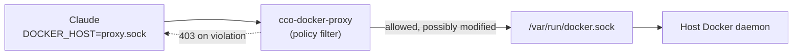
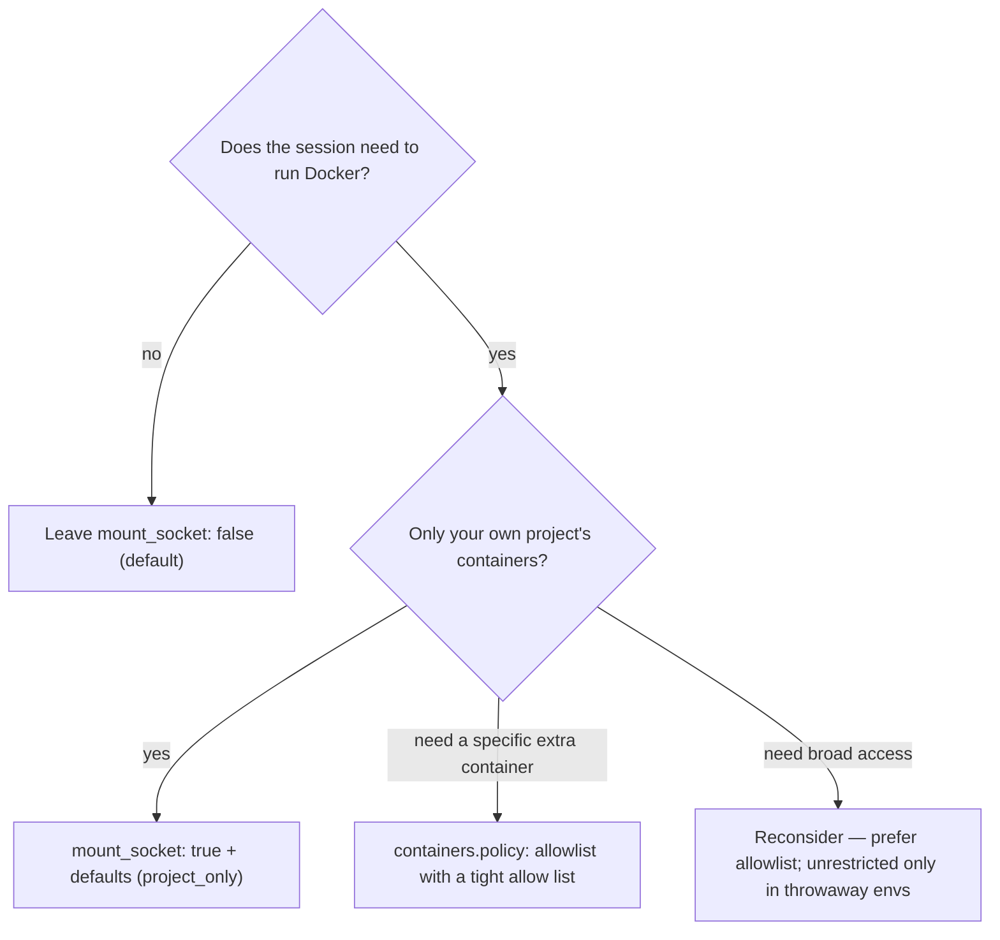

# Docker Socket Security

> What the Docker socket exposes, why it is **off by default**, what cco's socket
> proxy filters, and how to choose a safe configuration.
>
> Related: [project.yml reference](../../configuration/reference/project-yaml.md) |
> [Docker & networking](../../environment/guides/docker-and-networking.md)

---

## 1. What the Docker socket is

`docker.mount_socket` controls whether the host's Docker socket
(`/var/run/docker.sock`) is mounted into the session so Claude can run `docker`
and `docker compose` (Docker-from-Docker — see the
[networking guide](../../environment/guides/docker-and-networking.md#6-running-sibling-containers-docker-from-docker)).

The catch: the Docker socket is effectively **root on the host**. The Docker API
can create privileged containers, bind-mount **any** host path (including
`/`, `/etc/shadow`, the socket itself), and run as any user. A process that can
reach an unfiltered socket can escape the container's isolation entirely. That is
why claude-orchestrator treats the socket as a deliberate, filtered opt-in rather
than a default.

---

## 2. The default: `mount_socket: false`

The socket is **not** mounted unless you ask for it.

```yaml
docker:
  mount_socket: false   # default — Claude has no Docker access
```

With the default, `docker` is unavailable in the session and the whole class of
socket-based escapes does not apply. This is the secure-by-default posture: the
most restrictive option is the implicit one.

**Disable it for a single session** even if `project.yml` enables it:

```bash
cco start myproject --no-docker
```

---

## 3. When to enable it

Turn it on only when your workflow genuinely needs Docker inside the session:

- Spinning up service dependencies (Postgres, Redis, etc.) as siblings.
- Running `docker compose up` for an app under development.
- Building images or running integration tests that drive Docker.

If you just need code editing, tests, or browsing, leave it `false`.

```yaml
docker:
  mount_socket: true    # opt in deliberately
```

---

## 4. What the socket proxy filters

When the socket is mounted, cco does **not** hand Claude the raw socket. A small
Go proxy (`cco-docker-proxy`) sits between Claude and the real socket: the real
socket is reachable only by the proxy (root), and Claude's `DOCKER_HOST` points
at the proxy socket instead. Every Docker API call is inspected against a
generated policy.



The proxy enforces, on container create and related operations:

| Filter | What it does |
|---|---|
| **Container name** | New containers must match the project's `name_prefix` (default `cc-<project>-`). |
| **Container labels** | The project's `required_labels` (default `cco.project: <project>`) are injected; listings are filtered so Claude only "sees" its own containers. |
| **Mount paths** | Bind mounts are validated against the mount policy. `project_only` allows only your project's repo paths; an implicit deny always blocks the socket itself, `/etc/shadow`, `/etc/sudoers`, etc. |
| **Security constraints** | Blocks `--privileged`, blocks sensitive mounts (`/proc`, `/sys`), can drop capabilities (default `SYS_ADMIN`, `NET_ADMIN`) and cap resources (memory, CPUs, max containers). |

A denied request gets a `403` with an explanation; read-only API calls
(`/_ping`, `/version`, GETs) pass through.

---

## 5. Choosing a policy

All of these live under `docker:` in `project.yml` and only take effect when
`mount_socket: true`. Omitting them keeps the secure defaults.

```yaml
docker:
  mount_socket: true

  containers:
    policy: project_only        # project_only | allowlist | denylist | unrestricted
    # allowlist example:
    # policy: allowlist
    # allow: ["cc-myproject-*", "postgres-dev"]

  mounts:
    policy: project_only        # none | project_only | allowlist | any
    deny: ["/etc/shadow"]

  security:
    no_privileged: true
    no_sensitive_mounts: true
    drop_capabilities: [SYS_ADMIN, NET_ADMIN]
    resources:
      memory: "4g"
      cpus: "4"
      max_containers: 10
```

Rules of thumb:

- **Start with the defaults.** `project_only` for both containers and mounts,
  privileged blocked, sensitive mounts blocked — this covers most workflows.
- **Loosen narrowly.** Need to talk to an existing container (e.g. a shared
  database)? Use `containers.policy: allowlist` with a tight `allow:` list rather
  than `unrestricted`.
- **Avoid `unrestricted` / `mounts.policy: any`.** They remove the protection
  the proxy exists to provide; use them only in a fully trusted, throwaway
  environment.
- **Keep `security.*` strict.** Leave `no_privileged` and `no_sensitive_mounts`
  on unless a specific tool truly requires otherwise.

See the [project.yml reference](../../configuration/reference/project-yaml.md)
for every field, its type, and its default.

---

## 6. Quick decision guide



**Safety first:** the socket is full host Docker access. Enable it only when
needed, keep the proxy policy as tight as your workflow allows, and use
`--no-docker` to drop it for any session that doesn't need it.
