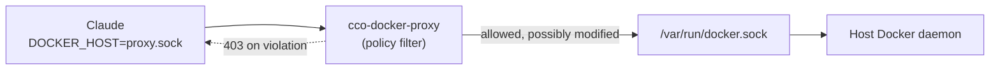
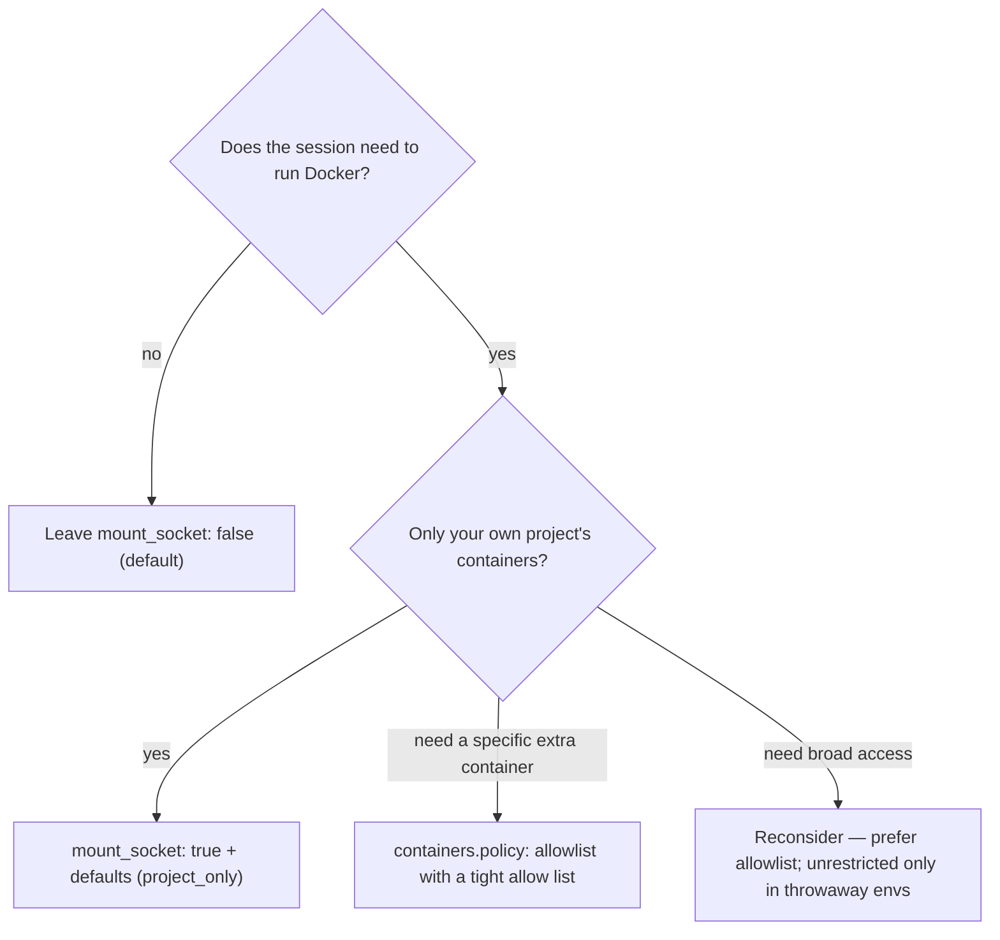

# Docker Socket Security

> What the Docker socket exposes, why it is **off by default**, what cco's socket
> proxy filters, and how to choose a safe configuration.
>
> Related: [project.yml reference](../../configuration/reference/project-yaml.md) |
> [Docker & networking](../../environment/guides/docker-and-networking.md)

---

## 1. What the Docker socket is

`docker.mount_socket` controls whether the host's Docker socket
(`/var/run/docker.sock`) is mounted into the session so Claude can run `docker`
and `docker compose` (Docker-from-Docker — see the
[networking guide](../../environment/guides/docker-and-networking.md#6-running-sibling-containers-docker-from-docker)).

The catch: the Docker socket is effectively **root on the host**. The Docker API
can create privileged containers, bind-mount **any** host path (including
`/`, `/etc/shadow`, the socket itself), and run as any user. A process that can
reach an unfiltered socket can escape the container's isolation entirely. That is
why claude-orchestrator treats the socket as a deliberate, filtered opt-in rather
than a default.

---

## 2. The default: `mount_socket: false`

The socket is **not** mounted unless you ask for it.

```yaml
docker:
  mount_socket: false   # default — Claude has no Docker access
```

With the default, no socket is mounted: the `docker` CLI is still in the image but has
no daemon to reach (`Cannot connect to the Docker daemon`), and the whole class of
socket-based escapes does not apply. This is the secure-by-default posture: the most
restrictive option is the implicit one.

**Disable it for a single session** even if `project.yml` enables it:

```bash
cco start myproject --no-docker
```

---

## 3. When to enable it

Turn it on only when your workflow genuinely needs Docker inside the session:

- Spinning up service dependencies (Postgres, Redis, etc.) as siblings.
- Running `docker compose up` for an app under development.
- Building images or running integration tests that drive Docker.

If you just need code editing, tests, or browsing, leave it `false`.

```yaml
docker:
  mount_socket: true    # opt in deliberately
```

---

## 4. What the socket proxy filters

When the socket is mounted, cco does **not** hand Claude the raw socket. A small
Go proxy (`cco-docker-proxy`) sits between Claude and the real socket: the real
socket is reachable only by the proxy (root), and Claude's `DOCKER_HOST` points
at the proxy socket instead. Every Docker API call is inspected against a
generated policy.


```mermaid
flowchart LR
  CLAUDE["Claude<br/>DOCKER_HOST=proxy.sock"] --> PROXY["cco-docker-proxy<br/>(policy filter)"]
  PROXY -->|allowed, possibly modified| REAL["/var/run/docker.sock"]
  PROXY -. "403 on violation" .-> CLAUDE
  REAL --> DAEMON["Host Docker daemon"]
```

The proxy enforces, on container create and related operations:

| Filter | What it does |
|---|---|
| **Container name** | New containers must match the project's `name_prefix` (default `cc-<project>-`). A create with no name is refused too — Docker's auto-generated name cannot carry the prefix. |
| **Container labels** | The project's `required_labels` (default `cco.project: <project>`) are injected on create; listings are filtered to containers that match the name prefix **or** carry those labels (which is why cco's own session container is visible despite its compose-generated name). |
| **Container access** | Every per-container call — inspect, logs, stats, start/stop, exec, delete — is checked against the same set. A call naming a container outside it is denied, **including read-only ones**. |
| **Mount paths** | Bind mounts are validated against the mount policy. `project_only` allows exactly your project's **`repos:`** host paths — `extra_mounts` are *not* included, so a sibling that needs one requires `policy: allowlist` plus a `mounts.allow` entry. An implicit deny always blocks the socket itself, `/etc/shadow`, `/etc/sudoers`. Sources are translated from container paths to their host equivalents first (see below), then validated. |
| **Networks** | Networks a sibling may create or join must match the project prefix (`cc-<project>`, or your `docker.network`); network listings are filtered the same way. |
| **Security constraints** | Blocks `--privileged`, blocks `/proc` and `/sys` bind mounts, **refuses** a create that adds a dropped capability (default `SYS_ADMIN`, `NET_ADMIN` — the request is denied, not silently stripped), and caps memory, CPUs, and the number of containers. |

**What passes through unfiltered**: `/_ping`, `/version`, `/info`; image, build/BuildKit
and volume endpoints; the follow-up `/exec/{id}/…` calls of an already-validated exec;
and any other route the proxy does not model, **if** the method is `GET` or `HEAD`. Every
other unmodelled write is denied — including some that look routine, such as
`docker network rm`.

A denied request gets a `403` carrying a Docker-style error message
(`cco-docker-proxy: operation denied — <reason>`), so the reason appears in the CLI
output rather than as an opaque failure.

**Path translation.** Bind-mount sources reference the *host* filesystem, but paths you
type inside the session are container paths. The proxy rewrites them using the session's
path map (longest prefix wins), so `docker run -v /workspace/myrepo:/app …` mounts the
right host directory — and the mount policy is evaluated against that host path, not the
container one.

---

## 5. Choosing a policy

All of these live under `docker:` in `project.yml` and only take effect when
`mount_socket: true`. Omitting them keeps the secure defaults.

```yaml
docker:
  mount_socket: true

  containers:
    policy: project_only        # project_only | allowlist | denylist | unrestricted
    # allowlist example:
    # policy: allowlist
    # allow: ["cc-myproject-*", "postgres-dev"]

  mounts:
    policy: project_only        # none | project_only | allowlist | any
    deny: ["/etc/shadow"]

  security:
    no_privileged: true
    no_sensitive_mounts: true
    drop_capabilities: [SYS_ADMIN, NET_ADMIN]
    resources:
      memory: "4g"
      cpus: "4"
      max_containers: 10
```

Rules of thumb:

- **Start with the defaults.** `project_only` for both containers and mounts,
  privileged blocked, sensitive mounts blocked — this covers most workflows.
- **Loosen narrowly.** Need to talk to an existing container (e.g. a shared
  database)? Use `containers.policy: allowlist` with a tight `allow:` list rather
  than `unrestricted`. Note the asymmetry: `allow:` widens which containers may be
  *reached*; **creating** one still requires the `name_prefix` under every policy except
  `unrestricted`.
- **Avoid `unrestricted` / `mounts.policy: any`.** They remove the protection
  the proxy exists to provide; use them only in a fully trusted, throwaway
  environment.
- **Keep `security.*` strict.** Leave `no_privileged` and `no_sensitive_mounts`
  on unless a specific tool truly requires otherwise.

See the [project.yml reference](../../configuration/reference/project-yaml.md)
for every field, its type, and its default.

---

## 6. Quick decision guide


```mermaid
flowchart TD
  Q1{Does the session need to run Docker?}
  Q1 -- no --> A1["Leave mount_socket: false (default)"]
  Q1 -- yes --> Q2{Only your own project's containers?}
  Q2 -- yes --> A2["mount_socket: true + defaults (project_only)"]
  Q2 -- "need a specific extra container" --> A3["containers.policy: allowlist with a tight allow list"]
  Q2 -- "need broad access" --> A4["Reconsider — prefer allowlist; unrestricted only in throwaway envs"]
```

**Safety first:** the socket is full host Docker access. Enable it only when
needed, keep the proxy policy as tight as your workflow allows, and use
`--no-docker` to drop it for any session that doesn't need it.
