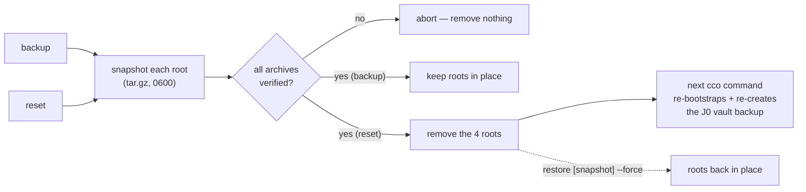
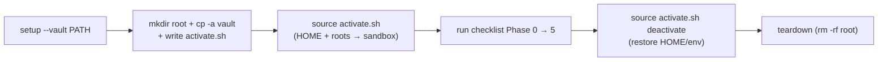

# `scripts/` — maintainer / dogfooding utilities

> ⚠️ **Testing-only.** Nothing here is a shipped `cco` command or meant for end
> users. These are host-side helpers for validating the framework during
> development. They are not installed, not on `PATH`, and not invoked by `cco`.

## `cco-decentralized-state.sh`

Resets a host machine to a pristine **legacy-user** state so the
[decentralized-config e2e checklist](../docs/maintainers/configuration/decentralized-config/e2e-validation-checklist.md)
can be re-run from the very first command (Phase 0: "backup created on the first
command"). It removes the four NEW decentralized-config roots — taking a
**verified, restorable snapshot first** — and leaves the legacy vault untouched.

### What it touches vs. preserves

Roots are resolved **exactly like `cco`** (honouring `CCO_*_HOME` / `XDG_*`):

| Bucket | Default path | Action |
|---|---|---|
| CONFIG | `~/.cco` | snapshot + remove |
| DATA | `~/.local/share/cco` | snapshot + remove |
| STATE | `~/.local/state/cco` (holds the J0 backup + migration marker) | snapshot + remove |
| CACHE | `~/.cache/cco` | snapshot + remove |
| **Vault** | `${CCO_USER_CONFIG_DIR:-<repo>/user-config}` | **never touched** (source of truth) |

It also never touches per-repo `<repo>/.cco/` directories (those are git-managed —
clean them by hand, per repo).

> Why this is safe: the legacy world (`main`/`develop`) lives **entirely** inside
> the vault and never reads `~/.cco` or the XDG buckets. Those four roots are
> created only by the decentralized-config code, so removing them returns the host
> to a pure legacy state. The J0 backup is a *copy* in STATE; the vault is the
> original.

### Lifecycle



### Usage

```bash
scripts/cco-decentralized-state.sh paths        # read-only: show resolved roots
scripts/cco-decentralized-state.sh backup       # snapshot the 4 roots, remove NOTHING
scripts/cco-decentralized-state.sh reset        # snapshot + remove the 4 roots
scripts/cco-decentralized-state.sh list         # list snapshots
scripts/cco-decentralized-state.sh restore --force   # undo: restore latest snapshot
```

The `backup` verb takes the same verified, restorable snapshot as `reset` but
removes nothing — use it for an explicit safety copy before any risky step (it is
non-destructive, so it needs no `-y` and never prompts). `reset` is exactly
`backup` followed by removal of the four roots; both share one snapshot routine.

Options: `-b/--backup-dir DIR` (default `$CCO_RESET_BACKUP_DIR` or
`~/.cco-reset-backups`), `-y/--yes` (skip confirm; **required** when non-interactive),
`-n/--dry-run`, `-f/--force` (restore over existing roots), `-h/--help`.

### Safety model

1. **Snapshot-before-remove, verified.** Every root is archived and integrity-checked
   *before* anything is deleted; a snapshot failure aborts with nothing removed.
2. **Guardrails.** Never `/`, `$HOME` (or an ancestor), the vault, or a path over/under
   the vault; the snapshot store may not live inside a removed root. A default-layout
   root must be a `cco`/`.cco` leaf; explicit `CCO_*_HOME`/`XDG_*` overrides are trusted
   (that is how the e2e sandbox redirects the roots).
3. **Secrets.** Snapshots contain `secrets.env` and the vault tar → archives `0600`,
   snapshot dir `0700`.
4. **Confirmation.** Destructive actions prompt on a TTY; `-y` skips it; without a TTY
   and without `-y` the script dies rather than act unattended (mirrors the cco
   destructive-confirm contract, ADR-0029 D2).

### Typical e2e loop

```bash
scripts/cco-decentralized-state.sh reset -b ~/cco-e2e-snapshots
# …run the e2e checklist (Phase 0 → Phase 5)…
scripts/cco-decentralized-state.sh restore --force      # back to where you were
```

> Prefer the **sandbox** (`cco-sandbox-e2e.sh`, below) when you only need a clean
> run and don't want to disturb your real install. This reset script is for when you
> deliberately want to exercise the **real** host's first-run path.

---

## `cco-sandbox-e2e.sh`

Builds (and tears down) a throwaway **sandbox** for the e2e run: it redirects every
cco root into a disposable directory and seeds it with a **copy** of your real legacy
vault, so the whole migration flow runs without touching your real install. This
automates checklist §1 and fixes its sharp edge — `cp -a` fails unless the sandbox
root exists first, so `setup` creates it before copying.

### Lifecycle



### Usage

```bash
scripts/cco-sandbox-e2e.sh setup --vault ~/path/to/user-config   # build sandbox
source /tmp/cco-dogfood/activate.sh            # enter it in THIS shell (redirects HOME + roots)
cco list ; ls "$CCO_STATE_HOME/cco/backups"    # first command bootstraps + J0 backup
# …run the e2e checklist Phase 0 → 5…
source /tmp/cco-dogfood/activate.sh deactivate # restore HOME/env (or open a new shell)
scripts/cco-sandbox-e2e.sh teardown            # delete the sandbox dir
scripts/cco-sandbox-e2e.sh status              # is a sandbox present / is this shell active?
```

Options: `--vault <path>` (default `$CCO_USER_CONFIG_DIR` or `<repo>/user-config`),
`--root <dir>` (default `$CCO_SANDBOX_ROOT` or `/tmp/cco-dogfood`), `--force` (setup:
replace an existing root), `-y/--yes` (teardown: skip confirm; required non-interactively).

### Why a generated `activate.sh`

`export`s set by a subprocess don't reach your shell, so `setup` writes
`<root>/activate.sh` and you `source` it; `source … deactivate` restores the original
`HOME` and unsets the sandbox vars. Your **real vault is only ever read** (`cp -a`) —
never modified or deleted; `teardown` removes only the sandbox root (guarded: absolute,
≥2 path segments, never a home dir).

### Sandbox vs. the reset script

Use **this** for a disposable run that never disturbs your real install (recommended —
checklist golden rule #1). Use **`cco-decentralized-state.sh`** when you deliberately
want to exercise the **real** host's first-run path (it snapshots + removes the real
roots, restorably).
